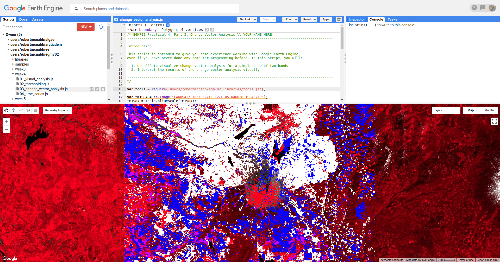
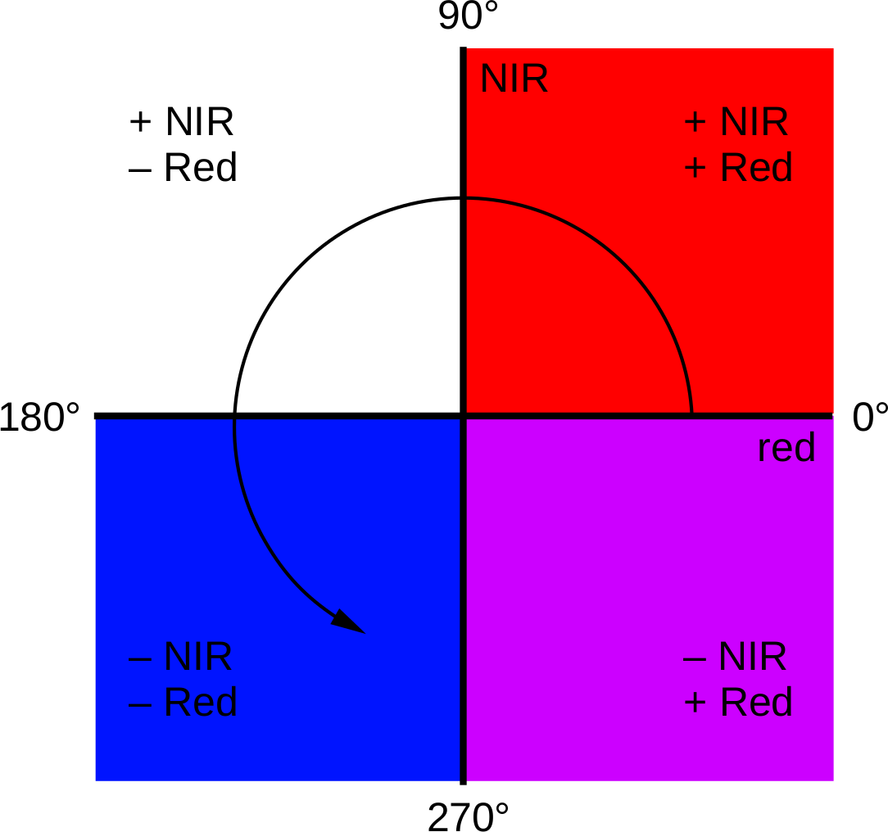

change vector analysis
=======================

For this part of the practical, we’re going to look at the post-eruption recovery using Landsat 5 TM images from 1984 and 2011.
Uncomment the first part of this section (remove the ``/*`` from line 328 and the ``*/`` from line 336):

.. code-block:: javascript

    // select two surface reflectance images, one from 1984 and one from 2011.
    var tm1984 = ee.Image("LANDSAT/LT05/C02/T1_L2/LT05_046028_19840719")
      .select('SR_B.').multiply(0.0000275).add(-0.2).clip(boundary);
    var tm2011 = ee.Image("LANDSAT/LT05/C02/T1_L2/LT05_046028_20110730")
      .select('SR_B.').multiply(0.0000275).add(-0.2).clip(boundary);

Run the script, and have a look at the two images – what do you notice? What changes stand out the most in between the two
images? You might notice that the area North of the peak has regained some vegetation since the 1980 eruptions, or you may
notice some areas of clear-cutting in the surrounding forests. 

To investigate these changes, we’re going to use change vector analysis (CVA). While CVA can be used for any number of band 
differences, we’re going to stick to the differences in NIR and Red reflectance between the two images.

Once you’ve looked around the two images and observed some of the changes, uncomment the next block of code
(remove the ``/*`` from line 337 and the ``*/`` from line 368), which will
compute the difference between the two images and select the NIR and Red bands. It will also calculate the magnitudes and
angles of the change vectors, and re-classify the angles so that the values in the image correspond to the quadrant the angle
falls in.

.. code-block:: javascript

    // compute the difference between the two images, and select bands 4 and 3 (NIR and Red)
    var diff = tm2011.subtract(tm1984).select(['SR_B4', 'SR_B3']);

    // compute the magnitude of the change vectors as the square root of the 
    // sum of the squared differences.
    var magnitude = diff.pow(2).reduce(ee.Reducer.sum().unweighted()).sqrt().rename('magnitude');

    // compute the angle of the change vectors and convert to degrees
    var angle = diff.select('SR_B3').atan2(diff.select('SR_B4'))
      .multiply(180).divide(Math.PI).rename('angle');

    // create a reclassified image of the angles, with the value set to the quadrant
    // each angle range corresponds to.
    var angleReclass = ee.Image(1)
              .where(angle.gt(0).and(angle.lte(90)), 1)
              .where(angle.gt(90).and(angle.lte(180)), 2)
              .where(angle.gt(-90).and(angle.lte(0)), 4)
              .where(angle.gt(-180).and(angle.lte(-90)), 3).clip(boundary);

The next line will mask the reclassified image so that only large changes (magnitude greater than 200) are shown:

.. code-block:: javascript

    // threshold the reclass image by changes w/ magnitude greater than 0.06
    angleReclass = angleReclass.updateMask(magnitude.gte(0.06));

The final block of code will add the difference,magnitude, angle, and re-classified angle images to the map:

.. code-block:: javascript

    Map.addLayer(diff, {bands: 'SR_B4', min: -0.25, max: 0.25, 
      palette: ['7b3294','c2a5cf','f7f7f7','a6dba0','008837']}, 'difference', false);
    Map.addLayer(magnitude, {min: 0.02, max: 1.36, 
      palette: ['f1eef6','d7b5d8','df65b0','dd1c77','980043']}, 'magnitude', false);
    Map.addLayer(angle, {min: -180, max: 180,
      palette: ['e66101','fdb863','f7f7f7','b2abd2','5e3c99']}, 'angle', false);

    Map.addLayer(angleReclass, {palette: ['ff0000','ffffff','0014ff','cc00ff']}, 'reclass angle');

Run the script – you should see this image (you may have to turn off the Landsat scenes first):

In this image, red colors correspond to increases in both NIR and Red reflectance, white corresponds to increases in NIR and
decreases in Red reflectance, purple corresponds to decreases in NIR and increases in Red reflectance, and blue corresponds to
decreases in both NIR and Red reflectance. You can also consult the diagram shown below:

In a number of areas, the blue color represents forest growth. To understand why this is, we have to remember both what
these changes represent – a decrease in both Red and NIR reflectance – and also what the forest is replacing: in many cases,
grassy meadows or new-growth trees, both of which tend to have higher spectral reflectance than conifer forests:

.. image:: ../../../img/egm702/week4/spectral_plot_vis.png
    :width: 600
    :align: center
    :alt: a plot showing spectral reflectance for a variety of surface types

See if you can work out what some of the other differences represent – remember that some changes might represent more
than one kind of change. You can also try looking at the angle image and interpreting it more directly, or changing the
reclassification to represent more angle ranges.

