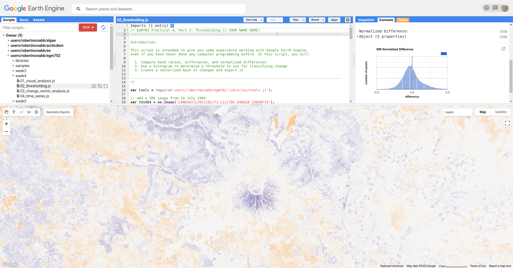
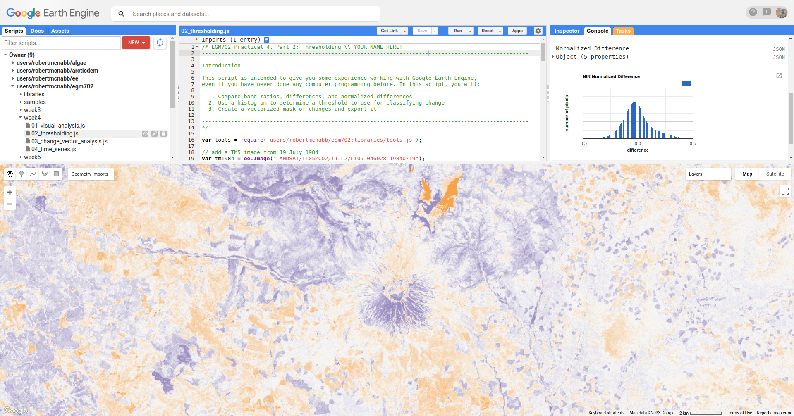
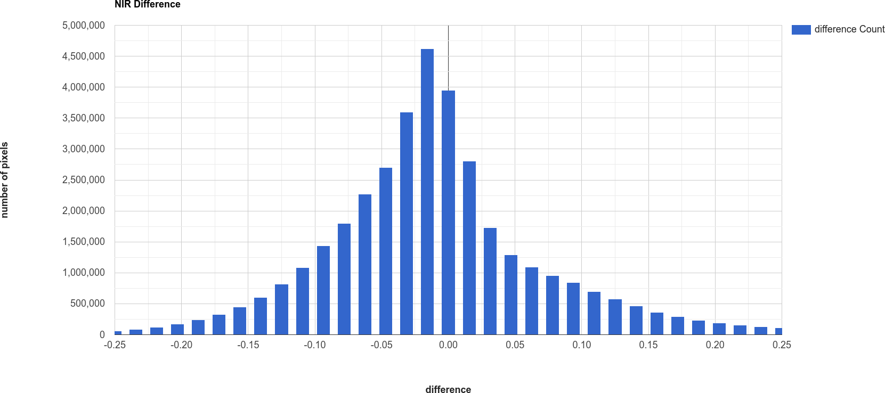
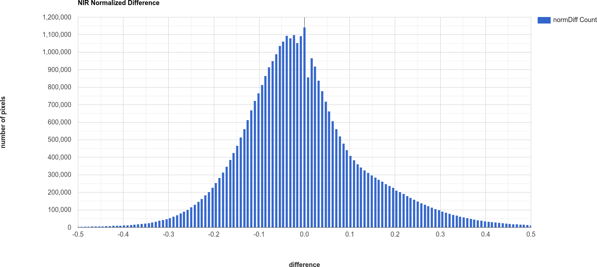
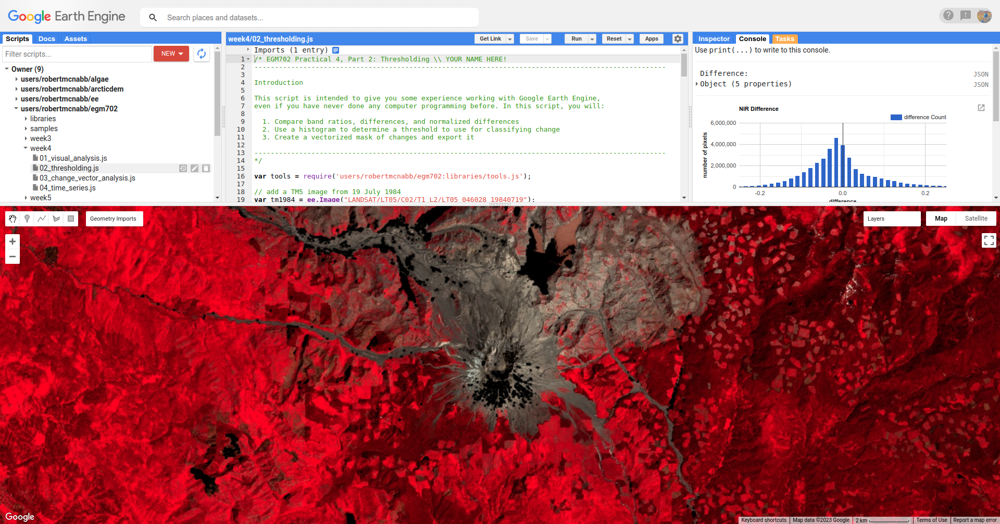

band maths and thresholding
================================

.. tip::

    The script for this tutorial can be found via this `direct link <https://code.earthengine.google.com/?scriptPath=users%2Frobertmcnabb%2Fgee_tutorials%3A03_change_detection%2F02_thresholding.js>`__.

    Alternatively, if you have already added the repository, you can open the script from the **Code Editor**, by
    navigating to ``03_change_detection/02_thresholding.js`` under the **Reader** section.

In this tutorial, we'll see how we can quantify changes using arithmetic operations, comparing the changes
observed using:

- a simple difference
- a band ratio
- a normalized difference

To determine areas where we likely see an increase in vegetation between 1986 and 2022. As in the
:doc:`visual_analysis` tutorial, we'll primarily use the SWIR2 band (TM/OLI Band 7), though feel free to modify the
script for other bands and applications.

The first two examples calculated in the script are the difference and band ratio, using ``ee.Image.subtract()`` and
``ee.Image.divide()``, respectively:

.. code-block:: javascript

    // band maths examples
    var diff = oli2022.select('SR_B7').subtract(tm1986.select('SR_B7')).rename('difference');
    var ratio = oli2022.select('SR_B7').divide(tm1986.select('SR_B7')).rename('ratio');

Now, we use ``ee.Image.cat()`` (`documentation <https://developers.google.com/earth-engine/apidocs/ee-image-cat>`__)
to combine band 7 from each image into a single image:

.. code-block:: javascript

    // add the b7 bands from each year to a single image
    var multitemp = ee.Image.cat([
      tm1986.select('SR_B7').rename('1986_B7'),
      oli2022.select('SR_B7').rename('2022_B7')
    ]);

then we use ``ee.Image.normalizedDifference()`` to calculate the normalized difference between 1986 and 2022:

.. code-block:: javascript

    // create a multi-temporal normalized difference
    var normdiff = multitemp.normalizedDifference(['2022_B7', '1986_B7']).rename('normDiff');

Just like with examples discussed in the :doc:`band maths <../getting_started/band_maths>` tutorial, such as NDVI\ [1]_
or NDWI\ [2]_, this has the effect of stretching the differences so that they vary between -1 and 1, which can help to
enhance the changes that we see between the two dates.

To see this, run the script, then toggle on the ``Difference`` layer:

|br| followed by the ``Normalized Difference`` layer:

|br| Toggle back and forth between the two images - you should notice that while the colors don't change (remember that
the sign is the same for both), the colors in the normalized difference image have been stretched to fill the color
range compared to the difference image.

Remember to look at the ratio image as well - how do the changes that you can see in this image compare to the changes
displayed in the difference and normalized difference images?

In addition to adding the images to the **Map**, we have also printed statistics and histograms for these two images
to the **Console**:

|br| Just like with the images themselves, you should notice that the histogram of the normalized difference image is
spread out, or stretched, over a larger range - as a result, it has a much lower, broader peak than the difference
image.

Click on ``Object`` (under "Difference"/"Normalized Difference") to show the descriptive statistics calculated for the
difference/normalized difference image. Which image has the larger standard deviation? What impact do you think this
might have on determining what pixel values represent "normal variation", and which values represent actual change?

In order to distinguish between "change" and "no change", we have to pick a *threshold* value. Here,
because we are interested in highlighting areas where vegetation has been replaced by built-up areas, we'll pick a
single threshold value and select only pixels where the pixel value is greater than or equal to the chosen
threshold value.

In the script, you should see the following lines of code:

.. code-block:: javascript

    // mask the image based on a threshold
    var mask = normdiff.gte(0.5); // select pixels greater than/equal to upper boundary
    mask.select('normDiff').rename('changeMask');

    mask = mask.updateMask(mask.neq(0));

This uses ``ee.Image.gte()`` to select all pixels in ``normdiff`` with a value greater than or equal to 0.15, then
uses ``ee.Image.mask()`` to mask all pixels of the resulting image where this condition is not met.

Later in the script, we add this layer to the **Map** as ``urban change mask``, then export the vector to a shapefile
format that you can use in your GIS software of choice.

To see what this mask looks like, toggle on the **urban change mask** layer in the **Map**:

|br| You should probably notice that this threshold hasn't managed to capture most of the changes that we can see
between the two dates - the masked areas are limited to the former rice fields south of Foshan, newly-built islands in
the Zhujiang River Estuary, and small patches along some of the other rivers visible in the image.

Hopefully, it's clear that I've deliberately set the threshold too high, which means that a lot of areas of genuine
change have been excluded from the mask.

Using the histogram of the normalized difference image, the descriptive statistics, and a bit of trial and error,
try to improve on this result. The goal is to include as much of the urban change that you can see as possible, while
minimizing differences that are due to natural fluctuations in reflectance.

Once you have a change mask that you feel captures most of the urban growth while minimizing areas where not much
change appears to have happened, be sure to click on the **Tasks** tab and run the task to export the shapefile.

references and notes
---------------------

.. [1] Rouse, J.W., *et al.* (1974). *Proceedings, 3rd Earth Resource Technology Satellite Symposium*, 1, 48-62.
    https://ntrs.nasa.gov/citations/19740022614

.. [2] McFeeters, S. K. (1996). *Int. J. Rem. Sens.*, 17(**7**), 1425–1432.
    doi: `10.1080/01431169608948714 <https://doi.org/10.1080/01431169608948714>`__