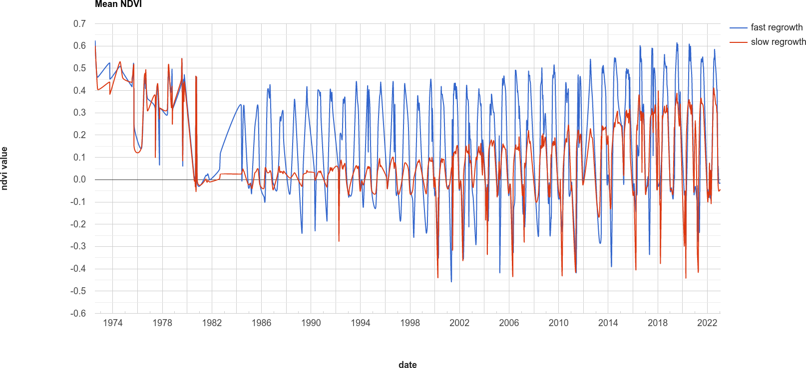
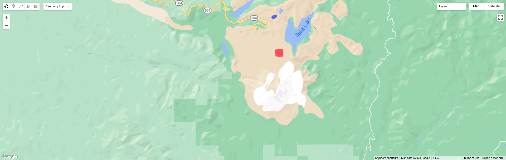
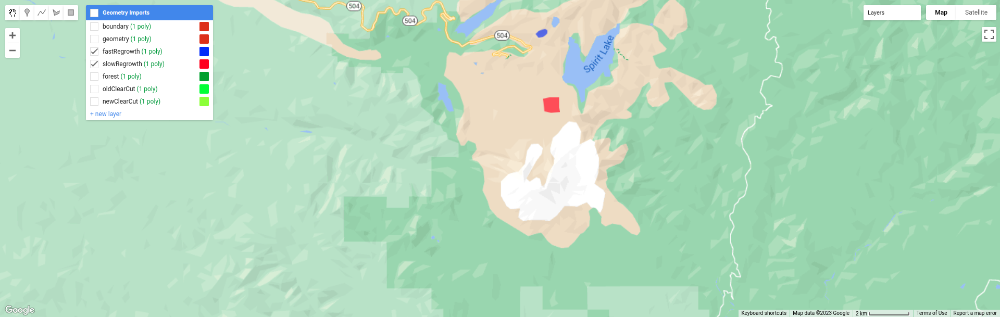
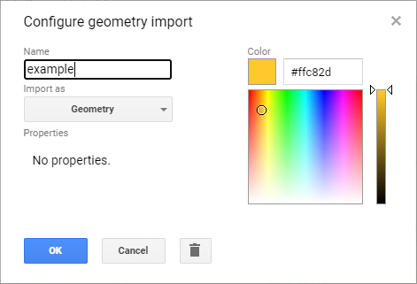
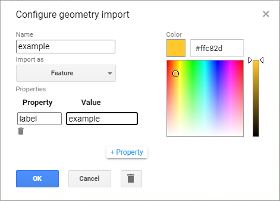
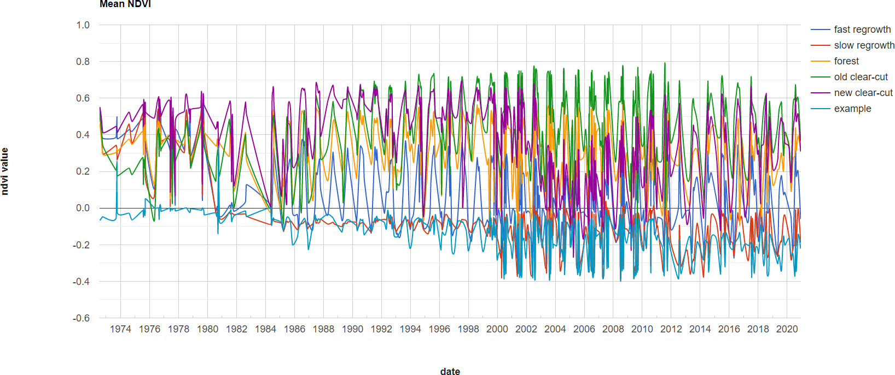

time series analysis
=====================

.. tip::

    The script for this tutorial can be found via this `direct link <https://code.earthengine.google.com/?scriptPath=users%2Frobertmcnabb%2Fgee_tutorials%3A03_change_detection%2F05_time_series.js>`__.

    Alternatively, if you have already added the repository, you can open the script from the **Code Editor**, by
    navigating to ``03_change_detection/05_time_series.js`` under the **Reader** section.

The final portion of this practical will cover how we can get time series of data from images and visually inspect the
results. We'll see how we can compare time series of NDVI values for different land cover polygons, and compare the
results that we see with the polygon locations in images at the beginning and end of the time series.

.. code-block:: javascript

    var ndvi_patches = ee.FeatureCollection([fastRegrowth, slowRegrowth,
      forest, oldClearCut, newClearCut]);

The next sections of code here deal with loading Landsat images and filtering based space and cloud cover, similar to
what we have done in previous steps. After this section, these lines of code:

.. code-block:: javascript

    // combine tm, etm+, oli, and mss images, add an NDVI band, and sort by date.
    var allNDVI = mss.map(mssNDVI).merge(tm.merge(oli).map(getNDVI))
      .select('NDVI').sort('system:time_start');

merge the MSS, TM, ETM+, and OLI image collections, calculate the NDVI for each image, and sort by acquisition date.
We also pull out the first image in the series (a Landsat 1 MSS image from 1972), and the last (latest) image in the
time series, and add both of these to the **Map** for visualization.

Finally, this block of code:

.. code-block:: javascript

    // plot a chart of the mean ndvi values, calculated using different polygons
    // representing different landcover areas
    var ndviChart = ui.Chart.image
      .seriesByRegion({
        imageCollection: allNDVI,
        regions: ndvi_patches, // average using the features in each ndvi patch
        reducer: ee.Reducer.mean(),
        seriesProperty: 'label', // use the label values to plot individual series
        scale: 100,
        xProperty: 'system:time_start'})
      .setOptions({
        title: 'Mean NDVI',
        hAxis: {title: 'date', titleTextStyle: {italic: false, bold: true}},
        vAxis: {title: 'ndvi value', titleTextStyle: {italic: false, bold: true}},
        curveType: 'function'})
      .setSeriesNames(['ndvi']);
    print(ndviChart);

creates a chart that will plot the average values for each of the individual polygons in ``ndvi_patches``. You can see
what this looks like below. Note that some of the apparent lack of seasonality before about 2000 is mostly a result of
the lower temporal resolution – Landsat acquisitions were often limited during this time, and so some years will only
have a few available images.

|br|

.. tip::

    If you open the chart (click on the icon in the upper right-hand corner), you can also export the data as a CSV
    file for further analysis.

Next, let's try a different combination of polygons. To do this, we'll need to change the code at line 17:

.. code-block:: javascript

    var ndvi_patches = ee.FeatureCollection([fastRegrowth, slowRegrowth]);

Instead of looking at the ``fastRegrowth`` and ``slowRegrowth`` features, let's look at the ``fastRegrowth`` and
``oldClearCut`` polygons.

.. note::

    To visualize where the ``newClearCut`` polygon is, you can toggle it on from the **GeometryImports** menu.

To change the polygons that we use for the plot, replace ``slowRegrowth`` with ``oldClearCut`` at line 17, then
re-run the script:

.. code-block:: javascript

    var ndvi_patches = ee.FeatureCollection([fastRegrowth, oldClearCut]);

.. card::
    :class-header: question
    :class-card: question

    :far:`circle-question` Question
    ^^^

    - Compare the ``fastRegrowth`` NDVI towards the end of the time series with the ``oldClearCut`` NDVI near the
      beginning of the time series. Do you think these represent similar land cover types? Why or why not?
    - Now, compare the ``fastRegrowth`` location in the ``Last`` (latest) Landsat image, and the ``oldClearCut`` polygon
      location in the ``First`` (oldest) Landsat image. Do you think these represent similar land cover types? Why or
      why not?
    - Using the polygon location and the ``Last`` (latest) Landsat image, what kind of land cover does the
      ``oldClearCut`` polygon represent now? Why do you think this?

To add your own polygons, or to edit the polygons that are already included in the script, you can use the digitizing
tools located in the upper left-hand corner of the map panel:

|br| If you're adding your own polygon, be sure to start the polygon as a new layer (click on **+ new layer** at the
bottom of the **Geometry Imports** panel):

|br| Next, start digitizing a polygon – try to make sure that the polygon represents one type of area. Remember that
you can use the Landsat images, as well as the background satellite images, to help you. From the **Geometry Imports**
panel, click the gear icon next to your new layer to change the properties:

|br| Change the name to something other than ``geometry`` (or ``example``), then change it to **Import as** a
``Feature``, and click to add property to the feature. Call it ``label``, and add a value for the label.

|br| Click **OK**, then digitize your polygon (if you haven’t already). Note that each feature can only contain a
single polygon – to add multiple polygons, you’ll need to create multiple features. You can then update the
``ndvi_patches`` variable (line 17) and re-run the script to update the chart:

|br| Feel free to try different polygons, and examine the different time series plots – try using the CVA angle map to
help you decide areas to look further into.

This is the end of this Practical – next week, we’ll look into using Earth Engine to do some more advanced classification
techniques, and run an accuracy analysis on the results.

