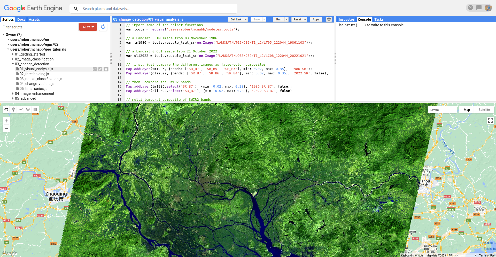
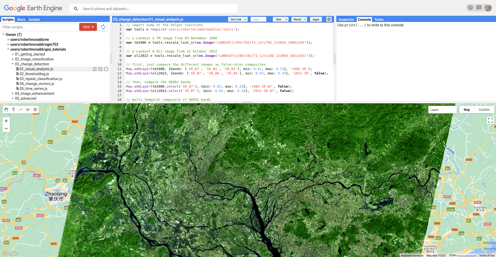
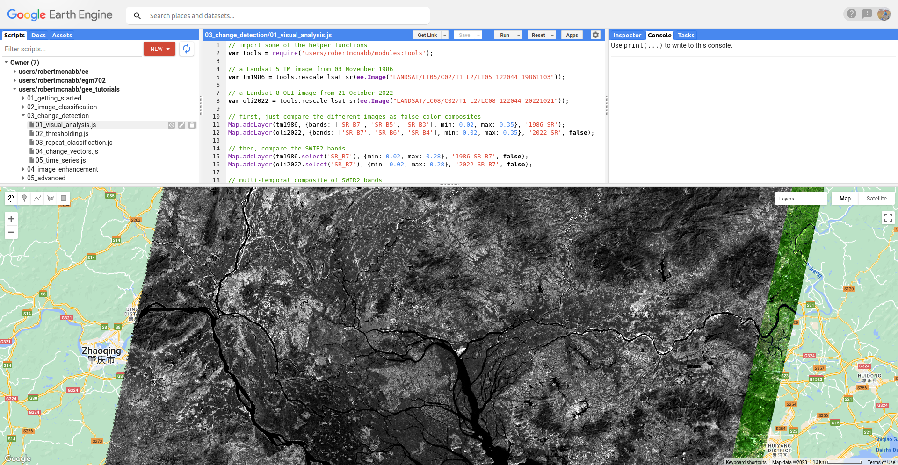
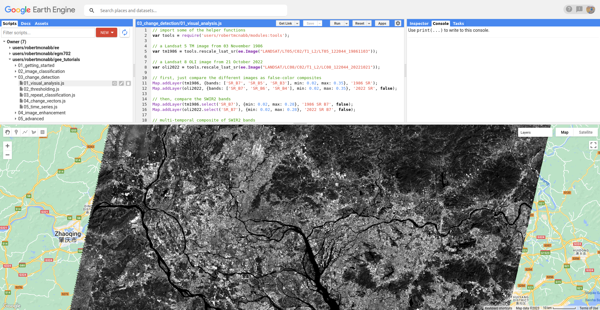
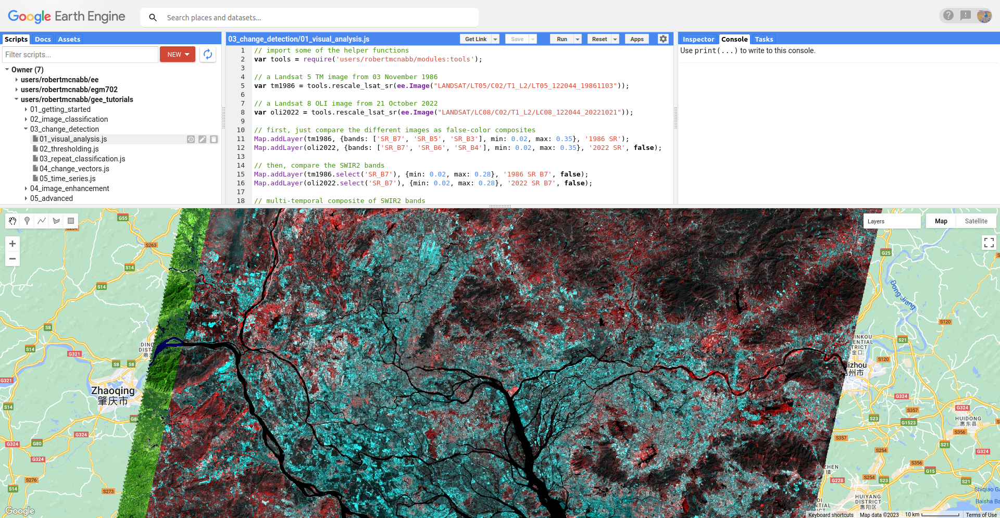

visual analysis of changes
============================

.. tip::

    The script for this tutorial can be found via this `direct link <https://code.earthengine.google.com/?scriptPath=users%2Frobertmcnabb%2Fgee_tutorials%3A03_change_detection%2F01_visual_analysis.js>`__.

    Alternatively, if you have already added the repository, you can open the script from the **Code Editor**, by
    navigating to ``03_change_detection/01_visual_analysis.js`` under the **Reader** section.

To begin, we'll look at a few ways that we can analyze change visually by comparing:

- false-color composite images from different dates
- individual bands from different dates
- multi-temporal false color composites

The two images we will use are a Landsat 5 Thematic Mapper (TM) image acquired 03 November 1986 and a Landsat 8 OLI
image acquired 21 October 2021, covering the Pearl River Delta in China. Since the late 1970s, the population of this
region went from around 10 million to an estimated 74 million people in 2022.

In the script, we first use ``tools.rescale_lsat_sr`` to re-scale the 16-bit integer values of the two images:

.. code-block:: javascript

    // a Landsat 5 TM image from 03 November 1986
    var tm1986 = tools.rescale_lsat_sr(ee.Image("LANDSAT/LT05/C02/T1_L2/LT05_122044_19861103"));

    // a Landsat 8 OLI image from 21 October 2022
    var oli2022 = tools.rescale_lsat_sr(ee.Image("LANDSAT/LC08/C02/T1_L2/LC08_122044_20221021"));

When you run the script, you should see the following view in the **Map**:

|br| This is a SWIR2/SWIR1/Red false color composite (TM Bands 7, 5, 3; OLI bands 7, 6, 4), which is useful for
highlighting urban areas. You should see that in this color composite, vegetation appears different shades of green,
water appears black (depending on turbidity), and urban areas are kind of a lighter gray color. Part of what makes this
color combination so useful in studying urban areas is that the influence of atmospheric pollutants such as smog or
smoke is diminished due to the longer wavelengths of the SWIR bands.

This first image is from November 1986. At this time, we can see that a good deal of the area in the image is vegetation,
with some larger urban areas scattered around the middle of image. Also noticeable are the dark green regions south of
the city of Foshan in the lower left of the image - these are flooded rice paddies (fields), and they appear dark
because of the mix of vegetation and water surfaces (remember that water has almost no reflectance at SWIR wavelengths).

Now, toggle the ``2022 SR`` layer on from the **Layers** menu. You should see the following image:

|br| From just this view, it is evident that there has been a tremendous amount of change in this region. Much of the
area that we identified as rice paddies south of Foshan in 1986 has been urbanized, though built-up areas have expanded
over most of the area covered by the two images.

Once you have had a look at the false color composite images, have a look at the SWIR2 (TM/OLI Band 7) images, by
toggling on ``1986 SR B7`` and ``2022 SR B7``. You should notice somewhat similar patterns to the false color images.

Much of the areas that are vegetation in the 1986 image appear somewhat dark in the SWIR2 band:

|br| In comparison, these areas appear much brighter in the 2022 image as natural surfaces have been replaced with
concrete or asphalt:

|br|

.. note::

    When visually inspecting images for changes, we normally want the images to be visualized in the same way - that
    way, we know that the differences that we're seeing are differences in reflectance, and not in the visualization.

    To illustrate this, try changing the stretch on ``2022 SR B7`` so that it ranges from 0.02 to 0.65, rather than
    0.28. You should notice that now, it appears that the 2022 image is darker than the 1986 image, giving the mistaken
    impression that SWIR2 reflectance has decreased, when in fact the opposite is true.

Visually comparing bands like this is one way that we can see the differences between color composites or individual
bands. But, we can also construct something called a multi-temporal false color composite to visualize changes
between images using a single composite image.

To illustrate this, we again use the SWIR2 bands. First, we create a new image that has bands from both time periods:

.. code-block:: javascript

    // multi-temporal composite of NIR bands
    var multitemp = ee.Image.cat([
      tm1986.select('SR_B7').rename('1986_B7'),
      oli2022.select('SR_B7').rename('2022_B7')
    ]);

Then, we add the image to the **Map**, with the red channel showing the 1986 reflectance, and the green and blue
channels showing the 2022 reflectance:

.. code-block:: javascript

    // add the multi-temporal composite to the map
    Map.addLayer(multitemp, {bands: ['1986_B7', '2022_B7', '2022_B7'], min: 0.02, max: 0.28},
      'Multi-temporal composite', false);

To see the image, toggle ``Multi-temporal composite`` on in the **Layers** menu:

|br| In the above image, areas where the reflectance is higher in the 1986 image are shaded red, and areas where the
reflectance is higher in the 2022 image are shaded blue. Areas where the the images are the same are shades of gray,
with the brightness determined by the common reflectance.

Here, we see that most of the area in the middle of the image is blue, consistent with our observations from the
individual bands, as well as the false color composites. Interestingly, most of the original urban core areas appear
red - can you think of why this might be?

Visually inspecting images for differences can be an excellent way to notice changes - our eyes can be quite sensitive
to subtle differences in appearance between images. However, it is not always the most effective/efficient way to
quantify changes - for this, we'll look at other methods.

