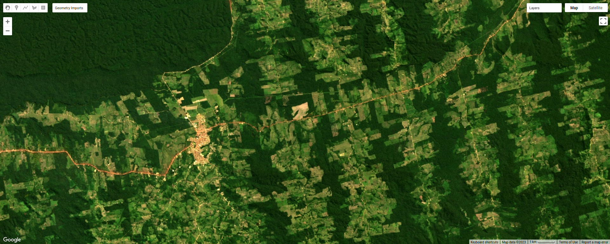
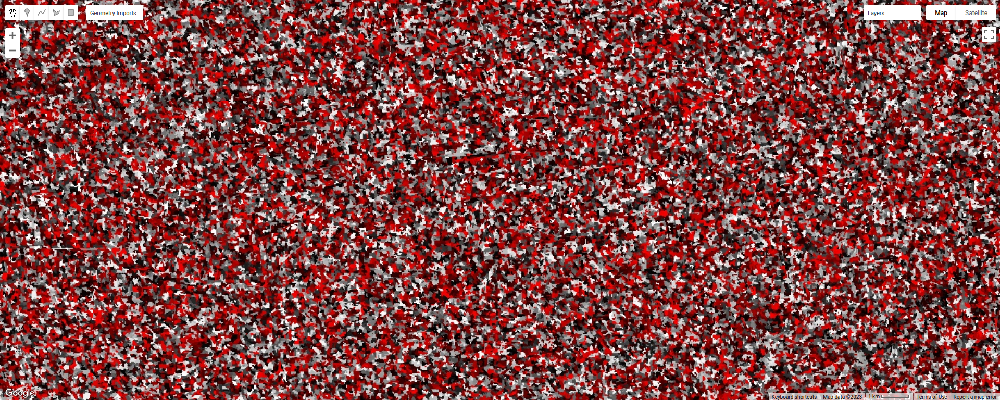
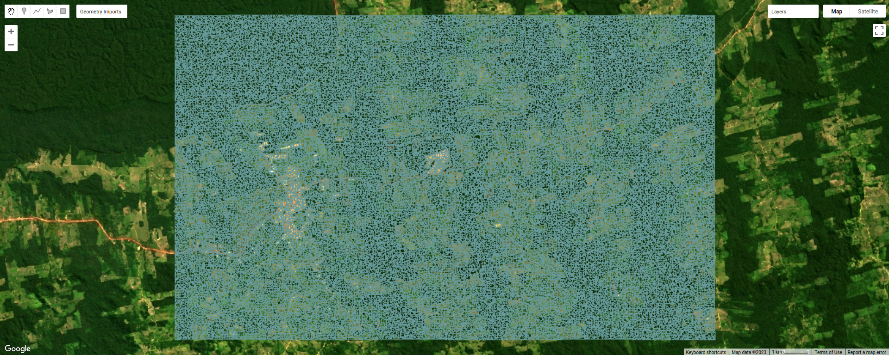
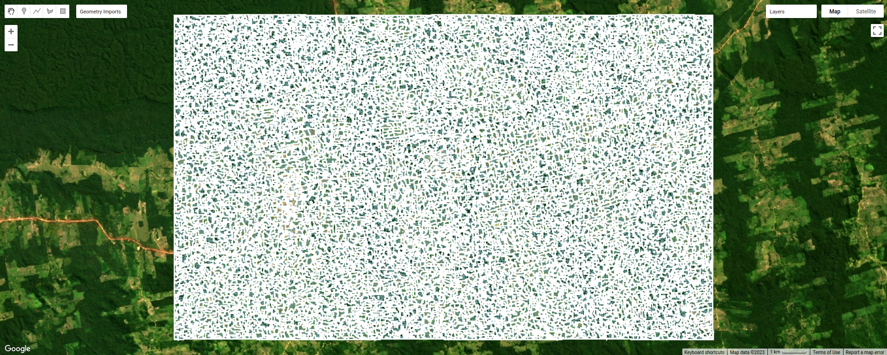
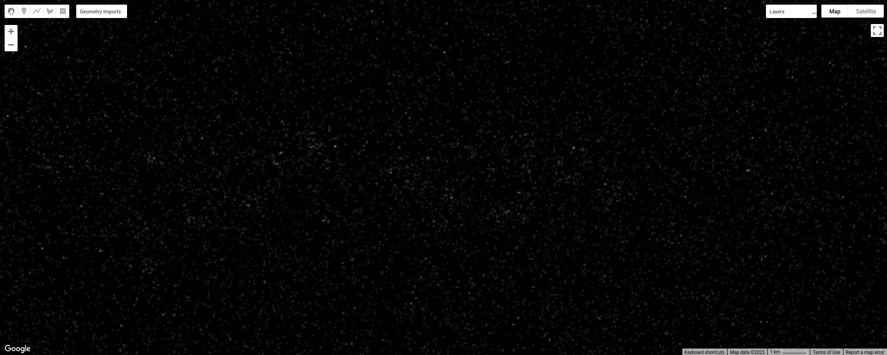
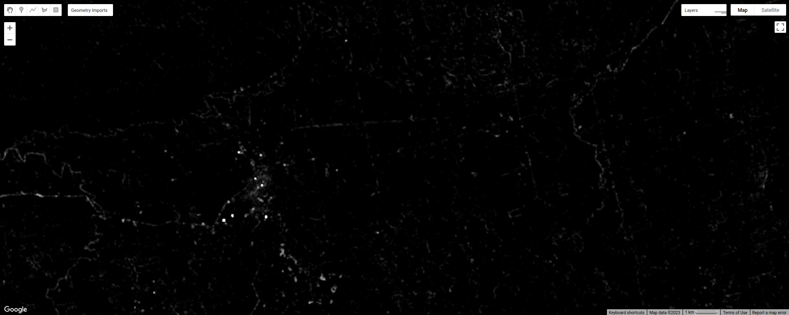
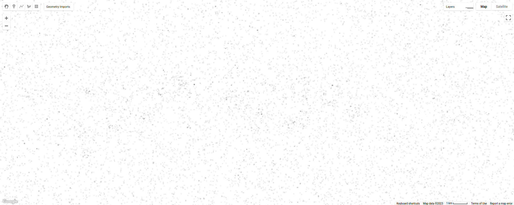
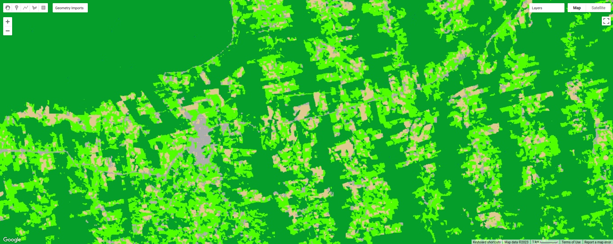
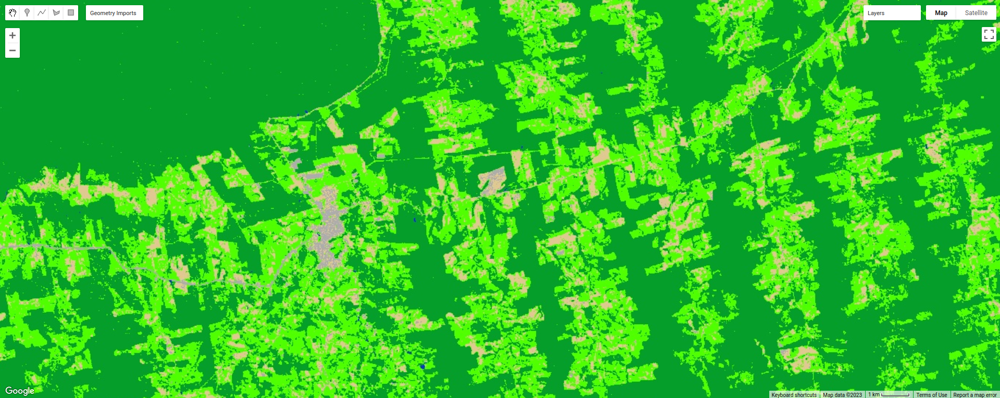

object-based classification
==================================

.. tip::

    The script for this tutorial can be found via this `direct link <https://code.earthengine.google.com/?scriptPath=users%2Frobertmcnabb%2Fgee_tutorials%3A02_image_classification%2F03_obia.js>`__.

    Alternatively, if you have already added the repository, you can open the script from the **Code Editor**, by
    navigating to ``02_image_classification/03_obia.js`` under the **Reader** section.

In this tutorial, we'll look at doing an object-based classification of the Landsat 8 image we used in the pixel-based
classification. This is a Landsat 8 image acquired on 24 June, 2020, covering a portion of the Amazon Rainforest
south of Santarém, Brazil.

Object-based classification is a *supervised* classification technique, where we first have to train the computer how
to classify the image based on its characteristics, before classifying each pixel of the image. The difference between
an object-based classification and a pixel-based classification is that in the object-based classification, we first
have to divide the image into objects, or *segments*, before we train and apply the classifier.

By the end of this tutorial, you should be able to use Earth Engine to:

- use simple non-iterative clustering (SNIC) to segment an image
- select points to train a **Classifier**
- train and apply a **Classifier** to a satellite image
- evaluate the accuracy of a classification
- create a chart that shows the area by class
- plot spectral signatures of training classes

image segmentation
-------------------

In this part of the practical, we'll take a look at an example of object-based classification to help illustrate some
of the differences between object-based image analysis (OBIA) and pixel-based classification. To help speed up the
time it takes to render the images, I've zoomed in on a smaller region around the city of Rurópolis:

|br| The first sections of this script should look similar to the pixel-based script - we use ``require()`` to import
different modules, rescale the surface reflectance image, add the image to the **Map**, and create some training points
to use to train the classifier.

The first major difference comes at line 20:

.. code-block:: javascript

    // set parameters for the size of the seeds and clusters for image segmentation
    // 4 appears to be the minimum value for seed size
    var seedSize = 4; //corresponds to 4 * 30 = 120 m spacing;
    var clusterScale = 30;

This is where we set the parameters for the size of the seed grid used to segment the image. We're using an algorithm
called simple non-iterative clustering (SNIC; Achanta and Susstrunk, 2017\ [#snic]_) to segment our image, creating
the objects that we'll use for the classification.

This section starts by setting two parameters, ``seedSize`` and ``clusterScale``. I've added these here, rather than
using the values directly in the code below, so that it's easier to change the values if we want to experiment later on.

Next, we actually run SNIC on the image, using the surface reflectance bands. First, we use
``ee.Algorithms.Image.Segmentation.seedGrid`` (`documentation <https://developers.google.com/earth-engine/apidocs/ee-algorithms-image-segmentation-seedgrid>`__)
to create a layer to seed the segmentation algorithm, before using ``ee.Algorithms.Image.Segmentation.SNIC``
(`documentation <https://developers.google.com/earth-engine/apidocs/ee-algorithms-image-segmentation-snic>`__)
to actually segment the image:

.. code-block:: javascript

    // create a layer to seed the segmentation algorithm
    var seeds = ee.Algorithms.Image.Segmentation.seedGrid(seedSize);

    // run simple non-iterative clustering (SNIC) on the image, using our seed layer
    var snic = ee.Algorithms.Image.Segmentation.SNIC({
      image: img.select('SR_B.'),
      compactness: 0, // create objects using only spectral characteristics
      connectivity: 4, // don't create objects using diagonal pixels
      neighborhoodSize: 128,
      seeds: seeds
    });

To help visualize the clusters, I've added three layers to the **Map**. The first, ``clusters``, shows the clusters
created using the chosen parameters, including the original seed size of 4 (roughly 4 * 30 = 120 m spacing):

|br| The second, ``segments``, shows the outlines of the clusters in a small region of the image. First, we use
``ee.Image.reduceToVectors()`` (`documentation <https://developers.google.com/earth-engine/apidocs/ee-image-reducetovectors>`__)
to create a vector corresponding to each cluster:

.. code-block:: javascript

    // visualize the clusters by creating vectors, then displaying the outlines
    var vectors = clusters.reduceToVectors({
      geometryType: 'polygon',
      reducer: ee.Reducer.countEvery(),
      scale: clusterScale,
      maxPixels: 1e16,
      geometry: subregion,
    });

Then, we create an empty **Image** and "paint" the edges of each vector using ``ee.Image.paint()``
(`documentation <https://developers.google.com/earth-engine/apidocs/ee-image-paint>`__):

.. code-block:: javascript

    // initialize an empty image
    var empty = ee.Image().byte();

    // paint the edges of the segments
    var outline = empty.paint({
      featureCollection: vectors,
      color: 1,
      width: 1
    });

To see what this looks like, toggle this layer on in the **Map**, then zoom in:

|br| Finally, to illustrate the impact of the ``seeds`` parameter in ``ee.Algorithms.Image.Segmentation.SNIC``, we re-run
these steps using twice the original seed size:

.. code-block:: javascript

    // now, do the same as above but for a larger scale to see how the size of the objects changes
    // create a layer to seed the segmentation algorithm
    var coarse_seeds = ee.Algorithms.Image.Segmentation.seedGrid(2 * seedSize);

To see the impact of changing the size of the seed grid, toggle the ``coarse segments`` layer on:

|br| How do the object boundaries you see relate to the image underneath? Do they agree? Are there areas where the
boundaries vary significantly from what you can see in the underlying image?

This is something to keep in mind - the scale of our segmentation determines the size of the objects that we end up
with. If we segment the image too coarsely, we may end up losing detail that we're interested in.

object texture and contrast
----------------------------

One of the things that we can do with OBIA that is more difficult to incorporate into pixel-based analysis is use image
properties such as texture or contrast, or even the shape of our segments, to aid our classification.

Here, we'll have a look at including texture into our classification using metrics extracted using the Gray Level
Co-occurrence Matrix (GLCM; Haralick et al., 1973\ [#glcm]_). The GLCM contains information about how frequently
combinations of pixel values appear in a specified relationship in the image. We can use this, and the statistical
metrics that we can extract from the GLCM, to analyze the texture of the image.

Here, we'll look at three examples: the Angular Second Moment (ASM), the local contrast, and the entropy. The ASM
measures how many repeated pairs of values we see within each small window. The local contrast tells us how much
variation we see in the small area, and the entropy measures the randomness of the values in each small window.

Before we compute the GLCM, we make a grayscale image from the NIR, Red, and Green bands, following
Tassi and Vizzari (2020)\ [#gray]_:

.. code-block:: javascript

    // create a grayscale image to run texture on, following Tassi and Vizzari (2020)
    // paper: https://doi.org/10.3390/rs12223776
    // GEE script: https://code.earthengine.google.com/?accept_repo=users/mvizzari/Tassi_Vizzari_RS2020
    var gray = img.expression(
      '(0.3 * NIR) + (0.59 * R) + (0.11 * G)',
      {'NIR': img.select('SR_B5'),
       'R': img.select('SR_B4'),
       'G': img.select('SR_B3')
    }).rename('gray');

    Map.addLayer(gray, {min: 0.02, max: 0.15}, 'grayscale', false);

this helps simplify the process, as there is often redundant information in nearby bands.

Once we've created this layer, we compute the GLCM and display the three images we're interested in (the ASM, Contrast,
and Entropy). First, we have to undo the re-scaling that we did earlier, because ``ee.Image.glcmTexture()``
(`documentation <https://developers.google.com/earth-engine/apidocs/ee-image-glcmtexture>`__) works much better with
integer images.

We also use ``ee.Image.reproject()`` (`documentation <https://developers.google.com/earth-engine/apidocs/ee-image-reproject>`__)
to fix the projection scale to be 30 m. Without this, when we zoom in/out on the image, the scale over which the GLCM
parameters are calculated changes.

.. code-block:: javascript

    // get the GLCM for the grayscale image
    var glcm = gray.add(0.2).divide(0.0000275) // re-scale to Int16 values
      .toInt().glcmTexture({size: 2})
      .reproject({crs: gray.projection(), scale: 30}); // fix the projection scale

    print('GLCM Image', glcm);
    Map.addLayer(glcm.select('gray_asm'), {min: 0.0281, max: 0.0354}, 'ASM', false);
    Map.addLayer(glcm.select('gray_contrast'), {min: 3e5, max: 5e6}, 'Contrast', false);
    Map.addLayer(glcm.select('gray_ent'), {min: 3.391, max: 3.577}, 'Entropy', false);

The result of this is an image, ``glcm``, that contains 18 variables for each band in the original image. For a full
list of the variables, you can see the
`documentation <https://developers.google.com/earth-engine/apidocs/ee-image-glcmtexture>`__.

Finally, have a look at the images that have been loaded in the map: the Angular Second Moment (ASM), the Contrast, and the Entropy.
Take a look at the ASM image first:

|br| This tells us something about the repeated pairs of values within the specified window (here, a
window of size 2) - brighter colors indicate higher values (more repeated values), darker colors indicate lower values
(fewer repeated values).

Where do you see the most repeated values (brightest "colors")? What surfaces do these values represent, and why do you
think this would be so?

Look at the grayscale image (toggle it on in the **Layers**). How does the image that you see here compare to the ASM
image? That is, where do you see more variation in the "color" values?

Now, have a look at the ``contrast`` layer:

|br| Here, the bright colors represent the greatest contrast (i.e., difference) in values within the given window.
In a way, this is showing us the same sort of information as the ASM layer - high contrast indicates more variation
(and therefore fewer repeated values), while low contrast indicates less variation (and therefore more repeated values).

Finally, have a look at the ``entropy`` layer:

|br| This is almost the inverse of the ASM layer - areas with high ASM values typically have lower entropy. This makes
some level of sense, given that more repeat values implies that the distribution is likely less random than values that
are more spread out.

Try to compare the three images some more. What patterns do you see in the contrast image? How could you use the
texture information to help differentiate between, for example, the forest and the clear-cut areas?

After this, we can add the texture bands to our image (lines 124-127):

.. code-block:: javascript

    img = img.addBands(glcm.select('gray_asm'))
      //.addBands(glcm.select('gray_contrast')) // uncomment to add contrast
      //.addBands(glcm.select('gray_ent')); // uncomment to add entropy

To start with, we've only added the ASM layer. Once we've had a look at those results, we can see how adding additional
texture layers changes the classification results.

Now that we've segmented the image and had a look at the image texture, we'll move on to actually classifying the image
using OBIA.

This block of code:

.. code-block:: javascript

    // get the mean, std, and median values of all bands for each object
    var img_mean = img.reduceConnectedComponents({
      reducer: ee.Reducer.mean(),
      labelBand: 'id'
    });

    var img_std = img.reduceConnectedComponents({
      reducer: ee.Reducer.stdDev(),
      labelBand: 'id'
    });

    var img_med = img.reduceConnectedComponents({
      reducer: ee.Reducer.median(),
      labelBand: 'id'
    });

    var pred_bands = ee.Image.cat([
      img_mean,
      img_std,
      img_med
    ]).float();

Shows the other main difference between the pixel-based classification and the object-based classification. Here, we're
using a statistical description of the pixel values that fall within each object (mean, median, standard deviation),
rather than the pixel values themselves.

Other than that, the remaining steps are the same for the object-based classification. We're using a random forest
classification, splitting the training points into training and testing partitions, training the classifier, and then
applying the classifier to the image.

|br| Zoom in on the classified image. What differences do you notice between the pixel-based classification from the
previous exercise and the object-based classification? What about the error/accuracy metrics? How do the results for
the two approaches compare? For comparison, here's the same region with the pixel-based classification shown:

|br| Otherwise, just like with the pixel-based script from earlier, this script initiates a **Task** to export the
classified image to your google drive for further analysis in your GIS software of choice. To start the task,
click on the **Tasks** tab, then click **Run**.

.. note::

    I have omitted the additional analysis steps (calculating classified area, plotting spectral signatures, etc.) from
    this exercise, because the segmentation and texture analysis steps frequently cause ``User memory limit exceeded``
    errors.

next steps
------------

- Try varying the number of 'trees' used in the random forest classifier. How does this impact the estimated accuracy
  of the classification?
- You can also try adding different texture measures by uncommenting lines 128 and 129 of the script, along with
  line 147, which will add the contrast (``gray_contrast``) and entropy (``gray_ent``) bands to the classification.
- Test how does adding additional bands such as the surface temperature or the NDVI affects the classification.
  Remember to first add these bands to the image (lines 125--127), as well as to the list of bands to use in the
  classifier (line 147). Try different combinations of band/indices - you may find that some additional bands help
  more than others.

notes and references
----------------------

.. [#snic] Achanta, R. and S. Susstrunk (2017). In *Proc. IEEE Conf. Comp. Vis. Patt. Recog.*, pp. 4651--4660.
    doi: `10.1109/CVPR.2017.520 <https://doi.org/10.1109/CVPR.2017.520>`__
    [`open-access pdf <https://openaccess.thecvf.com/content_cvpr_2017/papers/Achanta_Superpixels_and_Polygons_CVPR_2017_paper.pdf>`__]

.. [#glcm] Haralick, R. M., K. Shanmugam and I. Dinstein (1973). *IEEE Trans. Systems, Man, Cybernetics*,
    SMC-3(**6**), pp. 610-621. doi: `10.1109/TSMC.1973.4309314. <http://doi.org/10.1109/TSMC.1973.4309314>`__

.. [#gray] Tassi, A. and M. Vizzari (2020). *Rem. Sens.* 12, 3776. doi: `10.3390/rs12223776 <https://doi.org/10.3390/rs12223776>`__

