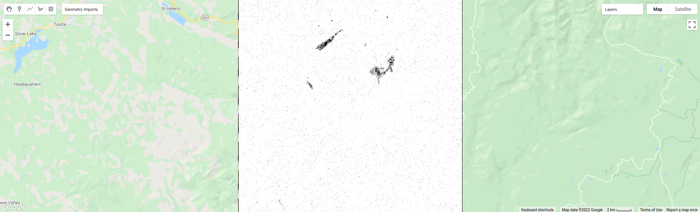
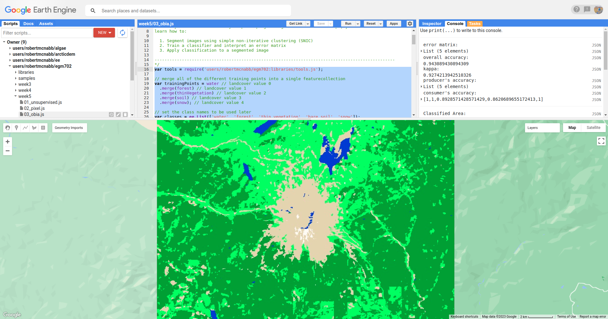

object-based classification
==================================

image segmentation
-------------------

The last few sections of the practical will take us through an example of object-based classification, to illustrate some of the differences
between object-based image analysis (OBIA) and pixel-based classification.

Start by uncommenting the first part of this section (remove the ``/*`` from line 203 and the ``*/`` from line 241). The following lines of code:

.. code-block:: javascript

    // set parameters for the size of the seeds and clusters for image segmentation
    // 4 appears to be the minimum value for seed size
    var seedSize = 4; //corresponds to 4 * 30 = 120 m spacing;
    var clusterScale = 30;

    // create a layer to seed the segmentation algorithm
    var seeds = ee.Algorithms.Image.Segmentation.seedGrid(seedSize);

    // run simple non-iterative clustering (SNIC) on the image, using our seed layer
    var snic = ee.Algorithms.Image.Segmentation.SNIC({
      image: img.select('SR_B.'),
      compactness: 0,
      connectivity: 4,
      neighborhoodSize: 128,
      seeds: seeds
    });

will use an algorithm called simple non-iterative clustering (SNIC; Achanta and Susstrunk, 2017\ [3]_) to segment our image, 
creating the objects that we'll use for the classification. This section starts by setting two parameters,
``seedSize`` and ``clusterScale``. I've added these here, rather than using the values directly in the
code below, so that it's easier to change the values if we want to experiment later on.

The next block of code will create a vector layer from the objects, fixed at a specific scale (here, 30 m, corresponding to the original image resolution).
We can then add a layer to the map that shows the boundaries of the objects.

.. code-block:: javascript

    // select the clusters (image segments, or objects) from our snic layer
    var clusters = snic.select("clusters");

    // visualize the clusters by creating vectors, then displaying the outlines
    var vectors = clusters.reduceToVectors({
      geometryType: 'polygon',
      reducer: ee.Reducer.countEvery(),
      scale: clusterScale,
      maxPixels: 1e13,
      geometry: boundary,
    });

    var empty = ee.Image().byte();

    var outline = empty.paint({
      featureCollection: vectors,
      color: 1,
      width: 1
    });

    Map.addLayer(outline, {palette: '669999'}, 'segments', false);

Run the script, then toggle the ``segments`` layer on - you should see the outlines layer, with the original false color image underneath. 
Zoom in to have a look around - how do the object boundaries you see relate to the image underneath? Do they agree? Are there areas where
the boundaries vary significantly from what you can see in the underlying image?

.. image:: ../../../img/egm702/week5/segmented_image.png
    :width: 600
    :align: center
    :alt: a satellite image and image segments

One thing to note here is that SNIC starts with a grid spaced by ``seedSize`` pixels and uses this to segment the image - the objects
that we end up with depends on the size of the grid that we start with. To illustrate this, uncomment
(remove the ``/*`` from line 243 and the ``*/`` from line 277) and run the script again.

The only change I've made here is to create a seed grid with twice the spacing as the original:

.. code-block:: javascript

    // create a layer to seed the segmentation algorithm
    var seeds = ee.Algorithms.Image.Segmentation.seedGrid(2 * seedSize);

After that, the code is mostly the same (aside from a color change for the ``coarse segements`` layer). Zoom in on some of the lakes
North of the peak - you should notice that some of the objects for some of the lakes using the coarser seed grid include both "lake"
and "not lake", while the original boundaries do a decent job of picking the shorelines:

.. image:: ../../../img/egm702/week5/segmentation_comparison.png
    :width: 600
    :align: center
    :alt: a comparison of two segmentation scales

This is something to keep in mind - the scale of our segmentation determines the size of the objects that we end up with. If we segment the image
too coarsely, we may end up losing detail that we're interested in.

Once you've had a look around, go ahead and re-comment the coarse segmentation section (add a ``/*`` to line 243 and a ``*/`` to line 277), then
move on to the next section.

image texture
--------------

One of the things that we can do with OBIA that is more difficult to incorporate into pixel-based analysis is use image properties such
as texture or contrast, or even the shape of our segments, to aid our classification.

Here, we'll have a look at including texture into our classification using metrics extracted using the Gray Level Co-occurrence
Matrix (GLCM; Haralick et al., 1973\ [4]_). The GLCM contains information about how frequently combinations of pixel values appear
in a specified relationship in the image. We can use this, and the statistical metrics that we can extract from the GLCM,
to analyze the texture of the image.

Here, we'll look at three examples: the Angular Second Moment (ASM), the local contrast, and the entropy. The Angular Second Moment measures how many
repeated pairs of values we see within each small window. The local contrast tells us how much variation we see in the small area, and the
entropy measures the randomness of the values in each small window.

Uncomment the lines in this section (remove the ``/*`` from line 280 and the ``*/`` from line 301), then run the script.

Before we compute the GLCM, we make a grayscale image from the NIR, Red, and Green bands, following Tassi and Vizzari (2020)\ [5]_:

.. code-block:: javascript

    // create a grayscale image to run texture on, following Tassi and Vizzari (2020)
    // paper: https://doi.org/10.3390/rs12223776
    // GEE script: https://code.earthengine.google.com/?accept_repo=users/mvizzari/Tassi_Vizzari_RS2020
    var gray = img.expression(
      '(0.3 * NIR) + (0.59 * R) + (0.11 * G)',
      {'NIR': img.select('SR_B5'),
       'R': img.select('SR_B4'),
       'G': img.select('SR_B3')
    }).rename('gray');

    Map.addLayer(gray, {min: 7500, max: 17500}, 'grayscale', false);

this helps simplify the process somewhat - as we've seen in the lectures, there is often redundant information in nearby bands.

Once we've created this layer, we compute the GLCM and display the three images we're interested in (the ASM, Contrast, and Entropy).

.. code-block:: javascript

    // get the GLCM for the grayscale image
    var glcm = gray.toInt().glcmTexture({size: 2})
      .reproject({crs: gray.projection(), scale: 30});

    print('GLCM Image', glcm);
    Map.addLayer(glcm.select('gray_asm'), {min: 0.0281, max: 0.0354}, 'ASM', false);
    Map.addLayer(glcm.select('gray_contrast'), {min: 3e5, max: 5e6}, 'Contrast', false);
    Map.addLayer(glcm.select('gray_ent'), {min: 3.391, max: 3.577}, 'Entropy', false);

The result of this is an image, ``glcm``, that contains 18 variables for each band in the original image. For a full list of the variables,
you can see the `documentation <https://developers.google.com/earth-engine/apidocs/ee-image-glcmtexture>`__. You can also see a list of the
bands for the ``glcm`` image in the **Console**.

Finally, have a look at the images that have been loaded in the map: the Angular Second Moment (ASM), the Contrast, and the Entropy.
Take a look at the ASM image first:

.. image:: ../../../img/egm702/week5/asm.png
    :width: 600
    :align: center
    :alt: an image showing the angular second moment in the grayscale image

Remember that this tells us something about the repeated pairs of values within the specified window (here, a window of size 2) - brighter
colors indicate higher values (more repeated values), darker colors indicate lower values
(fewer repeated values). Before moving on to the contrast image, see if you can answer the following questions:

- Where do you see the most repeated values (brightest "colors")?

    - What surfaces do these values represent? 
    - Why do you think this would be so?

- Look at the grayscale image (toggle it on in the **Layers**). How does the image that you see here compare to the ASM image? That is, where do you see more variation in the "color" values?

Now, have a look at the Contrast layer:

.. image:: ../../../img/egm702/week5/contrast.png
    :width: 600
    :align: center
    :alt: an image showing the local contrast in the grayscale image

Here, the bright colors represent the greatest contrast (i.e., difference) in values within the given window. In a way, this is showing us the same sort
of information as the ASM layer - high contrast indicates more variation (and therefore fewer repeated values), while low contrast indicates less variation
(and therefore more repeated values). 

Finally, have a look at the Entropy layer:

This is almost the inverse of the ASM layer - areas with high ASM values typically have lower Entropy. This makes some level of sense, given that more repeat
values implies that the distribution is likely less random than values that are more spread out.

Try to compare the three images some more. What patterns do you see in the contrast image? How could you use the texture information to help differentiate
between, for example, the surfaces on north flank of the volcano and the clear-cut areas in the southwest of the image, which have similar values in the
grayscale image?

Once you've spent some time thinking about these questions, move on to the next section, where we'll add the texture bands to our image, and use this to classify
the scene using OBIA.

classification
----------------

Now that we've segmented the image and had a look at the image texture, we'll move on to actually classifying the image using OBIA.

Uncomment the first part of this section section (remove the ``/*`` from line 304 and the ``*/`` from line 370), then run the script. 
The first block of code in this section:

.. code-block:: javascript

    // get the vector labels
    var labels = vectors
      .reduceToImage({
        properties: ['label'],
        reducer: ee.Reducer.first()
    }).rename('id').toInt();

    // add the id layer to the image
    img = img.addBands(labels);

will get the ``id`` (or ``label``) for each of the image objects we created by segmenting the image, then add a layer to the image that labels each
pixel with the ``id`` of the object it's part of. This is how we actually do the "object-based" part of the classification - the actual classification
is quite similar to the pixel-based method we've already seen.

After this, we can add the texture bands to our image:

.. code-block:: javascript

    img = img.addBands(glcm.select('gray_asm'))
      //.addBands(glcm.select('gray_contrast')) // uncomment to add contrast
      //.addBands(glcm.select('gray_ent')); // uncomment to add entropy

To start with, we've only added the ASM layer. Once we've had a look at those results, we'll see how adding additional texture layers changes the classification
results.

The next block:

.. code-block:: javascript

    // get the mean, std, and median values of all bands for each object
    var img_mean = img.reduceConnectedComponents({
      reducer: ee.Reducer.mean(),
      labelBand: 'id'
    });

    var img_std = img.reduceConnectedComponents({
      reducer: ee.Reducer.stdDev(),
      labelBand: 'id'
    });

    var img_med = img.reduceConnectedComponents({
      reducer: ee.Reducer.median(),
      labelBand: 'id'
    });

    var pred_bands = ee.Image.cat([
      img_mean,
      img_std,
      img_med
    ]).float();

will calculate the mean, standard deviation, and median values for each object for each of the image bands
(surface reflectance, normalized difference indices, slope, ASM, contrast, and entropy, depending on which of lines 26--28 and 317--318 you've uncommented).
These are the values that will go into our classification - rather than the individual pixel values we used earlier.

When you run the script, you should see the confusion matrix, accuracy, and kappa values for the object-based classifer printed to the console
(note that this may take some time to finish):

.. image:: ../../../img/egm702/week5/obia_accuracy.png
    :width: 400
    :align: center
    :alt: the error matrix and accuracy values for the OBIA classifier

How does this compare to the pixel-based accuracy values? Try adding the contrast image (uncomment line 317) - how does this impact the
accuracy results? 

What about if you add the entropy layer (uncomment line 318)?

Once you've trained a few different classifiers by commenting/uncommenting lines 26--28 and 317--318, you can move on to the
next part of the section (remove the ``/*`` from line 371 and the ``*/`` from line 398, then re-run the script).

The final part of this section will apply the OBIA classifier we've just trained, count the number of pixels belonging to
each classification, and then display the result in the map and the **Console**:

.. code-block:: javascript

    // apply the classification
    var obia = pred_bands.select(pred_bands.bandNames()).classify(classifier);

    // add the classified layer to the map
    var classPalette = ['013dd6', '059e2a', 'a6613d', '2aff53', 'e3d4ae', 'fffbf4'];

    Map.addLayer(obia, {min: 0, max: 5, palette: classPalette}, 'OBIA Random Forest', true);
    Map.addLayer(outline, {palette: 'ffffff'}, 'segments', false);

We've also added the segments layer again, so that we can compare the classification with the object boundaries (you'll need to
turn this on in the **Layers** menu):

How does this classified image compare to the RF results? Where do you see big differences? Do the boundaries of the
classification line up with the image segments?

Have a look at the numeric results, as well - where are the biggest differences between the pixel-based results and 
the object-based results? As you look around the map, do the classified results line up with what you expect to see?

exporting the classification
------------------------------

The code in this section will enable you to export the classified image to your Google Drive, and use them in, for example,
ArcGIS, QGIS, or ERDAS Imagine. To do so, uncomment this section (remove the ``/*`` from line 401 and the ``*/`` from line 409),
then re-run the script:

.. code-block:: javascript

    Export.image.toDrive({image: obia.select('classification'),
      description: 'OBIA Classification',
      scale: 30,
      region: boundary,
      crs: 'epsg:32610',
      maxPixels: 1e13
    });

next steps
-----------

references
-----------

.. [3] Achanta, R. and S. Susstrunk (2017). In *Proc. IEEE Conf. Comp. Vis. Patt. Recog.*, pp. 4651--4660. doi: `10.1109/CVPR.2017.520 <https://doi.org/10.1109/CVPR.2017.520>`__ [`open-access pdf <https://openaccess.thecvf.com/content_cvpr_2017/papers/Achanta_Superpixels_and_Polygons_CVPR_2017_paper.pdf>`__]

.. [4] Haralick, R. M., K. Shanmugam and I. Dinstein (1973). *IEEE Trans. Systems, Man, Cybernetics*, SMC-3(**6**), pp. 610-621. doi: `10.1109/TSMC.1973.4309314. <http://doi.org/10.1109/TSMC.1973.4309314>`__

.. [5] Tassi, A. and M. Vizzari (2020). *Rem. Sens.* 12, 3776. doi: `10.3390/rs12223776 <https://doi.org/10.3390/rs12223776>`__

