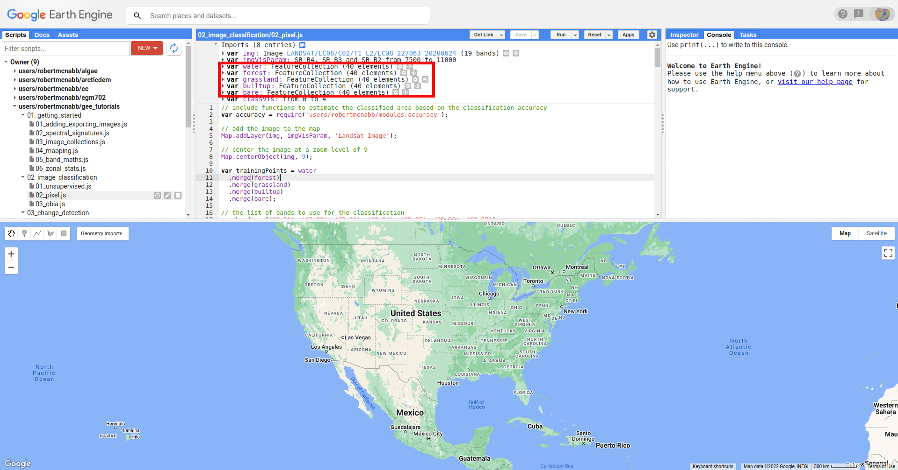
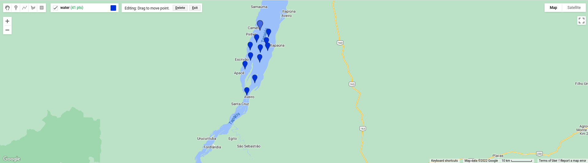
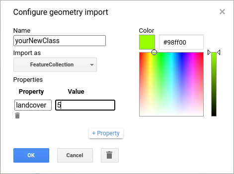
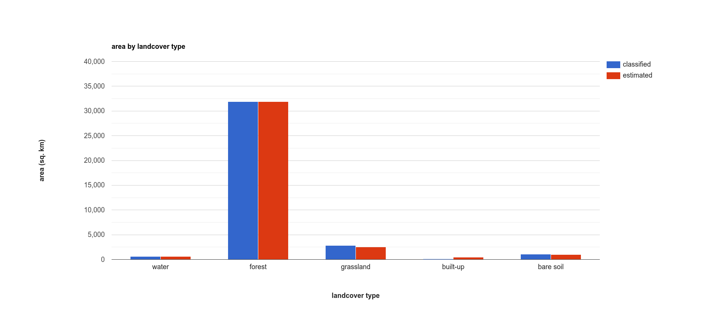
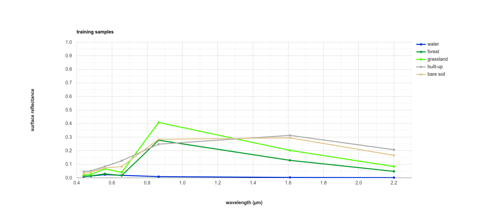
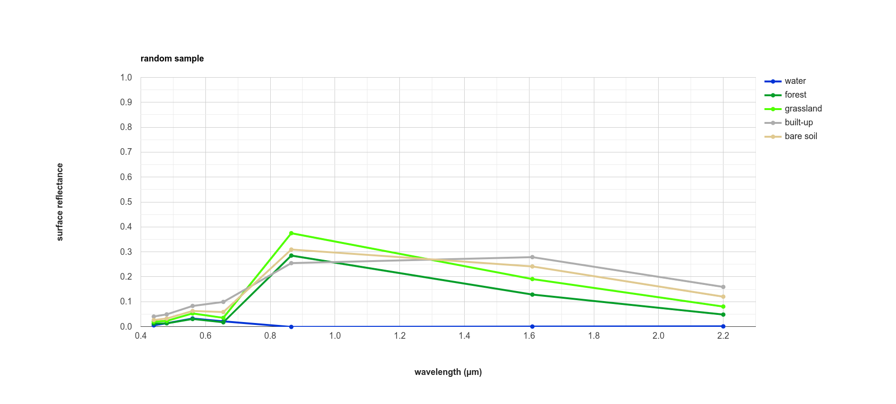

pixel-based classification
==================================

In this tutorial, we'll look at doing a pixel-based classification of a Landsat 8 image acquired on 24 June, 2020,
covering a portion of the Amazon Rainforest south of Santarém, Brazil.

Pixel-based classification is a *supervised* classification technique, where we first have to train the computer how
to classify the image based on its characteristics, before classifying each pixel of the image.

By the end of this tutorial, you should be able to use Earth Engine to:

- select points to train a **Classifier**
- train and apply a **Classifier** to a satellite image
- evaluate the accuracy of a classification
- create a chart that shows the area by class
- plot spectral signatures of training classes

adding training points
--------------------------

To run a supervised classification, we need to provide **labeled training** data - that is, a number of points where
we have identified what **class** the points belong to.

The classification algorithm then takes these points, and the associated input data such as reflectance in different bands,
and determines the "rules" for how to classify points based on the input data.

When you open the script, you should see there are a number of **Geometry Imports**:

|br| Specifically, there are five **FeatureCollection** imports representing landcover classes (``water``, ``forest``,
``grassland``, ``builtup``, and ``bare``), each with 40 points. To add more points to each of these, you can use
the **Geometry Editing** tools:

.. image:: img/pixel/geometry_tools.png
    :width: 300
    :align: center
    :alt: the geometry editing tools in the earth engine window

|br| Click on the layer that you want to add points to - for example, ``water``:

.. image:: img/pixel/water_highlighted.png
    :width: 500
    :align: center
    :alt: the geometry editing tools with the water layer selected

|br| Then, click on the map to add the point:

|br| If you want to move or delete a point, click on the **Stop drawing** button (the hand), then select the point you
want to edit:

.. image:: img/pixel/point_selected.png
    :width: 500
    :align: center
    :alt: the geometry editing tools with a specific point in the water layer highlighted

|br| Then, either click on the **Point** and drag to move it, or click on **Delete** to delete the **Point**.

.. note::

    For the purposes of this tutorial, 40 points for each class is sufficient to give you an idea for how the process works.
    To get a robust classification result and accuracy assessment, however, you will most likely need to add significantly more training
    points.

adding classes
---------------

You might also want to add additional landcover classes to the classification by adding a new **FeatureCollection** as follows.
First, mouse back over the **Geometry Imports**. At the bottom of the **Geometry Imports** menu, click on "**new layer**" 
to add a new layer, then click on the gear icon to open the configuration panel:

.. image:: img/pixel/configuration_panel.png
    :width: 300
    :align: center
    :alt: the configuration panel for the geometry imports

|br| As a reminder, when adding geometry features from the map, you can choose to import them as a **Geometry**, a **Feature**,
or a **FeatureCollection**:

- **Geometry** means only vector data (no attributes/properties)
- **Feature** means you can have a geometry and attributes/properties, it will be treated as a single feature by GEE.
  So, if you have multiple points in a **Feature**, it will be imported as a **MultiPoint Feature**
- **FeatureCollection** means that each geometric object is treated as a **Feature** -- so, multiple points are
  treated as individual points.

Make sure that you add the new class as a **FeatureCollection**, and give it an appropriate name. Next, click the **+property** button to add a new property:

|br| Call this property ``landcover`` (left box), and give it a value of ``5`` (right box), since landcover values 0-4 currently
correspond to the 5 classes that have already been imported.

Change the color to something more appropriate, then click **OK**. You should now see the import at the top of the script.

You can now add points to the new **FeatureCollection** by following the digitizing instructions from above.

Finally, you need to make sure to add your new class to the **FeatureCollection** of training points in the script at line 10:

.. code-block:: javascript

    var trainingPoints = water
      .merge(forest)
      .merge(grassland)
      .merge(builtup)
      .merge(bare);

To do this, delete the semicolon at the end of line 14, and add ``.merge(yourNewClass);`` on line 15 (remembering, of course, to replace
``yourNewClass`` with the actual name of the new **FeatureCollection**).

You should also add the name of your class to the list of class names defined at line 20:

.. code-block:: javascript

    var classes = ee.List(['water', 'forest', 'grassland', 'built-up', 'bare soil']);

using require to load another script
-------------------------------------

The very first line of this script (after the initial comment) is this:

.. code-block:: javascript

    var accuracy = require('users/robertmcnabb/modules:accuracy');

In Earth Engine, ``require()`` (`documentation <https://developers.google.com/earth-engine/apidocs/require>`__) retrieves
the script/file provided to it and imports it as a module. In our script, we can then use any of the *exported*
functions or attributes in ``users/robertmcnabb/modules:accuracy`` by calling them in the script.

As an example, one of the functions in ``users/robertmcnabb/modules:accuracy`` is ``unbiasedArea()``:

.. code-block:: javascript

    /*
    Estimates the unbiased area estimate of each class in a classification, using the
    error matrix and classified area totals.

    For more information, see e.g. Eqn. 2 of Olofsson et al. (2013)
    (http://dx.doi.org/10.1016/j.rse.2012.10.031).

    Inputs:
      - errMat: an error matrix in the form of an Array (e.g., ee.ConfusionMatrix.array())
      - mapArea: a List of the mapped (classified) area corresponding to the classes in errMat.

    Returns:
      - areaEstim: the classified area values, corrected using the error matrix.
    */

Later in the script, we will use this function as ``accuracy.unbiasedArea()``:

.. code-block:: javascript

    // get the (unbiased) area of each class:
    var unbiasedArea = accuracy.unbiasedArea(cm.array(), areas).toList();

The ``accuracy`` module includes a number of functions that implement equations from Oloffsson et al. (2013)\ [#olofsson]_, to
provide a convenient way to estimate the area uncertainty of our classification using the classification
error (confusion) matrix.

We will make more use of ``require()`` in future tutorials; if you're interested in seeing how to set this up to use it
in your own scripts,
`this blog post <https://medium.com/google-earth/making-it-easier-to-reuse-code-with-earth-engine-script-modules-2e93f49abb13>`__
is a great place to start.

getting training data
-------------------------------

Now that we have training classes and points, we have to decide what image properties to use as inputs for "training"
the classifier. In the script as written, we use Landsat OLI bands 1-7 (Visible/NIR/SWIR), as shown in this line:

.. code-block:: javascript

    var bands = ['SR_B1', 'SR_B2', 'SR_B3', 'SR_B4', 'SR_B5', 'SR_B6', 'SR_B7'];

In principle, we can use anything that we want here. For example, if we wanted to use the normalized difference
vegetation index (NDVI) values in addition to the surface reflectances, we could add that band to the image and include
'NDVI' in the list of ``bands`` above:

.. code-block:: javascript

    var bands = ['SR_B1', 'SR_B2', 'SR_B3', 'SR_B4', 'SR_B5', 'SR_B6', 'SR_B7', 'NDVI'];
    img = img.addBands(img.normalizedDifference(['SR_B5', 'SR_B4']).rename('NDVI'));

In the next lesson (:doc:`obia`), we'll see how we can include a number of image textural properties in our classification;
for now, we'll stick to the surface reflectance in OLI bands 1-7.

To create the training dataset, we use the merged training class points (``trainingPoints``), along with ``ee.Image.sampleRegions()``
(`documentation <https://developers.google.com/earth-engine/apidocs/ee-image-sampleregions>`__), to get the **Image** values at those
points:

.. code-block:: javascript

    var training = img.select(bands).sampleRegions({
      collection: trainingPoints,
      properties: ['landcover'],
      scale: 30
    });

This will select each of the bands in ``bands``, then extract the values at each of the points in the ``trainingPoints``
**FeatureCollection**. To make sure that we include the ``landcover`` value for each point, we add this to the 
``properties`` parameter when we call ``ee.Image.sampleRegions()`` - otherwise, this information wouldn't be included
in the training dataset.

splitting the training data
--------------------------------

The next step in training a **Classifier** is to *split* the training dataset into two parts: one, the *training* split,
is what we'll use to actually train the **Classifier**. The second part, the *testing* split, is what we'll use to
check how good a job the **Classifier** has actually done.

The goal here is to test the performance of the classifier with "unseen" data (the *testing* split). This way, we're
evaluating the performance of the **Classifier** on "new" data, rather than checking its performance on data that it
used to "learn" how to classify the data - in the same way that exams normally have different questions than what
you've used to study for the exam.

To split our dataset, we first use ``ee.FeatureCollection.randomColumn()``
(`documentation <https://developers.google.com/earth-engine/apidocs/ee-featurecollection-randomcolumn>`__). This will
add a column, ``'random'``, to the **FeatureCollection**, and fill the column with uniformly-distributed random
numbers that fall in the range [0, 1) (that is, values greater than or equal to 0, but less than 1).

We then use ``ee.FeatureCollection.filter()`` to select the **Feature**\ s where the random value is less than 0.7,
which form our *training* data, and the **Feature**\ s where the random value is greater than or equal to 0.7,
which form our *testing* data:

.. code-block:: javascript

    var split = 0.7;
    var withRandom = training.randomColumn('random');
    var trainingPartition = withRandom.filter(ee.Filter.lt('random', split));
    var testingPartition = withRandom.filter(ee.Filter.gte('random', split));

training a classifier
----------------------

Once we've split the input data into *training* and *testing* partitions, we can "train" our **Classifier**.

GEE has a number of **Classifier** algorithms implemented:

- Maximum Entropy (``amnhMaxent``; `documentation <https://developers.google.com/earth-engine/apidocs/ee-classifier-amnhmaxent>`__)\ [#maxent1]_\ [#maxent2]_
- Support Vector Machine (``libsvm``; `documentation <https://developers.google.com/earth-engine/apidocs/ee-classifier-libsvm>`__)\ [#svm]_
- Minimum Distance (``minimumDistance``; `documentation <https://developers.google.com/earth-engine/apidocs/ee-classifier-minimumdistance>`__)\ [#mindist]_
- CART (``smileCart``; `documentation <https://developers.google.com/earth-engine/apidocs/ee-classifier-smilecart>`__)\ [#cart]_
- Gradient Tree Boost (``smileGradientTreeBoost``; `documentation <https://developers.google.com/earth-engine/apidocs/ee-classifier-smilegradienttreeboost>`__)\ [#grad]_
- Naive Bayes (``smileNaiveBayes``; `documentation <https://developers.google.com/earth-engine/apidocs/ee-classifier-smilenaivebayes>`__)\ [#bayes]_
- Random Forest (``smileRandomForest``; `documentation <https://developers.google.com/earth-engine/apidocs/ee-classifier-smilerandomforest>`__)\ [#randforest]_

In this tutorial, we're using ``ee.Classifier.smileRandomForest()`` to do a Random Forest classification:

.. code-block:: javascript

    var classifier = ee.Classifier.smileRandomForest(100).train({
      features: trainingPartition,
      classProperty: 'landcover',
      inputProperties: bands
    });

this will initialize a Random Forest **Classifier** with 100 trees, then use ``ee.Classifier.train()``
(`documentation <https://developers.google.com/earth-engine/apidocs/ee-classifier-train>`__) to train 
the classifier. The inputs to ``ee.Classifier.train()`` used above are:

- ``features``, the **FeatureCollection** to use to train the **Classifier**
- ``classProperty``, the property of ``features`` that contains the classification information
- ``inputProperties``, a list of the properties from ``features`` to use to train the **Classifier**

So, this will train the **Classifier** using the ``trainingPartition`` **FeatureCollection**,
based on the ``'landcover'`` property, using the image bands listed in the ``bands`` variable defined at line 17 of
the script.

classifying the image
----------------------

Once we have trained the **Classifier**, we use ``ee.Image.classify()``
(`documentation <https://developers.google.com/earth-engine/apidocs/ee-image-classify>`__) to classify the
image:

.. code-block:: javascript

    var classified = img.select(bands).classify(classifier);

This creates a new **Image** with a single band, ``classification``, where the pixel values are the ``landcover`` values
of each class from our training **FeatureCollection**.

Have a look at the classified image in the **Map** window - are there areas where you can see some misclassification?
Does it overall match with your expectations? In the next few sections, we'll take a look at some ways that we can
evaluate how well the **Classifier** has done in classifying each pixel of the image.

accuracy assessment
---------------------

Once we've trained the **Classifier** and applied it to the image, we can use the *testing* dataset to evaluate how
well the **Classifier** has performed. First, though, we have to use ``ee.FeatureCollection.classify()``
(`documentation <https://developers.google.com/earth-engine/apidocs/ee-featurecollection-classify>`__) to classify
the testing data:

.. code-block:: javascript

    var test = testingPartition.classify(classifier);

Next, we can create a "confusion matrix" to display how many of the training objects were
correctly or incorrectly classified as each object:

.. code-block:: javascript

    var cm = test.errorMatrix('landcover', 'classification');

This uses ``ee.FeatureCollection.errorMatrix()``
(`documentation <https://developers.google.com/earth-engine/apidocs/ee-featurecollection-errormatrix>`__) to create a
**ConfusionMatrix** object (`documentation <https://developers.google.com/earth-engine/apidocs/ee-confusionmatrix>`__).

The following line:

.. code-block:: javascript

    print('confusion matrix: ', cm,
      'overall accuracy: ', cm.accuracy(),
      'kappa: ', cm.kappa(),
      "producer's accuracy:", cm.producersAccuracy(),
      "consumer's accuracy:", cm.consumersAccuracy());

will print the **ConfusionMatrix** object, along with the *overall accuracy*, *kappa* score, *producer's* accuracy,
and *consumer's* accuracy to the **Console**. As a reminder:

- the *overall* accuracy is the number of correctly classified **Feature**\ s, divided by the total number of **Feature**\ s.
  It tells us the percentage of training data that the classifier has correctly identified.
- the *producer's* accuracy is the probability that a particular class is correctly classified, and it is calculated
  as the number of correctly classified **Feature**\ s divided by the total number of **Feature**\s in each row of
  the **ConfusionMatrix**. This is also the complement of the *omission* error, the error introduced when pixels are
  incorrectly omitted from the correct class in the classification.
- the *consumer's* accuracy is the probability that the map classification is correct, and it's the number of correctly
  classified **Feature**\ s divided by the total number of **Feature**\s in each column of the **ConfusionMatrix**. This
  is also the complement of the *commission* error, the error introduced when pixels are included in the incorrect
  class in the classification.

.. note::

    The documentation for ``ee.ConfusionMatrix.producersAccuracy()`` and ``ee.ConfusionMatrix.consumersAccuracy()``
    appears to be incorrect - that is, based on the example code provided, ``ee.ConfusionMatrix.producersAccuracy()``
    uses the values in each *row* of the sample **Array**, while ``ee.ConfusionMatrix.consumersAccuracy()`` uses the
    values in each *column*.

The *kappa* score, or statistic\ [#kappa]_, is calculated as follows:

.. math::

    \kappa = \frac{p_o - p_e}{1 - p_e}

where :math:`p_o` is the observed accuracy of the classifier, and :math:`p_e` is the hypothetical probability of chance agreement.
The *kappa* score thus gives a measure of how much better the classifier performs than would be expected by random chance.

When you run the script, you should see the following in the **console** panels (remember that your results may differ slightly):

.. image:: img/pixel/confusion_matrix.png
    :width: 400
    :align: center
    :alt: the error matrix and accuracy values for the 100-tree random forest classification

|br| To help make this a bit clearer, I've added row/column labels to this table below:

+----------------+-------+--------+-----------+------------+-----------+
|                | water | forest | grassland | built-up   | bare soil |
+================+=======+========+===========+============+===========+
| **water**      | 15    | 0      | 0         | 0          | 0         |
+----------------+-------+--------+-----------+------------+-----------+
| **forest**     | 0     | 13     | 0         | 0          | 0         |
+----------------+-------+--------+-----------+------------+-----------+
| **grassland**  | 0     | 0      | 9         | 0          | 1         |
+----------------+-------+--------+-----------+------------+-----------+
| **built-up**   | 0     | 0      | 0         | 8          | 2         |
+----------------+-------+--------+-----------+------------+-----------+
| **bare soil**  | 0     | 0      | 0         | 4          | 8         |
+----------------+-------+--------+-----------+------------+-----------+

The "rows" of this matrix correspond to the landcover class that we have identified,
while the columns correspond to the classified values. In the example above, we see that 15 of our training samples
were classified as landcover class 0 (water), and there were no water training samples that were classified as
something else. The same is true for the forest class (value 1), while one grassland **Feature** (value 2) was
classified as bare soil.

Of the 10 built-up **Feature**\ s in our testing dataset, 8 were correctly classified, while 2 were mis-classified as
bare soil.

Four bare soil **Feature**\ s were mis-classified as built-up areas, and the remaining 8 were correctly
classified as bare soil.

From this example, we can also see that the overall accuracy is decently high (88.3%), with a reasonably high
kappa statistic (0.853). This, however, is not the complete picture of the accuracy of the **Classifier** (or the
classified image).

The *producer's* accuracy is similarly high for each class except for bare soil, where 4 of the 12 test **Feature**\ s
were misclassified.

+---------------+-----------------------+-----------------------+
| class         | producer's accuracy   | consumer's accuracy   |
+===============+=======================+=======================+
| **water**     | 15/15 = 100%          | 15/15 = 100%          |
+---------------+-----------------------+-----------------------+
| **forest**    | 13/13 = 100%          | 13/13 = 100%          |
+---------------+-----------------------+-----------------------+
| **grassland** | 9/10 = 90%            | 9/9 = 100%            |
+---------------+-----------------------+-----------------------+
| **built-up**  | 8/10 = 80%            | 8/12 = 66.7%          |
+---------------+-----------------------+-----------------------+
| **bare soil** | 8/12 = 66.7%          | 8/11 = 72.7%          |
+---------------+-----------------------+-----------------------+

While these are encouraging results, it's worth keeping in mind that we're working with only a few (:math:`n \leq` 15)
samples for each class. With small sample sizes like this, our results are less likely to be an accurate reflection of
the accuracy of the classified image.\ [#congalton]_

landcover area by class
........................

To get the total area for each class in the classified image, we start by using
``ee.Image.pixelArea()`` (`documentation <https://developers.google.com/earth-engine/apidocs/ee-image-pixelarea>`__)
to get an image where the value of each pixel is the pixel area in square meters:

.. code-block:: javascript

    var reduced = ee.Image.pixelArea()

next, we add the classified image as a band to this image:

.. code-block:: javascript

      .addBands(classified)

before finally using ``ee.Image.reduceRegion()`` (`documentation <https://developers.google.com/earth-engine/apidocs/ee-image-reduceregion>`__)
to get the total area for each class:

.. code-block:: javascript

    .reduceRegion({
        reducer: ee.Reducer.sum().group({
          groupField: 1,
          groupName: 'classification'
        }),
        geometry: classified.geometry(),
        maxPixels: 1e13,
        bestEffort: true,
        scale: 30
    });

The **Reducer** that we're using is ``ee.Reducer.sum()``, and we use
``ee.Reducer.group()`` (`documentation <https://developers.google.com/earth-engine/apidocs/ee-reducer-group>`__) to
apply the **Reducer** to each class.

Here, the ``groupField`` is 1, because that's the band number of the ``classification`` band in our **Image**;
``groupName`` is the **Dictionary** key in the output object that contains the group value.

The output is a **Dictionary** with a single key, ``groups``, which is a **List** of **Dictionary** objects for each
class. Each of those **Dictionary** objects has two keys, ``classification`` and ``sum``, corresponding to the class
number and area, respectively.

This is kind of confusing/unwieldy, so we'll extract the area values to a single **List**:

.. code-block:: javascript

    var areas = ee.List(reduced.get('groups')).map(function(obj){
      return ee.List(ee.Dictionary(obj).get('sum'));
    });

Finally, we want to see the classified areas in square kilometers, rather than square meters, so we divide each value
by 10\ :sup:`6`:

.. code-block:: javascript

    areas = ee.Array(areas).divide(1e6).toList();

To do this, we cast ``areas`` as an **Array** object so that we can use ``ee.Array.divide()``
(`documentation <https://developers.google.com/earth-engine/apidocs/ee-array-divide>`__), before using
``ee.Array.toList()``
(`documentation <https://developers.google.com/earth-engine/apidocs/ee-array-tolist>`__) to convert the values back
to a **List**.

Next, so that we know which landcover class belongs to each area, we can use ``ee.Dictionary.fromLists()``
(`documentation <https://developers.google.com/earth-engine/apidocs/ee-dictionary-fromlists>`__) to create a
**Dictionary** where the landcover class names are the keys, and the classified areas are the values:

.. code-block:: javascript

    var areaDict = ee.Dictionary.fromLists(classes, areas);

The end result is this (note that when we ``print()`` the **Dictionary**, the keys are ordered alphabetically):

+---------------+---------------------+
| class         | area (km\ :sup:`2`) |
+===============+=====================+
| **water**     | 616.73              |
+---------------+---------------------+
| **forest**    | 31922.39            |
+---------------+---------------------+
| **grassland** | 2795.47             |
+---------------+---------------------+
| **built-up**  | 99.37               |
+---------------+---------------------+
| **bare soil** | 1091.41             |
+---------------+---------------------+

unbiased area estimates and area uncertainty
..............................................

The next part of the script is where we make use of the ``require()`` statement discussed earlier. Perhaps just as
important as the area of each landcover class is the *uncertainty* of that classified area. Because of the errors of
omission and commission (the complements of the producer's and consumer's accuracy discussed above), the area counts
in the table above are *biased* - that is, they are skewed because they exclude (or include) areas that should be
included (excluded) in the estimated area for each class.

Based on the work presented by Olofsson et al. 2013\ [#olofsson]_, we can use the error matrix that we produced as part
of the **Classifier** training process to produce an *unbiased* estimate of the landcover area for each class, as well
as the 95% confidence interval (CI) around that estimate.\ [#ci]_

I won't go through the equations or the code in detail here, but the functions ``unbiasedArea()`` and
``standardError()`` included in ``users/robertmcnabb/modules:accuracy`` calculate the unbiased area estimate
and standard error for each class, given the error matrix and total areas classified for each landcover class:

.. code-block:: javascript

    // get the (unbiased) area of each class:
    var unbiasedArea = accuracy.unbiasedArea(cm.array(), areas).toList();

    // get the standard error of each area estimate:
    var standardError = accuracy.standardError(cm.array(), areas).toList();

Here, the output of each function is an **Array** object; as we did above for the classified area counts, we
use ``ee.Array.toList()`` to convert the object to a **List**.

To help compare the two area estimates, we can also use the ``errorDict()`` function from ``accuracy``:

.. code-block:: javascript

    // dictionary of the area estimates (± 95% CI)
    var errorDict = accuracy.errorDict(classes, unbiasedArea, standardError);

When we print this **Dictionary** to the **Console**, we see the following (here combined in a single table for ease
of comparison)\ [#error]_:

+---------------+--------------------------------+-----------------------------------------+
| class         | classified area (km\ :sup:`2`) | estimated area ± 95% CI (km\ :sup:`2`)  |
+===============+================================+=========================================+
| **water**     | 616.73                         | 616.73 ± 0.00                           |
+---------------+--------------------------------+-----------------------------------------+
| **forest**    | 31922.39                       | 31922.39 ± 0.00                         |
+---------------+--------------------------------+-----------------------------------------+
| **grassland** | 2795.47                        | 2515.93 ± 559.09                        |
+---------------+--------------------------------+-----------------------------------------+
| **built-up**  | 99.37                          | 443.30 ± 311.38                         |
+---------------+--------------------------------+-----------------------------------------+
| **bare soil** | 1091.41                        | 1027.03 ± 639.96                        |
+---------------+--------------------------------+-----------------------------------------+

In this table, we can see a number of things. First, because of the "perfect" accuracy of the water and forest classes,
we have a standard error of zero km\ :sup:`2` for these classes, and the classified area and estimated area are the
same for both classes.

Because the grassland class had high producer's and consumer's accuracy (and therefore low errors of omission/commission),
we see that the estimated areas are close, and overlap within the 95% confidence interval.

For the built-up class, we see that the estimated area is far higher than the classified area, and in fact does not
fall within the 95% confidence interval. This reflects the large errors of omission and commission for this class, as
shown by the error matrix above.

The estimated area of the bare soil class largely agrees with the classified area, though with a much higher
confidence interval - again, reflecting the low producer's and consumer's accuracy for this class.

Finally, to provide a visual comparison of the two different area estimates in the table above, the script
produces a bar chart by first combining the ``area`` and ``unbiasedArea`` **List** objects
into a single array using ``ee.Array.cat()``
(`documentation <https://developers.google.com/earth-engine/apidocs/ee-array-cat>`__), then using ``ui.Chart.array.values()``
(`documentation <https://developers.google.com/earth-engine/apidocs/ui-chart-array-values>`__) to create the chart:

.. code-block:: javascript

    // make an array with the original and estimated classified areas
    var combArea = ee.Array.cat([areas, unbiasedArea], 1);

    // plot a chart of area by class
    var area_chart = ui.Chart.array.values({
      array: combArea,
      axis: 0,
      xLabels: classes
    })
    .setSeriesNames(['classified', 'estimated'])
    .setChartType('ColumnChart')
    .setOptions({
      title: 'area by landcover type',
        hAxis: {
          title: 'landcover type',
          titleTextStyle: {italic: false, bold: true},
        },
        vAxis: {
          title: 'area (sq. km)',
          titleTextStyle: {italic: false, bold: true},
          viewWindow: {min: 0, max: 4e4}
        },
    });

With the following printed to the **Console**:

spectral signatures
----------------------

When we have two classes where we have significant mis-classification between the two classes, such as bare soil and
built-up areas, we might think about whether it makes sense to have them as separate classes. We can also try adding
carefully-chosen training samples that help increase the spectral differences between the two classes.

Lines 133-164 of the script define a function, ``spectralPlot()``, that plots the average spectral signature of each of
our classes, given a list of reflectance values and a plot title.

.. note::

    If you have added an additional class, you'll need to update this **Dictionary**:

    .. code-block:: javascript

        series: {
            0: {lineWidth: 4, color: '0134d6'},
            1: {lineWidth: 4, color: '059e2a'},
            2: {lineWidth: 4, color: '50ff00'},
            3: {lineWidth: 4, color: 'adadad'},
            4: {lineWidth: 4, color: 'e0c990'},
        }

    to include a line for the new class. For example, if your class marker color is '000000' (black), you should update
    it to look like this:

    .. code-block:: javascript

        series: {
            0: {lineWidth: 4, color: '0134d6'},
            1: {lineWidth: 4, color: '059e2a'},
            2: {lineWidth: 4, color: '50ff00'},
            3: {lineWidth: 4, color: 'adadad'},
            4: {lineWidth: 4, color: 'e0c990'},
            5: {lineWidth: 4, color: '000000'},
        }

Lines 167-185 sample the surface reflectance values at each of the training points, gets the median value in each band
for each class, and plots the median spectral signature for each class:

|br| Using this plot, we can see that the bare soil and built-up classes have similar spectral signatures. There are
some differences, though - for example, the bare soil reflectance is mostly flat between the NIR and SWIR1 bands, while
there is a slightly larger increase for the built-up class. We could include a normalized difference of the
NIR and SWIR1 bands in our classification, to see if that reduces some of the mis-classification.

The final part of the script uses ``ee.Image.stratifiedSample()``
(`documentation <https://developers.google.com/earth-engine/apidocs/ee-image-stratifiedsample>`__) to extract a random
sample of points from each class:

.. code-block:: javascript

    var sample = reflimg.select(['classification', 'SR_B.']).stratifiedSample({
      numPoints: 300,
      classBand: 'classification',
      region: reflimg.geometry(),
      scale: 30,
      projection: reflimg.projection()
    });

This selects a sample of 300 points (``numPoints``) from each class contained in the ``classification`` band (``classBand``),
using the ``region``, ``scale``, and ``projection`` as defined above. With this set of points, we take the median
for each band for each class, and plot the results again:

While the general pattern of these two signature plots are similar, there are some noticeable differences. For the
training samples, we see that at longer wavelengths, the built-up and bare soil classes are very similar; in the
random sample, they are more separated. This suggests that we might want to add more varied training samples for both
classes, to help increase some of this separation.

next steps
-----------

In this tutorial, we've seen how we can use GEE to classify a satellite image. We've also seen how we can assess the
accuracy of that classification, produce estimates of the area of each landcover class, and examine the spectral
signatures of our training data to look at ways to improve the classification.

If you are looking for more practice with pixel-based image classification, or interested in experimenting with ways to
improve the classification here, try the following suggestions:

- how does changing the number of 'trees' in the random forest classifier impact the estimated accuracy of the classification? 
- do different classifiers (e.g., maximum entropy) make a difference in the classification? Note that for some classifiers,
  like SVM, there may be additional processing steps such as normalization required before you can run the classifier.
- how does adding additional bands such as the NDVI affect the classification?
- there are some clouds (and cloud shadow) in the image, which cause mis-classification. Can you think of some ways that
  you could address this?

references and notes
---------------------

.. [#olofsson] Olofsson, P., et al. (2013). *Rem. Sens. Env.* 129, 122–131.
    doi: `10.1016/j.rse.2012.10.031 <https://doi.org/10.1016/j.rse.2012.10.031>`__

.. [#maxent1] This particular implementation is the American Museum of Natural History (AMNH) maximum-entropy classifier;
    for more information about the software, see https://biodiversityinformatics.amnh.org/open_source/maxent/

.. [#maxent2] e.g., De Martino, A. and D. De Martino (2018). *Heliyon*, 4(**4**), e00596.
    doi: `10.1016/j.heliyon.2018.e00596 <https://doi.org/10.1016/j.heliyon.2018.e00596>`__

.. [#svm] e.g., Mountrakis, G., et al. (2011). *ISPRS J. Photogramm. Rem. Sens.* 66, 247–259.
    doi: `10.1016/j.isprsjprs.2010.11.001 <https://doi.org/10.1016/j.isprsjprs.2010.11.001>`__

.. [#mindist] e.g., Wacker, A. G. and D. A. Landgrebe (1972). *LARS Technical Reports*. Paper 25.
    [`PDF <http://docs.lib.purdue.edu/larstech/25>`__]

.. [#cart] e.g., Loh, W.-Y. (2011). *WIREs Data Mining Knowl. Discov.* 1(**1**), 14-23.
    doi: `10.1002/widm.8 <https://doi.org/10.1002/widm.8>`__

.. [#grad] e.g., Friedman, J. H. (2001). *Ann. Statist.* 29(**5**), 1189-1232.
    doi: `10.1214/aos/1013203451 <https://doi.org/10.1214/aos/1013203451>`__

.. [#bayes] e.g., Hand, D. J. and K. Yu (2001). *Int. Statistical Rev.* 69(**3**), 385-398.
    doi: `10.2307/1403452 <https://doi.org/10.2307/1403452>`__

.. [#randforest] e.g., Belgiu, M. and L. Drăguţ (2016). *ISPRS J. Photogramm. Rem. Sens.* 114, 24-31.
    doi: `10.1016/j.isprsjprs.2016.01.011 <https://doi.org/10.1016/j.isprsjprs.2016.01.011>`__

.. [#kappa] sometimes also referred to as *Cohen's kappa*

.. [#congalton] e.g., Congalton, R. G. (1988). *Photogrammetric Eng. Rem. Sens.* 58(**5**), 593-600.
    [`PDF <https://www.asprs.org/wp-content/uploads/pers/1988journal/may/1988_may_593-600.pdf>`__]

.. [#ci] the 95% confidence interval is obtained using twice the standard error.

.. [#error] Note that in this example, because the classification has worked "perfectly" for two classes, water and forest,
    the standard error for each class is 0. This is not real, as you can tell by looking at the cloud shadows that have
    been classified as "water". Rather than using the testing split, we could instead select a number of random points
    from each landcover class in the classified image, and compare the computer-classified values with human-classified
    values. This is more difficult to do within GEE, but it would provide a more robust estimate of the accuracy of
    the classification.