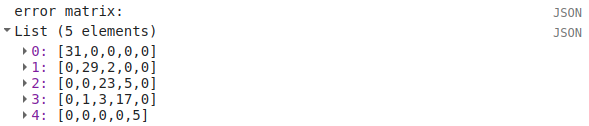

pixel-based classification
==================================

Lorem ipsum, etc.

selecting training points
--------------------------

splitting the training dataset
-------------------------------

training a classifier
----------------------

accuracy assessment
---------------------

classifying the image
----------------------

summarizing results
--------------------

next steps
-----------

references
------------

The code in this section will help us run a Random Forest classification on our chosen image, and examine the results. 
Start by uncommenting this section (remove the ``/*`` from line 98 and the ``*/`` from line 141). The following lines of code:

.. code-block:: javascript

    // select training points from the training image
    var training = img.select(bands).sampleRegions({
      collection: trainingPoints,
      properties: ['landcover'],
      scale: 30
    });

    // split the training points into training, testing data
    var split = 0.7;
    var withRandom = training.randomColumn('random');
    var trainingPartition = withRandom.filter(ee.Filter.lt('random', split));
    var testingPartition = withRandom.filter(ee.Filter.gte('random', split));

will select the image band values for each of the training points, then split them into training and test data using a 70-30 split
(i.e., 70% of the data will be used for training, 30% for testing).

The following lines of code will initialize a Random Forest classifier using 100 individual "trees" and train the classifier using the
training data.

.. code-block:: javascript

    // initialize a random forest with 100 "trees"
    var classifier100 = ee.Classifier.smileRandomForest(100).train({
      features: trainingPartition,
      classProperty: 'landcover',
      inputProperties: bands
    });

A second block of code will initialize a Random Forest classifier with only 10 trees, to enable us to compare the results of using
different numbers of trees. 

Finally, we will classify the testing data, then look at the confusion matrix and accuracy
measurements to compare our different classifiers:

.. code-block:: javascript

    // classify the testing data using our trained classifiers
    var test100 = testingPartition.classify(classifier100);
    var test10 = testingPartition.classify(classifier10);

    // make the confsuion matrix for the different test datasets
    var cm100 = test100.errorMatrix('landcover', 'classification');
    var cm10 = test10.errorMatrix('landcover', 'classification');

    // print the confusion matricies, overall accuracy, and kappa statistics
    print('RF 100 error matrix: ', cm100, 
      'RF100 accuracy: ', cm100.accuracy(),
      'RF100 kappa: ', cm100.kappa());
    print('RF 10 error matrix: ', cm10, 
      'RF10 accuracy: ', cm10.accuracy(),
      'RF10 kappa: ', cm10.kappa());

When you run the script, you should see the following in the **console** panels (remember that your results may differ slightly):

To help you understand this, I've added row/column labels to this table below:

+----------------+-------+--------+-----------+------------+------+------+
|                | water | forest | clear cut | new growth | soil | snow |
+================+=======+========+===========+============+======+======+
| **water**      | 9     | 0      | 0         | 0          | 0    | 0    |
+----------------+-------+--------+-----------+------------+------+------+
| **forest**     | 0     | 11     | 0         | 0          | 0    | 0    |
+----------------+-------+--------+-----------+------------+------+------+
| **clear cut**  | 0     | 0      | 9         | 7          | 0    | 0    |
+----------------+-------+--------+-----------+------------+------+------+
| **new growth** | 0     | 0      | 5         | 8          | 0    | 0    |
+----------------+-------+--------+-----------+------------+------+------+
| **soil**       | 0     | 0      | 0         | 0          | 14   | 0    |
+----------------+-------+--------+-----------+------------+------+------+
| **snow**       | 0     | 0      | 0         | 0          | 0    | 6    |
+----------------+-------+--------+-----------+------------+------+------+

Like with the unsupervised classification error matrix, the "rows" of this matrix correspond to the landcover class that we
have identified, while the columns correspond to the classified values. In the example above, we see that 9 of our training samples
were classified as landcover class 0 (water), and there were no water training samples that were classified as something else.

The same is true for the forest class (value 1), soil (value 4), and snow (value 5). We do see some significant overlap between 
the clear cut and new growth classes, as we suspected might happen based on the results of the unsupervised classification. Of the 16
samples classified as clear cut (value 2), 7 were classified as new growth (value 3), and there's a similar split for new growth.

From this example, we can also see that the overall accuracy is decently high (82.6%), with a reasonably high kappa statistics (0.788).

Return to the ``bands`` variable, uncomment the second line again, and re-run the script. How does the result for the testing data
change? What about if you add slope and elevation data to the classification? Re-comment each of these lines before moving on
to the next section.

apply the classifier
---------------------

Uncomment this section (remove the ``/*`` from line 144 and the ``*/`` from line 188), and run the script again. The code in this section
will classify the image using the two classifiers trained and tested in the previous section, then add the classified images to the map
(note that you will need to toggle the layers on using the **Layers** menu):

.. code-block:: javascript

    var classified100 = img.select(bands).classify(classifier100);
    var classified10 = img.select(bands).classify(classifier10);

    var classPalette = ['013dd6', '059e2a', 'a6613d', '2aff53', 'e3d4ae', 'fffbf4'];

    Map.addLayer(classified10, {min: 0, max: 5, palette: classPalette}, 'RF 10', false);
    Map.addLayer(classified100, {min: 0, max: 5, palette: classPalette}, 'RF 100', false);

It will also count the number of pixels in each class for the two classifiers, and print the results to the console:

.. code-block:: javascript

    // add some summary statistics (area for each classification, e.g.)
    var class10 =  classified10.updateMask(classified10.eq(0)).rename('water')
      .addBands(classified10.updateMask(classified10.eq(1)).rename('forest'))
      .addBands(classified10.updateMask(classified10.eq(2)).rename('clear cut'))
      .addBands(classified10.updateMask(classified10.eq(3)).rename('new growth'))
      .addBands(classified10.updateMask(classified10.eq(4)).rename('soil'))
      .addBands(classified10.updateMask(classified10.eq(5)).rename('snow'));

    var count10 = class10.reduceRegion({
      reducer: ee.Reducer.count(),
      geometry: boundary,
      scale: 30,
      maxPixels: 1e13,
      tileScale: 8
    });

    // add some summary statistics (area for each classification, e.g.)
    var class100 =  classified100.updateMask(classified100.eq(0)).rename('water')
      .addBands(classified100.updateMask(classified100.eq(1)).rename('forest'))
      .addBands(classified100.updateMask(classified100.eq(2)).rename('clear cut'))
      .addBands(classified100.updateMask(classified100.eq(3)).rename('new growth'))
      .addBands(classified100.updateMask(classified100.eq(4)).rename('soil'))
      .addBands(classified100.updateMask(classified100.eq(5)).rename('snow'));

    var count100 = class100.reduceRegion({
      reducer: ee.Reducer.count(),
      geometry: boundary,
      scale: 30,
      maxPixels: 1e13,
      tileScale: 8
    });

    print("RF 10 Classification results:", count10);
    print("RF 100 Classification results:", count100);

How do the pixel counts compare for the two classifers? Which class has the biggest difference between the two?

When you run the script, you will also see the classified image displayed in the map:

.. image:: ../../../img/egm702/week5/classified_image.png
    :width: 600
    :align: center
    :alt: the random forest classified image

Note that when you are zoomed out, the classification will look different due to the way that the image is re-sampled at lower
resolutions. Zoom in on the peak. Are there significant differences between the different classified images (RF 100 and RF 10)?
What are they? How does this compare to the numerical summary?

the result change significantly if you add the normalized difference indices back to the classification (uncomment line 26)?
Uncomment line 26 to add the NDVI, NDWI, and mNDWI bands back to the image, then re-run the script. How does the classified
image change? What about the numerical results? What about after adding the slope and elevation information?

Leave this section uncommented as you move on to the next sections - this will enable you to compare the pixel-based and object-based
classification results.

export the classification
--------------------------

The code in this section will enable you to export the classified image to your Google Drive, and use them in, for example,
ArcGIS, QGIS, or ERDAS Imagine.

.. code-block:: javascript

    Export.image.toDrive({image: classified100.select('classification'),
      description: 'RandomForestClassification',
      scale: 30,
      region: boundary,
      crs: 'epsg:32610',
      maxPixels: 1e12
    });

You can change the image name (``classified100``) to export a different image, or duplicate this block of code to export multiple images.

next steps
-----------
