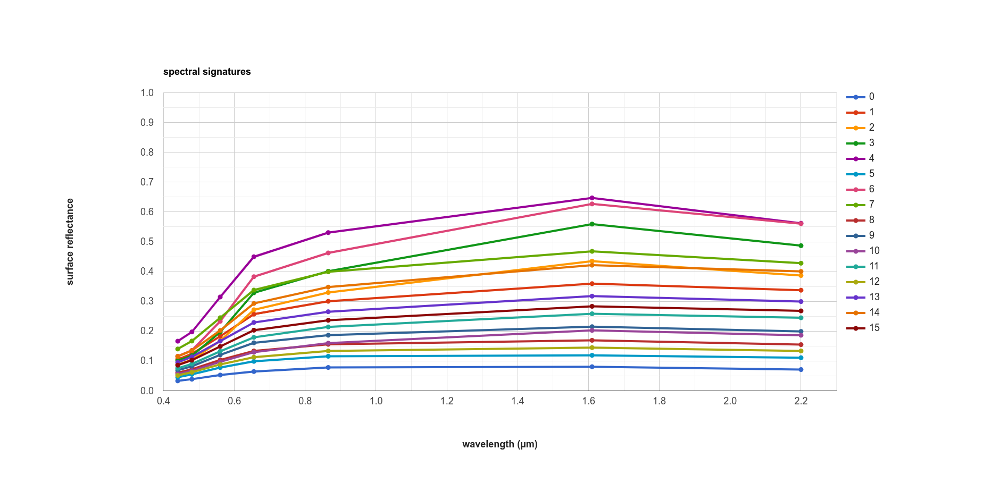

unsupervised classification
=============================

For this tutorial, we're going to use a 15 February 2022 Landsat 9 image covering `Harrat Khaybar <https://en.wikipedia.org/wiki/Harrat_Khaybar>`__,
a volcanic field in Saudi Arabia:

.. image:: img/unsupervised/harrat_khaybar.png
    :width: 600
    :align: center
    :alt: closeup of Harrat Khaybar, the study area for this tutorial.

|br| *Unsupervised classification* is a classification technique where we have little to no input to the classification routine. Instead,
the classification algorithm determines how to group, or "cluster," pixels, based on their properties.

It's important to note that the classes output by an unsupervised classification have no meaning, in the sense that they're only
groups of pixels based on the image data. After running an unsupervised classification, then, the next task is to interpret and
identify what each of these classes represent.

In this tutorial, you will learn:

- how to select a random sample from an **Image**
- how to train and apply a **Clusterer** to an **Image**
- how to select a stratified sample of pixels from an **Image**
- how to plot the spectral characteristics of classes to see their differences

selecting sample points
------------------------

The **Image** that we're using is 7601 * 7331 pixels = 55.7M pixels/band * 7 bands = 390M pixels - that's a lot. To help improve
performance of the clustering algorithm, and prevent ``Out of Memory`` errors when we run the script, we want to take a
random sample of pixels.

To do this, we can use ``ee.Image.sample()`` (`documentation <https://developers.google.com/earth-engine/apidocs/ee-image-sample>`__):

.. code-block:: javascript

    var training = img.select('SR_B.').sample({
      region: img.geometry(),
      scale: 30,
      numPixels: 5000
    });

``ee.Image.sample`` takes a number of arguments - here, we're specifying the ``region`` (``img.geometry()``),
the ``scale`` of the **Image** in meters, and ``numPixels``, the number of pixels to sample.

training a clusterer
---------------------

Next, we use these sample points to train a **Clusterer** using ``ee.Clusterer.wekaKMeans()``
(`documentation <https://developers.google.com/earth-engine/apidocs/ee-clusterer-wekakmeans>`__). This will train
the unsupervised classifier (also called a **Clusterer**, because it uses the properties of the pixels to group, or *cluster*,
them together) using WEKA *k*-means\ [1]_\ [2]_:

.. code-block:: javascript

    var clusterer = ee.Clusterer.wekaKMeans({nClusters: 16}).train(training);

``ee.Cluster.wekaKMeans()`` takes a number of arguments; here, we're only using one:
``nClusters``, the number of clusters to divide the sample into.

In general, the number of clusters will depend on the particular scene - you may want to experiment with choosing
different numbers of clusters to see the effects on the end results. You can also use a different method,
such as ``ee.Clusterer.wekaXMeans()`` (`documentation <https://developers.google.com/earth-engine/apidocs/ee-clusterer-wekaxmeans>`__)
or ``ee.Clusterer.wekaCascadeKMeans()`` (`documentation <https://developers.google.com/earth-engine/apidocs/ee-clusterer-wekacascadekmeans>`__),
which are designed to optimize the number of clusters based on the input data.

applying the classification
----------------------------

Once we've trained the **Clusterer**, we can then apply it to the **Image** using ``ee.Image.cluster()``
(`documentation <https://developers.google.com/earth-engine/apidocs/ee-image-cluster>`__):

.. code-block:: javascript

    var unsupervised = img.cluster(clusterer); 

This will assign a cluster, or class, value to each pixel based on its spectral properties.

viewing the clusters
----------------------

To view the clusters on the **Map**, we can use ``ee.Image.randomVisualizer()``
(`documentation <https://developers.google.com/earth-engine/apidocs/ee-image-randomvisualizer>__`) 
to provide a random palette to display the image (like we did for the :doc:`../getting_started/zonal_stats` tutorial):

.. code-block:: javascript

    Map.addLayer(unsupervised.randomVisualizer(), {}, 'clusters');

This should produce the following artistic image in the **Map**:

.. image:: img/unsupervised/clustered_results.png
    :width: 600
    :align: center
    :alt: the clustered image added to the map window

|br| Remember that the class values in the image (0--15) don't yet correspond to any physical meaning - in order to finish the
classification, we would need identify what physical surfaces or objects the class values represent.

stratified sampling
--------------------

To view the spectral properties of the clusters, we can create a scatter plot that plots the reflectance
in one band versus the reflectance in a different band, colored by cluster.

First, we add the clustered **Image** to our original **Image**:

.. code-block:: javascript

    reflimg = reflimg.addBands(unsupervised.select('cluster'));

This way, we can select pixels from that **Image** based on what cluster they belong to.

Because of the number of pixels in the **Image** (remember: 7601 * 7331 pixels = 55.7M pixels),
we can't just plot all of the pixel values at once. Instead, we again take a random sample of pixels,
this time using ``ee.Image.stratifiedSample()`` (`documentation <https://developers.google.com/earth-engine/apidocs/ee-image-stratifiedsample>`__):

.. code-block:: javascript

    var sample = reflimg.select(['cluster', 'SR_B.']).stratifiedSample({
      numPoints: 300,
      classBand: 'cluster',
      region: reflimg.geometry(),
      scale: 30,
      projection: reflimg.projection()
    });

This selects a random sample of (up to) 300 pixels from each cluster. ``ee.Image.stratifiedSample()`` takes a number of arguments; here,
we're using the following:

- ``numPoints`` - the number of points for each ``class`` in ``classBand``
- ``classBand`` - the **Image** band that identifies the ``class`` of each pixel
- ``region`` - the **Geometry** over which to select the samples
- ``scale`` - the nominal scale of the **Image** to use, in meters
- ``projection`` - the projection of the **Image** to use

.. note::

    The output of ``ee.Image.stratifiedSample()`` is a **FeatureCollection**. Because we are limited to 5000 elements for the **Chart**,
    just like we are for using ``print()``, we are limited to 5000 elements / 16 classes ~= 300 elements / class. To show more
    elements per class, we would need to reduce the number of classes.

creating a scatter plot
------------------------

To create the scatter plot, we'll use ``ui.Chart.feature.groups()`` 
(`documentation <https://developers.google.com/earth-engine/apidocs/ui-chart-feature-groups>`__).

Because we're limited to plotting two bands at a time, we'll create a **function** that enables us to easily make multiple 
plots - instead of copying + pasting the code for the **Chart** multiple times and changing the parameters, we only need to
call the function multiple times. If we want to change something about our **Chart**, we only have to change it one 
place -- **function**\ s are a way to clean up our script and easily re-use repeated code.

.. code-block:: javascript

    function compChart(feat, band1, band2){
      var chart = ui.Chart.feature.groups({
        features: feat,
        xProperty: band1,
        yProperty: band2,
        seriesProperty: 'cluster'
      }).setOptions({
          title: band1 + ' ' + band2 + ' comparison',
          hAxis: {
            title: band1,
            titleTextStyle: {italic: false, bold: true},
            viewWindow: {min: 0, max: 1}
          },
          vAxis: {
            title: band2,
            titleTextStyle: {italic: false, bold: true},
            viewWindow: {min: 0, max: 1}
          },
          lineWidth: 0,
          pointSize: 4
      });
      return chart;
    }

This **function**, ``compChart()``, takes three arguments:

- ``feat`` - the **FeatureCollection** to select values from;
- ``band1``- the name of the band to plot on the *x*-axis;
- ``band2``- the name of the band to plot on the *y*-axis;

and returns a **Chart** object that plots the values for each ``cluster`` in a single color.

To see the **Chart**, remember that we have to print it to the **Console**:

.. code-block:: javascript

    var chart1 = compChart(sample, 'SR_B5', 'SR_B7');
    print(chart1);

.. image:: img/unsupervised/nir_swir2_scatter.png
    :width: 600
    :align: center
    :alt: the SWIR2 vs. NIR scatter plot for each cluster

|br| The plot above shows the SWIR2 (``SR_B7``) values vs. NIR (``SR_B5``) values for each cluster. Note that there is some
overlap between the clusters, because the clustering has been done in seven dimensions, rather than just two.

plotting spectral signatures
-----------------------------

The final plot we'll have a look at will plot the median values in each band for each cluster; in effect, it shows
us the spectral signature of each cluster.

To get the median of each cluster, we use ``ee.FeatureCollection.reduceColumns()``
(`documentation <https://developers.google.com/earth-engine/apidocs/ee-featurecollection-reducecolumns>`__).

.. code-block:: javascript

    var reduced = sample.reduceColumns({
      selectors: ['cluster', 'SR_B1', 'SR_B2', 'SR_B3', 'SR_B4', 'SR_B5', 'SR_B6', 'SR_B7'],
      reducer: ee.Reducer.median().repeat(7).group({
        groupField: 0,
        groupName: 'cluster',
      })
    });

``ee.FeatureCollection.reduceColumns()`` will apply the chosen **Reducer** to each of the
columns named in ``selectors`` - here, we've selected each of the bands in the **Image**.

The **Reducer** that we're using is ``ee.Reducer.median()``, but note that we're also using
``ee.Reducer.repeat()`` (`documentation <https://developers.google.com/earth-engine/apidocs/ee-reducer-repeat>`__) -- this is
so that the **Reducer** calculates the median value for each band in ``selectors`` -- without this, we would only get a value
for the first input.

We're also using ``ee.Reducer.group()`` (`documentation <https://developers.google.com/earth-engine/apidocs/ee-reducer-group>`__),
which will calculate the median of each of the values in ``groupField``. Note that 
the ``groupField`` corresponds to the index in the inputs to the **Reducer** -- 
because 'cluster' is the first value in the ``selector``\ s **List**, the
``groupField`` here is 0; setting ``groupName`` to 'cluster' will just re-name the key in the output **Dictionary**.

The output of ``ee.FeatureCollection.reduceColumns()`` is a **Dictionary** with a single key, ``groups``. We can
use the output of ``ee.Dictionary.get()`` (`documentation <https://developers.google.com/earth-engine/apidocs/ee-dictionary-get>`__),
along with ``ee.List.map()``, to get each cluster name as a **String**:

.. code-block:: javascript

    var categories = ee.List(reduced.get('groups')).map(function(obj){
      return ee.String(ee.Dictionary(obj).get('cluster'));
    });

as well as the median value in each band in the **Image** for each cluster:

.. code-block:: javascript

    // get the mean reflectance values from all of the classes
    var reflectances = ee.List(reduced.get('groups')).map(function(obj){
      return ee.List(ee.Dictionary(obj).get('median'));
    });

Note that ``reflectances`` is a **List** of **List** objects; that is, an **Array**. Just like with the
:doc:`../getting_started/spectral` tutorial, we can then use ``ui.Chart.array.values()``
(`documentation <https://developers.google.com/earth-engine/apidocs/ui-chart-array-values>`__) to plot each
"row" of the **Array** as a line:

.. code-block:: javascript

    var spectralChart = ui.Chart.array.values({
      array: reflectances,
      axis: 1,
      xLabels: wavelengths
    })
    .setSeriesNames(categories) // change the names of each line
    .setOptions({
        title: 'spectral signatures',
        hAxis: {
          title: 'wavelength (µm)', 
          titleTextStyle: {italic: false, bold: true},
          viewWindow: {min: 0.4, max: 2.3}
        },
        vAxis: {
          title: 'surface reflectance',
          titleTextStyle: {italic: false, bold: true},
          viewWindow: {min: 0, max: 1}
        },
        lineWidth: 4
    });

The result of this is another **Chart** object that we can print to the **Console**:

|br| Here, we can see that there's probably a good deal of overlap between different clusters in each band - possibly indicating
that we could reduce the number of clusters, 

Note that unlike in the :doc:`../getting_started/spectral` tutorial, we're setting the ``lineWidth``
property of each line together, rather than specifying the properties of each line individually. To set the properties of 
each line (``series``) individually, you can supply a **Dictionary** of options corresponding to each ``series``:

.. code-block:: javascript

    series: {
      0: {lineWidth: 4, color: 'e1fff9'},
      1: {lineWidth: 4, color: 'd6bc87'},
      2: {lineWidth: 4, color: '228b22'}, // ... and so on.
    }

next steps
-----------

At this point, you've seen how to select a random sample from an **Image**, and train and apply a
**Clusterer** to that **Image**. You've also seen a few examples of how to plot the spectral values of
the clusters, to aid in investigating what physical surface(s) each cluster belongs to.

If you're interested in some additional practice, here are some suggestions:

- How does increasing (or decreasing) the number of sample points used to train the **Clusterer** affect the results?
- How does increasing (or decreasing) the number of clusters affect the outcome of using ``ee.Clusterer.wekaKMeans()``?
- Instead of specifying the number of clusters, try using ``ee.Clusterer.wekaXMeans()`` or ``ee.Clusterer.wekaCascadeKMeans()`` to choose an optimal number of classes for the image.
- Another option for changing, or improving, the performance of the **Clusterer** is by providing a random *seed*\ [3]_ -- does this have any impact on the results you see?

references and notes
---------------------

.. [1] Frank, E., M. A. Hall., and I. H. Witten (2016). The WEKA Workbench. Online Appendix for "Data Mining: Practical Machine Learning Tools and Techniques", Morgan Kaufmann, Fourth Edition, 2016. [`pdf <https://www.cs.waikato.ac.nz/ml/weka/Witten_et_al_2016_appendix.pdf>`__]

.. [2] For a (brief) overview of *k*-means clustering, the wikipedia page is a good place to start: https://en.wikipedia.org/wiki/K-means_clustering

.. [3] Arthur, D. and S. Vassilvitskii (2007). in: *Proceedings of the Eighteenth Annual ACM-SIAM Symposium on Discrete Algorithms, SODA ’07*. pp. 1027–1035. doi: `10.5555/1283383.1283494 <https://doi.org/10.5555/1283383.1283494>__`

