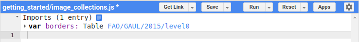
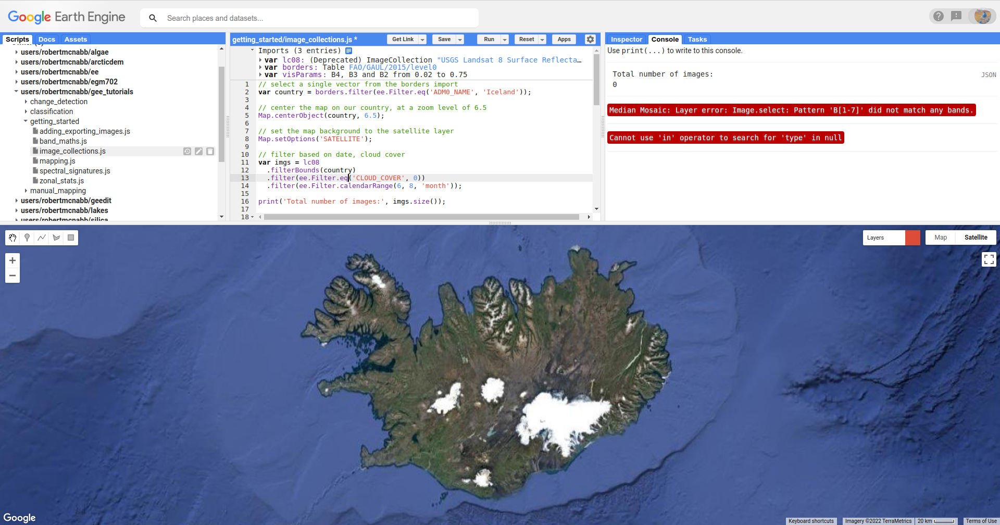
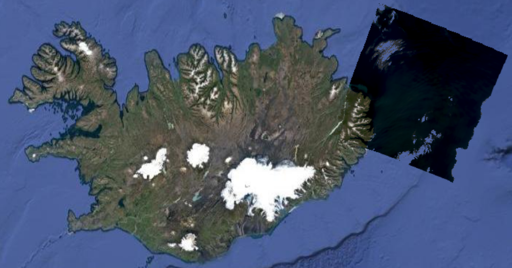
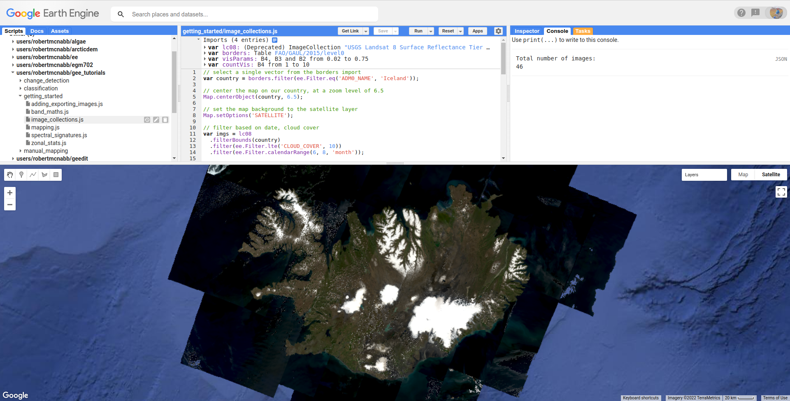

image collections and vectors
==============================

.. tip::

    The script for this tutorial can be found via this `direct link <https://code.earthengine.google.com/?scriptPath=users%2Frobertmcnabb%2Fgee_tutorials%3A01_getting_started%2F03_image_collections.js>`__.

    Alternatively, if you have already added the repository, you can open the script from the **Code Editor**, by
    navigating to ``01_getting_started/03_image_collections.js`` under the **Reader** section.

In the previous tutorials, we've focused on adding individual **Image**\ s to the **Map**
using their ``id``. This isn't the only way to find **Image**\ s to use, however. Very often,
we might want to do some processing or analysis for many **Image**\ s. For this, we use **ImageCollection**\ s.

In this tutorial, you will see how you can:

- **import** GEE Datasets
- filter **ImageCollection**\ s and **FeatureCollection**\ s to select objects matching specific criteria
- apply a mask to cloudy pixels using a **function** and ``map()``
- buffer a **Geometry**
- clip an **Image** to a **Geometry**

adding dataset imports
------------------------

In the previous tutorial, we saw how to **import** geometries, using the **Drawing** tools. These are not the only
things that we can import, however. When you open the script, you should see the following imports at the top of the script:

.. image:: img/image_collections/imports.png
    :width: 500
    :align: center
    :alt: datasets and parameters imported at the top of the script

|br| There are four imports here:

- ``lc08``, the "USGS Landsat 8 Surface Reflectance Tier 1" **ImageCollection**
- ``borders``, the "Global Administrative Unit Layers 2015, Country Boundaries" **FeatureCollection**
- ``visParams``, a dictionary with visualization parameters to pass to ``Map.addLayer()``
- ``countVis``, a dictionary with visualization parameters to pass to ``Map.addLayer()``

The first two (``lc08`` and ``borders``) are GEE Datasets - you can click the link in the **Imports** description
to find out more about them. To import GEE datasets into a script, you can add them to the code editor like this:

.. code-block:: javascript

    var borders = ee.FeatureCollection("FAO/GAUL/2015/level0");

When you do this, you should see that this gets underlined in yellow:

.. image:: img/image_collections/underline.png
    :width: 500
    :align: center
    :alt: a yellow underline under a variable declaration, indicating it can be added as an import

|br| When you mouse over this line, you should see the following message:

.. image:: img/image_collections/import.png
    :width: 500
    :align: center
    :alt: the message stating the the variable can be added to the script as an import

|br| Click "Convert" to add the variable as an import:

filtering
---------- 

The first line of the script:

.. code-block:: javascript

    // select a single vector from the borders import
    var country = borders.filter(ee.Filter.eq('ADM0_NAME', 'Iceland'));

uses ``ee.FeatureCollection.filter()`` (`documentation <https://developers.google.com/earth-engine/apidocs/ee-featurecollection-filter>`__)
and ``ee.Filter.eq()`` (`documentation <https://developers.google.com/earth-engine/apidocs/ee-filter-eq>`__)
to select only those **Feature**\ s that match the given metadata value.

``ee.Filter.eq()`` takes two parameters:

- ``name``, the property name to filter on
- ``value``, the value to compare

and returns a **Filter** object. Here, we're filtering over the ``ADM0_NAME`` property (the UN country name)
to select only **Feature**\ s that match ``Iceland`` - in other words, we're selecting the **Feature** that
corresponds to the country of Iceland.

.. note::

    The result of this operation is a **FeatureCollection** - even if there's only one **Feature** (or no **Feature**\ s)
    that match the criteria.

The next few lines of code are things we've seen already - using ``Map.centerObject()`` to center the **Map** on our
country polygon(s), and ``Map.setOptions()`` to change the background image from the default to the satellite basemap.

The next block of code uses a few different **method**\ s to filter the entire Landsat 8 **ImageCollection**. The first,
``ee.ImageCollection.filterBounds()`` (`documentation <https://developers.google.com/earth-engine/apidocs/ee-imagecollection-filterbounds>`__), 
will filter the **ImageCollection** based on whether the images intersect with the given geometry (in this case, our
country boundary):

.. code-block:: javascript

    var imgs = lc08
      .filterBounds(country)

Next, just like with the **FeatureCollection**, we use ``ee.ImageCollection.filter()``
(`documentation <https://developers.google.com/earth-engine/apidocs/ee-imagecollection-filter>`__)
to apply a **Filter**. Here, we're using ``ee.Filter.lte()``
(`documentation <https://developers.google.com/earth-engine/apidocs/ee-filter-lte>`__) to return
only **Image**\ s with a cloud cover less than or equal to 10%:

.. code-block:: javascript

    .filter(ee.Filter.lte('CLOUD_COVER', 10))

Finally,  we use ``ee.ImageCollection.filter()`` and
``ee.Filter.calendarRange()`` (`documentation <https://developers.google.com/earth-engine/apidocs/ee-filter-calendarrange>`__)
to select only images that have months between June (month 6) and August (month 8). 

.. code-block:: javascript

    .filter(ee.Filter.calendarRange(6, 8, 'month'));

The end result, at least for this example, is a total of 46 Images that meet all of the criteria - we can see this using
``ee.ImageCollection.size()`` (`documentation <https://developers.google.com/earth-engine/apidocs/ee-imagecollection-size>`__):

.. code-block:: javascript

    print('Total number of images:', imgs.size());

functions, mapping, and masking
--------------------------------

This gives us an **ImageCollection** that we can mosaic to produce a cloud-free mosaic. However, it is often the case that if 
we limit ourselves to "cloud-free" (i.e., the 'CLOUD_COVER' metadata value is equal to 0) images, we end up with very little to
work with:

|br| But, even low values of cloud cover can still end up in our mosaic:

.. image:: img/image_collections/clouds.png
    :width: 720
    :align: center
    :alt: the mosaicked image without clouds masked

|br| To make sure that we aren't using clouds, we can apply a **mask** to our images using ``map()`` and a **function**.

Landsat surface reflectance products have a QA (quality assessment) band that flags pixels that are (or might be) clouds,
cloud shadow, snow, water, cloud confidence, and so on.

Rather than masking every single possible pixel value, we can use ``ee.Image.bitwiseAnd()`` 
(`documenation <https://developers.google.com/earth-engine/apidocs/ee-image-bitwiseand>`__) to select pixels where
the specific bit is set. For Landsat 8 Collection 2, Level 2 (surface reflectance) products:

- bit 1 corresponds to dilated cloud
- bit 2 corresponds to cirrus clouds
- bit 3 corresponds to clouds
- bit 4 corresponds to cloud shadow

.. note::

    For a full list of which bits correspond to what, see the
    `USGS Data Format Control Book <https://www.usgs.gov/media/files/landsat-8-9-olitirs-collection-2-level-2-data-format-control-book>`__
    - information about the ``QA_Pixel`` band is found in section 3.2 (page 8).

So, to select all of the cloud pixels, we would use:

.. code-block:: javascript

    var qa = image.select('QA_PIXEL');
    var cloud = qa.bitwiseAnd(1 << 3)

This uses the `left-shift <https://developer.mozilla.org/en-US/docs/Web/JavaScript/Reference/Operators/Left_shift>`__ 
(``<<``) operator to compare the left-hand side (``1``) to the left by the right-hand side number of bits. Written in 16-bit
(digit) binary, the left-hand value (``1``) looks like this:

    0000000000000001

When we shift it to the left by 3 bits, we have this:

    0000000000001000

``ee.Image.bitwiseAnd()`` then compares each pixel of the image to this value, returning "``true``" wherever the pixel in
the image has a value of ``1`` in the 3rd bit, and "``false``" wherever the image has a value of ``0`` in the 3rd bit.

But, we don't *just* want to mask the cloudy pixels - we also want to mask the cloud shadow, cirrus, and dilated cloud
pixels. So, we can use ``ee.Image.or()``
(`documentation <https://developers.google.com/earth-engine/apidocs/ee-image-and>`__)
to combine these different criteria:

.. code-block:: javascript

      var cloud = qa
        .bitwiseAnd(1 << 1) // dilated clouds
        .or(qa.bitwiseAnd(1 << 2)) // cirrus
        .or(qa.bitwiseAnd(1 << 3)) // cloud
        .or(qa.bitwiseAnd(1 << 4)); // cloud shadow

This provides an image where pixel values are ``true`` if they match the criteria (cloud, cloud shadow, cirrus, or
dilated cloud), and ``false`` where they don't match the criteria.

Finally, not all of the bands of Landsat (or other sensors) cover exactly the same area - there are small differences at
the edges of the scene. To mosaic the images together in a nice way, we want to exclude these pixels from the mask.

To do this, we can use ``ee.Image.mask()`` (`documentation <https://developers.google.com/earth-engine/apidocs/ee-image-mask>`__)
to get the ``NoData`` mask for the image, then combine this with ``ee.Image.reduce()``
(`documentation <https://developers.google.com/earth-engine/apidocs/ee-image-reduce>`__) and ``ee.Reducer.min()``
(`documentation <https://developers.google.com/earth-engine/apidocs/ee-reducer-min>`__) to get a mask of all of the pixels that have values
in all bands:

.. code-block:: javascript

    var edge = image.mask().reduce(ee.Reducer.min());

Then, we can use ``ee.Image.updateMask()`` (`documentation <https://developers.google.com/earth-engine/apidocs/ee-image-updatemask>`__)
to mask out areas where there are clouds, using the cloud mask we've computed. To do this, we use ``ee.Image.not()``
(`documentation <https://developers.google.com/earth-engine/apidocs/ee-image-not>`__) -- this will mask out pixels where
the cloud mask has been set (note that using the cloud mask directly will mask out pixels where there are no clouds),
and additionally using the edge pixel mask:

.. code-block:: javascript

    image.updateMask(cloud.not()).updateMask(edge);

Now, to do this efficiently over the entire **ImageCollection**, we want to combine all of these individual steps into
a **function**, then pass that function to ``ee.ImageCollection.map()``
(`documentation <https://developers.google.com/earth-engine/apidocs/ee-imagecollection-map>`__):

.. code-block:: javascript

    // a function that will mask cloudy pixels
    function cloudMask(image) {
      // select the pixel_qa band
      var qa = image.select('QA_PIXEL');
      var cloud = qa
        .bitwiseAnd(1 << 1) // dilated clouds
        .or(qa.bitwiseAnd(1 << 2)) // cirrus
        .or(qa.bitwiseAnd(1 << 3)) // cloud
        .or(qa.bitwiseAnd(1 << 4)); // cloud shadow
      // Remove edge pixels that don't occur in all bands
      var edge = image.mask().reduce(ee.Reducer.min());

      // set the mask
      return image.updateMask(cloud.not()).updateMask(edge);
    }

    imgs = imgs.map(cloudMask);

To confirm that the mask has worked, you can add a sample image to the **Map** using ``ee.ImageCollection.first()``
(`documentation <https://developers.google.com/earth-engine/apidocs/ee-imagecollection-first>`__): 

.. code-block:: javascript

    // add a sample image to the map:
    Map.addLayer(imgs.first().select('SR_B[1-7]').multiply(0.0000275).add(-0.2), visParams, 'sample');

You should see something like this:

|br|

mosaicking
-----------

Now that we have our collection of masked images, we're ready to mosaic (combine) them together. Remember that right now, we have
a number of overlapping images stored as an **ImageCollection** -- what we want to do is combine all of the individual images
into a single image that covers the whole area.

Earth Engine has a `number of ways <https://developers.google.com/earth-engine/guides/ic_composite_mosaic>`__ to do this - 
we can use ``ee.ImageCollection.mosaic()``, (`documentation <https://developers.google.com/earth-engine/apidocs/ee-imagecollection-mosaic>`__),
which composites the images according to their order in the **ImageCollection**. With our cloud-masked images, though,
this leads to a somewhat patchy result:

|br| We could also use a **Reducer** to composite the images. If we have an image collection of normalized difference
vegetation index (NDVI) images, for example, we might want to see the "greenest" pixel value over the course of a season
using ``ee.Reducer.max()``. Instead of that, though, this script takes an *average* (median) of all of the valid pixel
values, then composites them into an image, using ``ee.ImageCollection.median()``
(`documentation <https://developers.google.com/earth-engine/apidocs/ee-imagecollection-median>`__):

.. code-block:: javascript

    // mosaic the images using median
    var median = imgs.median();

This returns an **Image** where each pixel is the median value of all of the valid (unmasked) pixel values from the
**ImageCollection**.

This is not the only way to composite the images, but it is a way to give us a relatively smooth-looking mosaic -- for
other applications, it might make sense to use another method.

buffering geometries
---------------------

Note that so far, our images cover an area much larger than our area of interest, because ``ee.ImageCollection.filterBounds()`` takes any image
that intersects the given geometry, even if it's a tiny overlap.

To restrict our mosaic to our area of interest, we can use ``ee.Image.clip()`` 
(`documentation <https://developers.google.com/earth-engine/apidocs/ee-image-clip>`__) to clip the **Image** to a
**Feature**, **Geometry**, or even another **Image**.

However, our country boundaries are fairly low-resolution - by clipping directly to the ``country`` **Feature**, we
might lose details at the coastline. So, we can apply a **buffer** to expand the outline, using ``ee.Feature.buffer()``
(`documentation <https://developers.google.com/earth-engine/apidocs/ee-feature-buffer>`__).

``ee.Feature.buffer()`` takes the following inputs:

- ``distance``, the distance to buffer the input by
- ``maxError`` (optional), the maximum error tolerated with the approximation of the buffer
- ``proj``, the projection to use for the buffer.

For this example, we'll use a buffer of 1000 m, and we'll use the ``epsg:3857`` `projection <https://epsg.io/3857>`__
(this is the WGS 84 Pseudo-Mercator projection, used by among other things, Google Maps):

.. code-block:: javascript

    // buffer the boundary by 1 km (1000 m)
    var buffered = ee.Feature(country.first()).buffer({
      distance: 1000, 
      proj: 'epsg:3857' // pseudo-mercator projection
    });

Note that we're also using the ``first()`` method to select only the first **Feature** from our filtered
**FeatureCollection**, ``country`` - we need to make sure that we're using a **Feature**, as there is no ``buffer``
method for **FeatureCollection**\ s.

clipping images
----------------

We can now use ``ee.Image.clip()`` with our buffered outline to clip the mosaic:

.. code-block:: javascript

    median = median.clip(buffered);

Now, when we add the image to the **Map**, areas outside of the coastline of Iceland (defined by our **Feature**) will
be masked out.

counting valid pixels
----------------------

One last thing we might want to do is see how many pixels went into the calculation -- that is, how many valid
(non-cloudy) pixels from the **ImageCollection** were there for each pixel of the mosaic?

To do this, we use ``ee.ImageCollection.count()`` (`documentation <https://developers.google.com/earth-engine/apidocs/ee-imagecollection-count>`__):

.. code-block:: javascript

    var valid_count = imgs.count().clip(buffered);

When you run the script, you should see the following **Map**:

.. image:: img/image_collections/script_run.png
    :width: 720
    :align: center
    :alt: the result of running the script

|br| To see the number of valid pixels, you can toggle on the "number of valid pixels" **Image** from the **Layers** menu:

.. image:: img/image_collections/count.png
    :width: 720
    :align: center
    :alt: a layer showing the valid pixel count for the mosaic

|br| In this image, darker blue colors represent fewer valid pixels, while green/yellow pixels represent more valid pixels.

next steps
------------

This script also contains an ``Export.image.toDrive()`` call, to export the mosaicked + clipped image to Google Drive.

If you've made it this far, you should be able to filter **ImageCollection**\ s and **FeatureCollection**\ s based
on metadata and other properties (including **Feature**\ s). You've also seen how you can compare image bits to mask out cloudy
or other pixels, buffer geometries, clip images, and even count the number of unmasked pixels in an **ImageCollection**.

If you're interested in some additional practice, here are some suggestions:

- Using ``valid_count``, can you apply a **Reducer** to find the average number of valid pixels per pixel of the mosaic?
  What about the maximum and minimum numbers?
- The ``cloudMask()`` function written above only includes high-confidence cloud pixels and cloud shadow pixels. Using
  the information in the Data Catalog, can you add an additional check to mask high- and medium-confidence cirrus pixels?

