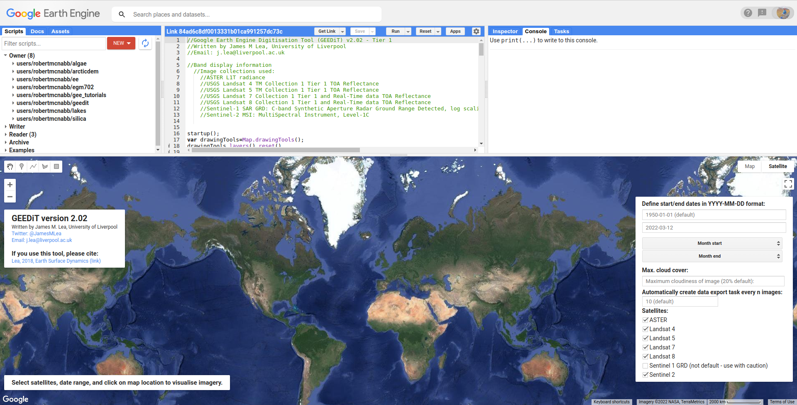
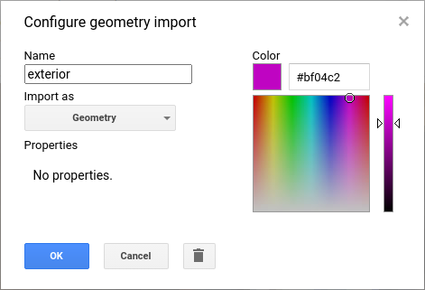
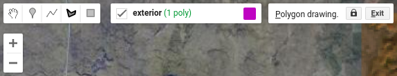
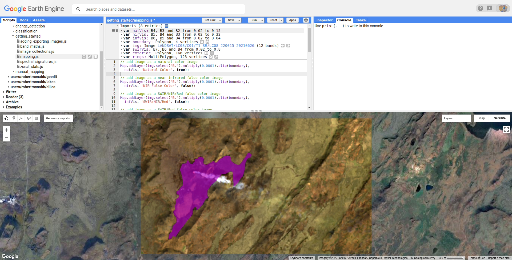
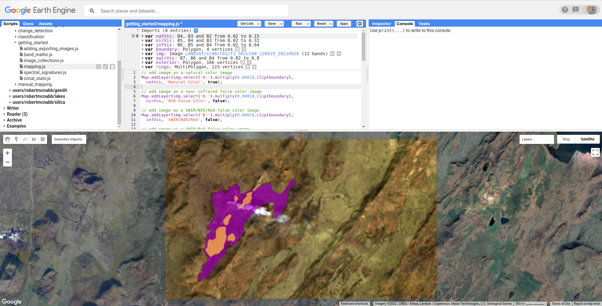
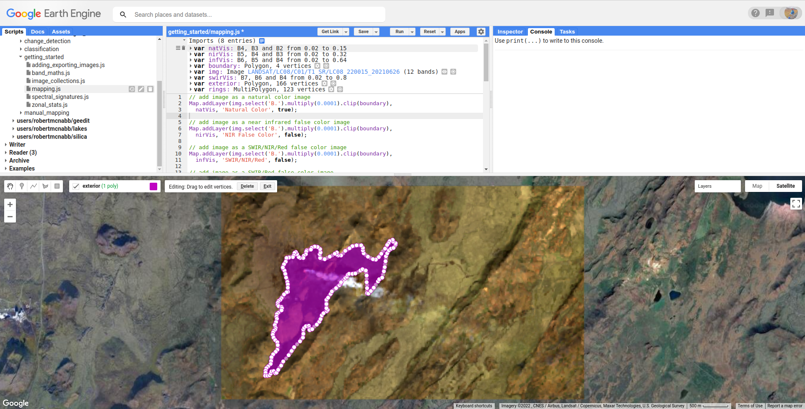
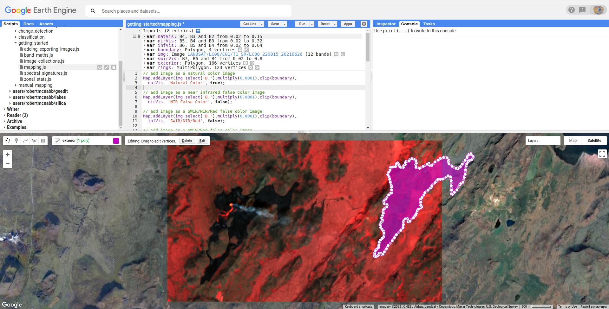
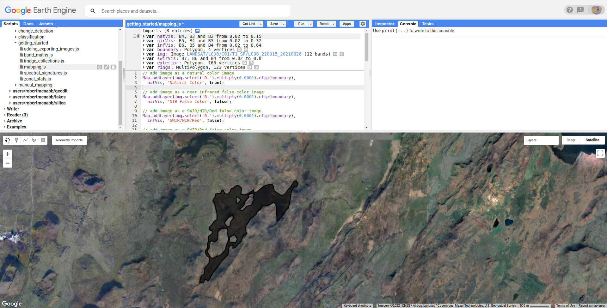
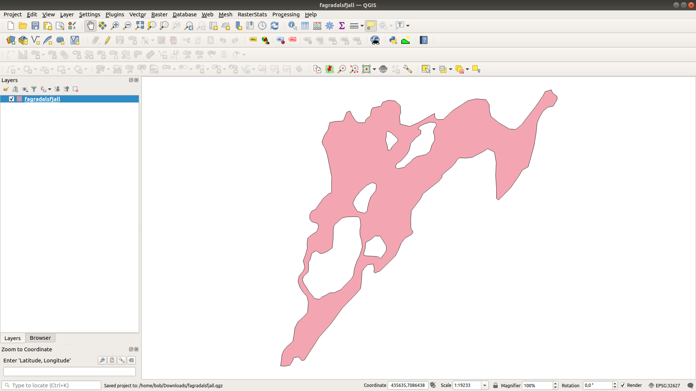

manual mapping (digitizing)
============================

.. tip::

    The script for this tutorial can be found via this `direct link <https://code.earthengine.google.com/?scriptPath=users%2Frobertmcnabb%2Fgee_tutorials%3A01_getting_started%2F04_mapping.js>`__.

    Alternatively, if you have already added the repository, you can open the script from the **Code Editor**, by
    navigating to ``01_getting_started/04_mapping.js`` under the **Reader** section.

In this tutorial, we'll see how we can use GEE's digitizing tools to map features. The images we'll be looking at
show the Geldingadalir (Fagradalsfjall) volcanic eruption on the Reykjanes Peninsula, Iceland, on 26 June 2021:

.. image:: img/mapping/fagradalsfjall.png
    :width: 720
    :align: center
    :alt: the Fagradalsfjall eruption on 26 June 2021

|br| By this point, the eruption, which began on 19 March 2021, has spread throughout parts of the valley, and can be seen
in the natural color image as a large, black area surrounding the active fissure.

In this tutorial, we'll see how we can use different band combinations, along with the GEE digitizing features,
to map the lava flow and determine its area, as well as other properties.

GEEDiT
-------

Before getting started, I want to plug the Google Earth Engine Digitisation Tool\ [1]_, GEEDiT. This is a tool for
that was designed for rapid digitizing of features from satellite imagery, with a range of tools to help make the
workflow of digitizing easier:

|br| If you are planning to do large-scale mapping of features, GEEDiT is a great (and easy!) tool to use. You can
check out the following links to use it and learn more about it:

- `GEEDiT version 2 <https://liverpoolgee.wordpress.com/geedit-geedit-reviewer/>`__
- `Video walkthroughs <https://twitter.com/JamesMLea/status/1479414214649384963>`__

(Landsat) band combinations
----------------------------

In the first two tutorials, we've been looking at "natural" (or "true") color composites - that is, the RGB bands displayed
in the **Map** correspond to visible red, green, and blue wavelengths (for Landsat 8 OLI, Bands 4, 3, and 2).

This is not the only way we can view images, however - we can display a color composite using any combination of bands -- we
can even display bands from different images, to help highlight changes over time.

The table below lists a few different combinations for OLI (and TM/ETM+) bands, including potential applications:

+-------------------+---------------+-------------------------------------------------------------------------------------------------------+
| OLI Bands (RGB)   | TM/ETM+ Bands | use                                                                                                   |
+===================+===============+=======================================================================================================+
| 4, 3, 2           | 3, 2, 1       | "natural color" image                                                                                 |
+-------------------+---------------+-------------------------------------------------------------------------------------------------------+
| 5, 4, 3           | 4, 3, 2       | standard "false color" composite, highlighting vegetation                                             |
+-------------------+---------------+-------------------------------------------------------------------------------------------------------+
| 7, 6, 5           | 7, 5, 4       | shortwave infrared, good for differentiating vegetation types, also minimizing atmospheric effects    |
+-------------------+---------------+-------------------------------------------------------------------------------------------------------+
| 7, 6, 4           | 7, 5, 3       | "urban" false color infrared, good for differentiating built-up areas                                 |
+-------------------+---------------+-------------------------------------------------------------------------------------------------------+
| 5, 6, 4           | 4, 5, 3       | good for differentiating between land and water                                                       |
+-------------------+---------------+-------------------------------------------------------------------------------------------------------+

When you run the script, you will see the natural color image loaded into the **Map**:

.. image:: img/mapping/fagradalsfjall.png
    :width: 720
    :align: center
    :alt: the Fagradalsfjall eruption on 26 June 2021

|br| The script will have also loaded (but not displayed) several other band combinations, including the near infrared false color composite
(bands 5, 4, and 3), a 654 false color composite, and a 764 false color composite.

.. note::

    In the natural color image, you should see a hint of a red lava flow, near the visible smoke plume. What do you notice as you look at
    the other color combinations? Why do you think this is?

When mapping, or digitizing, it can be beneficial to use different color combinations to help highlight the features we're
interested in.

- if you want to digitize the "active" lava flow, what band combination do you think would work best?
- if you want to digitize the entire lava flow, including cooled lava, what band combination would you use?

digitizing tools
-----------------

If you haven't already done so, run the script to add the images to the map.

We can start digitizing the same way that we added points in the :doc:`spectral` tutorial. First, hover over **Geometry Imports**
and then click on "+new layer". Hover over the new line in the **Geometry Imports** menu, then click on the gear icon to
open the **Configure geometry import** dialogue:

|br| Make sure that you're adding the layer as a ``Geometry`` before continuing. Call this layer "``exterior``" -- in the
images above, you can see that there are a number of "holes" in the lava flow - areas (hilltops) where the ground has not yet been covered
by lava. 

To be able to digitize *only* the lava flow, we need to first digitize the exterior perimeter, then the interior "rings". We'll
then use GEE to remove the rings from the ``exterior``, leaving only the areas covered by lava.

First, though, make sure that you've selected **Polygon drawing** from the **Drawing tools**:

To start digitizing, you can click on the map, and add points delineating the outer boundary of the lava flow. When you have finished
the polygon, double-click to finish the shape.

.. note::

    It might be useful to switch between the different **Layers** as you digitize - for example, the smoke plume from the active vent
    is mostly opaque in the natural color image, but is mostly transparent in the SWIR/Red image. The cooler lava (black colors) is
    usually easier to differentiate in the natural color or NIR false color image.

Once you're done, you should have something that looks like this (your outline might be somewhat different, but the basic shape should be similar):

|br| Now, repeat the process of adding a new **Geometry** layer called ``rings``, and digitize the areas inside of the outer boundary that aren't
covered by lava. In the end, you should have something that looks like this:

|br| Once you have added these two **Geometry** layers, uncomment the second section of this script (remove the ``/*`` from line 24,
and the ``*/`` from line 61).

editing polygons
-----------------

We can also move the vertices of our polygon. Make sure that you're no longer drawing (click on the left-most (hand) button in the **Drawing tools**),
then click on your polygon:

|br| You can click/drag on vertices to move them, or click and drag on entire shapes to move them:

.. warning:: 

    Be careful with this -- you can't easily move the polygon back to its exact original position!

To finish editing the vertices, click anywhere else in the **Map**, or click on **Exit** at the top of the **Map**. 

differncing geometries
-----------------------

To remove the ``rings`` from our ``exterior`` polygon, we use ``ee.Geometry.difference()``
(`documentation <https://developers.google.com/earth-engine/apidocs/ee-geometry-difference>`__):

.. code-block:: javascript

    var lavaflow = exterior.difference(rings);

Once we've done this, we can add the new **Polygon** to the **Map**:

.. code-block:: javascript

    Map.addLayer(lavaflow, {}, 'lava flow');

transforming features
----------------------

At the moment, ``lavaflow`` is a **Polygon** - it has coordinates, but no other properties -- not even
a projection.

To be able to add properties, we first have to create an ``ee.Feature()`` 
(`documentation <https://developers.google.com/earth-engine/apidocs/ee-feature>`__) object. At the same time,
we can use ``ee.Feature.transform()`` (`documentation <https://developers.google.com/earth-engine/apidocs/ee-feature-transform>`__)
to project the feature to a given coordinate reference system:

.. code-block:: javascript

    var lavaFeature = ee.Feature(lavaflow)
      .transform({maxError: 1, proj: img.projection()});

``ee.Feature.transform()`` takes two arguments:

- ``maxError``, the maximum allowable error when projecting, in the units of the coordinate system (usually meters)
- ``proj``, the coordinate reference system to transform the **Feature** to.

Here, we're using ``ee.Image.projection()`` (`documentation <https://developers.google.com/earth-engine/apidocs/ee-image-projection>`__) to
make sure that we transform the **Feature** to the same coordinate system as ``img`` (`EPSG:32627 <https://epsg.io/32627>`__, WGS 84 UTM zone 27N).

adding values to features
--------------------------

Now that we have a **Feature** that has been projected to a coordinate system, we can calculate properties like area and perimeter,
using ``ee.Geometry.Polygon.area()`` (`documentation <https://developers.google.com/earth-engine/apidocs/ee-geometry-polygon-area>`__) and 
``ee.Geometry.Polygon.perimeter()`` (`documentation <https://developers.google.com/earth-engine/apidocs/ee-geometry-polygon-perimeter>`__):

.. code-block:: javascript

    // get the area of the lava flow (in square meters)
    var area = lavaflow.area({maxError: 1, proj: img.projection()});

    // get the perimeter of the lavaflow
    var perimeter = lavaflow.perimeter({maxError: 1, proj: img.projection()});

Here, we want to make sure that we're using the correct coordinate system. Just like with ``ee.Feature.transform()``, 
``ee.Geometry.Polygon.area()`` and ``ee.Geometry.Polygon.perimeter()`` take two arguments, ``maxError`` and ``proj``.

.. warning:: 

    If you don't set the projection, your results will be in the default coordinate system, and may not make sense as a result.

We also want to record the date for our lava flow outline, which we take from ``img`` using 
``ee.Image.date()`` (`documentation <https://developers.google.com/earth-engine/apidocs/ee-image-date>`__):

.. code-block:: javascript

    var date = img.date();

Finally, we use ``ee.Feature.set()`` (`documentation <https://developers.google.com/earth-engine/apidocs/ee-feature-set>`__) 
to add the properties to our **Feature**:

.. code-block:: javascript

    lavaFeature = lavaFeature.set({
      'area': area,
      'perimeter': perimeter,
      'date': date
    });

exporting polygons
-------------------

Once we have our **Feature**, transformed to an appropriate coordinate reference system with added properties, we can export our
digitized outline to Google Drive using ``Export.table.toDrive()`` 
(`documentation <https://developers.google.com/earth-engine/apidocs/export-table-todrive>`__):

.. code-block:: javascript

    Export.table.toDrive({
      collection: ee.FeatureCollection(lavaFeature),
      description: 'Lava',
      fileFormat: 'SHP'
    }); 

Note that we have to create a **FeatureCollection** from our **Feature**, as ``Export.table.toDrive()`` requires a **FeatureCollection**.

Once you have run the script, you can run the **Task** from the **Tasks** tab to start the process. You can then import your feature 
into your GIS software of choice:

next steps
-----------

At this point, you've seen how you can use GEE to map, or digitize, objects visible in satellite images. You've also
seen how to add properties to these features, and export them to a file.

If you're interested in some additional practice, here are some suggestions:

- try to find a `Sentinel-2 <https://developers.google.com/earth-engine/datasets/catalog/COPERNICUS_S2_SR>`__ image close to the same date, then repeat the digitizing. how does your result change?
- alternatively, use the `Sentinel-1 GRD <https://developers.google.com/earth-engine/datasets/catalog/COPERNICUS_S1_GRD>`__ product to digitize the outlines. Sentinel-1 is a C-band synthetic aperture radar (SAR) sensor, which means it has the ability to "see" through clouds and even at night. These images will be more difficult to interpret than the optical images we've used so far, but it can provide a very powerful alternative (or complement) to the datasets we've been using.
- using GEEDiT, digitize the lava flow area over time, then create a chart showing the area change.

references and notes
---------------------

.. [1] Lea, J. M (2018). *Earth Surf. Dynam.*, 6, 551–561 . doi: `10.5194/esurf-6-551-2018 <https://doi.org/10.5194/esurf-6-551-2018>`__

