spectral signatures
====================

.. tip::

    The script for this tutorial can be found via this `direct link <https://code.earthengine.google.com/?scriptPath=users%2Frobertmcnabb%2Fgee_tutorials%3A01_getting_started%2F02_spectral_signatures.js>`__.

    Alternatively, if you have already added the repository, you can open the script from the **Code Editor**, by
    navigating to ``01_getting_started/02_spectral_signatures.js`` under the **Reader** section.

This tutorial is designed to have you use Google Earth Engine (GEE) to examine the 
`spectral signatures <https://en.wikipedia.org/wiki/Spectral_signature>`__ of different surfaces. 
After finishing this tutorial, you should be able to:

- import geometries into your script
- extract values from an image using a **FeatureCollection**
- plot properties extracted from a **FeatureCollection**
- set custom chart properties and options
- export the data plotted in a chart to a CSV
- use spectral signatures to investigate differences in spectral signatures for different surface types

importing geometries
---------------------

In the previous tutorial, we used the **Inspector** tab to look at band values for different points by
clicking on the map:

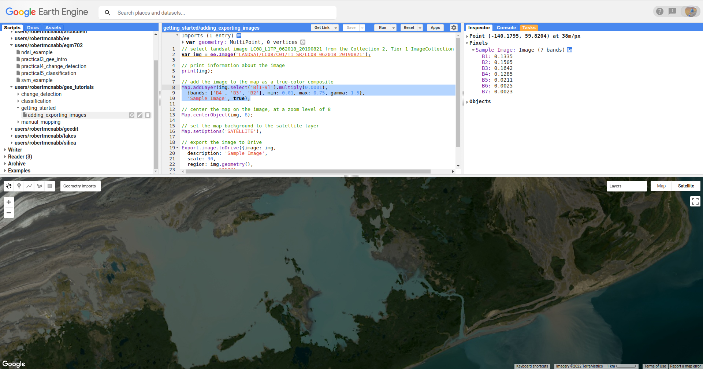

|br| While useful, this is also limited - we can only do this for one point at a time, the value depends
at least in part by the zoom level of the **Map** window, and if we want to save the data for later
analysis, we have to do it every single time we click on a new point.

In this tutorial, we'll see how we can use a number of different tools in GEE to plot data and also
export it for later analysis.

To get started, look at the top of the script. You should see the following:

.. image:: img/spectral/imports.png
    :width: 720
    :align: center
    :alt: the imports at the top of the script

|br| These are the **Imports** for the script - in addition to the geometries shown here, you can also
import **Assets** (files uploaded to GEE), **Image**\ s or **Image Collection**\ s, and even
display settings for **Map** layers.

Run the script - you should see the following:

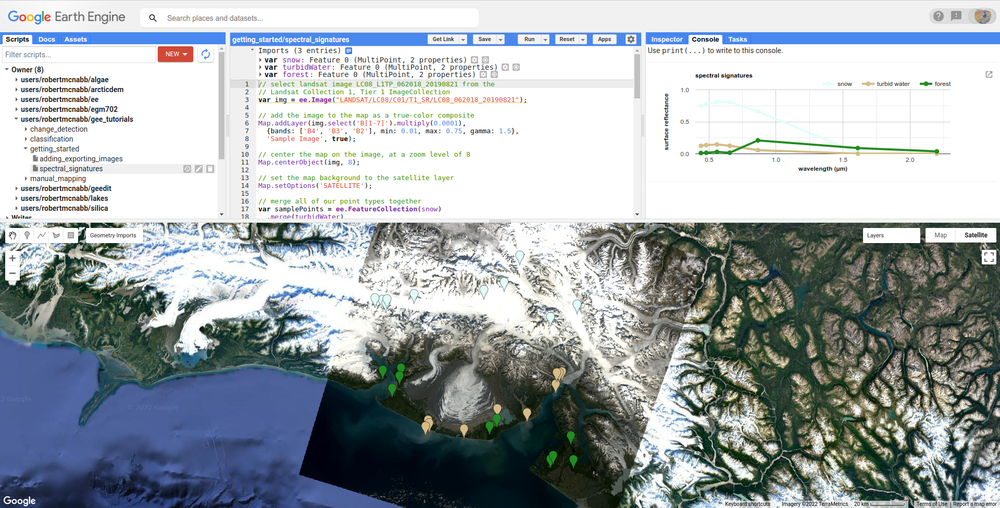

|br| Next, we'll add points for another surface type - instead of turbid water (water with lots of suspended
sediments), we'll choose points over deep water.

First, mouse over the **Geometry Imports** menu:

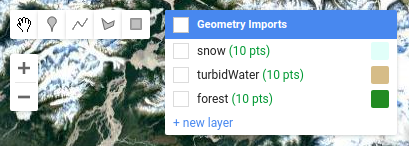

|br| At the bottom of the **Geometry Imports** menu, click on "**new layer**" to add a new layer, then click on
the gear icon to open the configuration panel:

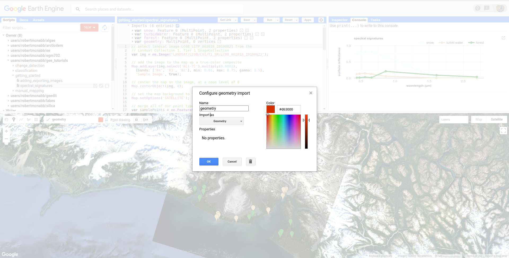

|br| When adding geometry features from the map, you can choose to import them as a **Geometry**, a **Feature**,
or a **FeatureCollection**:

- **Geometry** means only vector data (no attributes/properties)
- **Feature** means you can have a geometry and attributes/properties, it will be treated as a single feature by GEE. So, if you have multiple points in a **Feature**, it will be imported as a **MultiPoint Feature**
- **FeatureCollection** means that each geometric object is treated as a **Feature** -- so, multiple points are treated as individual points. 

For this tutorial, we've imported the sample points as **Feature**\ s. Make sure that you've set **Import as** to **Feature**,
and change the name from ``geometry`` to ``water``:

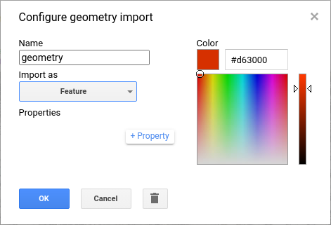

|br| Next, click the **+property** button to add a new property:

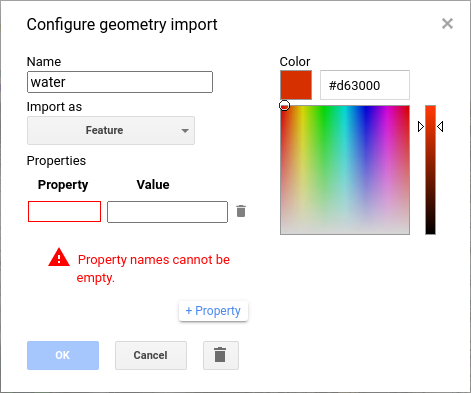

|br| Call this property ``name`` (left box), and give it a value of ``water`` (right box). Add a second property called ``label``, and
give it a value of ``3`` -- our other three imports (``snow``, ``turbidWater``, and ``forest``) have ``label`` values of 
``0``, ``1``, and ``2``, respectively.

Change the color to something more appropriate, then click **OK**. You should now see the import at the top of the script:

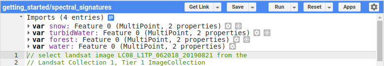

|br| Next, we have to actually add points to the **Feature**. Make sure that **Add a marker** is highlighted in the digitizing menu,
and that **Point drawing** is on:

.. image:: img/spectral/drawing_menu.png
    :width: 400
    :align: center
    :alt: the drawing menu showing the "add a marker" button

|br| If it's not, you can mouse over the **Geometry Imports** menu and click on the import you want to add geometries to. Once drawing
is turned on, you can add points by clicking on the **Map** -- a new marker will display each time you click:

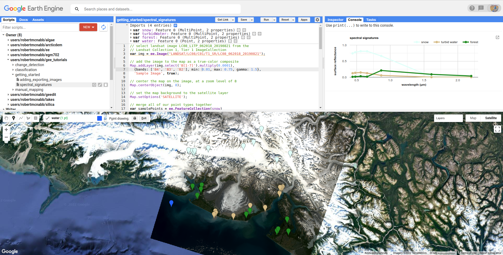

|br| Add 10 points to the class by clicking in the **Map** in areas where you see deep water - try to avoid areas with high turbidity
(e.g., lots of brown/green color).

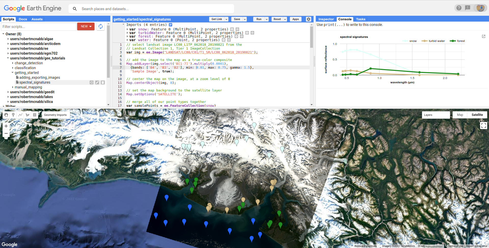

|br| Once you've added your points, turn off **Point drawing** by clicking on the import name, or clicking on the **Stop drawing** (hand)
button:

|br| Now that we've added an additional point, we can move on to look at the script in more detail.

.. note::

    There's nothing inherently special about using 10 points here - this is only for illustrative purposes.

merging features
--------------------

The first part of this script (lines 1  -- 14) are things we've seen in the previous tutorial:

- add an image to the script by declaring a **var**\ iable, ``img``, by using ``ee.Image()`` and the image's ID
- adding the image to the **Map** using ``Map.addLayer()``
- centering the **Map** on the ``img`` object at a zoom level of 8
- set the **Map** options to use the satellite image basemap, rather than the default.

The first "new" part of the script shows up at line 16:

.. code-block:: javascript

    // merge all of our point types together
    var samplePoints = ee.FeatureCollection(snow)
      .merge(turbidWater)
      .merge(forest);
      // add your points here! don't forget to delete the semicolon above!

This creates a **FeatureCollection** (`documentation <https://developers.google.com/earth-engine/apidocs/ee-featurecollection>`__) 
out of the first **Feature**, ``snow``, then uses ``ee.FeatureCollection.merge()`` 
(`documentation <https://developers.google.com/earth-engine/apidocs/ee-featurecollection-merge>`__) to add both
the ``turbidWater`` and ``forest`` **Feature**\ s. The end result is a **FeatureCollection** with three **Features** corresponding
to our imported geometries.

To add the ``water`` **Feature** to ``samplePoints``, delete the semicolon (``;``) at the
end of line 19, and add a new ``merge()`` call:

.. code-block:: javascript

    // merge all of our point types together
    var samplePoints = ee.FeatureCollection(snow)
      .merge(turbidWater)
      .merge(forest)
      .merge(water);

Now, the ``water`` points will be included whenever we use the ``samplePoints`` object later on.

extracting image values
------------------------

Now that we have a **FeatureCollection** with all of the points, we can use it to select the surface reflectance
values from our image at our sample points. First, we make sure to only use the surface reflectance bands (bands 1-7):

.. code-block:: javascript

    // select only the surface reflectance bands
    img = img.select('B[1-7]').multiply(0.0001);

Next, we use ``ee.Image.reduceRegions()`` (`documentation <https://developers.google.com/earth-engine/apidocs/ee-image-reduceregions>`__)
to get the mean pixel values for each band at our different points:

.. code-block:: javascript

    // use ee.Image.reduceRegions() to get the mean
    // surface reflectance for each surface type
    var ptRefl = img.reduceRegions({
      reducer: ee.Reducer.mean(),
      collection: samplePoints,
      scale: 30
    });

``ee.Image.reduceRegions()`` requires that we name the ``reducer`` to apply to the image, the ``collection`` that we're reducing over,
and the ``scale`` (in m) to use for the image. The ``collection`` that we're using is our ``samplePoints`` **FeatureCollection**,
and the ``scale`` is 30 m - corresponding to the GSD of the Landsat image.

In GEE, a **Reducer** (`documentation <https://developers.google.com/earth-engine/guides/reducers_intro>`__) is what we use
to aggregate data. There are a number of different **Reducer**\ s available, ranging from simple statistics like the mean or
standard deviation (``ee.Reducer.mean()``, ``ee.Reducer.stdDev()``), to more complicated operations like linear regression
(``ee.Reducer.robustLinearRegression()``).

For this tutorial, we want to be able to plot the mean reflectance for different surface types in different bands -- so
we're using ``ee.Reducer.mean()``. In other tutorials, we'll make use of more complicated reducers.

extracting feature values
--------------------------

The output of our image reduction is a **FeatureCollection**, ``ptRefl``. To look at what's been added to our points,
you can add ``print(ptRefl);`` to the script after line 32, and re-run the script. You should see this in the **Console**:

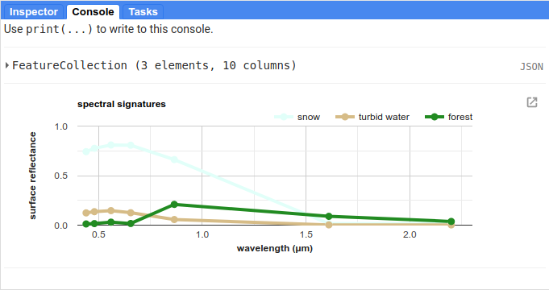

|br| You can expand the object by clicking on it to view its properties. First, look at the ``columns`` **Object**:

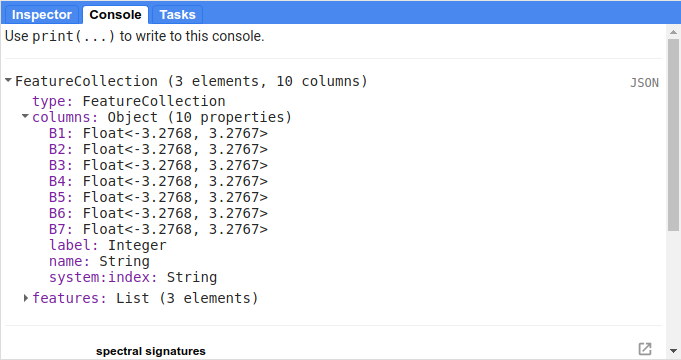

|br| This shows what properties each **Feature** in the **FeatureCollection** has, analogous to the fields in an attribute table.
You can see that we have columns for each of the image bands that we extracted (``B1`` -- ``B7``), plus the ``label`` and
``name`` properties from our original imports.

When you expand the ``features`` **List**, you can see that each **Feature** has 9 **properties**, corresponding to the ``columns``:

.. image:: img/spectral/properties.png
    :width: 400
    :align: center
    :alt: the feature collection properties expanded

|br| We want to extract these values and plot them in a chart, so that we can see how they compare to each other.

One of the ways that we can do this is using ``ee.FeatureCollection.aggregate_array()`` 
(`documentation <https://developers.google.com/earth-engine/apidocs/ee-featurecollection-aggregate_array>`__).
This will create a **List** object that contains all of the values of a given property from each **Feature**
in the **FeatureCollection**.

The first way that we'll use this is to extract all of the ``name`` values from ``ptRefl``, so that we can
use this in our chart:

.. code-block:: javascript

    // get a list of the names of the surface types
    var categories = ptRefl.aggregate_array('name');

Note that ``ee.FeatureCollection.aggregate_array()`` only allows us to use a single property. This means that
we can't just pass a **List** of the band names that we want to extract.

We could create new variables by calling ``ee.FeatureCollection.aggregate_array()`` on each band name in turn,
then combining all of these variables in an **Array**. That would work, but it's very much not ideal. If we wanted
to re-use our script for a different image, for example, we'd have to re-type each of the band names, adding/subtracting
lines based on the number of bands. At the very least, it's an unnecessary mess.

Fortunately, there is a better way to do this. First, we use ``ee.Image.bandNames()`` 
(`documentation <https://developers.google.com/earth-engine/apidocs/ee-image-bandnames>`__) 
to get a **List** of the names of the bands from ``img``:

.. code-block:: javascript

    // get the band names from the image
    var bandNames = img.bandNames();

Next, we can use ``ee.List.map()`` (`documentation <https://developers.google.com/earth-engine/apidocs/ee-list-map>`__) 
to iterate over the different elements of ``bandNames``: 

.. code-block:: javascript

    // get an array of the mean reflectance for each surface type
    var reflectances = bandNames.map(function(band){
      return ptRefl.aggregate_array(band);
    });

In general, GEE prefers using ``map`` to iterate, rather than something like a ``for`` loop 
(`explanation <https://developers.google.com/earth-engine/tutorials/tutorial_js_03>`__). Here, we're using the following
``function``:

.. code-block:: javascript

    function(band){
        return ptRefl.aggregate_array(band);
    }

This ``function`` takes a single **input**, ``band``, and **return**\ s the output of ``ptRefl.aggregate_array(band)`` - exactly
the same as if we were to use something like this:

.. code-block:: javascript

    var band = 'B1';
    var b1_refl = ptRef.aggregate_array(band);

When we pass the ``function`` above to ``bandNames.map()``, ``map`` passes each of the values found in ``bandNames``
to this function, and combines the results into a **List** - making, a nested **List** object, or an **Array**. 

You can see what this looks like by adding ``print(reflectances);`` after line 42, and re-running the script. 
You should see something like this (remember that your values will be different!):

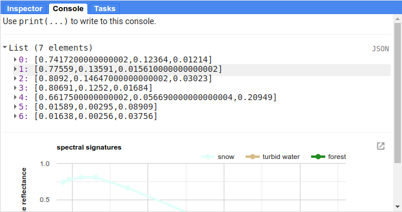

|br| This is the data that we'll use to create the our plot - each element of the list represents the reflectance values
for our sample points in the given band (ordered based on ``bandNames``).

creating a chart
-----------------

Before we're ready to plot the results, we'll create a **List** with the central wavelengths (in µm) of our bands
(`source <https://www.usgs.gov/faqs/what-are-band-designations-landsat-satellites>`__):

.. code-block:: javascript

    // get a list of the central wavelengths of the bands
    var wavelengths = ee.List([0.44, 0.48, 0.56, 0.655, 0.865, 1.61, 2.2]);

We'll use this as the x-values of our plot.

The final block of this script creates the **Chart** object using ``ui.Chart.array.values`` 
(`documentation <https://developers.google.com/earth-engine/apidocs/ui-chart-array-values>`__), 
then uses ``print()`` to display the **Chart** in the **Console**.

.. note:: 

    Your **Chart** will not display if you don't ``print`` it - make sure to remember this step!

This is a long chunk of code, so I'll try to explain it in parts. The first part:

.. code-block:: javascript

    // plot a chart of the mean reflectances vs the wavelengths
    var chart = ui.Chart.array.values({
      array: reflectances,
      axis: 0,
      xLabels: wavelengths
    })

is what actually plots the data. The ``array`` is the actual values (y-axis) that we want to plot,
the ``axis`` determines which axis of the ``array`` to plot, and the ``xLabels`` are the index 
along the ``axis``.

Here, we're using ``reflectances`` (as we've seen, a 7x\ *n* array, where *n* is the number of **Features**
in our **FeatureCollection**). Because ``reflectances`` is a 7x3 array (in this example), we want to
plot along the ``0`` (first) ``axis``. Finally, we use our wavelength values as the ``xLabels`` - this 
will plot each value at its corresponding wavelength location, rather than at an even spacing
along the x-axis.

The rest of this section is how we can adjust the chart options to make it more clear. If we don't,
the basic chart looks like this:

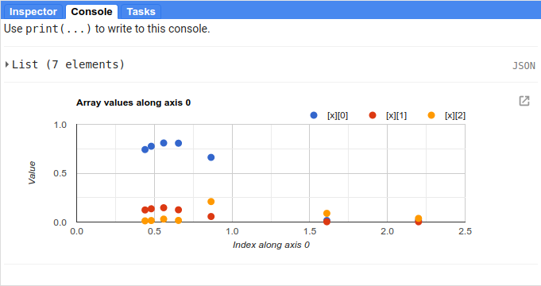

|br| This isn't particularly clear (or attractive), so we add the following. First, we use ``ui.Chart.setSeriesNames()``
(`documentation <https://developers.google.com/earth-engine/apidocs/ui-chart-setseriesnames>`__) to
change the labels for each **series** (group of data), using the ``categories`` value so that it matches
the ``name`` property for each **Feature**:

.. code-block:: javascript

    .setSeriesNames(categories) // change the names of each line

Next, we use ``ui.Chart.setOptions()`` (`documentation <https://developers.google.com/earth-engine/apidocs/ui-chart-setoptions>`__)
to change the various labels, as well as set the properties of the lines being plotted:

.. code-block:: javascript

    .setOptions({
        title: 'spectral signatures',
        hAxis: {
          title: 'wavelength (µm)', 
          titleTextStyle: {italic: false, bold: true},
          viewWindow: {min: 0.4, max: 2.3}
        },
        vAxis: {
          title: 'surface reflectance',
          titleTextStyle: {italic: false, bold: true},
          viewWindow: {min: 0, max: 1}
        },
        series: {
          0: {lineWidth: 4, color: 'e1fff9'},
          1: {lineWidth: 4, color: 'd6bc87'},
          2: {lineWidth: 4, color: '228b22'},
          // add the next category here (don't forget the comma!)
        }
    });

Note that what we're passing to ``ui.Chart.setOptions()`` is a **Dictionary** with the following keys:

- ``title`` - the title of the Chart
- ``hAxis`` - the horizontal (x) axis properties
- ``vAxis`` - the vertical (y) axis properties
- ``series`` - the properties of the lines

Note that each of ``hAxis``, ``vAxis``, and ``series`` is also a **Dictionary** that sets additional properties,
such as the label text (``title``), font style (``titleTextStyle``), and axis limits (``viewWindow``).

With ``series``, we set the properties of each line. We can set the properties of all of the lines together,
or differentiate them. Here, I've plotted each line according to the color of the geometry imports.

Note that if you were to run the script now, ``water`` would be added to the plot, but the colors and line style
would not be updated:

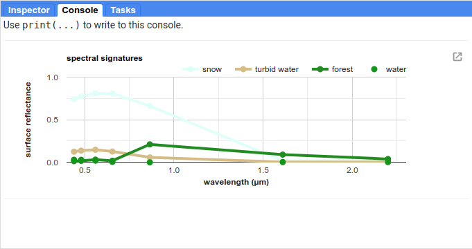

|br| To set the properties for this series, you'll need to add a line to the ``series`` **Dictionary**:

.. code-block:: javascript

    series: {
      0: {lineWidth: 4, color: 'e1fff9'},
      1: {lineWidth: 4, color: 'd6bc87'},
      2: {lineWidth: 4, color: '228b22'},
      3: {lineWidth: 4, color: '2362ff'},
      // add the next category here (don't forget the comma!)
    }

Once you've set the properties, you should see that the ``water`` line has been updated accordingly:

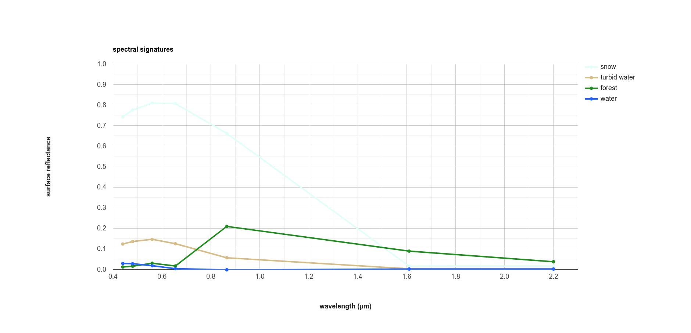

|br| Finally, open the chart in a new window by clicking the button in the upper right corner of the chart. From here,
you can save the chart as a SVG or PNG file, or export the data as a CSV.

next steps
-----------

At this point, you've seen how you can import geometries (or **Feature**\ s, or **FeatureCollection**\ s) to your script.
You've also seen how to extract image values using those geometries, and how to plot those values in a chart.

If you're interested in some additional practice, here are some suggestions:

- Try to add some additional **Feature**\ s to the plot - have a look around the image to see what other surface types it might make sense to include.
- Experiment with adding additional points to each **Feature** - how does this affect the surface reflectance plot?
- For an extra challenge, try to adapt this script to use a different image source, such as `Sentinel-2 <https://developers.google.com/earth-engine/datasets/catalog/COPERNICUS_S2_SR>`__, `Sentinel-3 <https://developers.google.com/earth-engine/datasets/catalog/COPERNICUS_S3_OLCI>`__, or `MODIS <https://developers.google.com/earth-engine/datasets/catalog/MODIS_006_MCD43A4>`__. Comparing these datasets to the Landsat plot would give you a way to see how a sensor's spectral resolution affects the spectral data you can extract for each surface -- are there surfaces where this makes a significant difference in what you see with the spectral signature? 

