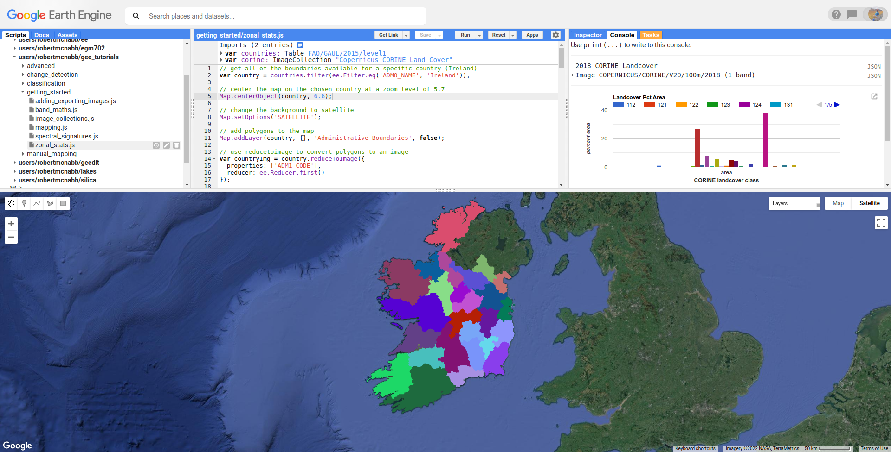
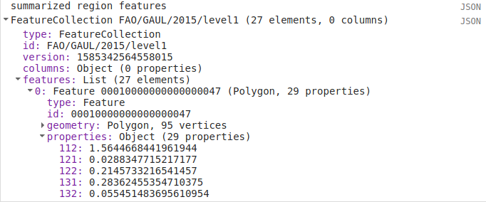

zonal statistics
=================

In GIS, `zonal statistics <https://pro.arcgis.com/en/pro-app/latest/tool-reference/spatial-analyst/how-zonal-statistics-works.htm>`__ 
is a process whereby you calculate statistics for the pixels of a raster in different groups, or zones, defined by properties in another dataset. 

In this tutorial, we'll use the `Global Administrative Unit Layers 2015 <https://developers.google.com/earth-engine/datasets/catalog/FAO_GAUL_2015_level1>`__,
along with the `Copernicus CORINE Land Cover <https://developers.google.com/earth-engine/datasets/catalog/COPERNICUS_CORINE_V20_100m>`__
dataset, to see how we can perform zonal statistics in GEE on both **Feature** and **FeatureCollection** datasets.

By the end of this tutorial, you should be able to:

- display vector data in GEE by converting it to an image
- select an item from an **ImageCollection** using the item's index
- use ``ui.Chart.image.byClass()`` to summarize and display image data
- use "currying" to re-write a function with multiple arguments into multiple functions of a single argument

displaying vector data
-----------------------

When you open the script, you should see two **imports**: the GAUL level 1 **FeatureCollection**, and the CORINE Land Cover **ImageCollection**.
The first line of the script selects all **Feature**\ s where ``ADM0_NAME`` is equal to ``Ireland``:

.. code-block:: javascript

    var country = countries.filter(ee.Filter.eq('ADM0_NAME', 'Ireland'));

This provides us with a **FeatureCollection** of all of the `Counties of Ireland <https://en.wikipedia.org/wiki/Counties_of_Ireland>`__.
We then add this to the **Map** using ``Map.addLayer()``:

.. code-block:: javascript

    Map.addLayer(country, {}, 'Administrative Boundaries', false);

The options for displaying vector data on the **Map** are quite limited, though -- we can't actually set display properties in the same
way that we can for **Image** data:

.. image:: img/zonal_stats/vectors.png
    :width: 600
    :align: center
    :alt: the vector data after being added to the map

If we want to display vector data using different colors, we have to use ``ee.FeatureCollection.reduceToImage()``
(`documentation <https://developers.google.com/earth-engine/apidocs/ee-featurecollection-reducetoimage>`__):

.. code-block:: javascript

    var countryImg = country.reduceToImage({
      properties: ['ADM1_CODE'],
      reducer: ee.Reducer.first()
    });

This will convert the **FeatureCollection** vectors to an **Image**, where the pixel values are equal to the specified ``properties``
reduced using the specified ``reducer``.

Here, the image will have values corresponding to the ``ADM1_CODE``, the GAUL code for the first-level administrative units.
When adding the **Image** to the **Map**, we can also use ``ee.Image.randomVisualizer()`` 
(`documentation <https://developers.google.com/earth-engine/apidocs/ee-image-randomvisualizer>`__)
to provide a random palette to display the image as:

.. code-block:: javascript

    Map.addLayer(countryImg.randomVisualizer(), {}, 'Regions', false);

selecting from collections
----------------------------

The ``corine`` **import** is an **ImageCollection**, containing 5 separate images: 1990, 2000, 2006, 2012, and 2018.
We want to use the 2018 dataset, which means that we need to select the 5th image from the **ImageCollection**:

.. code-block:: javascript

    var landcover2018 = ee.Image(corine.toList(1000).get(4)).clipToCollection(country);

This uses ``ee.ImageCollection.toList()`` (`documentation <https://developers.google.com/earth-engine/apidocs/ee-imagecollection-tolist>`__) 
to convert the **ImageCollection** to a **List** -- note that when calling ``ee.ImageCollection.toList()``,
you need to specify the ``count`` of the **List** -- the maximum number of elements to fetch.

We then use ``ee.List.get()`` (`documentation <https://developers.google.com/earth-engine/apidocs/ee-list-get>`__) to
grab the 5th element (**remember: indices start counting from 0!**) from the **List**, corresponding to the 2018
dataset. 

.. note:: 

    We could also use a negative index to start counting from the end of the list - so, ``ee.List.get(-1)`` would return
    the last element from the list, ``ee.List.get(-2)`` would return the second-last, and so on.

Because of the way that fetching items from lists works in GEE, the output of ``ee.List.get()`` is an ambiguous
object type. This means that we have to *cast* the output of ``ee.List.get()`` as an **Image**, using
``ee.Image()`` - otherwise, we won't be able to treat this as an **Image** (meaning we can't use the **Image** object
methods).

Finally, we clip the **Image** to the ``country`` boundaries, using ``ee.Image.clipToCollection()``
(`documentation <https://developers.google.com/earth-engine/apidocs/ee-image-cliptocollection>`__).

The CORINE dataset has a built-in palette, which means that when we add the **Image** to the **Map**:

.. code-block:: javascript

    Map.addLayer(landcover2018, {}, '2018 Corine Landcover', false);

it already has a color palette:

.. image:: img/zonal_stats/landcover.png
    :width: 600
    :align: center
    :alt: the landcover image added to the map

chart by class
----------------

To display a chart showing the percent area that each landcover class occupies in a single county, Donegal
(recently voted `the best county in Ireland <https://www.reddit.com/r/ireland/comments/njess8/we_have_a_winner_congratulations_to_donegal_for/>`__),
we first filter the ``country`` **FeatureCollection** to select the **Feature**\ s where the ``ADM1_NAME``
is Donegal, then use ``ee.FeatureCollection.first()``
(`documentation <https://developers.google.com/earth-engine/apidocs/ee-featurecollection-first>`__)
to select a single **Feature** (because ``ee.FeatureCollection.filter()`` returns a **FeatureCollection**):

.. code-block:: javascript

    var region = ee.Feature(country.filter(ee.Filter.eq('ADM1_NAME', 'Donegal')).first());

We then use ``ui.Chart.image.byClass()`` (`documentation <https://developers.google.com/earth-engine/apidocs/ui-chart-image-byclass>`__)
to create a **Chart** object that summarizes the landcover values within the selected county:

.. code-block:: javascript

    var classChart = ui.Chart.image.byClass({
      image: ee.Image.pixelArea().divide(region.area()).multiply(100)
        .addBands(landcover2018.clip(region)),
      classBand: 'landcover', 
      region: region,
      scale: 100,
      reducer: ee.Reducer.sum()
    }).setOptions({
      title: 'Landcover Pct Area',
      hAxis: {
        title: 'CORINE landcover class',
        titleTextStyle: {italic: false, bold: true},
      },
      vAxis: {
        title: 'percent area',
        titeTextStyle: {italic: false, bold: true},
        viewWindow: {min: 0, max: 40}
      }
    });

This part of the above code:

.. code-block:: javascript

    ee.Image.pixelArea().divide(region.area()).multiply(100).addBands(landcover2018.clip(region))

Uses ``ee.Image.pixelArea()`` (`documentation <https://developers.google.com/earth-engine/apidocs/ee-image-pixelarea>`__), 
``ee.Image.divide()`` to divide the pixel area by the total area of the ``region``, and
``ee.Image.multiply()`` to multiply this to 100, so that the results represent the percent of the entire
``region`` that each landcover class takes up.

Finally, we use ``ee.Image.addBands()`` (`documentation <https://developers.google.com/earth-engine/apidocs/ee-image-addbands>`__)
to add the ``landcover`` **Image** to this one. 

``ui.Chart.image.byClass()`` then uses the specified ``classBand`` to group pixels in the other bands and apply
the specified **Reducer** (here, ``ee.Reducer.sum()`` (`documentation <https://developers.google.com/earth-engine/apidocs/ee-reducer-sum>`__),
to return the sum of all of the pixel areas for each class).

We also specify the ``geometry`` to use (our selected county), and the ``scale`` of the **Image** to use (100 m, the resolution of
the CORINE dataset).

Similar to what we've done before, we use ``ui.Chart.setOptions()`` to provide labels for the **Chart**, before using ``print()``
to display the chart:

.. image:: img/zonal_stats/landcover_chart.png
    :width: 600
    :align: center
    :alt: a chart showing the percent area of each landcover class in donegal

.. note::

    For information about what classes each value corresponds to, you can check the 
    `landcover class table <https://developers.google.com/earth-engine/datasets/catalog/COPERNICUS_CORINE_V20_100m#bands>`__ 
    in the GEE Data Catalog.

summarizing over a feature
----------------------------

This is one way to summarize the information, but we might also want to add these properties to the **Feature**, so that
we can export the data for later analysis.

To do this, we'll write a **function** that takes a **Feature** and an **Image** as inputs, and ``return``\ s a **Feature**
with the percent area for each landcover value added as a property.

The full function is shown here, but we'll walk through each part in turn:

.. code-block:: javascript

    function summarizeLandcover(region, img){
      var areas = ee.Image.pixelArea().addBands(img).clip(region)
        .reduceRegion({
          reducer: ee.Reducer.sum().group({
            groupField: 1,
            groupName: 'landcover'
          }),
          geometry: region.geometry(),
          scale: 100,
          crs: img.projection(),
          maxPixels: 1e13
        });

      // get the landcover values, converted to a string
      var landcovers = ee.List(areas.get('groups')).map(function(item){
        return ee.String(ee.Dictionary(item).get('landcover'));
      });

      // get the area values, converted to percent area  
      var normAreas = ee.List(areas.get('groups')).map(function(item){
        return ee.Number(ee.Dictionary(item).get('sum'))
          .divide(ee.Number(region.area())).multiply(100);
      });
      
      // return a dictionary of (class, area) key value pairs
      var properties = ee.Dictionary(landcovers.zip(normAreas).flatten());
      return region.set(properties);
    }

The first part of the function creates a new variable called ``areas``, which is the output of
``ee.Image.reduceRegion()`` (`documentation <https://developers.google.com/earth-engine/apidocs/ee-image-reduceregion>`__):

.. code-block:: javascript

  var areas = ee.Image.pixelArea().addBands(img).clip(region)
    .reduceRegion({
      reducer: ee.Reducer.sum().group({
        groupField: 1,
        groupName: 'landcover'
      }),
      geometry: region.geometry(),
      scale: 100,
      crs: img.projection(),
      maxPixels: 1e13
    });

The **Image** used is the output of ``ee.Image.pixelArea()``, with the input **Image** bands added -- just
like what we used for ``ui.Chart.image.byClass()`` above.

``ee.Image.reduceRegion()`` has a number of inputs:

- ``reducer``, the **Reducer** to apply to the image
- ``geometry``, the region over which to reduce data
- ``scale``, the scale (in m) of the projection to use
- ``crs``, the projection to work in
- ``maxPixels``, the maximum number of pixels to reduce

The **Reducer** that we're using is ``ee.Reducer.sum()``, and we're using ``ee.Reducer.group()``
(`documentation <https://developers.google.com/earth-engine/apidocs/ee-reducer-group>`__) to group
the outputs using the ``landcover`` band:

- ``groupField``, the field (or band) that contains the groups. ``landcover`` is the second band of the image, corresponding to index 1.
- ``groupName`` the key that contains the groups

The ``areas`` object is a **Dictionary** with a single **key**, ``groups``, which is a list containing a **Dictionary** for each
landcover class. Each of these has two **key**\ s, one for the landcover code value, and one for the calculated sum:

.. image:: img/zonal_stats/groups.png
    :width: 400
    :align: center
    :alt: the output of ee.Image.reduceRegion()

This is somewhat unwieldy - we want to combine these into a single **Dictionary** with **key**/**value** pairs corresponding to
each landcover class.

To do this, we first pull the landcover classes out of the **Dictionary** using ``ee.Dictionary.get()`` 
(`documentation <https://developers.google.com/earth-engine/apidocs/ee-dictionary-get>`__). Similar to with ``ee.List.get()``,
this has to be *cast* as a **List**. We then use ``ee.List.map()``
(`documentation <https://developers.google.com/earth-engine/apidocs/ee-list-map>`__), with a function that 
returns a **String** of the landcover value from each **Dictionary** within the **List**:

.. code-block:: javascript

    var landcovers = ee.List(areas.get('groups')).map(function(item){
      return ee.String(ee.Dictionary(item).get('landcover'));
    });

We do the same thing for the areas:

.. code-block:: javascript

    var normAreas = ee.List(areas.get('groups')).map(function(item){
      return ee.Number(ee.Dictionary(item).get('sum'))
        .divide(ee.Number(region.area())).multiply(100);
    });

but this time, we get the output as a **Number**, making sure to convert to percent area like we did for the **Chart** above.

Now, we have two **List** objects, one corresponding to the landcover class values, the other corresponding to the class areas.
To combine these into a **Dictionary**, we first use ``ee.List.zip()``
(`documentation <https://developers.google.com/earth-engine/apidocs/ee-list-zip>`__)
to *zip* the two **List**\ s together, then ``ee.List.flatten()`` 
(`documentation <https://developers.google.com/earth-engine/apidocs/ee-list-flatten>`__) to create a single one-dimensional 
**List** that we can pass to ``ee.Dictionary()`` (`documentation <https://developers.google.com/earth-engine/apidocs/ee-dictionary>`__):

.. code-block::

    var properties = ee.Dictionary(landcovers.zip(normAreas).flatten());

Finally, we **return** the original **Feature** updated with the new properties using ``ee.Feature.set()``:

.. code-block::

    return region.set(properties);

When we call this function in our script:

.. code-block:: javascript

    var updated_region = summarizeLandcover(region, landcover2018);

we can see that the new **Feature** has all of the properties of the original, plus the new properties:

.. image:: img/zonal_stats/updated.png
    :width: 400
    :align: center
    :alt: the updated feature properties

.. (`documentation <>`__)

summarizing over a featurecollection
-------------------------------------

Now, we want to do this for all of the **Feature**\ s in our **FeatureCollection**. To do this, 
we can use ``ee.FeatureCollection.map()`` to apply a function to each **Feature** in the **FeatureCollection**,
similar to what we used in the :doc:`image_collections` tutorial.

But, there's a small problem: ``map()`` doesn't handle **function**\ s with multiple arguments, like our
``summarizeLandcover()`` **function** has.

Fortunately, there's a way to do this, using a technique called `currying <https://en.wikipedia.org/wiki/Currying>`__.
We can re-write our **function** so that it takes in a single argument, and returns a **function** that takes the
second argument. In the script, this becomes:

.. code-block:: javascript

    function summarizeCollection(image){
      return function(feat){
        var areas = ee.Image.pixelArea().addBands(image).clip(feat)
          .reduceRegion({
            reducer: ee.Reducer.sum().group({
              groupField: 1,
              groupName: 'landcover'
            }),
            geometry: feat.geometry(),
            scale: 100,
            crs: image.projection(),
            maxPixels: 1e13
          });
      
        // get the landcover values, converted to a string
        var landcovers = ee.List(areas.get('groups')).map(function(item){
          return ee.String(ee.Dictionary(item).get('landcover'));
        });
      
        // get the area values, converted to percent area  
        var normAreas = ee.List(areas.get('groups')).map(function(item){
          return ee.Number(ee.Dictionary(item).get('sum'))
            .divide(ee.Number(feat.area())).multiply(100);
        });
        
        // return a dictionary of (class, area) key value pairs
        var properties = ee.Dictionary(landcovers.zip(normAreas).flatten());
        return feat.set(properties);
      };
    }

So, ``summarizeCollection()`` accepts an **Image**, and returns a **function** that takes a **Feature**
(and returns an updated **Feature**). Broadly speaking, this second function is the same as our original
``summarizeLandcover()`` **function** - the only difference is how ``image`` is passed to the **function**.

To apply this to our **FeatureCollection**, we first have to call ``summarizeCollection()`` with the
image that we want to use:

.. code-block:: javascript

    var summarizeCountry = summarizeCollection(landcover2018);

then, we call ``ee.FeatureCollection.map()`` using ``summarizeCountry()``:

.. code-block:: javascript

    var summarized = country.map(summarizeCountry);

Using ``print()``, we can see that this has updated each **Feature** with the new properties:

Finally, we export the new **FeatureCollection** to Drive using ``Export.table.toDrive()``:

.. code-block:: 

    Export.table.toDrive({
      collection: summarized,
      description: 'CountryStats',
      fileFormat: 'GeoJSON'
    });

.. note:: 

    I've chosen ``GeoJSON`` as the ``fileFormat`` here, rather than ``SHP``, because the GAUL dataset may have some features with multiple
    **Geometry** types - meaning that they can't be stored as a shapefile.

- function to add properties to feature
- then, map to featurecollection
- export data (JSON, warn that SHP might not work?)

Once you have run the script, you can run the **Task** from the **Tasks** tab to start the process. You can then import your feature 
into your GIS software of choice:

.. image:: img/zonal_stats/qgis.png
    :width: 600
    :align: center
    :alt: the exported GeoJSON file, opened in QGIS

next steps
-----------

At this point, you've seen how to display vector data in GEE by first converting it into an image. You've also selected
an **Image** from an **ImageCollection** using its index, created a **Chart** of grouped **Image** data, and seen how
currying can be used to create complicated functions that can be passed to ``map()``.

If you're interested in some additional practice, here are some suggestions:

- re-write the functions in the script to return the absolute area, rather than percent area.
- which county in Ireland has the most surface water (in Water bodies, code 512) by percent area? by total area?
- what are the most common agricultural landcover types in Ireland?

