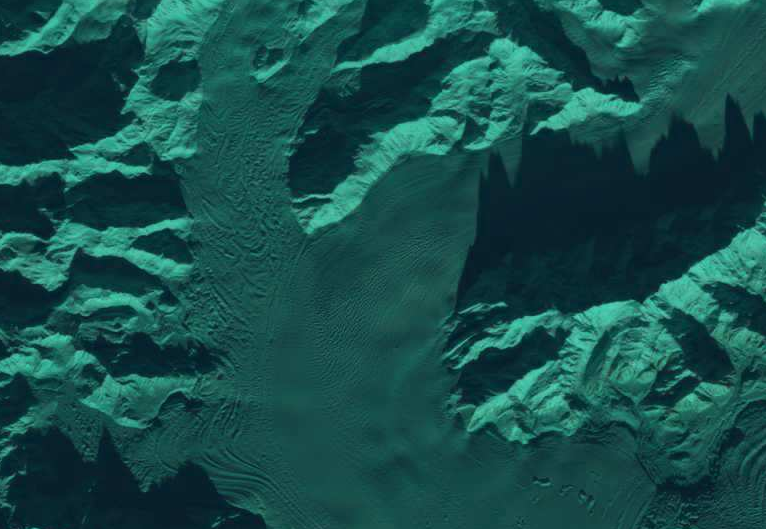

interaction with the atmosphere
=================================

In the previous lesson, we learned more about electromagnetic radiation: how we can describe it using different
conceptual models, and its properties that make it useful for remote sensing.

In this lesson, we'll learn about how electromagnetic radiation interacts with the Earth's atmosphere, and how that
affects what we actually "see" with satellite sensors, which are normally on the other side of Earth's atmosphere from
the surface.

earth's atmosphere
--------------------

As you may or may not know, the Earth has an atmosphere. It warms the Earth’s surface (sometimes too much), modulates
the temperature between day and night, enables liquid water to exist on the surface, and absorbs ultraviolet radiation.
In short, it helps us live on this planet, and is generally considered to be a Good Thing.

For satellite remote sensing, the atmosphere sits between the sensor and the target – the thing we want to observe. In
order for us to make our observations, electromagnetic radiation has to go through the atmosphere, which means that
it has to interact with the atmosphere.

This interaction can take one of four forms:

- the electromagnetic radiation is **refracted**, meaning it appears to be bent as it enters the atmosphere;
- it can be **scattered** in random directions;
- it can be **reflected** back into space;
- or it can be **absorbed** and potentially re-emitted.

|br| The diagram above illustrates a schematic of how these different interactions look, using the *particle model* to
represent electromagnetic radiation.

refraction
-----------

We'll start by looking at refraction. As a wave, such as an electromagnetic wave, passes from one medium to another, the speed of the wave may change
depending on the relative properties of the two media. For light traveling through air, such as through the atmosphere,
this means that the temperature, air pressure, humidity or vapor pressure, and wavelength of light all play a role.

The change in speed changes the travel time for the light, which causes an apparent displacement of the object. You can
easily see this by looking at a straw in a glass of water, for example:

|br| We can also show this as a diagram, with the angle of propagation in the first medium, :math:`\theta_1` (measured
from the vertical), and the angle of propagation in the second medium, :math:`\theta_2`:

|br| The relationship between the angle in in medium one, :math:`\theta_1`, and the angle in medium two,
:math:`\theta_2`, is given by **Snell's Law**:

.. math::

    n_1 \sin(\theta_1) = n_2 \sin(\theta_2)

where :math:`n_i` is the **refractive index** or **index of refraction**, calculated as the ratio of the speed of light
in a vacuum, :math:`c_0` to the speed of light in that medium, :math:`c_i`:

.. math::

    n_i = \frac{c_0}{c_i}

For any medium, :math:`c_i > 1`, and it varies depending on the density and other properties of the medium. For light
traveling through air, this means that the temperature, air pressure, humidity or vapor pressure, and wavelength of
light all play a role.

The amount of refraction also depends on the angle of incidence, measured from the vertical as shown above. Larger
incidence angles cause more refraction, and vice-versa. Think about how the shape of the sun appears distorted as it
sets, or the way mirages look: the wavy pattern and shape distortion that we see happens as a result of refraction due
to the atmosphere.

For satellite images, the maximum amount of refraction we observe is about a meter, so the impact is relatively limited
outside of very high-resolution images.

scattering
-----------

Scattering is the diffusion of electromagnetic radiation in unpredictable, or random, directions. For smaller particles,
this can take the form of absorption and re-emission of electromagnetic radiation, but for larger particles this can be
physical scattering of electromagnetic radiation: picture how pool or billiard balls scatter when they hit each other
on the table.

One main result of atmospheric scattering is that shadows in satellite images aren’t completely dark – scattering causes
light to be re-directed into the view of the sensor:

|br| In these mountains here, we can still see the surface that’s obscured by shadow, even though it appears darker than
the surrounding areas. Scattering also causes what’s known as atmospheric perspective – objects farther away appear to
have different colors and brightness:

|br| It is also part of the reason why we don’t normally use ultraviolet radiation in remote sensing: at shorter
wavelengths, the atmosphere itself appears brighter. Because scattering re-directs radiation from outside of the view
of the sensor, it also decreases the spatial detail recorded, and it decreases the contrast of the scene. Bright objects
appear less bright, while dark objects appear brighter than they otherwise are.

Depending on the size of the particle, there are three main types of scattering:

|br|

- **Rayleigh scattering** is caused by particles with a diameter, :math:`d`, that’s around 1/10th of the wavelength,
  :math:`\lambda`. Typically, this is caused by atmospheric molecules such as oxygen or nitrogen.
- **Mie scattering** is caused by particles that are between 1/10th and 10 times the wavelength. This is typically
  things like dust or smoke particles, or even smaller water droplets.
- **Non-selective scattering** occurs with particles that are bigger than about 10 times the wavelength of the
  electromagnetic radiation – it’s called "non-selective" because it scatters all wavelengths equally. This is caused
  by large water droplets or ice crystals, usually in the form of clouds.

rayleigh scattering
....................

Rayleigh scattering occurs when the particle is much smaller than the wavelength. It depends on the refraction index,
:math:`n_i`. As we discussed above, this value is determined in part by the density of the substance that the light
is traveling through. For air, this is determined by the temperature, air pressure, and water content.

The amount of Rayleigh scattering also strongly depends on the wavelength of the light. In fact, the amount of
scattering, quantified using the **scattering cross-section**, :math:`\sigma_{\rm R}`, is proportional to 1 over the
wavelength to the fourth power:

.. math::

    \sigma_{\rm R} \propto\frac{1}{\lambda^4}

this means that blue light, with wavelengths around 400 nm, scatters about 5 times more than red light with wavelengths
around 700 nm.

This is why the sky appears blue to us during the day: blue light is scattered almost equally from all portions of the
sky. Rayleigh scattering is also partly why the sky appears red or orange during a sunset. Near the horizon, the sun’s
light travels through more of the atmosphere – as a result, shorter wavelengths are more preferentially scattered away
from the observer, and so the light that we see has longer wavelengths.

mie scattering
...............

For slightly larger particles, Mie scattering is the dominant scattering mechanism. Mie scattering is stronger than
Rayleigh scattering, in that less light passes through. The amount of scattering depends less on wavelength than
Rayleigh scattering: rather than being proportional to :math:`1/\lambda^4`, it's only :math:`1/\lambda`:

.. math::

    \sigma_{\rm Mie} \propto\frac{1}{\lambda}

Mie scattering is caused mostly by smoke, pollution, or dust particles in the atmosphere:

    *image credit*: `@PettyCommaAngie <https://twitter.com/PettyCommaAngie>`__

I’m sure you’ve seen images from the different wildfires in California, Australia, or Siberia over the past few
years. The darkened, orange sky you can see in these different photos is a result of Mie scattering:

|br| Dust storms can cause a similar effect. In addition to smoke or dust particles in the atmosphere, Mie scattering
can also be caused by smaller water droplets in the atmosphere.

non-selective scattering
.........................

Non-selective scattering occurs when the particle is much larger than the wavelength. It does not depend on the
wavelength (hence the name "non-selective"), but rather, all wavelengths are scattered equally.

Non-selective scattering is primarily caused by large water droplets, ice crystals, or larger dust particles in the
atmosphere. The classic example of a non-selective scatterer is clouds:

|br| As you can see in these satellite images acquired in four different wavelengths, the clouds are visible in each
of the images, all with similar levels of brightness. From the ground, clouds normally appear white or gray, again
owing to the relatively even scattering across wavelengths.

Another classic example of non-selective scattering is fog:

|br| The dull gray color of fog is caused by even scattering of relatively low levels of light.

reflection
-----------

When it comes to the atmosphere, reflection takes one of two forms. It can either refer to:

- absorption and then re-emission of electromagnetic radiation;
- physical scattering of electromagnetic radiation by particles in the atmosphere that directs the electromagnetic
  radiation back towards the sensor.

In general, most atmospheric reflection is caused by clouds. One great example is this image of hurricane Katrina,
acquired in August 2005 by the European Space Agency using the Medium Resolution Imaging Spectrometer (MERIS)
sensor:

absorption
-----------

The last form of interaction between electromagnetic radiation and the atmosphere that we will look at is absorption.
Whether or not electromagnetic radiation is absorbed depends on the wavelength and the kind of molecule doing the
absorbing.

This diagram shows the amount of atmospheric absorption that occurs as a function of both wavelength and the kind of
molecule:

|br| We see, for example, that oxygen and ozone (O\ :sub:`2` and O\ :sub:`3`) absorb most all incoming radiation in the
ultraviolet portion of the spectrum (below around 350 nm), as well as another strong peak in the infrared portion of
the spectrum, around 10000 nm.

Fortunately for our purposes, the atmosphere is fairly **transparent** (there is very little absorption) in the visible
portion of the spectrum, between around 400 and 700 nm.

In the infrared and ultraviolet portions of the spectrum, though, we see near-total absorption of incoming
electromagnetic radiation, with some thin "windows" where where electromagnetic radiation isn’t absorbed.

atmospheric windows
--------------------

When designing sensors, we try to take advantage of these windows as much as possible. This figure shows the wavelength
bands for a number of different satellite sensors:

|br| This figure shows the wavelength bands for the different Landsat sensors, ASTER, and Sentinel-2 MSI. The blue shaded
areas show how much electromagnetic radiation passes through the atmosphere - we can see how most (but not all!) of
these sensor bands cover wavelengths where the atmosphere is fairly transparent.

Unlike in the previous section, this figure shows the **atmospheric transmission**: how much electromagnetic
radiation passes through the atmosphere, rather than how much is absorbed. You can see here that most of the bands of
these different sensors acquire at wavelengths where there is high transmission.

More recently, some sensors such as the Landsat Operational Land Imager (OLI) or Sentinel-2 Multispectral Imager (MSI)
have also included bands to acquire in regions where the atmosphere is opaque, with the goal of studying or detecting
clouds - you can see these with OLI Band 9 or MSI Band 10, around 1400 nm.

Further out, we can see that in the microwave region of the electromagnetic spectrum (wavelengths between 1 cm and 1 m),
the atmosphere becomes mostly transparent:

|br| This is one big advantage that microwave remote sensing has over visible/infrared remote sensing. With microwave
remote sensing, we can make observations largely independent of weather, because the atmosphere is almost entirely
transparent to those wavelengths, even when there are clouds.

additional reading
-------------------

- Lillesand, Kiefer and Chipman, Chapter 1
- Campbell & Wynne, Chapter 2
- Why the sky is blue [`How&Why <https://www.youtube.com/watch?v=yjpDNBSJkMs>`__]

