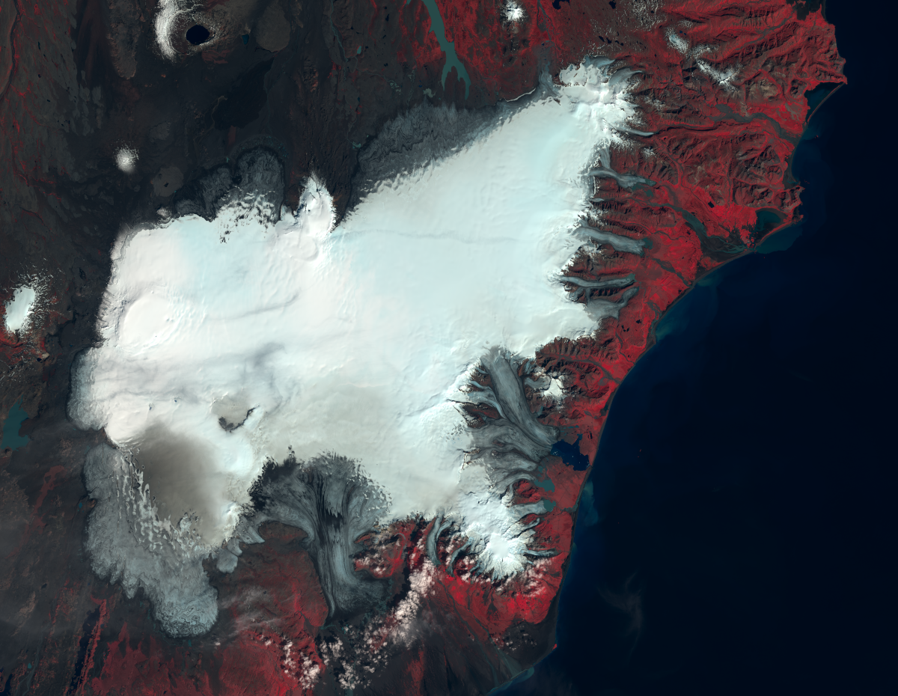

what is remote sensing?
========================

definition
-----------

If we open up a textbook to look for a definition of *remote sensing*, we might find examples like the following:

    Remote Sensing is the **acquiring of data** about an object **without touching it**\ [1]_

    Photogrammetry and Remote Sensing is the art, science, and technology of **obtaining reliable information** from
    **non-contact imaging and other sensor systems** about the Earth and its environment, and other physical objects
    and processes through recording, measuring, analysing, and representation.\ [2]_

In other words, remote sensing is studying an object without having to touch/travel to it directly.

In a very real sense, this is something that you have been doing for years - our eyes, ears, and even our noses are
**sensors** that collect information about the world around us, and process it in our brains. Because our
eyes/ears/nose are not (normally) in direct contact with the object that they are sensing, they are **remote** sensors.

advantages of remote sensing
-----------------------------

Remote sensing gives us a unique perspective of the Earth and environment. Rather than seeing things at ground level,
remote sensing gives us an overhead, “bird’s-eye” perspective. This can enable us to see patterns or relationships that
aren’t immediately clear at ground level. It also allows us to observe or study areas that are too dangerous or
difficult to travel to – for example, we can use remote sensing to study active, erupting volcanoes, study hurricanes
and other storms and their impacts; or map wildfires on a global scale.

With multiple images, we can analyze changes over time, mapping large areas quickly and cheaply. Finally, remote
sensing allows us to map the Earth system on a global scale.

As an example, let's say that we wanted to map the extent of Vatnajökull, the second-largest glacier in Europe by area,
covering around 8100 km\ :sup:`2`:

|br| Now, we could take a GPS, throw it in a backpack, and walk around the perimeter. If we’re feeling a bit lazy, we
could try driving instead. Of course, this is a huge distance we’d have to walk, and it’s not easy ground to cover.
There are large rivers to cross, and it’s steep, rocky terrain in areas. It would probably take several days to cover
the whole thing – and what happens when we want to map the whole thing again later? This is to say nothing of the other
glaciers on Iceland, some of which you can see in the image above. From this direct method, we also can’t make any
measurements back in time.

The good news is, we can map the glacier extent of Vatnajökull and other glaciers in a few hours (or faster) using
satellite images like the one shown above. With some of the datasets we’ll look at later, we can even map the glacier
extents back to the early 1970s from satellite images. And of course, we're not limited to glaciers - we'll look at
many other examples of ways that we can use remote sensing to study the Earth's surface.

the remote sensing process
---------------------------

Remote sensing depends on a number of things, all of which make up some part of the "process" or "system" of remote
sensing:

.. image:: img/process.png
    :width: 500
    :align: center
    :alt: a diagram showing the components of the remote sensing process

|br| First, we need some kind of radiation source\ [3]_ - this is very often the sun, though it can also be provided by
the sensor itself (*active* remote sensing). We also need a sensor - something to record or interpret the information
about the object(s) that we're studying.

As we will discuss further, this system includes Earth's atmosphere, which can have an impact on what the sensor
actually "sees". It includes the objects that we're trying to observe, including their physical properties, as well as
the way that these objects interact with the radiation source and the atmosphere.

Finally, the system includes the transfer and storage of the data recorded by the sensor, and the actual analysis of
the data by you - the analyst or user.

notes and references
---------------------

.. [1] Jensen, J. R. (2016). *Introductory Digital Image Processing (4*\ |th| *ed.)*. Pearson. ISBN 9780134058160
    [`Google Books <https://www.google.co.uk/books/edition/Introductory_Digital_Image_Processing/IWvDrQEACAAJ?hl=en>`__]

.. [2] ISPRS "Silver Book" for the period 2008--2012
    [`pdf <https://www.isprs.org/documents/archive/Silver_Book/Silver_Book_2008-2012.pdf>`__]

.. [3] These notes primarily focus on satellite or aerial remote sensing, which predominantly uses electromagnetic
    radiation to observe Earth's surface - as such, we're going to conveniently ignore other forms of remote sensing
    which use things like acoustics to acquire information.

.. |th| replace:: :superscript:`th`\
