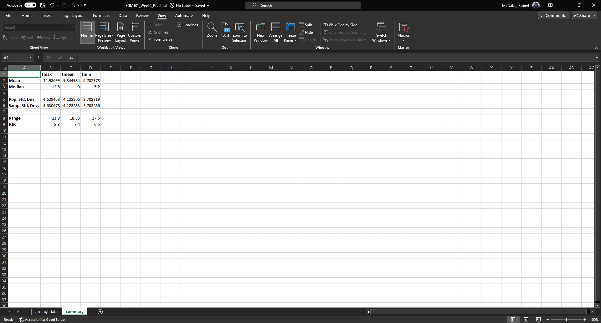
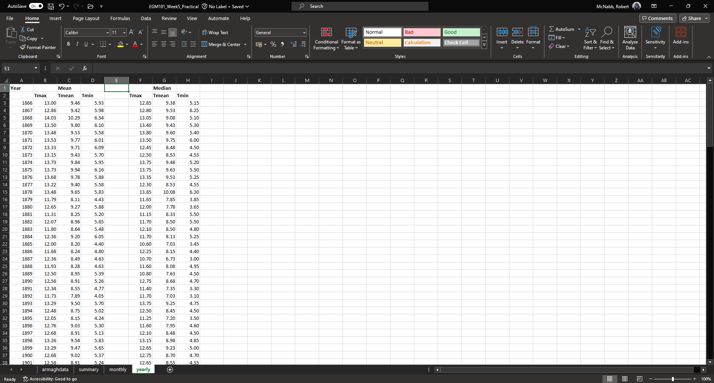
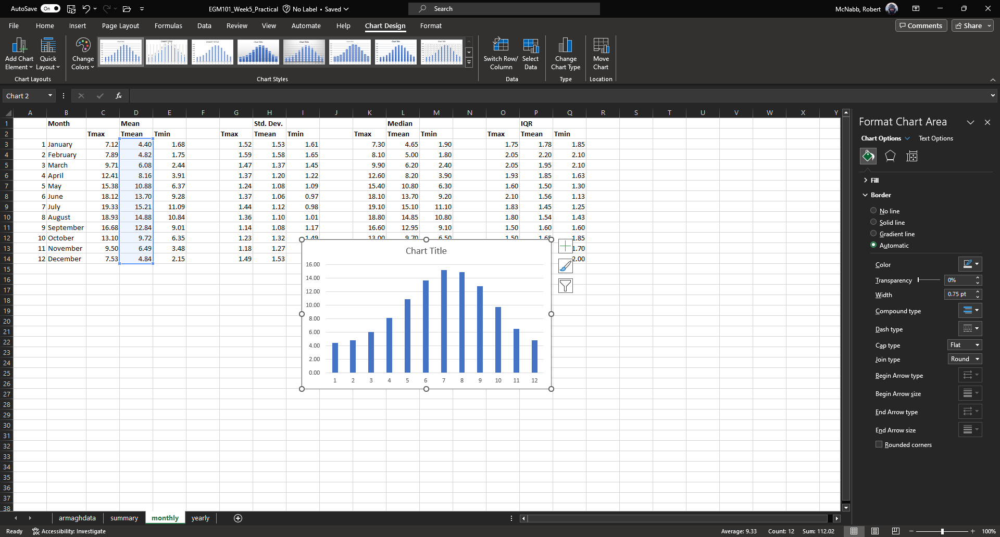
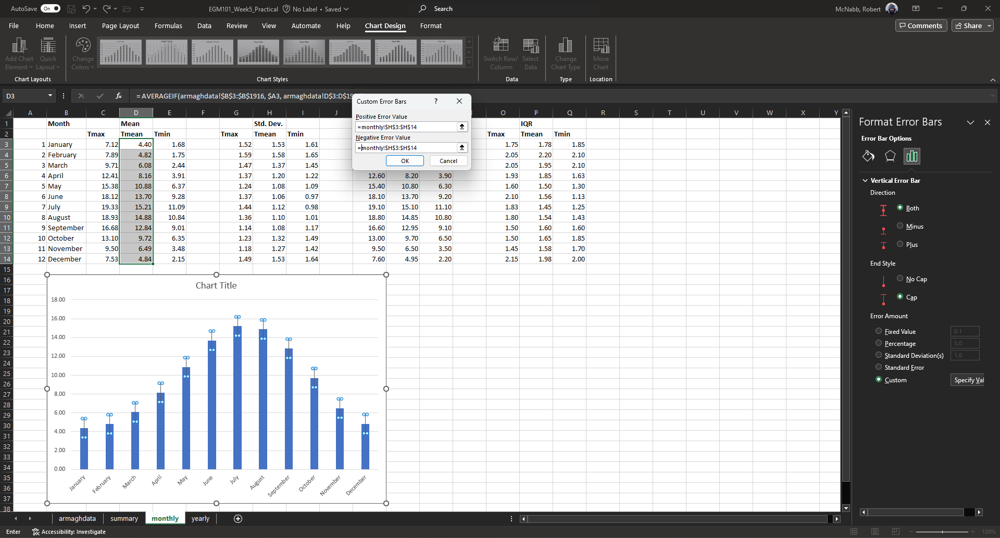
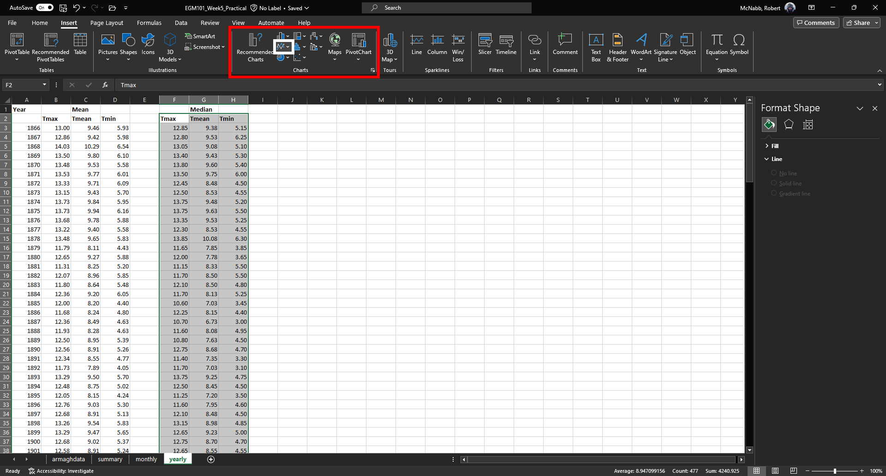
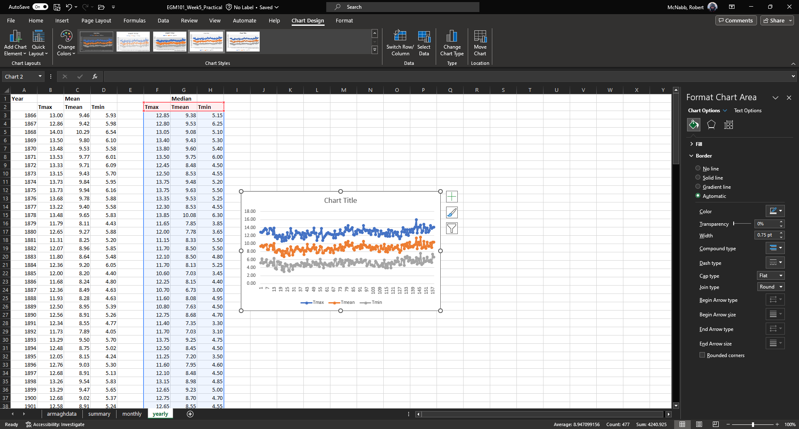
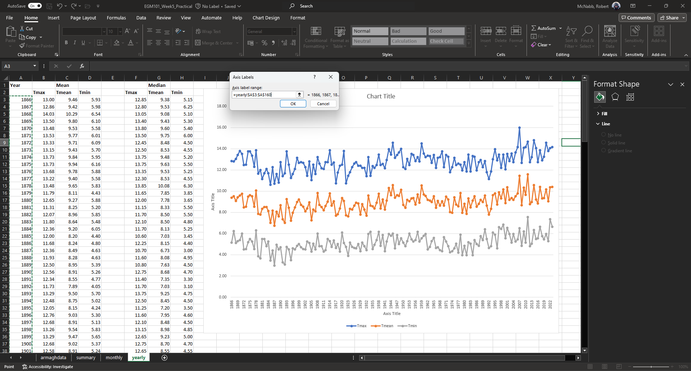

computation, summary statistics, and graphing in excel
========================================================

The purpose of this practical is to introduce you to Microsoft Excel and complement the theoretical material presented
in the lectures, discussions, and reading material. The experience gained in analyzing and presenting data should also
help you to develop your confidence in using and presenting numerical results.

By the end of this practical, you should:

- be able to import and format data in a spreadsheet
- perform calculations with both manually-entered and built-in functions
- create and format different types of graphs
- interpret both graphs and numeric values

getting started
----------------

If you have not already, you should download the
`Week 5 Data <https://www.metoffice.gov.uk/pub/data/weather/uk/climate/stationdata/armaghdata.txt>`__
file to your OneDrive folder.

.. note::

    I **strongly** recommend that you create a dedicated folder for your EGM101 material on your OneDrive. I also
    recommend that you organize it in a way that will help you find things easily.

    The folder structure outlined below is only a recommendation (you should use something that works best for you),
    but an organized folder structure with clearly-labeled, understandable file names (for example,
    ``EGM101_Week5_Data.xlsx`` instead of ``Data (1).xlsx``) should help make life just a bit easier.
    ::

        OneDrive
        └─ EGM101
            ├─ Practicals
                ├─ Week 5
                ├─ Week 6
                ├─ Week 7
                └─ Week 8
            ├─ Reading
            └─ Assignment
                ├─ Data
                └─ Report

spreadsheet basics
--------------------
If you haven't already, open **Excel** using either the **Start Menu** (**Start** > **Excel**) or the Desktop or
Taskbar icons (if they exist).

When it opens, you should see the following (note that the layout and theme may differ):

.. image:: img/week5/blank_workbook.png
    :width: 720
    :align: center
    :alt: A blank Excel workbook, showing the Home panel on the ribbon in the upper part of the window.

|br| A spreadsheet is a table of different *cells*, organized into *rows* and *columns*. In Excel, the columns are
labelled alphabetically (A, B, C, ... Z, AA, AB, etc.), and the rows are labeled numerically (1, 2, 3, ... etc.). Cells
are identified using their column and row - in the example above, the green outline is in cell A1, or the first column
and first row.

At the bottom of the window, you can also see a tab labeled "Sheet1", indicating that this is the first *sheet* (table)
in the spreadsheet. Excel spreadsheets can contain multiple sheets - to add additional sheets, use the "+" symbol next
to the sheet tabs. You can also switch between sheets using the tabs.

importing data
---------------

For this week's practical, we will be working with meteorological observations from the
`Armagh Observatory <https://www.metoffice.gov.uk/weather/learn-about/how-forecasts-are-made/observations/recording-observations-for-over-100-years>`__,
provided by the `Met Office <https://www.metoffice.gov.uk/research/climate/maps-and-data/historic-station-data>`__.

Recall that a *variable* is any sort of characteristic of the members of a population - in essence, it's the thing that
we're meaasuring and analyzing. In this practical, we're primarily going to be working with three different temperature
variables:

- ``Tmax``, the monthly maximum temperature recorded at the Armagh Observatory;
- ``Tmean``, the monthly mean temperature recorded at the Armagh Observatory; and
- ``Tmin``, the monthly minimum temperature recorded at the Armagh Observatory.

The meteorological data provided by the Met Office date back to 1853, though the temperature records provided "only"
go back to 1865. Before we get started, though, we need to **Import** the data into Excel.

To do this, you can press ``Ctrl`` and ``O`` at the same time (``Ctrl + O``), or by selecting **Open** from the
**File** tab in the upper-left corner of the window.

**Browse** to where you have saved ``armaghdata.txt``, and select the file. You may need to change from viewing
``Excel files`` to ``All files`` in order to see it in the panel.

When you open the file, you should see the following window:

.. image:: img/week5/import1.png
    :width: 400
    :align: center
    :alt: The first step of the Text Import Wizard.

|br| These data are *Fixed Width*, meaning that columns are separated by a fixed number of spaces. You can also see
that the file has a number of extra rows at the beginning - we don't actually want to import these, so change
``Start import at row:`` to row 6. Once you've done this, click **Next** to bring up Step 2 of 3:

|br| Here, we want to make sure that the column breaks (the vertical lines) are spaced where we have different columns.
But, we can also use this to separate out non-numeric characters from each cell, which will mean we don't have to go
through the spreadsheet and do this by hand later on.

If you scroll to the bottom of the window, you should see something like this:

|br| You can add separators around these characters by clicking on them:

|br| Make sure that you add separators after each numeric entry - the final view should look something like this:

|br| Click **Next** to bring up the following window:

|br| Here, we can tell Excel which columns to import, and which columns to skip. First, select the column by clicking on
the *header* (first cell) for each column.

We want to make sure that Excel doesn't import any of the columns which won't have data - for each of these columns,
you'll want to select **Do not import column (skip)**. When you select this, the column header should change from
"General" to "Skip Column" - do this for each of the small columns that you created, plus the final column. It should
look something like the following:

|br| Now click **Finish**. You should see something like the following:

|br|

.. note::

    If you see other columns, it likely means that you had additional column breaks in step 2 of the **Import**
    dialogue above, or you did not tell Excel to skip importing some columns in step 3 above.

    **Don't panic.** You can delete a column following the same procedure as outlined for rows below - just
    be sure to highlight the column that you want to remove, rather than the row.

Now that we've imported the data, we need to save the spreadsheet as an **Excel Workbook**. To do this, click on the
**File** tab, and select **Save As**.

Re-name the file as ``EGM101_Week5_Practical``, make sure to change the file type from "Text (Tab delimited)
(\*.txt)" to "Excel Workbook (\*.xlsx)", and save it to your EGM101 folder **on your OneDrive**:

|br|

.. warning::

    Be sure to double-check that you are saving this to your OneDrive folder, **not** the local disk. If you
    save the file to the local disk, it will not be backed up, and you won't be able to access it unless you are
    sitting at this exact same computer.

Once you've saved the file, you should see that the warning has gone away.

formatting text
..................

Now that we've successfully imported the data, we want to edit the sheet to make it easier to read. We can start with
the column headers - let's rename these to be something that's a bit easier to understand:

.. image:: img/week5/new_headers.png
    :width: 720
    :align: center
    :alt: The imported data, with the column headers renamed as described in the text below.

|br| Here, I've changed ``yyyy`` to ``Year``, ``mm`` to ``Month``, and ``af`` to ``Air Frost``.

Like in Word or other programs, we can also change the font to highlight text - go ahead and make the first row of
text **Bold** by highlighting the cells and changing the text to bold (either using ``Ctrl + B`` on the keyboard,
or by clicking on the "B" under the font name on the **Home** tab).

Change the second row of text (the units) to italics in the same way: first highlight the cells, then press
``Ctrl + I`` on the keyboard, or click on the "I" under the font name on the **Home** tab:

|br|

freezing the view
....................

The next thing we can do to make the spreadsheet easier to work with is *freeze* the top row(s) of the spreadsheet
so that as we scroll down the sheet, the top two rows are always in view. To do this, click on cell A3. Then, under the
**View** tab, click on **Freeze Panes** and select **Freeze Panes** (the first option). This will *freeze* the first
two rows:

|br| You should see that a line appears between the second and third rows. Now, when you scroll, the column headers will
always be visible - this way, you don't have to scroll back up to see what data each column represents:

|br|

.. note::

    **Freeze Panes** will set the "freeze line" *above* and to the *left* of the highlighted cell. So, if you also want
    to freeze the first column, you can click on cell B3 instead. This will freeze the first two rows, as well as the
    first column.

.. card::
    :class-header: question
    :class-card: question

    :far:`circle-question` Question
    ^^^

    Look at the values in each column of the table. What type of data do each of these variables represent?

adding/removing columns and rows
..................................

The next thing that we'll cover is adding and removing columns and rows to the spreadsheet. You should notice that,
while the total monthly rain (``Rain``, column F) has data starting in January 1853, the other rows (minimum/maximum
Temperature, days of Air Frost, and average hours of Sun) don't start until April 1865 (row 150).

Because we are primarily interested in the temperature records here, we can remove rows where we have no data. To do
this, first scroll back to the top of the spreadsheet. To delete an entire row, we first have to highlight the row
in the table. To do this, click the row number in row 3 (left-most part of the window):

.. image:: img/week5/highlight_row.png
    :width: 720
    :align: center
    :alt: The workbook showing the third row highlighted.

|br| You should see that all of row 3 is now highlighted. To delete an individual row, you can right-click on the row
number and select **Delete**. Rather than doing this individually, though, we can select multiple rows using the
``Shift`` key. With row 3 highlighted, scroll down in the table until you see row 149. Hold down the ``Shift`` key and
click on the row number for row 149. You should see that rows 3 - 149 are now highlighted:

|br| Right-click on the row numbers along the left-most part of the window, and select **Delete**. You should see that
the table shifts upwards:

|br| Click on any cell to remove the highlighting. The next thing we'll do is add a column to the table, to represent
the monthly mean temperature. We'll add this column in between the maximum and minimum columns of the table. First,
click on the column name for column D to highlight the column:

|br| Next, right-click on the column name and select **Insert** - this will add a new column between column C and the
(old) column D (now column E):

.. image:: img/week5/new_column.png
    :width: 720
    :align: center
    :alt: The workbook, showing a blank column inserted at column D.

|br| In the first row of this column, add a name (**Tmean**), and in the second row, add the units (*degC*) - you
should see that the formatting you added earlier is still there in the new column:

.. image:: img/week5/new_column2.png
    :width: 720
    :align: center
    :alt: The workbook, showing a blank column D with the header filled in.

|br|

calculating values using formulas
----------------------------------

One of the biggest advantages to using programs like Excel is that we can use the computer to do calculations for us,
rather than needing to do everything by hand. There are a number of different ways we can have Excel calculate new
values for us - as a first example, we'll see how we can use it to calculate the monthly mean air temperature according
to the following formula:

.. math::

    T_{\rm mean} = \frac{T_{\rm max} + T_{\rm min}}{2}

that is, the monthly mean temperature is the *arithmetic mean* of the monthly maximum and minimum temperature.

simple formulas and referencing cells
.......................................

To start, click on cell D3, representing the mean monthly temperature for April 1865. We could type in the value of this
cell using the actual data values for the maximum and minimum temperatures:

.. math::

    T_{\rm mean} = \frac{14.8 + 5.5}{2} = 10.15

However, there are a number of drawbacks to this. For one, we would have to manually enter each value, which (a) is
time-consuming, (b) makes it significantly more difficult to change the values later on, (c) dramatically increases
the chances of making an error (which would require us to change the values later on).

Instead, we can use **cell references** to input the formula. Click on cell D3, and type in the following:
::

   = (C3 + E3) / 2

Press ``Enter`` - you should see the following:

|br| There are a few things to note here:

#. The formula begins with "=" - this is **always** the case in excel, whether entering a simple formula or using a built-in function.
#. To refer to a cell, we use the column label (e.g., C), followed by the row label (e.g., 3).
#. In the spreadsheet, we see the output of the formula (10.15), but in the formula bar, we see the formula entered.
#. It's usually a good idea to use brackets in your formula, to ensure the correct order of operations (and to make the formula more readable).

Rather than re-typing this formula in each row of column D, we can either copy + paste the formula, or by using the
**fill handle**. To use the **fill handle**, make sure that you have highlighted cell D3 in the sheet. Next, hover
your cursor over the lower right-hand corner of the green outline - when your cursor changes to a "+" symbol, left-click
the mouse, then drag the cursor toward the bottom of the screen. You should see the green outline extend. Keep going
until you've highlighted all the way to the bottom of the table (row 1891).

When you release the mouse button, you should see that each row of column D is now filled with a value:

.. image:: img/week5/filled_formula.png
    :width: 720
    :align: center
    :alt: The workbook, that all values of column D have been filled with the formula above.

|br| To check, click on cell D1891 - you should see the following in the formula bar:
::

    = (C1891 + E1891) / 2

We'll see more examples of filling cells in this way later on. For now, scroll back up to the top of the table.

built-in functions
....................

Our next task will be to calculate descriptive statistics such as the mean, median, standard deviation, range, and
interquartile range for each of our temperature *variables* (``Tmax``, ``Tmean``, and ``Tmin``).

To start, create a small table to the right of where we have our data:

.. image:: img/week5/average_table.png
    :width: 720
    :align: center
    :alt: The workbook, with a space for showing descriptive statistics of the three temperature variables.

|br| It doesn't need to be in the exact same location as shown above, but you should include columns for ``Tmax``,
``Tmean``, and ``Tmin``, as well as rows for the mean, median, population and sample standard deviations, range, and
inter-quartile range, as shown above.

In the upper left cell of this table (K5 in the example above), insert the following formula:
::

    = AVERAGE(C3:C1891)

This uses the built-in `AVERAGE <https://support.microsoft.com/en-us/office/average-function-047bac88-d466-426c-a32b-8f33eb960cf6>`__
function to calculate the *arithmetic mean* of the cells used as input. Here, we're telling Excel to use the values in
all of the cells starting from C3 and ending at C1891. Note that the ``:`` in between C3 and C1891 is what Excel uses
to denote a *range* of cells - this way, we don't have to explicitly type in C3, C4, C5, and so on.

When you press enter, you should see the following:

.. image:: img/week5/average_table.png
    :width: 720
    :align: center
    :alt: The workbook, with a formula entered in cell K3 to compute the average maximum temperature.

|br| As before, you should see that the cell displays the calculated value, while the formula bar displays the formula
entered.

Rather than typing the formula again to calculate the mean of ``Tmean`` and ``Tmin``, we can instead use **flash fill**
like we did to fill out the ``Tmean`` column. To do this, click on the lower right corner of the green outline in cell
K3, then drag the cursor over to cell M3:

.. image:: img/week5/horizontal_fill.png
    :width: 720
    :align: center
    :alt: The mean values of each temperature variable, filled using flash fill.

|br| Next, we need to fill out the rest of the table. First, use the
`MEDIAN <https://support.microsoft.com/en-us/office/median-function-d0916313-4753-414c-8537-ce85bdd967d2>`__
function to calculate the median value of ``Tmax`` by inserting the following formula into cell K6:
::

    = MEDIAN(C3:C1891)

Next, use **flash fill** to copy this formula to ``Tmean`` and ``Tmin``, as you did above for the arithmetic mean.

For the *standard deviation*, Excel has two functions: `STDEV.P <https://support.microsoft.com/en-us/office/stdev-p-function-6e917c05-31a0-496f-ade7-4f4e7462f285>`__
and `STDEV.S <https://support.microsoft.com/en-us/office/stdev-s-function-7d69cf97-0c1f-4acf-be27-f3e83904cc23>`__,
for the *population* and *sample* standard deviation, respectively. In cell K8, enter the following formula
to calculate the *population* standard deviation:
::

    = STDEV.P(C3:C1891)

And in cell K9, enter the following to calculate the *sample* standard deviation:
::

    = STDEV.S(C3:C1891)

Again, use **flash fill** to fill out each row as you go along.

Excel doesn't have dedicated functions for the *range* and *inter-quartile range*, but we can still calculate them
using functions that Excel does have. Remember that the *range* is just the difference between the maxmimum and
minimum values of a variable:

.. math::

    {\rm RANGE} = {\rm MAX} - {\rm MIN}

We use the same equation here, using the `MAX <https://support.microsoft.com/en-us/office/max-function-e0012414-9ac8-4b34-9a47-73e662c08098>`__
and `MIN <https://support.microsoft.com/en-us/office/min-function-61635d12-920f-4ce2-a70f-96f202dcc152>`__ functions:
::

    = MAX(C3:C1891) - MIN(C3:C1891)

Again, use **flash fill** to fill out this row.

Finally, remember that the *inter-quartile range* is the difference between the third quartile, :math:`Q_3`, and the
first quartile, :math:`Q_1`:

.. math::

    {\rm IQR} = Q_3 - Q_1

Excel has two functions to calculate quartiles: `QUARTILE.INC <https://support.microsoft.com/en-us/office/quartile-inc-function-1bbacc80-5075-42f1-aed6-47d735c4819d>`__,
for calculating the quartile *inclusive* of the endpoints, and
`QUARTILE.EXC <https://support.microsoft.com/en-us/office/quartile-exc-function-5a355b7a-840b-4a01-b0f1-f538c2864cad>`__,
for calculating the quartile *exclusive* of the endpoints. We'll use ``QUARTILE.INC`` here.

Enter the following formula into cell K12:
::

    = QUARTILE.INC(C3:C1891, 3) - QUARTILE.INC(C3:C1891, 1)

Note that ``QUARTILE.INC`` takes two *arguments*: the first is the range of values to calculate the quartile over,
and the second is which quartile to calculate. So, ``QUARTILE.INC(C3:C1891, 3)`` calculates :math:`Q_3` of the values
in cells C3 through C1891, while ``QUARTILE.INC(C3:C1891, 1)`` calculates :math:`Q_1`.

Once again, use **flash fill** to fill out the table. It should look something like this:

|br|

formatting cells
..................

The final step we'll do in this part of the practical is *format* the cells, so that they show an appropriate number of
*significant figures*. In the example above, you can see that the *mean* value is shown with 5 decimal places, despite
the fact that the original data only has a single decimal place.

Highlight all of the cells in this part of the table (columns K - M, rows 5 - 12), right-click, and select
**Format Cells** to bring up the following window:

.. image:: img/week5/format_cells.png
    :width: 400
    :align: center
    :alt: the Format Cells dialogue window

|br| Make sure that the **Number** category is selected, then change the number of decimal places to 2. Click **OK** to
close the window. You should see that the cells in the table are now formatted to only show the first two decimal
places:

.. image:: img/week5/formatted_table.png
    :width: 720
    :align: center
    :alt: the workbook, with the descriptive statistics formatted to only show two decimal places

|br| Here, you should notice something about the *standard deviations*: to two decimal places, the *population* and
*sample* standard deviations are the same. Remember that the difference between the *population* and *sample* standard
deviation is that the denominator of the population standard deviation is :math:`n`, while for the sample standard
deviation it is :math:`n-1`.

For low values of :math:`n`, this can make a big difference; as :math:`n` gets very large, though, the difference is
far less important. Here, where :math:`n\approx 2000`, the difference only shows up in the third decimal place.

.. card::
    :class-header: question
    :class-card: question

    :far:`circle-question` Question
    ^^^

    - Which temperature variable (``Tmax``, ``Tmean``, or ``Tmin``) has the largest range? What does this tell you about
      extreme values?
    - Look at the standard deviation values for each temperature variable. Which variable has more variation?

monthly averages
-------------------

conditional formulas and references
.....................................

Next up, we will use referencing to perform slightly more complicated calculations - specifically, we will
calculate monthly- and annually-averaged values of our temperature variables, starting with monthly averages. For this
part of the practical, we're going to calculate the *mean*, *standard deviation*, *median*, and *inter-quartile range*
for each of our temperature variables.

.. warning::

    If your sheet is named something other than ``armaghdata``, you should change this now to avoid pain and confusion
    later.

    To do this, right-click on the tab in the bottom left corner of the workbook, then select **Rename**. Type
    in the name ``armaghdata``, then press **Enter**.

To start, we will add a **sheet** to the workbook. At the bottom left of the window, click on the ``+`` icon next to
the ``armaghdata`` tab. This will add a new sheet to the workbook:

|br| Rather than the helpfully non-descriptive name ``Sheet1``, let's name this sheet ``monthly`` to indicate that this
is the monthly data. To do this, right-click on the ``Sheet1`` tab, and select **Rename**. Type in the new name and
press **Enter**.

Next, we can start adding row and column headers to this table. In the example below, I've grouped each **parameter**
into a set of three columns, with spaces in between to help make it more readable. Once you've set up the column
headers as shown below, type the names of months in cells B3 - B14, then enter a "1" in cell A3, and a "2" in cell A4:

.. image:: img/week5/monthly_fill.png
    :width: 720
    :align: center
    :alt: the workbook, with the monthly table set up and cells A3 and A4 highlighted.

|br| Rather than typing in each number individually, we can again use **flash fill** to automatically fill cells
based on some pattern.

Highlight cells A3 and A4, then click on the green square in the lower right corner of the highlighted outline. While
holding down the mouse button, drag the outline so that it includes all of cells A3-A14. Excel will recognize the
pattern from the first two cells (1, 2, ...) and fill the remaining cells by continuing the pattern:

|br| Now, we're ready to start inputting formulas into the table. In cell C3, enter the following formula:
::

    = AVERAGEIF(armaghdata!$B$3:$B$1891, $A3, armaghdata!C$3:C$1891)

This formula uses the `AVERAGEIF <https://support.microsoft.com/en-us/office/averageif-function-faec8e2e-0dec-4308-af69-f5576d8ac642>`__
function to average cells in some range, based on some criteria. Here, we're telling the function to average all of
the values in cells C3:C1891 of the ``armaghdata`` sheet, but *only* where the value in cells B3:B1891
of the ``armaghdata`` sheet is equal to the value in cell A3 - in other words, we're only taking the average of the
temperatures from rows where **Month** is equal to 1.

The first thing to notice with this formula is that we can reference other sheets by using the label of the sheet
(``armaghdata``), followed by ``!``, and the cell(s) that we want to reference in the other sheet.

The second thing to notice is the use of the ``$`` in the formula above. Earlier, when we used this formula:
::

    = (C3 + E3) / 2

And used **flash fill** to copy the formula to the other rows in column D, the row number changed - that is, the
formula in row 1891 was:
::

    = (C1891 + E1891) / 2

This is because Excel treats C3 (or E3, or C1891) as a *relative* reference. When we typed this formula into cell D3,
Excel interpreted C3 as "the cell in the same row, one column to the left", and E3 as "the cell in the same row,
one column to the right." When you copy + paste a formula with relative references into another cell, the references
change.

The ``$`` tells Excel not to do this - it should instead keep the column or row constant, depending on where the ``$``
is. With only one ``$``, we say this is a *mixed* reference - if it's before the column (``$A3``), then Excel will
hold the column constant, but adjust the row. If it's before the row (``C$3:C$1891``), Excel will hold the row constant,
and adjust the column.

If we have two ``$`` in the reference (e.g., ``$B$3``), Excel won't adjust the column or row - this is an *absolute*
reference. To see this in practice, use **flash fill** to copy the formula to the other rows of column C (C3:C14) - you
should see that the second reference changes from A3 in row 3, to A4 in row 4, and so on:

.. image:: img/week5/good_formula.png
    :width: 720
    :align: center
    :alt: the monthly table, with the monthly average for Tmax filled

|br| The other references don't change, though, because the rows are held fixed. Now, with the entire column selected,
use **flash fill** to fill out the other two columns in this part of the table. You should see that the column in the
third reference changes from column C to column E, depending on which column of this sheet we're looking at.

We have now calculated the monthly averages for each of our temperature variables. The last thing to do before moving
on is to change the formatting so that only 2 decimal places are displayed. You can do this following the same
procedure that we used earlier (right-click, **Format Cells**).

more conditional formulas
..............................

standard deviation
^^^^^^^^^^^^^^^^^^^^
Next, we want to calculate the standard deviation of temperatures for each month. Unfortunately, there is no
``STDEV.IF`` function like there is for ``AVERAGE``. Instead, we have to use
`IF <https://support.microsoft.com/en-us/office/if-function-nested-formulas-and-avoiding-pitfalls-0b22ff44-f149-44ba-aeb5-4ef99da241c8>`__
along with ``STDEV.S``. In cell G3, enter the following formula:
::

    = STDEV.S(IF(armaghdata!$B$3:$B$1891 = $A3, armaghdata!C$3:C$1891))

Here, we have *nested* the ``IF`` function inside of the ``STDEV.S`` function, meaning that ``STDEV.S`` will perform
a calculation on whatever the *output* of the ``IF`` function is. Just like we saw with ``AVERAGEIF``, ``IF`` will
return whatever value is in cells C3 to C1891 of the ``armaghdata`` sheet, as long as the value in column B of the
same row is equal to the value in A3 of this sheet.

Because we have fixed the column, but not the row, when you use **flash fill** to fill in the rest of the cells in
the standard deviation part of the table, the formula should adjust based on the row, just as it did for ``AVERAGEIF``.

Go ahead and do this now, then be sure to format the cells to show only the first two decimal places.

median
^^^^^^^^

To calculate the monthly median values, we will use the ``MEDIAN`` function nested with the ``IF`` function, exactly
as we did for the standard deviation. Enter the following formula into cell K3:
::

    = MEDIAN(IF(armaghdata!$B$3:$B$1891 = $A3, armaghdata!C$3:C$1891))

Once you have entered the formula into cell K3, use **flash fill** to fill the remaining values in this part of the
table, then format the cells to show only the first two decimal places.

inter-quartile range
^^^^^^^^^^^^^^^^^^^^^

To calculate the monthly interquartile range values, we will use the ``QUARTILE.INC`` function nested with the ``IF``
function. This formula is slightly more complicated, if only because it requires two nested functions. Enter the
following formula into cell O3 (remembering that you can copy and paste):
::

    = QUARTILE.INC(IF(armaghdata!$B$3:$B$1891 = $A3, armaghdata!C$3:C$1891), 3) - QUARTILE.INC(IF(armaghdata!$B$3:$B$1891 = $A3, armaghdata!C$3:C$1891), 1)

Once you have entered the formula into cell O3, use **flash fill** to fill the remaining values in this part of the
table, then format the cells to show only the first two decimal places.

Once you have finished filling in the various formulas and formatting the cells, your ``monthly`` sheet should look
something like this:

|br|

.. card::
    :class-header: question
    :class-card: question

    :far:`circle-question` Question
    ^^^

    - Compare the mean and median temperature values for each month. What does this tell you about the distribution
      of temperature values within those months?
    - What month(s) have the most variation in temperature (``Tmax``, ``Tmean``, and ``Tmin``), as measured by the
      standard deviation? How does this compare to the differences between the mean and median temperature values for
      those months?

annual averages
----------------

Next, we'll calculate annual averages for our temperature variables. The procedure for calculating annual values works
much the same as for the monthly data. First, we create a new sheet, then add data and formulas to the new sheet.

To start, add a new sheet by clicking the "+" next to the ``monthly`` tab, then re-name the new sheet ``yearly``.

Next, add the column headers to the new sheet. For this practical, we're only going to calculate annual means and
medians, though you can use the same procedure we used in the previous section to calculate standard deviations,
interquartile ranges, and so on.

First, though, we have to input the years that we want to average over into the table. In cell A3, type "1866", and
in cell A4, type "1867", then use **flash fill** to fill the remaining years up until 2021.

.. note::

    For now, we're only going to include years where we have 12 months of data - because the 1865 data doesn't start
    until April, and the 2022 data ends in August, we'll exclude those years for this part of the analysis.

In cell B3, now, enter the following formula:
::

    = AVERAGEIF(armaghdata!$A$3:$A$1891, $A3, armaghdata!C$3:C$1891)

You'll note that this is almost the exact same formula as we used for the monthly averages, with the change that
we're averaging based on the *year* (column A in the ``armaghdata`` sheet) instead of the *month* (column B).

Once you have entered the formula, use **flash fill** to fill the remaining cells in this part of the table (columns
B to D, rows 3 to 158). Next, be sure to format the cells to only show the first two decimal places, as before.

We can now do the same thing for the median values - in cell F3, enter the following formula:
::

    = MEDIAN(IF(armaghdata!$A$3:$A$1891 = $A3, armaghdata!C$3:C$1891))

Next, use **flash fill** to fill the remaining part of this table (columns F to H, rows 3 to 158), then format the cells
to only show the first two decimal places. Your table should look something like this:

|br|

.. note::

    If it's been a while since you've saved your workbook, you should do so now (**File** > **Save**, or ``CTRL + S``
    on the keyboard.

creating charts
-----------------

In addition to performing calclulations, we can also create charts and figures using Excel. In this part of the
practical, we will see how we can create histograms, bar charts, and line charts.

histograms
............

We will start by looking at the distribution of monthly-averaged values in the form of a histogram. On the
``armaghdata`` sheet, highlight column D by clicking on the column label. To add a chart, click on the **Insert**
tab:

|br| In the **Charts** section (red box), click on **Insert statistic chart** (white box), and select **Histogram**
from the menu that pops up. You should see that you have a histogram added to the table:

.. image:: img/week5/histogram_insert.png
    :width: 720
    :align: center
    :alt: a histogram of the monthly mean temperature values

|br| First, we want to re-size the chart to make it a bit bigger - to do this, click on the chart, then click and drag
on any of the corners to expand it:

.. image:: img/week5/histogram_resize.png
    :width: 720
    :align: center
    :alt: the histogram of monthly mean temperature values re-sized to fill more of the workbook window

|br| Before we are finished with our histogram, there are a few things that we need to do. First, remember that a
chart should have a title or a caption that explains the chart. Click on "Chart Title", and change the title from
"Chart Title" to "Distribution of monthly mean temperatures, 1865-2022".

Next, we need to add labels for the axes. When you click on the chart, you should notice icons appear along the right
edge. Click on the "+" button to open a menu for adding chart elements:

.. image:: img/week5/histogram_elements.png
    :width: 720
    :align: center
    :alt: the elements menu of the histogram chart

|br| To add axis labels, click the checkbox next to **Axis titles** - you should see two labels appear along the vertical
and horizontal axes. Change these to be "Frequency" or "Count" on the vertical axis, and "Temperature (°C)" on the
horizontal axis:

.. image:: img/week5/histogram_labelled.png
    :width: 720
    :align: center
    :alt: the histogram, with the horizontal and vertical axes labelled

|br| Finally, we can increase the font size on the labels, to make them easier to read. To do this, highlight the text
and increase the font size using the small window that pops up. Alternatively, you can select the text box, then change
the font size using the **Home** menu. Increase the axis label font size to 14, the chart title font size to 20, and
the vertical axis tick labels to size 12:

|br|

.. card::
    :class-header: question
    :class-card: question

    :far:`circle-question` Question
    ^^^

    - What kind of frequency distribution does ``Tmax`` have? Why would you expect this to be the case?
    - What is/are the modal value(s) of ``Tmax``?

If you like, you can also change the color and style of the bars. If not, go ahead and move on to the next section.

.. note::

    For more flexibility with histograms, you can use the ``FREQUENCY`` function to create a table of frequencies,
    then display the frequencies as a bar chart. We will not cover this here, but if you are interested in going a bit
    further, there are some excellent tutorials online such as
    `this one <https://exceljet.net/formula/histogram-with-frequency>`__ or
    `this one <https://www.youtube.com/watch?v=1sLJxwxR8jc>`__.

.. _excel bar:

bar charts
............

The steps for creating a bar chart are more or less the same as for creating a histogram, at least at the start. First,
we'll select the data that we want to plot. In the ``monthly`` data tab, highlight cells D3 to D14 by clicking on cell
D3, and dragging the mouse cursor down to cell D14:

|br| Under the **Insert** tab, in the **Charts** section (red box), click on **Insert Column or Bar Chart** (white box),
and select **Clustered Column**. You should see the following inserted into the table:

|br| Go ahead and move the chart so that it's not covering data, and re-size it like you did with the histogram. The
first thing we'll need to do is change the horizontal axis labels to use the month names, instead of numbers. To do
this, first click on the **Chart filters** button along the right-hand side of the chart:

|br| At the bottom of this menu, click **Select Data...** to bring up the following window:

.. image:: img/week5/bar_select.png
    :width: 400
    :align: center
    :alt: the select data source dialogue window

|br| We'll keep the data as-is, but click on **Edit** under **Horizontal (Category) Axis Labels**. Now, select cells B3
to B14 to use the month names as axis labels:

.. image:: img/week5/bar_label_select.png
    :width: 720
    :align: center
    :alt: the workbook showing the "select axis labels" window, with the month names highlighted

|br| You should see that the labels in the chart have changed to "January, February, ..." from "1, 2, ...". Click **OK**
in both of the windows that have been opened to return to the Workbook. The next thing we want to add are *error bars*,
to show the variation of temperatures within each month. To do this, click on the **Chart Elements** button again, and
select **Error bars**.

This turns on the error bars, but we're interested in showing the *standard deviation* of the monthly observations,
rather than the default. From the **Chart Elements** menu, click on the arrow next to **Error bars**, and select
**More options...**. This should bring up the **Format Error Bars** panel on the right-hand side of the screen:

.. image:: img/week5/error_bars.png
    :width: 720
    :align: center
    :alt: the workbook showing the "format error bars" panel and the "custom error bars" window

|br| Click on **Error bar options** (red box). At the bottom of this panel, under **Error Amount**, click the button next
to **Custom**, then click on **Specify Value**:

.. image:: img/week5/error_bars_format.png
    :width: 720
    :align: center
    :alt: the workbook showing the "format error bars" panel

|br| Here, you can select the data ranges to use, or use a set value (currently set to ±1). Under **Positive Error Value**,
select cells H3 to H14 (representing the monthly standard deviation of ``Tmean``). Do the same for the
**Negative Error Value**:

|br| You can also change the formatting of the error bars to make them thicker and more visisble
(**Width** under **Fill & Line** (red box)):

.. image:: img/week5/thick_bars.png
    :width: 720
    :align: center
    :alt: the workbook with the bar chart, with the error bars set to a width of 2 pts

|br| Next, we'll see how we can format the tick labels on the axis. Click on the vertical tick labels:

|br| Under the **Format Axis** panel on the right-hand side of the window, click on **Axis Options** (red box),
followed by **Number**, then change the number of decimal places to "0".

Note that under  **Axis Options**, you can also change the axis bounds, as well as the spacing between the ticks.
For now, the default values are fine.

To finish up the chart, change the chart title to "Average monthly temperature, 1865-2022", add axis labels, and
increase the font sizes like we did for the histogram:

|br|

.. card::
    :class-header: question
    :class-card: question

    :far:`circle-question` Question
    ^^^

    - What month has the highest average temperature? What about the lowest?
    - What month(s) have the smallest spread in temperature? What might this tell you about the weather in those months?

.. note::

    Alternatively, you could plot the monthly-averaged temperatures as a line chart:

    .. image:: img/week5/linegraph.png
        :width: 720
        :align: center
        :alt: the monthly-averaged temperatures, plotted as a line graph

line charts
............

For the final example of creating a chart using Excel, we'll create a line chart using the median annual temperature.
Click on the ``yearly`` tab, then select all of the data in columns F through H and rows 2 through 158:

|br| Under the **Insert** tab, in the **Charts** section (red box above), click on **Insert Line or Area Chart** (white
box above), and select **Line**. This will insert a line chart into the workbook:

|br| As before, you can move and re-size the chart object. At the moment, the x-axis data is just the row number,
starting counting from 1. We would like to plot the median temperature as a function of year, so we need to add the
correct labels to the chart.

As you did for the bar chart, click on the **Chart Filters** button along the right side of the chart, then click
on **Select Data** to bring up the **Select Data Source** dialogue. Under **Horizontal (Category) Axis Labels**, click
on **Edit** to select the cells containing the axis labels, then select cells A3 to A158 (alternatively, type the
range into the formula bar in the **Axis Labels** window):

|br| Click **OK** - you should see that the labels have changed from ``1, 7, ..., 151`` to ``1866, 1869, ..., 2019``.
This is quite crowded, and we can change the labels so that only every 10th value is shown. To do this, click on the
horizontal axis labels to highlight them. On the **Format Axis** panel, click on **Axis Options** (red box below).

Under **Tick Marks**, change the **Interval between marks** to be 10, and the **Major type** to be ``Cross`` - this
places a tick on the horizontal axis every 10 data points, which can help with reading the graph. Under **Labels**,
select **Specify interval unit**, and type ``10`` in the box - you should see that the labels change from
``1866, 1869, ..., 2019`` to ``1866, 1876, ..., 2016``:

.. image:: img/week5/line_change_intervals.png
    :width: 720
    :align: center
    :alt: the workbook, with the "Format Axis" panel showing on the right-hand side of the window

|br| To finish up the graph, add a chart title and axis titles, and remove the decimal points from the vertical axis
labels. Finally, increase the font size of each of the chart elements. Your final chart should look something like this:

.. image:: img/week5/line_finished.png
    :width: 720
    :align: center
    :alt: the workbook, with a line graph showing the median annual temperature for each year between 1866 and 2021.

|br| At this point, you have finished the exercises in the practical. Have a look back at the questions in the text,
and see how many of them you can answer. Keep in mind that some of these questions will most likely be part of the
assessment for this part of the module - it would be a good idea to write down your thoughts/answers now so that you
have an easier time answering the questions on the assessment.

If you would like extra practice with Excel, have a look at the "next steps" section below for some suggestions on
additional exercises you could try.

next steps
-------------

- Add Rain to the analysis above, but instead of calculating the annual mean, calculate the annual total (sum).

.. card::
    :class-header: question
    :class-card: question

    :far:`circle-question` Question
    ^^^
    - what month(s) tend to be the rainiest in Armagh?
    - looking at the annual plot, has the total rainfall been consistent over time? can you pick out years where
      the rainfall has been much heavier (or lower) than others? How does this compare with the temperature?

- Instead of looking at the annually-averaged values of temperature, we can instead look at the difference between each
  annually-averaged value and a long-term average - something called an
  `anomaly <https://www.ncei.noaa.gov/access/monitoring/dyk/anomalies-vs-temperature>`__. To do this, you subtract
  the long-term average value from each value, then plot the result. Can you create a graph that looks like the one
  below?

.. card::
    :class-header: question
    :class-card: question

    :far:`circle-question` Question
    ^^^

    Looking at the graph below, what do you notice about the temperature anomaly over time?

    .. image:: img/week5/anomaly_plot.png
        :width: 720
        :align: center
        :alt: a plot of annual mean temperature anomalies, relative to 1951-1980

notes
--------

