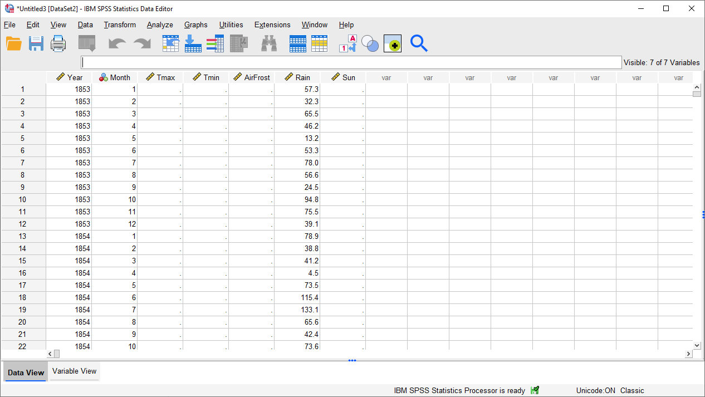

summarizing and graphing data in spss
=======================================

SPSS (Statistical Package for Social Scientists) is a software package designed to provide a wide range of data
analysis capabilities, ranging from the basics to more advanced techniques.

The purpose of this practical is to introduce you to SPSS and complement the theoretical material presented
in the lectures, discussions, and reading material. The experience gained in analyzing and presenting data should also
help you to develop your confidence in using and presenting numerical results.

In this practical, we're going to focus on some of the basics - importing and labelling data, generating descriptive
statistics, and creating plots. In the coming weeks, we will see some of the more advanced techniques, including
regression analysis and hypothesis testing.

By the end of this practical, you should:

    - be able to import data into SPSS
    - summarize data using SPSS
    - produce graphs of your data using SPSS

If you have not already, you should download the Week 6 Data from Blackboard and save it to your EGM101
folder on OneDrive.

getting started
----------------

To open SPSS, use either the **Start** menu (**Start** > **IBM SPSS Statistics** > **IBM SPSS Statistics**), or
double-click the desktop icon (if it exists). You should see the following welcome screen:

.. image:: img/week6/spss_welcome.png
    :width: 600
    :align: center
    :alt: the SPSS Welcome screen

|br| To get started, click on **New Dataset**, then **Open**. You should see a blank spreadsheet window open up:

|br| Click on the folder icon in the upper left corner of the window, or select **Open** from the **File** menu
(**File** > **Open** > **Data**).

Navigate to the folder where you have saved ``armaghdata.csv``, and make sure that **Files of type** is set to
``CSV (*.csv)``. Select ``armaghdata.csv``, then click **Open** to start the import process.

importing csv data
.....................

The file we're using here, ``armaghdata.csv``, is the exact same dataset as we used last week - all I have done is
clean up the entries (removing non-numeric characters), and change the format from fixed-width to
`comma separated values <https://en.wikipedia.org/wiki/Comma-separated_values>`__ (CSV), to make it easier to import
into SPSS.

.. note::

    SPSS is able to import data from Excel workbooks, but not when the workbook contains "extras" such as graphs,
    sub-tables, etc. - to use the Excel workbook from last week's practical, we would have to delete all of these.

    As an additional exercise, you could start with the ``armaghdata.txt`` file that we used in last week's practical.
    First, import the data into Excel as before, and save the file as either an Excel workbook (``.xlsx``
    extension) or CSV file (``.csv`` extension).

You should see the **Text Import Wizard - Step 1 of 6** window shown below:

.. image:: img/week6/import1.png
    :width: 400
    :align: center
    :alt: Step 1 of the SPSS Text Import Wizard

|br| Make sure that you have selected **No** for **Does your text file match a predefined format?**, then click **Next**
to bring up the second step:

.. image:: img/week6/import2.png
    :width: 400
    :align: center
    :alt: Step 2 of the SPSS Text Import Wizard

|br| Most of these should look the same, but just in case, make sure to select **Delimited** under **How are your
variables arranged?**, **Yes** and **Line 1** under **Are variable names included at the top of your file?**, and
**Period** under **What is the decimal symbol?**. Once you've checked all of these, click **Next**

.. image:: img/week6/import3.png
    :width: 400
    :align: center
    :alt: Step 3 of the SPSS Text Import Wizard

|br| Here again, the selection should look the same as it does above, but be sure to double-check before clicking
**Next**.

.. image:: img/week6/import4.png
    :width: 400
    :align: center
    :alt: Step 4 of the SPSS Text Import Wizard

|br| This is an important step if you are importing a CSV file that has text fields as well as numeric fields. As you
saw last week, though, the data in this file are only numeric, so the only thing you need to check is that **Comma**
(and *only* **Comma**) is selected as the delimiter between variables. Click **Next** to bring up step 5:

|br| In this window, you can change the name and format for each variable (column) of your data.

.. note::

    Like many software packages, SPSS has `rules for variable names <https://www.ibm.com/docs/en/spss-statistics/29.0.0?topic=variables-variable-names>`__.
    A brief summary of these rules:

    - Variable names must be *unique*
    - Variable names can be up to 64 bytes (effectively, 64 characters) long
    - The first letter of the variable name must be a letter or one of ``@``, ``#``, or ``$``
    - Variable names can contain periods (``.``), but they cannot begin or end with a period.
    - Variable names cannot contain spaces.
    - *Reserved* keywords such as ``ALL``, ``AND``, ``BY``, and so on (see link above for a full list) cannot be used
      as variable names.

Change the variable names to match what you see above, remembering that ``AirFrost`` or ``Air_Frost`` are valid names,
while ``Air Frost`` is not. Click **Next** to bring up the final step of the import wizard:

.. image:: img/week6/import6.png
    :width: 400
    :align: center
    :alt: Step 6 of the SPSS Text Import Wizard

|br| If you have a particular format that you will need to import repeatedly into SPSS, you can save the format at this
step, which will make files of this type easier to import in the future. We don't need to save this format for future
use, so you can click **Finish** to import the data.

the spss interface
-------------------

You should see that there are actually two windows that open: the **Data Editor**, and the **Viewer**.

data editor
.............

We'll cover the **Outputs** window in a moment, but first have a look at the **Data Editor** window:

|br| We will be using this data for the next two practicals (as well as your assignment!), so make sure that you save
your imported data onto your OneDrive folder as ``ArmaghData.sav``:

.. image:: img/week6/saved.png
    :width: 600
    :align: center
    :alt: the Armagh temperature data imported into the SPSS Data Editor window, saved as ArmaghData.sav

|br| This will make it easier for you to re-open your data in future sessions.

At the bottom of this window, you should notice two tabs: **Data View** and **Variable View**. We are currently
looking at the **Data View**, which is where you can input data, exactly like you would with Excel. There are a number
of notable differences between the SPSS **Data View** and Excel, though:

- SPSS uses slightly different terminology than we saw with Excel, though. In the SPSS **Data View**, rows are called
  **cases**, while columns are called **variables**.
- The SPSS **Data Editor** only allows you to enter single values into each cell - no formulas.
- Unlike in Excel, we can't start a new sub-table in SPSS. The spreadsheet is rectangular, and each cell represents
  the value of a variable for a particular case.

Later on, we will see how we can calculate new variables in SPSS. For now, click on the **Variable View** tab:

|br| In this tab, we can (among other things):

- change variable names
- change the format/type of variables (e.g., numeric, text, date/time)
- change how variables are displayed in the table or stored on disk
- add a **Label** (a more complete descriptions of the variable, including units) to a variable
- add **Value Labels**. Similar to **Labels**, this enables us to provide more complete explanations for values of a
  variable, which can be especially useful where numeric codes are used to represent non-numeric categories
- change the type of measurement (e.g., scale, ordinal, nominal) for each variable

Let's add a **Label** to each of our variables. To do this, click on the cell in the corresponding row of the **Label**
column, then type in the description. For example, for the ``Year`` variable, you could write "*Year recorded*".

When you're done, the **Variable View** should look something like this:

|br| The next thing we'll do is add **Value Labels** to the ``Month`` variable. When you hover over a cell in the
**Values** column of the **Variable View**, you should see a blue button with three dots appear, like in the image
above. Click on this button to bring up the **Value Labels** dialog:

.. image:: img/week6/value_labels.png
    :width: 300
    :align: center
    :alt: the Value Labels dialog window

|br| To add a **Value Label**, you need to first type in the **Value** in the first field, then type in the **Label**
in the second field. For example, to add a **Value Label** for January (month 1), you would type "1" in the **Value**
field, and "January" in the **Label** field, as above. Click **Add** to add the label.

To add another label, you can add it in the same way. Proceed until you have entered labels for all 12 months, then
click **OK** to return to the **Variable View** window. You should see that instead of "None" in the **Values**
column for the **Month** row, you now see ``{1, January}``:

.. image:: img/week6/values_labelled.png
    :width: 600
    :align: center
    :alt: the Variable View window with value labels added to the Month variable

|br| This indicates that you've added **Value Labels** to that variable - to see all of the labels, you'll need to
re-open the **Value Labels** dialog.

viewer
........

Let's switch now to the **Viewer** window. This is where SPSS writes the *outputs* of your analysis - tables,
charts/graphs, etc. The output in this window is saved separately from your data, in a separate format (``.spv``).
Save this to your OneDrive folder as ``ArmaghData.spv``, so that you have a record of the different analyses you perform
as you work through the practical.

|br| In this window, you can see that SPSS has written 7 *variables* and 2036 *cases* to the "working file", and you
also see what the **type** and **format** of each variable is. Each of the 7 variables imported and written are numbers,
which means that they have a **format** of ``F`` (for `Fortran <https://en.wikipedia.org/wiki/Fortran>`__,
a computer programming language). The numbers after the ``F`` indicate how many digits before/after the decimal point
are stored by the software - so, ``F4`` indicates that it's a four-digit number with no decimals, while ``F4.1``
indicates that there are four digits before the decimal place, and one digit after the decimal place.

We won't worry too much more about this now, but we'll return back to the viewer window once we start plotting
our data. For now, switch back to the **Data Editor** window.

computing a new variable
--------------------------

The next thing we'll do is use SPSS to calculate a new variable. To highlight some of the difference between SPSS and
Excel, we'll do the same thing that we did in last week's practical - namely, calculate the monthly mean air temperature
as the arithmetic mean of the monthly maximum and minimum temperatures:

.. math::

    T_{\rm mean} = \frac{T_{\rm max} + T_{\rm min}}{2}

To do this, select **Compute Variable** from the **Transform** menu (**Transform** > **Compute Variable**). This will
open the following dialog:

.. image:: img/week6/compute_variable.png
    :width: 400
    :align: center
    :alt: the Compute Variable dialog.

|br| Under **Target Variable**, type the new variable name (``Tmean``). Next, enter the formula to use to calculate the new
variable by typing in a formula like you might on a calculator - you can also use a number of pre-programmed functions.
For now, though, we can basically type in the formula above as-written:
::

    (Tmax + Tmin) / 2

or click on the variable names to insert them into the **Numeric expression**:

.. image:: img/week6/compute_tmean.png
    :width: 400
    :align: center
    :alt: the Compute Variable dialog, with the formula for Tmean entered.

|br| You can also add a **Label** and set the **Type** of the new variable by clicking on **Type & Label** under the
**Target Variable** field. This will bring up the following dialog:

|br| The **Label** for the variable should be "Monthly mean air temperature, in degrees Celsius" (similar to what we
used for ``Tmax`` and ``Tmin``), and the **Type** is **Numeric**. Click **Continue** to return to the previous window,
then click **OK** to create the new variable:

.. image:: img/week6/new_variable.png
    :width: 600
    :align: center
    :alt: the data editor window, with the column for the new variable, Tmean, highlighted.

|br| The new variable is entered into the table after all of the variables, but you can change the order in the
**Variable View** tab, by clicking on the row of the variable you want to move, and dragging it to the new position:

.. image:: img/week6/rearranged_variables.png
    :width: 600
    :align: center
    :alt: the variable view tab of the data editor, with the Tmean variable moved to be between Tmax and Tmin.

|br| Go ahead and do this as well, so that the three temperature variables (``Tmax``, ``Tmean``, ``Tmin``) are displayed in
order. Once this is done, be sure to **Save** the data file before continuing.

descriptive statistics
-------------------------

Now that we've imported our data, added labels and checked the data types, and calculated a new variable, we can start
looking at the ways that we can use SPSS to describe and visualize our data, starting with calculating descriptive
statistics.

Open the **Descriptive Statistics** dialog from the **Analyze** menu (**Analyze** > **Descriptive Statistics** >
**Descriptives**):

|br| Here, you can select which variables you want to describe by highlighting them in the left-hand field and clicking the
arrow button in the middle of the window, or by double-clicking on them. To remove variables from the calculation, you
do the same by highlighting them in the right-hand field.

We want to see descriptive statistics for all three temperature variables (``Tmax``, ``Tmean``, ``Tmin``), as well as
monthly total precipitation (``Rain``) - move all of these variables to the field on the right side of the window:

.. image:: img/week6/descriptives_selected.png
    :width: 400
    :align: center
    :alt: the descriptives dialog, with four variables (Tmax, Tmean, Tmin, and Rain) selected.

|br| Next, click on **Options** to choose which descriptive statistics to calculate:

.. image:: img/week6/descriptives_options.png
    :width: 200
    :align: center
    :alt: the descriptives options dialog, with mean, std. dev., variance, range, min., max., and s.e. mean selected.

|br| SPSS will only calculate the statistics that we tell it to, using the **Options** dialog. We want to calculate the
mean, standard deviation, variance, range, minimum, maximum, and standard error of the mean (*S.E. mean*) for each
variable - make sure that each of these boxes are checked, then click **Continue** to return to the previous window.
Now, click **OK** to start the calculation.

In the **Viewer** window, you should see that SPSS has added a table with the requested calculations:

.. image:: img/week6/descriptives_output.png
    :width: 600
    :align: center
    :alt: the viewer window, with a table showing the selected descriptive statistics for the selected variables.

|br| Here, you can see that the rows of the table correspond to each variable, while the columns correspond to the
statistics. You can also see that there are different values of ``N`` - remember that this is because the temperature
record doesn't start until April 1865, but the rainfall record begins in January 1853.

.. admonition:: Questions

    - Which of the temperature variables has the largest variance/standard deviation? Why do you think this might be the case?
    - What is the highest recorded monthly rainfall in Armagh? What about the lowest?

grouping data
----------------

The statistics we calculated above and displayed in the **Viewer** window are for the entire record (1853 - 2022). We
might be interested in descriptive statistics for specific months or subsets of the data, however, which means we have
to *group* the data before calculating the descriptive statistics by *splitting* the data, or by selecting specific
cases. We'll look at both options below.

splitting data
................

To *split* the data, click on the **Split File** button from the **Data Editor** (red box below), or by selecting
**Split File** from the **Data** menu (**Data** > **Split File**):

.. image:: img/week6/split_button.png
    :width: 600
    :align: center
    :alt: the data editor window, with the split file button highlighted in red.

|br| This will open the **Split File** dialog:

.. image:: img/week6/split_file.png
    :width: 400
    :align: center
    :alt: the split file dialog, with "analyze all cases, do not create groups" selected

|br| We want to *split* the data based on the ``Month`` variable, so select **Compare groups** and move the
``Month`` variable to the **Groups based on** field, in the same way that you selected variables for calculating
descriptive statistics:

.. image:: img/week6/split_month.png
    :width: 400
    :align: center
    :alt: the split file dialog, with "compare groups" selected, and "groups based on" month recorded.

|br| Make sure that you select **Sort the file by grouping variables** as well, as the file is not currently sorted.
When you click **OK**, you should see that the file has sorted by ``Month`` (with month 1 at the top):

|br| Now, calculate descriptives again (**Analyze** > **Descriptive Statistics** > **Descriptives**, or by pressing the
**Run descriptive statistics** button from the **Data Editor**), you should see that the **Viewer** window displays
a new table, with a section for each month:

.. image:: img/week6/descriptives_month.png
    :width: 600
    :align: center
    :alt: the statistics viewer window, with a table showing descriptive statistics according to month.

|br| Note that because we have set *labels* for the ``Month`` variable, each table has the *category* label displayed
above it, instead of just the numerical value.

You can also change the *title* for each of the entries in the **Viewer** log - this can help you differentiate between
the different analyses you have performed as you look back at the results. Go ahead and change the second "Descriptives"
entry to say "Monthly Descriptives" by clicking on the text and typing in the new name:

.. image:: img/week6/monthly_descriptives_edited.png
    :width: 600
    :align: center
    :alt: the statistics viewer window, with the label for monthly descriptives changed.

|br| In the image above, you can see that you can also change the titles of each table in the same way - for example, to
remove the "Month recorded = " from each entry.

Have a look at the tables in the **Viewer** window, and see if you can answer the questions below before moving on.

.. admonition:: Questions

    - Which months have the largest variation in temperature? Why do you think this might be the case?
    - In what month was the highest recorded monthly rainfall recorded in Armagh? What about the lowest?

.. note::

    To answer the above questions, it might also be easier to re-calculate the statistics using a single variable.

recoding values
................

`Meteorological seasons <https://www.metoffice.gov.uk/weather/learn-about/weather/seasons/>`__ are defined by splitting
the year into four periods of three months each, which helps with comparing seasonal and monthly statistics between
years. The seasons are defined as follows:

- Spring: March, April, May
- Summer: June, July, August
- Autumn: September, October, November
- Winter: December, January, February

We can use SPSS to assign a season to each of our data values, based on the month that it was recorded. To do this,
we use a tool called **Recode into different variables** (**Transform** > **Recode into different variables**).
When you select this, you should see the following dialog:

.. image:: img/week6/recode_blank.png
    :width: 400
    :align: center
    :alt: the "recode into different variables" dialog

|br| The variable that we want to recode is ``Month``, so add that to **Input Variable -> Output Variable**. The
**Output Variable** that we want to create by recoding is ``Season``, so add that to the **Name** of the
**Output Variable**, and fill in a **Label** as well:

.. image:: img/week6/recode_blank.png
    :width: 400
    :align: center
    :alt: the "recode into different variables" dialog, with "month" selected and a new variable, "season" added

|br| Now, we have to tell SPSS *how* to recode the variable. That is, what values of ``Month`` determine each value of
``Season``? Click on **Old and New Values** to bring up the following dialog:

.. image:: img/week6/old_and_new_blank.png
    :width: 400
    :align: center
    :alt: the "recode into different variables: old and new values" dialog

|br| Here is where we tell SPSS how to recode the values of ``Month`` into the new ``Season`` variable. Because each
season is defined by a *range* of month values, select **Range** under **Old Value**, and enter the values 3 and 5 into
the two boxes. Under **New Value**, enter a value of 1:

.. image:: img/week6/old_and_new.png
    :width: 400
    :align: center
    :alt: the "recode into different variables: old and new values" dialog, with values entered for Spring

|br| This means that anywhere the value of ``Month`` is equal to 3, 4, or 5 (corresponding to March, April, and May),
the ``Season`` variable will have a value of 1 (corresponding to Spring). Click **Add** to add this value to the
**Old --> New** table, then proceed to enter the following values:

- Summer: **Old**: 6 through 8, **New**: 2
- Autumn: **Old**: 9 through 11, **New**: 3
- Winter: **Old**: All other values, **New**: 4

Here, we use **All other values** to recode winter. The table should look like this:

.. image:: img/week6/old_and_new_all.png
    :width: 400
    :align: center
    :alt: the "recode into different variables: old and new values" dialog, with values entered for all seasons

|br| Click **Continue** to go back to the **Recode into Different Variables** dialog, which should look like this:

|br| Click **OK** to perform the recoding. You should now see a new variable, ``Spring``, in the **Data Editor**.
Just like we did with the months, you can add **Labels** to the new variable so that when you compute descriptive
statistics or perform other calculations, the names will make more sense:

|br| Enter labels for the variable now, in the same way that you did earlier for ``Month``.

Now, we can look at descriptive statistics for the seasons. First, we need to *split* the data based on this new
variable - either click on the **Split File** button, or choose **Split File** from the **Data** menu (**Data** >
**Split File**). Choose **Compare groups** and **Groups Based on** ``Season``:

.. image:: img/week6/split_season.png
    :width: 300
    :align: center
    :alt: the split file dialog, with "compare groups" selected, and "groups based on" meteorological season.

|br| Click **OK**. Next, open the **Descriptive Statistics** dialog again (**Analyze** > **Descriptive Statistics** >
**Descriptives**). For this step, we only want to see the descriptive statistics for precipitation, so make sure
that the only variable selected is ``Rain``:

.. image:: img/week6/descriptives_precip.png
    :width: 300
    :align: center
    :alt: the Descriptives dialog, with "monthly total precipitation" selected.

|br| Double-check that the same statistics are still selected by clicking on **Options**. Once you have checked this,
click **OK** to return to the **Descriptives** dialog, and click **OK** again to calculate descriptive statistics.

You should see this table in the **Statistics Viewer** window:

|br| Rename the table to "Seasonal Rain" as above, and be sure to save both the ``.spv`` file and the ``.sav`` file.

As a final step, undo the *split* by opening the **Split File** dialog again (**Data** > **Split File**), and selecting
**Analyze all cases, do not create groups**. Do this now, before moving on to the next section.

selecting cases
.................

The final way that we'll look at to select subsets of our data is by *selecting cases* (or groups of cases). In this
case, we're interested in the record from 1951 - 1980.

Open the **Select Cases** dialog by clicking on the **Select Cases** button (outlined in red below), or from the
**Data** menu (**Data** > **Select Cases**):

.. image:: img/week6/select1.png
    :width: 300
    :align: center
    :alt: the select cases dialog.

|br| In the **Select Cases** dialog, we want to select cases where ``Year`` is between 1951 and 1980 - that is,
we want to select cases if a particular condition is satisfied. So, click on **If condition is satisfied**, then
click the **If** button to define the condition. This will open the **Select Cases: If** dialog, where you can enter
the following formula:
::

    (Year >= 1951) & (Year <= 1980)

.. image:: img/week6/select_conditional.png
    :width: 500
    :align: center
    :alt: the "select cases: if" dialog, with a formula entered to select years between 1951 and 1980.

|br| This formula tells SPSS to select all cases where ``Year`` is both greater than (or equal to) 1951, *and* (``&``)
where ``Year`` is less than (or equal to) 1980. When you have entered the formula, click **Continue** to return
to the **Select Cases** dialog:

|br| Click **OK**. You should now see that there is a new variable in the table, ``filter_$``:

.. image:: img/week6/filtered.png
    :width: 600
    :align: center
    :alt: the data editor window, with a new "filter" variable added

|br| This variable has a value of 1 where the case is included in the selection, and 0 where it is not. If you scroll
through the table, you should see that cases where ``Year`` is between 1951 and 1980 have a 1, and a 0 where this is
not true.

Now, we can summarize the temperature and precipitation for those years, using descriptive statistics. Once again,
open the **Descriptive Statistics** dialog and select the three temperature variables (``Tmax``, ``Tmean``,
and ``Tmin``), plus the precipitation variable (``Rain``). When the tool finishes running, you should see the
following table output in the **Statistics Viewer** window:

|br| Don't forget to change the title of this section to make it clear that these are values for 1951-1980.

Finally, to undo the filtering, open **Select Cases** again, and click the button for **All cases**. Do this before
continuing to the next section.

displaying data
------------------

In the final part of this practical, we'll look at how we can use SPSS to display data in graphical form. There are
many more options available than examples covered here, and a wide variety of tutorials/walkthroughs available online,
so feel free to continue exploring once you've reached the end of the practical.

histogram
............

As a first example, we'll create a histogram of rainfall values using all of the available data.

.. admonition:: Questions

    - ...

bar graph
............

rain, categorized using monthly values

.. admonition:: Questions

    - ...

next steps
-------------

- Use **Select Cases** to select cases from 1991 - 2020, and create a table showing the descriptive statistics of the
  temperature variables and precipitation. Do you notice any differences between this period and the period 1951-1980?
-

