correlation and regression in spss
===================================

The purpose of this practical is to continue introducing you to SPSS, and complement the theoretical material presented
in the lectures, discussions, and reading material. The experience gained in analyzing and presenting data should also
help you continue to develop your confidence in using, presenting, and discussing numerical results.

In this practical, we will take a step beyond the basics of importing data into SPSS, calculating descriptive
statistics, and creating plots. We will see how we can compare different subsets of our data, calculate trends using
linear regression, and how we can analyze those results.

.. warning::

    The material covered in this practical assumes that you have worked through the lecture material and reading from
    Week 6, where we introduce topics like correlation and regression.

    If you have not worked through this material yet, you might have a difficult time answering some of the questions.

.. _egm101 spss open:

getting started
------------------

.. warning::

    No, seriously. If you have not yet completed all the steps from the Week 6 practical, you should stop here and
    make sure that you finish them before moving on.

To get started, open SPSS using either the **Start** menu (**Start** > **IBM SPSS Statistics** >
**IBM SPSS Statistics**), double-click the desktop icon (if it exists), or click on the taskbar icon (if it exists).

When SPSS launches, you should see the normal welcome screen:

.. image:: img/week6/spss_welcome.png
    :width: 720
    :align: center
    :alt: the SPSS Welcome screen

|br| To open your previous files, you may need to click on the **Recent Files** tab. Then, click on
**Open another file**, followed by **Open**.

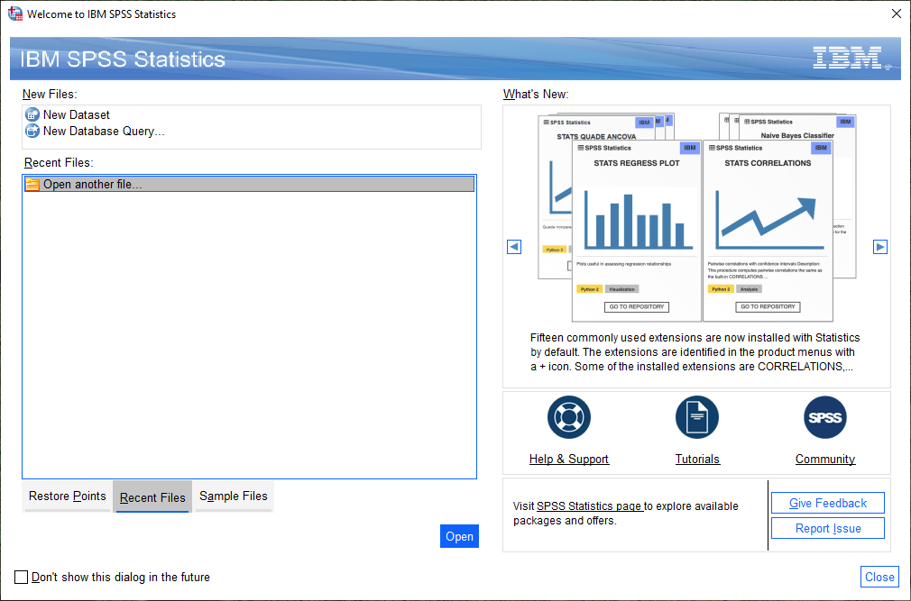

|br| Browse to where you have saved your **.sav** file, and open it:

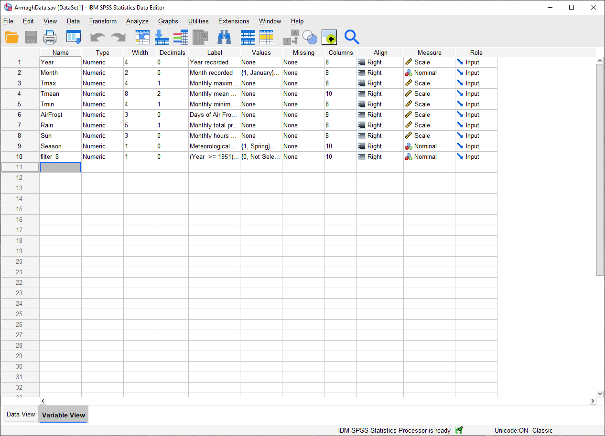

|br| You can also open the **.spv** file from the **File** menu (**File** > **Open** > **Output**), then browsing to
where you have saved it:

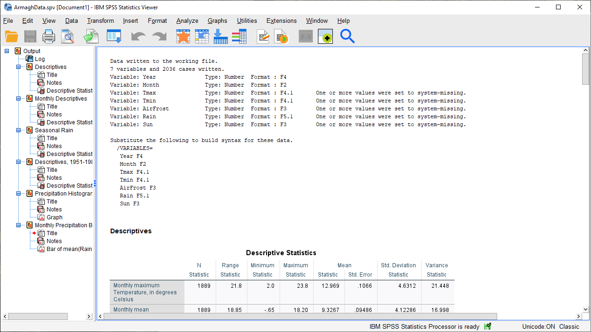

|br|

.. tip::

    If at any point you accidentally close the **Viewer** window, this is one way that you can re-open it.

creating a box plot
--------------------

.. warning::

    Before starting this section, make sure that you have removed any splits from your dataset!

    As a reminder: Select **Split File** from the **Data** menu (**Data** > **Split File**), then make sure that you
    select **Analyze all cases, do not create groups**.

Open the **Boxplot** dialog by selecting it from the **Graphs** menu (**Graphs** > **Boxplot**). You should see the
following:

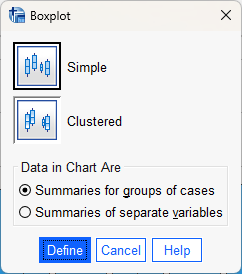

|br| Ensure that **Simple** boxplot is selected (the default), and that **Data in chart are** is set to
**Summaries for groups of cases**. Click **Define** to bring up the definition dialog:

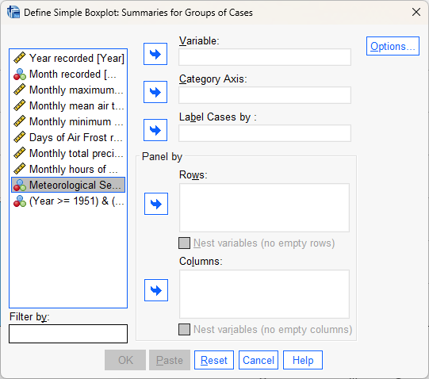

|br| As before, we need to tell SPSS what variables to use for the plot. The **Variable** that we are going to be
plotting is **Monthly total precipitation, in mm**, while the **Category Axis** should be **Month recorded**. Select
each of these in turn and add them to the correct fields.

The dialog should now look like this:

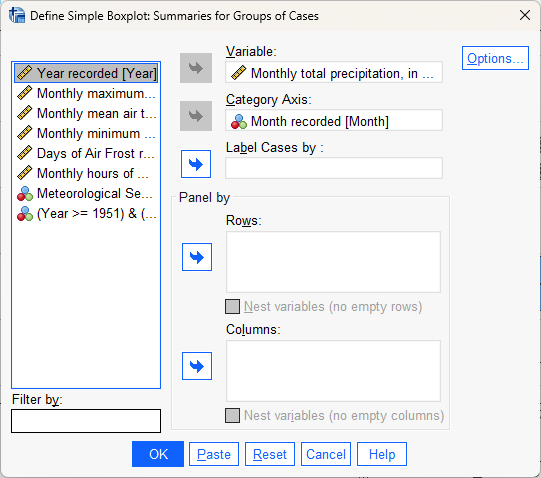

|br| Now, click on **Options** to bring up the options dialog:

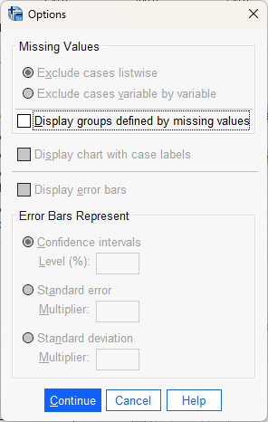

|br| Unlike with the bar chart, we don't have very many options to change here. The variable that we are plotting here
(``Rain``) doesn't have very many missing values, but in the future you might want to select
**Display groups defined by missing values**, which will display a report about missing values.

Click **Continue**, then click **OK** to finish creating the boxplot. You should see the following in your
**Data Viewer** window:

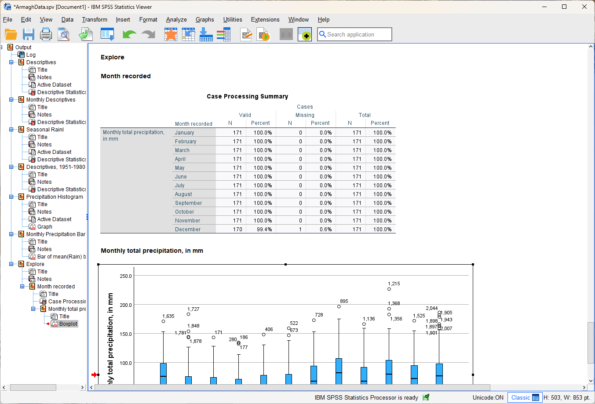

|br|

.. tip::

    As you have done previously, re-name this from "Explore" to something more recognizable so that you can easily
    find it in your outputs. In the example above, I have chosen "Monthly Precipitation Boxplot".

SPSS has output two items here - the boxplot, and the **Case Processing Summary**. This summary breaks down the number
of values by case, so that you can see what percentage of each group is missing/invalid values. As a general rule, it's
a good idea to check this and make sure you don't have an unexpectedly high percentage of missing values, or an uneven
number of observations for each group.

.. card::
    :class-header: question
    :class-card: question

    :far:`circle-question` Question
    ^^^

    - What month(s) have missing values?
    - What percentage of the total does this represent?
    - Do you think that this will make a substantial difference for calculating the boxplot for each month? Why or why
      not?

By default, SPSS labels the outliers by **case number** - this way, we can go back into the **Data Editor** to view
each outlier. This looks a bit messy on the plot, so we can turn it off using the **Chart Editor**.

To open the **Chart Editor** for a chart, just double-click on it in the **Data Viewer**. You should see the following
window open up:

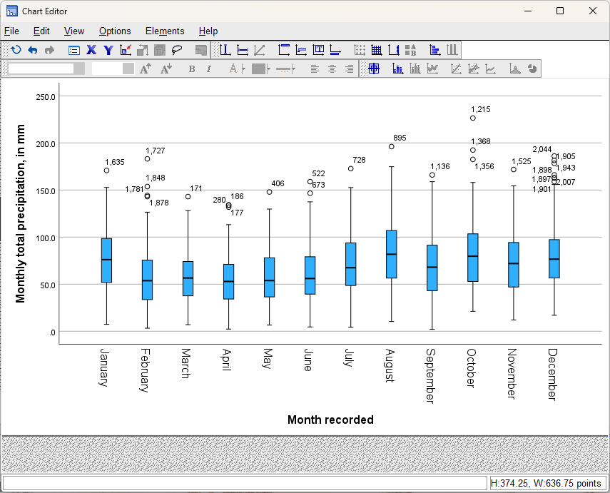

|br| As you might imagine, there are a number of options that we can change using the **Chart Editor**, including
changing the orientation of the boxplot (so the boxes are horizontal rather than vertical). For now, we're only going
to turn off the data labels, but feel free to have a look at the different menus to see what options might be available.

To turn off the data labels, click on the **Elements** menu:

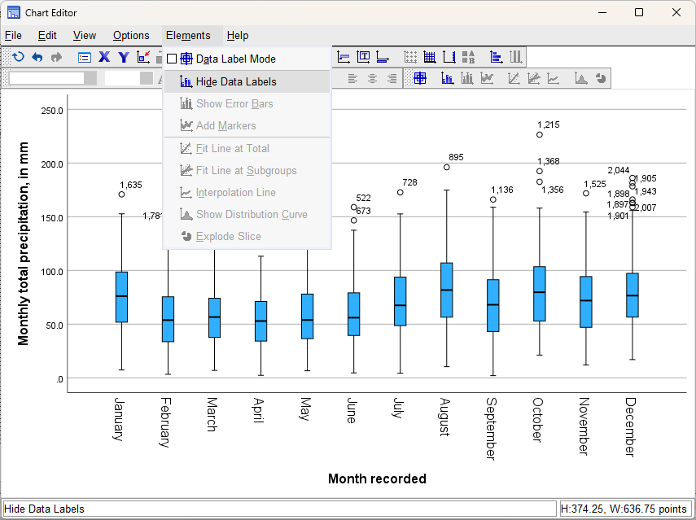

|br| Click on **Hide Data Labels** to turn off the case number label for the outliers, then close the **Chart Editor**.
In the **Data Viewer** window, you should see that the labels have been removed:

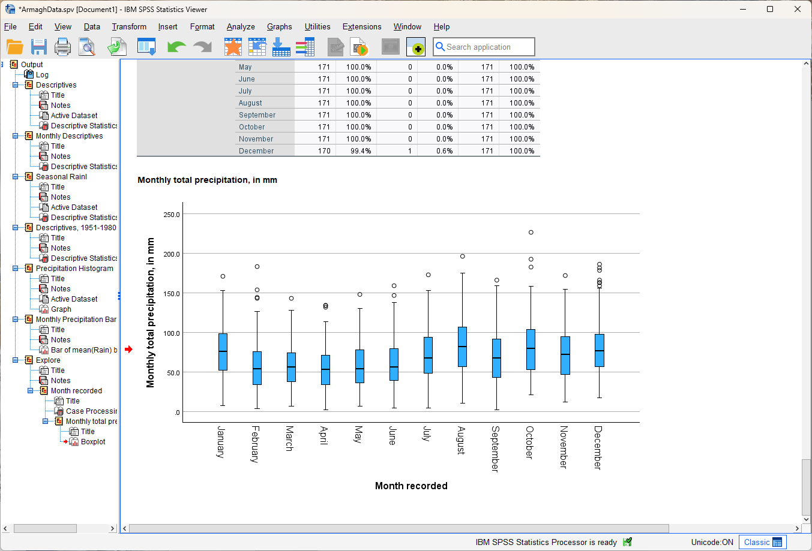

|br|

.. card::
    :class-header: question
    :class-card: question

    :far:`circle-question` Question
    ^^^

    Look at the box plot that you have just created and compare it with the bar chart that you created last week. Which
    of these two plots conveys more information about the distribution of monthly rainfall? Why do you think this? Use
    these two graphs to try to answer the following questions:

    - Which month appears to have the least variability?
    - Which month(s) appear to be the most/least symmetrical?
    - Which month(s) had the lowest recorded rainfall?

Once you are confident that you can understand and answer the questions above, move on to the next steps.

.. tip::

    Remember to save your **.spv** and **.sav** files!

creating a date variable
-------------------------

Most software programs that you will encounter have a special way of handling dates, to make it possible to compute
the amount of time that has passed between different dates and times, or to do other calculations involving dates and
time.

`SPSS is no exception <https://www.ibm.com/docs/en/spss-statistics/28.0.0?topic=wizard-dates-times-in-spss-statistics>`__,
so if we want to be able to make plots of variable values over time, we will need to convert our ``Year``/``Month`` variables
into a **Date** variable.

From the **Transform** menu, select **Date and Time Wizard**. This will open the following dialog:

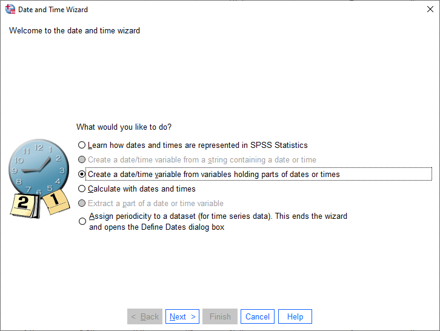

|br| Select **Create a date/time variable from variables holding parts of dates or times**, then click **Next**:

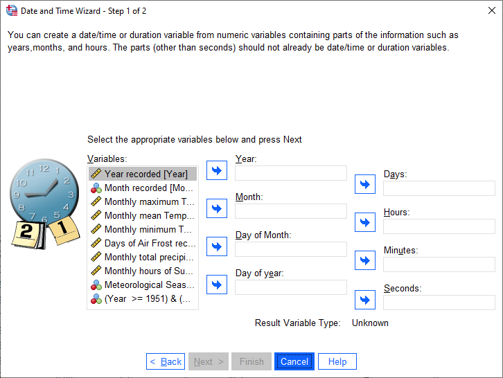

|br| In this step, we tell SPSS what variables correspond to what parts of the **Date** variable we want to calculate.
Note that we don't have to fill all of these out - because we only have **Month** and **Year** variables, those are
what we need to set.

Highlight ``Year`` in the **Variables** box, then click the arrow button next to **Year**. Do
the same for ``Month``, so that the dialog looks like this:

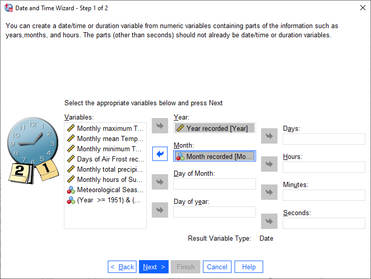

|br| Now, click **Next**. This is where we set the name and label of the new variable and select the **Output Format**
- how we want the date to be displayed.

Name the new variable ``Date`` and add an appropriate label (e.g., "Date measurement was recorded").

Select the **yyyy/mm/dd** format - when we create the new variable, the first value should look like **1853/01/01/**,
for 01 January 1853. Click **Finish** to create the new variable:

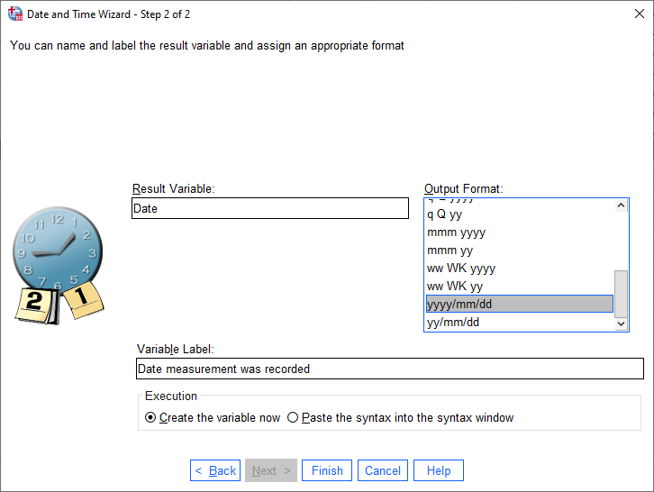

|br| If you like, you can re-arrange the variable order in the **Variable View** tab of the **Data Editor**
window so that the ``Date`` variable is at the top. To do this, click on the number next to the variable you want to
move, then drag the variable to the new position while holding down the mouse button.

Once you are happy with the order of the variables, move on to the next steps.

scatter plots in spss
------------------------

.. note::

    For the next few sections, make sure that you have **Split** the file based on meteorological season. If you aren't
    sure how to do this, you can refer to :ref:`last week's <egm101 split>` practical for a refresher.

We can create a scatter plot in SPSS in the same way that we created histograms, bar charts, and boxplots. The
instructions below will show this using the **Chart Builder**, but you can also use the **Dialog** (**Graphs** >
**Scatter/Dot**).

To start, open the **Chart Builder** (**Graphs** > **Chart Builder**).

Under **Gallery** in the lower left corner, select **Scatter/Dot**, then select **Scatter Plot** by double-clicking on
the icon (red outline):

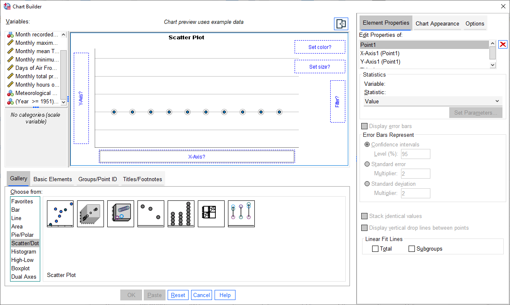

|br| In this part of the practical, we're going to look at the relationship between the number of hours of sun in a
given month (the ``Sun`` variable) and the monthly minimum temperature (``Tmin``), using ``Sun`` as the *explanatory*
variable, and ``Tmin`` as the *response* variable.

To do this, click and drag the ``Sun`` variable to the **X-Axis?** box, and the ``Tmin`` variable to the **Y-Axis?**
box:

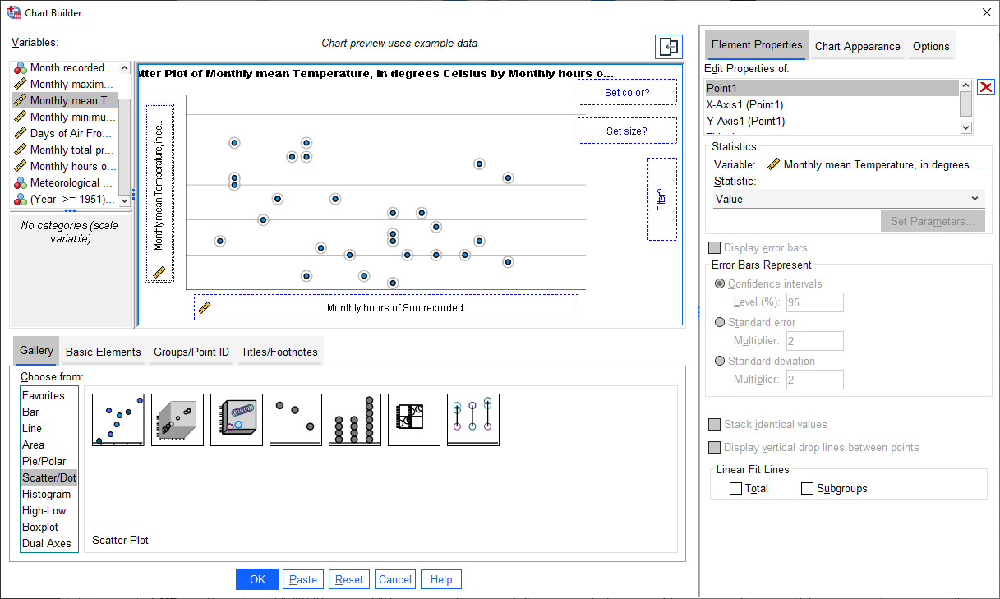

|br| Click **OK**, and you should see four scatter plots created in the **Viewer** window.

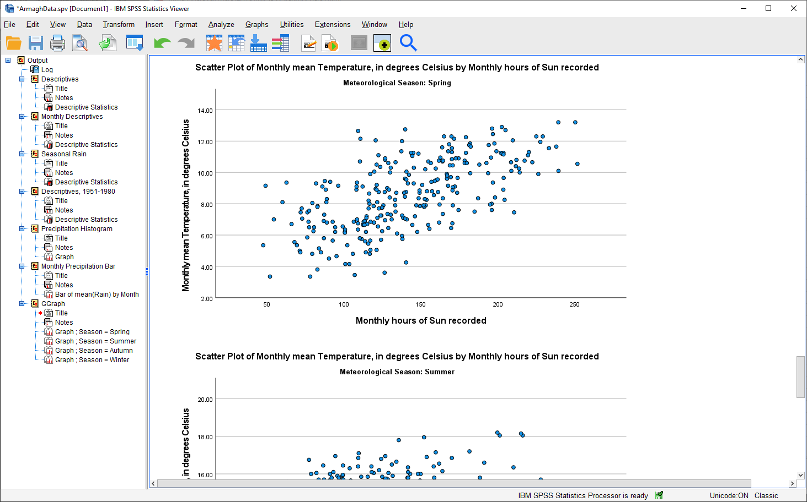

|br|

.. note::

    If you do not see four scatter plots, check that you have split the data based on ``Season``, then repeat the
    previous steps.

.. card::
    :class-header: question
    :class-card: question

    :far:`circle-question` Question
    ^^^
    Describe the four different relationships that you see.

    - Of the four, which season seems to have the strongest relationship between hours of sun and minimum temperature?
    - Are there any seasons where you see a *negative* relationship between hours of sun and minimum temperature?
    - Can you think of a physical explanation for why you see these relationships?

.. tip::

    Remember to **Save** your outputs and data before moving on!

calculating correlation in spss
---------------------------------

Remember that scatter plots can give us a visual representation of the relationship between two variables, and we
can even estimate the direction and strength of the (linear) relationship based on the scatter of the points.

As we have covered in the lectures, visual inspection is not the only method we have - we can also calculate the
correlation between variables.

First, open the **Bivariate Correlations** dialog ("bivariate" meaning "two variables") from the **Analyze** menu
(**Analyze** > **Correlate** > **Bivariate**):

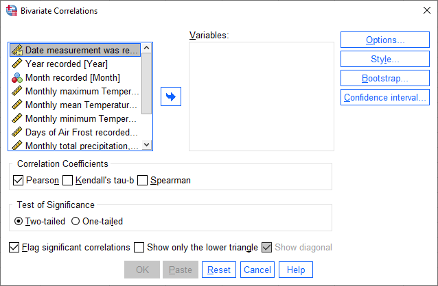

|br| As you can see, SPSS offers three methods for estimating correlation available in this dialog, two of which we have
covered in the lectures:

- Pearson's correlation coefficient
- `Kendall's tau-b rank correlation <https://www.statisticshowto.com/kendalls-tau/>`__
- Spearman's rank correlation

Kendall's :math:`\tau b` rank correlation is a method for estimating correlation when you have many tied ranks in your
data - we're not going to explore it in detail here, but you can read more about it through the link above.

In the dialog, add ``Sun`` and ``Tmin`` to the list of **Variables** and select both **Pearson** and **Spearman**
correlation coefficients.

At the bottom of the window, de-select **Flag significant correlations** - we'll discuss "significant" correlations
more in next week's lecture and practicals.

Because we only have two variables, select **Show only the lower triangle**, and de-select **Show diagonal** - this way,
we will see the correlations for each variable in a single column:

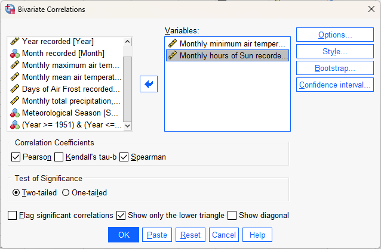

|br| Click **OK**, and you should see two tables added to the **Viewer** window:

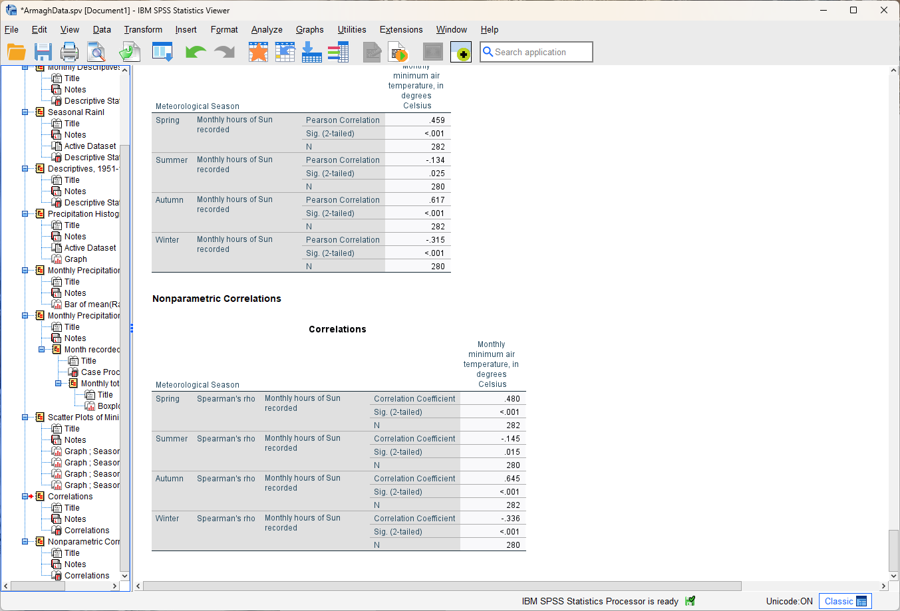

|br| The first table, "Correlations", shows the Pearson's correlation coefficient between the variables. The second,
"Nonparametric Correlations", shows the Spearman's rank correlation coefficient (or "Spearman's rho").

.. card::
    :class-header: question
    :class-card: question

    :far:`circle-question` Question
    ^^^

    Compare the correlation values for each season.

    - Do the correlation measures that you see here match the expectations that you had, based on the scatter plots?
      Why or why not?
    - What differences between the two correlation measures do you notice?\ [1]_
    - Do any seasons have a negative correlation between hours of sun and minimum temperature? If so, can you think of
      a physical explanation for why that might happen?

regression in spss
--------------------

Now that we've made scatter plots and calculated the correlation between these two variables, we'll see how we can use
SPSS to do linear regression, to estimate the (linear) relationship between them.

To begin, open the **Curve Estimation** dialog (**Analyze** > **Regression** > **Curve Estimation**):

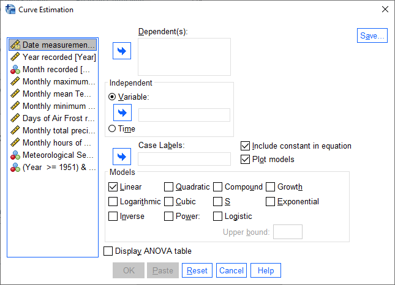

|br| As you can see in this dialog, SPSS allows you to use a wide range of models to estimate the relationships between
two variables, including quite a few that we've mentioned in the lectures. For now, we'll stick to the **Linear** model,
but in the future you may work with data that exhibit some other form of relationship.

Add the ``Tmin`` variable to the **Dependent(s)** field, and then add the ``Sun`` variable to the **Independent**
field:

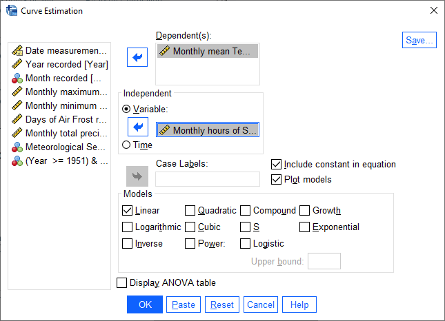

|br| This will find the "best-fit" line using monthly hours of sun as the explanatory (*independent*) variable, and
the monthly minimum temperature as the response (*dependent*) variable. Make sure that **Plot models** is checked, then
click **OK** to run the regression.

You should see a number of tables and graphs added to the **Viewer** window:

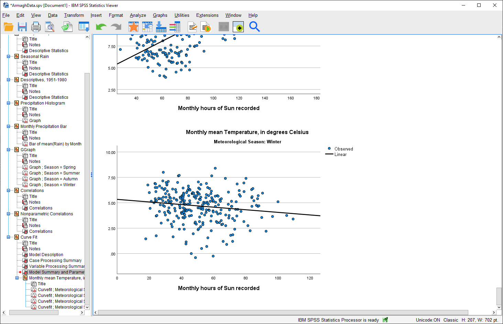

|br|

.. card::
    :class-header: question
    :class-card: question

    :far:`circle-question` Question
    ^^^

    Look at each of the four graphs. Of the four seasons, which slope is the largest (in absolute value)? How do the
    correlation coefficients that we calculated earlier compare to the slopes of the regression line?

reading the model summary
..............................

Now look at the **Model Summary and Parameter Estimates** table\ [2]_:

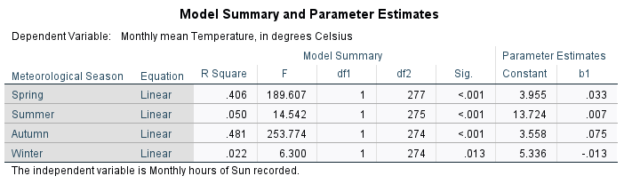

|br| This table has the following columns in the **Model Summary** section:

- **Equation**, which tells you the type of model used in the regression
- **R Square**, the coefficient of determination (:math:`R^2`)
- **F**, the *F*-statistic (more on this next week)
- **df1** and **df2**, the number of degrees of freedom for the *F*-distribution (more on this next week)
- **Sig.** the results of the significance test for the regression (more on this next week)

.. card::
    :class-header: question
    :class-card: question

    :far:`circle-question` Question
    ^^^

    **In your own words**, what does the :math:`R^2` value for Spring tell us about the linear relationship between
    hours of sun and monthly minimum temperature for Spring months? What about for the other months?

In the **Parameter Estimates** section of the table, we have:

- **Constant**, the estimate of the intercept of the linear model (:math:`\beta` in the lecture notes)
- **b1**, the estimate of the slope of the linear model (:math:`\alpha` in the lecture notes)

.. hint::

    Putting this all together using the example table above, the equation for the relationship between monthly hours of
    sun and the monthly mean temperature (``Tmean``) for **Summer** would be:

    .. math::

        {\rm Temperature} = 0.007 * {\rm Hours\ of\ Sun} + 13.724

    This means that for every unit increase of ``Sun``, the predicted value of ``Tmean`` *increases* by 0.007°C. At 0
    hours of Sun, the predicted value of ``Tmean`` is 13.724°C.

comparing slopes
----------------

Re-do the previous regression analysis, but this time use ``Tmax`` instead of ``Tmin``. Use the resulting table, along
with your results from ``Tmin``, to answer the following questions.

.. card::
    :class-header: question
    :class-card: question

    :far:`circle-question` Question
    ^^^

    In which season do you see the **largest difference** between the estimated :math:`R^2` value (**R squared** in the
    **Model Summary and Parameter Estimates** table)? Why do you think this might be the case?

    Remember to think about what the :math:`R^2` value represents!

.. card::
    :class-header: question
    :class-card: question

    :far:`circle-question` Question
    ^^^

    In which season(s) do you see the **largest difference** between the estimated slope values? Are there any
    relationships that have an opposing sign (in other words, one is negative and one is positive)?

.. hint::

    To help you answer these questions, you could open a new **Excel** spreadsheet, enter the values of **b1** from
    each table, and use a formula to calculate the difference between them:

    .. image:: img/week7/compare_seasonal_r2.png
        :width: 600
        :align: center
        :alt: an excel workbook, set up to compare differences in R² value for Tmax and Tmean by season

.. warning::

    If you are working on a lab computer, make sure that you upload the **.sav** and **.spv** files to OneDrive
    **BEFORE** leaving the computer lab.

    If you do not, you will lose your work, and you will need to re-complete the steps of this practical to be able to
    answer the questions on the assessment!

next steps
------------

Instead of splitting the data based on ``Season``, split based on ``Month`` and re-run the scatter plot and correlation
steps outlined above.

.. card::
    :class-header: question
    :class-card: question

    :far:`circle-question` Question
    ^^^

    - What month(s) has/have the strongest correlation between hours of sun and mean temperature? Why do you think this
      might be the case?
    - Do all of the months in a season show the same relationship? What effect do you think this might have on the
      overall relationship for each season?

notes
-----

.. [1] Remember: Pearson's correlation assesses the linear relationship only, while Spearman's assesses the monotonic
       relationship. so large (> 0.3 or so) differences may mean that the relationship is not entirely linear.

.. [2] As always, the values that you see might be different to the values shown in these screenshots. The
       example here shows monthly mean temperature (``Tmean``) rather than the minimum temperature (``Tmin``).

