hypothesis testing using spss
===============================

The purpose of this practical is to continue introducing you to SPSS, and complement the theoretical material presented
in the lectures, discussions, and reading material. The experience gained in analyzing and presenting data should also
help you continue to develop your confidence in using, presenting, and discussing numerical results.

In this practical, we will see how we can use SPSS for testing hypotheses. We will gain practice formulating the null
and alternative hypotheses, and in selecting appropriate statistical tests.

getting started
------------------

.. warning::

    If you have not yet completed all the steps from the Week 7 practical, you should stop here and make sure that you
    finish them before moving forward.

To get started, open SPSS and re-open the ``ArmaghData.sav`` and ``ArmaghData.spv`` files that you have been working
with over the past two weeks. If you are not sure how to do this, have a look at the instructions
:ref:`from last week <egm101 spss open>` as a refresher.

Remember that if you are working on the lab computers, you will need to download the files that you uploaded to
OneDrive at the end of last week's practical.

splitting the data
-------------------

Our goal in today's practical is going to be looking at the differences in monthly mean temperature between three
different time periods: 1871-1920, 1921-1970, and 1971-2020. To do this, we will first need to use
**Recode into different variables**, like we did in :ref:`Week 6 <egm101 recode>` to group our data into meteorological
seasons.

To begin, open the **Recode into different variables** dialog (**Transform** > **Recode into different variables**).

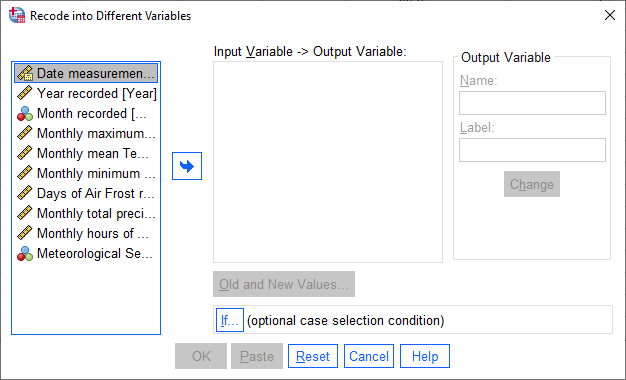

|br| We want to recode the ``Year`` variable into a new variable, ``Period``, which corresponds to one of the time
periods that we're looking at. To do this, select the ``Year`` variable from the list of variables, type "Period" into
the **Name** field, and add a **Label**. Then, click **Change**:

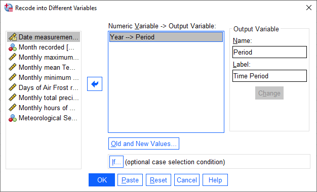

|br| Next, click on **Old and New Values** to tell SPSS how to recode the ``Year`` variable into the ``Period``
variable:

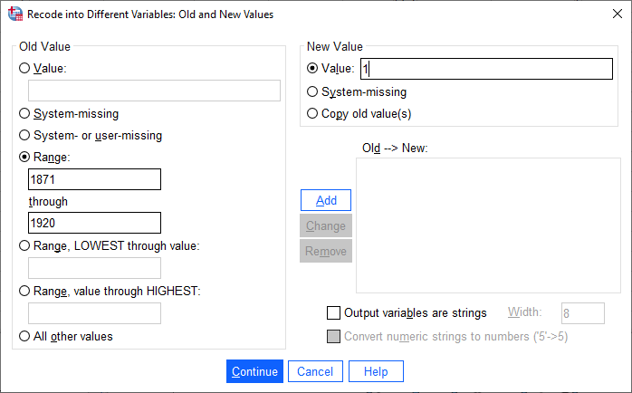

|br| Give the period 1871-1920 a value of 1, 1921-1970 a value of 2, 1971-2020 a value of 3, and all other values a
value of zero:

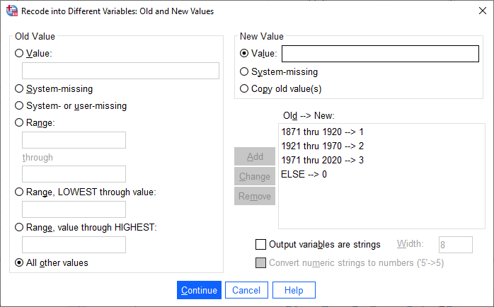

|br| Click **OK**. You should see the new variable created in the **Data Editor** window. Under the **Variable View**
tab, add labels for each value of period, like you did previously for the ``Month`` and ``Season`` variables. You should
also change the **Width** and **Decimals** for the ``Period`` variable to be 2 and 0, respectively, and make sure that
the **Measure** is set to **Nominal**:

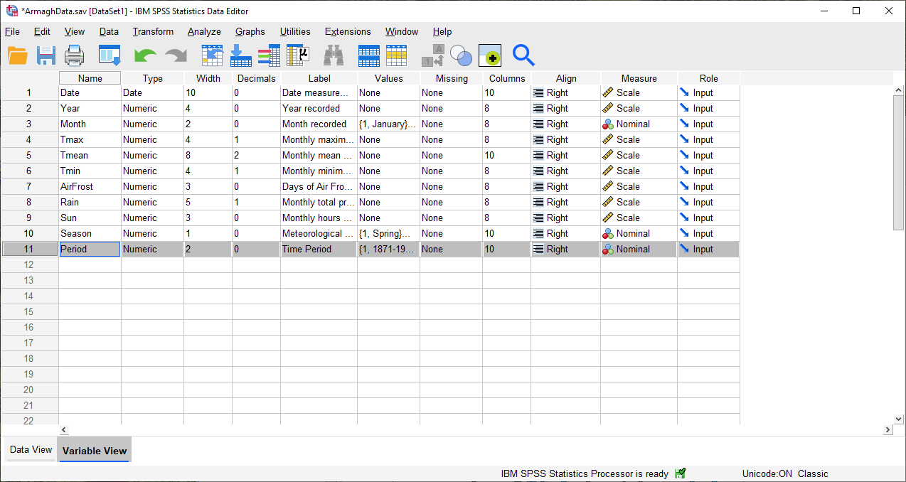

|br| Once you have done this, move on to the next section.

aggregating data
-----------------

Before we proceed, we have to deal with one other issue: our temperature variables have something called
"serial correlation" - that is, they are not completely independent. The reason for this is that the temperature
fluctuates throughout the year, according to a pattern: we generally have cooler temperatures in the winter,
temperatures increase through the spring into the summer, and then temperatures decreases through the autumn into
the winter:

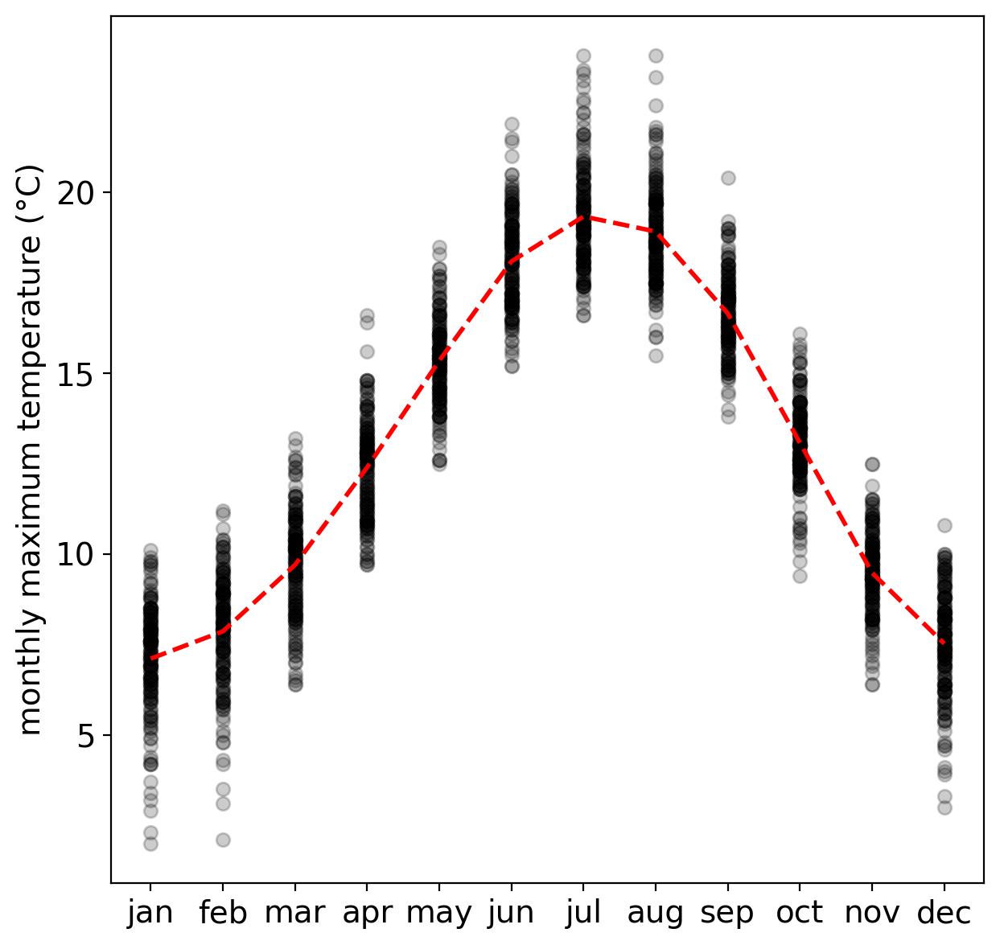

|br| To help mitigate this, we will **Aggregate** the data - that is, average values together (or take their sum) based on
some grouping variable. Because we are interested in looking at changes over a number of years, we'll look at the
annual average.

To proceed, select **Aggregate** from the **Data** menu:

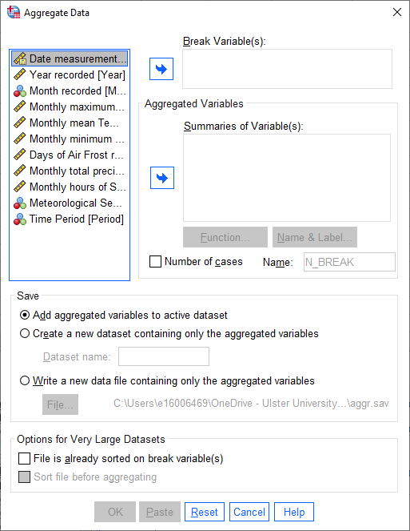

|br| The variable that we want to use for grouping goes in the **Break Variable(s)** field - because we want to aggregate
using the ``Year`` variable, it should go here. The **Aggregated Variables** are all of the variables that we want to
calculate annual averages for. In this practical, we will only look at the monthly mean temperature, but you can add
each of the meteorological variables here, except for ``AirFrost``, in case you are interested in additional practice
later on:

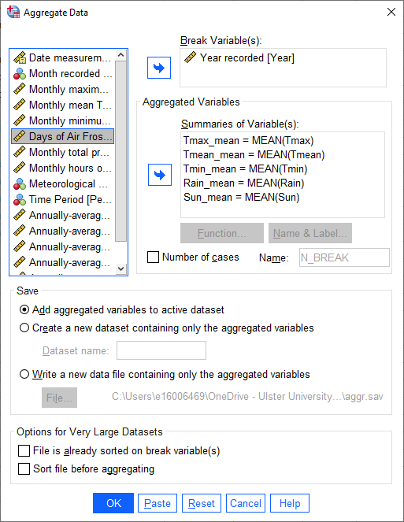

|br| Leave the other choices as they are, then click **OK**. You should see that your new variables are added to the
**Variable View** in the **Data Editor** window. Remember to add **Labels** for the new variables, too, to help you
distinguish these annually-averaged variables from the originals.

As a final step, open the **Select Cases** (**Data** > **Select Cases**) dialog, and choose
**If condition is satisfied**, then click **If** to tell SPSS what condition to use to select cases.

For the remaining steps of the practical, we want to select only cases where ``Period`` is greater than zero.
We also want to select cases from a single month, to ensure that we only have one value per year. To do this,
enter the following formula into the condition field:
::

    (Period > 0) & (Month = 6)

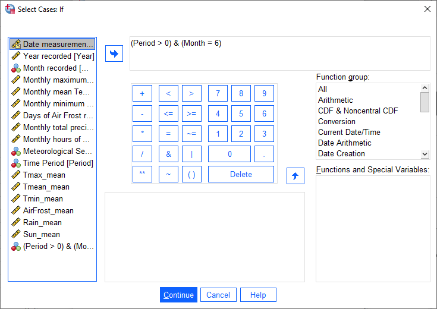

|br| This way, we only consider cases from the three time periods we are interested in studying: 1871-1920, 1921-1970,
and 1971-2020; by selecting only a single month, June, we also ensure that we are dealing with a single value per year.

Click **Continue**, then click **OK** in the **Select Cases** dialog to apply the selection.

.. warning::

    If you skip this step, your analysis and results will end up looking very different from the steps in the practical.

plotting histograms
--------------------

Before we proceed to the hypothesis tests, let's have a look at the histograms of monthly mean temperature, divided
into our three periods.

Open the **Chart Builder** dialog, and set up a histogram plot using ``Tmean_mean`` - if you're not sure of the steps,
have a look back at where we did this :ref:`in week 6 <egm101 histogram>`. Make sure to check the
**Display normal curve** option for the chart.

.. note::

    This should be the *mean* of the ``Tmean`` variable that you calculated in the **Aggregate** step, **NOT** the
    ``Tmean`` variable itself!

Once you have set up the histogram, click on the **Groups/Point ID** tab, then select **Rows panel variable**:

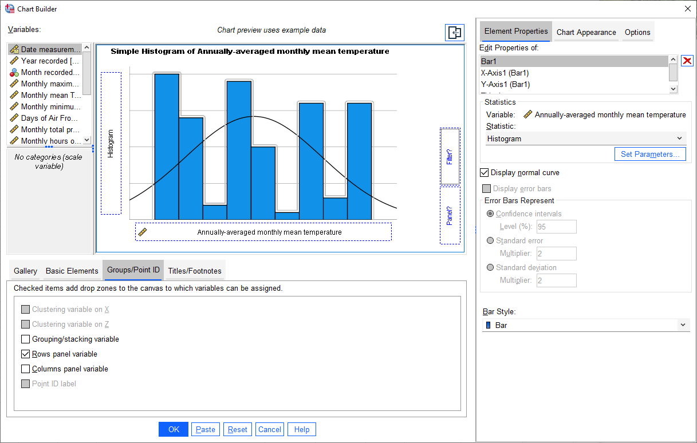

|br| You should notice that in the example plot window, a **Panel?** button appears. Add the ``Period`` variable to
this button, in the same way that you added ``Tmean_mean`` to the **X-Axis?** button. You should see that the example
histogram changes to show three panels:

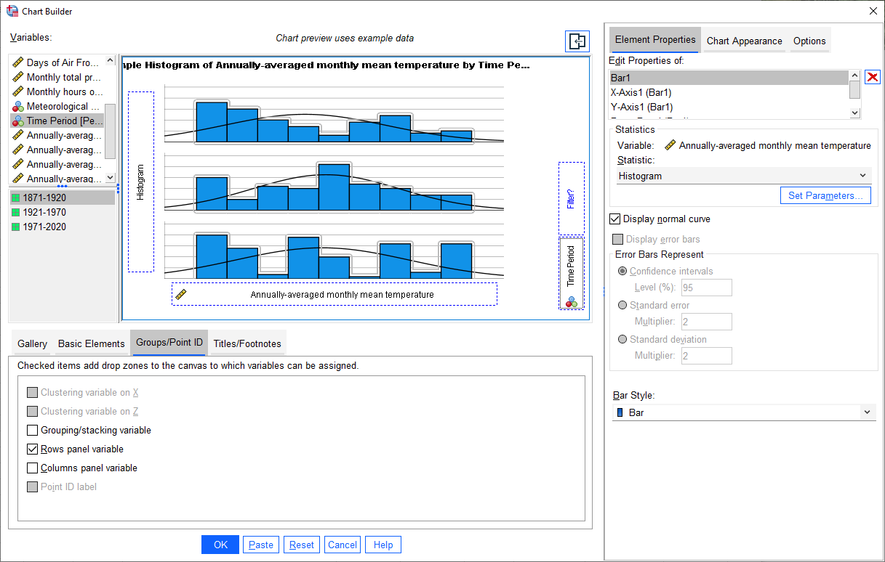

|br| Click **OK**. You should see a three-panel histogram appear in the **Statistics Viewer** window:

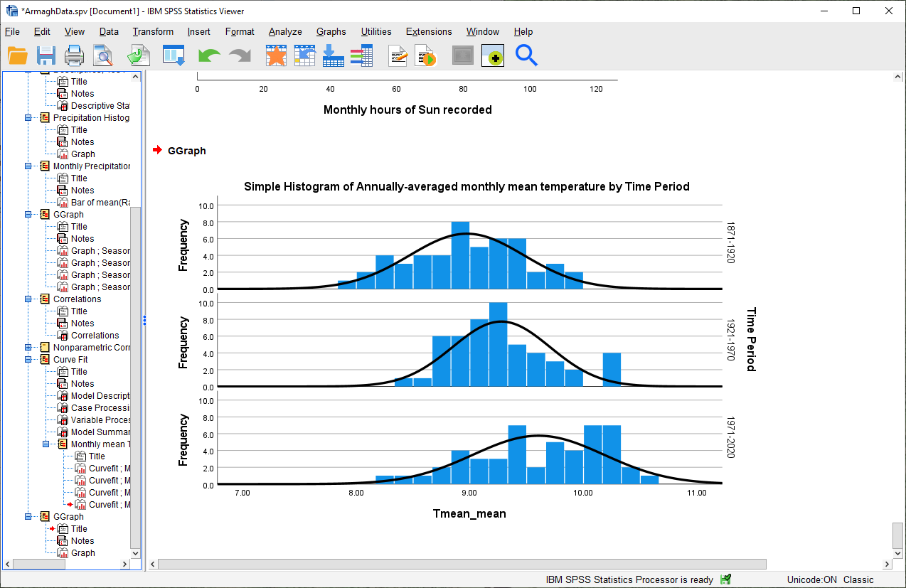

|br|

.. card::
    :class-header: question
    :class-card: question

    :far:`circle-question` Question
    ^^^

    Look at the three histograms. What do you notice about the distribution of the three periods (1871-1920, 1921-1970,
    and 1971-2020)? Pay attention to the position of the peak of the normal curve (the *mean* value), but also the
    width of the peak (the *standard deviation*), as well as whether the data appear to be skewed in a particular
    direction.

    What can you say about the different time periods?

.. tip::

    Remember to save both the **.sav** and **.spv** files before continuing!

one-way anova
--------------

From the plot of the histograms for each time period, it looks like the mean temperature is different in each time
period - not only that, but it is increasing. One-way ANOVA is a technique that can help us determine whether there
are *significant* differences in the means of three or more categories or groups of variables.

.. card::
    :class-header: question
    :class-card: question

    :far:`circle-question` Question
    ^^^

    Why are we using One-way ANOVA to determine whether there are differences between three groups of data, rather
    than conducting multiple tests of two variables?

.. card::
    :class-header: question
    :class-card: question

    :far:`circle-question` Question
    ^^^

    Formulate the null and alternative hypotheses for this test.

To perform a One-way ANOVA test in SPSS, select **One-Way ANOVA** from the **Analyze** menu (**Analyze** >
**Compare Means** > **One-Way ANOVA**):

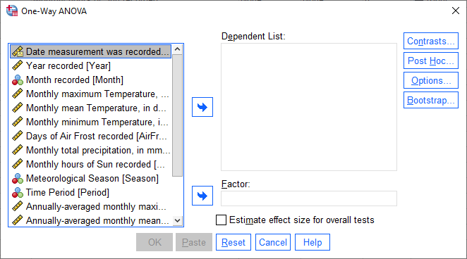

|br| We want to look at the differences in annual mean temperature between the different time periods - so,
``Tmean_mean`` should go in the **Dependent List**, and ``Period`` should go in the **Factor** field:

.. image:: img/week8/oneway_anova2.png
    :width: 500
    :align: center
    :alt: the one-way anova dialog, with the dependent and factor variables selected

|br| Click **OK**. You should see the following table added to the **Statistics Viewer** window:

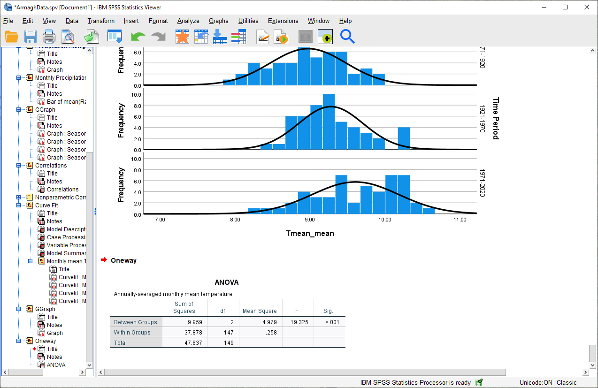

|br| This table tells us the results of the One-way ANOVA test. The first column tells us the **Sum of Squares**
between groups (:math:`SS_{\rm treatment}`) and within groups (:math:`SS_{\rm error}`), as well as the total sum of
squares (:math:`SS_{\rm total}`).

The second column tells us the number of degrees of freedom (**df**), and the third column tells us the **Mean Square**
values between (:math:`MS_{\rm treatment}`) and within (:math:`MS_{\rm error}`) groups, calculated by dividing each
**Sum of Squares** by the corresponding degrees of freedom.

Finally, we can see the *F*-statistic (**F**) and the corresponding *p*-value (**Sig.**), based on the *F*-distribution
calculated using the degrees of freedom in the table.

Using our default significance level of :math:`\alpha = 0.05`, there appears to be a *significant* difference between
at least one pair of groups - that is, they do not all appear to have the same population mean.

.. card::
    :class-header: question
    :class-card: question

    :far:`circle-question` Question
    ^^^

    What is the *formal* way to state the outcome of the test, in terms of the null hypothesis?

Remember that ANOVA only tells us whether there is a difference between at least one pair of groups - it doesn't tell
us what the difference is, or even which groups. For that, we need to do additional tests, called *post hoc* tests.\ [1]_

independent samples *t*-test
------------------------------

To start looking further into this, we will use the independent samples *t*-test to see whether there is a difference
between the earliest time period (1871-1920), and the latest time period (1971-2020).

.. card::
    :class-header: question
    :class-card: question

    :far:`circle-question` Question
    ^^^

    Why are we using the independent samples *t*-test to compare the difference in mean temperature between these
    two time periods, rather than some other test?

checking the equal variances assumption
.........................................

Remember that one of the things we should check is whether or not our samples have "similar enough" variances - if they
do, then we can use the pooled variance form of the independent *t*-test, rather than "Welch's *t*-test". SPSS will
actually do both versions of the test for us, but we should still check whether it's a valid assumption using the
**Descriptive Statistics**.

Before we do that, though, make sure to **Split** the data by period, so that there is a row in the output table for
each time period.

.. warning::

    No, seriously, make sure that you **Split** the data on the ``Period`` variable before continuing.

Open the **Descriptives** dialog (**Analyze** > **Descriptive Statistics** > **Descriptives**), then select *only* the
``Tmean_mean`` variable:

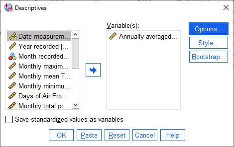

|br| Next, click on **Options** to select which descriptive statistics to calculate:

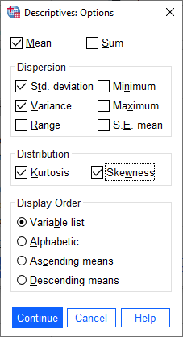

|br| At a minimum, we want to calculate the **Variance**, but calculating the **Kurtosis** and **Skewness** will also
help us figure out whether our data are at least approximately normal or not. Make sure to select *at least these three*
statistics before clicking **Continue** followed by **OK** to calculate the statistics.

You should see the following table added to the **Statistics Viewer** window:

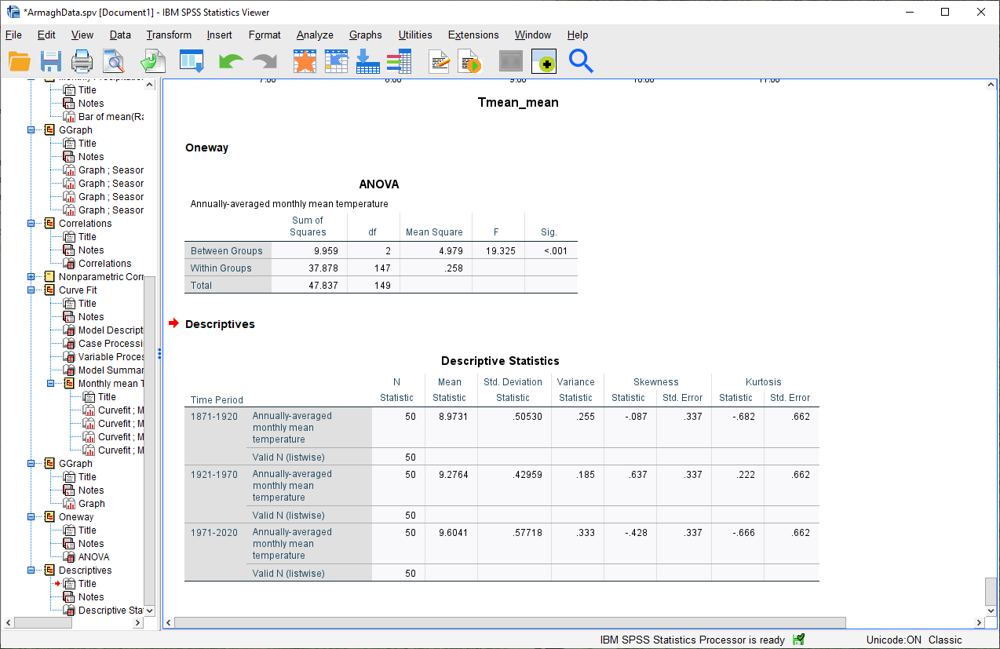

|br| Look at the **Variance** column for the three periods - from this, you should see that the variances are indeed
"similar enough" - that is, if we take the ratio of any two of these, the ratio will be between 2 and 0.5.

checking the normality assumption
...................................

The next thing to check is the assumption of *normality* - that is, that the data are approximately normally
distributed.

.. card::
    :class-header: question
    :class-card: question

    :far:`circle-question` Question
    ^^^

    Look at the **Descriptives** table that you just created - what values of **Kurtosis** and **Skewness** do you see?
    What do these values tell you about how normal each distribution is?

In addition to measures like kurtosis and skewness, we can also use SPSS to create Q-Q plots, which will plot the
distribution of quantiles of our data against the theoretical quantiles that we would expect from a normal distribution
with the same mean and standard deviation.

To create these plots in SPSS, open the **Q-Q Plots** dialog (**Analyze** > **Descriptive Statistics** > **Q-Q Plots**).
In the dialog that opens, add the ``Tmean_mean`` variable to the **Variables** field, and leave the other options as-is:

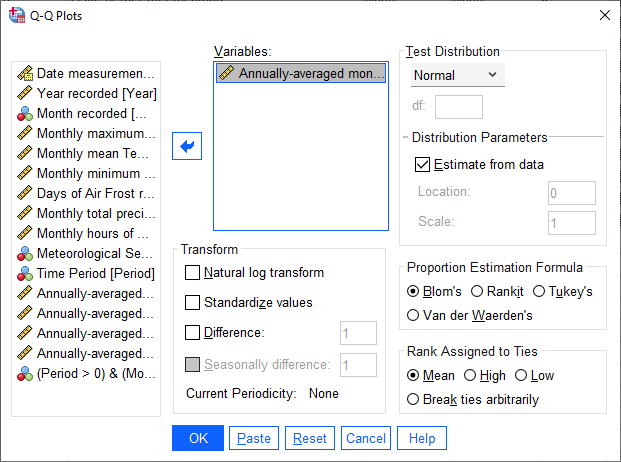

|br| You should see a series of plots added to the **Statistics Viewer** window, two for each period:

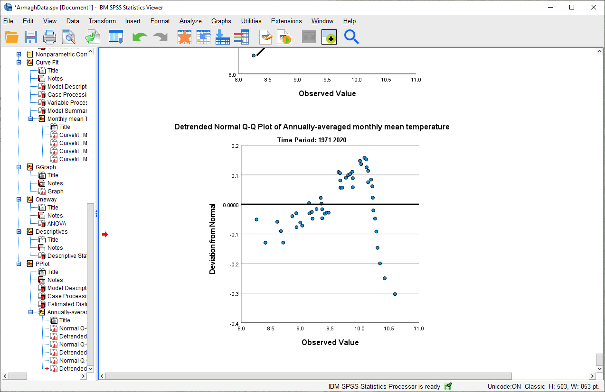

|br| In addition to plotting the Q-Q plot, SPSS also plots the *de-trended* Q-Q plot, which shows the difference
between the points in the Q-Q plot from the black line:

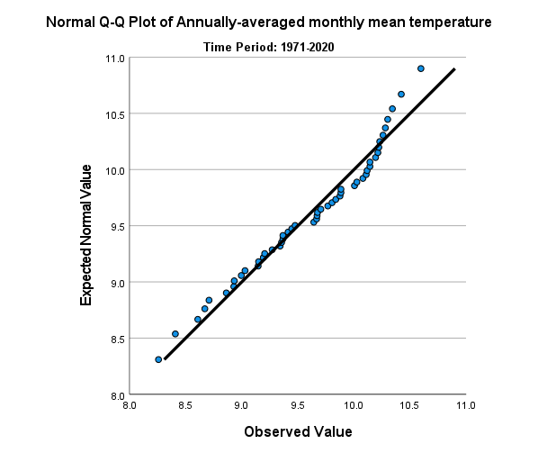
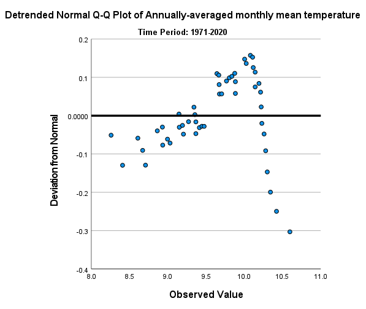

From both of these, we can see that the 1971-2020 deviates from the normal distribution by quite a bit. More importantly,
though, we see a *systematic* deviation: there is a clear pattern in the plot on the left, indicating that we do not
have random differences.

In Week 6, we discussed what this means in the context of linear regression, but it means
something similar here - when we see systematic differences in the de-trended Q-Q plot, it indicates that the data are
not normally distributed.

.. card::
    :class-header: question
    :class-card: question

    :far:`circle-question` Question
    ^^^

    Have a look at the plots for the other time periods - what do you notice? Are there any time periods that appear to
    have random differences?

.. card::
    :class-header: question
    :class-card: question

    :far:`circle-question` Question
    ^^^

    Even though we have determined that (at least one) of the time periods isn't particularly normally distributed,
    why can we still justify using Student's *t*-test to compare the difference in sample means?

the *t*-test
..............

.. warning::

    Before proceeding, make sure that you turn off the **Split** for the file by choosing
    **Analyze all cases, do not create groups** in the **Split File** dialog.

To perform the independent samples *t*-test, open the **Independent-Samples T Test** dialog (**Analyze** >
**Compare Means** > **Independent-Samples T Test**). Add ``Tmean_mean`` as the **Test Variable**, and ``Period`` as
the **Grouping Variable**, and uncheck **Estimate effect sizes**.

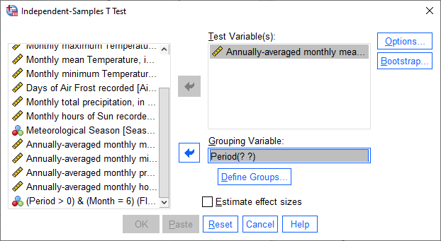

|br| Next, click on **Define Groups** to choose which two groups to test, and enter 1 and 3 to test the data from
1871-1920 against the data from 1971-2020:

|br| Click **Continue** - you should see the entry in the **Grouping Variable** change:

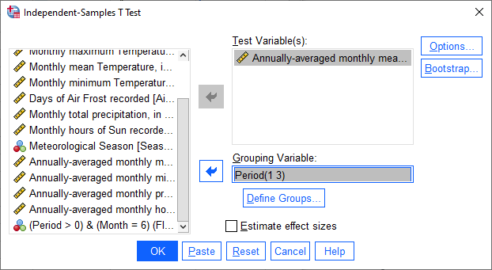

|br| Click **OK** to run the test. You should see two tables added to the **Statistics Viewer** window: one provides
the same information that we saw with the **Descriptive Statistics** step: the mean, standard deviation, and standard
error of the mean:

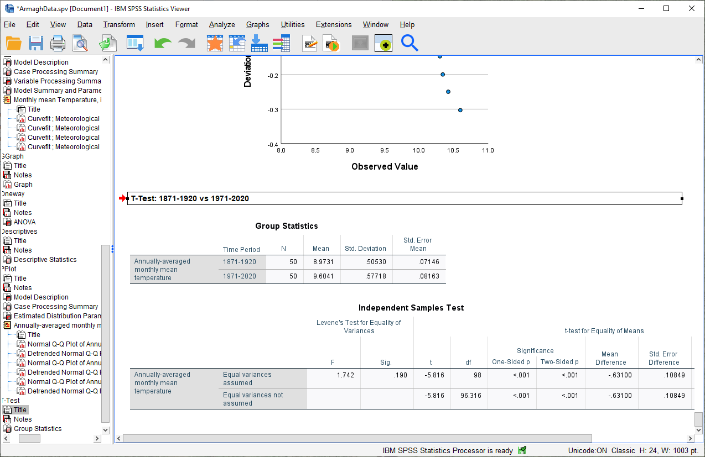

|br| The second table provides information about the test, with one row where with the test is performed assuming
that the variances of the two populations are equal, and the second where the test is performed without this
assumption.

The first two columns, **F** and **Sig.**, are the results of a statistical test for equality of variance
(`Levene's Test for equality of variances <https://www.statisticshowto.com/levene-test/>`__), providing the
*F*-statistic and *p*-value for the test. From this, we can see that there is not sufficient evidence to conclude that
the variances between the groups are different - since we checked this assumption already, it shouldn't be too
surprising.

The remaining columns give us the results of the test:

- **t** is the value of the *t*-statistic for both versions of the test;
- **df** is the number of degrees of freedom;
- **One-sided p** and **Two-sided p** give the *p*-value for the one-sided and two-sided versions of the test, respectively;
- **Mean Difference** gives the estimate of the difference between the mean values of the two groups;
- **Std. Error Difference** gives the estimate of the standard error of the difference between the mean values;
- **Lower** and **Higher** give the lower and upper bounds of the 95% confidence interval of the estimate of the difference.

From this table, we can see that at the :math:`\alpha = 0.05` level of significance, there is a significant difference
between the mean values of the annually averaged values of the monthly mean temperature between 1871-1920 and 1971-2020.

The estimate of the difference, at least in the table shown above, is -0.631°C, meaning that 1971-2020 was 0.631°C
warmer than 1871-1920 (the difference is calculated by subtracting the estimate of the second group from the estimate
of the first group).

.. card::
    :class-header: question
    :class-card: question

    :far:`circle-question` Question
    ^^^

    Formulate the null and alternative hypotheses for this test, and formally state the result of the test.

.. card::
    :class-header: question
    :class-card: question

    :far:`circle-question` Question
    ^^^

    Using the estimates of the difference of the means and the standard error of the difference, write the 95%
    confidence interval as :math:`\Delta_\mu\pm\sigma`, where :math:`\Delta_\mu` is the estimate of the difference
    between the means, and :math:`\sigma` is the multiple of the standard error of the difference used for the 95%
    confidence interval.

.. tip::

    Remember to save both the **.sav** and **.spv** files before continuing!

mann-whitney u-test
--------------------

The final test we will look at in this practical is the Mann-Whitney *U*-test, a non-parametric statistical test.

.. card::
    :class-header: question
    :class-card: question

    :far:`circle-question` Question
    ^^^

    Why are we using the Mann-Whitney *U*-test, instead of one of the other non-parametric tests introduced in the
    lectures?

As we covered in this week's lectures, unlike the independent samples *t*-test, the Mann-Whitney *U*-test and other
non-parametric tests do not require that our data follow a particular distribution. For this example, we will compare
the result of the Mann-Whitney *U*-test to the independent samples *t*-test, to see if there are any differences.

Before running the test, we want to select **only** two groups of our ``Period`` variable. Open **Select Cases**, then
click on **If** to change the selection criteria we use. In the computation field, add the following expression:
::

    (Month = 6) & ((Period = 1) | (Period = 3))

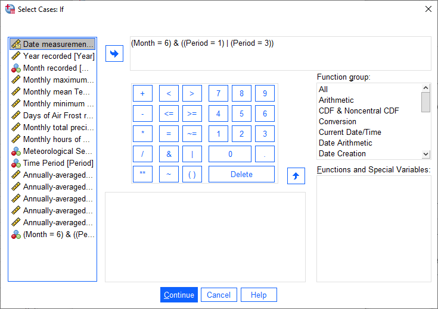

|br| The ``|`` (**OR**) symbol tells SPSS to select cases where *either* ``Period`` equals 1 **or** ``Period`` equals 3.
Click **Continue**, followed by **OK**. In the **Data Editor** window, you should see only cases where ``Month`` equals
6, and ``Period`` equals either 1 or 3.

.. note::

    If you skip this step, the test will still run, but your outputs will look different because the test will perform
    multiple comparisons.

First, open the **Nonparametric Tests: Two or More Independent Samples** dialog (**Analyze** > **Nonparametric Tests**
> **Independent Samples**):

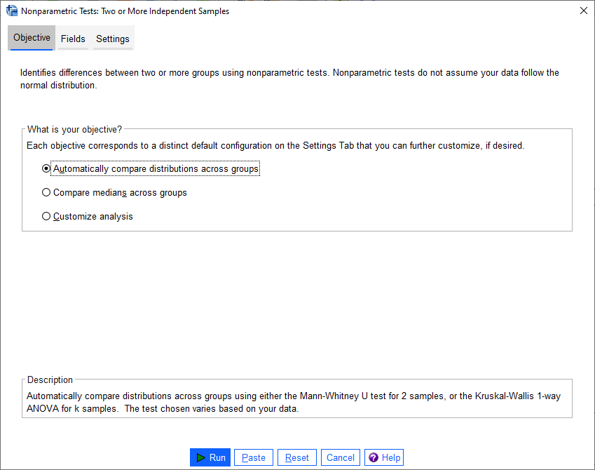

|br| We're going to run a custom analysis, so select **Customize analysis**, and then click on the **Fields** tab:

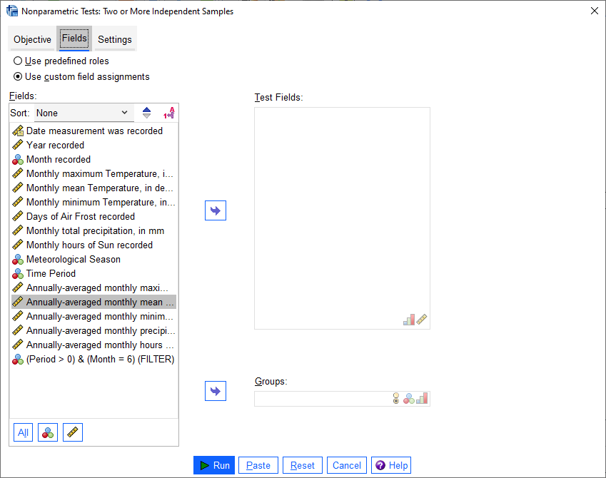

|br| Just like with the independent samples *t*-test, add the ``Tmean_mean`` variable to the **Test Fields** field,
and select the ``Period`` variable for the **Groups**:

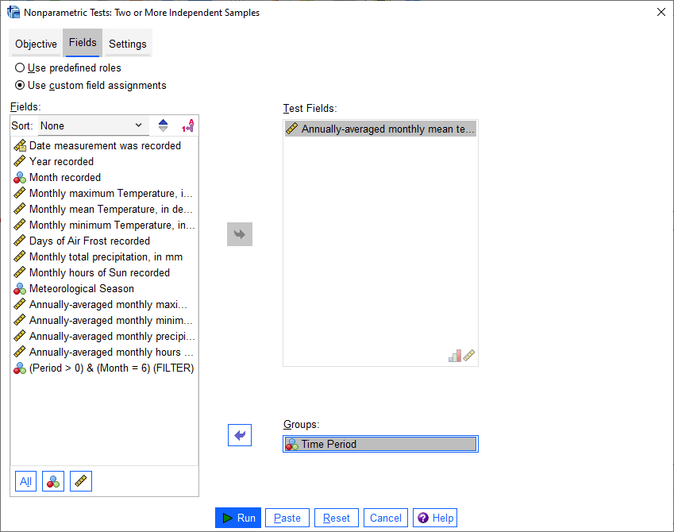

|br| Click on the **Settings** tab, select the **Mann-Whitney U (2 samples)**, and de-select
**Median test (k samples)**:

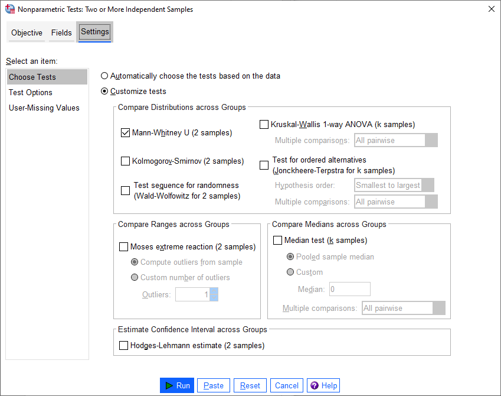

|br| Click **Run** to run the test. You will see quite a bit more output from this test:

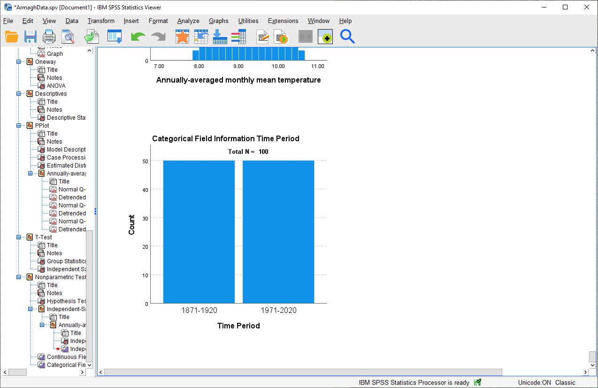

|br| The results of the test are shown in this table:

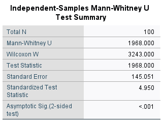

|br| This table tells us the number of samples, the values of the *U* and *W* test statistics, the
**standardized test statistic** (i.e., the z-score of the test statistic using the normal assumption), and the *p*-value
for the two-sided test.

From this table, we can see that the *p*-value of the standardized test statistic is < 0.001, indicating that at the
:math:`\alpha = 0.05` significance level, there is enough evidence to reject the null hypothesis.

The "`population pyramid <https://en.wikipedia.org/wiki/Population_pyramid>`__" shows the histograms of the monthly
mean temperature for the two time periods, with the temperature value plotted on the vertical axis, and the
frequency plotted along the horizontal axes:

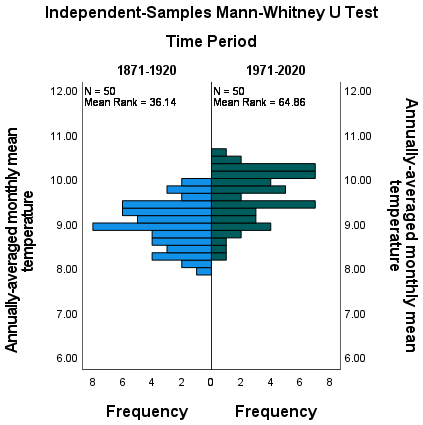

|br| On the plot, we can also see the mean rank for the two distributions: the 1871-1920 period has a mean rank of
36.14, while the 1971-2020 period has a mean rank of 64.86. This indicates, as we can also see from the histogram,
that most of the smaller values are contained in the 1871-1920 period, and the larger values are contained in the
1971-2020 period. In other words, the median value of the second time period is larger than the first.

.. card::
    :class-header: question
    :class-card: question

    :far:`circle-question` Question
    ^^^

    Formulate the null and alternative hypotheses for this test, and formally state the result of the test.

.. warning::

    If you are working on a lab computer, make sure that you upload the **.sav** and **.spv** files to OneDrive
    **BEFORE** leaving the computer lab.

    If you do not, you will lose your work, and you will need to re-complete the steps of this practical to be able to
    answer the questions on the assessment!

next steps
-----------

This is the end of the Quantitative Skills portion of EGM101. Once you have completed each of the practicals, you
should be ready to complete the assessment questions posted on Blackboard.

If you are looking for additional practice, try the following suggestions:

- Instead of looking at the differences between 1871-1920 and 1971-2020, look at the differences between 1921-1970 and
  1971-2020.

.. card::
    :class-header: question
    :class-card: question

    :far:`circle-question` Question
    ^^^

    How do the results of this independent samples *t*-test compare to the results for 1871-1920 and 1971-2020?

- Change the **Select Cases** condition from ``(Month = 6) & ((Period = 1) | (Period = 3))`` back to
  ``(Month = 6) & (Period > 0)``. Next, run the non-parametric **Independent Samples** test, but instead of the
  **Mann-Whitney U** test, select the **Median test (k samples)** option.

.. card::
    :class-header: question
    :class-card: question

    :far:`circle-question` Question
    ^^^

    How do the results of these tests compare to the Mann-Whitney *U*-test and the independent samples *t*-tests that
    you have run? Are you able to make the same conclusions about the differences between the groups?

notes
------

.. [1] In what follows, we'll select a single pair of periods to compare. To correctly compare the means of more than
    two groups, however, we need to adjust the *p*-value to account for the fact that we're doing multiple comparisons.
    One way to do this is using the **Post Hoc** button on the right-hand side of the dialog - in
    `this dialog <https://www.ibm.com/docs/en/spss-statistics/saas?topic=anova-one-way-post-hoc-tests>`__, you can
    select the different tests to use to account for multiple comparisons.

