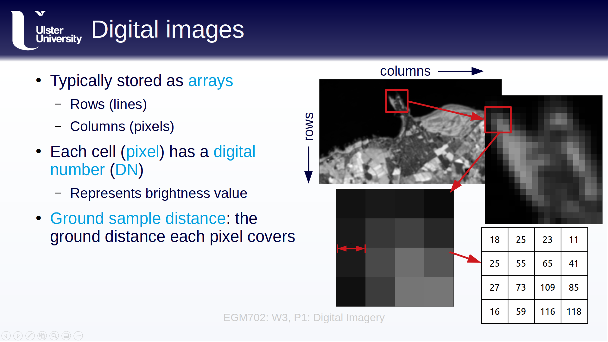

lectures
=========

Here, you will find links to YouTube playlists of the lectures for each week, as well as transcripts and the slides in pdf format.

Week 1: Photogrammetry
----------------------

video playlist
^^^^^^^^^^^^^^^^^^

.. image:: ../../img/egm702/week1/week1.png
    :width: 600
    :align: center
    :target: https://www.youtube.com/watch?v=WneDAoe9q0g&list=PLswTWqhRygXvaFSLGwoyJbTu-vCOq2Eob&index=1
    :alt: a slide explaining where photogrammetry is applied

..
    transcripts
    ^^^^^^^^^^^
    :download:`Week 1 Transcripts <../../files/EGM702_Week1_Transcripts.zip>`

slides
^^^^^^
:download:`Week 1 Slides <../../files/EGM702_Week1.zip>`

Week 2: DEM and terrain analysis
--------------------------------

video playlist
^^^^^^^^^^^^^^^^^^

.. image:: ../../img/egm702/week2/week2.png
    :width: 600
    :align: center
    :target: https://www.youtube.com/watch?v=OZuF_LbYwp0&list=PLswTWqhRygXshYE_3WxLb1SiAuuodhjTA&index=1
    :alt: a slide explaining the difference between accuracy and precision

..
    transcripts
    ^^^^^^^^^^^
    :download:`Week 2 Transcripts <../../files/EGM702_Week2_Transcripts.zip>`

slides
^^^^^^
:download:`Week 2 Slides <../../files/EGM702_Week2.zip>`

Week 3: Image manipulation and analysis
---------------------------------------

video playlist
^^^^^^^^^^^^^^^^^^

..
    transcripts
    ^^^^^^^^^^^
    :download:`Week 3 Transcripts <../../files/EGM702_Week3_Transcripts.zip>`

slides
^^^^^^
:download:`Week 3 Slides <../../files/EGM702_Week3.zip>`

Week 4: Change detection
------------------------

video playlist
^^^^^^^^^^^^^^^^^^

.. image:: ../../img/egm702/week4/week4.png
    :width: 600
    :align: center
    :target: https://www.youtube.com/watch?v=5ENdo-PtxkI&list=PLswTWqhRygXuiCG5-fs0C4jS9Z8uyNVd-&index=1
    :alt: a slide explaining how with multiple images over time, we can map change

..
    transcripts
    ^^^^^^^^^^^
    :download:`Week 4 Transcripts <../../files/EGM702_Week4_Transcripts.zip>`

slides
^^^^^^
:download:`Week 4 Slides <../../files/EGM702_Week4.zip>`

Week 5: Advanced classification techniques
-------------------------------------------

video playlist
^^^^^^^^^^^^^^^^^^

.. image:: ../../img/egm702/week5/week5.png
    :width: 600
    :align: center
    :target: https://www.youtube.com/watch?v=r3O4laOHhO0&list=PLswTWqhRygXs3oc4rxPKNGvjnYxrDRtrP&index=1
    :alt: a slide explaining unsupervised classification, including different algorithms

..
    transcripts
    ^^^^^^^^^^^
    :download:`Week 5 Transcripts <../../files/EGM702_Week5_Transcripts.zip>`

slides
^^^^^^
:download:`Week 5 Slides <../../files/EGM702_Week5.zip>`

