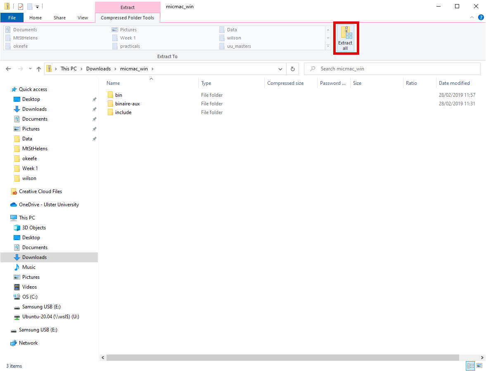
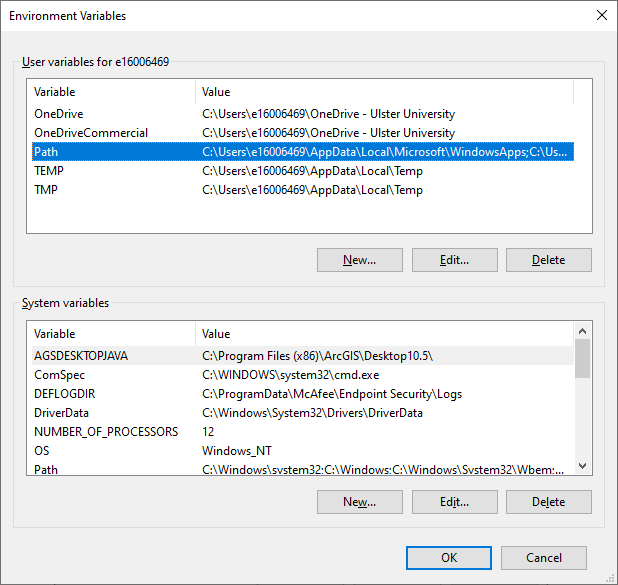
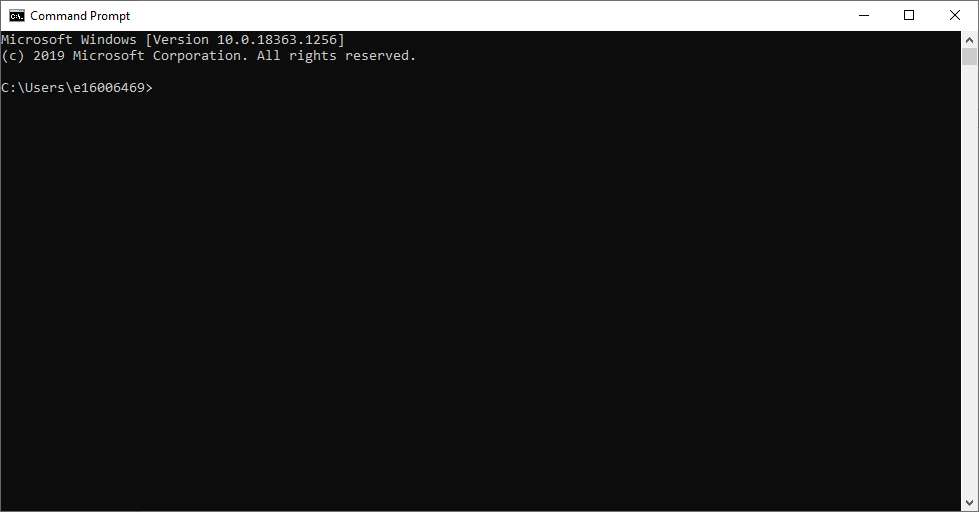

software setup
==============

For Practical 1, we’ll be using an open-source photogrammetry software package, `MicMac <https://>`__. If you would
like to visualise the point clouds, you can also install the free software packages MeshLab or CloudCompare. All of
these software packages are available on multiple platforms (Windows, Mac OS, linux), though the installation for
Mac OS and linux may be somewhat more involved.

This tutorial will guide you through the steps for installation on Windows, but if you would like to try to install
these programs on Mac OS or linux, I am happy to help guide you through the process. As these are open-source software,
there is no license to purchase – you can download and install them on as many computers as you like, as many times as
you like.

micmac
------

.. note::

    Please note – these instructions will show examples from Windows 10, but the procedure will be essentially the same
    for other versions (excluding Windows XP).

To start, go to `<https://github.com/micmacIGN/micmac/releases/tag/MMASTER_v1.1>`__. This version of MicMac is the most
recent complete build for Windows (and Mac OS), and it is the one that we will be using for Practical 1. Download
``micmac_win.zip``, which is the Windows build.

.. warning::

    The developers recommend installing MicMac in a directory where the path does not have spaces or special characters,
    as this can sometimes cause errors.

    Be sure to check **THE ENTIRE FILE PATH** of the folder you are copying the contents of the ``.zip`` file to - if
    there are spaces **anywhere** in the path, some of the commands may not work.

For simplicity, we will extract the contents of the file to ``C:\MicMac\``.

To do this, double-click on ``micmac_win.zip``, then select **Extract all**:

This will open the following window:

.. image:: ../../../img/egm702/install/zip_dialogue.png
    :width: 600
    :align: center
    :alt: the extraction dialogue for the zipped folder

Click **Browse**, then navigate to ``C:\`` and create a new folder, ``MicMac``. Click **Extract** to extract the files.

adding micmac to the path
...........................

When this has finished, you need to add ``C:\MicMac\bin`` to your Windows path. In the **Search bar** at the bottom of
the screen, type "environment" and select **Edit environment variables for your account**:

.. image:: ../../../img/egm702/install/environment.png
    :width: 600
    :align: center
    :alt: the search for "environment" with "edit environment variables for your account" highlighted.

|br| Select **Path**, then **Edit**:

|br| Finally, select **New** and type in ``C:\MicMac\bin``, then click **OK** in each of the windows you’ve opened:

.. image:: ../../../img/egm702/install/close1.png
    :width: 48%
    :alt: the edit environment variable panel with "new" highlighted

.. image:: ../../../img/egm702/install/close2.png
    :width: 48%
    :alt: the edit environment variable panel with the new path variable

|br| Next, open the **Command Prompt** by typing "command prompt" in the **Search bar**. You may also want to **pin**
this to your **taskbar** (right-click on the icon and select **Pin to taskbar**), at least for the first practical.

You should see this window:

|br| At the command prompt, type ``mm3d`` and hit **enter**. You should see something like this (you may have to
scroll up to see it):

.. image:: ../../../img/egm702/install/success.png
    :width: 600
    :align: center
    :alt: the output of mm3d from the command prompt

|br| If this is not what you see, please take a screenshot of the following:

- any error messages that you encounter
- the contents of your **PATH** variable in the **edit dialogue**
- the location where you have extracted the contents of ``micmac_win.zip``.

Send these along to the instructor or post them in the Discussion Board.

meshlab
-------

To install MeshLab in order to visualize point clouds during Practical 1, you can go here:
`<https://www.meshlab.net/#download>`__.

From there, you can download the binary for the operating system of your choice (e.g., **win64** for a Windows 64-bit
operating system) and follow the instructions for the installer.

cloudcompare
------------

To install CloudCompare to visualize point clouds during the Week 1 practical, you can go here:
`<https://www.danielgm.net/cc/>`__.

From there, you can click the **Download** tab and select the version for your operating system.

If all you're going to be doing is visualizing point clouds, you can also download **ccViewer**, rather than
CloudCompare, from the same link.
