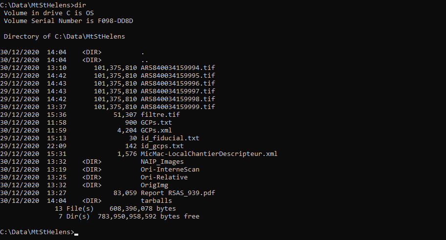
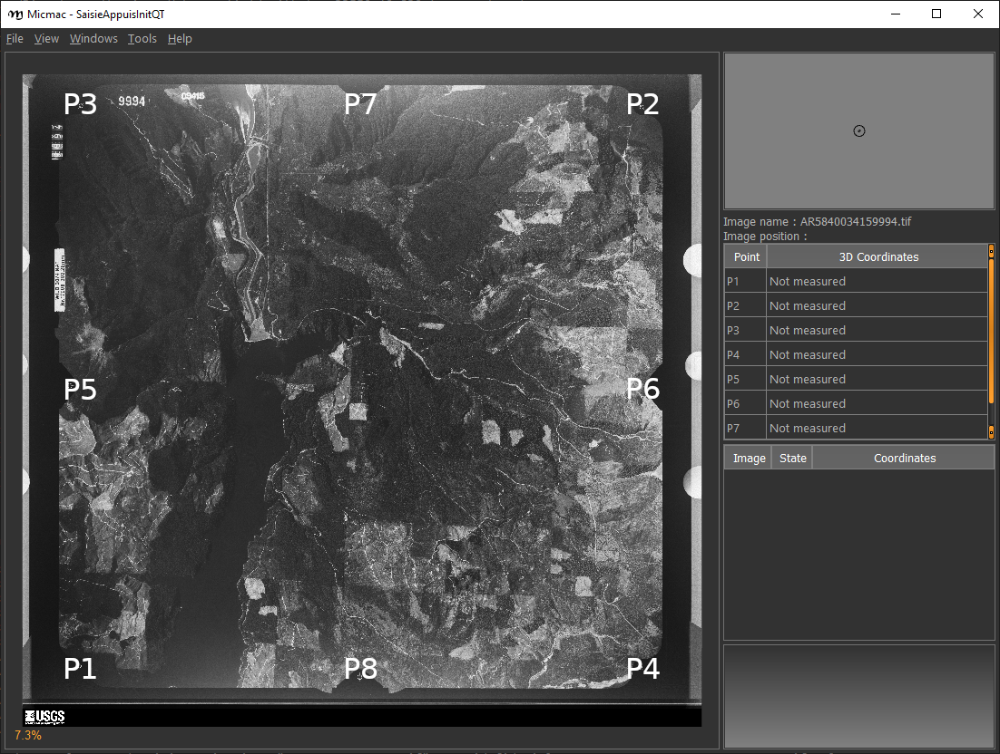
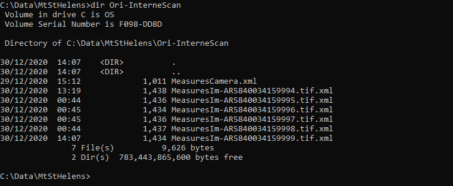
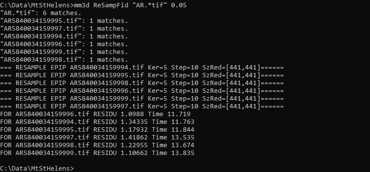
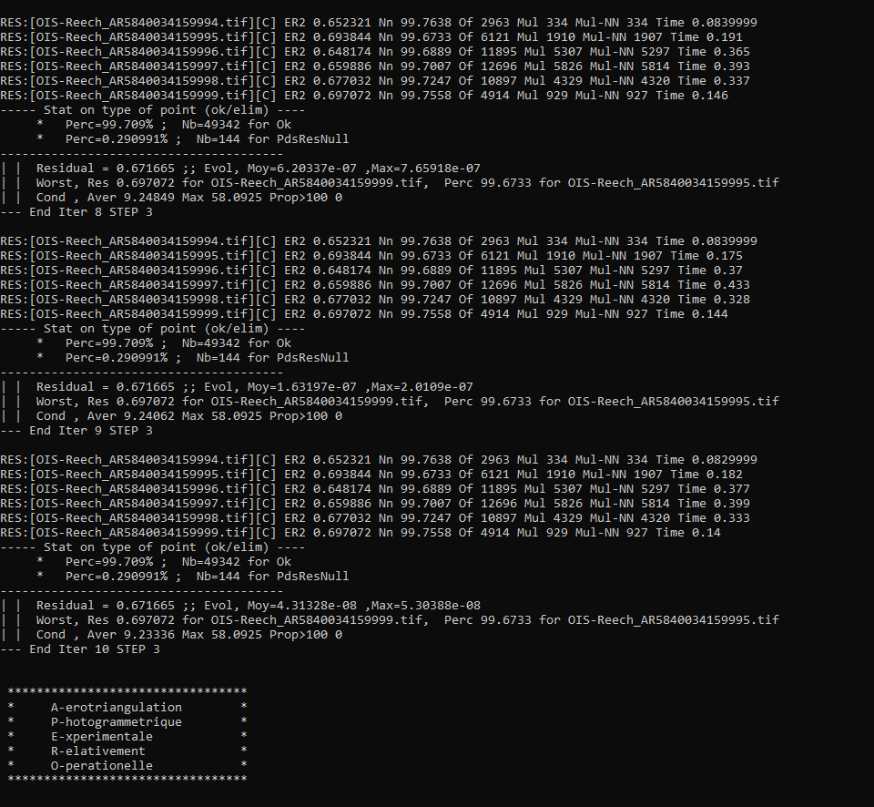
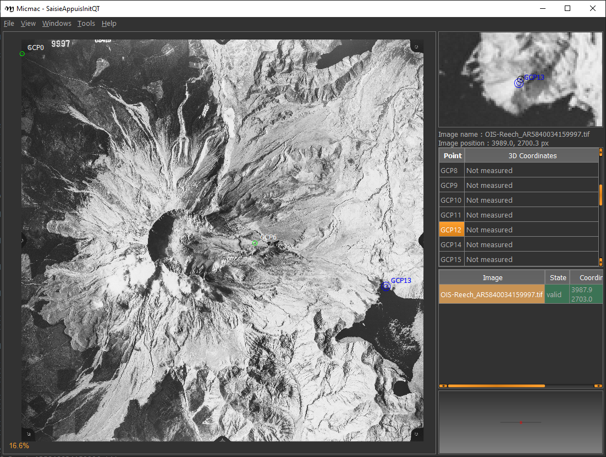
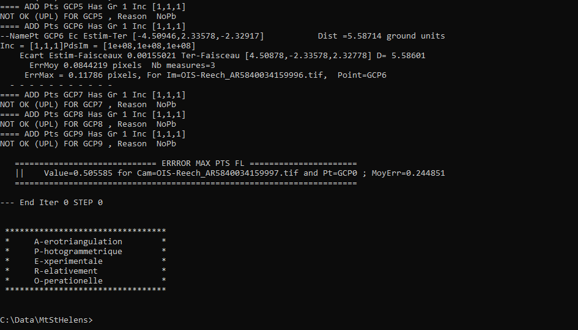
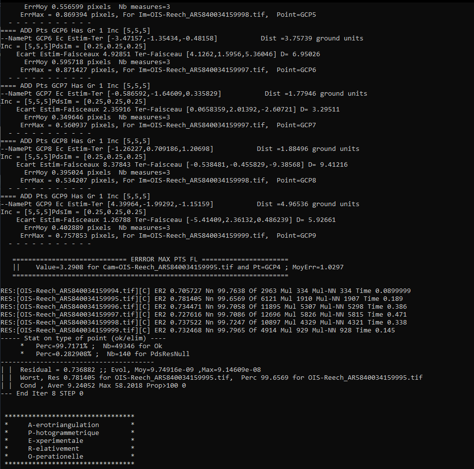
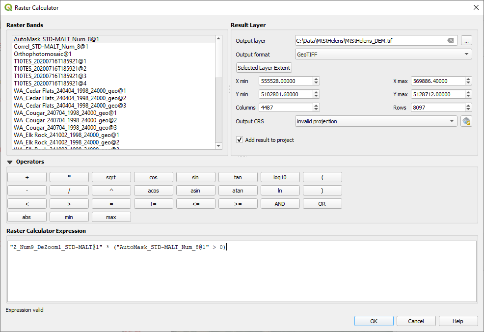

dem processing using micmac
====================================

.. note::

    Be sure to download all the data from the Practical 1 area on Blackboard before starting, or from the
    `google drive link <https://drive.google.com/uc?id=1rwu32Wms_jvrmzkMRckD8kwcgl98qn4k&export=download>`__,
    then extract the ``.zip`` file.

You should have the following files/folders available in the extracted ``.zip`` file:

.. code-block:: text

    ├─ AR5840034159994.tif
    ├─ AR5840034159995.tif
    ├─ AR5840034159996.tif
    ├─ AR5840034159997.tif
    ├─ AR5840034159998.tif
    ├─ AR5840034159999.tif
    ├─ CPs.txt
    ├─ filtre.tif
    ├─ id_fiducial.txt
    ├─ id_gcps.txt
    ├─ GCPs.txt
    ├─ MeasuresCPs.xml
    ├─ MicMac-LocalChantierDescripteur.xml
    ├─ NAIP_Images/
    └─ Ori-InterneScan/
        └─ MeasuresCamera.xml

In this practical, we're going to work on processing a digital elevation model (DEM) and orthophotos using a collection
of aerial photos acquired in 1984 over Mt St Helens, a volcano in Washington state, USA.

During the 1980s and early 1990s, the volcano erupted several times, including an eruption in May 1980 that collapsed
the entire north face of the mountain.

.. note::
    The instructions/images below assume that you are using MicMac in a Windows environment; the commands will be the
    same for a MacOS/Linux environment, but you'll need to open a terminal rather than the Windows command prompt.

getting started
---------------

To get started, open the Windows command prompt, either by using the search bar, or **Start** > **Windows System** >
**Command Prompt**.

To change folders from the command line, you will use the ``cd`` command. When you open the command prompt, you should
be in your **home** folder (for me, this is **C:\\Users\\bob**).

At the command prompt, navigate to the folder where you have saved the data above (for me, this is
**C:\\Data\\MtStHelens**) by typing ``cd`` followed by the directory name
(**note the space between the command and the directory**):

.. code-block:: text

    C:\Users\bob>cd "C:\Data\MtStHelens\"

.. note::
    In the line above, ``C:\Users\bob`` is the current directory, and ``>`` is the command prompt - if you want to
    copy/paste the above command, be sure to copy the text *after* the ``>`` (i.e., ``cd C:\Data\MtStHelens``).

    For the remaining commands, I will omit the command prompt and only write the command that you will need to use.

.. note::
    If you have saved your data to another drive (e.g., ``D:``), you will first need to change to the correct drive,
    **before** you try to change directories. So, if your data are saved to ``D:\EGM702\Data``, you will need to first
    change drives by entering **just** the drive name followed by a colon:

    .. code-block:: text

        > D:
        > cd EGM702\Data

    in order to change to the correct directory. Note that you'll need to do this each time you open the command
    prompt - the default starting disk is ``C:``.

To see the contents of the directory, use the ``dir`` command. You should see something similar to the picture below:

|br| We're going to run each of the processing steps in MicMac using the command line interface. If you are curious
about what a particular command or input parameter does, you can always type ``-help`` after the command, and
information about how to use the command will be printed to the screen.

For example, for the first command we will use, you can type the following at the command prompt:

.. code-block:: text

    mm3d SaisieAppuisInitQt -help

This will open the following window:

.. image:: ../../../img/egm702/week1/saisie_help.png
    :width: 400
    :align: center
    :alt: the saisieappuis help window, detailing the arguments for the command

.. note::
    In a MacOS/linux environment, the help message may just display to the terminal window, rather than opening a
    popup window.

The help text shows you the arguments that you have to use to run the command, as well as optional named arguments and
their meanings. For other commands, such as ``Malt``, the text will print directly to the command window.

resampling the images
---------------------

The first pre-processing step is *geometric* pre-processing, or making sure that the images are re-sampled to a
consistent geometry. This helps us with the camera model calibration, as it (hopefully) ensures that the images are
as close to the actual camera geometry as possible. To do this, we will use the fiducial markers locations in each
image, along with the specified location of each marker from the calibration report for these images, to transform the
scanned images to a common shape.

First, though, we need to identify the locations of the fiducial markers in each image. To do this in MicMac, we use
the ``SaisieAppuisInitQT`` command.

We'll start with the first image, **AR5840034159994.tif**. To begin, type the following (or copy & paste) at the
command prompt (note the lack of space in **MeasuresIm-AR5840034159994.tif.xml**). You may also have to re-type the
quotation marks, as the command prompt may not recognize them:

.. code-block:: text

    mm3d SaisieAppuisInitQT "AR5840034159994.tif" NONE id_fiducial.txt MeasuresIm-AR5840034159994.tif.xml

This will open the window shown below:

|br| You'll need to set the locations of each of the fiducial marks in the image (there are 8 in total). They are
numbered as you can see in the image above, with **P1** located in the lower left corner of the image.

You can pan around the viewer by pressing the center wheel on your mouse, or zoom in/out using the scroll wheel on
your mouse.

Zoom in on the **P1** mark, then click on **P1** in the table on the right side of the frame, and finally click on the
dot in the center of the fiducial mark:

.. image:: ../../../img/egm702/week1/fiducial.png
    :width: 200
    :align: center
    :alt: a fiducial marker

|br| You want to get as close to the middle of the dot as possible. Once you have done this for **P1**, repeat this
process for each of the other markers, **P2** through **P8**.

You might notice that this isn't easy for **P6**, which is partly obscured - just do the best that you can. When you
have finished inputting all of the points, select **File** > **Exit** to close the window and save the point locations
to a file.

To input the points for the next image (**AR5840034159995.tif**), you'll need to change **both** the input filename and
the output filename in the command:

.. code-block:: text

    mm3d SaisieAppuisInitQT "AR5840034159995.tif" NONE id_fiducial.txt MeasuresIm-AR5840034159995.tif.xml

Once you have finished the process for **AR5840034159995.tif**, repeat this for the remaining images in the directory.

When you have finished, use the ``dir`` command (or open the folder in **Windows Explorer**).

You should notice that MicMac has created two **MeasuresIm** files for each image:

- one with an extension **-S2D.xml**,
- one with an extension **-S3D.xml**.

You'll need to move each of the **S2D.xml** files:

- MeasuresIm-AR5840034159994.tif-S2D.xml
- MeasuresIm-AR5840034159995.tif-S2D.xml
- MeasuresIm-AR5840034159996.tif-S2D.xml
- MeasuresIm-AR5840034159997.tif-S2D.xml
- MeasuresIm-AR5840034159998.tif-S2D.xml
- MeasuresIm-AR5840034159999.tif-S2D.xml

into the **Ori-InterneScan** directory, being sure to remove the **-S2D** from each name. The contents of
**Ori-InterneScan/** should now look like this:

|br| At this point, you can delete the **S3D** files – the program creates them, but we don't actually need them.

.. warning::

    If you do not make sure to move and re-name the files as shown above, the next step will fail!

The next step is to re-sample the images using the fiducial marks you have identified, so that each image has the same
geometry:

.. code-block:: text

    mm3d ReSampFid "AR.*tif" 0.05

This will re-sample each of the images to a resolution of 50 microns (i.e., 1 pixel = 0.05 mm).

If you're worried about space on your disk, you can re-sample to 100 microns if need be (change 0.05 to 0.1 in the
command above). Note that this will lower the final resolution of your DEM and orthophoto, though, from about 4 meters
to 8 meters.

If the command runs correctly, you should see the names of each image printed out, along with the residuals (in # of
pixels) and the amount of time it took to re-sample each image:

|br| As long as the residuals are small (<2 pixels or so), you can continue. If your residuals are larger than this,
you'll need to adjust your fiducial mark selection, and run ``ReSampFid`` again.

When you have successfully re-sampled the images, create a new directory called **OrigImg** and move the original
image files into it:

.. code-block:: text

    mkdir OrigImg
    move AR*.tif OrigImg

Note that the wildcard, or asterisk (``*``), symbol tells the computer to move anything that matches the pattern
``AR(something).tif`` into the directory **OrigImg** – so it should move all of the scanned images.

.. note::

    When running ``ReSampFid``, you might get an error message like this:

    .. code-block:: text

        #####  Name-TAG = MesureAppuiFlottant1Im Nb= 2
        ------------------------------------------------------------
        |   Sorry, the following FATAL ERROR happened
        |
        |    cElXMLTree::GetUnique
        |
        --------------------------------------------------------

    This indicates that you have defined the image points for an image in more than one file, and it most often happens
    when you accidentally re-use the output filename for multiple ``SaisieAppuisInitQT`` commands, e.g.:

    .. code-block:: text

        mm3d SaisieAppuisInitQT "AR5840034159994.tif" NONE id_fiducial.txt MeasuresIm-AR5840034159994.tif.xml
        mm3d SaisieAppuisInitQT "AR5840034159995.tif" NONE id_fiducial.txt MeasuresIm-AR5840034159994.tif.xml

    To fix this, you'll need to go through each MeasuresIm file and ensure that there is only one set of ``<NameIm>``
    tags, and that the image named within the tag matches the MeasuresIm filename. For example, check that you only have

    - ``<NamePt>AR5840034159994.tif</NamePt>`` in **MeasuresIm-AR5840034159994.tif.xml**,
    - ``<NamePt>AR5840034159995.tif</NamePt>`` in **MeasuresIm-AR5840034159995.tif.xml**,

    and so on.

computing the relative orientation
----------------------------------

The next step is to find tie points to help compute the relative orientation of the images. To do this, we use the
``Tapioca`` command:

.. code-block:: text

    mm3d Tapioca MulScale "OIS.*tif" 400 1200

This will compute tie points at two resolutions:

- first, images that are approximately 400x400 pixels
- second, images that are approximately 1200x1200 pixels

This helps to speed up the matching, because MicMac will only do the higher-resolution matching for images that have
matches at the lower resolution.

Once this completes, you can filter the tie points, to make sure that they don't include things like the fiducial marks
or any writing on the image frame:

.. code-block:: text

    mm3d HomolFilterMasq "OIS.*tif" GlobalMasq=filtre.tif

If the provided **filtre.tif** file doesn't work, click the link to watch `this video <https://youtu.be/xOHEkKiiRnM>`__
to see how to make your own.

After this, you can compute the relative orientation using ``Tapas``:

.. code-block:: text

    mm3d Tapas RadialBasic "OIS.*tif" Out=Relative SH=HomolMasqFiltered LibFoc=0

For these images, the estimated focal length is 302.26 mm, based on the value recorded by the camera at the time of
acquisition.

At this stage, we keep the focal length fixed (``LibFoc=0``) to this value (which is stored in
**MicMac-LocalChantierDescripteur.xml**). This will calibrate the relative orientation using a basic radial distortion
camera model (``RadialBasic``).

If you continue to use MicMac for your own projects, you might need to change the
camera model used – you can check out the `MicMac Wiki <https://micmac.ensg.eu/index.php/Accueil>`__ to see the other
camera models available.

``Tapas`` is run iteratively, meaning that it will go through several steps before finishing the calculation. The output
should look something like this (note that you may need to scroll up a bit in the command prompt window):

|br| To explain what this means, we'll look at this block of text:

.. code-block:: text

    RES:[OIS-Reech_AR5840034159994.tif][C] ER2 0.652321 Nn 99.7638 Of 2963 Mul 334 Mul-NN 334 Time 0.0829999
    RES:[OIS-Reech_AR5840034159995.tif][C] ER2 0.693844 Nn 99.6733 Of 6121 Mul 1910 Mul-NN 1907 Time 0.182
    RES:[OIS-Reech_AR5840034159996.tif][C] ER2 0.648174 Nn 99.6889 Of 11895 Mul 5307 Mul-NN 5297 Time 0.377
    RES:[OIS-Reech_AR5840034159997.tif][C] ER2 0.659886 Nn 99.7007 Of 12696 Mul 5826 Mul-NN 5814 Time 0.399
    RES:[OIS-Reech_AR5840034159998.tif][C] ER2 0.677032 Nn 99.7247 Of 10897 Mul 4329 Mul-NN 4320 Time 0.333
    RES:[OIS-Reech_AR5840034159999.tif][C] ER2 0.697072 Nn 99.7558 Of 4914 Mul 929 Mul-NN 927 Time 0.14

This shows:

- **ER2**: the total residual (in pixels) for all of the tie points found in each image, excluding outliers;
- **Nn XX of XX**: the percentage of tie points out of the total number of tie points in each image (**Nn XX of XX**)
  that were correct within the maximum acceptable error before a point is considered an outlier;
- **Mul**: the number of points seen in more than 2 images;
- **Mul-NN**: the number of points seen in more than 2 images that were properly located;
- **Time**: the time it took to do the calculation.

Below that, we see information about the set of images as a whole:

.. code-block:: text

    ----- Stat on type of point (ok/elim) ----
         *   Perc=99.709% ;  Nb=49342 for Ok
         *   Perc=0.290991% ;  Nb=144 for PdsResNull
    ---------------------------------------
    | |  Residual = 0.671665 ;; Evol, Moy=4.31328e-08 ,Max=5.30388e-08
    | |  Worst, Res 0.697072 for OIS-Reech_AR5840034159999.tif,  Perc 99.6733 for OIS-Reech_AR5840034159995.tif
    | |  Cond , Aver 9.23336 Max 58.0925 Prop>100 0

This says that 99.709% of all tie points (49342 points) were "Ok". In other words, using the calibrated camera model and
orientation, the location of each point agreed with the predicted location within the maximum allowed error. Only
0.290991% of points (144 points) had an invalid residual.

Below this, we see the total residual for all points in all images was 0.671665 - this indicates that the cameras are
generally well-calibrated, and the images are well-placed. If the residual is very high, you might need to re-do the
earlier steps of placing the fiducial markers, resampling the images, and finding the tie points.

You can also see that the "Worst" residual was 0.697072 for image **OIS-Reech_AR5840034159999.tif**. if the residual
for an individual image is much higher than the others, this might be a hint that you need to correct the re-sampling
step for that image.

Once ``Tapas`` has finished, we can visualize the relative orientation using ``AperiCloud`` and **MeshLab** (or
**CloudCompare**). First, run this command:

.. code-block:: text

    mm3d AperiCloud "OIS.*tif" Relative SH=HomolMasqFiltered

When this completes, you should have a file called **AperiCloud_Relative_MasqFiltered.ply** in your directory. Open
either **MeshLab** or **CloudCompare**, and then open this file. You should see something like this:

.. image:: ../../../img/egm702/week1/meshlab.jpg
    :width: 600
    :align: center
    :alt: the relative orientation displayed in meshlab

|br| Each of the cameras is shown as a green and red box, and the tie points are displayed as black and white pixels.
As long as you can see six cameras and the basic shape of a volcano, you can close **MeshLab** or **CloudCompare**.

.. note::
    If you encounter errors along the way, you can e-mail me, or try searching google for potential resolutions. Be
    warned that a number of the results, as well as the error messages, may be in French. There is also a forum and a
    `subreddit <https://reddit.com/r/micmac>`__ where you can ask the developers and other users for help - most people
    are quite helpful and happy to help.

computing the absolute orientation
----------------------------------

At this point, we're ready to compute the absolute orientation of the images - taking them from the relative geometry
to the real world.

To do this, we need to find a number of Ground Control Points (GCPs), which will help the software solve the absolute
orientation of the cameras, compute the 3-dimensional location for each pixel in the images, and calibrate the camera
distortion model.

To help save some time, and because finding GCPs in 40+ year old aerial photos can be difficult, I've provided a number
of GCPs that you should be able to find in the images.

In your folder, you should have a file, **GCPs.txt**, which contains the name and *x*, *y*, and *z* location for the
GCPs. To make the file usable by MicMac, you first need to convert it:

.. code-block:: text

    mm3d GCPConvert AppInFile GCPs.txt

This will create a file, **GCPs.xml**, which MicMac will read to do the calibration. Before we can do that, though, we
have to find the image locations for each of the GCPs. **GCPs.txt** has 33 different points, picked from US Dept of
Agriculture
`National Agriculture Imagery Program (NAIP) orthophotos <https://www.fsa.usda.gov/programs-and-services/aerial-photography/imagery-programs/naip-imagery/>`__,
which are provided in the directory **NAIP_Images**.

Rather than trying to find each point individually, we can first use MicMac to estimate where each of the points
should be.

First, run the following command:

.. code-block:: text

    mm3d SaisieAppuisInitQT "OIS-Reech_AR5840034159995.tif" Relative id_gcps.txt MeasuresInit.xml

This will open the window shown below:

.. image:: ../../../img/egm702/week1/gcp0.png
    :width: 600
    :align: center
    :alt: the first GCP input window

|br| You might also want to see what the GCPs actually look like on the ground. To do this, you can load the NAIP
Imagery into either **QGIS** or **ArcGIS**. You can add the images individually, or you can add them all at once using
the Virtual Raster (**mtsthelens.vrt**), which should work for either software.

To display **GCPs.txt** in QGIS, you can add them as a **Delimited Text Layer**.

Choose **Custom Delimiter** under **File Format**, and set the delimiter to `Space`. Under **Record and Fields Options**,
set the **Number of header lines to discard** as ``2``, and uncheck **First record has field names**.

Set ``field_2`` to be the **X field**, and ``field_3`` to be the **Y field**. Finally, set the **Geometry CRS** to be
``EPSG:32610 – WGS84/UTM zone 10N``, as shown below, then click **Add**:

.. image:: ../../../img/egm702/week1/qgis_import.png
    :width: 600
    :align: center
    :alt: the qgis import as text dialogue

|br| This will load the points into the map. You can also display the names of the points (**field_1** in the example
above) as labels, so that you know which point is which on the map.

.. note::
    To load the points in ArcMap or ArcGIS Pro, you might first need to replace the spaces in the text file with commas.
    You may also need to replace the first two lines:

    .. code-block::  text

        #F= N X Y Z
        #Here the coordinates are in UTM 10N X=Easting Y=Northing Z=Altitude

    with the following:
    .. code-block:: text

        name,x,y,z

    To be on the safe side, I recommend copying the file **GCPs.txt** to **GCPs.csv** before making these changes, as
    you will need the original **.txt** file later on in the practical.

.. note::

    You may notice that the air photos are rotated relative to the ground, as they were acquired while flying South-North. 

    You may find it helpful to rotate your map so that North is to the right (i.e., a 270° rotation), so that what you
    see on the map has the same orientation as the air photos.

We'll start by inputting **GCP0**. This GCP is the junction of two forest roads to the southwest of the mountain
(in the upper left of image **9996**, in the far upper left of image **9997**, and in the upper center of image
**9995**).

Open image **9995** using the following command:

.. code-block:: text

    mm3d SaisieAppuisInitQT "OIS-Reech_AR5840034159995.tif" Relative id_gcps.txt MeasuresInit.xml

then zoom in toward the upper middle of the image **9995**. The junction should look like this:

.. image:: ../../../img/egm702/week1/gcp0_location.png
    :width: 400
    :align: center
    :alt: the first GCP

|br| As with the fiducial marks, click the point name in the table on the right (**GCP0**), then click on its location
in the image. When you have done this, close the window (**File** > **Exit**).

Next, open image **9996**:

.. code-block:: text

    mm3d SaisieAppuisInitQT "OIS-Reech_AR5840034159996.tif" Relative id_gcps.txt MeasuresInit.xml

You should see that the point **GCP0** is now displayed in **9996**, but it's not quite in the correct location, and
it's yellow rather than green. Zoom in on the marker, then hold down the **CTRL** button and click and drag the marker
to the correct location.

When you're satisfied with its location, right-click and select ``Validate`` – it should turn green.

To start with, we'll only put in a few of the GCPs. I recommend doing **GCP6** next – you should be able to find it in
images **9996**, **9997**, and **9998**. It should look something like this:

.. image:: ../../../img/egm702/week1/gcp6.png
    :width: 600
    :align: center
    :alt: the second GCP

|br| Now, close the window and open up image **9997**. You should be able to find both **GPC0** and **GCP6**, as well
as **GCP13** in the lower right corner of the image (shown in blue in the image below):

|br| Continue on to images **9998** and **9999**. Once you have put in these GCPs (**GCP0**, **GCP6** and **GCP13**),
run the ``GCPBascule`` command to make a rough estimate of where the remaining GCPs should fall in each of the images:

.. code-block:: text

    mm3d GCPBascule "OIS.*tif" Relative TerrainInit GCPs.xml MeasuresInit-S2D.xml

This will compute a rough transformation between the relative geometry and the real-world coordinates. You should see
something like this in the **Command Prompt** window:

|br| There are a few things to note here. The first is the output for the individual points, which you can see at the
top of the image. If you've only put in **GCP0**, **GCP6**, and **GCP13**, you'll only see residual information for
those points - the rest will look like what we see for **GCP5**:

.. code-block:: text

    ==== ADD Pts GCP5 Has Gr 1 Inc [1, 1, 1]
    NOT OK (UPL) FOR GCP5 , Reason NoPb

What this shows that **GCP5** is not used ("NOT OK"), with the reason given that there are no points to work with
(``NoPb``).

Below that, you can see the output for **GCP6**:

.. code-block:: text

    ==== ADD Pts GCP6 Has Gr 1 Inc [1, 1, 1]
    --NamePt GCP6 Ec Estim-Ter [-4.50946,2.33578,-2.32917]           Dist =5.58714 ground units
    Inc = [1,1,1]PdsIm = [1e+08,1e+08,1e+08]
        Ecart Estim-Faisceaux 0.00155021 Ter-Faisceau [4.50878,-2.33578,2.32778] D= 5.58601
          ErrMoy 0.0844219 pixels  Nb measures=3
         ErrMax = 0.011786 pixels, For Im=OIS-Reech_AR5840034159996.tif,  Point=GCP6

Starting from the bottom:

.. code-block:: text

    ErrMax = 0.011786 pixels, For Im=OIS-Reech_AR5840034159996.tif,  Point=GCP6

This says that the estimated maximum error (``ErrMax``) is 0.011786 pixels, and that corresponds to the measurement
taken from image **OIS-Reech_AR5840034159996.tif**.

The line before that:

.. code-block:: text

    ErrMoy 0.0844219 pixels  Nb measures=3

Says that the average pixel error (``ErrMoy``) is 0.0844219 pixels, and that there are 3 images where GCP6 has been
input (``Nb measures=3``). Now look at the second line:

.. code-block:: text

    --NamePt GCP6 Ec Estim-Ter [-4.50946,2.33578,-2.32917]           Dist =5.58714 ground units

This tells us that for this point (**GCP6**):

- the difference between the best estimate and the "true" location (``Estim-Ter``) is -4.50946 ground units (meters) in
  the *x* direction, 2.33578 m in the *y* direction, and -2.32917 m in the *z* direction,
- the total total distance (:math:`\sqrt{{\Delta}x^2 + {\Delta}y^2 + {\Delta}z^2}`) is 5.58714 ground units. Because
  we are working with UTM coordinates, these are in meters.

Below that line:

.. code-block:: text

    Ecart Estim-Faisceaux 0.00155021 Ter-Faisceau [4.50878,-2.33578,2.32778] D= 5.58601

This tells us that:

- the difference between the position estimated from the "true" location and the bundle adjustment
  (``Ter-Faisceau``) is 4.50878 ground units (meters) in the *x* direction, -2.33578 m in the *y* direction, and
  2.32778 m in the *z* direction
- the total distance (:math:`\sqrt{{\Delta}x^2 + {\Delta}y^2 + {\Delta}y^2}`) is 5.58601 m.

Finally, at the very bottom, we see the following:

.. code-block:: text

   ============================== ERRROR MAX PTS FL =====================
   ||     Value=0.505585 for Cam=OIS-Reech_AR584003415997.tif and Pt=GCP0 ; MoyErr=0.244851
   ======================================================================

This gives us the summary for the entire set of GCPs and images:

- the maximum error is 0.505585 pixels for **GCP0** in image **OIS-Reech_AR5840034159997.tif**;
- the average error for all points in all images (**MoyErr**) is 0.244851 pixels.

As long as your errors aren't very large (both **ErrMax** and **MoyErr** < 2 pixels or so), you can move on to the
next steps.

If you have large (residual) errors, you'll need to carefully check the locations of your GCPs. By reading
the report for each GCP, you can see which image has the largest residual for each point. Try to correct the points
to improve the overall residual.

The next step is to run ``SaisieAppuisPredicQT``:

.. code-block:: text

    mm3d SaisieAppuisPredicQT "OIS-Reech_AR584003415999[4-7].tif" TerrainInit GCPs.xml MeasuresFinales.xml

This will place markers at their approximate locations in the images, making it easier to find the control points in
the image. Note that this:

.. code-block:: text

    "OIS-Reech_AR584003415999[4-7].tif"

will open 4 images (**9994**, **9995**, **9996**, and **9997**), which can be memory-intensive.

If need be, you can proceed one image at a time, or by only opening 2 images. For example, replace this:

.. code-block:: text

    "OIS-Reech_AR584003415999[4-7].tif"

with this:

.. code-block:: text

    "OIS-Reech_AR584003415999[4-5].tif"

to only open images **9994** and **9995**.

The window should now look something like this (note that the image order may be different – if you look just above the
table on the right-hand side, you can see which image is which by hovering over them):

.. image:: ../../../img/egm702/week1/saisie_predict.jpg
    :width: 600
    :align: center
    :alt: the saisiepredict window, showing 4 images plus predicted gcp locations

|br| From here, locate and validate as many of the points as you can – it's not strictly necessary to do all of them,
but it can help to improve the final results.

I recommend trying to do at least a few of the ones at higher elevations, for reasons that should be clear from the
lectures. Remember to check the orthoimages provided to be sure you're finding the right points – don't just accept
the estimated locations.

Once you've accepted points from the first four images (**9994**-**9997**), you'll need to exit Saisie (**File** >
**Exit**), and re-run the command to input points to the remaining images:

.. code-block:: text

    mm3d SaisieAppuisPredicQT "OIS-Reech_AR584003415999[6-9].tif" TerrainInit GCPs.xml MeasuresFinales.xml

bundle adjustment
-----------------

Once you've input enough GCPs (at least 10), you can run ``GCPBascule`` again, which will refine the transformation
estimated in the previous steps:

.. code-block:: text

    mm3d GCPBascule "OIS.*tif" TerrainInit TerrainBrut GCPs.xml MeasuresFinales-S2D.xml

Check the output of ``GCPBascule``, using the information in the previous section, and make sure that there aren't any
large outliers.

As long as the ``GCPBascule`` output looks okay, the next step is to run ``Campari``, which will perform the bundle
adjustment and refine the camera calibration even further:

.. code-block:: text

    mm3d Campari "OIS.*tif" TerrainBrut TerrainFinal GCP=[GCPs.xml,5,MeasuresFinales-S2D.xml,2] SH=HomolMasqFiltered AllFree=1

This will take the orientation estimated in ``Ori-TerrainBrut`` (we drop the ``Ori-`` when entering the command), and
create a new orientation directory, ``Ori-TerrainFinal``.

The numerical values in the GCP option (``5`` and ``2`` in ``GCP=[GCPs.xml,5,MeasuresFinales-S2D.xml,2]``) are the
estimate of the GCP accuracy in world coordinates (first number) and in pixels (second number).

For now, I recommend keeping them at these default values, but feel free to experiment after you've gotten the hang of
it somewhat.

The ``SH=HomolMasqFiltered`` flag tells ``Campari`` to use the tie points found in ``HomolMasqFiltered`` - if you
haven't done the ``HomolFilterMasq`` step, leave this flag out.

Finally, the ``AllFree=1`` flag means that we're also refining the camera calibration (focal length, principal point
location, radial distortion), in addition to resolving the camera orientations.

The output for ``Campari`` is iterative, meaning that it will go through several steps. At the end of the output, you
should see something like this (note that you may need to scroll up):

|br| The information for each GCP looks similar to the output for ``GCPBascule``. Taking the output for
**GCP6** again:

.. code-block:: text

    ==== ADD Pts GCP6 Has Gr 1 Inc [5,5,5]
    --NamePt GCP6 Ec Estim-Ter [-3.47157,-1.35434,-0.48158]           Dist =3.75739 ground units
    Inc = [5,5,5]PdsIm = [0.25,0.25,0.25]
        Ecart Estim-Faisceaux 4.92851 Ter-Faisceau [4.1262,1.5956,5.36046] D= 6.95026
          ErrMoy 0.595718 pixels  Nb measures=3
         ErrMax = 0.871427 pixels, For Im=OIS-Reech_AR5840034159997.tif,  Point=GCP6    

We can see that:

- the maximum error (**ErrMax**) of 0.871427 pixels is found in image **OIS-Reech_AR5840034159997.tif**, and the
  average pixel error of 3 measurements is 0.595718 pixels;
- the difference between the initial estimate and the "true" location (in *x*, *y*, *z*) is -3.47157 m, -1.35434 m,
  and -0.48158 m, for a total distance of 3.75739 m;
- the difference between the "true" location and the predicted location after the bundle adjustment (again in *x*, *y*,
  *z*) is 4.1262 m, 1.5956 m, 5.36046 m, for a total distance of 6.95026 m.

As with ``GCPBascule``, we can see the maximum error for all points in all images:

.. code-block:: text

   ============================= ERRROR MAX PTS FL ======================
   ||    Value=3.2908 for Cam=OIS-Reech_AR5840034159995.tif and Pt=GCP4 ; MoyErr=1.0297
   ======================================================================

In this case, the maximum error is 3.2908 pixels for **GCP4** in image **OIS-Reech_AR5840034159995.tif**, and the
average error (**MoyErr**) for all points in all images is 1.0297 pixels. These are generally acceptable errors, though
you might want to try working on correcting these further.

The next block of output:

.. code-block:: text

    RES:[OIS-Reech_AR5840034159994.tif][C] ER2 0.705727 Nn 99.7638 Of 2963 Mul 334 Mul-NN 334 Time 0.0899999
    RES:[OIS-Reech_AR5840034159995.tif][C] ER2 0.781405 Nn 99.6569 Of 6121 Mul 1910 Mul-NN 1907 Time 0.189
    RES:[OIS-Reech_AR5840034159996.tif][C] ER2 0.734471 Nn 99.7058 Of 11895 Mul 5307 Mul-NN 5298 Time 0.386
    RES:[OIS-Reech_AR5840034159997.tif][C] ER2 0.727616 Nn 99.7086 Of 12696 Mul 5826 Mul-NN 5815 Time 0.471
    RES:[OIS-Reech_AR5840034159998.tif][C] ER2 0.737522 Nn 99.7247 Of 10897 Mul 4329 Mul-NN 4321 Time 0.338
    RES:[OIS-Reech_AR5840034159999.tif][C] ER2 0.732468 Nn 99.7965 Of 4914 Mul 929 Mul-NN 928 Time 0.145

Looks very similar to the output from ``Tapas``. Each line tells us:

- **ER2**: the total residual (in pixels) for all of the tie points found in each image;
- **Nn XX of XX**: the percentage of tie points out of the total number of tie points in each image that were correct
  within the maximum acceptable error before a point is considered an outlier;
- **Mul**: how many tie points are seen in more than 2 images;
- **Mul-NN**: and the number of these points that were properly located;
- **Time**: the time it took to do the calculation.

As long as the residual for each image is low (< 2 or so), and the percentage is reasonably close to 100, you
should be able to continue to the next step and get usable, if not perfect, results.

And finally, we can see the stats for the whole block of images:

.. code-block:: text

    ----- Stat on type of point (ok/elim) ----
         *   Perc=99.7171% ;  Nb=49346 for Ok
         *   Perc=0.282908% ;  Nb=140 for PdsResNull
    ---------------------------------------
    | |  Residual = 0.736882 ;; Evol, Moy=9.74916e-09 ,Max=9.14609e-08
    | |  Worst, Res 0.781405 for OIS-Reech_AR5840034159995.tif,  Perc 99.6569 for OIS-Reech_AR5840034159995.tif
    | |  Cond , Aver 9.24052 Max 58.2018 Prop>100 0

This says that 99.7171% of all tie points (49346 points) were "Ok" - that is, using the calibrated camera model and
orientation, the location of each point agreed with the predicted location within the maximum allowable error before
the points are considered outliers. Only 0.282908% of points (140 points) had an invalid residual - it helps that the
images have a fair amount of texture, without large featureless areas.

Below this, we see the total residual for all points in all images was 0.736882 - this indicates that the cameras are
generally well-calibrated, and the images are well-placed. If the residual is very high (> 2 or so), you'll need to
work on improving the placement of your GCPs, using the individual report for each GCP as detailed above.

You can also see that the "Worst" residual was 0.781405 for image **OIS-Reech_AR5840034159995.tif** - if the residual
for an individual image is high, this is a hint as to where you should try to check the positioning of your GCPs.

As before, if the errors here are large, or the percentage of "Ok" points is very low, check the report for the
individual GCPs to see which one(s) might need to be re-positioned, and in which image(s). Once you've attempted to
correct the position in each image, be sure to run ``SaisiePredicQT`` again, followed by ``GCPBascule`` and ``Campari``,
before moving on to the next steps.

using checkpoints to estimate accuracy
---------------------------------------

Once you are satisfied with the result of your bundle block adjustment, you can use ``GCPCtrl`` along with the two
*checkpoint* files, **CPs.txt** and **MeasuresCPs.xml**, as a check of the accuracy of your camera calibration and
orientation.

Checkpoints (or CPs) are points that are not used to calibrate the camera calibration or orientation, but
instead to evaluate (or "check") the accuracy of the result. The first file, **CPs.txt**, has the checkpoint location
(*x*, *y*, and *z*), specified exactly the same as the GCPs you have been using. Before being able to run ``GCPCtrl``,
you need to convert the file into the XML format used by MicMac as follows:

.. code-block:: text

    mm3d GCPConvert AppInFile CPs.txt

The second file, **MeasuresCPs.xml**, has the image locations of those checkpoints, input in exactly the same way that
you have been inputting your GCP measurements.

The MicMac command ``GCPCtrl`` computes both the image and ground reprojection error of the CPs, using the specified
orientation files. Run the following command to evaluate the accuracy of your camera calibration and orientation:

.. code-block:: text

    mm3d GCPCtrl "OIS.*tif" TerrainFinal CPs.xml MeasuresCPs.xml OutTxt=CPStats

This will print a fair bit of text to the screen, as you have seen with the other MicMac commands.

.. code-block:: text

    Ctrl CP11 GCP-Bundle, D=6.59505 P=[6.49859,1.00887,-0.495144]
    Ctrl CP15 GCP-Bundle, D=1.36044 P=[-0.654013,0.266847,1.1627]
    Ctrl CP18 GCP-Bundle, D=0.915328 P=[0.717968,-0.0498107,0.565567]
    Ctrl CP20 GCP-Bundle, D=16.5214 P=[-1.35862,6.3725,15.1823]
    Ctrl CP27 GCP-Bundle, D=0.775077 P=[0.773067,0.0319436,-0.0457436]
    Ctrl CP29 GCP-Bundle, D=2.08371 P=[0.571947,-0.201626,-1.99351]
    Ctrl CP3 GCP-Bundle, D=7.46259e-05 P=[7.3663e-06,3.46079e-06,-7.41808e-05]
    Ctrl CP4 GCP-Bundle, D=67.3875 P=[52.9977,-36.9045,-19.2451]
    Ctrl CP8 GCP-Bundle, D=1.68047 P=[-0.0174329,1.52339,0.709178]

       ============================= ERRROR MAX PTS FL ======================
       ||    Value=47.3793 for Cam=OIS-Reech_AR5840034159995.tif and Pt=CP4 ; MoyErr=7.06425
       ======================================================================

The first block of numbers shown above is the reprojection error for each CP, given as the 3D residual, *D*, and the
error in the *x*, *y*, and *z* directions, *P*. From the output above, you can see that most of the residuals are
fairly low, but two in particular stand out: CP4 (residual of 67.4 m) and CP20 (residual of 16.5 m).

As you can see if you load the CPs into QGIS or ArcGIS, these CPs are located in fairly steep areas, and so this
indicates that the example results shown above may not be as accurate in higher-elevation areas. If you notice that
one or more of the CPs has a high residual, it might be worth checking your GCP locations and re-running the
``GCPBascule`` and ``Campari`` steps again.

The above command will also output the results to two files, **CPStats** and **CPStats_RollCtrl.txt**. The first file
just contains the *x*, *y*, *z* coordinates of the CPs; the second file contains the *x*, *y*, and *z* errors for
each measured checkpoint. If you like, you can use this file for further analysis (for example, to plot a histogram
of the residuals).

Finally, ``GCPCtrl`` also prints out the statistics of the residuals for each checkpoint. The first line gives the
average (*Moy*)\ [1]_ and maximum (*Max*) 3D residual values:

.. code-block:: text

    === GCP STAT ===  Dist,  Moy=10.8132 Max=67.3875

The next line, which begins ``[X,Y,Z]``, gives the statistics for each direction, *x*, *y*, and *z*, starting with the
mean absolute value (*MoyAbs*), followed by the maximum (*Max*), mean (*Mean*), standard deviation (*STD*), and root
mean square (*Rms*) values:

.. code-block:: text

    [X,Y,Z],      MoyAbs=[7.06548,5.15106,4.3777] Max=[52.9977,36.9045,19.2451] Mean=[6.61435,-3.10582,-0.462203] STD=[17.5391,12.8413,8.69878] Rms=[17.8098,12.4989,8.2143]

The next line provides the statistics for the *planimetric* (*x* and *y*, or horizontal) and vertical (*alti*) errors:

.. code-block:: text

    [Plani,alti], Mean=[9.11143,-0.462203] STD=[20.9569,8.69878] RMS=[21.758,8.2143]

And finally, the values for the 3D residual (*Norm*):

.. code-block:: text

    Norm,         Mean=10.8132 STD= 21.8393 RMS=23.257

dem extraction and orthophoto generation
----------------------------------------

The next step is to extract the DEM and create the orthophotomosaic. First, run ``Malt`` to do the DEM extraction and
create the individual orthophotos:

.. code-block:: text

    mm3d Malt Ortho "OIS.*tif" TerrainFinal MasqImGlob=filtre.tif NbVI=2 ZoomF=1 DefCor=0 CostTrans=4 EZA=1

This will create two folders, **MEC-Malt** and **Ortho-MEC-Malt**. In **MEC-Malt**, you will find the DEM
(**Z_Num9_DeZoom1_STD-MALT.tif**), as well as the correlation image (**Correl_STD-MALT_Num_8.tif**) and the image mask
(**AutoMask_STD-MALT_Num_8.tif**).

This will also take some time, depending on your computer – on my laptop, it takes around 10-15 minutes for this set of
images.

At the end, you can load the final DEM (**Z_Num9_DeZoom1-STD-MALT.tif**) into **QGIS** or **ArcGIS**. The image below
shows a comparison between my results (hillshade, red profile line) and the Shuttle Radar Topography Mission (SRTM)
DEM (black line):

.. image:: ../../../img/egm702/week1/dem_comparison.png
    :width: 600
    :align: center
    :alt: a profile comparison of the two dems

|br| In **Ortho-MEC-Malt**, you will find an orthorectified version of each of the input images (e.g.,
**Ort_OIS-Reech...**). To create an orthophoto mosaic, you can run the following command:

.. code-block:: text

    mm3d Tawny Ortho-MEC-Malt Out=Orthophotomosaic.tif

This will create a mosaicked version of the images, which you can open using **QGIS** or **ArcGIS**.

cleaning up the outputs
-----------------------

The final steps (for now) are to export the *point cloud*, then clean up the output DEM
and Orthophoto by masking out the parts of the DEM raster that aren't covered by the images.

point cloud extraction (optional)
^^^^^^^^^^^^^^^^^^^^^^^^^^^^^^^^^^

.. note::

    This step is **OPTIONAL**. I will provide the point cloud file that you will use for next week's practical. If you
    are interested in knowing how to export and convert your own point cloud, read on.

The MicMac command to convert the point cloud to ``.ply`` ("Polygon File Format") is ``Nuage2Ply``. From the same
directory where you have run your other commands, run the following:

.. code-block:: text

    mm3d Nuage2Ply MEC-Malt\NuageImProf_STD-MALT_Etape_9.xml Out=final_pointcloud.ply

This will (eventually) create a file, **final_pointcloud.ply**, which contains the *x*, *y*, *z* coordinates for all of
the points that MicMac has matched between the different images.

Note that ArcGIS Pro will not be able to use this file by itself - we will need to convert it once again from ``.ply``
to ``.las`` format. If you have already installed CloudCompare, you should be able to do this following
`these instructions <https://pointly.medium.com/how-to-convert-ply-files-to-las-laz-d4100ef3625a>`__.

You can also use software such as `PDAL <https://pdal.io/en/stable/>`__\ [2]_
or `lastools <https://lastools.github.io/>`__ to do this conversion.

In next week's practical, we will see how we can work with point cloud files in, for example, ArcGIS Pro, to filter and
grid a DEM. For now, we'll work on masking the gridded DEM and Orthophotos that MicMac has produced.

dem and orthoimage masking
^^^^^^^^^^^^^^^^^^^^^^^^^^

First, use ``cd`` to navigate into **MEC-Malt**:

.. code-block:: text

    cd MEC-Malt

Now, copy the **.tfw** file for the DEM to **Correl_STD-MALT_Num_8.tfw** and **AutoMask_STD-MALT_Num_8.tfw**:

.. code-block:: text

    copy Z_Num9_DeZoom1_STD-MALT.tfw Correl_STD-MALT_Num_8.tfw
    copy Z_Num9_DeZoom1_STD-MALT.tfw AutoMask_STD-MALT_Num_8.tfw

This will create a worldfile for both the correlation mask and the AutoMask, enabling you to load them into **QGIS**
or **ArcGIS**. If you haven't already, open **QGIS** (or **ArcGIS**), and add these three raster files to the map.

.. note::

    The ``copy`` command will only work if you are running this through Windows. If you are using a Mac or Linux
    computer, the command to use is ``cp``.

Open the **Raster Calculator**. If you are using **ArcGIS**, skip to the next line below. If you are using **QGIS**,
enter the following expression:

.. code-block:: text

    "Z_Num9_DeZoom1_STD-MALT@1" * ("AutoMask_STD-MALT_Num_8@1" > 0)

|br| This will mask the parts of the DEM that aren't valid (i.e., **MicMac** wasn't able to resolve an elevation
for them).

If you are using **ArcGIS**, enter the following expression into the **Raster Calculator**:

.. code-block:: text

    SetNull("AutoMask_STD-MALT_Num_8.tif" == 0, "Z_Num9_DeZoom1_STD-MALT.tif")

.. image:: ../../../img/egm702/week1/arcgis_rastercalc.png
    :width: 600
    :align: center
    :alt: the arcgis raster calculator window

|br| Save the masked DEM to your directory as **MtStHelens_DEM.tif** (or similar).

At this point, you're done – we'll work a bit more on analyzing our DEMs in the `week 2 practical <week2.html>`__.

next steps
-----------

As an optional next step, you can try using different camera calibration models to see what impact they have on your
results.

.. note::

    You will only need to re-run the ``Tapas``, ``GCPBascule``, ``Campari``, and ``Malt`` steps for this, as you can
    re-use the GCP image locations that you already created. You might also want to re-run the ``GCPCtrl`` step to
    be able to evaluate the results using the provided checkpoints.

.. tip::

    Change the name(s) of your outputs so that you don't overwrite your original results. For example, for ``Tapas``
    your command call might look like this, using the ``FraserBasic`` calibration model:

    .. code-block:: text

        mm3d Tapas FraserBasic "OIS.*tif" Out=Relative_FB SH=HomolMasqFiltered LibFoc=0

    This would create a folder, **Ori-Relative_FB**, with the camera calibration file and camera locations and
    orientations. The ``GCPBascule`` command call would look something like this:

    .. code-block:: text

        mm3d GCPBascule "OIS.*tif" Relative_FB TerrainInit_FB GCPs.xml MeasuresInit-S2D.xml

    where I've changed the names of the input orientation directory (**Relative_FB**) and the output orientation
    directory (**TerrainInit_FB**), but left the other arguments the same.

Some examples of good models to try are:

- ``RadialStd`` - this model is the same as ``RadialBasic`` (3 components of radial distortion), but the principal
  point of autocollimation (PPA) is not held to be the same as the principal point of symmetry (PPS).
- ``RadialExtended`` - this model is the same as ``RadialStd``, but it has 5 components of radial distortion rather than
  3.
- ``FraserBasic`` - like ``RadialBasic``, this model constrains the PPA and PPS to be the same and has 3 components of
  radial distortion, but it also applies a decentric/affine correction to the camera calibration model.

Note that you may have some trouble getting these to calibrate - this is not entirely unexpected, especially with the
models like ``RadialExtended`` that have more parameters to calibrate, but it should be possible to get something using
at least one of these different examples.

For more (math-heavy) descriptions of camera calibration models in general, see Brown (1966)
or `Fraser (1997) <https://doi.org/10.1016/S0924-2716(97)00005-1>`__, both of which are included in the
`Zotero Library <https://www.zotero.org/groups/4390043/egm702/library>`__ for the module.

notes
-----

.. [1] Short for "moyenne", or average. Bet you weren't expecting to learn French mathematical shorthand in this class.

.. [2] In particular, the `translate <https://pdal.io/en/stable/apps/translate.html>`__ command. You will need to
       specify the CRS of the data - here, it should be WGS84 UTM Zone 10N (EPSG Code: 32610).