dem differencing (arcgis)
=========================

.. note::

    Be sure to download all the data from the Practical 2 area on Blackboard before starting, or from the
    `google drive link <https://drive.google.com/uc?id=15ccty2JNWr2JW6x9hL3Do1o8V3B7jMdo&export=download>`__,
    then extract the zip file.

You should have the following files/folders available in the extracted ``.zip`` file:

.. code-block:: text

    ├─ 1979_shapes.*
    ├─ 1984_shapes.*
    ├─ ALPSMLC30_N046W123_DSM.tif
    ├─ MtStHelens_Sep1984_10m_Z.tif
    ├─ MtStHelens_Jul1979_10m_Z.tif
    ├─ LM02_L1TP_049028_19790719_20200906_02_T2/
    └─ LT05_L1TP_046028_19840804_20200918_02_T1/

You should also still have the NAIP images we used in Week 1. In this practical, we're going to work on analysing the
provided digital elevation models (DEMs) – specifically, their relative accuracy, and the spatial autocorrelation
between two air photo DEMs:

- **MtStHelens_Sep1984_10m_Z.tif**, based on images acquired 18 September 1984;
- **MtStHelens_Jul1979_10m_Z.tif**, based on images acquired 15 July 1979.

We will also estimate the changes in lake volume that occurred as a result of the eruption, using the difference in
elevation between the two dems.

If you aren't familiar with the 1980 eruptions of Mt St Helens, here are some links that show some of the details:

- 1980 Eruption of Mt St Helens [`ArcGIS Online <https://www.arcgis.com/apps/Cascade/index.html?appid=f5c8638734254e20bd1d4a6db68aec05>`__]
- World of Change: Devastation and Recovery at Mt St Helens [`NASA Earth Observatory <https://earthobservatory.nasa.gov/world-of-change/StHelens>`__]
- Footage of the 1980 Mt St Helens Eruption [`YouTube <https://www.youtube.com/watch?v=AYla6q3is6w>`__]

getting started
---------------

Open up ArcGIS Pro, and create a new project in your Week 2 folder. You may need to add a folder connection to your
Week 2 folder – if so, do that now.

Import the provided data into the map, re-arranging the drawing order as follows:

- 1979_shapes
- 1984_shapes
- MtStHelens_Jul1979_10m_Z.tif
- MtStHelens_Sep1984_10m_Z.tif
- ALPSMLC30_N046W123_DSM.tif
- LM02_L1TP_049028_19790719_20180419_01_T2.tif
- LT05_L1TP_046028_19840804_20161004_01_T1.tif

Change the Map coordinate system from WGS84 geographic coordinates to WGS84 UTM Zone 10N.

preparing the landsat images
----------------------------

Hopefully, you are already familiar with Landsat data from previous modules (the **LM02** file is a Landsat 2 MSS scene,
and the **LT05** file is a Landsat 5 TM scene), but if not you can have a look at the
`USGS Landsat missions <https://www.usgs.gov/core-science-systems/nli/landsat/landsat-satellite-missions>`__ page.

These are Landsat Collection 2, Level 1 images - this means that they have not been corrected to surface reflectance
values. We won't do that here, but we will convert the raw DN values to top-of-atmosphere reflectance values, and we
will make a composite of the different bands to make an RGB image.

First, let's load the Landsat 5 TM near-infrared (NIR) band, **LT05_L1TP_046028_19840804_20200918_02_T1_B4.TIF**:

.. image:: img/arcgis/loaded_tm_b4.png
    :width: 760
    :align: center
    :alt: the arcgis map with the black and white landsat band 4 image loaded

|br| You should see that ArcGIS Pro has set the color range for this image from 9 to 255. The images that are in each
Landsat folder are stored as 8-bit unsigned integer (integer values from 0 to 255) digital numbers. Landsat Collection
2 images are calibrated such that these numbers can be converted to either radiance (units of Watts per square meter
per steradian per micrometer, :math:`\rm W\ m^{-2}\ srad^{-1}\ {\mu}m^{-1}`) or reflectance (unitless, values typically
between 0 and 1) values, using the provided metadata.

The equation that we use to convert from the raw values to top-of-atmosphere reflectance is:

.. math::

    \rho_\lambda = \frac{M_\rho Q_{\rm cal} + A_\rho}{\sin\theta_{\rm SE}}

where :math:`M_\rho` is a multiplicative rescaling factor, :math:`Q_{\rm cal}` is the raw value, :math:`A_\rho` is an
additive rescaling factor, and :math:`\theta_{\rm SE}` is the solar elevation angle. These parameter values can be found
in the **MTL.txt** file provided with the Landsat image, where they are called ``REFLECTANCE_MULT_BAND_X``,
``REFLECTANCE_ADD_BAND_X``, and ``SUN_ELEVATION``, respectively.\ [1]_

To find these values, we need to open the **MTL.txt** file in the Landsat 5 folder
(**LT05_L1TP_046028_19840804_20200918_02_T1**) and look for each of the parameter names.\ [2]_

Open this file in a *text* editor (e.g., Notepad, Notepad++, **NOT MS WORD**). You should be able to find the
``REFLECTANCE_MULT_BAND_4`` value on line 208:

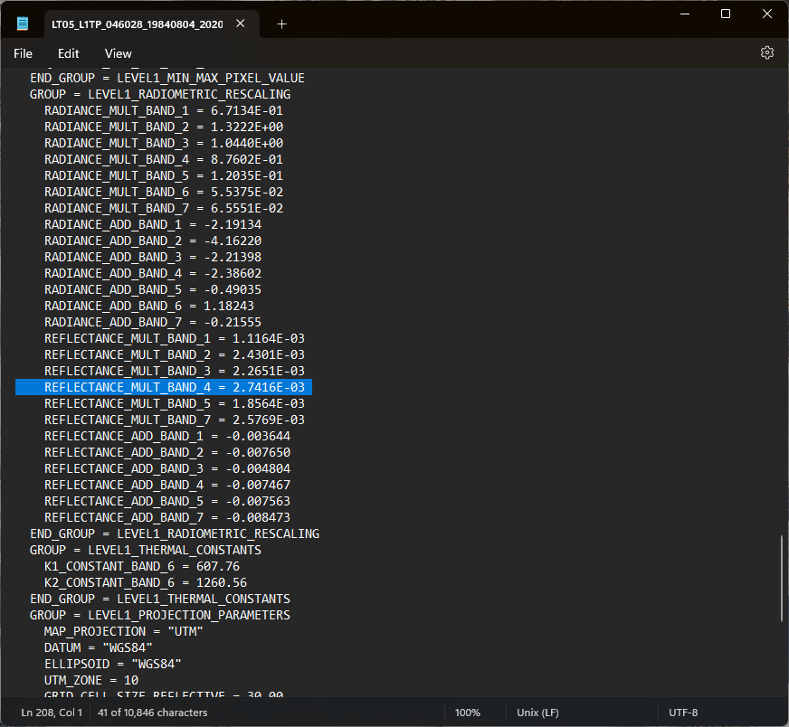

|br| and the ``REFLECTANCE_ADD_BAND_4`` value should be on line 214. Finally, the ``SUN_ELEVATION`` angle value should
be on line 64.

To do the conversion, we will use the **Raster Calculator** tool. Click on the **Geoprocessing** tab in the lower
right-hand corner of the window, then enter "raster calculator" in the search bar and press **Enter**. You should be
able to open up the **Raster Calculator** tool from the **Spatial Analyst** toolbox.

Next, we need to enter the formula - you can copy and paste the text from the box below:

.. code-block:: text

    (2.7416E-03 * "LT05_L1TP_046028_19840804_20200918_02_T1_B4.TIF" - 0.007467) / Sin((3.1415926 / 180) * 53.03707434)

.. note::

    We have added a conversion from degrees to radians (3.1415926 / 180), because the ``Sin()`` function requires
    values of radians, rather than degrees.

Save the output to your project geodatabase as ``tm5_band4_toa``, then press **Run**. You should see the new raster
layer load, with values scaled from -0.005 to 0.691:

.. image:: img/arcgis/converted_tm_b4.png
    :width: 760
    :align: center
    :alt: the arcgis map with the converted black and white landsat band 4 image loaded

|br| Once the raster has loaded and the values seem correct, you can remove the original band 4 layer
(**LT05_L1TP_046028_19840804_20200918_02_T1_B4.TIF**) from the map.

You will now need to repeat these steps for the other two bands we will use, Landsat 5 TM Band 3 (visible red), and
Band 2 (visible green). Save these to the geodatabase as ``tm5_band3_toa`` and ``tm5_band2_toa``, respectively.

.. warning::

    Remember to update the values of ``REFLECTANCE_MULT_BAND_X`` and ``REFLECTANCE_ADD_BAND_X`` for each band - they
    will not be the same!

Once you have converted each of these images to top-of-atmosphere reflectance values, we can use **Composite Bands** to
create a 3-band raster from the individual bands, so that the image displays as a false-color composite.

To open the **Composite Bands** tool, click on the **Geoprocessing** tab and enter "composite bands" in the search bar,
then select **Composite Bands** from the **Data Management** toolbox.

Add each of the three top-of-atmosphere bands to the raster by clicking the arrow next to **Input Rasters** and
selecting them, then press **Add**:

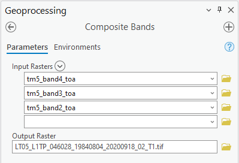

|br|

.. note::

    Make sure that you have the correct order!

Save the file to the same folder as the rest of your data files as **LT05_L1TP_046028_19840804_20200918_02_T1.tif**,
then press **Run**. You should see the color composite image appear on the map:

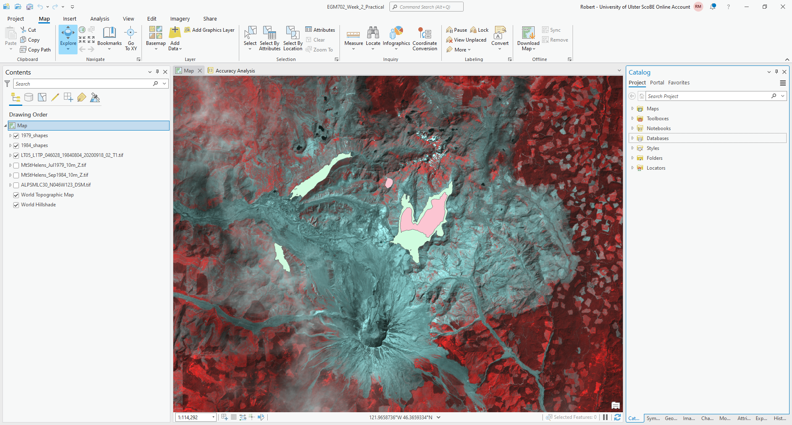

|br| Now, you will need to repeat this process for the MSS image (**LM02_L1TP_049028_19790719_20200906_02_T2**),
using bands 6, 5, and 4 - these are the MSS bands that correspond the closest to TM bands 4, 3, and 2.

Once you have converted and composited both Landsat images, re-arrange the drawing order as follows:

- 1979_shapes
- 1984_shapes
- MtStHelens_Jul1979_10m_Z.tif
- MtStHelens_Sep1984_10m_Z.tif
- ALPSMLC30_N046W123_DSM.tif
- LM02_L1TP_049028_19790719_20200906_02_T2.tif
- LT05_L1TP_046028_19840804_20200918_02_T1.tif

then move on to the next step.

adding hillshades and shaded relief
-----------------------------------

Next, we're going to add hillshades of our DEMs to the map. You may notice that it's not easy to interpret the DEM when
it's displayed in the default way – for one thing, the upper part of the volcano is washed out, while some of the
lower-lying areas are quite dark. By adding a hillshade, we can make it easier to see a large range of elevations.

From the **Analysis** tab, click on **Tools**:

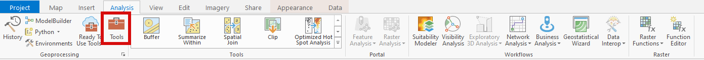

|br| In the search bar that pops up, type "hillshade" and press **Enter**.

Select the **Hillshade** tool from the **Spatial Analyst** toolbox:

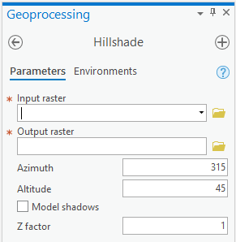

|br| Select the 1979 DEM as the **Input raster**, and save the output as ``MtStHelens_Jul1979_10m_HS.tif``. Leave the
other parameters as the default values, then click **Run** at the bottom of the panel.

Next, change the symbology of ``MtStHelens_Jul1979_10M_Z.tif`` to use a different color scheme. The example below is
using **Elevation #4**. Finally, change the **Transparency** of the DEM layer to be about 60% transparent:

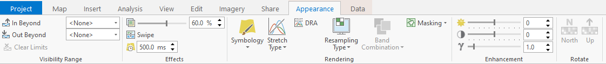

|br| Finally, right-click on the **Map** layer in the Contents panel, create a **New Group Layer** and call it
``1979 Elevation``, then add the DEM and the Hillshade to this layer (click + drag on the Contents panel).

Your map should now look something like this:

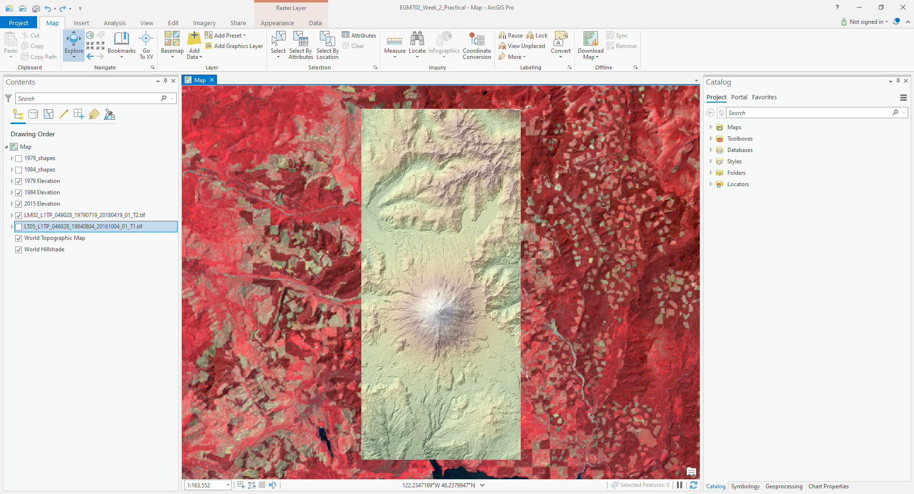

|br| Repeat these steps for the remaining two DEMs – you can call the ``ALPSMLC30...`` layer 2008 Elevation. You should
now see all 3 of the DEMs as shaded relief.

You may also notice that the color scheme for each of the DEMs is slightly different. To make sure that the same colors
correspond to the same elevations in each map, you can import the settings from one DEM to the other ones under the
**Symbology** tab.

Press the menu button in the upper right corner of the tab, then select **Import from layer**:

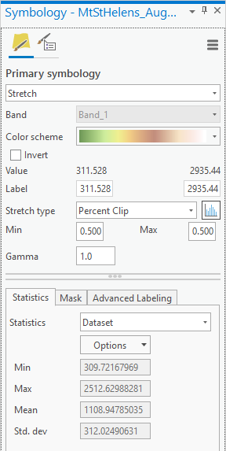

|br| Under **Input** layer, select the DEM you want to apply the color scheme to, then select the DEM whose color
scheme you want to apply (in this case, the 1979 DEM).

You can do this for both the 1984 and 2008 DEMs – you should now see that the DEMs all have the same color scheme:

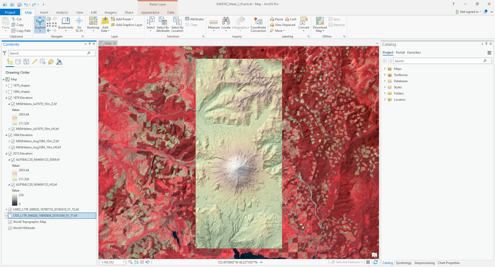

|br| Take a few moments to examine the differences between them. You can even use the **Swipe** tool under the
**Group Layer** tab to swipe back and forth between different DEMs – make sure that the DEM you want to swipe away is
highlighted in the **Contents panel**.

You should be able to clearly see the enormous differences that took place between the 1979 acquisition and the 1984
acquisition.

.. tip::

    If you haven't done so already, this is a good place to save your map.

converting the point cloud to a raster (optional)
--------------------------------------------------

Before moving on to the DEM differencing, we will first convert the point cloud provided (**final_pointcloud.las**) to
a raster using **LAS Dataset To Raster** from the Conversion Toolbox. As before, either click on the **Geoprocessing**
tab and search "las to raster" to find the tool, or find the tool in the **Conversion Tools** toolbox.

The tool should look like this:

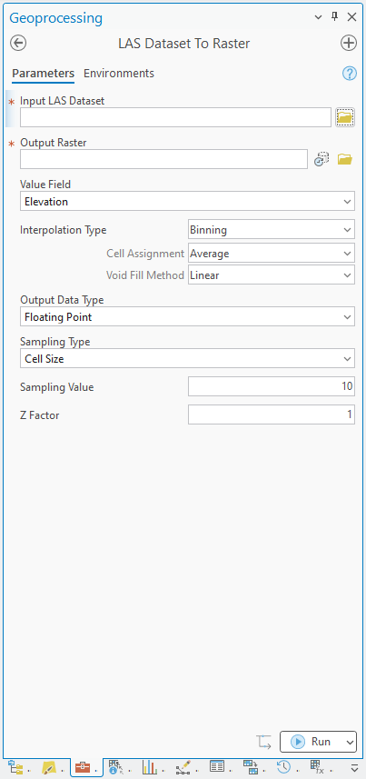

|br| The **Input LAS Dataset** should be the **final_pointcloud.las** file. Name the **Output Raster**
``PC_Tri_Linear_10m.tif``, and save it to the same folder as the rest of your data.

Make sure that **Value Field** is **Elevation**. Under **Interpolation Type**, use the following settings:

- **Interpolation Type**: **Triangulation**
- **Interpolation Method**: **Linear**
- **Thinning Type**: **No Thinning**

Keep **Output Data Type** as **Floating Point**, and make sure that **Sampling Type** is **Cell Size**. Finally,
make sure that **Sampling Value** is set to **10**. The window should now look like this:

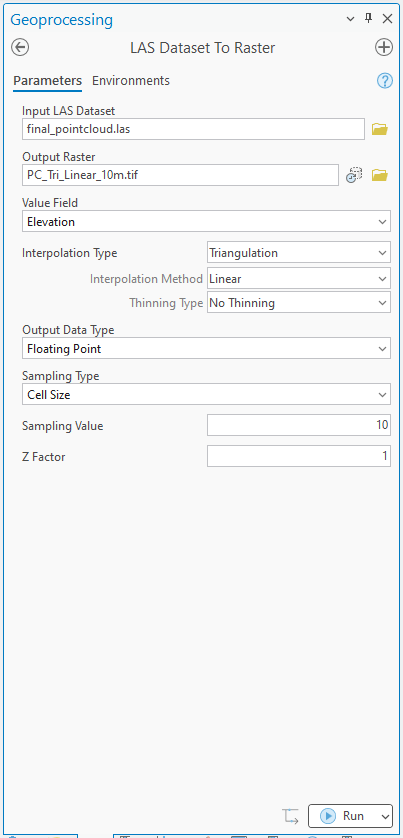

|br| Click **Run** to run the tool. After a few minutes, you should see the interpolated DEM loaded into your Map
window:

.. image:: img/arcgis/interpolated_loaded.png
    :width: 720
    :align: center
    :alt: the map window with the newly interpolated dem showing as a grayscale raster

|br| Now, run the **Hillshade** tool again, this time using your interpolated raster. Name the output
``PC_Tri_Linear_10m_HS.tif`` and save it to the same folder as the rest of the data. Leave the **Azimuth** and **Altitude**
settings the same as before, then click **Run**.

Finally, use the same steps as before to create a Group Layer for this dataset, and ensure that the elevation layer
has the same symbology as the other DEMs.

.. card::
    :class-header: question
    :class-card: question

    :far:`circle-question` Question
    ^^^

    Using the **Swipe** tool, compare the interpolated point cloud DEM with the 1984 DEM provided.

    What differences do you notice between the two DEMs? Are there any areas of obvious difference? Do the features
    appear to line up between the two?

.. card::
    :class-header: question
    :class-card: question

    :far:`circle-question` Question
    ^^^

    As an optional additional exercise, repeat the **LAS to Raster** steps above, but change the parameters:

    - try using **Triangulation** with **Natural Neighbor** interpolation, rather than **Linear**.
    - instead of **Triangulation**, select **Binning** as the **Interpolation Type**
    - how does decreasing the **Sampling Value** change the look of the DEM? Is there more detail (or more noise)
      if you use a cell size of 5 m?

    In particular, pay attention to how the DEMs look using these different parameters. Are there textural differences
    between the DEMs that you can notice? How does the detail (or the noise) in the hillshades compare?

dem differencing
----------------

The next step is to actually difference the two DEMs (in this case, the 1979 and the 1984 DEMs).

From the **Geoprocessing** tab, enter "raster calculator" in the search bar and press **Enter**, then open the
**Raster Calculator** tool from the **Spatial Analyst** toolbox.

To subtract the 1979 DEM from the 1984 DEM, enter the following expression into the field:

.. code-block:: text

    "1984 Elevation\MtStHelens_Sep1984_10m_Z.tif" - "1979 Elevation\MtStHelens_Jul1979_10m_Z.tif"

Save the difference raster as ``MtStHelens_1984_1979_dZ.tif``, and press **Run**:

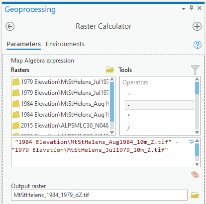

|br| Next, we'll change the display so that it shows the differences using a more appropriate color scale. In the
**Symbology** tab, select a different color scheme – preferably one that is *divergent*, so that we can more easily
differentiate the areas between positive/negative elevation change, as well as the areas where there's not much change.

For this example, I've chosen **Red-Yellow-Blue** (continuous), but feel free to pick a different one.

Next, set the **Stretch** type to **Minimum/Maximum**. You should notice that while the extreme colors correspond to
the correct changes, the color scale is not centered, which makes it more difficult to interpret areas of no/little
change (the values around 0).

Under the **Statistics** tab, select **Custom** from the first drop-down menu. You can now change the Min/Max values.

I've set these to -100/+100, meaning that the color scale will saturate at -100 and +100 meters of change. You may also
need to change the label so that this is reflected on the contents pane (and so that you don't forget later).

The map should now look something like this (note that I've turned off the two shapefiles, so that you can see the
lake changes):

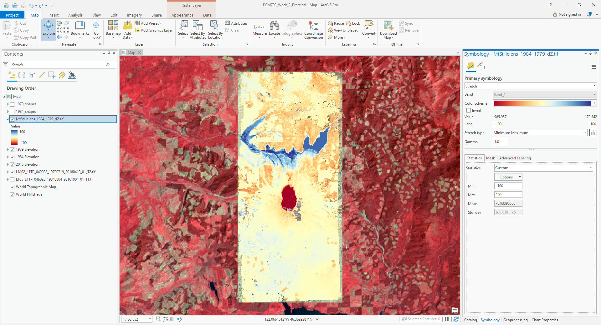

|br| You should now clearly see where the mountainside has collapsed, as well the landslide and lahar/pyroclastic
material deposits to the North of the volcano, and the two lakes that have dramatically increased their levels
(Coldwater Lake and Spirit Lake, from West to East).

.. card::
    :class-header: question
    :class-card: question

    :far:`circle-question` Question
    ^^^

    If you have interpolated the point cloud DEM, you should also compute the difference between the interpolated DEM
    and the provided 1984 DEM.

    Look at the difference between the two 1984 rasters. Is there a clear bias (systematic shift) between the two? Do
    you see, for example, that the changes are mostly positive or mostly negative? In particular, pay attention to areas
    with high slopes (for example, on the flanks of the volcano or inside the summit crater). What patterns do you
    notice? How do these relate to what you have seen in the lecture videos or in the suggested reading for this week?

accuracy estimation
-------------------

The next step is to estimate how accurate our DEM difference is, as this will tell us something about how well we can
estimate both the elevation and volume changes that we're interested in.

When we expect to see changes in elevation of different surfaces within the DEM, such as elevation drop due to glacier
melt or the collapse of a mountainside, we first need to mask out the areas of change, so that we are only estimating
the differences over terrain that hasn't changed in elevation (or at least, as well as we can approximate it).

You should notice that there are several different examples of elevation differences present here. The most obvious
have to do with the eruption and its aftermath – the collapse of the North flank of the mountain, the deposits of
pyroclastic and landslide material, the change in lake levels, and trees that were knocked down due to the force of the
initial blast:

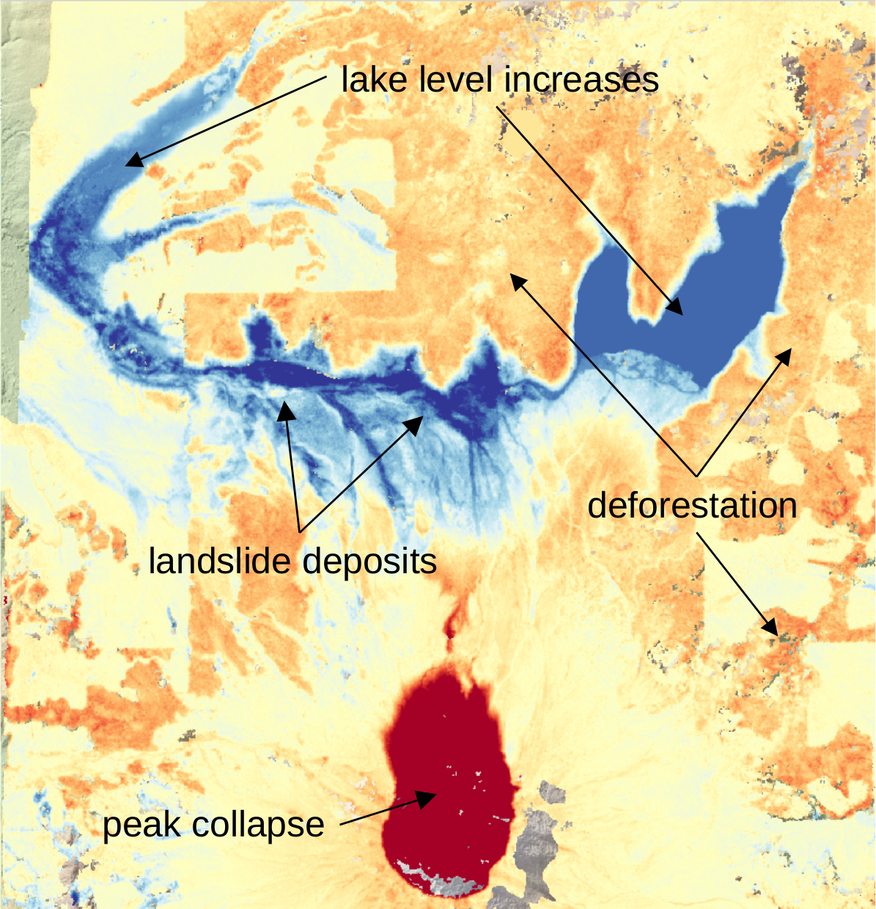

|br| In order to estimate the accuracy of our elevation differences, we need to estimate the differences over "stable"
terrain - that is, areas where we don't expect the elevation to have changed in between 1979 and 1984.

As you can see in the image above, determining what is stable is not especially easy – there are a number of different
ways that the elevation has changed in between the two acquisition dates.

We'll worry about this in a minute, but first we'll create a grid of points to sample elevation differences. We'll use
the **Create Fishnet** tool in the **Data Management** toolbox to do this:

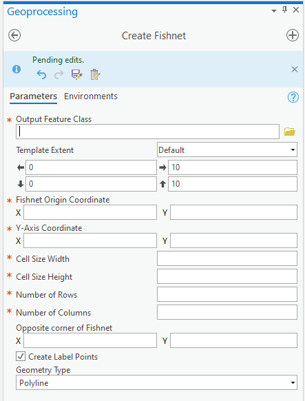

|br| Save the points to a file called ``sample_points.shp``.

Under **Template Extent**, click "Extent of a Layer" (third button from the left), and set the output extent to be the
same as ``MtStHelens_1984_1979_dZ.tif``. Then, set the cell size to be 50 meters in both width and height.

Finally, make sure that **Create Label Points** is checked, and that the **Geometry Type** is set to **Polygon**,
then click **Run**.

This will create a regular grid of cells with 50 meters spacing, and a corresponding file that has the cell centroids.

When the tool finishes running, you should now see both ``sample_points`` and ``sample_points_label`` in the
**Contents** panel. Go ahead and remove ``sample_points`` from the Map, as we'll do the next step with
``sample_points_label``.

.. note::

    Depending on your computer's resources, this might be extremely slow. Rather than 50 m spacing, you can change this
    to 100 or even 200 m, and it will still work.

Now, we're going to extract the dZ values at our sample points, using the **Extract Values to Points** tool in the
**Spatial Analyst** toolbox:

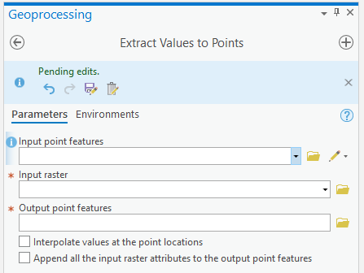

|br| Use ``sample_point_labels`` as the **Input point features**, and set the **Input raster** to be
``MtStHelens_1984_1979_dZ.tif``. Save the output as ``dZ_1984_1979.shp``, and check **Interpolate values at the point
locations**. Click **Run**.

When the tool has finished running, go ahead and remove ``sample_point_labels`` from the map.

Next open the **Attribute Table** for ``dZ_1984_1979.shp``. It should look something like this:

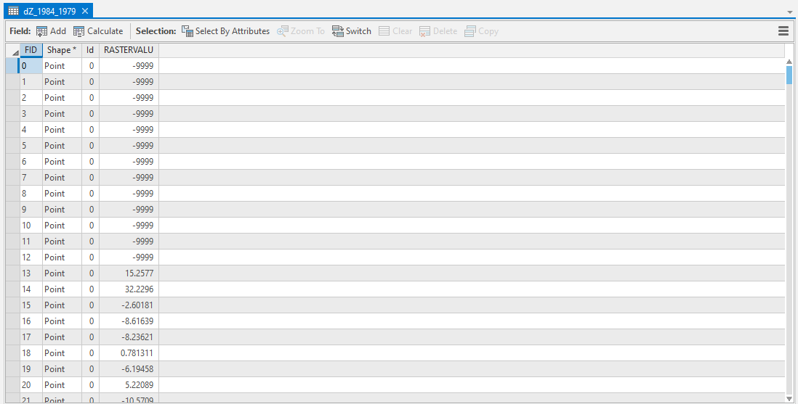

|br| The next thing we want to do is remove all of the points that correspond to ``NoData`` values in the raster
(``-9999`` in this case).

You can do this using **Select by Attributes**, then selecting all of the features where ``RASTERVALU`` equals
``-9999``. When you have the points selected, click **Delete**.

With ``dZ_1984_1979`` highlighted in the **Contents** pane, click **Save** under the **Edit** tab to save the edits:

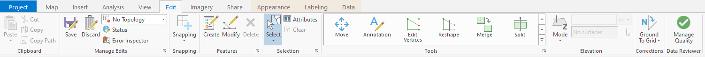

|br| You should now have a sampling of points of elevation differences. You can visualize this from the
**Attribute Table**. First, right-click on the **RASTERVALU** column, then select **Visualize Statistics**.

A histogram of the values will display in the same panel:

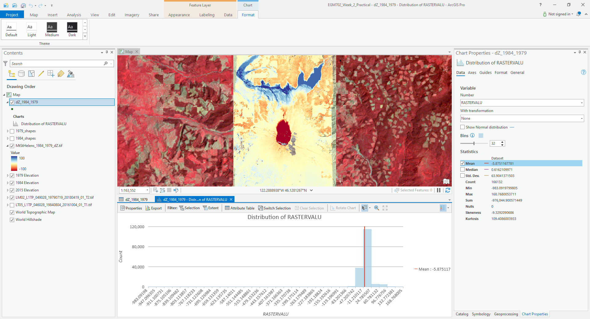

|br| You can increase the number of bins to display (up to 64), as well as display the mean, median, and standard
deviation values on the graph.

.. card::
    :class-header: question
    :class-card: question

    :far:`circle-question` Question
    ^^^

    Click **Show Normal distribution** to plot a normal distribution with your histogram. Do your elevation changes
    appear normally distributed? Based on the lectures/reading for this week, is this expected or not?

Our next step is to select points that are only on stable terrain – again, this means points whose elevations we do
not expect to have changed between the two DEM dates: we expect that the elevation difference for these points should
be zero.

To assess this, we can use the two Landsat images provided, which were acquired within a few weeks of the air photos
that produced the DEMs. The 1979 MSS scene (``LM02_L1TP_049028_19790719_20200906_02_T2.tif``) was acquired on 19 July,
while the 1984 TM scene (``LT05_L1TP_046028_19840804_20200918_02_T1.tif``) was acquired on 4 August.

We'll start by looking near the Southeast flank of the volcano:

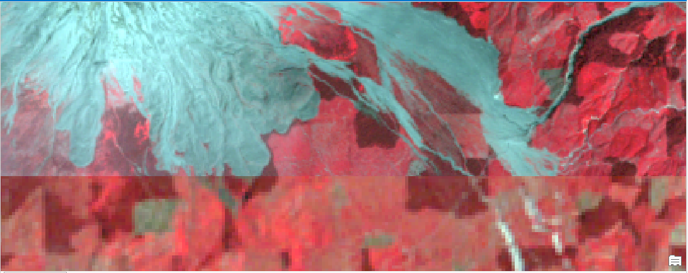

|br| Using the **Swipe** tool to swipe between the two Landsat scenes, you should notice that things look very similar
here – the same patches of trees appear in both time periods, and this area was relatively untouched by the 1980
eruption, so we should expect this area to represent mostly stable ground.

Use the **Select** tool to select the dZ points that you can see in this area.

Once you have done so, in the panel that contains the histogram, click on **Filter: Selection** to change the chart to
only show your selected points:

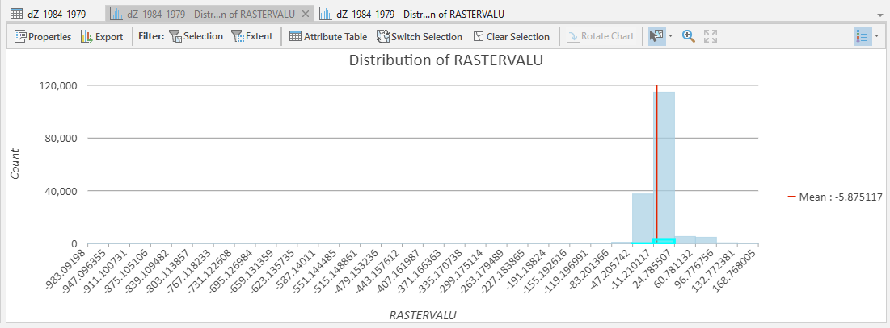

|br| The chart should now change:

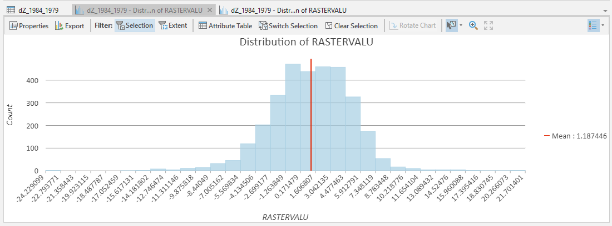

|br| From this, we can see that the mean elevation difference from our sample is fairly low, although this doesn't
necessarily tell us much about the accuracy of the dataset.

To assess this, we can calculate the root mean square (RMS) difference:

.. math::

    {\rm RMSD} = \sqrt{\frac{\sum_{i=1}^{N}(x_i - \hat{x}_i)^2}{N}} \label{rmsd}\tag{1}

|br| or the normalized median absolute deviation (NMAD):

.. math::

    {\rm NMAD} = 1.4826 * {\rm median}(|x_i - \tilde{x}|) \label{nmad}\tag{2}

|br| which will give us a more robust and accurate representation of the accuracy of our elevation differences.
To do these calculations, we'll use the python notebook (``Accuracy Analysis.ipynb``) included in the files downloaded
from the google drive link above.

First, export the table by right-clicking on dZ_1984_1979 in the contents panel, then selecting **Data** >
**Export Table**. Save the table as ``dZ_1984_1979.csv`` in your **Data** folder.

To open the python notebook, open the **Catalog** tab and navigate to the folder where you have saved the notebook:

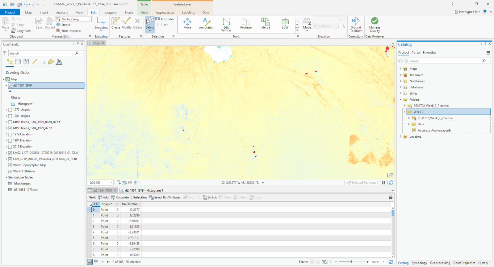

|br| Right-click on ``Accuracy Analysis.ipynb``, then select **Open Notebook**.

You should see something like this (your notebook may open in a different panel then what is shown):

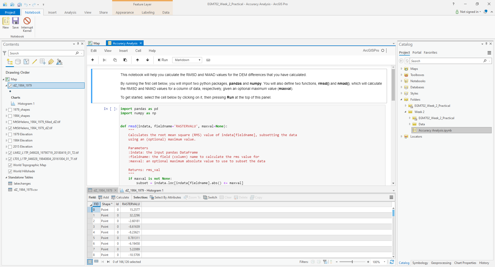

|br| You can now run through the instructions provided in the notebook to calculate the NMAD and RMSE values for your
exported points. You can also run this on a selection of the points (for example, using the same selection you made
above) by first creating a new layer from the selection (right-click, **Selection** >
**Make Layer from Selected Features**), then exporting the table from that layer to a ``.csv`` file.

You'll need to change the filename for the data in the notebook as well before running the calculations - be sure to
read the text in the notebook carefully.

.. _egm702 alternate:

.. note::

    If you encounter the following (extremely vague) error:

    .. image:: img/arcgis/notebook_error.png
        :width: 300
        :align: center
        :alt: an error message that says "failed to load notebook"

    Don't panic - You can still run the script to calculate the NMAD and RMSE as follows. First, you will need to
    open the **Python Command Prompt** from ArcGIS Pro (**Start** > **ArcGIS** > **Python Command Prompt**):

    .. image:: img/arcgis/python_cmd.png
        :width: 300
        :align: center
        :alt: the ArcGIS folder in the Windows Start Menu

    When this command prompt opens, navigate to the folder where you have saved your practical data using the
    ``cd`` command (remember to `replace path-to-egm702-data <https://getyarn.io/yarn-clip/876a8240-51da-4068-919d-d9111d405d3e>`__
    with the actual path!):

    .. code-block::

        cd path-to-egm702-data

    Now, enter the following command:

    .. code-block::

        jupyter notebook

    This will open a browser window:

    .. image:: img/arcgis/jupyter.png
        :width: 720
        :align: center
        :alt: the egm702 folder opened in jupyter

    Click on ``AccuracyAnalysis.ipynb``, which should open the notebook in a new tab/window:

    .. image:: img/arcgis/notebook_browser.png
        :width: 720
        :align: center
        :alt: the jupyter notebook opened in a browser window

    Be sure to read the instructions carefully to run the cells of the notebook.

.. card::
    :class-header: question
    :class-card: question

    :far:`circle-question` Question
    ^^^

    Compare the RMSE and NMAD values that you get here with the residual values from the provided GCP and CP reports.
    How do the values compare?

filling nodata values
---------------------

You may notice that there are a number of voids, or gaps, in the DEM difference. I have masked the clouds present in
the 1984 images, as well as a few other areas where there are blunders (large errors) in one or the other DEM. There
are also smaller gaps where the photogrammetric software was unable to correlate the images and calculate an elevation,
most often in areas of shadow or low contrast.

In order to calculate a volume change, we need to somehow fill, or interpolate, these data gaps. As discussed in the
lectures this week, there are a number of ways to do this.

We're going to focus on using **Kriging** interpolation through the **Geostatistical Wizard**, which you can find under
the **Analysis** tab:

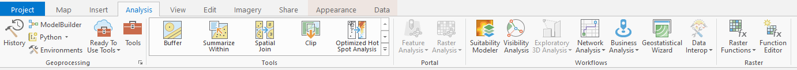

|br| In the window that opens, you should see a number of different interpolation options:

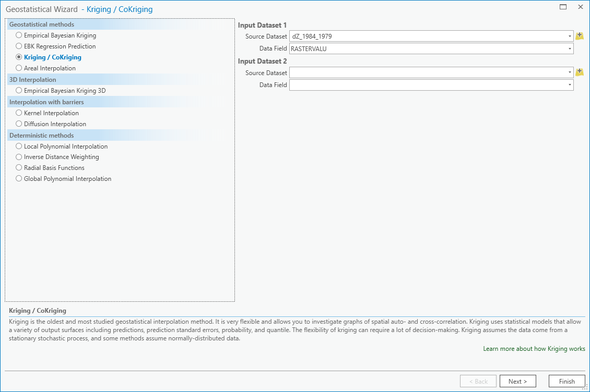

|br| In this example, we're going to use Kriging/CoKriging, but I encourage you to examine the other options.

Select **Kriging/CoKriging**, make sure that **Source Dataset** is ``dZ_1984_1979`` and the **Data Field** selected is
``RASTERVALU``, then click **Next**.

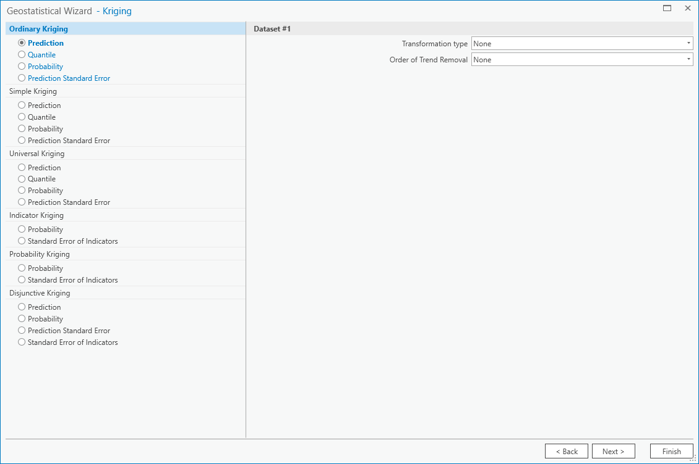

|br| Here, make sure to select **Ordinary Kriging** > **Prediction**. Leave both the **Transformation Type** and
**Order of Trend Removal** as **None**, then click **Next** again:

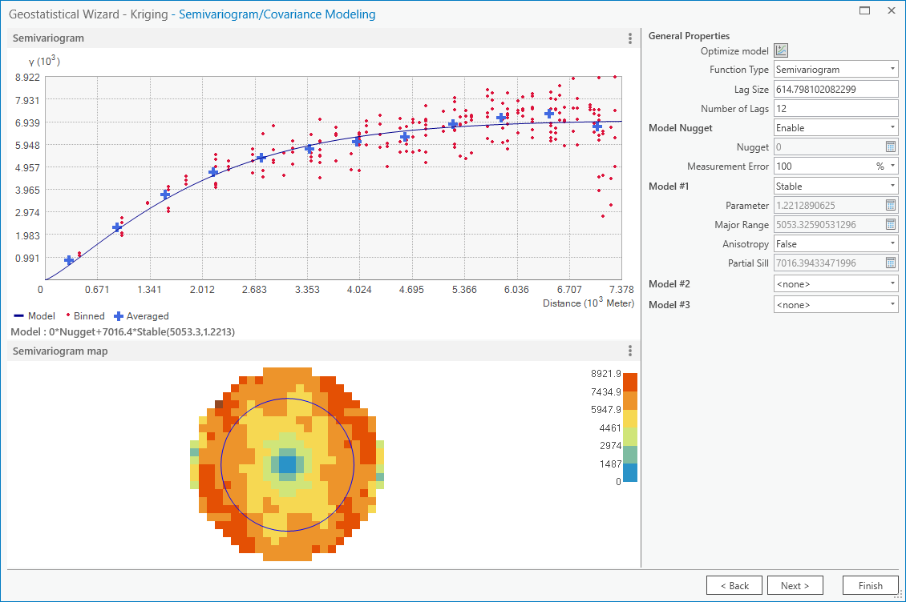

|br| You should see that the semivariogram levels off after some distance – that is, there doesn't appear to be any
correlation in the differences between values after a certain separation. You can try a few different model types here
to see how well they fit the data – you can also add multiple variogram models.

.. note::

    Your values/image may differ slightly from the picture above. 

.. tip::

    Be sure to note what model you use! You should also note both the **Sill** and **Nugget** values!

You can also let the software choose the "best" model by clicking on **Optimize model** at the top of the window –
this will find the best-fitting model to the data. After you've looked around at the different models and their
parameters, and are happy that the modelled covariance fits the data well, click **Next**.

In the next window, you can choose different parameters to determine how the search neighbourhood is determined. For now,
you can leave these as-is, and click **Next**.

In this window, you should see the cross-validation statistics for the interpolation:

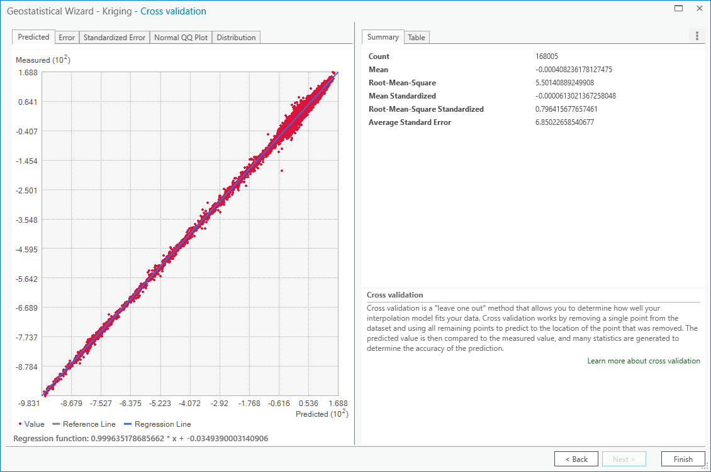

|br| To do the cross-validation, the software compares the value for each point in the dataset versus the value
predicted for that point by leaving it out from the interpolation – it gives you an idea of how well the prediction
fits the data.

If your predicted values fall very far away from the one-to-one line, you should go back and try different parameters
or a different covariance model, as it indicates that you haven't captured the statistics of the dataset particularly
well.

If this step looks alright, click **Finish** to produce the interpolated map.

.. tip::

    Be sure to note the **Root-Mean-Square** value - this is an estimate of the uncertainty in your predicted
    elevation values!

Once the Kriging layer loads, you can export it to a raster by right-clicking on it in the **Contents** panel and
selecting **Export Layer** > **To Rasters**. Save the **Prediction** surface to ``MtStHelens_1984_1979_kriging_dZ.tif``
with an **Output cell size** of ``10``, then click **Run**:

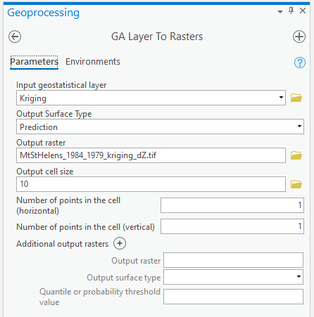

|br| Next, open the **Raster Calculator** and enter the following expression, and save the output to
``MtStHelens_1984_1979_filled_dZ.tif``:

.. code-block:: text

    Con(IsNull("MtStHelens_1984_1979_dZ.tif"), "MtStHelens_1984_1979_kriging_dZ.tif", "MtStHelens_1984_1979_dZ.tif")

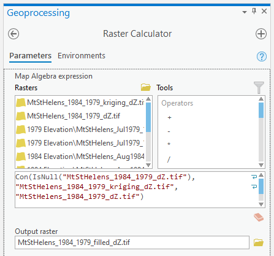

|br| This conditional statement will return a raster with values from the kriging raster wherever the original dZ raster
has ``NoData`` values, and returns values from the original dZ raster wherever they are not ``NoData`` – in other words,
this will fill the voids in the dZ raster using the kriging predicted values.

Change the symbology to match the original dZ raster (``MtStHelens_1984_1979_dZ.tif``). Then, use the **Swipe** tool to
examine the difference between two rasters (filled_dZ and dZ):

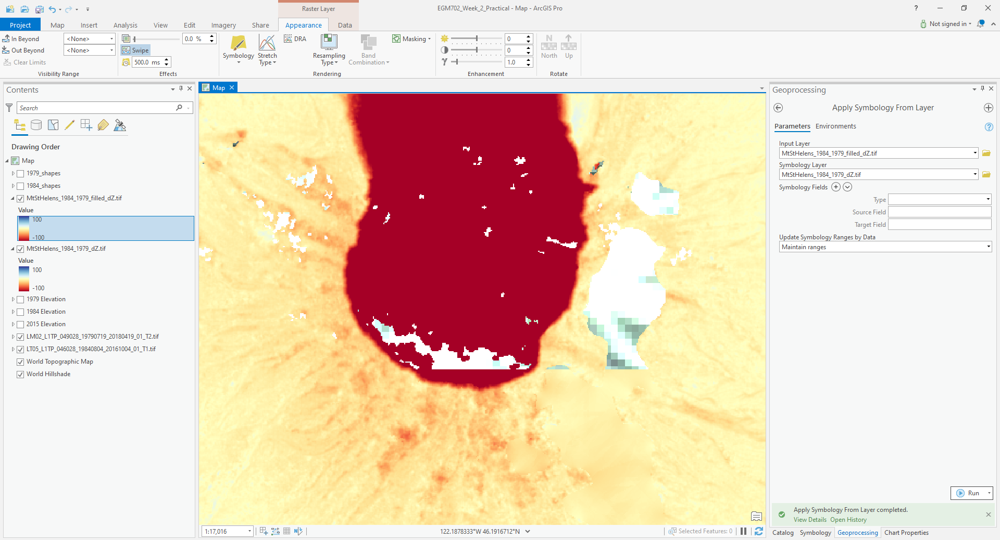

|br| You should see that the filled raster no longer has holes where the original dZ raster did. At this point, you can
move on to estimating some volume changes.

estimating elevation and volume changes
---------------------------------------

For this step, we'll start by calculating the lake volume changes. To do this, we'll use the
**Zonal Statistics as Table** tool from the **Spatial Analyst** toolbox.

Open the tool, then set the **Input feature zone data** to ``1984_shapes``, and the **Zone field** to ``name``. The
**Input value raster** should be the filled dZ raster, and save the table to ``LakeChanges``. Leave the
**Statistics type** as **All**:

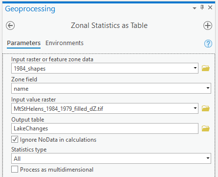

|br| Click **Run**, then open the table:

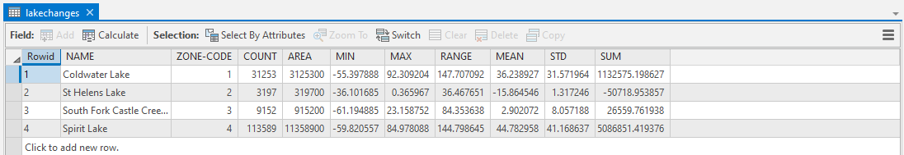

|br| Each column of this table contains the statistics extracted from each of the features in 1984_shapes. You can
update the table to include the volume by pressing the **Calculate** button, then entering an expression to multiply the
``SUM`` column by the raster cell size squared – the resulting values should be the total volume change, in cubic
meters, of each of the lakes.

Make sure that your new field is of type **Float**, then press **OK**:

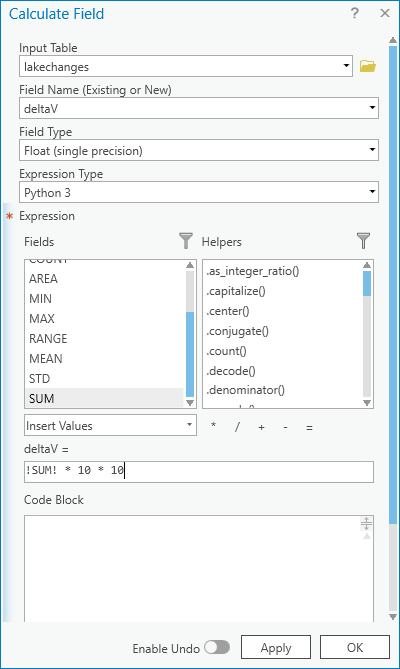

|br| Note that for one of the lakes, this is actually the lake volume, as it did not exist prior to the eruption. This
is only a partial volume for another lake, as it wasn't fully captured in the 1984 air photo acquisition.

assignment
----------

For your presentation, you should present one of the following case studies:

1. Lake volume changes around Mt St Helens, 1979 - 1984 - 2008;
2. Average height of trees knocked down during the 1980 eruption;
3. Total volume and mass change of the mountain as a result of the eruption;
4. Analysis of the landslide deposits;
5. Some other elevation change (e.g., glacier changes, lava dome growth).

To do this, you'll first need to digitize the outlines of these different features, then use the
**Zonal Statistics as Table** tool to find the statistics for each of these areas.

.. tip::

    Make sure that you describe your process for how you produced these outlines in detail!

You are welcome to try all three of these exercises if you like, but you should do at least one of them – this will
form the investigation that you will present for Assessment Part 1a, as well as part of the report you will
submit for Assessment Part 2.

To do the digitizing, I recommend using a combination of the elevation difference raster and the Landsat images to
guide you. You can also use the NAIP images provided in the Week 1 practical, the ESRI Basemap imagery, or even
download your own Landsat or Sentinel-2 images.

In addition, I have provided a number of DEMs from various sources in the Practical folder on Blackboard. You are of
course welcome to use these, but be sure that you include the necessary information about the datasets in your
presentation!

next steps
----------

I have provided these three DEMs (1979, 1984, and ca. 2008) already co-registered to the
`Copernicus 30 m Global DEM <https://dataspace.copernicus.eu/explore-data/data-collections/copernicus-contributing-missions/collections-description/COP-DEM>`__.
You can check out the tutorial provided here: https://github.com/iamdonovan/dem-coregistration to learn more about how I've
done this, and how you can co-register your own DEMs, either for your project, or for future work.

If you click on the |binder| link at the top of the ``README`` on the github page above, you can also try out the
tutorial online, without having to download and set it up yourself:

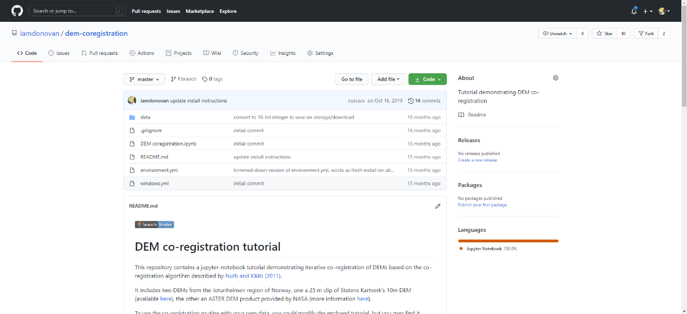

|br| If you are already familiar with python, you can also use the `xDEM package <https://xdem.readthedocs.io/en/stable/>`__
for DEM analysis, including multiple different co-registration options.

.. |binder| image:: https://mybinder.org/badge_logo.svg
     :target: https://mybinder.org/v2/gh/iamdonovan/dem-coregistration/master

notes and references
--------------------

.. [1] This is actually the scene center solar elevation angle. To be completely thorough, we would first calculate
       the per-pixel solar elevation angle. We're not going to do this for this tutorial, but you can find more
       information about how to do this `here <https://www.usgs.gov/land-resources/nli/landsat/solar-illumination-and-sensor-viewing-angle-coefficient-files>`__.

.. [2] Alternatively, you can open a command prompt, navigate to the folder where you have stored your practical data,
       and use the ``FINDSTR`` command
       (`documentation <https://learn.microsoft.com/en-us/windows-server/administration/windows-commands/findstr>`__)
       to search the text file. For example, to find the reflectance multiplier for band 4, you would run the following
       command:

       .. code-block:: text

            findstr "REFLECTANCE_MULT_BAND_4" LT05_L1TP_046028_19840804_20161004_01_T1\LT05_L1TP_046028_19840804_20161004_01_T1_MTL.txt

