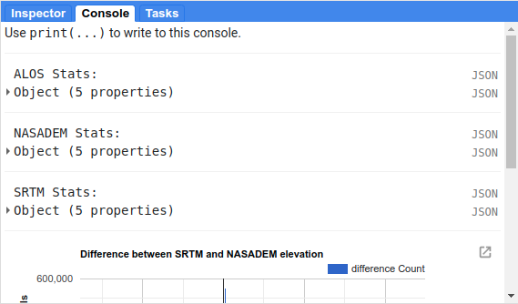

introduction to google earth engine
============================================

.. raw:: html

    

.. role:: green

In this practical, you'll get an introduction to using Google Earth Engine (GEE) for remote sensing analysis. Even if
you have no prior experience with programming, you will be able to complete this practical. All of the programming steps
have been provided for you in a script, and your task will be to run each step in turn and analyse and interpret the results.

GEE is "a cloud-based platform for planetary-scale geospatial analysis" (Gorelick et al., 2017\ [1]_). With it, users
have access to a number of tools, including entire satellite archives, machine-learning algorithms for classification,
and computational power above what an average desktop user has access to.

getting started
---------------

To begin, point your browser to https://code.earthengine.google.com. If you are not already logged in, log in using
your GEE account. You should see something like this:

.. image:: ../../../img/egm702/week3/annotated_window.png
    :width: 600
    :align: center
    :alt: the GEE console with annotations

|br| Click the red **NEW** button in the **Script manager**, and select **Repository**. Call the repository ``egm702``,
and then click **Create**.

To gain access to the EGM702 repository, click this link: https://code.earthengine.google.com/?accept_repo=users/robertmcnabb/egm702

This will give you access to all of the scripts in the repository for each remaining week of the module, including some
additional examples of applications that might be useful for your project.

You (and anyone with the link above) are automatically added to this repository as a *Reader*; that is, you have
permission to see the script and to run it. If you want to make changes to each script and save them, you will
need to save the script to your own account (as an *Owner*). To do this, you first need to make a change to the
script in the **Editor** panel.

The easiest way to do this would be to replace "YOUR NAME HERE!" on line 1 with your name. When you do this, you
should see that the **Save** button activates. Click the **Save** button, then click **Yes** to make a copy of the
script to your own repository.

You should see the following dialogue:

.. image:: ../../../img/egm702/week3/save_script.png
    :width: 300
    :align: center
    :alt: the save script dialogue

|br| Save the script to your ``egm702`` repository as ``week3/01_finding_images.js`` - you should see a ``week3`` folder
appear under this repository in the **Script manager**.

As you work through the other scripts this week, be sure to save them to your own repository in this way (remembering
to update the script names appropriately). This way, you have a record of any changes that you make to the script.

.. note::

    Perhaps most importantly, it will mean that when you add training samples for the classification exercises in
    Week 5, you don't have to re-do them each time you re-open your browser window.

part 1 - finding and inspecting images
----------------------------------------

Once you have saved the script, you should see something like the following in the code editor:

.. image:: ../../../img/egm702/week3/loaded_saved_script.png
    :width: 600
    :align: center
    :alt: the gee window after loading and saving the script

|br| You should also notice that the script begins with a large block of comments (beginning and ending with
``/*`` and ``*/``):

.. code-block:: javascript

    /* EGM702 Practical 3, Part 1: Finding Images \\ YOUR NAME HERE!
    -----------------------------------------------------------------------------------------------------

    Introduction

    This script is intended to give you some experience working with Google Earth Engine,
    even if you have never done any computer programming before. In this script, you will
    learn:

      1. The basic layout of the Earth Engine interface;
      2. How to search for images and add them to the Map;
      3. How to adjust visualization parameters using the Layers menu;
      4. How to find pixel or feature values using the Inspector tool;

    -----------------------------------------------------------------------------------------------------
    */

In Javascript (the programming language used in the code editor interface), comments (that is, statements that the
computer won't process) are denoted by ``//`` (two forward slashes) if they are a single line comment. Multi-line, or
block, comments, start with ``/*`` and end with ``*/`` – anything in between these symbols will not be interpreted by
the computer when the script is run. In the GEE code editor, comments are coloured :green:`green`.

The first line with actual code to pay attention to is on line 17:

.. code-block:: javascript

    var tools = require('users/robertmcnabb/egm702:libraries/tools.js');

This line will *import* all of the functions and tools contained in the ``egm702/libraries/tools.js`` script, which
we will use in most of the remaining exercises.

.. note::

    This setup, where we have different "modules" that we "import" to use in a script, is something that we will
    cover in more depth in EGM722 with python programming.

    If you are interested in developing your GEE skills further, you can have a look at this
    `post <https://medium.com/google-earth/making-it-easier-to-reuse-code-with-earth-engine-script-modules-2e93f49abb13>`__
    by a GEE developer, which shows how you can set up your own "module".

The next set of lines will search through the entire Landsat 8 Collection 2 Surface Reflectance archive, remove any
images with >20% cloud cover, and return only those images whose WRS-2 Path/Row matches our current study area around
Mt St Helens. It will then store a list of these images in a variable called ``lc08`` that we can use later on in the
script:

.. code-block:: javascript

    // Load Landsat 8 images
    // returns all LC08 surface reflectance images with < 20% cloud cover
    // from WRS path/row 46/28.
    var lc08 = ee.ImageCollection("LANDSAT/LC08/C02/T1_L2") // select Landsat 8 Collection 2 SR
      .filterMetadata('CLOUD_COVER', 'less_than', 20) // select cloud cover < 20%
      .filter(ee.Filter.eq('WRS_PATH', 46)) // select WRS Path 46
      .filter(ee.Filter.eq('WRS_ROW', 28)); // select WRS Row 28

For more information on the WRS-2, see this link: https://landsat.gsfc.nasa.gov/about/worldwide-reference-system.

For more information about Landsat Collection 2 images, see this link: https://www.usgs.gov/landsat-missions/landsat-collection-2

.. note::

    The purpose of these practicals is to focus more on image analysis and interpretation, and less on the nuts and
    bolts of programming in GEE.

    If you are interested in learning more about the coding side of things, you are welcome
    to check out some additional tutorials that I have written about working with GEE, which provide more information
    about how the code works: :doc:`../../../gee/tutorials/index`.

    You can also check out the amazing new textbook, "Cloud-Based Remote Sensing with Google Earth Engine", available
    for free online at https://www.eefabook.org/.

The next set of lines will do the same thing, but this time using the Landsat 8 Collection 2 Top of Atmosphere (TOA)
reflectance archive:

.. code-block:: javascript

    // returns all LC08 TOA reflectance images with < 20% cloud cover
    // from WRS path/row 46/28.
    var lc08_toa = ee.ImageCollection("LANDSAT/LC08/C02/T1_TOA") // select Landsat 8 Collection 2 SR
      .filterMetadata('CLOUD_COVER', 'less_than', 20) // select cloud cover < 20%
      .filter(ee.Filter.eq('WRS_PATH', 46)) // select WRS Path 46
      .filter(ee.Filter.eq('WRS_ROW', 28)); // select WRS Row 28

For a refresher on the difference between Surface Reflectance and TOA reflectance, see here:
https://www.usgs.gov/landsat-missions/landsat-collection-2-surface-reflectance

The following set of lines will return the image from the surface reflectance collection that has the lowest cloud cover,
selecting only images from 2020. It will also make sure to only select the coastal/visible/NIR/SWIR Landsat band layers
(Bands 1-7).

.. code-block:: javascript

    // Find the least cloudy image from 2020, and clip it to the boundary.
    var sr_img = ee.Image((lc08)
      .filterDate('2020-01-01', '2020-12-31') // select all images in 2020
      .select(['SR_B[1-7]']) // select bands 1-7
      .sort('CLOUD_COVER') // sort based on cloud cover (lowest - highest)
      .first()); // return the first image in the list - i.e., the lowest cloud cover

    // Do the same, but for the TOA collection
    var toa_img = ee.Image((lc08_toa)
      .filterDate('2020-01-01', '2020-12-31') // select all images in 2020
      .select(['B[1-7]']) // select bands 1-7
      .sort('CLOUD_COVER') // sort based on cloud cover (lowest - highest)
      .first()); // return the first image in the list - i.e., the lowest cloud cover

Now, we want to make sure that these images are the same image, just different processing levels (surface reflectance
vs. TOA reflectance). To check this, we can print the image names to the **Console**:

.. code-block:: javascript

    // print the image name/date
    print('2020 SR Image Date: ', ee.Date(sr_img.get('SENSING_TIME')), sr_image);
    print('2020 TOA Image Date: ', ee.Date(toa_img.get('DATE_ACQUIRED')), toa_image);

The final part of this first section is where we add the images to the map:

.. code-block:: javascript

    // add the best images from each collection to the Map as a true-color composite
    Map.addLayer(toa_image, {bands: ['B4', 'B3', 'B2'],
      min: 0.005, max: 0.4, gamma: 1.5}, 'TOA Image');

    // add SR image after rescaling DN values
    Map.addLayer(tools.oliRescale(sr_img), {bands: ['SR_B4', 'SR_B3', 'SR_B2'],
      min: 0.005, max: 0.4, gamma: 1.5}, 'SR Image');

    // center the image on Mt St Helens with a zoom level of 12
    Map.setCenter(-122.1886, 46.1998, 12);

We want them to be true-colour composites, so we display them with bands 4,3,2. and we'll apply a *gamma adjustment* to
help brighten the image slightly.

At this point, you can *Run* the script, either by pressing **CTRL + Enter**, or by
clicking **Run** at the top of the code editor panel. Once the script finishes running, you should see this:

.. image:: ../../../img/egm702/week3/loaded_image.png
    :width: 600
    :align: center
    :alt: the script after having added the image from step 1.

|br| When you mouse over the **Layers** button in the upper right of the **Map** panel, you should see the two layer
names (TOA Image and SR Image). If you click on the gear icon, you can open the visualization parameters for each image
and adjust them. You can also adjust the transparency slider for the different layers displayed here, and by
checking/unchecking the box next to the layer name, you can make either image visible/invisible.

.. image:: ../../../img/egm702/week3/layer_parameters.png
    :width: 400
    :align: center
    :alt: the layer visualization settings

|br| In the **Console** panel, you should see the following:

.. image:: ../../../img/egm702/week3/console1.png
    :width: 400
    :align: center
    :alt: the output to the console after running Step 1.

|br| This shows that the 2 images are the same image, just different processing levels. Now, in the **Map** panel, turn
off the SR Image to see the TOA Image underneath.

.. admonition:: Question
    :class: question

    Describe the difference in appearance that you notice between the two images. Which image appears more "blue"?

Next, click on the **Inspector** tab, then click anywhere on the **Map** to get the pixel values for each image displayed
on the map at that location:

|br| By default, the **Inspector** tool displays the values in each band as a list, but you can toggle to view a bar
chart by clicking chart icon outlined in red above:

.. image:: ../../../img/egm702/week3/inspector_chart.png
    :width: 600
    :align: center
    :alt: the gee window with the inspector tab active, showing a bar chart of pixel values for a given location

|br| Click on a few different locations and note down the differences between the two images in each band (note
that the TOA image will be displayed first, then the SR image).

.. admonition:: Question
    :class: question

    - In what band(s) do you see the largest difference between the two image?
    - Using what you have learned about atmospheric scattering, and the wavelengths of the different bands, explain any
      difference(s) that you see between the TOA reflectance and the surface reflectance images.

.. hint::

    The sensor carried by Landsat 8 is the Operational Land Imager/Thermal InfraRed Sensor (OLI/TIRS). The table below
    shows the wavelength ranges for the different bands of the sensor(s), their resolutions, and their names:

    +------------+----------+---------------------+-------------------------+--------------------+
    | **sensor** | **band** | **wavelength (µm)** | **name**                | **resolution (m)** |
    +------------+----------+---------------------+-------------------------+--------------------+
    | oli        | 1        | 0.43 -- 0.45        | coastal aerosol         | 30                 |
    +------------+----------+---------------------+-------------------------+--------------------+
    |            | 2        | 0.45 -- 0.51        | blue                    | 30                 |
    +------------+----------+---------------------+-------------------------+--------------------+
    |            | 3        | 0.53 -- 0.59        | green                   | 30                 |
    +------------+----------+---------------------+-------------------------+--------------------+
    |            | 4        | 0.64 -- 0.67        | red                     | 30                 |
    +------------+----------+---------------------+-------------------------+--------------------+
    |            | 5        | 0.85 -- 0.88        | near infrared           | 30                 |
    +------------+----------+---------------------+-------------------------+--------------------+
    |            | 6        | 1.57 -- 1.65        | shortwave infrared 1    | 30                 |
    +------------+----------+---------------------+-------------------------+--------------------+
    |            | 7        | 2.11 -- 2.29        | shortwave infrared 2    | 30                 |
    +------------+----------+---------------------+-------------------------+--------------------+
    |            | 8        | 0.50 -- 0.68        | panchromatic            | 15                 |
    +------------+----------+---------------------+-------------------------+--------------------+
    |            | 9        | 1.36 -- 1.38        | cirrus                  | 30                 |
    +------------+----------+---------------------+-------------------------+--------------------+
    | tirs       | 10       | 10.6 -- 11.19       | thermal infrared 1      | 100                |
    +------------+----------+---------------------+-------------------------+--------------------+
    |            | 11       | 11.5 -- 12.51       | thermal infrared 2      | 100                |
    +------------+----------+---------------------+-------------------------+--------------------+

    For information about the band designations for the other Landsat sensors, see this page from the USGS:
    https://www.usgs.gov/faqs/what-are-band-designations-landsat-satellites

Once you've looked around the area, move on to the next step.

step 2. add a dem, print statistics
-----------------------------------
Now that we've seen a little of how we can search, add, and display Landsat images, let's take a look at some of the
different DEMs available within GEE. We'll start by adding the NASADEM, ALOS World 3D – 30 m (AW3D30) DEM, and the SRTM.
For more information on the different DEMs that GEE has available, check the data catalog here:
https://developers.google.com/earth-engine/datasets/tags/elevation. 

Uncomment the next block of lines (delete the ``/*`` at line 143 and the ``*/`` at line 163) to add these DEMs to the
code editor. You should see the following from lines 129--144:

.. code-block:: javascript

    // step 2. add a DEM, print statistics

    // add the AW3D30 (ALOS World DEM 30 m)
    var alos_dsm = ee.Image("JAXA/ALOS/AW3D30/V2_2")
      .clip(boundary)
      .select('AVE_DSM');

    // add the NASADEM
    var nasadem = ee.Image("NASA/NASADEM_HGT/001")
      .clip(boundary)
      .select('elevation');

    // add the SRTM
    var srtm = ee.Image("USGS/SRTMGL1_003")
      .clip(boundary)
      .select('elevation');

Note that the NASADEM and the SRTM both have a layer called ``'elevation'``, while the AW3D30 has a layer called
``'AVE_DSM'`` – when working with other datasets, it's a good idea to check what the layer names are in the data catalog.
To visualize the different layers, we can produce a hillshade using the ``ee.Terrain.hillshade()`` function:

.. code-block:: javascript

    // add each DEM to the map as a hillshade with azimuth of 315 degrees
    Map.addLayer(ee.Terrain.hillshade(nasadem, 315), {}, 'NASADEM Hillshade');
    Map.addLayer(ee.Terrain.hillshade(alos_dsm, 315), {}, 'ALOS DSM Hillshade');
    Map.addLayer(ee.Terrain.hillshade(srtm, 315), {}, 'SRTM Hillshade');

The second argument to the function sets the azimuth to use when calculating the hillshade – here, I've set them all to
be 315 degrees. If you run the code now, you should see this:

.. image:: ../../../img/egm702/week3/hillshade.png
    :width: 600
    :align: center
    :alt: the hillshade of the SRTM loaded in the map panel

The top layer will be the last one added to the Map; in this case, it's the SRTM hillshade. You can toggle between the
different layers to see the differences – what do you notice about the different DEMs? Do they look the same, or are
there significant differences? Some questions you might want to ponder:

- Which DEM do you think was produced from the highest-resolution sensor? Why?
- What surface(s) are represented by the different DEMs? Are they DTMs or DSMs?

Next, uncomment the following lines (remove the ``/*`` from line 164 and the ``*/`` from line 174):

.. code-block:: javascript

    // calculate statistics
    var alos_stats = imgStats(alos_dsm, boundary, 'AVE_DSM');
    var nasa_stats = imgStats(nasadem, boundary, 'elevation');
    var srtm_stats = imgStats(srtm, boundary, 'elevation');

This will call the ``imgStats`` function defined at the top of the script, and calculate the median, mean, standard deviation, and minimum and
maximum elevation values in each of the different DEMs. Uncomment the next lines:

.. code-block:: javascript

    // print the statistics to the console
    print('ALOS Stats:', alos_stats);
    print('NASADEM Stats:', nasa_stats);
    print('SRTM Stats:', srtm_stats);

This will print the stats to the **Console**. When you run the script now, you should see this in the **Console**:

You can click the arrow next to each **Object** to expand it and see the results:

.. image:: ../../../img/egm702/week3/printed_stats.png
    :width: 400
    :align: center
    :alt: the stats printed to the console panel

Expand the stats for each of the DEMs by clicking on the arrows. What do you notice about them – are there differences? Why do you think this might be?

Finally, uncomment the last block of code in this section (remove the ``/*`` from line 176 and the ``*/`` from line 184) to export the SRTM image:

.. code-block:: javascript

    Export.image.toDrive({image: srtm.select('elevation'),
      description: 'MtStHelens_SRTM',
      scale: 30,
      region: boundary,
      crs: 'epsg:32610',
      maxPixels: 1e12
    });

This will create a task to the SRTM elevation at 30 m resolution to a raster called **MtStHelens_SRTM.tif**, using a CRS with 
[EPSG](https://en.wikipedia.org/wiki/EPSG_Geodetic_Parameter_Dataset) code 32610 (corresponding to WGS84 UTM Zone 10N). 
You should notice that the **Tasks** tab is highlighted:

.. image:: ../../../img/egm702/week3/tasks.png
    :width: 400
    :align: center
    :alt: the console showing the tasks tab highlighted

When you click on it, you should see this:

.. image:: ../../../img/egm702/week3/new_task.png
    :width: 400
    :align: center
    :alt: the tasks tab

Click **RUN** to export the file to your Google Drive. In the window that opens up, you can choose a different folder, resolution, or
place to export it. In general, running the task might take some time, depending on the size of the image. You can click the
'Refresh' button to check the status to see if it's finished running.

step 3. band maths and charts
-----------------------------
In addition to displaying images and calculating statistics, we can also perform different calculations with images, such as
differencing them or calculating ratios. The first line in this section will subtract the NASADEM from the SRTM, and cast the
output as a floating point (decimal) value:

.. code-block:: javascript

    // subtract the NASADEM from the SRTM, and cast the output as a floating point (decimal)
    var nasa_srtm = srtm.float().subtract(nasadem);

To visualize this, we can create a chart of the differences directly within GEE. There are a number of different options; for a DEM
difference, a histogram seems like the appropriate choice:

.. code-block:: javascript

    var hist = ui.Chart.image.histogram({image: nasa_srtm,
      region: boundary,
      scale: 30, 
      maxBuckets: 256,
      maxPixels: 1e9})
      .setOptions({
        title: 'Difference between SRTM and NASADEM elevation',
        hAxis: {title: 'elevation difference (m)', titleTextStyle: {italic: false, bold: true}},
        vAxis: {title: 'number of pixels', titleTextStyle: {italic: false, bold: true}}
      });

This will calculate a histogram of the elevation differences with up to 256 bins. Finally, we can print the chart to the **Console**,
calculate statistics of the differences between the DEMs, and run the ``nmad()`` function defined earlier. Uncomment the last few
lines in this section (remove the ``//`` from the beginning of lines 205--207), then run the code:

.. code-block:: javascript

    print(hist);
    print('dH statistics: ', imgStats(nasa_srtm, boundary, 'elevation'));
    print('NMAD: ', nmad(nasa_srtm, boundary, 'elevation'));

You should see the following in the **Console**:

.. image:: ../../../img/egm702/week3/histogram.png
    :width: 600
    :align: center
    :alt: the histogram showing the differences between the NASADEM and the SRTM DEM.

If you click the symbol in the upper right corner of the histogram, it will open in a new browser window. On this page, you can
also download a csv file with the values in the plot, or a Scalable Vector Graphics (SVG) or PNG version of the chart.

Look at the statistics of the DEM differences – what do you notice about the differences? Based on the shape of the histogram that you see,
the lecture from Week 2, and Höhle and Höhle (2009)\ [2]_, is the standard deviation an appropriate metric
to describe the variation in the data? **Why or why not?** 

Again, post any thoughts/questions you have to the discussion board.

step 3. pan-sharpening
-----------------------

step 4. pca
-------------

next steps
------------

references
----------

.. [1] Gorelick, N., M. Hancher, M. Dixon, S. Ilyushchenko, D. Thau, and R. Moore (2017). Google Earth Engine: Planetary-scale geospatial analysis for everyone. *Rem. Sens. Env.* 202, 18-27. doi: `10.1016/j.rse.2017.06.031 <https://doi.org/10.1016/j.rse.2017.06.031>`__

.. [2] Höhle, J. & Höhle, M. (2009). Accuracy assessment of digital elevation models by means of robust statistical methods. *ISPRS J. Photogramm. Rem. Sens.* 64, 398–406. doi: `10.1016/j.isprsjprs.2009.02.003 <https://doi.org/10.1016/j.isprsjprs.2009.02.003>`__

