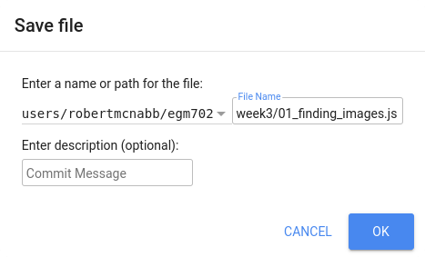

week 3 - introduction to google earth engine
============================================

.. raw:: html

    

.. role:: green

introduction
------------
In this practical, you'll get an introduction to using Google Earth Engine (GEE) for remote sensing analysis. Even if you have no prior experience with programming, you will be able to complete this practical. All of the programming steps have been provided for you in a script, and your task will be to run each step in turn and analyse and interpret the results.

GEE is "a cloud-based platform for planetary-scale geospatial analysis" (Gorelick et al., 2017\ [1]_). With it, users have access to a number of tools, including entire satellite archives, machine-learning algorithms for classification, and computational power above what an average desktop user has access to.

getting started
---------------

To begin, point your browser to https://code.earthengine.google.com. If you are not already logged in, log in using your GEE account. You should see something like this:

.. image:: ../../../img/egm702/week3/annotated_window.png
    :width: 600
    :align: center
    :alt: the GEE console with annotations

Now, to import the intro script, follow `this link <https://code.earthengine.google.com/bfd35996ac6506fced87a4e1a0224ebd?noload=true>`__. It should open the following:

.. image:: ../../../img/egm702/week3/loaded_script.png
    :width: 600
    :align: center
    :alt: the gee window after loading the script

Click the red NEW button in the Script manager, and select **Repository**. Call the repository ``egm702``, and then click **Create**. Next, in the code editor, type your name after "Practical 3" – this will enable you to save the script to your new repository. Call it ``practical3``, and click **OK** to save the script to the new repository.

running the script
------------------

Once you have saved the script, you should see the following in the code editor:

.. image:: ../../../img/egm702/week3/loaded_saved_script.png
    :width: 600
    :align: center
    :alt: the gee window after loading and saving the script

At the very top of the script, you should see two **imports**: ``boundary``, a rectangle roughly corresponding to our study area, and
``gifBoundary``, a rectangle roughly corresponding to the area impacted by the 1980 eruptions of Mt St Helens.
You should also notice that the script begins with a large block of comments (beginning and ending with ``/*`` and ``*/``):

.. code-block:: javascript

    /* EGM702 Practical 3.
    -----------------------------------------------------------------------------------------------------

    Introduction

    This script is intended to give you some experience working with Google Earth Engine,
    even if you have never done any computer programming before.
    You'll notice that all of the lines of this script, except the first step and the
    function definitions, are commented out - each line starts with a comment symbol, '//'
    run a command, you'll need to remove the comment symbol from the beginning of the line.

    -----------------------------------------------------------------------------------------------------
    */

In Javascript (the programming language used in the code editor interface), comments (that is, statements that the computer
won't process) are denoted by ``//`` (two forward slashes) if they are a single line comment. Multi-line, or block, comments, start
with ``/*`` and end with ``*/`` – anything in between these symbols will not be interpreted by the computer when the script is run.
In the GEE code editor, comments are coloured :green:`green`.

If you scroll down through the script, you should see a number of function definitions. Don't worry too much about these right
now – they're there to help make the code a bit easier to read/understand, and help to avoid re-writing the same lines of code
over and over again.

step 1. finding the best image in a given year
----------------------------------------------

The first lines to pay attention to look like this:

.. code-block:: javascript

    // -----------------------------------------------------------------------------------------------------
    // Step 1. Finding the best image in a given year.

    // Load Landsat 8 images
    // returns all LC08 surface reflectance images with < 20% cloud cover
    // from WRS path/row 46/28.
    var lc08 = ee.ImageCollection("LANDSAT/LC08/C01/T1_SR")
      .filterMetadata('CLOUD_COVER', 'less_than', 20)
      .filter(ee.Filter.eq('WRS_PATH', 46))
      .filter(ee.Filter.eq('WRS_ROW', 28));

These lines of code will take the entire Landsat 8 Collection 1 Surface Reflectance archive, remove any images with >20% cloud
cover, and return only those images whose WRS-2 Path/Row matches our current study area around Mt St Helens. For more
information on the WRS-2, see this link: https://landsat.gsfc.nasa.gov/about/worldwide-reference-system. It will then store a list
of these images in a variable called lc08.

The next set of lines will do the same thing, but this time using the Landsat 8 Collection 1 Top of Atmosphere (TOA) reflectance
archive:

.. code-block:: javascript

    // returns all LC08 TOA reflectance images with < 20% cloud cover
    // from WRS path/row 46/28.
    var lc08_toa = ee.ImageCollection("LANDSAT/LC08/C01/T1_TOA")
      .filterMetadata('CLOUD_COVER', 'less_than', 20)
      .filter(ee.Filter.eq('WRS_PATH', 46))
      .filter(ee.Filter.eq('WRS_ROW', 28));

For a refresher on the difference between Surface Reflectance and TOA reflectance, see here: https://www.usgs.gov/core-science-systems/nli/landsat/landsat-collection-1-surface-reflectance.

The following set of lines will return the image from these collections that has the lowest cloud cover, selecting only images
from 2020. It will also make sure to only select the coastal/visible/NIR/SWIR Landsat band layers (Bands 1-7).

.. code-block:: javascript

    // Find the least cloudy image from 2020, and clip it to the boundary.
    var sr_image = ee.Image((lc08)
      .filterBounds(boundary)
      .filterDate('2020-01-01', '2020-12-31')
      .select(['B[1-7]'])
      .sort('CLOUD_COVER')
      .first());

Now, we want to make sure that these images are the same image, just different processing levels (surface reflectance vs. TOA
reflectance). To check this, we can print the image names to the console:

.. code-block:: javascript

    // print the image name/date
    print('2020 SR Image Date: ', ee.Date(sr_image.get('SENSING_TIME')), sr_image);
    print('2020 TOA Image Date: ', ee.Date(toa_image.get('DATE_ACQUIRED')), toa_image);

And finally, we add the images to the map. We want them to be true-colour composites, so we display them with bands 4,3,2.
The TOA reflectance image will look a bit difference, so we use slightly different colour settings.

.. code-block:: javascript

    // add the best images from each collection to the Map as a true-color composite
    Map.addLayer(toa_image, {bands: ['B4', 'B3', 'B2'], max: [0.18, 0.22, 0.22], gamma: [0.95, 1.2, 1]}, 'TOA Image');
    Map.addLayer(sr_image, {bands: ['B4', 'B3', 'B2'], min: 100, max: 2000, gamma: 1.5}, 'SR Image');

    // center the image on Mt St Helens with a zoom level of 12
    Map.setCenter(-122.1886, 46.1998, 12);

At this point, you can run the script, either by pressing **CTRL + Enter**, or by clicking **Run** at the top of the code editor panel. Once
the script finishes running, you should see this:

.. image:: ../../../img/egm702/week3/loaded_image.png
    :width: 600
    :align: center
    :alt: the script after having added the image from step 1.

When you mouse over the **Layers** button in the upper right of the **Map** panel, you should see the two layer names (TOA Image
and SR Image). If you click on the gear icon, you can open the visualization parameters for each image and adjust them. You can
also adjust the transparency slider for the different layers displayed here, and by checking/unchecking the box next to the layer
name, you can make either image visible/invisible.

.. image:: ../../../img/egm702/week3/layer_parameters.png
    :width: 400
    :align: center
    :alt: the layer visualization settings

In the console panel, you should see the following:

.. image:: ../../../img/egm702/week3/console1.png
    :width: 400
    :align: center
    :alt: the output to the console after running Step 1.

This shows that the 2 images are the same image, just different processing levels. Now, in the **Map** panel, turn off the SR Image
to see the TOA Image underneath. What differences do you notice? Why do you think these layers look so different? Try
adjusting the colours for the TOA or the SR Image – you can start with a 98% stretch by clicking the **Custom** button in the
visualization parameters panel. Try different band combinations, too. For example, change the display bands to bands 7, 6, and
5, and apply a 98% stretch to both images. Do you notice more, or less of a difference for this band combination? Why do you
think that might be?

You can use the **Inspector** tab to look at different pixel or feature values for the layers in the map by clicking on the map. You
can also try this with different years or time periods – just replace the dates in the filtering step (note the format of YYYY-MM-
DD):

.. code-block:: javascript

    // Find the least cloudy image from some year, and clip it to the boundary.
    var sr_image = ee.Image((lc08)
      .filterBounds(boundary)
      .filterDate('YYYY-MM-DD', 'YYYY-MM-DD') // <- place your own dates here!
      .select(['B[1-7]'])
      .sort('CLOUD_COVER')
      .first());

Once you've looked around the area, move on to the next step.

step 2. add a dem, print statistics
-----------------------------------
Now that we've seen how we can search, add, and display Landsat images, let's take a look at some of the different DEMs
available within GEE. We'll start by adding the NASADEM, ALOS World 3D – 30 m (AW3D30) DEM, and the SRTM. For more
information on the different DEMs that GEE has available, check the data catalog here: https://developers.google.com/earth-
engine/datasets/tags/elevation. Uncomment the next block of lines to add these DEMs to the code editor:

.. code-block:: javascript

    // step 2. add a DEM, print statistics

    // add the AW3D30 (ALOS World DEM 30 m)
    var alos_dsm = ee.Image("JAXA/ALOS/AW3D30/V2_2")
      .clip(boundary)
      .select('AVE_DSM');

    // add the NASADEM
    var nasadem = ee.Image("NASA/NASADEM_HGT/001")
      .clip(boundary)
      .select('elevation');

    // add the SRTM
    var srtm = ee.Image("USGS/SRTMGL1_003")
      .clip(boundary)
      .select('elevation');

Note that the NASADEM and the SRTM both have a layer called ``'elevation'``, while the AW3D30 has a layer called ``'AVE_DSM'`` –
when working with other datasets, it's a good idea to check what the layer names are. To visualize the different layers, we can
produce a hillshade using the ``ee.Terrain.hillshade()`` function:

.. code-block:: javascript

    // add each DEM to the map as a hillshade with azimuth of 315 degrees
    Map.addLayer(ee.Terrain.hillshade(nasadem, 315), {}, 'NASADEM Hillshade');
    Map.addLayer(ee.Terrain.hillshade(alos_dsm, 315), {}, 'ALOS DSM Hillshade');
    Map.addLayer(ee.Terrain.hillshade(srtm, 315), {}, 'SRTM Hillshade');

The second argument to the function sets the azimuth to use when calculating the hillshade – here, I've set them all to be 315
degrees. If you run the code now, you should see this:

.. image:: ../../../img/egm702/week3/hillshade.png
    :width: 600
    :align: center
    :alt: the hillshade of the SRTM loaded in the map panel

The top layer will be the last one added to the Map; in this case, it's the SRTM hillshade. You can toggle between the different
layers to see the differences – what do you notice about the different DEMs? Do they look the same, or are there significant
differences?
Next, uncomment the following lines:

.. code-block:: javascript

    // calculate statistics
    var alos_stats = imgStats(alos_dsm, boundary, 'AVE_DSM');
    var nasa_stats = imgStats(nasadem, boundary, 'elevation');
    var srtm_stats = imgStats(srtm, boundary, 'elevation');

This will call the ``imgStats`` function defined at the top of the script, and calculate the median, mean, standard deviation, and minimum and
maximum elevation values in each of the different DEMs. Uncomment the next lines:

.. code-block:: javascript

    // print the statistics to the console
    print('ALOS Stats:', alos_stats);
    print('NASADEM Stats:', nasa_stats);
    print('SRTM Stats:', srtm_stats);

This will print the stats to the console. When you run the script now, you should see this in the console:

.. image:: ../../../img/egm702/week3/console2.png
    :width: 400
    :align: center
    :alt: the console panel after running step 2 of the script.

You can click the arrow next to each Object to expand it and see the results:

.. image:: ../../../img/egm702/week3/printed_stats.png
    :width: 400
    :align: center
    :alt: the stats printed to the console panel

Expand the stats for each of the DEMs. What do you notice about them – are there differences? Why do you think this might be?
Post your thoughts in the discussion forum on Blackboard.

Finally, uncomment the last block of code in this section to export the SRTM image:

.. code-block:: javascript

    Export.image.toDrive({image: srtm.select('elevation'),
      description: 'MtStHelens_SRTM',
      scale: 30,
      region: boundary,
      crs: 'epsg:32610',
      maxPixels: 1e12
    });

This will create a task to the SRTM elevation at 30 m resolution to a raster called MtStHelens_SRTM.tif, using a CRS with EPSG
code 32610 (corresponding to WGS84 UTM Zone 10N). You should notice that the Tasks tab is highlighted:

.. image:: ../../../img/egm702/week3/tasks.png
    :width: 400
    :align: center
    :alt: the console showing the tasks tab highlighted

When you click on it, you should see this:

.. image:: ../../../img/egm702/week3/new_task.png
    :width: 400
    :align: center
    :alt: the tasks tab

Click **RUN** to export the file to your Google Drive. In the window that opens up, you can choose a different folder, resolution, or
place to export it. In general, running the task might take some time, depending on the size of the image. You can click the
'Refresh' button to check the status to see if it's finished running.

step 3. band maths and charts
-----------------------------
In addition to displaying images and calculating statistics, we can also perform different calculations with images, such as
differencing them or calculating ratios. The first line in this section will subtract the NASADEM from the SRTM, and cast the
output as a floating point (decimal) value:

.. code-block:: javascript

    // subtract the NASADEM from the SRTM, and cast the output as a floating point (decimal)
    var nasa_srtm = srtm.float().subtract(nasadem);

To visualize this, we can create a chart of the differences directly within GEE. There are a number of different options; for a DEM
difference, a histogram seems like the appropriate choice:

.. code-block:: javascript

    var hist = ui.Chart.image.histogram({image: nasa_srtm,
      region: boundary,
      scale: 30, 
      maxBuckets: 256,
      maxPixels: 1e9})
      .setOptions({
        title: 'Difference between SRTM and NASADEM elevation',
        hAxis: {title: 'elevation difference (m)', titleTextStyle: {italic: false, bold: true}},
        vAxis: {title: 'number of pixels', titleTextStyle: {italic: false, bold: true}}
      });

This will calculate a histogram of the elevation differences with up to 256 bins. Finally, we can print the chart to the console,
calculate statistics of the differences between the DEMs, and run the nmad() function defined earlier. Uncomment the last few
lines in this section, then run the code:

.. code-block:: javascript

    print(hist);
    print('dH statistics: ', imgStats(nasa_srtm, boundary, 'elevation'));
    print('NMAD: ', nmad(nasa_srtm, boundary, 'elevation'));

You should see the following in the console:

.. image:: ../../../img/egm702/week3/histogram.png
    :width: 600
    :align: center
    :alt: the histogram showing the differences between the NASADEM and the SRTM DEM.

If you click the symbol in the upper right corner of the histogram, it will open in a new browser window. On this page, you can
also download a csv file with the values in the plot, or a Scalable Vector Graphics (SVG) or PNG version of the chart.
Look at the statistics of the DEM differences – what do you notice about the differences? Based on the histogram that you see,
is the standard deviation an appropriate metric to describe the variation in the data? Again, post any thoughts/questions you
have to the discussion board.

step 4. search all of the images, make an animated gif
------------------------------------------------------
In the last part of the practical, we'll gather all of the cloud-free Landsat images over Mt St Helens, and make an animated gif
showing the changes over time. Because we're using all of the different Landsat sensors (MSS, TM, ETM+, and OLI), we'll use a
near-infrared false colour composite for consistency.
The first lines in this section set the visualization parameters for the MSS scenes and the other sensors:

.. code-block:: javascript

    // set visualization parameters for the MSS scenes
    var mssVisParams = {
      bands: ['B6', 'B5', 'B4'],
      min: 10,
      max: 120,
      gamma: 1.5
    };

    // set visualization parameters for all of the other sensors
    var srVisParams = {
      bands: ['B4', 'B3', 'B2'],
      min: 0,
      max: 5000,
      gamma: 1.25
    };

When we create the animated gif at the end of the script, this will tell the computer how to display them in the output gif. The
next lines will select all cloud-free MSS scenes that have an acceptable geometric accuracy (<25 m error) :

.. code-block:: javascript

    var mss = ee.ImageCollection("LANDSAT/LM01/C01/T1")
      .merge(ee.ImageCollection("LANDSAT/LM01/C01/T2"))
      .merge(ee.ImageCollection("LANDSAT/LM02/C01/T1"))
      .merge(ee.ImageCollection("LANDSAT/LM02/C01/T2"))
      .merge(ee.ImageCollection("LANDSAT/LM03/C01/T1"))
      .merge(ee.ImageCollection("LANDSAT/LM03/C01/T2"))
      .filterMetadata('CLOUD_COVER', 'equals', 0)
      .filter(ee.Filter.or(
        ee.Filter.eq('DATA_TYPE', 'L1TP'),
        ee.Filter.eq('DATA_TYPE', 'L1GT'))) // only use L1TP and L1GT images
      .filterMetadata('GEOMETRIC_RMSE_MODEL', 'less_than', 25) // remove any large-distortions
      .filterMetadata('WRS_ROW', 'equals', 28) // select only WRS row 28 images
      .filterBounds(boundary).select(['B[4-6]']); // select bands 4, 5, and 6.

The next block of lines will repeat this for Landsat 5 TM and Landsat 7 ETM+ scenes, then select only cloud-free Landsat 8
scenes. Once we have lists for each of these sensors, we'll merge the results and sort them:

.. code-block:: javascript

    // sort the MSS scenes by acquisition time.
    var mssSorted = mss.sort('system:time_start');

    // merge and sort the other Landsat scenes.
    var landsatSorted = lt05
      .merge(le07)
      .merge(mosaicByDate(lc08.select(['B3', 'B4', 'B5'], ['B2', 'B3', 'B4']), 'LC08'))
      .sort('system:time_start');

After we have the images sorted, we can create the visualization images and merge the two collections into one:

.. code-block:: javascript

    // make RGB images to display for each of the MSS scenes
    var mssVis = mssSorted.map(function(img){
      return img.visualize(mssVisParams).clip(boundary);
    });

    // make RGB images to display for each of the other sensors
    var landsatVis = landsatSorted.map(function(img){
      return img.visualize(srVisParams).clip(gifBoundary);
    });

    // now, merge the MSS and other sensors.
    var visAll = mssVis.merge(landsatVis);

Finally, we'll set the parameters for the animated gif and create a link to trigger processing for the gif. This will make a gif that is
scaled so that the longest dimension is 425 pixels. The images will be cropped to the gifBoundary polygon defined at the top of
the script, and displayed using a pseudo-Mercator projection (EPSG:3857), which is the same one used by Google Maps.

.. code-block:: javascript

    var gifParams = {
      'region': gifBoundary,
      'dimensions': 425,
      'crs': 'EPSG:3857',
      'framesPerSecond': 3
    };

    // print a URL to start processing the gif.
    print(visAll.getVideoThumbURL(gifParams));

At this time, you can run the script one final time. In the console, you should see a link at the bottom:

.. image:: ../../../img/egm702/week3/console_link.png
    :width: 400
    :align: center
    :alt: the link to the animated gif, printed to the console

Click this link to create the gif. Once it finishes processing and loads the gif, you can download the gif by right-clicking the image
and clicking 'save'. 

Watch the gif – what changes do you see? You should see a number of different things happen, including the
initial 1980 eruption, as well as subsequent eruptions. By the end of the gif, you should see that a great deal of vegetation has
started to recover. In next week's practical, we'll work on additional analyses using GEE, including change analysis and plotting
time series of values.

references
----------

.. [1] Gorelick, N., M. Hancher, M. Dixon, S. Ilyushchenko, D. Thau, and R. Moore (2017). Google Earth Engine: Planetary-scale geospatial analysis for everyone. *Rem. Sens. Env.* 202, 18-27. doi: `10.1016/j.rse.2017.06.031 <https://doi.org/10.1016/j.rse.2017.06.031>`__

