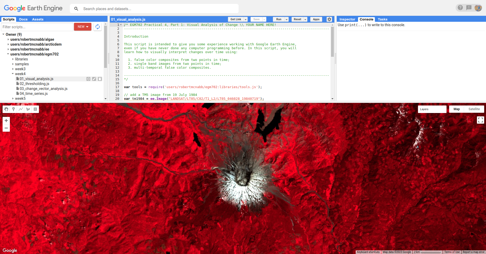
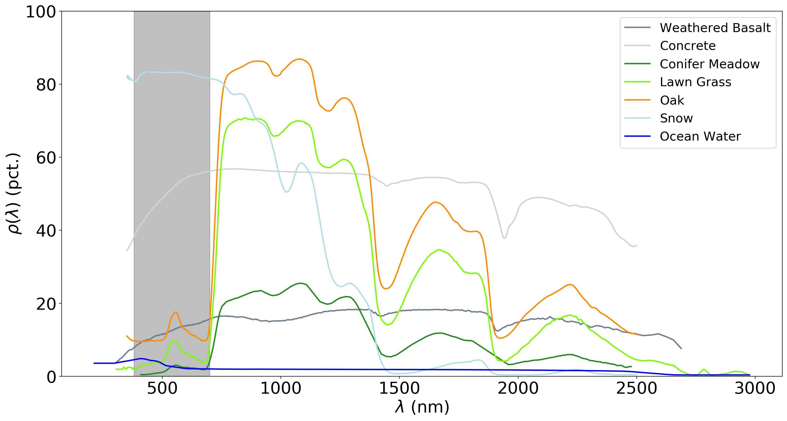

change detection in earth engine
=========================================

In this practical, we'll build on :doc:`week 3 <week3>`'s introduction to GEE and image analysis by seeing ways that
we can use GEE for change detection and analysis. Just like last week, you should be able to do finish the practical
even if you have no prior experience with programming. All of the programming steps have been provided for you in a
collection of scripts, and your task will be to run each script and analyze/interpret the results.

getting started
---------------

To begin, point your browser to https://code.earthengine.google.com, and log in if you need to. In the
**Script manager** under **Reader**, find the ``egm702`` repository, and click on ``week4`` to expand the week 4
folder.

Just like for week 3, the practical exercises are divided into a number of different scripts, labeled in order. For
week 4, the scripts are:

- ``01_visual_analysis.js``
- ``02_thresholding.js``
- ``03_change_vector_analysis.js``
- ``04_time_series.js``

In the **Script manager**, open the script for part 1 by clicking on ``week4/01_visual_analysis.js``.

Remember that you have access to all of the scripts in the repository as a *Reader*, but in order to save any changes
you'll need to save the script to your own repository. Again, the easiest way for you to do this is to replace
"YOUR NAME HERE!" on line 1 with your name, then click **Save**.

Save the script to your ``egm702`` repository as ``week4/01_visual_analysis.js`` - just like last week, you should
see a ``week4`` folder appear in the repository with a new script, ``01_visual_analysis.js``.

As you work your way through the practical, remember to save each script in this way, so that any changes you make to
the scripts are saved in your repository.

part 1 - visual analysis
--------------------------

In the first part of this practical, we'll see how we can analyze change visually by comparing:

- false-color composite images from different dates
- individual bands from different dates
- multi-temporal false color composites

The two images we will use are a Landsat 5 Thematic Mapper (TM) image acquired 19 July 1984, and a Landsat 5 TM image
acquired 30 July 2011:

.. code-block:: javascript

    // add a TM5 image from 19 July 1984
    var tm1984 = ee.Image("LANDSAT/LT05/C02/T1_L2/LT05_046028_19840719");
    tm1984 = tools.oliRescale(tm1984); // rescale to surface reflectance values

    // add a TM5 image from 30 July 2011
    var tm2011 = ee.Image("LANDSAT/LT05/C02/T1_L2/LT05_046028_20110730");
    tm2011 = tools.oliRescale(tm2011); // rescale to surface reflectance values

Run the script. You should see the following in the **Map**:

.. image:: ../../../img/egm702/week4/visual_1984.png
    :width: 600
    :align: center
    :alt: a 1984 Landsat image showing the area around Mt St Helens

This is a NIR/Red/Green false color composite (TM Bands 4, 3, 2), something that we have seen before. You should see
that in this color composite, vegetation appears red, water appears black, and soil/bedrock is shades of brown.

This image is from July 1984, approximately the same time as the air photos that you worked with in
:doc:`week 1 <week1>`. At this time, we can see that much of the vegetation on the north side of the volcano has been
removed as a result of the eruption.

Now, toggle the ``2011 SR`` layer on from the **Layers** menu. You should see the following image:

part 2 - spectral indices and thresholding
--------------------------------------------

part 3 - change vector analysis
---------------------------------

For this part of the practical, we’re going to look at the post-eruption recovery using Landsat 5 TM images from 1984 and 2011.
Uncomment the first part of this section (remove the ``/*`` from line 328 and the ``*/`` from line 336):

.. code-block:: javascript

    // select two surface reflectance images, one from 1984 and one from 2011.
    var tm1984 = ee.Image("LANDSAT/LT05/C02/T1_L2/LT05_046028_19840719")
      .select('SR_B.').multiply(0.0000275).add(-0.2).clip(boundary);
    var tm2011 = ee.Image("LANDSAT/LT05/C02/T1_L2/LT05_046028_20110730")
      .select('SR_B.').multiply(0.0000275).add(-0.2).clip(boundary);

Run the script, and have a look at the two images – what do you notice? What changes stand out the most in between the two
images? You might notice that the area North of the peak has regained some vegetation since the 1980 eruptions, or you may
notice some areas of clear-cutting in the surrounding forests.

To investigate these changes, we’re going to use change vector analysis (CVA). While CVA can be used for any number of band
differences, we’re going to stick to the differences in NIR and Red reflectance between the two images.

Once you’ve looked around the two images and observed some of the changes, uncomment the next block of code
(remove the ``/*`` from line 337 and the ``*/`` from line 368), which will
compute the difference between the two images and select the NIR and Red bands. It will also calculate the magnitudes and
angles of the change vectors, and re-classify the angles so that the values in the image correspond to the quadrant the angle
falls in.

.. code-block:: javascript

    // compute the difference between the two images, and select bands 4 and 3 (NIR and Red)
    var diff = tm2011.subtract(tm1984).select(['SR_B4', 'SR_B3']);

    // compute the magnitude of the change vectors as the square root of the
    // sum of the squared differences.
    var magnitude = diff.pow(2).reduce(ee.Reducer.sum().unweighted()).sqrt().rename('magnitude');

    // compute the angle of the change vectors and convert to degrees
    var angle = diff.select('SR_B3').atan2(diff.select('SR_B4'))
      .multiply(180).divide(Math.PI).rename('angle');

    // create a reclassified image of the angles, with the value set to the quadrant
    // each angle range corresponds to.
    var angleReclass = ee.Image(1)
              .where(angle.gt(0).and(angle.lte(90)), 1)
              .where(angle.gt(90).and(angle.lte(180)), 2)
              .where(angle.gt(-90).and(angle.lte(0)), 4)
              .where(angle.gt(-180).and(angle.lte(-90)), 3).clip(boundary);

The next line will mask the reclassified image so that only large changes (magnitude greater than 200) are shown:

.. code-block:: javascript

    // threshold the reclass image by changes w/ magnitude greater than 0.06
    angleReclass = angleReclass.updateMask(magnitude.gte(0.06));

The final block of code will add the difference,magnitude, angle, and re-classified angle images to the map:

.. code-block:: javascript

    Map.addLayer(diff, {bands: 'SR_B4', min: -0.25, max: 0.25,
      palette: ['7b3294','c2a5cf','f7f7f7','a6dba0','008837']}, 'difference', false);
    Map.addLayer(magnitude, {min: 0.02, max: 1.36,
      palette: ['f1eef6','d7b5d8','df65b0','dd1c77','980043']}, 'magnitude', false);
    Map.addLayer(angle, {min: -180, max: 180,
      palette: ['e66101','fdb863','f7f7f7','b2abd2','5e3c99']}, 'angle', false);

    Map.addLayer(angleReclass, {palette: ['ff0000','ffffff','0014ff','cc00ff']}, 'reclass angle');

Run the script – you should see this image (you may have to turn off the Landsat scenes first):

.. image:: ../../../img/egm702/week4/angle_reclass.png
    :width: 600
    :align: center
    :alt: the reclassified angle image

|br| In this image, red colors correspond to increases in both NIR and Red reflectance, white corresponds to increases
in NIR and decreases in Red reflectance, purple corresponds to decreases in NIR and increases in Red reflectance, and
blue corresponds to decreases in both NIR and Red reflectance. You can also consult the diagram shown below:

.. image:: ../../../img/egm702/week4/change_vector.png
    :width: 400
    :align: center
    :alt: a diagram showing how the colors of the reclassified image correspond to the change vector angles

In a number of areas, the blue color represents forest growth. To understand why this is, we have to remember both what
these changes represent – a decrease in both Red and NIR reflectance – and also what the forest is replacing: in many cases,
grassy meadows or new-growth trees, both of which tend to have higher spectral reflectance than conifer forests:

See if you can work out what some of the other differences represent – remember that some changes might represent more
than one kind of change. You can also try looking at the angle image and interpreting it more directly, or changing the
reclassification to represent more angle ranges.

part 4 - time series
----------------------

The final portion of this practical will cover how we can get time series of data from images and visually inspect the results.
To get started, uncomment this section (remove the ``/*`` from line 371 and the ``*/`` from line 431). The
first part of this section declares a variable, ``ndvi_patches``, that is made up of individual polygons imported at the top of the
script:

.. code-block:: javascript

    var ndvi_patches = ee.FeatureCollection([fastRegrowth, slowRegrowth,
      forest, oldClearCut, newClearCut]);

The next sections of code here deal with loading Landsat images and filtering based space and cloud cover, similar to what we
have done in previous steps. After this section, these lines of code:

.. code-block:: javascript

    // combine tm, etm+, oli, and mss images, add an NDVI band, and sort by date.
    var allNDVI = mss.map(mssNDVI).merge(tm.merge(oli).map(getNDVI))
      .select('NDVI').sort('system:time_start');

merge the MSS, TM, ETM+, and OLI image collections, calculate the NDVI for each image, and sort by acquisition date. The next lines:

.. code-block:: javascript

    // plot a chart of the mean ndvi values, calculated using different polygons
    // representing different landcover areas
    var ndviChart = ui.Chart.image
      .seriesByRegion({
        imageCollection: allNDVI,
        regions: ndvi_patches, // average using the features in each ndvi patch
        reducer: ee.Reducer.mean(),
        seriesProperty: 'label', // use the label values to plot individual series
        scale: 100,
        xProperty: 'system:time_start'})
      .setOptions({
        title: 'Mean NDVI',
        hAxis: {title: 'date', titleTextStyle: {italic: false, bold: true}},
        vAxis: {title: 'ndvi value', titleTextStyle: {italic: false, bold: true}},
        curveType: 'function'})
      .setSeriesNames(['ndvi']);
    print(ndviChart);

will plot the average values for each of the individual polygons in ``ndvi_patches``. You can see what this looks like below. Note
that some of the apparent lack of seasonality before about 2000 is mostly a result of the lower temporal resolution – Landsat
acquisitions were often limited during this time, and so some years will only have a few available images.

If you open the chart (click on the icon in the upper right-hand corner), you can export the data as a CSV file for further analysis.

You can also add (or remove) polygons from the plot. To add your own polygon, you can use the digitizing tools located in the
upper left-hand corner of the map panel:

.. image:: ../../../img/egm702/week4/digitizing_tools.png
    :width: 600
    :align: center
    :alt: the digitizing tools panel highlighted

Be sure to start the polygon as a new layer (click on **+ new layer** at the bottom of the **Geometry Imports** panel):

.. image:: ../../../img/egm702/week4/geometry_imports_panel.png
    :width: 600
    :align: center
    :alt: the geometry imports panel expanded

Next, start digitizing a polygon – try to make sure that the polygon represents one type of area. Remember that you can use the
Landsat images, as well as the background satellite images, to help you. From the **Geometry Imports** panel, click the gear icon
next to your new layer to change the properties:

.. image:: ../../../img/egm702/week4/configure_import1.png
    :width: 300
    :align: center
    :alt: the configure geometry import panel

Change the name to something other than ``geometry`` (or ``example``), then change it to **Import as** a ``Feature``, and click to add
property to the feature. Call it ``label``, and add a value for the label.

.. image:: ../../../img/egm702/week4/configure_import2.png
    :width: 300
    :align: center
    :alt: the configure geometry import panel

Click **OK**, then digitize your polygon (if you haven’t already). Note that each feature can only contain a single polygon – to add
multiple polygons, you’ll need to create multiple features. You can then update ``ndvi_patches`` and re-run the script to update
the chart:

.. image:: ../../../img/egm702/week4/updated_ndvi_timeseries.png
    :width: 600
    :align: center
    :alt: the ndvi time series with the new polygon layer added

Feel free to try different polygons, and examine the different time series plots – try using the CVA angle map to help you decide
areas to look further into.

This is the end of this Practical – next week, we’ll look into using Earth Engine to do some more advanced classification
techniques, and run an accuracy analysis on the results.

next steps
------------

notes and references
----------------------

