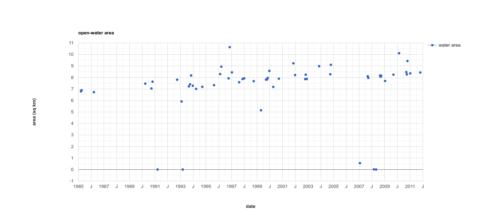

change detection in earth engine
=========================================

In this practical, you’ll get an introduction to using Google Earth Engine (GEE) to do change detection and analysis. Just like last
week, you should be able to do finish the practical even if you have no prior experience with programming. All of the
programming steps have been provided for you in a script, and your task will be to run each step in turn and analyse and
interpret the results.

getting started
---------------

To begin, point your browser to https://code.earthengine.google.com, and log in if you need to. 

In addition to all of the publicly available datasets, Earth Engine allows you to upload your own datasets (called *assets*) 
to work with in the Earth Engine code editor.

As part of this practical, we’ll upload the lake shapefiles we used in the Week 2 practical, 
which you can download in zipped form from the Week 4 Practical folder on Blackboard, or by clicking the links below:

- :download:`1979 Lake shapefile <../../../files/1979_shapes.zip>`
- :download:`1984 Lake shapefile <../../../files/1984_shapes.zip>`

importing assets
----------------

In the upper right panel, click on the **Assets** tab:

.. image:: ../../../img/egm702/week4/assets_tab.png
    :width: 300
    :align: center
    :alt: the assets tab

Click on **New**, then **Table Upload** > **Shape files**:

.. image:: ../../../img/egm702/week4/upload_asset.png
    :width: 300
    :align: center
    :alt: uploading a shapefile asset

Click **Select**, then navigate to the **1979_shapes.zip** file that you’ve downloaded. If you like, you can re-name the file that
this asset will be saved as. Leave the other options as they are, and click **Upload**. 

Repeat this step for the **1984_shapes.zip** file. It may take a few minutes for the files to upload and be ingested 
into Earth Engine – you should see a notification in the **Tasks** tab that the ingestion has started. 

Once it is complete, you should see the files listed under your username in the **Assets**
tab, along with checkmarks next to the ingest tasks in the **Tasks** tab:

.. image:: ../../../img/egm702/week4/ingesting_shapefile.png
    :width: 600
    :align: center
    :alt: the gee window with the shapefiles being ingested 

You can click on the asset names to open up a summary of the layer, including a preview of the features contained in the
shapefile:

.. image:: ../../../img/egm702/week4/layer_summary.png
    :width: 600
    :align: center
    :alt: the summary of the 1979 shapes layer

Now, to import the intro script, follow `this link <https://code.earthengine.google.com/fbaf560296993ea3c35d7cff980fe417?noload=true>`__ 
to find the script for this week’s practical. Once again, type your name after "Practical 4" on the first line, then click the 
**Save** button in the code editor to your egm702 repository that you created last week. 

Finally, we’ll need to import the assets that we uploaded, so that we can use them in the script. To do this, you can hover your cursor 
over the asset name in the **Assets** tab, then click the arrow icon:

.. image:: ../../../img/egm702/week4/asset_selection.png
    :width: 300
    :align: center
    :alt: selecting an asset from the assets tab

You can also click on the asset name to open the properties window, then click **Import**. Do this for the ``1979_shapes`` file first – you 
should see a new line under the **Imports** at the top of the script:

.. image:: ../../../img/egm702/week4/imported_asset.png
    :width: 400
    :align: center
    :alt: the first shapefile added to the imports list

Re-name the import by clicking on ``table``, and call it ``lakes1979``.

Repeat this for the 1984 shapefile, calling it ``lakes1984``. Your imports should now look like this:

.. image:: ../../../img/egm702/week4/imported_asset2.png
    :width: 400
    :align: center
    :alt: the second shapefile added to the imports list

Have a look over the function definitions – I’ll explain more about each of them as we go, but feel free to look through them and
try to get a feeling for how they work.

step 1. finding images
----------------------

In addition to searching an entire image collection and finding images based on properties (i.e., cloud cover), we can also load
images directly using their ID:

.. code-block:: javascript

    // select images using their Landsat ID, clip to our study area boundary,
    // and re-name the MSS bands to make it easier to work with both TM and MSS images.
    var mss1979 = ee.Image("LANDSAT/LM02/C01/T2/LM02_049028_19790719").clip(boundary)
      .select(['B4', 'B5', 'B6'], ['B2', 'B3', 'B4']); // rename B4 to B2, B5 to B3, B6 to B4
    var mss1980 = ee.Image("LANDSAT/LM02/C01/T2/LM02_049028_19800905").clip(boundary)
      .select(['B4', 'B5', 'B6'], ['B2', 'B3', 'B4']); // rename B4 to B2, B5 to B3, B6 to B4

In this case, we’re loading two Landsat 2 MSS scenes: ``LM02_049028_19790719`` and ``LM02_049028_19800905``.

Landsat scene IDs in GEE have the following form: ``LXXX_PPPRRR_YYYYMMDD``, where ``XXX`` denotes the sensor name (e.g., ``M02`` for
Landsat 2 MSS) , ``PPP`` denotes the WRS path (``049``), ``RRR`` denotes the WRS row (``028``), and ``YYYYMMDD`` is the acquisition date 
in year-month-day format.

In addition to loading the images by name, we’re clipping these to a boundary surrounding our area of interest
(``.clip(boundary)``). You should also notice this: (``.select([‘B4’, ‘B5’, ‘B6’], [‘B2’, ‘B3’, ‘B4’])``). This
will take MSS Band 4 (visible green) and re-name it to Band 2, MSS Band 5 (visible red) and re-name it to Band 3, and MSS Band
6 (near infrared) and re-name it to Band 4. 

By re-naming the MSS bands this way, we can make them consistent with Landsat TM and ETM+ scenes, which we will use to look at a time
series of Normalized Difference Vegetation Index (NDVI) values later on in the practical.

In this section, we are also loading a 1984 Landsat 5 TM scene and a 2020 Landsat 8 OLI scene, and adding each of these layers
to the map:

.. code-block:: javascript

    Map.addLayer(mss1979, {bands: ['B4', 'B3', 'B2'], min: 0, max: 255}, '1979 MSS', false);
    Map.addLayer(mss1980, {bands: ['B4', 'B3', 'B2'], min: 0, max: 255}, '1980 MSS', false);
    Map.addLayer(tm1984, {bands: ['SR_B4', 'SR_B3', 'SR_B2'], min: 0.05, max: 0.45}, '1984 TM', false);
    Map.addLayer(oli2020, {bands: ['SR_B5', 'SR_B4', 'SR_B3'], min: 0.05, max: 0.45}, '2020 OLI', false);

Run the script – you should notice that the map has moved to center on the volcano, but no layers have loaded. This is because
of the ``false`` argument at the end of the ``addLayer`` statement. Rather than adding lots of visible layers at one time, and slowing
down the loading, we can choose to add layers to the map without showing them.

You can toggle each of the layers to visible using the **Layers** menu in the map panel:

.. image:: ../../../img/egm702/week4/layers_menu.png
    :width: 600
    :align: center
    :alt: the layers menu highlighted in the map panel

Or, you can replace ``false`` with ``true`` for each layer and re-run the script – note that this will most likely increase the amount of
time it takes to run the script.

step 2. band maths
------------------
In the lectures from the past 2 weeks, we’ve discussed using band maths to help enhance images and help us identify different
features. One of the techniques discussed was the Normalized Difference Water Index (NDWI\ [1]_), which can be
used to identify water bodies in a satellite image.

The NDWI (for water bodies; there is also an NDWI for water content in vegetation) is the normalized difference between 
the near-infrared reflectance and the visible green reflectance. At the beginning of the script, I have defined a function
to calculate this given a satellite image:

.. code-block:: javascript

    // calculate the normalized difference water index (McFeeters, 1996), which helps to identify
    // water bodies in a satellite image.
    function ndwi(img){
      var nir = img.select('B4'); // return the NIR band for a landsat 1-7 scene.
      var green = img.select('B2'); // return the visible green band for a landsat 1-7 scene.
      
      // calculate the NDWI (Green - NIR) / (Green + NIR), and re-name the layer NDWI
      return green.subtract(nir).divide(green.add(nir)).rename('NDWI'); 
    }

Uncomment the code in Step 2 (remove the ``/*`` from line 181 and the ``*/`` from line 199). You
should see the following block of code:

.. code-block:: javascript

    // calculate the NDWI for the 1979 and 1980 MSS scenes, using the function defined above.
    var ndwi1979 = ndwi(mss1979);
    var ndwi1980 = ndwi(mss1980);

    // add each ndwi image to the map, using the ndwi visualization palette defined above.
    Map.addLayer(ndwi1979, ndwiVis, '1979 NDWI', false);
    Map.addLayer(ndwi1980, ndwiVis, '1980 NDWI', false);

This will calculate the NDWI for each of the MSS scenes, and add the results to the Map panel. Run the script, and then toggle
the 1979 NDWI image to be visible:

.. image:: ../../../img/egm702/week4/1979_ndwi.png
    :width: 600
    :align: center
    :alt: the 1979 ndwi image

You should see the lakes highlighted as a dark blue color, while the rest of the image is shades of green and lighter blue. Next,
look at the 1980 image:

.. image:: ../../../img/egm702/week4/1980_ndwi.png
    :width: 600
    :align: center
    :alt: the 1980 ndwi image

From the look of it, there’s a lot more standing water on the surface in the 1980 image than in the 1979 image, including a large
lake in the crater of the volcano. But is this really the case, or is there something else going on here? 

- Based on the visual results here, do you think that assuming that the same NDWI value will always represent water in both images?
- Based on the topics covered so far in the lectures and your reading, can you think of some ways that we could try to improve the results here? Remember that the MSS scenes are not surface reflectance, which means that there may still be atmospheric influence.

step 3. thresholding images
---------------------------

Uncomment the first group of lines here (remove the ``/*`` from line 201 and the ``*/`` from line 217), and run the script to plot histograms of the NDWI values for the two MSS images:

.. code-block:: javascript

    var hist1979 = histPlot(ndwi1979, boundary);
    hist1979.setOptions({
      title: '1979 NDWI Values ',
      hAxis: {title: 'NDWI value', titleTextStyle: {italic: false, bold: true}},
      vAxis: {title: 'number of pixels', titleTextStyle: {italic: false, bold: true}},
    });
    print(hist1979);

    var hist1980 = histPlot(ndwi1980, boundary);
    hist1980.setOptions({
      title: '1980 NDWI Values ',
      hAxis: {title: 'NDWI value', titleTextStyle: {italic: false, bold: true}},
      vAxis: {title: 'number of pixels', titleTextStyle: {italic: false, bold: true}},
    });
    print(hist1980);

This will produce the following two histograms:

.. image:: ../../../img/egm702/week4/1979_histogram.png
    :width: 49%
    :alt: the histogram of ndwi values for the 1979 image

.. image:: ../../../img/egm702/week4/1980_histogram.png
    :width: 49%
    :alt: the histogram of ndwi values for the 1980 image

You should notice that the 1979 histogram (left) has a much lower peak value, around -0.4, while the 1980 histogram (right) has a peak around -0.05,
and is also bimodal to an extent. The 1980 histogram also has a much wider spread of values, while the 1979 histogram has a much taller peak. 

All of this suggests that if we were to use the same threshold values for both scenes, we would end up with significantly more mis-
classification in the 1980 image - that is, we would incorrectly classify a lot of shadows as water.

Uncomment the next set of lines (remove the ``/*`` from line 218 and the ``*/`` from line 228) and re-run the script:

.. code-block:: javascript

    // create a feature collection (vector) representation of areas classified as water
    // using the ndwi and a threshold.
    var watermask1979 = getWaterMask(mss1979, 0.15);
    var watermask1980 = getWaterMask(mss1980, 0.45);

    Map.addLayer(watermask1979, {color: '1000ff'}, '1979 water mask', true);
    Map.addLayer(watermask1980, {color: '0099ff'}, '1980 water mask', false);
    Map.addLayer(lakes1979, {color: '6699ff'}, '1979 Lakes', true);
    Map.addLayer(lakes1984, {color: 'cc66ff'}, '1984 Lakes', false);

Will create a feature collection (vector dataset) representation of the areas classified as water in the two MSS images. The function
uses the threshold values (0.15 for the 1979 image, 0.45 for the 1980 image) to determine which pixels are classified as water,
and which pixels are classified as "not water." All pixels with an NDWI value greater than or equal to the given threshold value are classified as water,
while any pixel with an NDWI value below the given threshold are classified as "not water."

Start by comparing the outlines in **lakes1979** with the **watermask1979** layer by toggling **lakes1979** to be visible.
How do they compare? Are there any obvious areas of misclassification? Can we improve on the initial result here?

.. image:: ../../../img/egm702/week4/water_layer.png
    :width: 600
    :align: center
    :alt: the vector layer of water bodies

Go ahead and try different thresholds by changing the value of 0.15 in this line:

.. code-block:: javascript

    var watermask1979 = getWaterMask(mss1979, 0.15);

Remember that you can use the **Inspector** tab to get pixel/layer values by clicking on the
map. You can also use the histograms to help you determine suitable thresholds, and compare the results visually with the two
images (you’ll have to toggle them to visible using the **Layers** panel), or even with the background map or satellite images
(though remember that things have most likely changed a lot in the past 40 or so years).

Try the same exercise with the 1980 image. Are there other threshold values that give better results, at least through
visual comparison?

When you are satisfied with the results, uncomment these lines of code (remove the ``/*`` from line 229 and the ``*/`` from line 236)
to export your 1979 water mask to a shapefile:

.. code-block:: javascript

    // export the 1979 water mask to a shapefile
    Export.table.toDrive({
      collection: watermask1979,
      description: 'waterMask1979',
      fileFormat: 'SHP'
    }); 

This will create a task in the **Tasks** tab that will allow you to save the file to your Google Drive, where you will be able to
download it to your computer and use it in your GIS software.

When you have finished this section, you can re-comment it, or leave it uncommented as you move on to the other sections. Remember that
if you leave it uncommented, it may increase the amount of time it takes to run the script.

step 4. summary statistics with features
----------------------------------------

Looking at Spirit Lake in the 1980 and 1984 images, you should notice that the lake is covered by a large number of floating trees
(you can see this in even more detail by turning on the high-resolution satellite image in the background and zooming in):

.. image:: ../../../img/egm702/week4/spiritlake_1980.png
    :width: 49%
    :alt: spirit lake in the 1980 landsat image

.. image:: ../../../img/egm702/week4/spiritlake_1984.png
    :width: 49%
    :alt: spirit lake in the 1984 landsat image

These trees were knocked over in the 1980 eruption, and have been floating on the lake `ever since <https://earthobservatory.nasa.gov/images/149025/the-floating-logs-of-spirit-lake>`__.
Looking at the 2020 Landsat 8 OLI image, or the link in the previous sentence, you should notice that the trees are not always
in the same place – they move around over time. 

One question that you might ask, then, is: is the area of the lake covered by trees constant in time, or has it changed? 
This is a question that we can try to answer using some of the tools we have learned so far.

To start, uncomment the following lines (remove the ``/*`` from line 240 and the ``*/`` from line 251):

.. code-block:: javascript

    // select only Spirit Lake, using the 1984 outline:
    var spiritLake = lakes1984.filter(ee.Filter.inList('name', ['Spirit Lake']));

    // create a histogram chart of values in the NIR band for our 1984 image.
    var histChart = histPlot(tm1984.select('SR_B4'), spiritLake);
    histChart.setOptions({
      title: 'NIR Histogram',
      hAxis: {title: 'NIR value', titleTextStyle: {italic: false, bold: true}},
      vAxis: {title: 'number of pixels', titleTextStyle: {italic: false, bold: true}},
    });
    print(histChart);

This will select only the Spirit Lake outline from our 1984 outlines that we uploaded at the beginning of the practical, then make
a histogram of the NIR (Band 4) surface reflectance values from the pixels that fall within that outline:

From this, we can see a clear bimodal distribution (i.e., there are two peaks) in the NIR values. We can use this to choose a
threshold to help us segment (divide) the image, much the same way that we chose thresholds for the NDWI values earlier in
the practical. From the histogram above, you might guess that we could choose a threshold between 0.1 and 0.2, and it would
separate the two classes quite effectively.

To choose our threshold, we will use something called `Otsu’s method <https://learnopencv.com/otsu-thresholding-with-opencv/>`__\ [2]_. 
We will cover this a bit more next week, but in short: Otsu’s method helps us to choose the threshold between 'bright' and 'dark' pixels 
that maximizes the variance (e.g., the difference) between the two classes.

Uncomment the following lines of code (remove the ``/*`` from line 252 and the ``*/`` from line 266):

.. code-block:: javascript

    // create a histogram object to pass to our otsu function
    var histogram = tm1984.select('SR_B4').reduceRegion({
      reducer: ee.Reducer.histogram(255, 2)
        .combine('mean', null, true)
        .combine('variance', null, true),
      geometry: spiritLake,
      scale: 30,
      bestEffort: true});

    // get the otsu threshold for the NIR band
    var waterThresh = otsu(histogram.get('SR_B4_histogram'));

    print('Otsu threshold:', waterThresh);

Will create a histogram object (not a plot, but an array representing the frequency of each value) that we can pass to the ``otsu()``
function defined at the top of the script. This will create a chart, showing the inter-class variance as a function of the chosen
threshold value:

.. image:: ../../../img/egm702/week4/variance_vs_threshold.png
    :width: 600
    :align: center
    :alt: plot of inter-class variance as a function of threshold value

From this plot, we can see that indeed, the peak of the interclass variance is between 0.1 and 0.2 – in fact, the value printed to
the console should be 0.145 or so (the exact value may vary slightly). This is the threshold value we will use to differentiate
between open water and trees in the lake, and plot the area of open water as a function of time, to see whether the value is
changing over time, or whether it remains constant.

Uncomment the following lines of code (remove the ``/*`` from line 267 and the ``*/`` from line 309):

.. code-block:: javascript

    // get a collection of water masks for all landsat TM images, using our threshold value,
    // and making sure to only take images where we can see the whole lake cloud-free.
    var waterMasks = ee.ImageCollection("LANDSAT/LT05/C02/T1_L2")
      .filter(ee.Filter.eq('WRS_PATH', 46)) // select only WRS Path 46
      .filter(ee.Filter.eq('WRS_ROW', 28)) // select only WRS Row 28
      .map(function(image){return ee.Image(image).clip(geometry)}) //clip to a rough window
      .map(cloudPercentage) // find the cloudy pixels within our region of interest
      .filter(ee.Filter.lt('cloud_cover_roi', 1)) // select only cloud-free images within our ROI
      .map(function(image){
        var area = ee.Image.pixelArea();
        var mask = image.select('SR_B4')
          .multiply(0.0000275).add(-0.2) // scale the image to our 
          .lte(waterThresh).multiply(area).rename('waterMask');
        return image.addBands(mask);
      }) // mask pixels above the chosen threshold and multiply pixels by area
      .map(function(image){
        return ee.Image(image).clip(spiritLake).updateMask(image.select('waterMask'));
      }) // clip the image so that only the lake pixels are left
      .select('waterMask') // select the waterMask band
      .map(getWaterArea); // sum the valid (i.e., water) pixels to get the area

Will find all of the cloud-free Landsat 5 TM images over Spirit Lake (between 1984 and 2011) and calculate the area of pixels
classified as water using the threshold we calculated above. Yes, this is a very long, complicated, scary-looking chain of
commands - at the moment, you don't need to fully grasp what each individual step is doing (though you're welcome to have a go!) 

Instead, stop for a moment and imagine how much work it would take to do this "by hand" – you would need to:

- search through the entire Landsat catalog
- select images that are (mostly) cloud-free over your study area
- download potentially hundreds of images

Then, for each image, you would have to:

- clip the NIR band
- calculate the number of pixels that fall below the threshold value
- calculate the corresponding area of those pixels
- add each area to a table, along with the image acquisition date.

The downloading alone would probably take a few days (depending on your internet connection). Instead, you should get a result
here within a minute or so, and it takes up no space on your hard drive.

Once you've had a chance to reflect on this, the next set of commands will take the water area and date attributes from each image
and plot them as a series of points:

.. code-block:: javascript

    // get the image dates from our image collection
    var dates = waterMasks.toList(1000).map(function(item){
        return ee.Image(item).get('system:time_start');
      });

    // get the water area from the images in our image collection
    var waterArea = waterMasks.toList(1000).map(function(item){
        return ee.Image(item).get('water_area');
      });

    // plot the number of water pixels as a function of time
    var chart = ui.Chart.array.values({array: waterArea, axis: 0, xLabels: dates})
      .setSeriesNames(['water area'])
      .setOptions({
        title: 'open-water area',
        hAxis: {title: 'date', titleTextStyle: {italic: false, bold: true}},
        vAxis: {title: 'area (sq km)', titleTextStyle: {italic: false, bold: true}},
        curveType: 'function'
    });
    print(chart);

When it finishes running, you should see the following chart:

This is an interesting result – for one thing, it does look like the open-water area has been increasing since 1985. But, there are
some interesting features that we can see in the data as well – at quite a few points, there’s a clear minimum of ~0 km\ :sup:`2` of
open water, which then comes back up to ~7 km\ :sup:`2`\ ; there are also a few points where the open water area increases quickly before dropping
back down to ~7 km\ :sup:`2`\ .

This doesn’t seem particularly likely - the number of logs should be steadily decreasing as they sink or are removed from the lake - not fluctuating rapidly.

To work on understanding what’s happening, you can uncomment the following lines of code (remove the ``/*`` from line 310 and the ``*/`` from line 324):

.. code-block:: javascript

    var this_mask = waterMasks.toList(1000).get(6); // get the chosen mask from the list of masks
    var this_id = ee.String(ee.Image(this_mask).get('system:id')).getInfo(); // get the image ID

    var this_image = ee.Image(this_id); // get the image cooresponding to the ID
    print(this_image.get('DATE_ACQUIRED'), this_image); // print info about the chosen mask

    // add the selected landsat image to the map
    Map.addLayer(this_image.select('SR_B.').multiply(0.0000275).add(-0.2).clip(geometry),
      {bands: ['SR_B4', 'SR_B3', 'SR_B2'], min: 0.05, max: 0.45},
      'debug image', false); // change false to true to make this image visible

This will list each of the images that were used to create the water masks, then get the Landsat ID of the first drop to zero (an image from 17 March,
1991), which has an index in the list of water masks of 6. From the console, you can see the id of the 7\ :sup:`th` image (which has
index 6, as arrays in Javascript start counting from 0):

I have included a line to add this image to the map. To find other images, you can examine their dates by hovering your cursor
over the spikes on the plot above, then looking for those dates in the list of image IDs from the collection:

.. image:: ../../../img/egm702/week4/console_output_expanded.png
    :width: 400
    :align: center
    :alt: the console output showing the names of all of the images

Then change the index in this line to match the index from the list (e.g., to get the 10th mask, change the 6 to a 9):

.. code-block:: javascript

    var this_mask = waterMasks.toList(1000).get(6); // get the chosen mask from the list of masks

See if you can’t work out what’s going on here – if you get stuck, you can post your questions in the discussion forum. 

How would you go about fixing this issue? Don’t worry about the programming steps – at the moment, it’s more
important here to get an idea for what the pattern in the data is actually representing, and how you would try to address that, rather
than being able to work out the programming steps to actually solve the issue (that can come later).

Once you think you’ve managed to puzzle out what’s going on with the timeseries, move on to the next step.

step 5. change vector analysis
------------------------------

For this part of the practical, we’re going to look at the post-eruption recovery using Landsat 5 TM images from 1984 and 2011.
Uncomment the first part of this section (remove the ``/*`` from line 328 and the ``*/`` from line 336):

.. code-block:: javascript

    // select two surface reflectance images, one from 1984 and one from 2011.
    var tm1984 = ee.Image("LANDSAT/LT05/C02/T1_L2/LT05_046028_19840719")
      .select('SR_B.').multiply(0.0000275).add(-0.2).clip(boundary);
    var tm2011 = ee.Image("LANDSAT/LT05/C02/T1_L2/LT05_046028_20110730")
      .select('SR_B.').multiply(0.0000275).add(-0.2).clip(boundary);

Run the script, and have a look at the two images – what do you notice? What changes stand out the most in between the two
images? You might notice that the area North of the peak has regained some vegetation since the 1980 eruptions, or you may
notice some areas of clear-cutting in the surrounding forests. 

To investigate these changes, we’re going to use change vector analysis (CVA). While CVA can be used for any number of band 
differences, we’re going to stick to the differences in NIR and Red reflectance between the two images.

Once you’ve looked around the two images and observed some of the changes, uncomment the next block of code
(remove the ``/*`` from line 337 and the ``*/`` from line 368), which will
compute the difference between the two images and select the NIR and Red bands. It will also calculate the magnitudes and
angles of the change vectors, and re-classify the angles so that the values in the image correspond to the quadrant the angle
falls in.

.. code-block:: javascript

    // compute the difference between the two images, and select bands 4 and 3 (NIR and Red)
    var diff = tm2011.subtract(tm1984).select(['SR_B4', 'SR_B3']);

    // compute the magnitude of the change vectors as the square root of the 
    // sum of the squared differences.
    var magnitude = diff.pow(2).reduce(ee.Reducer.sum().unweighted()).sqrt().rename('magnitude');

    // compute the angle of the change vectors and convert to degrees
    var angle = diff.select('SR_B3').atan2(diff.select('SR_B4'))
      .multiply(180).divide(Math.PI).rename('angle');

    // create a reclassified image of the angles, with the value set to the quadrant
    // each angle range corresponds to.
    var angleReclass = ee.Image(1)
              .where(angle.gt(0).and(angle.lte(90)), 1)
              .where(angle.gt(90).and(angle.lte(180)), 2)
              .where(angle.gt(-90).and(angle.lte(0)), 4)
              .where(angle.gt(-180).and(angle.lte(-90)), 3).clip(boundary);

The next line will mask the reclassified image so that only large changes (magnitude greater than 200) are shown:

.. code-block:: javascript

    // threshold the reclass image by changes w/ magnitude greater than 0.06
    angleReclass = angleReclass.updateMask(magnitude.gte(0.06));

The final block of code will add the difference,magnitude, angle, and re-classified angle images to the map:

.. code-block:: javascript

    Map.addLayer(diff, {bands: 'SR_B4', min: -0.25, max: 0.25, 
      palette: ['7b3294','c2a5cf','f7f7f7','a6dba0','008837']}, 'difference', false);
    Map.addLayer(magnitude, {min: 0.02, max: 1.36, 
      palette: ['f1eef6','d7b5d8','df65b0','dd1c77','980043']}, 'magnitude', false);
    Map.addLayer(angle, {min: -180, max: 180,
      palette: ['e66101','fdb863','f7f7f7','b2abd2','5e3c99']}, 'angle', false);

    Map.addLayer(angleReclass, {palette: ['ff0000','ffffff','0014ff','cc00ff']}, 'reclass angle');

Run the script – you should see this image (you may have to turn off the Landsat scenes first):

.. image:: ../../../img/egm702/week4/angle_reclass.png
    :width: 600
    :align: center
    :alt: the reclassified angle image

In this image, red colors correspond to increases in both NIR and Red reflectance, white corresponds to increases in NIR and
decreases in Red reflectance, purple corresponds to decreases in NIR and increases in Red reflectance, and blue corresponds to
decreases in both NIR and Red reflectance.

In a number of areas, the blue color represents forest growth. To understand why this is, we have to remember both what
these changes represent – a decrease in both Red and NIR reflectance – and also what the forest is replacing: in many cases,
grassy meadows or new-growth trees, both of which tend to have higher spectral reflectance than conifer forests:

.. image:: ../../../img/egm702/week4/spectral_plot_vis.png
    :width: 600
    :align: center
    :alt: a plot showing spectral reflectance for a variety of surface types

See if you can work out what some of the other differences represent – remember that some changes might represent more
than one kind of change. You can also try looking at the angle image and interpreting it more directly, or changing the
reclassification to represent more angle ranges.

step 6. plotting time series
----------------------------

The final portion of this practical will cover how we can get time series of data from images and visually inspect the results. 
To get started, uncomment this section (remove the ``/*`` from line 371 and the ``*/`` from line 431). The
first part of this section declares a variable, ``ndvi_patches``, that is made up of individual polygons imported at the top of the
script:

.. code-block:: javascript

    var ndvi_patches = ee.FeatureCollection([fastRegrowth, slowRegrowth, 
      forest, oldClearCut, newClearCut]);

The next sections of code here deal with loading Landsat images and filtering based space and cloud cover, similar to what we
have done in previous steps. After this section, these lines of code:

.. code-block:: javascript

    // combine tm, etm+, oli, and mss images, add an NDVI band, and sort by date.
    var allNDVI = mss.map(mssNDVI).merge(tm.merge(oli).map(getNDVI))
      .select('NDVI').sort('system:time_start');

merge the MSS, TM, ETM+, and OLI image collections, calculate the NDVI for each image, and sort by acquisition date. The next lines:

.. code-block:: javascript

    // plot a chart of the mean ndvi values, calculated using different polygons
    // representing different landcover areas
    var ndviChart = ui.Chart.image
      .seriesByRegion({
        imageCollection: allNDVI,
        regions: ndvi_patches, // average using the features in each ndvi patch
        reducer: ee.Reducer.mean(),
        seriesProperty: 'label', // use the label values to plot individual series
        scale: 100,
        xProperty: 'system:time_start'})
      .setOptions({
        title: 'Mean NDVI',
        hAxis: {title: 'date', titleTextStyle: {italic: false, bold: true}},
        vAxis: {title: 'ndvi value', titleTextStyle: {italic: false, bold: true}},
        curveType: 'function'})
      .setSeriesNames(['ndvi']);
    print(ndviChart);

will plot the average values for each of the individual polygons in ``ndvi_patches``. You can see what this looks like below. Note
that some of the apparent lack of seasonality before about 2000 is mostly a result of the lower temporal resolution – Landsat
acquisitions were often limited during this time, and so some years will only have a few available images.

.. image:: ../../../img/egm702/week4/ndvi_timeseries.png
    :width: 600
    :align: center
    :alt: a time series of ndvi values for different polygons

If you open the chart (click on the icon in the upper right-hand corner), you can export the data as a CSV file for further analysis.

You can also add (or remove) polygons from the plot. To add your own polygon, you can use the digitizing tools located in the
upper left-hand corner of the map panel:

.. image:: ../../../img/egm702/week4/digitizing_tools.png
    :width: 600
    :align: center
    :alt: the digitizing tools panel highlighted

Be sure to start the polygon as a new layer (click on **+ new layer** at the bottom of the **Geometry Imports** panel):

.. image:: ../../../img/egm702/week4/geometry_imports_panel.png
    :width: 600
    :align: center
    :alt: the geometry imports panel expanded

Next, start digitizing a polygon – try to make sure that the polygon represents one type of area. Remember that you can use the
Landsat images, as well as the background satellite images, to help you. From the **Geometry Imports** panel, click the gear icon
next to your new layer to change the properties:

.. image:: ../../../img/egm702/week4/configure_import1.png
    :width: 300
    :align: center
    :alt: the configure geometry import panel

Change the name to something other than ``geometry`` (or ``example``), then change it to **Import as** a ``Feature``, and click to add
property to the feature. Call it ``label``, and add a value for the label.

.. image:: ../../../img/egm702/week4/configure_import2.png
    :width: 300
    :align: center
    :alt: the configure geometry import panel

Click **OK**, then digitize your polygon (if you haven’t already). Note that each feature can only contain a single polygon – to add
multiple polygons, you’ll need to create multiple features. You can then update ``ndvi_patches`` and re-run the script to update
the chart:

.. image:: ../../../img/egm702/week4/updated_ndvi_timeseries.png
    :width: 600
    :align: center
    :alt: the ndvi time series with the new polygon layer added

Feel free to try different polygons, and examine the different time series plots – try using the CVA angle map to help you decide
areas to look further into.

This is the end of this Practical – next week, we’ll look into using Earth Engine to do some more advanced classification
techniques, and run an accuracy analysis on the results.

references and notes
--------------------

.. [1] McFeeters, S. K. (1996). *Int. J. Rem. Sens.*, 17(**7**), 1425–1432. doi: `10.1080/01431169608948714 <https://doi.org/10.1080/01431169608948714>`__

.. [2] Otsu, N. (1979). *IEEE Trans. Systems, Man, Cybernetics*, 9(**1**), 62–66. doi: `10.1109/TSMC.1979.4310076 <https://doi.org/10.1109/TSMC.1979.4310076>`__

