change detection (arcgis)
=========================

In this practical, we'll look at different methods of change detection that we can apply in ArcGIS Pro, using two
Landsat scenes separated by about 25 years:

- ``LT05_L2SP_046028_19840719_20200918_02_T1``, acquired 19 July 1984
- ``LT05_L2SP_046028_20110730_20200820_02_T1``, acquired 30 July 2011

In particular, by the end of this practical, you will have experience applying and analyzing the following techniques
for change detection:

- visual comparison using, e.g., the **Swipe** tool
- visual comparison using multi-temporal false color composites
- difference and normalized difference techniques
- change vector analysis
- multi-temporal principal component analysis

.. note::

    Make sure that you have downloaded the data for this practical from Blackboard, or from the
    `download link <https://drive.google.com/file/d/1fvLbeQFDl-nX3iwkk3TztZi9v42gfNi4/view?usp=sharing>`__. Once you
    have downloaded the data, extract the **.zip** file so that the two image folders are in the same directory as the
    data you have used for the previous two practicals.

    Note that these images have been cropped to the same extent as the Landsat images shared previously, to help cut
    down on the file size. You can also search for and download the full-size images yourself from
    `EarthExplorer <https://earthexplorer.usgs.gov/>`__.

getting started
----------------

To start, create a new **Group Layer** (right-click on the **Map** in the **Contents** panel, then select
**New Group Layer**). Call the new layer "Change Detection".

Next we need to prepare the images by converting them from the raw DN values to the *surface reflectance* values -
The images that we will use for this practical are Landsat Level-2 (L2) surface reflectance products, which means that
they have been atmospherically corrected, unlike the Level-1 top-of-atmosphere (TOA) products we have used previously.

The procedure for converting the images is the same as it was before - first, we have to scale each band, then
composite the bands into a single raster. Start by loading the bands from the 1984 image - make sure to load
all 6 bands (1-5, 7).

You should notice that the DN values stretch much differently than the images we worked with last week: rather than
stretching between 0-255 (8-bit integer values), the values are much larger. These are 16-bit integer values, meaning
that the possible values range from 0 to 65,535 - though the actual values you see might not use the entire range of
values.

To be able to compare the surface reflectance values from two different points in time, we need to convert the raw DN
values to surface reflectance, in more or less the same way as we converted the TOA images to TOA reflectance previously.

Once small difference is the equation - because these are calibrated surface reflectance, we don't need to account for
the sun elevation as we did previously. The equation is just:

.. math::

    \rho_\lambda = M_\rho Q_{\rm cal} + A_\rho

where :math:`M_\rho` and :math:`A_\rho` are the multiplicative and additive scaling factors, respectively. Open the
**MTL.txt** file provided with the data and look for the ``REFLECTANCE_MULT_BAND_X`` and ``REFLECTANCE_ADD_BAND_X``
values in the ``LEVEL2_SURFACE_REFLECTANCE_PARAMETERS`` section. You should be able to find these aroud lines 149-160
in the provided metadata file.\ [1]_

.. warning::

    Make sure to use the values in the ``LEVEL2_SURFACE_REFLECTANCE_PARAMETERS`` section, **NOT** the
    values in the ``LEVEL1_RADIOMETRIC_RESCALING`` section! If you use these values, your results will not be correct!

Now, convert each of the bands for the 1984 image, then use the **Composite Bands** tool to combine them into a single
raster. Save the file as ``LT05_L2SP_046028_19840719_20200918_02_T1.tif`` in the same directory as the rest of your
data, making sure to order the bands from largest to smallest (i.e., 7, 5, 4, ...).\ [2]_.

Next, do the same for the 2011 image: convert all 6 bands, then use **Composite Bands** to combine them into a single
raster. Save this file as ``LT05_L2SP_046028_20110730_20200820_02_T1.tif`` in the same directory as the other images.
Once again, make sure to order the bands from largest to smallest (7, 5, 4, ...).

Once you have converted and composited both the 1984 and 2011 images, change them to be a 432 (NIR, Red, Green) false
color composite, like what we have used previously. Then, re-arrange the drawing order so that the 2011 image is on top
and the 1984 image is next, and both are layers are added to the ``Change Detection`` group layer.

.. tip::

    Once you have changed the symbology for the 1984 image, use **Apply Symbology from Layer** to ensure that the
    2011 image has the same symbology to help facilitate comparison.

If you have used the suggested band order for compositing, your map should look more or less like the following:

.. image:: img/arcgis/arc_2011_sr_fcc.png
    :width: 720
    :align: center
    :alt: the 2011 false color composite image loaded in the map window

|br|

visual analysis
----------------

Now that we have our images prepared, let's use the **Swipe** tool to inspect the changes in the area between 1984
and 2011.

.. card::
    :class-header: question
    :class-card: question

    :far:`circle-question` Question
    ^^^

    What changes/differences do you notice?

    - If you haven't already, make sure that the symbology matches on both images, as this helps you make the
      comparison.
    - Are there any areas where you notice surprising changes or differences? Why?
    - Think about the time of year these two images were acquired. Is it the same time of year (or close enough)? How
      would this impact the changes that you can see in the area?

multi-temporal false color composite
-------------------------------------

Next, we'll create a multi-temporal false color composite of the NIR bands from 1984 and 2011. From the **Catalog**
panel, add **Band 3**, the NIR band, from both the 1984 and 2011 composite images you created previously.

**catalog**

|br| Next, open the **Composite Bands** tool and add the bands in the following order:

- ``LT05_L2SP_046028_19840719_20200918_02_T1.tif_Band_3``
- ``LT05_L2SP_046028_20110730_20200820_02_T1.tif_Band_3``
- ``LT05_L2SP_046028_20110730_20200820_02_T1.tif_Band_3``

This means that the red channel for the multi-temporal RGB image corresponds to the 1984 NIR reflectance, while the
green and blue channels correspond to the 2011 NIR reflectance. Save the output as
``LT05_L2SP_046028_1984_2011_NIR_fcc.tif`` to the same directory as the other images you have created. When the tool
finishes running, you should see something like the following:

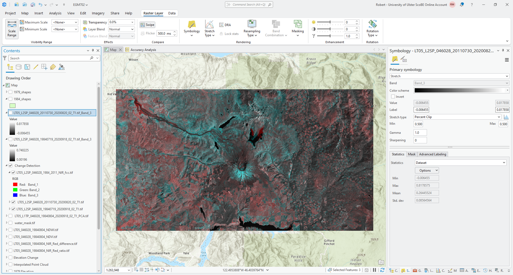

|br| You can interpret the colors as red showing areas that have higher reflectance in the 1984 image, and blue showing
areas that have higher reflectance in the 2011 image. Gray areas are similar reflectance in both scenes, with the shade
of gray depending on whether the surface has high or low reflectance.

.. card::
    :class-header: question
    :class-card: question

    :far:`circle-question` Question
    ^^^

    What patterns do you notice? How do these compare to the patterns you observed in the previous section, using the
    false color composite images and the **Swipe** tool?

    Which of these two visual techniques do you find easier for identifying and interpreting change? Why?

difference
-----------

Next, we'll look at some different techniques that we can use to analyze change, starting with the simplest approach:
differencing. We'll focus on changes in NIR reflectance between 1984 and 2011 to start.

Open the **Raster Calculator**, then enter the following formula:

.. code-block:: text

    ``LT05_L2SP_046028_20110730_20200820_02_T1.tif_Band_3`` - ``LT05_L2SP_046028_19840719_20200918_02_T1.tif_Band_3``

Save the output as ``LT05_L2SP_046028_1984_2011_NIR_difference.tif`` to the same folder as the rest of your outputs.

Next, change the symbology to use a diverging color scheme, and make sure to use a Minimum/Maximum stretch. Edit the
min/max values to be between -0.2 and 0.2. Your raster should look something like this (though perhaps with a different
color scheme):

.. image:: img/arcgis/arc_nir_difference.png
    :width: 720
    :align: center
    :alt: the NIR reflectance difference between the 1984 and 2011 images

|br|

.. card::
    :class-header: question
    :class-card: question

    :far:`circle-question` Question
    ^^^

    In what areas do you notice the most positive (negative) change? What do these changes correspond to? How does
    this compare with the changes that you noted using the different visual analysis approaches earlier?

Next, we'll create a histogram to visualize the distribution of differences. Right-click on the difference layer in the
**Contents** panel, then select **Create Chart** > **Histogram**.

Under **Variables**, select ``Band_3`` to create the histogram, and click the checkbox next to **Median** to add a line
showing the median difference value. You should see something like this:

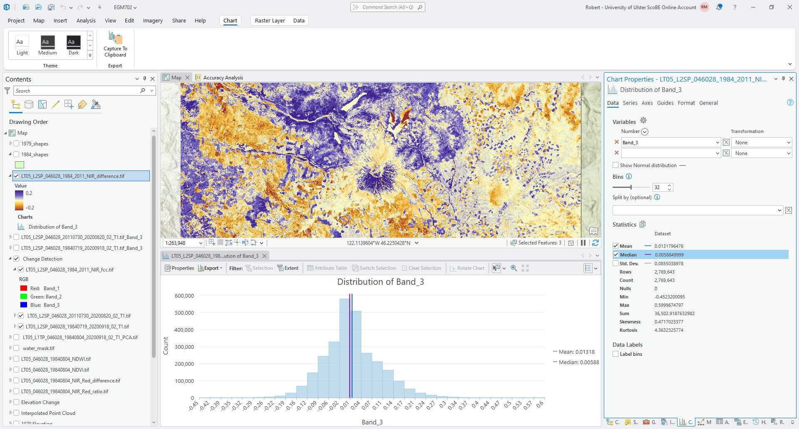

|br| We can also edit the title and axis labels under the **General** tab in the **Chart Properties** panel. For
example, you could change the chart title to state that this is the difference in NIR, and optionally include the dates
used for the difference calculation.

You could also change the *x*-axis label to say "difference", rather than "Band_3":

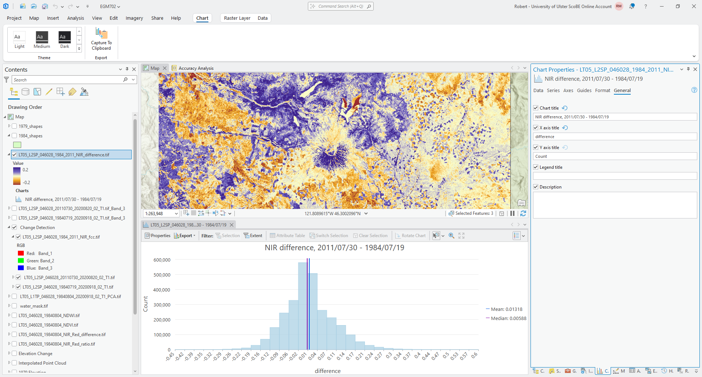

|br|

.. card::
    :class-header: question
    :class-card: question

    :far:`circle-question` Question
    ^^^

    Based on what you can see, what values do most of the differences fall between? What is the standard deviation
    of the values of this difference raster?

normalized difference
----------------------

We can also use a normalized difference to examine changes in a single band reflectance, just like we used the
normalized difference to enhance the differences between multiple bands from a single date last week.

And, just like with the normalized difference compared to a simple band difference or ratio, the normalized difference
stretches the difference values and can help to enhance the changes or differences that we observe between the two
dates.

Open the **Raster Calculator** and enter the following formula:

.. code-block:: text

    (``LT05_L2SP_046028_20110730_20200820_02_T1.tif_Band_3`` - ``LT05_L2SP_046028_19840719_20200918_02_T1.tif_Band_3``) / (``LT05_L2SP_046028_20110730_20200820_02_T1.tif_Band_3`` + ``LT05_L2SP_046028_19840719_20200918_02_T1.tif_Band_3``)

Save the output as ``LT05_L2SP_046028_1984_2011_NIR_normdiff.tif`` to the same folder as the rest of your outputs.

Change the **Symbology** so that it is the same as the symbology for the NIR difference image. You should see something
like this:

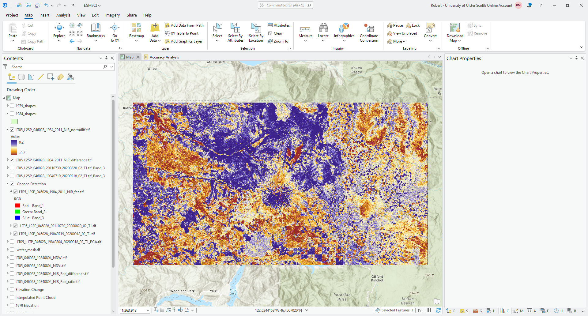

|br|

.. card::
    :class-header: question
    :class-card: question

    :far:`circle-question` Question
    ^^^

    Use the **Swipe** tool to compare the normalized difference and difference layers.

    What areas do you see enhanced the most in the normalized difference layer compared to the difference image? Are
    there any areas where the change appears to be small in the difference layer that are more clear in the normalized
    difference?

Now, create a histogram for the normalized difference image, following the same approach as you did for the difference
image:

.. image:: img/arcgis/arc_nir_normdiff_histogram.png
    :width: 720
    :align: center
    :alt: the normalized NIR reflectance difference between the 1984 and 2011 images

|br| Under the **Axes** tab, change the *x*-axis limits so that the minimum value is -1, and the maximum is 1, and edit
the title and axis labels as you did before. Finally, check **Show Normal distribution** and **Median** to show the
normal distribution and median value for this distribution.

.. card::
    :class-header: question
    :class-card: question

    :far:`circle-question` Question
    ^^^

    Which of these two distributions is more normal (i.e., is closer to the normal distribution)?

    How does the standard deviation for the normalized difference image compare to the standard deviation for the
    difference image? What does this mean for the dispersion of values in the normalized difference image, compared
    to the difference image?

change vector analysis
-----------------------

Now that we've seen how a lot of the same techniques that we've used previously, such as false color composites and
band maths, can be applied to change detection, we'll look at a technique we haven't used before: change vector
analysi s (CVA).

CVA can be used for any number of band combinations (and in fact, it is often more powerful when used with multiple
band combinations). However, because it is difficult to visualize vectors in more than three dimensions, we will stick
to two dimensions and analyse the differences in NIR and red reflectance between the two images.

The first thing we need to do as part of the CVA is calculate the change, or difference, in NIR and Red reflectance
between 1984 and 2011. You have already done part of this (the NIR difference), so go ahead and calculate the difference
between the 1984 and 2011 Red reflectance. Call the output ``LT05_L2SP_046028_1984_2011_Red_difference.tif``.

.. tip::

    If you have followed the suggested band order, the Red band should be band number 4 (**Band_4**) for both images.

    Calculate the difference as 2011 minus 1984 (recent minus older), the same as we did for the NIR difference.

Once you have calculated both the Red and NIR differences, we need to use these to calculate the magnitude and the angle
of the change vectors.

computing vector magnitude
^^^^^^^^^^^^^^^^^^^^^^^^^^^

Remember that the difference values in each band are the *components* of the individual change vectors,
:math:`\vec{u}` - we can think of the difference in Red reflectance as the *x* component of the vector, and the
difference in NIR reflectance as the *y* component:\ [3]_

**vector plot**

|br| The magnitude of a vector is just the length of the vector. If the components of the vector are :math:`x_i` and
:math:`y_i`, then, the magnitude, :math:`\lVert\vec{u}\rVert`, is calculated using the pythogorean theorem:

.. math::

    \lVert\vec{u}\rVert = \sqrt{{x_i}^2 + {y_i}^2}

To create the magnitude raster, open the **Raster Calculator** if you haven't already. Translating the formula above
into the ArcGIS **Raster Calculator**:

.. code-block:: text

    SquareRoot(Power("LT05_L2SP_046028_1984_2011_NIR_difference.tif", 2) + Power("LT05_L2SP_046028_1984_2011_Red_difference.tif", 2))

Where ``Power(rast, 2)`` raises the value of each raster cell to the second power, and ``SquareRoot()`` calculates the
square root of the values inside the brackets.

Save the output as ``LT05_L2SP_046028_1984_2011_NIR_Red_magnitude.tif`` to the same folder as before. You should see
something like the following in the Map window:

.. image:: img/arcgis/arc_cva_magnitude.png
    :width: 720
    :align: center
    :alt: the cva magnitude raster

|br|

computing vector angle
^^^^^^^^^^^^^^^^^^^^^^^

The next step is to calculate the angle of the change vectors. If we again think of a vector :math:`\vec{u}` as
having components :math:`x_i` and :math:`y_i`, the angle, :math:`\theta` that :math:`\vec{u}` makes with respect to the
horizontal (*x*) axis is:

.. math::

    \theta = \arctan\left(\frac{y_i}{x_i}\right)

where :math:`\arctan` is the *inverse tangent*, or *arctangent*. In the **Raster Calculator**, the function to use
for the arctangent is ``ATan2()``. Using the to bands that we have defined previously, the equation to use is:

.. code-block:: text

    ATan2("LT05_L2SP_046028_1984_2011_NIR_difference.tif", "LT05_L2SP_046028_1984_2011_Red_difference.tif") * (180 / 3.1415926)

Finally, the output of ``ATan2()`` is in radians, so we have multiplied by ``180 / 3.1415926`` to convert the result
from radians to degrees.

Save the output as ``LT05_L2SP_046028_1984_2011_NIR_Red_angle.tif`` to the same folder as before. You should see
something like the following in the Map window:

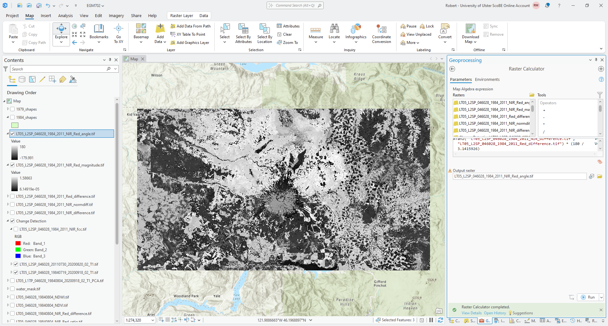

|br| While this shows the change vector angle for each pixel, it's not necessarily the easiest to interpret the
stretched symbology of the raster. For a start, we could divide the angles into four quadrants, depending on which
quadrant of the unit circle the angle is part of:

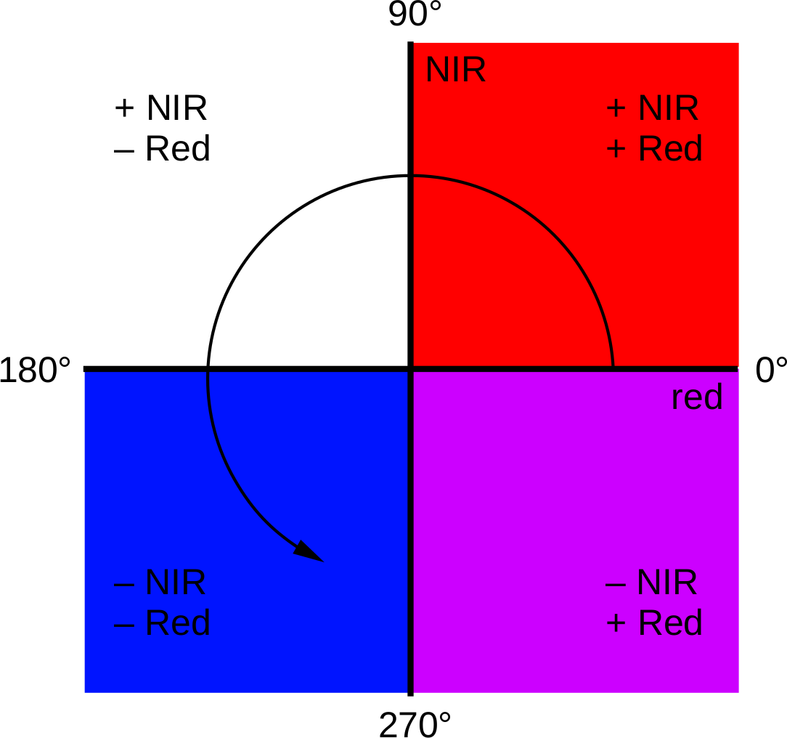

|br| Areas with positive changes in both NIR and Red reflectance have an angle between 0° and 90°; positive NIR
difference and negative Red difference have an angle between 90° and 180°; negative difference in both have an angle
between -180° and -90° (or between 180° and 270°); and finally, negative NIR and positive Red difference have an angle
between -90° and 0° (or 270° and 360°).

To apply the color scheme shown above, open the **Symbology** tab for the angle raster and change the **Primary Symbology**
from **Stretch** to **Classify**. Change the **Method** to **Manual Interval**, and change the upper values in the first
4 classes to be -90, 0, 90, and 180, respectively.\ [4]_ You can change the colors to match the example shown, or pick
your own color scheme.

When you're finished, you should see something like the following:

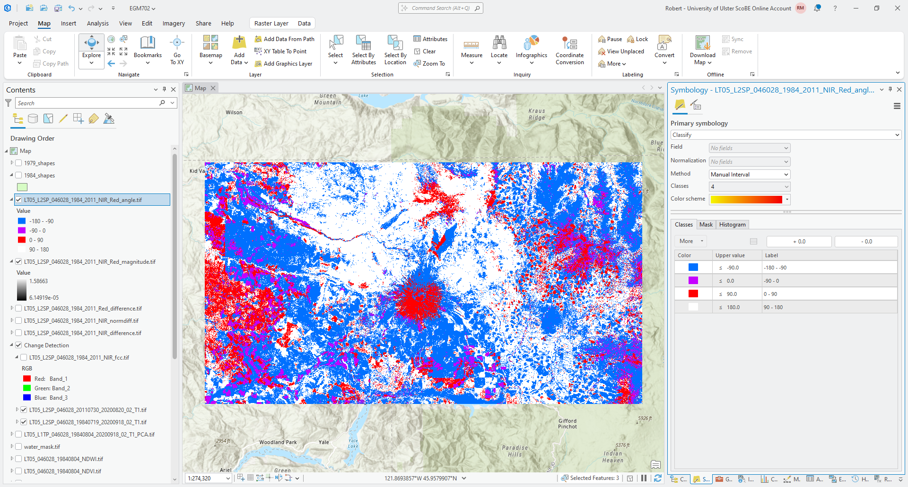

|br|

.. card::
    :class-header: question
    :class-card: question

    :far:`circle-question` Question
    ^^^

    What color do you see the most of in this image? What kind of change does this represent, in terms of the
    difference in both NIR reflectance and red reflectance?

    What kind of change does this represent in terms of the surfaces that you have identified in the image?

masking using magnitude
^^^^^^^^^^^^^^^^^^^^^^^^

Because this is showing any change at all, even small changes that may not represent an actual change in surface type,
we normally want to mask the raster to only consider areas with changes above a certain threshold. To help choose
the threshold, we can use the histogram of the magnitude values.

To show this, right-click on the magnitude layer in the contents panel, then select **Create Chart** > **Histogram**.
Select **Band_3** under **Number** to plot the histogram, and check **Median** to show the median value of the
magnitude raster. You should see something like this:

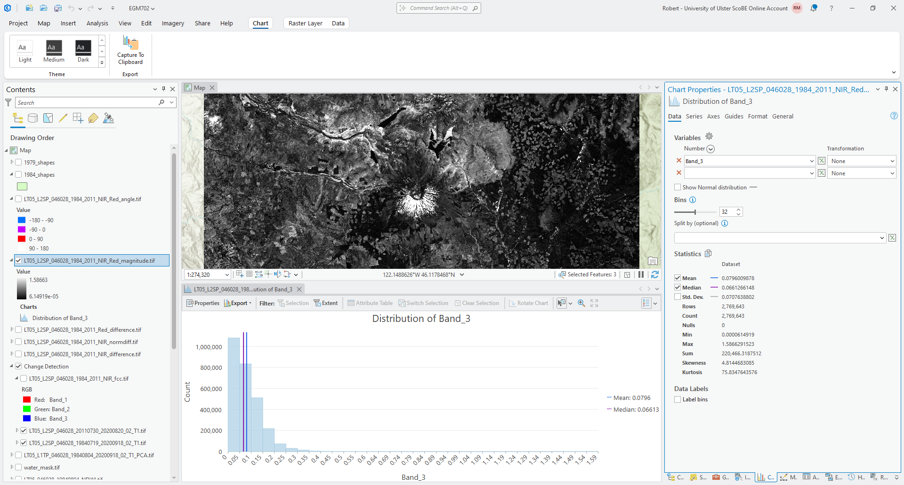

|br| From the histogram, you should see that most of the changes are small in magnitude
(:math:`\lVert\vec{u}\rVert` < 0.1), and the median magnitude is around 0.066 - this should be a good value to use for
the threshold.

To mask the raster, we use the ``Con()`` function in the **Raster Calculator**:

.. code-block:: text

    Con("LT05_L2SP_046028_1984_2011_NIR_Red_magnitude.tif" > 0.06, "LT05_L2SP_046028_1984_2011_NIR_Red_angle.tif")

This creates a new raster where the values are equal to the values in ``LT05_L2SP_046028_1984_2011_NIR_Red_angle.tif``
wherever the magnitude value is greater than 0.06, and ``NoData`` where the magnitude is less than (or equal to) 0.06.

Save the output as ``LT05_L2SP_046028_1984_2011_NIR_Red_angle_masked.tif``. Once the map loads, change the symbology so
that it matches the original angle layer. You should see something like the following:

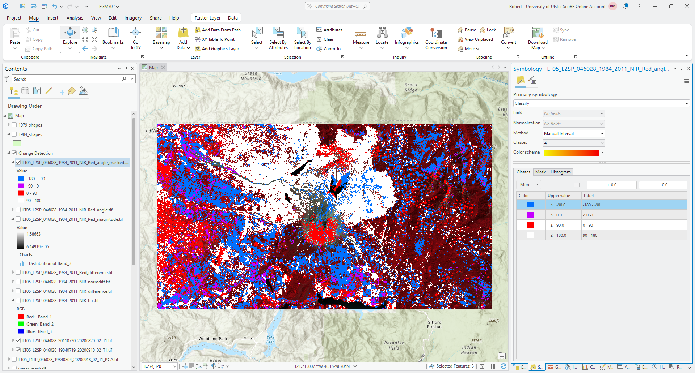

|br|

.. card::
    :class-header: question
    :class-card: question

    :far:`circle-question` Question
    ^^^

    What color(s) do you see the most of in this masked image? How does this compare to the original angle raster?
    What does this mean in terms of the types of (large) surface changes that are visible in the images?

summarizing information
^^^^^^^^^^^^^^^^^^^^^^^^

In addition to changing the raster symbology to *classify*, we could also use the **Reclassify** tool to assign new
values based on a range of values in the original raster.

Open the **Reclassify** tool, then select the masked angle raster as the **Input raster**. The **Reclass value**
should be ``VALUE``, and you should see 5 classes to start with:

- -180 to -90 -> 1
- -90 to 0 -> 2
- 0 to 90 -> 3
- 90 to 180 -> 4
- NoData -> NoData

You could use this classification, which will give you the same result as what you saw visually in the previous section.
This might be a good opportunity to provide a little bit more detail, though, by increasing the number of classes from
4 to 8 - this will allow us to differentiate where the difference is higher in the NIR or the Red for each of the four
quadrants.

Click on **Classify**, then change the **Method** to **Defined Interval**. Change the **Interval size** to 45 - you
should see the number of classes change to 8, and the **Upper value** should range from -135 to 180 in increments of
45\ [5]_:

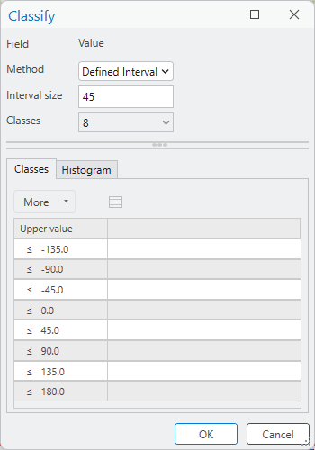

|br| Click **OK**. You should see the reclassification table update with the new start/end values. Save the output
as ``LT05_L2SP_046028_1984_2011_NIR_Red_angle_reclass.tif``, then click **Run**.

You should see the output raster load with a random assortment of colors:

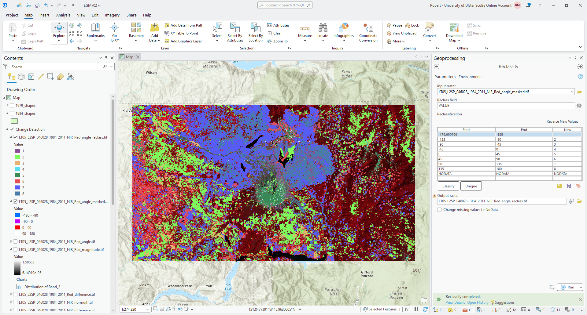

|br|

.. tip::

    To help remind you of what the angle values are for each class, update the **Label** for each class from the
    **Symbology** tab.

Once you have updated the labels, we can create a chart to show the number of pixels of each angle class, to help
understand what types of change are most prevalent between our two images.

Right-click on the reclass layer in the **Contents** panel, then select **Create Chart** > **Bar Chart**.

Under **Category or Date** in the **Chart Properties** panel, select ``Value``. Leave **Aggregation** as ``None``,
then press the **Select** button to add a numeric field, and select ``Count`` from the drop-down menu.

You should see something like this:

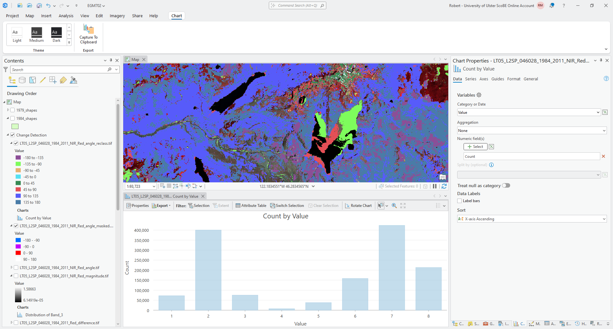

|br| Remember to edit the title and labels for the axes (if needed) before moving on!

.. card::
    :class-header: question
    :class-card: question

    :far:`circle-question` Question
    ^^^

    Which class has the most values, according to the bar chart? How does this compare to what you estimated visually
    earlier?

    What kind of change does this correspond to?

multi-temporal pca
-------------------

Finally, we'll take a look at how we can use principal component analysis to help us identify and study areas of change
between two different images.

To run PCA on the combined 1984 and 2011 images, open **Principal Components** in the **Geoprocessing** panel. Under
**Input raster bands**, add the composited 1984 raster first (``LT05_L2SP_046028_19840719_20200918_02_T1.tif``),
followed by the composited 2011 raster (``LT05_L2SP_046028_20110730_20200820_02_T1.tif``).

Save the **Output multiband raster** as ``LT05_L2SP_046028_1984_2011_PCA.tif`` to the same directory where you have
saved your other outputs, and ensure that the **Number of Principal components** is ``12``. Finally, save the
**Output data file** as ``LT05_L2SP_046028_1984_2011_PCA_params.txt``, then click **Run**.

After a few moments, you should see the following image load in the map\ [6]_:

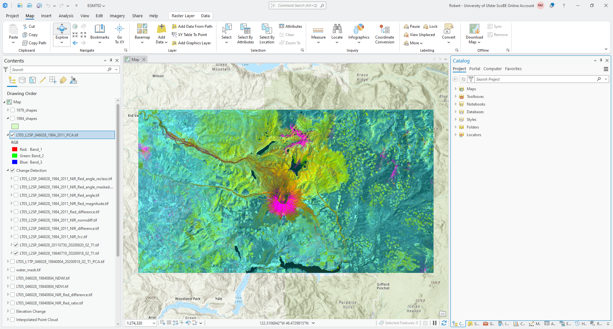

|br| In this example, we can see that the dominant colors are pink/magenta, primarily in areas where we see snow/ice
(or cloud) in one of the images; teal/green, and yellow.

.. card::
    :class-header: question
    :class-card: question

    :far:`circle-question` Question
    ^^^

    What color are the water bodies? Why do you think this is?

The pink/magenta areas indicate areas that are brightest in the first principal component band (PC1), darker in the
second principal component band (PC2), and bright in the third principal component band (PC3).

.. card::
    :class-header: question
    :class-card: question

    :far:`circle-question` Question
    ^^^

    Use the **Explore** tool from the **Map** tab to see the PC values for different pixels by clicking on them.
    What are typical values in PC1-3 for different areas of change that you have identified earlier in the exercise?

In general, a multi-temporal PCA gives some bands that contain information about areas that haven't changed
(*stable components*) alongside bands that contain information about areas that have changed (*change components*).

Start by looking at the first PC band (PC1) by changing the **Symbology** from **RGB** to **Stretch** and ensuring
that the **Band** is ``Band_1``:

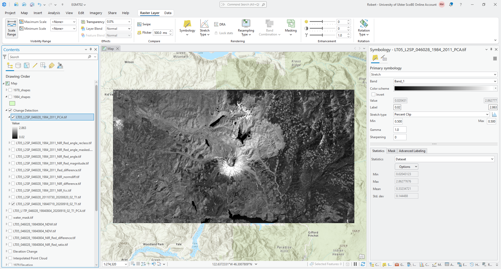

|br|

.. card::
    :class-header: question
    :class-card: question

    :far:`circle-question` Question
    ^^^

    What features do you notice in this image? How does this compare to the original images? Do you think this layer
    highlights areas of change, or something else? If you think they highlight areas of change, what kind of change?

    Now, view each of the other PC bands in turn and think about the questions above. Pay attention to the values
    that the images are stretched between - are the values staying the same as you look at each band, or are they also
    changing?

Finally, with the **Symbology** again set to **RGB**, right-click on the PCA layer and select **Create Chart** >
**Spectral Profile**:

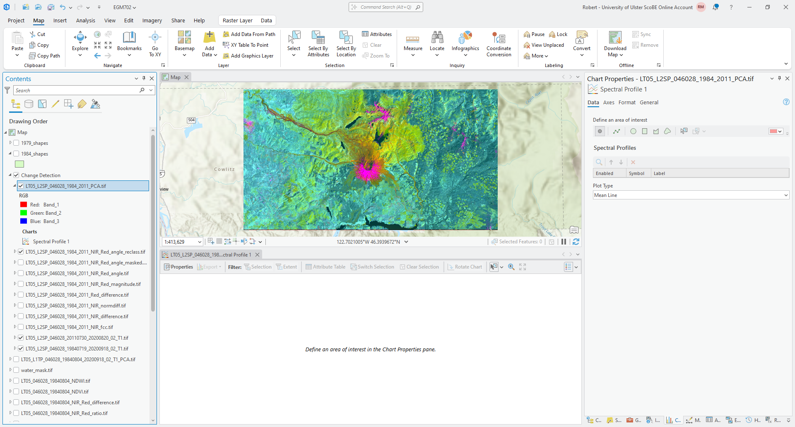

|br| This type of chart will allow you to click on different areas of the map and plot the values across all bands in
that area of interest. I recommend starting with **Point** areas of interest. Zoom in on the peak of the volcano and
click on an area of pink/magenta:

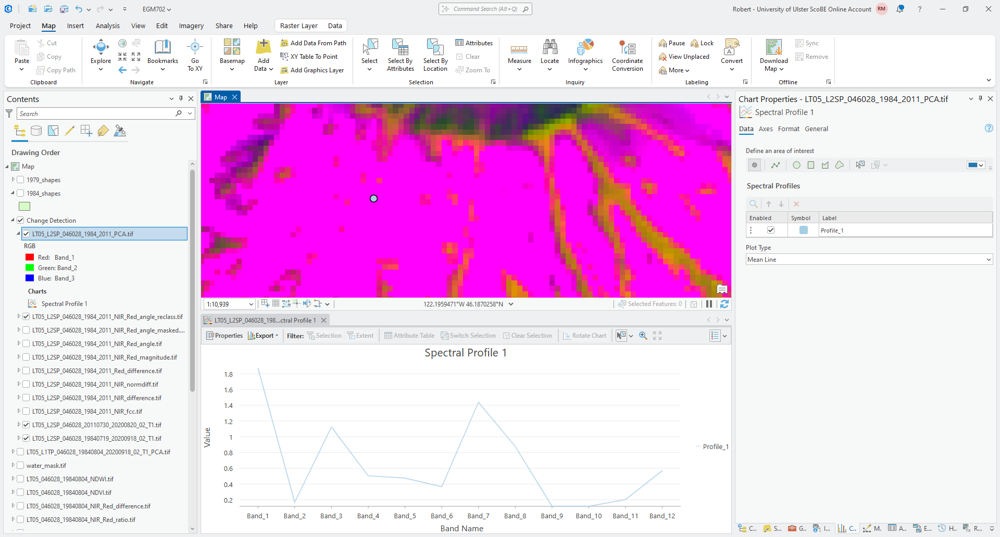

|br| Now, click on an area where there is clear vegetation regrowth:

.. image:: img/arcgis/arc_multitemp_pca_profile2.png
    :width: 720
    :align: center
    :alt: the multi-temporal pca image, with a spectral profile chart open and two point profiles shown

|br| And finally, click on one of the more stable forest areas:

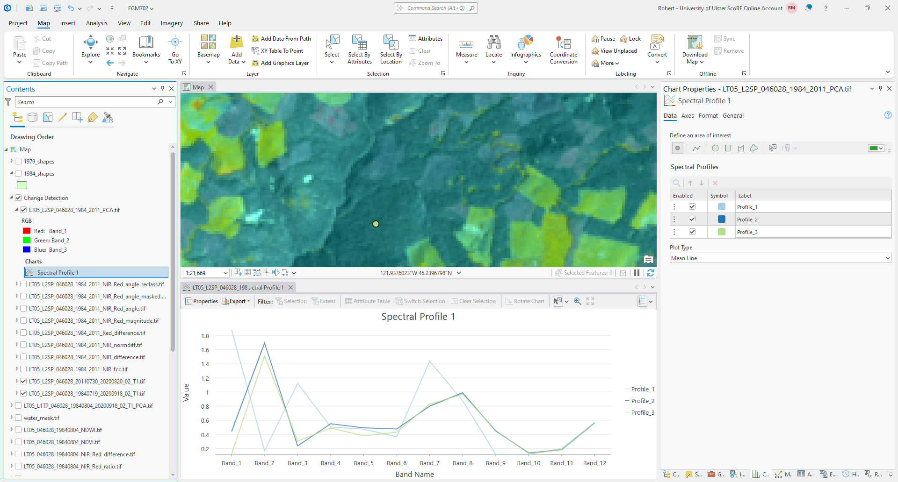

|br| Click on a few other areas, paying attention to the type of surface you're clicking on, then have a look at the
plot.

.. card::
    :class-header: question
    :class-card: question

    :far:`circle-question` Question
    ^^^

    What band(s) show the biggest differences between the points you have selected? What band(s) show the most
    similarity?

    If you were trying to distinguish between, say, vegetation regrowth and stable vegetation, what PC band(s) would
    you try to focus on? Why?

next steps
-----------

In this practical, we've seen examples of using different band arithmetic to look at changes in individual bands - for
example, using the NIR band or the Red band. But, you can also combine the techniques we've used here with techniques
we introduced last week - for example, using the change in NDVI between two dates to investigate the change in vegetative
cover or health.

As a next step, calculate the NDVI for both the 1984 and 2011 surface reflectance images we have used in this exercise.
Then, subtract the 1984 NDVI from the 2011 NDVI to obtain the change in NDVI between the two dates.

.. card::
    :class-header: question
    :class-card: question

    :far:`circle-question` Question
    ^^^

    Compare the NDVI change with the other change detection techniques you have used in this practical. Do these
    approaches highlight similar things? Do you notice any differences between the changes you observe with these
    techniques? Are changes more clear with one technique compared to others?

Very often, the multi-temporal PCA can also be combined with some of the classification techniques we will discuss
next week, to help classify types of change.\ [7]_ After next week's practical, you might consider combining the
change detection technique(s) we have looked at here with some of the techniques introduced next week, to see how well
the combination performs at classifying/identifying changes, compared to repeat classification (as an example).

notes
-----

.. [1] You may notice that the values of :math:`M_\rho` and :math:`A_\rho` are the same for all bands. This is true no
    matter what Landsat L2 surface reflectance product you use, whether it was produced from TM, ETM+, or OLI.

.. [2] You can, of course, put these in any order you like. Just be warned that the rest of the instructions might get
    very confusing, and the results might look very different if you do!

.. [3] There isn't anything special about the choice of axes here - we could also make the NIR difference the *x* axis
    and the Red difference the *y* axis. The only thing that would change is the interpretation of the angle values.

.. [4] The reason that we use -180 and -90 here, instead of 180 and 270 (or -90 and 0 instead of 270 and 360) is because
    the output of ``ATan2()`` returns values between :math:`-\pi` (-180) and :math:`\pi` (180).

.. [5] If you see something else here, don't worry. Change the **Method** to **Manual interval** and change the values
    manually.

.. [6] If you see something different (for example, an image that is mostly green/purple), don't panic - the stretch
    hasn't worked, most likely because ArcGIS hasn't calculated the statistics for the image. Open
    **Calculate Statistics** in the **Geoprocessing** panel, and use your multi-temporal PCA image as the
    **Input Raster Dataset**. After the tool finishes, you may need to change the symbology to ``None`` before
    changing it back to ``Percent Clip`` for the update to take effect.

.. [7] See, for example, Richards JA (1984) *Remote Sensing of Environment* 16(**1**), 35–46. doi:
    `10.1016/0034-4257(84)90025-7 <https://doi.org/10.1016/0034-4257(84)90025-7>`__. Note that this article is included
    in the Zotero library, along with a PDF of the article if you've set up your account!
