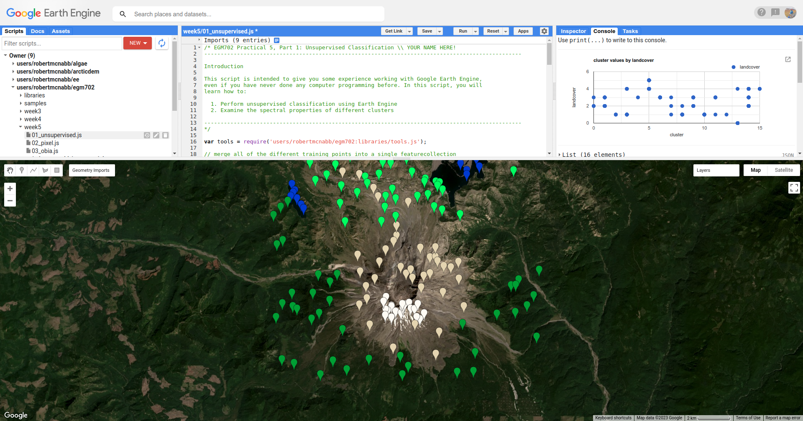
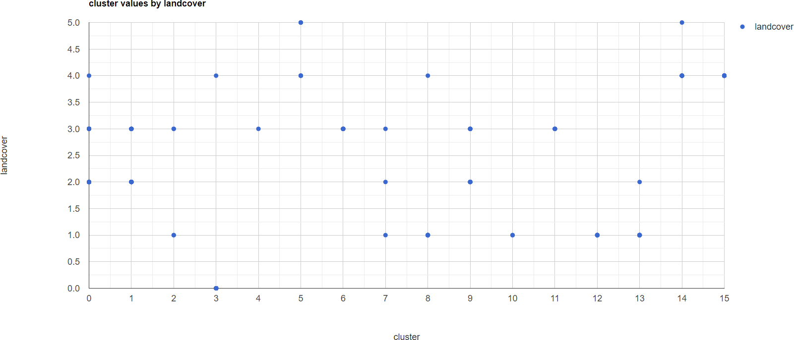
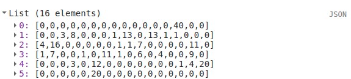
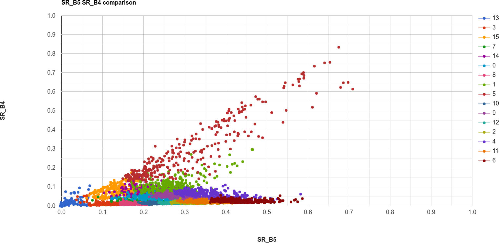

classification in earth engine
=======================================

In this practical, you'll get an introduction to using Google Earth Engine (GEE) to do image classification. Just like
the previous weeks, you should be able to do finish the practical even if you have no prior experience with programming.
All of the programming steps have been provided for you in a script, and your task will be to run each step in turn and
analyse and interpret the results.

getting started
---------------

To begin, point your browser to https://code.earthengine.google.com, and log in if you need to. In the
**Script manager** under **Reader**, find the ``egm702`` repository, and click on ``week5`` to expand the week 5
folder.

Just like for the previous weeks, the practical exercises are divided into a number of different scripts, labeled in
order. For week 5, the scripts are:

- ``01_unsupervised.js``
- ``02_pixel.js``
- ``03_obia.js``

In the **Script manager**, open the script for part 1 by clicking on ``week5/01_unsupervised.js``.

Remember that you have access to all of the scripts in the repository as a *Reader*, but in order to save any changes
you'll need to save the script to your own repository. Again, the easiest way for you to do this is to replace
"YOUR NAME HERE!" on line 1 with your name, then click **Save**.

Save the script to your ``egm702`` repository as ``week5/01_unsupervised.js`` - just like last week, you should
see a ``week5`` folder appear in the repository with a new script, ``01_unsupervised.js``.

As you work your way through the practical, remember to save each script in this way, so that any changes you make to
the scripts are saved in your repository.

part 1 - unsupervised classification
----------------------------------------

Open the script for this part of the practical by clicking on ``01_unsupervised.js`` in the **Script manager**, or using
this `direct link <https://code.earthengine.google.com/?scriptPath=users%2Frobertmcnabb%2Fegm702%3Aweek5%2F01_unsupervised.js>`__.

In the first part of the practical, we'll see how we can use *unsupervised* classification (also known as "clustering")
to help classify an image. Remember that unsupervised classification is a classification technique where we have little
to no input to the classification routine. Instead, the classification algorithm determines how to group, or "cluster,"
pixels, based on their properties.

.. note::

    It’s important to note that the classes output by an unsupervised classification have no meaning, in the sense that
    they’re only groups of pixels based on the image data. After running an unsupervised classification, then, the next
    task is to interpret and identify what each of these classes represent.

The algorithm that we'll use to cluster the image is an implementation of *k*-means\ [1]_ clustering called WEKA
*k*-means\ [2]_.

The **Image** that we're working with in this practical is the same August 2020 OLI image that we've seen before. In one
band, this image has: 7601 * 7331 pixels = 55.7M pixels/band * 7 bands = 390M pixels - that's a lot.

To help improve performance of the clustering algorithm, and prevent ``Out of Memory`` errors when we run the script,
we want to take a random sample of pixels, rather than attempting to run the clustering algorithm on the entire set of
~400M pixels:

.. code-block:: javascript

    // create sample points to run k-means clustering on
    var training = img.select('SR_B.').sample({
      region: boundary,
      scale: 30,
      numPixels: 5000
    });

Once we have the training sample to work with, we have to actually train the **Clusterer**:

.. code-block:: javascript

    // train the unsupervised clusterer with 16 classes
    var clusterer = ee.Clusterer.wekaKMeans({nClusters: 16}).train(training);

Remember that *k*-means requires that we specify the number of classes, *k* - the algorithm won't decide for us how
many classes to use. In the above example, we're using 16 classes, specified using the argument ``nClusters``.

.. note::

    In general, the number of clusters will depend on the particular scene - you may want to experiment with choosing
    different numbers of clusters to see the effects on the end results. You can also use a different method,
    such as ``ee.Clusterer.wekaXMeans()`` (`documentation <https://developers.google.com/earth-engine/apidocs/ee-clusterer-wekaxmeans>`__)
    or ``ee.Clusterer.wekaCascadeKMeans()`` (`documentation <https://developers.google.com/earth-engine/apidocs/ee-clusterer-wekacascadekmeans>`__),
    which are designed to optimize the number of clusters based on the input data.

Once we've trained the **Clusterer**, we have to actually apply it to the image:

.. code-block:: javascript

    // classify the image using the unsupervised classifier
    var unsupervised = img.cluster(clusterer); // returns an image with a single band, 'cluster'
    img = img.addBands(unsupervised.select('cluster')); // add the cluster band to the image

This will assign a class (or cluster value) to each input based on the "rules" that the **Clusterer** has learned from
the input data. We can then add the classification band to the original image, before adding the image to the **Map**:

.. code-block:: javascript

    Map.addLayer(unsupervised.randomVisualizer(), {}, 'clusters');

Because the cluster values don't have any actual meaning, we're using ``ee.Image.randomVisualizer()`` to create a
random palette to view the image with - the important thing here is to be able to see how different pixels are grouped
together.

When you run the script, you will see something like the artistic image shown below:

.. image:: ../../../img/egm702/week5/unsupervised.png
    :width: 720
    :align: center
    :alt: the unsupervised classification shown in the map window

|br| Here, we can pick out some of the features from the visible image - the mountain is primarily a teal color
(cluster value 15), the lakes are colored blue (cluster value 13), and much of the forested area is varying shades of
purple and pink (cluster values 8, 10, and 12).

To help with interpreting the different cluster values, I have also included a number of **Point** features as part of
the script. To see these, you can toggle them on from the **Geometry Imports** menu:

|br| These points each have a ``landcover`` attribute that corresponds to the type of surface:

.. list-table::
    :header-rows: 1

    * - name
      - value
      - description
    * - ``water``
      - 0
      - surface water
    * - ``forest``
      - 1
      - forest
    * - ``clearCut``
      - 2
      - forest that has been recently cut down
    * - ``newGrowth``
      - 3
      - new vegetation that has grown post-eruption
    * - ``soil``
      - 4
      - eruptive material and soil
    * - ``snow``
      - 5
      - snow and ice

At the top of the script (lines 19-24), you can see where we have merged the different training points together into a
single **FeatureCollection**, called ``trainingPoints``.

The following block of code:

.. code-block:: javascript

    // sample the cluster values at each of the training points
    var clusterPoints = unsupervised.select('cluster').sampleRegions({
      collection: trainingPoints,
      properties: ['landcover'],
      scale: 30
    });

Samples the cluster values at each of the training points, which we can then plot in a chart to show the different
``landcover`` values that each cluster has been assigned to:

.. code-block:: javascript

    // create a chart that plots the cluster value vs the landcover class value
    // for the training points
    var chart = ui.Chart.feature
      .byFeature({features: clusterPoints.select('landcover|cluster'),
        xProperty: 'cluster',
        yProperties: ['landcover']
      }).setChartType('ScatterChart')
      .setOptions({
        title: 'cluster values by landcover',
        hAxis: {title: 'cluster', titleTextStyle: {italic: false}},
        vAxis: {title: 'landcover', titleTextStyle: {italic: false}},
      });
    print(chart); // remember to print the chart to the console

The x-axis of this chart shows the cluster value, and the y-axis shows the ``landcover`` value. From this chart,
you can see, for example, that cluster number 13 is identified as both ``landcover`` 0 (``water``) and 4 (``soil``). We
also see that ``landcover`` 1 (forest) has been spread across a number of cluster values, as have ``landcover`` values
2 through 4.

This chart doesn't tell us how many points belong to each; however, we can look at a confusion matrix of the landcover
and cluster values to learn a bit more:

.. code-block:: javascript

    print(clusterPoints.errorMatrix('landcover', 'cluster'));

|br| This might be slightly difficult to interpret, so I've re-created it here with some labels:

+----------------------+----+----+----+----+----+----+----+----+----+----+----+----+----+----+----+----+
| cluster \\ landcover | 0  | 1  | 2  | 3  | 4  | 5  | 6  | 7  | 8  | 9  | 10 | 11 | 12 | 13 | 14 | 15 |
+----------------------+----+----+----+----+----+----+----+----+----+----+----+----+----+----+----+----+
| ``water``            | 0  | 0  | 0  | 0  | 0  | 0  | 0  | 0  | 0  | 0  | 0  | 0  | 0  | 40 | 0  | 0  |
+----------------------+----+----+----+----+----+----+----+----+----+----+----+----+----+----+----+----+
| ``forest``           | 0  | 0  | 3  | 8  | 0  | 0  | 0  | 1  | 13 | 0  | 13 | 1  | 1  | 0  | 0  | 0  |
+----------------------+----+----+----+----+----+----+----+----+----+----+----+----+----+----+----+----+
| ``clearCut``         | 4  | 16 | 0  | 0  | 0  | 0  | 0  | 1  | 1  | 7  | 0  | 0  | 0  | 0  | 11 | 0  |
+----------------------+----+----+----+----+----+----+----+----+----+----+----+----+----+----+----+----+
| ``newGrowth``        | 1  | 7  | 0  | 0  | 1  | 0  | 11 | 1  | 0  | 6  | 0  | 4  | 0  | 0  | 9  | 0  |
+----------------------+----+----+----+----+----+----+----+----+----+----+----+----+----+----+----+----+
| ``soil``             | 0  | 0  | 0  | 3  | 0  | 12 | 0  | 0  | 0  | 0  | 0  | 0  | 0  | 1  | 4  | 20 |
+----------------------+----+----+----+----+----+----+----+----+----+----+----+----+----+----+----+----+
| ``snow``             | 0  | 0  | 0  | 0  | 0  | 20 | 0  | 0  | 0  | 0  | 0  | 0  | 0  | 0  | 0  | 0  |
+----------------------+----+----+----+----+----+----+----+----+----+----+----+----+----+----+----+----+

Here, we can see that ``water`` (the first row of the table) has 40 points identified as cluster type 13, and no other
values. ``soil`` (the fifth row of the table) has 1 point identified as cluster type 13 – in other words,
cluster type 3 appears to correspond well to our water class.

Looking at the other cluster types for ``soil``, we can see that most of the points are either cluster value 15
(20 points) or cluster value 5 (12 points), with only a few points labelled as something else.

We can see a similar pattern for ``clearCut``, where most of the points are identified as cluster value 1 or 14
(16 and 11 points, respectively). However, we can also see that ``newGrowth`` also has a significant number of points
in these cluster values, suggesting that there might be some overlap between the chosen feature points for these two
classes.

.. card::
    :class-header: question
    :class-card: question

    :far:`circle-question` Question
    ^^^
    Why do you think that there might be a significant amount of overlap between the different feature classes?

.. hint::

    Think about what each feature class actually represents - is it one specific surface type, or is it a mix of
    surface types?

The last part of this script displays the spectral properties of the clusters using two example scatter plots. First,
we add the clustered **Image** to our original **Image**:

.. code-block:: javascript

    reflimg = reflimg.addBands(unsupervised.select('cluster'));

This way, we can select pixels from that **Image** based on what cluster they belong to.

Because of the number of pixels in the **Image** (remember: 7601 * 7331 pixels = 55.7M pixels),
we can't just plot all of the pixel values at once. Instead, we again take a random sample of pixels,
this time using ``ee.Image.stratifiedSample()``:

.. code-block:: javascript

    var sample = reflimg.select(['cluster', 'SR_B.']).stratifiedSample({
      numPoints: 300,
      classBand: 'cluster',
      region: reflimg.geometry(),
      scale: 30,
      projection: reflimg.projection()
    });

This selects a random sample of (up to) 300 pixels from each cluster.

.. note::

    The output of ``ee.Image.stratifiedSample()`` is a **FeatureCollection**. Because we are limited by GEE 5000
    elements for the **Chart**, we are limited to 5000 elements / 16 classes ~= 300 elements / class. To show more
    elements per class, we would need to reduce the number of classes.

There are two examples shown in the script: a comparison of the NIR (OLI Band 5) and red (OLI Band 4), and a comparison
of the green (OLI Band 3) and SWIR2 (OLI Band 7). The first example, NIR vs red, is shown below:

.. code-block:: javascript

    // compare NIR and Red
    var chart1 = tools.clusterPlot(sample, 'SR_B5', 'SR_B4');
    print(chart1);

|br|

.. card::
    :class-header: question
    :class-card: question

    :far:`circle-question` Question
    ^^^
    Why do you think there is overlap between the different clusters shown in the image above?

.. card::
    :class-header: question
    :class-card: question

    :far:`circle-question` Question
    ^^^
    In the chart above, you can see that cluster value 5 corresponds to pixels that have similarly high reflectance
    values in both NIR and red, while class 6 corresponds to pixels with high NIR reflectance and very low red
    reflectance.

    What kind of surface type might each of these two clusters describe?

As stated above, the cluter values classes output by an unsupervised classification have no meaning - they're only
groups of pixels based on the image data. The next step for analyzing and using the output of the unsupervised
classification would be to group different classes together based on the landcover type they represent
(using, for example, the `Reclassify <https://pro.arcgis.com/en/pro-app/latest/tool-reference/spatial-analyst/reclassify.htm>`__
tool in ArcGIS). For now, we'll move on to look at other methods of classification.

part 2 - pixel-based classification
----------------------------------------

part 3 - object-based classification
----------------------------------------

part 4 - accuracy analysis
----------------------------

next steps
------------

unsupervised classification
.............................

- How does increasing (or decreasing) the number of sample points used to train the **Clusterer** affect the results?
- Try varying the number of clusters, to see what difference it makes for the overlap between different landcover
  classes. If you reduce the number of clusters to 8, do you see more or less overlap? What about for 10 clusters?
- Instead of using ``ee.Clusterer.wekaKMeans()``, try one of the other clusterers available, such as
  ``ee.Clusterer.wekaXMeans()``, which finds the "best" number of clusters for a given input image and range of
  number of clusters. Replace the code at line 42 with the following:

  .. code-block:: javascript

      var clusterer = ee.Clusterer.wekaXMeans({maxClusters: 16}).train(training);

pixel-based classification
.............................

object-based classification
.............................

notes and references
----------------------

.. [1] For a (brief) overview of *k*-means clustering, the wikipedia page is a good place to
    start: https://en.wikipedia.org/wiki/K-means_clustering

.. [2] Frank, E., M. A. Hall., and I. H. Witten (2016). The WEKA Workbench. Online Appendix for
    "Data Mining: Practical Machine Learning Tools and Techniques", Morgan Kaufmann, Fourth Edition, 2016.
    [`pdf <https://www.cs.waikato.ac.nz/ml/weka/Witten_et_al_2016_appendix.pdf>`__]
