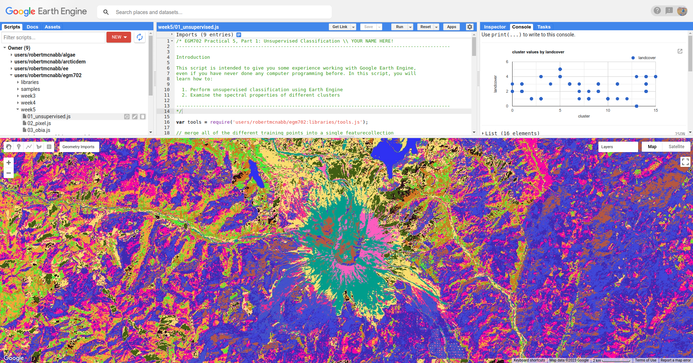

classification in earth engine
=======================================

In this practical, you'll get an introduction to using Google Earth Engine (GEE) to do image classification. Just like
the previous weeks, you should be able to do finish the practical even if you have no prior experience with programming.
All of the programming steps have been provided for you in a script, and your task will be to run each step in turn and
analyse and interpret the results.

getting started
---------------

To begin, point your browser to https://code.earthengine.google.com, and log in if you need to. In the
**Script manager** under **Reader**, find the ``egm702`` repository, and click on ``week5`` to expand the week 5
folder.

Just like for the previous weeks, the practical exercises are divided into a number of different scripts, labeled in
order. For week 5, the scripts are:

- ``01_unsupervised.js``
- ``02_pixel.js``
- ``03_obia.js``

In the **Script manager**, open the script for part 1 by clicking on ``week5/01_unsupervised.js``.

Remember that you have access to all of the scripts in the repository as a *Reader*, but in order to save any changes
you'll need to save the script to your own repository. Again, the easiest way for you to do this is to replace
"YOUR NAME HERE!" on line 1 with your name, then click **Save**.

Save the script to your ``egm702`` repository as ``week5/01_unsupervised.js`` - just like last week, you should
see a ``week5`` folder appear in the repository with a new script, ``01_unsupervised.js``.

As you work your way through the practical, remember to save each script in this way, so that any changes you make to
the scripts are saved in your repository.

part 1 - unsupervised classification
----------------------------------------

Open the script for this part of the practical by clicking on ``01_unsupervised.js`` in the **Script manager**, or using
this `direct link <https://code.earthengine.google.com/?scriptPath=users%2Frobertmcnabb%2Fegm702%3Aweek5%2F01_unsupervised.js>`__.

In the first part of the practical, we'll see how we can use *unsupervised* classification (also known as "clustering")
to help classify an image. Remember that unsupervised classification is a classification technique where we have little
to no input to the classification routine. Instead, the classification algorithm determines how to group, or "cluster,"
pixels, based on their properties.

.. note::

    It’s important to note that the classes output by an unsupervised classification have no meaning, in the sense that
    they’re only groups of pixels based on the image data. After running an unsupervised classification, then, the next
    task is to interpret and identify what each of these classes represent.

The algorithm that we'll use to cluster the image is an implementation of *k*-means\ [#kmeans]_ clustering called WEKA
*k*-means\ [#weka]_.

The **Image** that we're working with in this practical is the same August 2020 OLI image that we've seen before. In one
band, this image has: 7601 * 7331 pixels = 55.7M pixels/band * 7 bands = 390M pixels - that's a lot.

To help improve performance of the clustering algorithm, and prevent ``Out of Memory`` errors when we run the script,
we want to take a random sample of pixels, rather than attempting to run the clustering algorithm on the entire set of
~400M pixels:

.. code-block:: javascript

    // create sample points to run k-means clustering on
    var training = img.select('SR_B.').sample({
      region: boundary,
      scale: 30,
      numPixels: 5000
    });

Once we have the training sample to work with, we have to actually train the **Clusterer**:

.. code-block:: javascript

    // train the unsupervised clusterer with 16 classes
    var clusterer = ee.Clusterer.wekaKMeans({nClusters: 16}).train(training);

Remember that *k*-means requires that we specify the number of classes, *k* - the algorithm won't decide for us how
many classes to use. In the above example, we're using 16 classes, specified using the argument ``nClusters``.

.. note::

    In general, the number of clusters will depend on the particular scene - you may want to experiment with choosing
    different numbers of clusters to see the effects on the end results. You can also use a different method,
    such as ``ee.Clusterer.wekaXMeans()`` (`documentation <https://developers.google.com/earth-engine/apidocs/ee-clusterer-wekaxmeans>`__)
    or ``ee.Clusterer.wekaCascadeKMeans()`` (`documentation <https://developers.google.com/earth-engine/apidocs/ee-clusterer-wekacascadekmeans>`__),
    which are designed to optimize the number of clusters based on the input data.

Once we've trained the **Clusterer**, we have to actually apply it to the image:

.. code-block:: javascript

    // classify the image using the unsupervised classifier
    var unsupervised = img.cluster(clusterer); // returns an image with a single band, 'cluster'
    img = img.addBands(unsupervised.select('cluster')); // add the cluster band to the image

This will assign a class (or cluster value) to each input based on the "rules" that the **Clusterer** has learned from
the input data. We can then add the classification band to the original image, before adding the image to the **Map**:

.. code-block:: javascript

    Map.addLayer(unsupervised.randomVisualizer(), {}, 'clusters');

Because the cluster values don't have any actual meaning, we're using ``ee.Image.randomVisualizer()`` to create a
random palette to view the image with - the important thing here is to be able to see how different pixels are grouped
together.

When you run the script, you will see something like the artistic image shown below:

|br| Here, we can pick out some of the features from the visible image - the mountain is primarily a teal color
(cluster value 15), the lakes are colored blue (cluster value 13), and much of the forested area is varying shades of
purple and pink (cluster values 8, 10, and 12).

To help with interpreting the different cluster values, I have also included a number of **Point** features as part of
the script. To see these, you can toggle them on from the **Geometry Imports** menu:

.. image:: ../../../img/egm702/week5/classification_points.png
    :width: 720
    :align: center
    :alt: the map window, showing the different classification points

|br| These points each have a ``landcover`` attribute that corresponds to the type of surface:

.. list-table::
    :header-rows: 1

    * - name
      - value
      - description
    * - ``water``
      - 0
      - surface water
    * - ``forest``
      - 1
      - forest
    * - ``clearCut``
      - 2
      - forest that has been recently cut down
    * - ``newGrowth``
      - 3
      - new vegetation that has grown post-eruption
    * - ``soil``
      - 4
      - eruptive material and soil
    * - ``snow``
      - 5
      - snow and ice

At the top of the script (lines 19-24), you can see where we have merged the different training points together into a
single **FeatureCollection**, called ``trainingPoints``.

The following block of code:

.. code-block:: javascript

    // sample the cluster values at each of the training points
    var clusterPoints = unsupervised.select('cluster').sampleRegions({
      collection: trainingPoints,
      properties: ['landcover'],
      scale: 30
    });

Samples the cluster values at each of the training points, which we can then plot in a chart to show the different
``landcover`` values that each cluster has been assigned to:

.. code-block:: javascript

    // create a chart that plots the cluster value vs the landcover class value
    // for the training points
    var chart = ui.Chart.feature
      .byFeature({features: clusterPoints.select('landcover|cluster'),
        xProperty: 'cluster',
        yProperties: ['landcover']
      }).setChartType('ScatterChart')
      .setOptions({
        title: 'cluster values by landcover',
        hAxis: {title: 'cluster', titleTextStyle: {italic: false}},
        vAxis: {title: 'landcover', titleTextStyle: {italic: false}},
      });
    print(chart); // remember to print the chart to the console

.. image:: ../../../img/egm702/week5/kmeans_chart.png
    :width: 720
    :align: center
    :alt: the k-means cluster values for different landcover classes

The x-axis of this chart shows the cluster value, and the y-axis shows the ``landcover`` value. From this chart,
you can see, for example, that cluster number 13 is identified as both ``landcover`` 0 (``water``) and 4 (``soil``). We
also see that ``landcover`` 1 (forest) has been spread across a number of cluster values, as have ``landcover`` values
2 through 4.

This chart doesn't tell us how many points belong to each; however, we can look at a confusion matrix of the landcover
and cluster values to learn a bit more:

.. code-block:: javascript

    print(clusterPoints.errorMatrix('landcover', 'cluster'));

|br| This might be slightly difficult to interpret, so I've re-created it here with some labels:

+----------------------+----+----+----+----+----+----+----+----+----+----+----+----+----+----+----+----+
| cluster \\ landcover | 0  | 1  | 2  | 3  | 4  | 5  | 6  | 7  | 8  | 9  | 10 | 11 | 12 | 13 | 14 | 15 |
+----------------------+----+----+----+----+----+----+----+----+----+----+----+----+----+----+----+----+
| ``water``            | 0  | 0  | 0  | 0  | 0  | 0  | 0  | 0  | 0  | 0  | 0  | 0  | 0  | 40 | 0  | 0  |
+----------------------+----+----+----+----+----+----+----+----+----+----+----+----+----+----+----+----+
| ``forest``           | 0  | 0  | 3  | 8  | 0  | 0  | 0  | 1  | 13 | 0  | 13 | 1  | 1  | 0  | 0  | 0  |
+----------------------+----+----+----+----+----+----+----+----+----+----+----+----+----+----+----+----+
| ``clearCut``         | 4  | 16 | 0  | 0  | 0  | 0  | 0  | 1  | 1  | 7  | 0  | 0  | 0  | 0  | 11 | 0  |
+----------------------+----+----+----+----+----+----+----+----+----+----+----+----+----+----+----+----+
| ``newGrowth``        | 1  | 7  | 0  | 0  | 1  | 0  | 11 | 1  | 0  | 6  | 0  | 4  | 0  | 0  | 9  | 0  |
+----------------------+----+----+----+----+----+----+----+----+----+----+----+----+----+----+----+----+
| ``soil``             | 0  | 0  | 0  | 3  | 0  | 12 | 0  | 0  | 0  | 0  | 0  | 0  | 0  | 1  | 4  | 20 |
+----------------------+----+----+----+----+----+----+----+----+----+----+----+----+----+----+----+----+
| ``snow``             | 0  | 0  | 0  | 0  | 0  | 20 | 0  | 0  | 0  | 0  | 0  | 0  | 0  | 0  | 0  | 0  |
+----------------------+----+----+----+----+----+----+----+----+----+----+----+----+----+----+----+----+

Here, we can see that ``water`` (the first row of the table) has 40 points identified as cluster type 13, and no other
values. ``soil`` (the fifth row of the table) has 1 point identified as cluster type 13 – in other words,
cluster type 3 appears to correspond well to our water class.

Looking at the other cluster types for ``soil``, we can see that most of the points are either cluster value 15
(20 points) or cluster value 5 (12 points), with only a few points labelled as something else.

We can see a similar pattern for ``clearCut``, where most of the points are identified as cluster value 1 or 14
(16 and 11 points, respectively). However, we can also see that ``newGrowth`` also has a significant number of points
in these cluster values, suggesting that there might be some overlap between the chosen feature points for these two
classes.

.. card::
    :class-header: question
    :class-card: question

    :far:`circle-question` Question
    ^^^
    Why do you think that there might be a significant amount of overlap between the different feature classes?

.. hint::

    Think about what each feature class actually represents - is it one specific surface type, or is it a mix of
    surface types?

The last part of this script displays the spectral properties of the clusters using two example scatter plots. First,
we add the clustered **Image** to our original **Image**:

.. code-block:: javascript

    reflimg = reflimg.addBands(unsupervised.select('cluster'));

This way, we can select pixels from that **Image** based on what cluster they belong to.

Because of the number of pixels in the **Image** (remember: 7601 * 7331 pixels = 55.7M pixels),
we can't just plot all of the pixel values at once. Instead, we again take a random sample of pixels,
this time using ``ee.Image.stratifiedSample()``:

.. code-block:: javascript

    var sample = reflimg.select(['cluster', 'SR_B.']).stratifiedSample({
      numPoints: 300,
      classBand: 'cluster',
      region: reflimg.geometry(),
      scale: 30,
      projection: reflimg.projection()
    });

This selects a random sample of (up to) 300 pixels from each cluster.

.. note::

    The output of ``ee.Image.stratifiedSample()`` is a **FeatureCollection**. Because we are limited by GEE 5000
    elements for the **Chart**, we are limited to 5000 elements / 16 classes ~= 300 elements / class. To show more
    elements per class, we would need to reduce the number of classes.

There are two examples shown in the script: a comparison of the NIR (OLI Band 5) and red (OLI Band 4), and a comparison
of the green (OLI Band 3) and SWIR2 (OLI Band 7). The first example, NIR vs red, is shown below:

.. code-block:: javascript

    // compare NIR and Red
    var chart1 = tools.clusterPlot(sample, 'SR_B5', 'SR_B4');
    print(chart1);

.. image:: ../../../img/egm702/week5/nir_red_scatter.png
    :width: 720
    :align: center
    :alt: the red vs. NIR scatter plot for each cluster

|br|

.. card::
    :class-header: question
    :class-card: question

    :far:`circle-question` Question
    ^^^
    Why do you think there is overlap between the different clusters shown in the image above?

.. card::
    :class-header: question
    :class-card: question

    :far:`circle-question` Question
    ^^^
    In the chart above, you can see that cluster value 5 corresponds to pixels that have similarly high reflectance
    values in both NIR and red, while class 6 corresponds to pixels with high NIR reflectance and very low red
    reflectance.

    What kind of surface type might each of these two clusters describe?

As stated above, the cluter values classes output by an unsupervised classification have no meaning - they're only
groups of pixels based on the image data. The next step for analyzing and using the output of the unsupervised
classification would be to group different classes together based on the landcover type they represent
(using, for example, the `Reclassify <https://pro.arcgis.com/en/pro-app/latest/tool-reference/spatial-analyst/reclassify.htm>`__
tool in ArcGIS). For now, we'll move on to look at other methods of classification.

part 2 - pixel-based classification
----------------------------------------

Open the script for this part of the practical by clicking on ``02_pixel.js`` in the **Script manager**, or using
this `direct link <https://code.earthengine.google.com/?scriptPath=users%2Frobertmcnabb%2Fegm702%3Aweek5%2F02_pixel.js>`__.

In this part of the practical, we're going to use a Random Forest\ [#randforest]_ classifier to classify the image. This is a
*supervised* classification method, meaning that in order to train the classifier, we first have to provide labeled
examples for the classifier to "learn" from.

In the **GeometryImports** menu, you can toggle on each of the training point layers to view them on the **Map**:

|br| At the beginning of the script, we combine these individual layers into a single **FeatureCollection** in order
to use it for the classification:

.. code-block:: javascript

    // merge all of the different training points into a single featurecollection
    var trainingPoints = water // landcover value 0
      .merge(forest) // landcover value 1
      .merge(thinVegetation) // landcover value 2
      .merge(soil) // landcover value 3
      .merge(snow); // landcover value 4

Then, at line 56, we sample the pixel values from the input image for use in training the classifier:

.. code-block:: javascript

    // select training points from the training image
    var training = img.sampleRegions({
      collection: trainingPoints,
      properties: ['landcover'],
      scale: 30
    });

Next, we split the input data into two "training" and "testing" partitions using a 70-30 split (i.e., 70% of the data
will be used for training, 30% for testing):

.. code-block:: javascript

    // split the training points into training, testing data
    var split = 0.7;
    var withRandom = training.randomColumn('random');
    var trainingPartition = withRandom.filter(ee.Filter.lt('random', split));
    var testingPartition = withRandom.filter(ee.Filter.gte('random', split));

Once we've split the input data into *training* and *testing* partitions, we can "train" our **Classifier**. GEE has a
number of **Classifier** algorithms implemented:

- Maximum Entropy (``amnhMaxent``; `documentation <https://developers.google.com/earth-engine/apidocs/ee-classifier-amnhmaxent>`__)
- Support Vector Machine (``libsvm``; `documentation <https://developers.google.com/earth-engine/apidocs/ee-classifier-libsvm>`__)
- Minimum Distance (``minimumDistance``; `documentation <https://developers.google.com/earth-engine/apidocs/ee-classifier-minimumdistance>`__)
- CART (``smileCart``; `documentation <https://developers.google.com/earth-engine/apidocs/ee-classifier-smilecart>`__)
- Gradient Tree Boost (``smileGradientTreeBoost``; `documentation <https://developers.google.com/earth-engine/apidocs/ee-classifier-smilegradienttreeboost>`__)
- Naive Bayes (``smileNaiveBayes``; `documentation <https://developers.google.com/earth-engine/apidocs/ee-classifier-smilenaivebayes>`__)
- Random Forest (``smileRandomForest``; `documentation <https://developers.google.com/earth-engine/apidocs/ee-classifier-smilerandomforest>`__)

We'll be using ``smileRandomForest`` with 10 "trees":

.. code-block:: javascript

    // initialize a random forest with 10 "trees"
    var classifier = ee.Classifier.smileRandomForest(10);

We use ``ee.Classifier.train()``, along with the training data that we gathered earlier, to train the **Classifier**:

.. code-block:: javascript

    // train the classifier using the training partition
    classifier = classifier.train({
      features: trainingPartition,
      classProperty: 'landcover',
      inputProperties: bands
    });

Once we've trained the **Classifier**, we can classify the testing data to see how well the classifier does in
classifying data that it hasn't seen before:

.. code-block:: javascript

    // classify the testing data using our trained classifiers
    var test = testingPartition.classify(classifier);

Then, we calculate the error matrix for the testing data, which will compare the input label (``landcover``) to the
classified value (``classification``):

.. code-block:: javascript

    // make the confusion matrix
    var cm = test.errorMatrix('landcover', 'classification');

We can then print the error matrix and accuracy measures such as the overall, producer's, and user's accuracy, along
with the kappa statistic:

.. code-block:: javascript

    // print the confusion matrix, overall accuracy, kappa, producer's and user's accuracy
    print('error matrix: ', cm,
      'overall accuracy: ', cm.accuracy(),
      'kappa: ', cm.kappa(),
      "producer's accuracy:", cm.producersAccuracy().toList().flatten(),
      "consumer's accuracy:", cm.consumersAccuracy().toList().flatten());

As a reminder:

- the *overall* accuracy is the number of correctly classified points, divided by the total number of points.
  It tells us the percentage of training data that the **Classifier** has correctly identified.
- the *producer's* accuracy is the probability that a particular class is correctly classified, and it is calculated
  as the number of correctly classified points divided by the total number of points in each row of
  the **ConfusionMatrix**. This is also the complement of the *omission* error, the error introduced when pixels are
  incorrectly omitted from the correct class in the classification.
- the *consumer's* accuracy is the probability that the map classification is correct, and it's the number of correctly
  classified points divided by the total number of points in each column of the **ConfusionMatrix**. This
  is also the complement of the *commission* error, the error introduced when pixels are included in the incorrect
  class in the classification.
- The *kappa* score, or statistic\ [#kappa]_, is calculated as follows:

  .. math::

      \kappa = \frac{p_o - p_e}{1 - p_e}

  where :math:`p_o` is the observed accuracy of the classifier, and :math:`p_e` is the hypothetical probability of
  chance agreement. The *kappa* score thus gives a measure of how much better the classifier performs than would be
  expected by random chance.

When you run the script, you should see the following in the **Console** panel after expanding the **List** element
under "error matrix" (remember that your results may differ slightly):

.. image:: ../../../img/egm702/week5/error_matrix.png
    :width: 500
    :align: center
    :alt: the error matrix for the random forest classification

|br| To help make this easier to read, I've added row/column labels to this table below:

+----------------------+-------+--------+-----------------+------+------+
|                      | water | forest | thin vegetation | soil | snow |
+======================+=======+========+=================+======+======+
| **water**            | 31    | 0      | 0               | 0    | 0    |
+----------------------+-------+--------+-----------------+------+------+
| **forest**           | 0     | 29     | 2               | 0    | 0    |
+----------------------+-------+--------+-----------------+------+------+
| **thin vegetation**  | 0     | 0      | 23              | 5    | 0    |
+----------------------+-------+--------+-----------------+------+------+
| **soil**             | 0     | 1      | 3               | 17   | 0    |
+----------------------+-------+--------+-----------------+------+------+
| **snow**             | 0     | 0      | 0               | 0    | 5    |
+----------------------+-------+--------+-----------------+------+------+

Like with the unsupervised classification error matrix, the "rows" of this matrix correspond to the landcover class
that we have identified, while the columns correspond to the classified values. In the example above, we see that 31 of
our training samples were classified as landcover class 0 (``water``), and there were no water training samples that
were classified as something else.

We do see some misclassification for the other classes, though: two ``forest`` training points were misclassified as
``thin vegetation``, five ``thinVegetation`` points were misclassified as ``soil``, and so on.

In the **Console**, you can also see the overall accuracy (90.5%), kappa statistic (0.876), and the producer's and
consumer's (user's) accuracy for each class:

.. image:: ../../../img/egm702/week5/producer_consumer.png
    :width: 500
    :align: center
    :alt: the producer's and consumer's accuracy in the console panel

|br|

+---------------------+-------+--------+-----------------+-------+------+
|                     | water | forest | thin vegetation | soil  | snow |
+=====================+=======+========+=================+=======+======+
| producer's accuracy | 100%  | 93.5%  | 82.1%           | 80.9% | 100% |
+---------------------+-------+--------+-----------------+-------+------+
| consumer's accuracy | 100%  | 96.7%  | 82.1%           | 77.3% | 100% |
+---------------------+-------+--------+-----------------+-------+------+

While these are encouraging results, it's worth keeping in mind that we're working with only a few samples for each
class. With small sample sizes like this, our results are less likely to be an accurate reflection of the accuracy of
the classified image.\ [#congalton]_

.. card::
    :class-header: question
    :class-card: question

    :far:`circle-question` Question
    ^^^
    Which of these classes

Once we have trained the **Classifier**, we use ``ee.Image.classify()`` to classify the image:

.. code-block:: javascript

    // classify the image
    var classified = img.select(bands).classify(classifier);

    var classPalette = ['013dd6', '059e2a', '2aff53', 'e3d4ae', 'fffbf4'];

    // add the classified image to the map
    Map.addLayer(classified, {min: 0, max: 4, palette: classPalette}, 'classified', true);

This creates a new **Image** with a single band, ``classification``, where the pixel values are the ``landcover`` values
of each class from our training **FeatureCollection**, then adds it to the **Map** with the same color scheme as the
training point layers:

.. image:: ../../../img/egm702/week5/classified_image.png
    :width: 720
    :align: center
    :alt: the random forest classified image

|br| Note that when you are zoomed out, the classification will look different due to the way that the image is
re-sampled at lower resolutions (similar to how it works in ArcGIS).

.. card::
    :class-header: question
    :class-card: question

    :far:`circle-question` Question
    ^^^
    Zoom in on the peak. Are there areas where you can see clear misclassification?

Once you've had a look at the classified image, have a look at the next object printed to the **Console**:

.. code-block:: javascript

    // print the classified area for each class
    var classArea = tools.classifiedArea(classified, classes);
    print('Classified Area: ', classArea);

This table shows the total classified area for each class in the image:

+---------------------+---------------------+
| class               | area (km\ :sup:`2`) |
+=====================+=====================+
| **water**           | 40.63               |
+---------------------+---------------------+
| **forest**          | 963.61              |
+---------------------+---------------------+
| **thin vegetation** | 369.67              |
+---------------------+---------------------+
| **bare soil**       | 106.03              |
+---------------------+---------------------+
| **snow**            | 0.59                |
+---------------------+---------------------+

.. card::
    :class-header: question
    :class-card: question

    :far:`circle-question` Question
    ^^^
    Based on your comparison of the classified image and the original image, which of these areas (if any) do you
    think are overestimates? Why?

The problem with summing up the classified area and taking it at face value, is that we know that it is incorrect.
Based on the error matrix shown above, the classifier is not perfect, which means that we can't assume that the
area calculated by the classifier is correct, either.

Perhaps just as important as the area of each landcover class is the *uncertainty* of that classified area. Because of
the errors of omission and commission (the complements of the producer's and consumer's accuracy discussed above), the
area counts in the table above are *biased* - that is, they are skewed because they exclude (or include) areas that
should be included (excluded) in the estimated area for each class.

Based on the work presented by Olofsson et al. 2013\ [#olofsson]_, we can use the error matrix that we produced as part
of the **Classifier** training process to produce an *unbiased* estimate of the landcover area for each class, as well
as the 95% confidence interval (CI) around that estimate.\ [#ci]_

This has been implemented in the ``tools.errorDict()`` function:

.. code-block:: javascript

    // get the unbiased area for each class (after Olofsson)
    var errorDict = tools.errorDict(cm, classes, classArea);
    print('unbiased area (± 95% CI):', errorDict);

The table below compares the classified area, and the estimated area\ [#error]_:

+---------------------+--------------------------------+----------------------------------------+
| class               | classified area (km\ :sup:`2`) | estimated area ± 95% CI (km\ :sup:`2`) |
+=====================+================================+========================================+
| **water**           | 40.63                          | 40.63 ± 0.00                           |
+---------------------+--------------------------------+----------------------------------------+
| **forest**          | 963.61                         | 906.49 ± 85.29                         |
+---------------------+--------------------------------+----------------------------------------+
| **thin vegetation** | 369.67                         | 380.97 ± 101.45                        |
+---------------------+--------------------------------+----------------------------------------+
| **bare soil**       | 106.03                         | 151.85 ± 56.44                         |
+---------------------+--------------------------------+----------------------------------------+
| **snow**            | 0.59                           | 0.59 ± 0.00                            |
+---------------------+--------------------------------+----------------------------------------+

.. card::
    :class-header: question
    :class-card: question

    :far:`circle-question` Question
    ^^^
    Compare the estimated areas and the classified areas in the table above with your "eyeballed" estimate of which
    classes were over/underestimated in the classified image. How did you do?

Finally, we also use ``tools.areaChart()`` to create a bar chart comparing the two estimates:

.. code-block:: javascript

    // plot a chart of area by class
    var area_chart = tools.areaChart(combArea, classes);
    // show the chart of area by class for the two estimates
    print(area_chart);

.. image:: ../../../img/egm702/week5/pixel_area.png
    :width: 720
    :align: center
    :alt: a bar chart comparing the classified and estimated area for each class in the pixel-based classified image

|br| Finally, the script initiates a **Task** to export the classified image to your google drive for further analysis
in your GIS software of choice. To start the task, click on the **Tasks** tab, then click **Run**.

One thing you may notice, especially when zooming in on the **Map**, is that the pixel-based classified image
can appear *noisy* - that is, you may see a number of individual pixels that are classified differently to the pixels
around it. As we have discussed in the lecture, this is because the pixel-based classification does not take any of the
neighboring pixels into account.

In the next part of the practical, we'll see how grouping pixels together based on their spectral properties changes
the classification result.

part 3 - object-based classification
----------------------------------------

Open the script for this part of the practical by clicking on ``03_obia.js`` in the **Script manager**, or using
this `direct link <https://code.earthengine.google.com/?scriptPath=users%2Frobertmcnabb%2Fegm702%3Aweek5%2F03_obia.js>`__.

The last few sections of the practical will take us through an example of object-based classification, to illustrate some of the differences
between object-based image analysis (OBIA) and pixel-based classification.

Start by uncommenting the first part of this section (remove the ``/*`` from line 203 and the ``*/`` from line 241). The following lines of code:

.. code-block:: javascript

    // set parameters for the size of the seeds and clusters for image segmentation
    // 4 appears to be the minimum value for seed size
    var seedSize = 4; //corresponds to 4 * 30 = 120 m spacing;
    var clusterScale = 30;

    // create a layer to seed the segmentation algorithm
    var seeds = ee.Algorithms.Image.Segmentation.seedGrid(seedSize);

    // run simple non-iterative clustering (SNIC) on the image, using our seed layer
    var snic = ee.Algorithms.Image.Segmentation.SNIC({
      image: img.select('SR_B.'),
      compactness: 0,
      connectivity: 4,
      neighborhoodSize: 128,
      seeds: seeds
    });

will use an algorithm called simple non-iterative clustering (SNIC; Achanta and Susstrunk, 2017\ [#snic]_) to segment our image,
creating the objects that we'll use for the classification. This section starts by setting two parameters,
``seedSize`` and ``clusterScale``. I've added these here, rather than using the values directly in the
code below, so that it's easier to change the values if we want to experiment later on.

The next block of code will create a vector layer from the objects, fixed at a specific scale (here, 30 m, corresponding to the original image resolution).
We can then add a layer to the map that shows the boundaries of the objects.

.. code-block:: javascript

    // select the clusters (image segments, or objects) from our snic layer
    var clusters = snic.select("clusters");

    // visualize the clusters by creating vectors, then displaying the outlines
    var vectors = clusters.reduceToVectors({
      geometryType: 'polygon',
      reducer: ee.Reducer.countEvery(),
      scale: clusterScale,
      maxPixels: 1e13,
      geometry: boundary,
    });

    var empty = ee.Image().byte();

    var outline = empty.paint({
      featureCollection: vectors,
      color: 1,
      width: 1
    });

    Map.addLayer(outline, {palette: '669999'}, 'segments', false);

Run the script, then toggle the ``segments`` layer on - you should see the outlines layer, with the original false color image underneath.
Zoom in to have a look around - how do the object boundaries you see relate to the image underneath? Do they agree? Are there areas where
the boundaries vary significantly from what you can see in the underlying image?

.. image:: ../../../img/egm702/week5/segmented_image.png
    :width: 600
    :align: center
    :alt: a satellite image and image segments

One thing to note here is that SNIC starts with a grid spaced by ``seedSize`` pixels and uses this to segment the image - the objects
that we end up with depends on the size of the grid that we start with. To illustrate this, uncomment
(remove the ``/*`` from line 243 and the ``*/`` from line 277) and run the script again.

The only change I've made here is to create a seed grid with twice the spacing as the original:

.. code-block:: javascript

    // create a layer to seed the segmentation algorithm
    var seeds = ee.Algorithms.Image.Segmentation.seedGrid(2 * seedSize);

After that, the code is mostly the same (aside from a color change for the ``coarse segements`` layer). Zoom in on some of the lakes
North of the peak - you should notice that some of the objects for some of the lakes using the coarser seed grid include both "lake"
and "not lake", while the original boundaries do a decent job of picking the shorelines:

.. image:: ../../../img/egm702/week5/segmentation_comparison.png
    :width: 600
    :align: center
    :alt: a comparison of two segmentation scales

This is something to keep in mind - the scale of our segmentation determines the size of the objects that we end up with. If we segment the image
too coarsely, we may end up losing detail that we're interested in.

Once you've had a look around, go ahead and re-comment the coarse segmentation section (add a ``/*`` to line 243 and a ``*/`` to line 277), then
move on to the next section.

One of the things that we can do with OBIA that is more difficult to incorporate into pixel-based analysis is use image properties such
as texture or contrast, or even the shape of our segments, to aid our classification.

Here, we'll have a look at including texture into our classification using metrics extracted using the Gray Level Co-occurrence
Matrix (GLCM; Haralick et al., 1973\ [#glcm]_). The GLCM contains information about how frequently combinations of pixel values appear
in a specified relationship in the image. We can use this, and the statistical metrics that we can extract from the GLCM,
to analyze the texture of the image.

Here, we'll look at three examples: the Angular Second Moment (ASM), the local contrast, and the entropy. The Angular Second Moment measures how many
repeated pairs of values we see within each small window. The local contrast tells us how much variation we see in the small area, and the
entropy measures the randomness of the values in each small window.

Uncomment the lines in this section (remove the ``/*`` from line 280 and the ``*/`` from line 301), then run the script.

Before we compute the GLCM, we make a grayscale image from the NIR, Red, and Green bands, following Tassi and Vizzari (2020)\ [#gray]_:

.. code-block:: javascript

    // create a grayscale image to run texture on, following Tassi and Vizzari (2020)
    // paper: https://doi.org/10.3390/rs12223776
    // GEE script: https://code.earthengine.google.com/?accept_repo=users/mvizzari/Tassi_Vizzari_RS2020
    var gray = img.expression(
      '(0.3 * NIR) + (0.59 * R) + (0.11 * G)',
      {'NIR': img.select('SR_B5'),
       'R': img.select('SR_B4'),
       'G': img.select('SR_B3')
    }).rename('gray');

    Map.addLayer(gray, {min: 7500, max: 17500}, 'grayscale', false);

this helps simplify the process somewhat - as we've seen in the lectures, there is often redundant information in nearby bands.

Once we've created this layer, we compute the GLCM and display the three images we're interested in (the ASM, Contrast, and Entropy).

.. code-block:: javascript

    // get the GLCM for the grayscale image
    var glcm = gray.toInt().glcmTexture({size: 2})
      .reproject({crs: gray.projection(), scale: 30});

    print('GLCM Image', glcm);
    Map.addLayer(glcm.select('gray_asm'), {min: 0.0281, max: 0.0354}, 'ASM', false);
    Map.addLayer(glcm.select('gray_contrast'), {min: 3e5, max: 5e6}, 'Contrast', false);
    Map.addLayer(glcm.select('gray_ent'), {min: 3.391, max: 3.577}, 'Entropy', false);

The result of this is an image, ``glcm``, that contains 18 variables for each band in the original image. For a full list of the variables,
you can see the `documentation <https://developers.google.com/earth-engine/apidocs/ee-image-glcmtexture>`__. You can also see a list of the
bands for the ``glcm`` image in the **Console**.

Finally, have a look at the images that have been loaded in the map: the Angular Second Moment (ASM), the Contrast, and the Entropy.
Take a look at the ASM image first:

.. image:: ../../../img/egm702/week5/asm.png
    :width: 600
    :align: center
    :alt: an image showing the angular second moment in the grayscale image

Remember that this tells us something about the repeated pairs of values within the specified window (here, a window of size 2) - brighter
colors indicate higher values (more repeated values), darker colors indicate lower values
(fewer repeated values). Before moving on to the contrast image, see if you can answer the following questions:

- Where do you see the most repeated values (brightest "colors")?

    - What surfaces do these values represent?
    - Why do you think this would be so?

- Look at the grayscale image (toggle it on in the **Layers**). How does the image that you see here compare to the ASM image? That is, where do you see more variation in the "color" values?

Now, have a look at the Contrast layer:

.. image:: ../../../img/egm702/week5/contrast.png
    :width: 600
    :align: center
    :alt: an image showing the local contrast in the grayscale image

Here, the bright colors represent the greatest contrast (i.e., difference) in values within the given window. In a way, this is showing us the same sort
of information as the ASM layer - high contrast indicates more variation (and therefore fewer repeated values), while low contrast indicates less variation
(and therefore more repeated values).

Finally, have a look at the Entropy layer:

.. image:: ../../../img/egm702/week5/entropy.png
    :width: 600
    :align: center
    :alt: an image showing the local entropy in the grayscale image

This is almost the inverse of the ASM layer - areas with high ASM values typically have lower Entropy. This makes some level of sense, given that more repeat
values implies that the distribution is likely less random than values that are more spread out.

Try to compare the three images some more. What patterns do you see in the contrast image? How could you use the texture information to help differentiate
between, for example, the surfaces on north flank of the volcano and the clear-cut areas in the southwest of the image, which have similar values in the
grayscale image?

Once you've spent some time thinking about these questions, move on to the next section, where we'll add the texture bands to our image, and use this to classify
the scene using OBIA.

Now that we've segmented the image and had a look at the image texture, we'll move on to actually classifying the image using OBIA.

Uncomment the first part of this section section (remove the ``/*`` from line 304 and the ``*/`` from line 370), then run the script.
The first block of code in this section:

.. code-block:: javascript

    // get the vector labels
    var labels = vectors
      .reduceToImage({
        properties: ['label'],
        reducer: ee.Reducer.first()
    }).rename('id').toInt();

    // add the id layer to the image
    img = img.addBands(labels);

will get the ``id`` (or ``label``) for each of the image objects we created by segmenting the image, then add a layer to the image that labels each
pixel with the ``id`` of the object it's part of. This is how we actually do the "object-based" part of the classification - the actual classification
is quite similar to the pixel-based method we've already seen.

After this, we can add the texture bands to our image:

.. code-block:: javascript

    img = img.addBands(glcm.select('gray_asm'))
      //.addBands(glcm.select('gray_contrast')) // uncomment to add contrast
      //.addBands(glcm.select('gray_ent')); // uncomment to add entropy

To start with, we've only added the ASM layer. Once we've had a look at those results, we'll see how adding additional texture layers changes the classification
results.

The next block:

.. code-block:: javascript

    // get the mean, std, and median values of all bands for each object
    var img_mean = img.reduceConnectedComponents({
      reducer: ee.Reducer.mean(),
      labelBand: 'id'
    });

    var img_std = img.reduceConnectedComponents({
      reducer: ee.Reducer.stdDev(),
      labelBand: 'id'
    });

    var img_med = img.reduceConnectedComponents({
      reducer: ee.Reducer.median(),
      labelBand: 'id'
    });

    var pred_bands = ee.Image.cat([
      img_mean,
      img_std,
      img_med
    ]).float();

will calculate the mean, standard deviation, and median values for each object for each of the image bands
(surface reflectance, normalized difference indices, slope, ASM, contrast, and entropy, depending on which of lines 26--28 and 317--318 you've uncommented).
These are the values that will go into our classification - rather than the individual pixel values we used earlier.

When you run the script, you should see the confusion matrix, accuracy, and kappa values for the object-based classifer printed to the console
(note that this may take some time to finish):

.. image:: ../../../img/egm702/week5/obia_accuracy.png
    :width: 400
    :align: center
    :alt: the error matrix and accuracy values for the OBIA classifier

How does this compare to the pixel-based accuracy values? Try adding the contrast image (uncomment line 317) - how does this impact the
accuracy results?

What about if you add the entropy layer (uncomment line 318)?

Once you've trained a few different classifiers by commenting/uncommenting lines 26--28 and 317--318, you can move on to the
next part of the section (remove the ``/*`` from line 371 and the ``*/`` from line 398, then re-run the script).

The final part of this section will apply the OBIA classifier we've just trained, count the number of pixels belonging to
each classification, and then display the result in the map and the **Console**:

.. code-block:: javascript

    // apply the classification
    var obia = pred_bands.select(pred_bands.bandNames()).classify(classifier);

    // add the classified layer to the map
    var classPalette = ['013dd6', '059e2a', 'a6613d', '2aff53', 'e3d4ae', 'fffbf4'];

    Map.addLayer(obia, {min: 0, max: 5, palette: classPalette}, 'OBIA Random Forest', true);
    Map.addLayer(outline, {palette: 'ffffff'}, 'segments', false);

We've also added the segments layer again, so that we can compare the classification with the object boundaries (you'll need to
turn this on in the **Layers** menu):

.. image:: ../../../img/egm702/week5/obia_classified.png
    :width: 600
    :align: center
    :alt: the OBIA classified image

How does this classified image compare to the RF results? Where do you see big differences? Do the boundaries of the
classification line up with the image segments?

Have a look at the numeric results, as well - where are the biggest differences between the pixel-based results and
the object-based results? As you look around the map, do the classified results line up with what you expect to see?

part 4 - accuracy analysis
----------------------------

- random points (stratified sample?)
- manually set classes
- error matrix & accuracy analysis

next steps
------------

unsupervised classification
.............................

- How does increasing (or decreasing) the number of sample points used to train the **Clusterer** affect the results?
- Try varying the number of clusters, to see what difference it makes for the overlap between different landcover
  classes. If you reduce the number of clusters to 8, do you see more or less overlap? What about for 10 clusters?
- Instead of using ``ee.Clusterer.wekaKMeans()``, try one of the other clusterers available, such as
  ``ee.Clusterer.wekaXMeans()``, which finds the "best" number of clusters for a given input image and range of
  number of clusters. Replace the code at line 42 with the following:

  .. code-block:: javascript

      var clusterer = ee.Clusterer.wekaXMeans({maxClusters: 16}).train(training);

pixel-based classification
.............................

- Try varying the number of 'trees' used in the random forest classifier. How does this impact the estimated accuracy
  of the classification?
- Test how does adding additional bands such as the NDVI affects the classification, by removing the comment (``//``)
  symbol from the beginning of lines 28-32. Try different combinations of the indices included - some additional bands
  may help more than others.

object-based classification
.............................

notes and references
----------------------

.. [#kmeans] For a (brief) overview of *k*-means clustering, the wikipedia page is a good place to
    start: https://en.wikipedia.org/wiki/K-means_clustering

.. [#weka] Frank, E., M. A. Hall., and I. H. Witten (2016). The WEKA Workbench. Online Appendix for
    "Data Mining: Practical Machine Learning Tools and Techniques", Morgan Kaufmann, Fourth Edition, 2016.
    [`pdf <https://www.cs.waikato.ac.nz/ml/weka/Witten_et_al_2016_appendix.pdf>`__]

.. [#randforest] e.g., Belgiu, M. and L. Drăguţ (2016). *ISPRS J. Photogramm. Rem. Sens.* 114, 24-31.
    doi: `10.1016/j.isprsjprs.2016.01.011 <https://doi.org/10.1016/j.isprsjprs.2016.01.011>`__

.. [#kappa] sometimes also referred to as *Cohen's kappa*

.. [#congalton] e.g., Congalton, R. G. (1988). *Photogrammetric Eng. Rem. Sens.* 58(**5**), 593-600.
    [`PDF <https://www.asprs.org/wp-content/uploads/pers/1988journal/may/1988_may_593-600.pdf>`__]

.. [#olofsson] Olofsson, P., et al. (2013). *Rem. Sens. Env.* 129, 122–131.
    doi: `10.1016/j.rse.2012.10.031 <https://doi.org/10.1016/j.rse.2012.10.031>`__

.. [#ci] reminder: the 95% confidence interval is obtained using 1.96 times the standard error.

.. [#error] Note that in this example, because the classification has worked "perfectly" for two classes, water and
    snow, the standard error for each class is 0. This is not real, as you can tell by looking at the areas at the top
    of the mountain that have been classified as "water", and the "snow" that has been classified at low elevations.
    As we will see in part 4, rather than using the testing split, we could instead select a number of random points
    from each landcover class in the classified image, and compare the computer-classified values with human-classified
    values. This will give a better idea of both the estimated area, and the uncertainty.

.. [#snic] Achanta, R. and S. Susstrunk (2017). In *Proc. IEEE Conf. Comp. Vis. Patt. Recog.*, pp. 4651--4660.
    doi: `10.1109/CVPR.2017.520 <https://doi.org/10.1109/CVPR.2017.520>`__
    [`open-access pdf <https://openaccess.thecvf.com/content_cvpr_2017/papers/Achanta_Superpixels_and_Polygons_CVPR_2017_paper.pdf>`__]

.. [#glcm] Haralick, R. M., K. Shanmugam and I. Dinstein (1973). *IEEE Trans. Systems, Man, Cybernetics*,
    SMC-3(**6**), pp. 610-621. doi: `10.1109/TSMC.1973.4309314. <http://doi.org/10.1109/TSMC.1973.4309314>`__

.. [#gray] Tassi, A. and M. Vizzari (2020). *Rem. Sens.* 12, 3776. doi: `10.3390/rs12223776 <https://doi.org/10.3390/rs12223776>`__