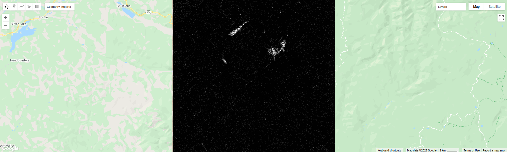

classification in earth engine
=======================================

In this practical, you'll get an introduction to using Google Earth Engine (GEE) to do image classification. Just like the previous
weeks, you should be able to do finish the practical even if you have no prior experience with programming. All of the
programming steps have been provided for you in a script, and your task will be to run each step in turn and analyse and
interpret the results.

getting started
---------------

.. note:: 

    While developing this practical, I had a number of issues with chrome freezing that did not occur when I switched to a different browser
    (firefox). If you notice that the window is repeatedly freezing, it may be worth switching browsers.

To begin, import the script for this week by following `this link <https://code.earthengine.google.com/346f363b3e39da496d6305f53ea54658?noload=true>`__ 
and saving it to your account. If you are not already logged in, you will need to log in using your GEE account.

When you open the script, you should see the following (you may have to zoom/pan to the study area; alternatively, run the
script to center the map):

.. image:: ../../../img/egm702/week5/loaded_script.png
    :width: 600
    :align: center
    :alt: the gee window when the script has been loaded

You can see a number of points identified on the map – these represent the training points that we will use for the classification.
These individual feature collections represent the following things:

+---------------+-----------------------------------------------+
| ``water``     | surface water                                 |
+---------------+-----------------------------------------------+
| ``forest``    | forest                                        |
+---------------+-----------------------------------------------+
| ``clearCut``  | forest that has been recently cut down        |
+---------------+-----------------------------------------------+ 
| ``newGrowth`` | new vegetation that has grown post-eruption   |
+---------------+-----------------------------------------------+
| ``Soil``      | eruptive material and soil                    |
+---------------+-----------------------------------------------+
| ``Snow``      | snow                                          |
+---------------+-----------------------------------------------+

step 1. merging training data and loading images
------------------------------------------------

In the first lines of the script, you should see the following:

.. code-block:: javascript

    // merge all of the different training points into a single featurecollection
    var trainingPoints = water // landcover value 0
      .merge(forest) // landcover value 1
      .merge(clearCut) // landcover value 2
      .merge(newGrowth) // landcover value 3
      .merge(soil) // landcover value 4
      .merge(snow); // landcover value 5
      //.merge(yourClass); // remove the comment to add your new feature class

This will merge each of the training points that you can see on the map above into a single ``FeatureCollection``. Each of the points
has a property, ``landcover``, with an associated value – for example, the value for the ``water`` class is ``0``, for ``forest`` it's ``1``, and so on.
These are the training points we will use to run the Random Forest classification later in the practical. 

If you decide to add additional landcover classes, you can do so by creating a new ``FeatureCollection`` from the **Geometry Imports** menu:

.. image:: ../../../img/egm702/week5/geometry_import.png
    :width: 400
    :align: center
    :alt: the geometry import dialogue

Be sure to give the new ``FeatureCollection`` a name, and add a property called ``landcover`` with a value that is not already being
used – for example, we have numbers 0-5 currently in use, so give the new class a value of ``6``. As you add additional classes, be
sure to use unique values, or else your classification results will not make sense. The next lines:

.. code-block:: javascript

    var bands = ['SR_B2', 'SR_B3', 'SR_B4', 'SR_B5', 'SR_B6', 'SR_B7', 
      //'NDVI', 'NDWI', 'mNDWI', //uncomment to add NDVI, NDWI, mNDWI to classification
      //'Slope', // uncomment to add slope as a classification parameter
      //'elevation' // uncomment to add elevation as a classification parameter
    ];

Will be used to select bands for the classification. To start with, we will use OLI Bands 2-7 (Visible/NIR/SWIR). Later, we will look
at the difference made by using spectral indices or elevation parameters. The final lines to look at in this section will add various
bands to the selected Landsat image:

.. code-block:: javascript

    // add NDVI, NDWI, mNDWI, and Slope layers to each of the training and test images
    img = img
      .addBands(img.normalizedDifference(['SR_B5', 'SR_B4']).rename('NDVI'))
      .addBands(img.normalizedDifference(['SR_B3', 'SR_B5']).rename('NDWI'))
      .addBands(img.normalizedDifference(['SR_B3', 'SR_B6']).rename('mNDWI'))
      .addBands(ee.Terrain.slope(nasadem).rename('Slope'))
      .addBands(nasadem.rename('elevation'))
      .select(bands);

Here, we're using the ``normalizedDifference()`` function to calculate the NDVI (normalized difference vegetation index), NDWI
(normalized difference water index; McFeeters, 1996\ [1]_), and modified NDWI (mNDWI; Xu, 2006\ [2]_). 

It will then add each of these to our image, as well as adding the Slope and elevation from the NASADEM to the image. 
When you run the script, it should center on Mt St Helens and add a false-colour composite of the OLI image to the map:

.. image:: ../../../img/egm702/week5/image_loaded.png
    :width: 600
    :align: center
    :alt: the gee window with the first landsat image loaded

step 2. unsupervised classification
-----------------------------------

Earth Engine provides methods to do both unsupervised and supervised classification. We're going to start by doing an
unsupervised classification (clustering) on our OLI image, as it can help us to decide what classes it might make sense to use.

To start, uncomment this section of the script (remove the ``/*`` from line 54 and the ``*/`` from line 95).

Rather than running the classification using all of the pixels in the original Landsat bands, we'll take a random sample of 5000 pixels:

.. code-block:: javascript

    var training = img.select('SR_B.').sample({
      region: boundary,
      scale: 30,
      numPixels: 5000
    });

This can help improve the performance of the clustering, but it also prevents us from causing ``Out of Memory`` errors when we
run our script – remember that we're running this on an image with at least 7 bands, and even though we've clipped the image
to a size of 1070x1250 pixels, that still leaves a lot of values that the machine has to try to keep track of (1070 * 1250 = 1.33M
pixels/band * 7 bands = 9.36M pixels).

The next lines:

.. code-block:: javascript

    // train the unsupervised clusterer with a maximum of 16 classes
    var clusterer = ee.Clusterer.wekaKMeans(16).train(training);

    // classify the image using the unsupervised classifier
    var unsupervised = img.cluster(clusterer); // returns an image with a single band, 'cluster'

Will run the *k*-means clustering algorithm on the sample of 5000 pixels. Here, we're telling the algorithm to use at most 16 classes
– you can try a few different values to get an idea for how changing this value changes the results of the clustering.

The next block of code will sample the cluster values at each of the training points defined earlier, then plot a chart showing the
landcover value as a function of the cluster value. This will help us to determine whether it makes sense to use the landcover
values as we have defined them, as well as to determine whether our chosen training points represent spectrally distinct classes:

.. code-block:: javascript

    // sample the cluster values at each of the training points
    var clusterPoints = unsupervised.select('cluster').sampleRegions({
      collection: trainingPoints,
      properties: ['landcover'],
      scale: 30
    });

    print(clusterPoints);

    // create a chart that plots the cluster value vs the landcover class value
    // for the training points
    var chart = ui.Chart.feature
      .byFeature({features: clusterPoints.select('landcover|cluster'),  
        xProperty: 'cluster',
        yProperties: ['landcover']
      }).setChartType('ScatterChart')
      .setOptions({
        title: 'cluster values by landcover',
        hAxis: {title: 'cluster', titleTextStyle: {italic: false}},
        vAxis: {title: 'landcover', titleTextStyle: {italic: false}},
      });
    print(chart);

When you run this section of the script, you will see the clustered image added to the map window, as well as the following
chart printed to the **console** panel (note that the order of these columns may change each time you re-run the script):

.. image:: ../../../img/egm702/week5/kmeans_chart.png
    :width: 600
    :align: center
    :alt: the k-means cluster values for different landcover classes

.. image:: ../../../img/egm702/week5/kmeans_image.png
    :width: 600
    :align: center
    :alt: the k-means classified image

From this chart, you can see, for example, that cluster number 3 is identified as both landcover 0 (i.e., water) and 4 (soil). This
chart doesn't tell us how many points belong to each; however, we can look at a confusion matrix of the landcover and cluster
values to learn a bit more:

.. code-block:: javascript

    print(clusterPoints.errorMatrix('landcover', 'cluster'));

.. image:: ../../../img/egm702/week5/kmeans_error_matrix.png
    :width: 400
    :align: center
    :alt: the confusion matrix for the k-means classification

Here, we can see that landcover 0 (the first row of the table) has 40 points identified as cluster type 3 (the fourth column of the
table), and no other values. Landcover 4 (the fifth row of the table) has 1 point identified as cluster type 3 – in other words,
cluster type 3 appears to correspond well to our water class.

Looking at the cluster types for landcover 4, we can see that most of the points are either cluster value 14 (13 points) or cluster
value 15 (20 points), with only a few points labelled; we can see a similar pattern for landcover 2 (clear cut), where most of the
points are identified as cluster value 0 or 1 (14 and 16 points, respectively). However, we can also see that landcover 3 (new
growth) also has a significant number of points in these cluster values, suggesting that there might be some overlap between
the chosen feature points for these two classes.

When we have large amounts of overlap between feature classes like this, we might want to think about what each of these
classes represent - what are the actual physical objects or surfaces that we're trying to identify here? Is the difference between
'new growth' – i.e., vegetation that has started growing on land after the volcanic eruption, and 'clear cut' land a physical
difference, or a semantic difference? 

Remember that it can be very difficult to differentiate between different landcovers if the
difference is a *semantic* one, rather than a *physical* one – it might not make sense to try to differentiate between these different
classes, and instead combine them. This could also mean, however, that we've not done a great job selecting our training points,
and it might point to a need to do a better job selecting distinct training points.

Uncomment the second line of the ``bands`` variable and re-run the script. Does this make a difference in the clustering? What
about for the chart or confusion matrix comparing the landcover and cluster values for each training point?

.. code-block:: javascript

    var bands = ['SR_B2', 'SR_B3', 'SR_B4', 'SR_B5', 'SR_B6', 'SR_B7', 
      'NDVI', 'NDWI', 'mNDWI', //uncomment to add NDVI, NDWI, mNDWI to classification
      //'Slope', // uncomment to add slope as a classification parameter in Step 5
      //'elevation' // uncomment to add elevation as a classification parameter in Step 5
    ];

Re-comment this line, and this section (add a ``/*`` to line 54 and a ``*/`` to line 95), after you've examined the results, and move on to the next section.

step 3. train different classifiers
-----------------------------------

The code in this section will help us run a Random Forest classification on our chosen image, and examine the results. 
Start by uncommenting this section (remove the ``/*`` from line 98 and the ``*/`` from line 141). The following lines of code:

.. code-block:: javascript

    // select training points from the training image
    var training = img.select(bands).sampleRegions({
      collection: trainingPoints,
      properties: ['landcover'],
      scale: 30
    });

    // split the training points into training, testing data
    var split = 0.7;
    var withRandom = training.randomColumn('random');
    var trainingPartition = withRandom.filter(ee.Filter.lt('random', split));
    var testingPartition = withRandom.filter(ee.Filter.gte('random', split));

will select the image band values for each of the training points, then split them into training and test data using a 70-30 split
(i.e., 70% of the data will be used for training, 30% for testing).

The following lines of code will initialize a Random Forest classifier using 100 individual "trees" and train the classifier using the
training data.

.. code-block:: javascript

    // initialize a random forest with 100 "trees"
    var classifier100 = ee.Classifier.smileRandomForest(100).train({
      features: trainingPartition,
      classProperty: 'landcover',
      inputProperties: bands
    });

A second block of code will initialize a Random Forest classifier with only 10 trees, to enable us to compare the results of using
different numbers of trees. 

Finally, we will classify the testing data, then look at the confusion matrix and accuracy
measurements to compare our different classifiers:

.. code-block:: javascript

    // classify the testing data using our trained classifiers
    var test100 = testingPartition.classify(classifier100);
    var test10 = testingPartition.classify(classifier10);

    // make the confsuion matrix for the different test datasets
    var cm100 = test100.errorMatrix('landcover', 'classification');
    var cm10 = test10.errorMatrix('landcover', 'classification');

    // print the confusion matricies, overall accuracy, and kappa statistics
    print('RF 100 error matrix: ', cm100, 
      'RF100 accuracy: ', cm100.accuracy(),
      'RF100 kappa: ', cm100.kappa());
    print('RF 10 error matrix: ', cm10, 
      'RF10 accuracy: ', cm10.accuracy(),
      'RF10 kappa: ', cm10.kappa());

When you run the script, you should see the following in the **console** panels (remember that your results may differ slightly):

.. image:: ../../../img/egm702/week5/error_matrix.png
    :width: 400
    :align: center
    :alt: the error matrix and accuracy values for the 100-tree random forest classification

To help you understand this, I've added row/column labels to this table below:

+----------------+-------+--------+-----------+------------+------+------+
|                | water | forest | clear cut | new growth | soil | snow |
+================+=======+========+===========+============+======+======+
| **water**      | 9     | 0      | 0         | 0          | 0    | 0    |
+----------------+-------+--------+-----------+------------+------+------+
| **forest**     | 0     | 11     | 0         | 0          | 0    | 0    |
+----------------+-------+--------+-----------+------------+------+------+
| **clear cut**  | 0     | 0      | 9         | 7          | 0    | 0    |
+----------------+-------+--------+-----------+------------+------+------+
| **new growth** | 0     | 0      | 5         | 8          | 0    | 0    |
+----------------+-------+--------+-----------+------------+------+------+
| **soil**       | 0     | 0      | 0         | 0          | 14   | 0    |
+----------------+-------+--------+-----------+------------+------+------+
| **snow**       | 0     | 0      | 0         | 0          | 0    | 6    |
+----------------+-------+--------+-----------+------------+------+------+

Like with the unsupervised classification error matrix, the "rows" of this matrix correspond to the landcover class that we
have identified, while the columns correspond to the classified values. In the example above, we see that 9 of our training samples
were classified as landcover class 0 (water), and there were no water training samples that were classified as something else.

The same is true for the forest class (value 1), soil (value 4), and snow (value 5). We do see some significant overlap between 
the clear cut and new growth classes, as we suspected might happen based on the results of the unsupervised classification. Of the 16
samples classified as clear cut (value 2), 7 were classified as new growth (value 3), and there's a similar split for new growth.

From this example, we can also see that the overall accuracy is decently high (82.6%), with a reasonably high kappa statistics (0.788).

Return to the ``bands`` variable, uncomment the second line again, and re-run the script. How does the result for the testing data
change? What about if you add slope and elevation data to the classification? Re-comment each of these lines before moving on
to the next section.

step 4. classify the image and examine the results
--------------------------------------------------

Uncomment this section (remove the ``/*`` from line 144 and the ``*/`` from line 188), and run the script again. The code in this section
will classify the image using the two classifiers trained and tested in the previous section, then add the classified images to the map
(note that you will need to toggle the layers on using the **Layers** menu):

.. code-block:: javascript

    var classified100 = img.select(bands).classify(classifier100);
    var classified10 = img.select(bands).classify(classifier10);

    var classPalette = ['013dd6', '059e2a', 'a6613d', '2aff53', 'e3d4ae', 'fffbf4'];

    Map.addLayer(classified10, {min: 0, max: 5, palette: classPalette}, 'RF 10', false);
    Map.addLayer(classified100, {min: 0, max: 5, palette: classPalette}, 'RF 100', false);

It will also count the number of pixels in each class for the two classifiers, and print the results to the console:

.. code-block:: javascript

    // add some summary statistics (area for each classification, e.g.)
    var class10 =  classified10.updateMask(classified10.eq(0)).rename('water')
      .addBands(classified10.updateMask(classified10.eq(1)).rename('forest'))
      .addBands(classified10.updateMask(classified10.eq(2)).rename('clear cut'))
      .addBands(classified10.updateMask(classified10.eq(3)).rename('new growth'))
      .addBands(classified10.updateMask(classified10.eq(4)).rename('soil'))
      .addBands(classified10.updateMask(classified10.eq(5)).rename('snow'));

    var count10 = class10.reduceRegion({
      reducer: ee.Reducer.count(),
      geometry: boundary,
      scale: 30,
      maxPixels: 1e13,
      tileScale: 8
    });

    // add some summary statistics (area for each classification, e.g.)
    var class100 =  classified100.updateMask(classified100.eq(0)).rename('water')
      .addBands(classified100.updateMask(classified100.eq(1)).rename('forest'))
      .addBands(classified100.updateMask(classified100.eq(2)).rename('clear cut'))
      .addBands(classified100.updateMask(classified100.eq(3)).rename('new growth'))
      .addBands(classified100.updateMask(classified100.eq(4)).rename('soil'))
      .addBands(classified100.updateMask(classified100.eq(5)).rename('snow'));

    var count100 = class100.reduceRegion({
      reducer: ee.Reducer.count(),
      geometry: boundary,
      scale: 30,
      maxPixels: 1e13,
      tileScale: 8
    });

    print("RF 10 Classification results:", count10);
    print("RF 100 Classification results:", count100);

How do the pixel counts compare for the two classifers? Which class has the biggest difference between the two?

When you run the script, you will also see the classified image displayed in the map:

.. image:: ../../../img/egm702/week5/classified_image.png
    :width: 600
    :align: center
    :alt: the random forest classified image

Note that when you are zoomed out, the classification will look different due to the way that the image is re-sampled at lower
resolutions. Zoom in on the peak. Are there significant differences between the different classified images (RF 100 and RF 10)?
What are they? How does this compare to the numerical summary?

the result change significantly if you add the normalized difference indices back to the classification (uncomment line 26)?
Uncomment line 26 to add the NDVI, NDWI, and mNDWI bands back to the image, then re-run the script. How does the classified
image change? What about the numerical results? What about after adding the slope and elevation information?

Leave this section uncommented as you move on to the next sections - this will enable you to compare the pixel-based and object-based
classification results.

step 5. export the classified image(s)
--------------------------------------

The code in this section will enable you to export the classified image to your Google Drive, and use them in, for example,
ArcGIS, QGIS, or ERDAS Imagine.

.. code-block:: javascript

    Export.image.toDrive({image: classified100.select('classification'),
      description: 'RandomForestClassification',
      scale: 30,
      region: boundary,
      crs: 'epsg:32610',
      maxPixels: 1e12
    });

You can change the image name (``classified100``) to export a different image, or duplicate this block of code to export multiple images.

step 6. image segmentation
---------------------------

The last few sections of the practical will take us through an example of object-based classification, to illustrate some of the differences
between object-based image analysis (OBIA) and pixel-based classification.

Start by uncommenting the first part of this section (remove the ``/*`` from line 203 and the ``*/`` from line 241). The following lines of code:

.. code-block:: javascript

    // set parameters for the size of the seeds and clusters for image segmentation
    // 4 appears to be the minimum value for seed size
    var seedSize = 4; //corresponds to 4 * 30 = 120 m spacing;
    var clusterScale = 30;

    // create a layer to seed the segmentation algorithm
    var seeds = ee.Algorithms.Image.Segmentation.seedGrid(seedSize);

    // run simple non-iterative clustering (SNIC) on the image, using our seed layer
    var snic = ee.Algorithms.Image.Segmentation.SNIC({
      image: img.select('SR_B.'),
      compactness: 0,
      connectivity: 4,
      neighborhoodSize: 128,
      seeds: seeds
    });

will use an algorithm called simple non-iterative clustering (SNIC; Achanta and Susstrunk, 2017\ [3]_) to segment our image, 
creating the objects that we'll use for the classification. This section starts by setting two parameters,
``seedSize`` and ``clusterScale``. I've added these here, rather than using the values directly in the
code below, so that it's easier to change the values if we want to experiment later on.

The next block of code will create a vector layer from the objects, fixed at a specific scale (here, 30 m, corresponding to the original image resolution).
We can then add a layer to the map that shows the boundaries of the objects.

.. code-block:: javascript

    // select the clusters (image segments, or objects) from our snic layer
    var clusters = snic.select("clusters");

    // visualize the clusters by creating vectors, then displaying the outlines
    var vectors = clusters.reduceToVectors({
      geometryType: 'polygon',
      reducer: ee.Reducer.countEvery(),
      scale: clusterScale,
      maxPixels: 1e13,
      geometry: boundary,
    });

    var empty = ee.Image().byte();

    var outline = empty.paint({
      featureCollection: vectors,
      color: 1,
      width: 1
    });

    Map.addLayer(outline, {palette: '669999'}, 'segments', false);

Run the script, then toggle the ``segments`` layer on - you should see the outlines layer, with the original false color image underneath. 
Zoom in to have a look around - how do the object boundaries you see relate to the image underneath? Do they agree? Are there areas where
the boundaries vary significantly from what you can see in the underlying image?

.. image:: ../../../img/egm702/week5/segmented_image.png
    :width: 600
    :align: center
    :alt: a satellite image and image segments

One thing to note here is that SNIC starts with a grid spaced by ``seedSize`` pixels and uses this to segment the image - the objects
that we end up with depends on the size of the grid that we start with. To illustrate this, uncomment
(remove the ``/*`` from line 243 and the ``*/`` from line 277) and run the script again.

The only change I've made here is to create a seed grid with twice the spacing as the original:

.. code-block:: javascript

    // create a layer to seed the segmentation algorithm
    var seeds = ee.Algorithms.Image.Segmentation.seedGrid(2 * seedSize);

After that, the code is mostly the same (aside from a color change for the ``coarse segements`` layer). Zoom in on some of the lakes
North of the peak - you should notice that some of the objects for some of the lakes using the coarser seed grid include both "lake"
and "not lake", while the original boundaries do a decent job of picking the shorelines:

This is something to keep in mind - the scale of our segmentation determines the size of the objects that we end up with. If we segment the image
too coarsely, we may end up losing detail that we're interested in.

Once you've had a look around, go ahead and re-comment the coarse segmentation section (add a ``/*`` to line 243 and a ``*/`` to line 277), then
move on to the next section.

step 7. obia features
----------------------

One of the things that we can do with OBIA that is more difficult to incorporate into pixel-based analysis is use image properties such
as texture or contrast, or even the shape of our segments, to aid our classification.

Here, we'll have a look at including texture into our classification using metrics extracted using the Gray Level Co-occurrence
Matrix (GLCM; Haralick et al., 1973\ [4]_). The GLCM contains information about how frequently combinations of pixel values appear
in a specified relationship in the image. We can use this, and the statistical metrics that we can extract from the GLCM,
to analyze the texture of the image.

Here, we'll look at three examples: the Angular Second Moment (ASM), the local contrast, and the entropy. The Angular Second Moment measures how many
repeated pairs of values we see within each small window. The local contrast tells us how much variation we see in the small area, and the
entropy measures the randomness of the values in each small window.

Uncomment the lines in this section (remove the ``/*`` from line 280 and the ``*/`` from line 301), then run the script.

Before we compute the GLCM, we make a grayscale image from the NIR, Red, and Green bands, following Tassi and Vizzari (2020)\ [5]_:

.. code-block:: javascript

    // create a grayscale image to run texture on, following Tassi and Vizzari (2020)
    // paper: https://doi.org/10.3390/rs12223776
    // GEE script: https://code.earthengine.google.com/?accept_repo=users/mvizzari/Tassi_Vizzari_RS2020
    var gray = img.expression(
      '(0.3 * NIR) + (0.59 * R) + (0.11 * G)',
      {'NIR': img.select('SR_B5'),
       'R': img.select('SR_B4'),
       'G': img.select('SR_B3')
    }).rename('gray');

    Map.addLayer(gray, {min: 7500, max: 17500}, 'grayscale', false);

this helps simplify the process somewhat - as we've seen in the lectures, there is often redundant information in nearby bands.

Once we've created this layer, we compute the GLCM and display the three images we're interested in (the ASM, Contrast, and Entropy).

.. code-block:: javascript

    // get the GLCM for the grayscale image
    var glcm = gray.toInt().glcmTexture({size: 2})
      .reproject({crs: gray.projection(), scale: 30});

    print('GLCM Image', glcm);
    Map.addLayer(glcm.select('gray_asm'), {min: 0.0281, max: 0.0354}, 'ASM', false);
    Map.addLayer(glcm.select('gray_contrast'), {min: 3e5, max: 5e6}, 'Contrast', false);
    Map.addLayer(glcm.select('gray_ent'), {min: 3.391, max: 3.577}, 'Entropy', false);

The result of this is an image, ``glcm``, that contains 18 variables for each band in the original image. For a full list of the variables,
you can see the `documentation <https://developers.google.com/earth-engine/apidocs/ee-image-glcmtexture>`__. You can also see a list of the
bands for the ``glcm`` image in the **Console**.

Finally, have a look at the images that have been loaded in the map: the Angular Second Moment (ASM), the Contrast, and the Entropy.
Take a look at the ASM image first:

Remember that this tells us something about the repeated pairs of values within the specified window (here, a window of size 2) - brighter
colors indicate higher values (more repeated values), darker colors indicate lower values
(fewer repeated values). Before moving on to the contrast image, see if you can answer the following questions:

- Where do you see the most repeated values (brightest "colors")?

    - What surfaces do these values represent? 
    - Why do you think this would be so?

- Look at the grayscale image (toggle it on in the **Layers**). How does the image that you see here compare to the ASM image? That is, where do you see more variation in the "color" values?

Now, have a look at the Contrast layer:

.. image:: ../../../img/egm702/week5/contrast.png
    :width: 600
    :align: center
    :alt: an image showing the local contrast in the grayscale image

Here, the bright colors represent the greatest contrast (i.e., difference) in values within the given window. In a way, this is showing us the same sort
of information as the ASM layer - high contrast indicates more variation (and therefore fewer repeated values), while low contrast indicates less variation
(and therefore more repeated values). 

Finally, have a look at the Entropy layer:

.. image:: ../../../img/egm702/week5/entropy.png
    :width: 600
    :align: center
    :alt: an image showing the local entropy in the grayscale image

This is almost the inverse of the ASM layer - areas with high ASM values typically have lower Entropy. This makes some level of sense, given that more repeat
values implies that the distribution is likely less random than values that are more spread out.

Try to compare the three images some more. What patterns do you see in the contrast image? How could you use the texture information to help differentiate
between, for example, the surfaces on north flank of the volcano and the clear-cut areas in the southwest of the image, which have similar values in the
grayscale image?

Once you've spent some time thinking about these questions, move on to the next section, where we'll add the texture bands to our image, and use this to classify
the scene using OBIA.

step 8. obia classification
-----------------------------

Now that we've segmented the image and had a look at the image texture, we'll move on to actually classifying the image using OBIA.

Uncomment the first part of this section section (remove the ``/*`` from line 304 and the ``*/`` from line 370), then run the script. 
The first block of code in this section:

.. code-block:: javascript

    // get the vector labels
    var labels = vectors
      .reduceToImage({
        properties: ['label'],
        reducer: ee.Reducer.first()
    }).rename('id').toInt();

    // add the id layer to the image
    img = img.addBands(labels);

will get the ``id`` (or ``label``) for each of the image objects we created by segmenting the image, then add a layer to the image that labels each
pixel with the ``id`` of the object it's part of. This is how we actually do the "object-based" part of the classification - the actual classification
is quite similar to the pixel-based method we've already seen.

After this, we can add the texture bands to our image:

.. code-block:: javascript

    img = img.addBands(glcm.select('gray_asm'))
      //.addBands(glcm.select('gray_contrast')) // uncomment to add contrast
      //.addBands(glcm.select('gray_ent')); // uncomment to add entropy

To start with, we've only added the ASM layer. Once we've had a look at those results, we'll see how adding additional texture layers changes the classification
results.

The next block:

.. code-block:: javascript

    // get the mean, std, and median values of all bands for each object
    var img_mean = img.reduceConnectedComponents({
      reducer: ee.Reducer.mean(),
      labelBand: 'id'
    });

    var img_std = img.reduceConnectedComponents({
      reducer: ee.Reducer.stdDev(),
      labelBand: 'id'
    });

    var img_med = img.reduceConnectedComponents({
      reducer: ee.Reducer.median(),
      labelBand: 'id'
    });

    var pred_bands = ee.Image.cat([
      img_mean,
      img_std,
      img_med
    ]).float();

will calculate the mean, standard deviation, and median values for each object for each of the image bands
(surface reflectance, normalized difference indices, slope, ASM, contrast, and entropy, depending on which of lines 26--28 and 317--318 you've uncommented).
These are the values that will go into our classification - rather than the individual pixel values we used earlier.

When you run the script, you should see the confusion matrix, accuracy, and kappa values for the object-based classifer printed to the console
(note that this may take some time to finish):

.. image:: ../../../img/egm702/week5/obia_accuracy.png
    :width: 400
    :align: center
    :alt: the error matrix and accuracy values for the OBIA classifier

How does this compare to the pixel-based accuracy values? Try adding the contrast image (uncomment line 317) - how does this impact the
accuracy results? 

What about if you add the entropy layer (uncomment line 318)?

Once you've trained a few different classifiers by commenting/uncommenting lines 26--28 and 317--318, you can move on to the
next part of the section (remove the ``/*`` from line 371 and the ``*/`` from line 398, then re-run the script).

The final part of this section will apply the OBIA classifier we've just trained, count the number of pixels belonging to
each classification, and then display the result in the map and the **Console**:

.. code-block:: javascript

    // apply the classification
    var obia = pred_bands.select(pred_bands.bandNames()).classify(classifier);

    // add the classified layer to the map
    var classPalette = ['013dd6', '059e2a', 'a6613d', '2aff53', 'e3d4ae', 'fffbf4'];

    Map.addLayer(obia, {min: 0, max: 5, palette: classPalette}, 'OBIA Random Forest', true);
    Map.addLayer(outline, {palette: 'ffffff'}, 'segments', false);

We've also added the segments layer again, so that we can compare the classification with the object boundaries (you'll need to
turn this on in the **Layers** menu):

.. image:: ../../../img/egm702/week5/obia_classified.png
    :width: 600
    :align: center
    :alt: the OBIA classified image

How does this classified image compare to the RF results? Where do you see big differences? Do the boundaries of the
classification line up with the image segments?

Have a look at the numeric results, as well - where are the biggest differences between the pixel-based results and 
the object-based results? As you look around the map, do the classified results line up with what you expect to see?

step 9. exporting the obia classification
-------------------------------------------

The code in this section will enable you to export the classified image to your Google Drive, and use them in, for example,
ArcGIS, QGIS, or ERDAS Imagine. To do so, uncomment this section (remove the ``/*`` from line 401 and the ``*/`` from line 409),
then re-run the script:

.. code-block:: javascript

    Export.image.toDrive({image: obia.select('classification'),
      description: 'OBIA Classification',
      scale: 30,
      region: boundary,
      crs: 'epsg:32610',
      maxPixels: 1e13
    });

next steps
----------

You can try to improve on the results in a few ways here. To start with, you could increase the the number of training samples
for each class. To do this for water, for example, highlight the ``water`` layer in the **Geometry Imports** panel by
clicking on it:

.. image:: ../../../img/egm702/week5/geometry_imports.png
    :width: 200
    :align: center
    :alt: the configure geometry import panel

Make sure that **Point drawing** is enabled by clicking on **Add a marker** in the drawing toolbar:

Then click on the map to add points. Make sure that you don't completely overload a class - you want to make sure that the number
of training samples is somewhat balanced, so that the accuracy results aren't skewed as a result.

The example classes provided may not adequately describe the image – can you think of any other classes it might make sense
to add to the classification? You can try adding another class or two by including a number of training samples. Make sure that the 
number of points between the training classes is somewhat balanced – otherwise, there is a chance that you will have
insufficient samples for training.

We have added a number of additional bands to the data in order to help classify the results. Can you think of any other spectral
indices or band ratios, either from the lectures or your own reading, that it might make sense to try to include?

notes and references
----------------------

.. [1] McFeeters, S. K. (1996). *Int. J. Rem. Sens.*, 17(**7**), 1425–1432. doi: `10.1080/01431169608948714 <https://doi.org/10.1080/01431169608948714>`__

.. [2] Xu, H. (2006). *Int. J. Rem. Sens.*, 27(**14**), 3025-3033. doi: `10.1080/01431160600589179 <https://doi.org/10.1080/01431160600589179>`__

.. [3] Achanta, R. and S. Susstrunk (2017). In *Proc. IEEE Conf. Comp. Vis. Patt. Recog.*, pp. 4651--4660. doi: `10.1109/CVPR.2017.520 <https://doi.org/10.1109/CVPR.2017.520>`__ [`open-access pdf <https://openaccess.thecvf.com/content_cvpr_2017/papers/Achanta_Superpixels_and_Polygons_CVPR_2017_paper.pdf>`__]

.. [4] Haralick, R. M., K. Shanmugam and I. Dinstein (1973). *IEEE Trans. Systems, Man, Cybernetics*, SMC-3(**6**), pp. 610-621. doi: `10.1109/TSMC.1973.4309314. <http://doi.org/10.1109/TSMC.1973.4309314>`__

.. [5] Tassi, A. and M. Vizzari (2020). *Rem. Sens.* 12, 3776. doi: `10.3390/rs12223776 <https://doi.org/10.3390/rs12223776>`__

