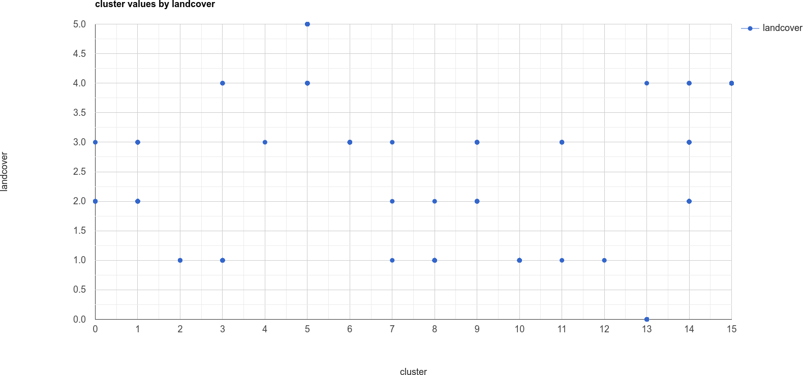

week 5 - classification in earth engine
=======================================

introduction
------------

In this practical, you’ll get an introduction to using Google Earth Engine (GEE) to do image classification. Just like the previous
weeks, you should be able to do finish the practical even if you have no prior experience with programming. All of the
programming steps have been provided for you in a script, and your task will be to run each step in turn and analyse and
interpret the results.

getting started
---------------

To begin, import the script for this week by following `this link <https://code.earthengine.google.com/921bdf0b679cf3452bd5c11643b42eb4?noload=true>`__ 
and saving it to your account. If you are not already logged in, you will need to log in using your GEE account.

When you open the script, you should see the following (you may have to zoom/pan to the study area; alternatively, run the
script to centre the map):

.. image:: ../../../img/egm702/week5/loaded_script.png
    :width: 600
    :align: center
    :alt: the gee window when the script has been loaded

You can see a number of points identified on the map – these represent the training points that we will use for the classification.
These individual feature collections represent the following things:

+---------------+-----------------------------------------------+
| ``water``     | surface water                                 |
+---------------+-----------------------------------------------+
| ``forest``    | forest                                        |
+---------------+-----------------------------------------------+
| ``clearCut``  | forest that has been cut down                 |
+---------------+-----------------------------------------------+ 
| ``newGrowth`` | new vegetation that has grown post-eruption   |
+---------------+-----------------------------------------------+
| ``Soil``      | eruptive material and soil                    |
+---------------+-----------------------------------------------+
| ``Snow``      | snow                                          |
+---------------+-----------------------------------------------+

step 1. merging training data and loading images
------------------------------------------------

In the first lines of the script, you should see the following:

.. code-block:: javascript

    // merge all of the different training points into a single featurecollection
    var trainingPoints = water // landcover value 0
      .merge(forest) // landcover value 1
      .merge(clearCut) // landcover value 2
      .merge(newGrowth) // landcover value 3
      .merge(soil) // landcover value 4
      .merge(snow); // landcover value 5
      //.merge(yourClass);

This will merge each of the training points that you can see on the map above into a single ``FeatureCollection``. Each of the points
has a property, ``landcover``, with an associated value – for example, the value for the ``water`` class is ``0``, for ``forest`` it's ``1``, and so on.
These are the training points we will use to run the Random Forest classification later in the practical. If you decide to add
additional landcover classes, you can do so by creating a new ``FeatureCollection`` from the **Geometry Imports** menu:

.. image:: ../../../img/egm702/week5/geometry_import.png
    :width: 400
    :align: center
    :alt: the geometry import dialogue

Be sure to give the new ``FeatureCollection`` a name, and add a property called ``landcover`` with a value that is not already being
used – for example, we have numbers 0-5 currently in use, so give the new class a value of ``6``. As you add additional classes, be
sure to use unique values, or else your classification results will not make sense. The next lines:

.. code-block:: javascript

    var bands = ['B2', 'B3', 'B4', 'B5', 'B6', 'B7', 
      //'NDVI', 'NDWI', 'mNDWI', //uncomment to add NDVI, NDWI, mNDWI to classification
      //'Slope', // uncomment to add slope as a classification parameter in Step 5
      //'elevation' // uncomment to add elevation as a classification parameter in Step 5
    ];

Will be used to select bands for the classification. To start with, we will use OLI Bands 2-7 (Visible/NIR/SWIR). Later, we will look
at the difference made by using spectral indices or elevation parameters. The final lines to look at in this section will add various
bands to the selected Landsat image:

.. code-block:: javascript

    // add NDVI, NDWI, mNDWI, and Slope layers to each of the training and test images
    img = img
      .addBands(img.normalizedDifference(['B5', 'B4']).rename('NDVI'))
      .addBands(img.normalizedDifference(['B3', 'B5']).rename('NDWI'))
      .addBands(img.normalizedDifference(['B3', 'B6']).rename('mNDWI'))
      .addBands(ee.Terrain.slope(nasadem).rename('Slope'))
      .addBands(nasadem.rename('elevation'))
      .select(bands);

Here, we’re using the ``normalizedDifference()`` function to calculate the NDVI, NDWI, and modified NDWI (mNDWI) and add each of
these to our image, as well as adding the Slope and elevation from the NASADEM to the image. When you run the script, it
should centre on Mt St Helens and add a false-colour composite of the OLI image to the map:

.. image:: ../../../img/egm702/week5/image_loaded.png
    :width: 600
    :align: center
    :alt: the gee window with the first landsat image loaded

step 2. unsupervised classification
-----------------------------------

Earth Engine provides methods to do both unsupervised and supervised classification. We’re going to start by doing an
unsupervised classification (clustering) on our OLI image, as it can help us to decide what classes it might make sense to use.

Rather than running the classification using all of the pixels in the image, we’ll take a random sample of 5000 pixels:

.. code-block:: javascript

    var training = img.sample({
      region: boundary,
      scale: 30,
      numPixels: 5000
    });

This can help improve the performance of the clustering, but it also prevents us from causing ``Out of Memory`` errors when we
run our script – remember that we’re running this on an image with at least 7 bands, and even though we’ve clipped the image
to a size of 1070x1250 pixels, that still leaves a lot of values that the machine has to try to keep track of (1070x1250 = 1.33M
pixels).

The next lines:

.. code-block:: javascript

    // train the unsupervised clusterer with a maximum of 16 classes
    var clusterer = ee.Clusterer.wekaKMeans(16).train(training);

    // classify the image using the unsupervised classifier
    var unsupervised = img.cluster(clusterer); // returns an image with a single band, 'cluster'

Will run the *k*-means clustering algorithm on the sample of 5000 pixels. In this case, we’re telling the algorithm to use 16 classes
– you can try a few different values to get an idea for how changing this value changes the results of the clustering.

The following lines will sample the cluster values at each of the training points defined earlier, then plot a chart showing the
landcover value as a function of the cluster value. This will help us to determine whether it makes sense to use the landcover
values as we have defined them, as well as to determine whether our chosen training points represent spectrally distinct classes:

.. code-block:: javascript

    // sample the cluster values at each of the training points
    var clusterPoints = unsupervised.select('cluster').sampleRegions({
      collection: trainingPoints,
      properties: ['landcover'],
      scale: 30
    });

    print(clusterPoints);

    // create a chart that plots the cluster value vs the landcover class value
    // for the training points
    var chart = ui.Chart.feature
      .byFeature({features: clusterPoints.select('landcover|cluster'),  
        xProperty: 'cluster',
        yProperties: ['landcover']
      }).setChartType('ScatterChart')
      .setOptions({
        title: 'cluster values by landcover',
        hAxis: {title: 'cluster', titleTextStyle: {italic: false}},
        vAxis: {title: 'landcover', titleTextStyle: {italic: false}},
      });
    print(chart);

When you run this section of the script, you will see the clustered image added to the map window, as well as the following
chart printed to the **console** panel (note that the order of these columns may change each time you re-run the script):

.. image:: ../../../img/egm702/week5/kmeans_image.png
    :width: 600
    :align: center
    :alt: the k-means classified image

From this chart, you can see, for example, that cluster number 3 is identified as both landcover 0 (i.e., water) and 4 (soil). This
chart doesn’t tell us how many points belong to each; however, we can look at a confusion matrix of the landcover and cluster
values to learn a bit more:

.. code-block:: javascript

    print(clusterPoints.errorMatrix('landcover', 'cluster'));

.. image:: ../../../img/egm702/week5/kmeans_error_matrix.png
    :width: 400
    :align: center
    :alt: the confusion matrix for the k-means classification

Here, we can see that landcover 0 (the first row of the table) has 40 points identified as cluster type 3 (the fourth column of the
table), and no other values. Landcover 4 (the fifth row of the table) has 1 point identified as cluster type 3 – in other words,
cluster type 3 appears to correspond well to our water class.

Looking at the cluster types for landcover 4, we can see that most of the points are either cluster value 14 (13 points) or cluster
value 15 (20 points), with only a few points labelled; we can see a similar pattern for landcover 2 (clear cut), where most of the
points are identified as cluster value 0 or 1 (14 and 16 points, respectively). However, we can also see that landcover 3 (new
growth) also has a significant number of points in these cluster values, suggesting that there might be some overlap between
the chosen feature points for these two classes.

When we have large amounts of overlap between feature classes like this, we might want to think about what each of these
classes represent - what are the actual physical objects or surfaces that we’re trying to identify here? Is the difference between
‘new growth’ – i.e., vegetation that has started growing on land after the volcanic eruption, and ‘clear cut’ land a physical
difference, or a semantic difference? Remember that it can be very difficult to differentiate between different landcovers if the
difference is a semantic one, rather than a physical one – it might not make sense to try to differentiate between these different
classes, and instead combine them. This could also mean, however, that we’ve not done a great job selecting our training points,
and it might point to a need to do a better job selecting distinct training points.

Uncomment the second line of the ``bands`` variable and re-run the script. Does this make a difference in the clustering? What
about for the chart or confusion matrix comparing the landcover and cluster values for each training point?

.. code-block:: javascript

    var bands = ['B2', 'B3', 'B4', 'B5', 'B6', 'B7', 
      'NDVI', 'NDWI', 'mNDWI', //uncomment to add NDVI, NDWI, mNDWI to classification
      //'Slope', // uncomment to add slope as a classification parameter in Step 5
      //'elevation' // uncomment to add elevation as a classification parameter in Step 5
    ];

Re-comment this line after you’ve examined the results, and move on to the next section.

step 3. train different classifiers
-----------------------------------

The code in this section will help us run a Random Forest classification on our chosen image, and examine the results. The
following lines of code:

.. code-block:: javascript

    // select training points from the training image
    var training = img.select(bands).sampleRegions({
      collection: trainingPoints,
      properties: ['landcover'],
      scale: 30
    });

    // split the training points into training, testing data
    var split = 0.7;
    var withRandom = training.randomColumn('random');
    var trainingPartition = withRandom.filter(ee.Filter.lt('random', split));
    var testingPartition = withRandom.filter(ee.Filter.gte('random', split));

will select the image band values for each of the training points, then split them into training and test data using a 70-30 split
(i.e., 70% of the data will be used for training, 30% for testing).

The following lines of code will initialize a Random Forest classifier using 100 individual “trees” and train the classifier using the
training data.

.. code-block:: javascript

    // initialize a random forest with 100 "trees"
    var classifier100 = ee.Classifier.smileRandomForest(100).train({
      features: trainingPartition,
      classProperty: 'landcover',
      inputProperties: bands
    });

A second block of code will initialize a Random Forest classifier with only 10 trees, to enable us to compare the results of using
different numbers of trees. 

Finally, we will classify the testing data, then look at the confusion matrix and accuracy
measurements to compare our different classifiers:

.. code-block:: javascript

    // classify the testing data using our trained classifiers
    var test100 = testingPartition.classify(classifier100);
    var test10 = testingPartition.classify(classifier10);

    // make the confsuion matrix for the different test datasets
    var cm100 = test100.errorMatrix('landcover', 'classification');
    var cm10 = test10.errorMatrix('landcover', 'classification');

    // print the confusion matricies, overall accuracy, and kappa statistics
    print('RF 100 error matrix: ', cm100, 
      'RF100 accuracy: ', cm100.accuracy(),
      'RF100 kappa: ', cm100.kappa());
    print('RF 10 error matrix: ', cm10, 
      'RF10 accuracy: ', cm10.accuracy(),
      'RF10 kappa: ', cm10.kappa());

When you run the script, you should see the following in the **console** panels (remember that your results may differ slightly):

.. image:: ../../../img/egm702/week5/error_matrix.png
    :width: 400
    :align: center
    :alt: the error matrix and accuracy values for the 100-tree random forest classification

From this example, we can see that the overall accuracy is quite high (82.6%), with a reasonably high kappa statistics (0.788).
However, we can also see a significant overlap between the clear cut and new growth classes, as we suspected might happen
based on the results of the unsupervised classification.

Return to the ``bands`` variable, uncomment the second line again, and re-run the script. How does the result for the testing data
change? What about if you add slope and elevation data to the classification? Re-comment each of these lines before moving on
to the next section.

step 4. classify the image and examine the results
--------------------------------------------------

The code in this section will classify the image using the two classifiers trained and tested in the previous section:

.. code-block:: javascript

    var classified100 = img.select(bands).classify(classifier100);
    var classified10 = img.select(bands).classify(classifier10);

    var classPalette = ['013dd6', '059e2a', 'a6613d', '2aff53', 'e3d4ae', 'fffbf4'];

    Map.addLayer(classified10, {min: 0, max: 5, palette: classPalette}, 'RF 10', false);
    Map.addLayer(classified100, {min: 0, max: 5, palette: classPalette}, 'RF 100', true);

Run the script and examine the results:

.. image:: ../../../img/egm702/week5/classified_image.png
    :width: 600
    :align: center
    :alt: the random forest classified image

Note that when you are zoomed out, the classification will look different due to the way that the image is re-sampled at lower
resolutions. Zoom in on the peak. Are there significant differences between the different classified images (RF 100 and RF 10)?
What are they?

Re-run the script after adding the NDVI, NDWI, and mNDWI bands back to the image. How does the classified image change?
What about after adding the slope and elevation information?

step 5. export the classified image(s)
--------------------------------------

The code in this section will enable you to export the classified image to your Google Drive, and use them in, for example,
ArcGIS, QGIS, or ERDAS Imagine.

.. code-block:: javascript

    Export.image.toDrive({image: classified100.select('classification'),
      description: 'RandomForestClassification',
      scale: 30,
      region: boundary,
      crs: 'epsg:32610',
      maxPixels: 1e12
    });

You can change the image name (``classified100``) to export a different image, or duplicate this block of code to export multiple images.

next steps
----------

The example classes provided may not adequately describe the image – can you think of any other classes it might make sense
to add to the classification? Try adding another class or two by including a number of training samples. Make sure that the
number of points between the training classes is somewhat balanced – otherwise, there is a chance that you will have
insufficient samples for training.

We have added a number of additional bands to the data in order to help classify the results. Can you think of any other spectral
indices or band ratios, either from the lectures or your own reading, that it might make sense to try to include?

