Orfeo ToolBox for QGIS
=======================

In addition to the GRASS GIS and SAGA GIS processing tools, we will also make use of the tools provided by
`Orfeo ToolBox <https://www.orfeo-toolbox.org/>`__ (OTB) for carrying out the object-based image classification in QGIS.

To install OTB, visit the `downloads <https://www.orfeo-toolbox.org/download/>`__ page, then click the button for your
operating system to download a compressed folder to your computer.

Once the download has finished, locate the compressed folder (most likely in your **Downloads** folder), right-click
on the file, and select **Extract all**.

.. note::

    If you have `7-Zip <https://www.7-zip.org/>`__ installed, you may want to use that to extract the files, rather
    than the built-in extraction too.

    If you don't have 7-Zip installed, you may want to do that (it is also free!). In addition to the typically better
    performance than the built-in compression tools for Windows, it offers a wider range of support for different
    compression formats, including the zipped tar (**.tar.gz**) files used for Landsat files.

We're going to extract the files to a new folder, ``otb``, in our **HOME** directory: ``C:\Users\{username}\otb``,
where ``{username}`` is your username (e.g., "bob"). This way, we know that (a) we have permission to extract the files
here, and (b) we can easily find the files later.

Using either 7-Zip or the built-in extraction tool, enter the name of the new directory under
**Files will be extracted to this folder:**, making sure to replace ``{username}`` with **your own username**:

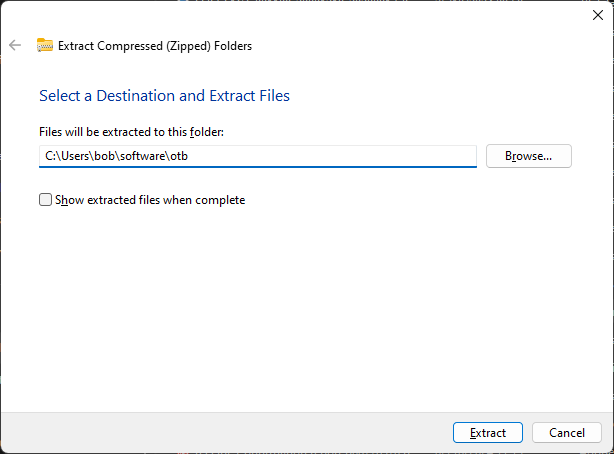

|br| Click **Extract** to begin extracting the files.

qgis plugin
------------

Once the extraction has finished, open QGIS:

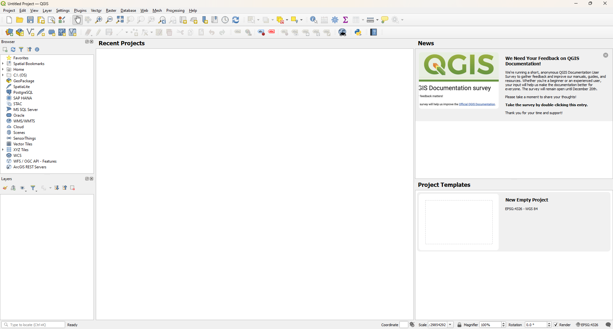

|br| Open the plugin manager (**Plugins** > **Manage and Install Plugins**), select the **All** tab, then type
"orfeo" into the search bar:

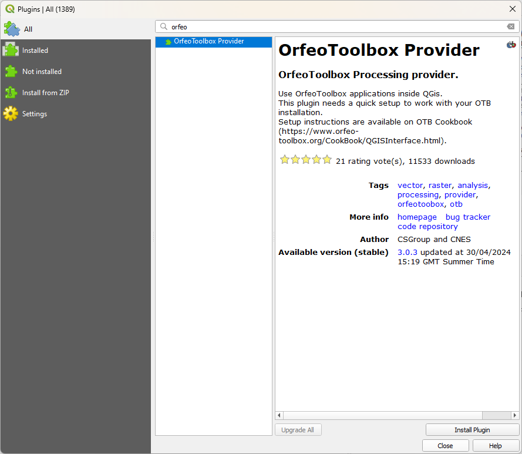

|br| As you did for both SAGA and GRASS, install the plugin by clicking **Install**, then close the plugin manager. The
last bit of setup we need to do is to tell the plugin where to find the Orfeo ToolBox files that we just extracted.

Open the **Options** manager from the **Settings** menu (**Settings** > **Options**):

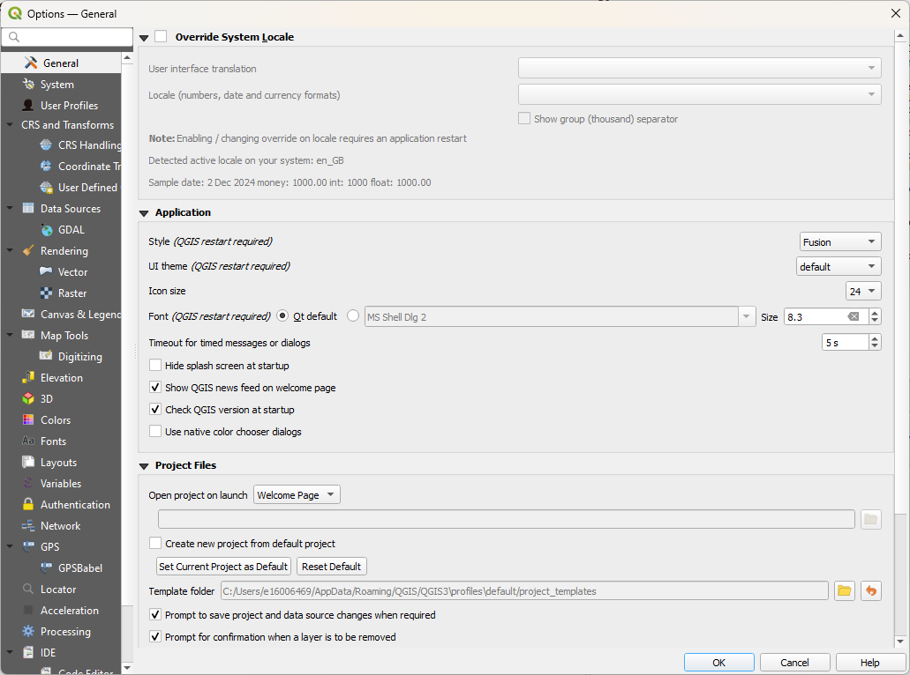

|br| On the left hand side, select **Processing**:

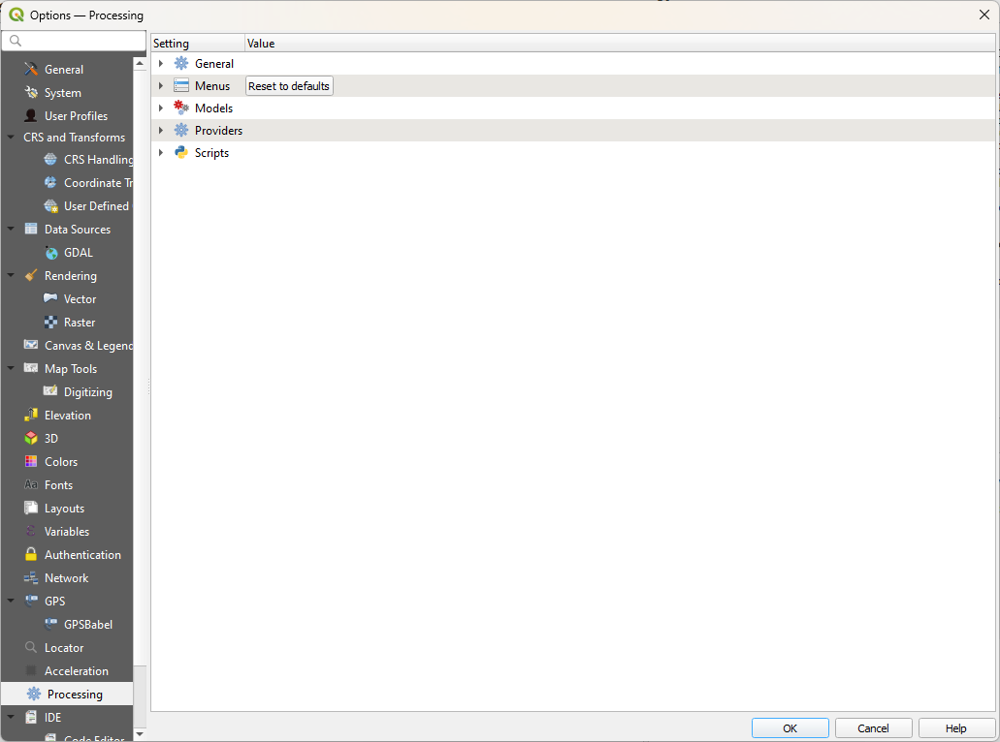

|br| Then, expand **Providers** by clicking on the arrow, followed by **OTB**:

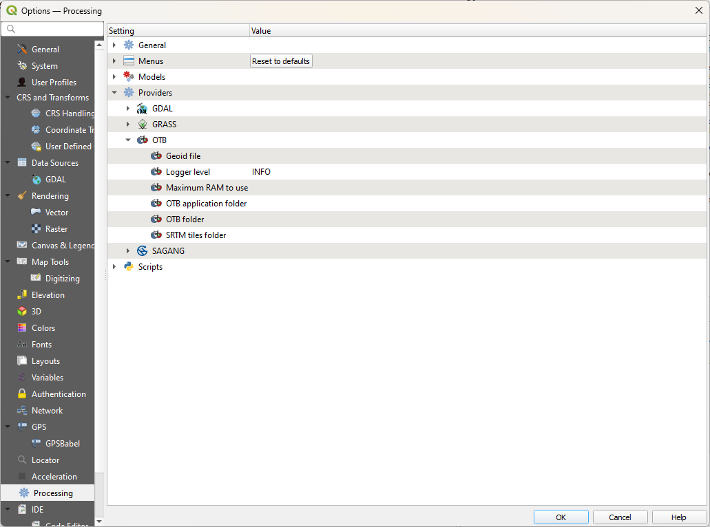

|br| If you double-click the field next to **OTB folder**, you should see a button with three dots appear. Click this
to open a file browser, then navigate to where you just extracted the Orfeo ToolBox files (e.g.,
``C:\Users\{username}\software\otb``). Click **Select Folder**, which should add the path to the folder to the
settings:

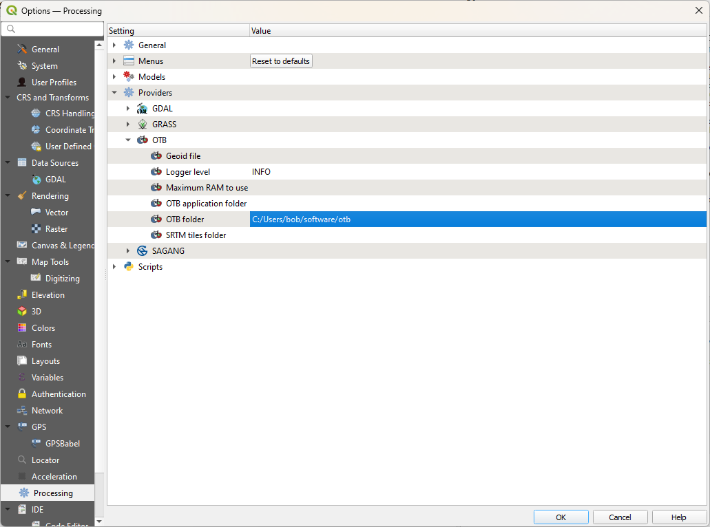

|br| Now, we can do the same for **OTB application folder**: double-click the empty field, then click the button that
appears to bring up a new dialog:

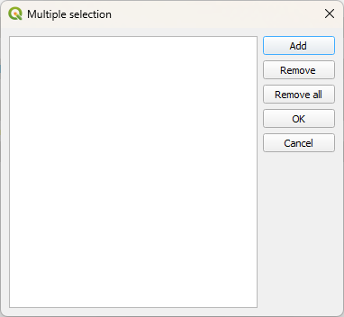

|br| Click **Add**, then browse within the OTB folder (``C:\Users\{username}\software\otb``) to find the
``applications`` folder.

It should be located at ``{otb_folder}\lib\otb\applications``, so first click on the ``lib`` folder, followed by
``otb``, and then highlight the ``applications`` folder. Click **Select Folder**, which will add this path to the
dialog:

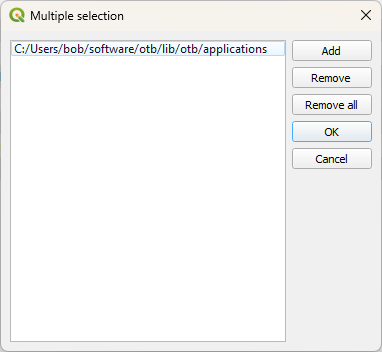

|br| Finally, click **OK** to return to the options window. You should see that both fields have now been populated:

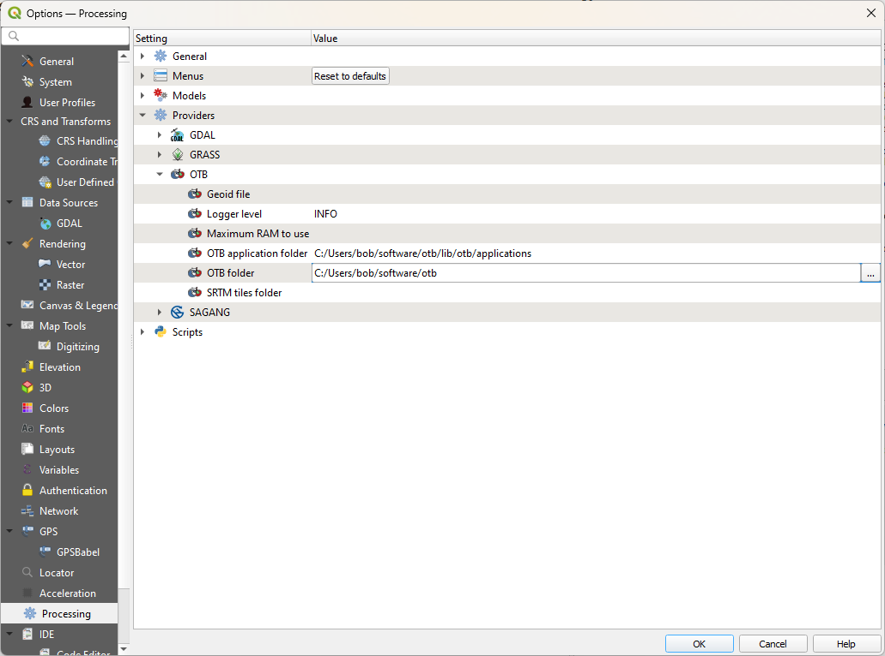

|br| To check that this has worked, open the **Processing** toolbox (**Processing** > **Toolbox**). After a minute,
and assuming that you have selected the right folders, you should see the **OTB** toolbox added to the list:

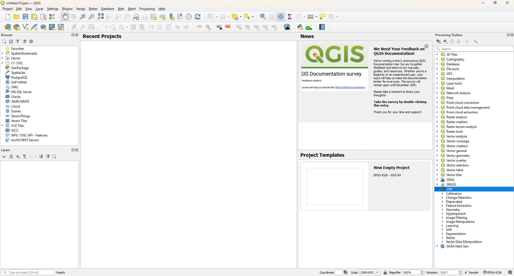

|br| That's the end of the setup steps - from here, you should be able to get started on the practical exercises. If
you don't see the three toolboxes (GRASS, SAGA, and OTB), post a message in the discussion board that includes
screenshots of the Processing Options window - we should be able to get you sorted.

