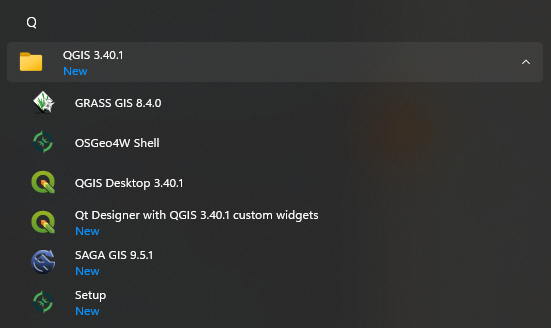
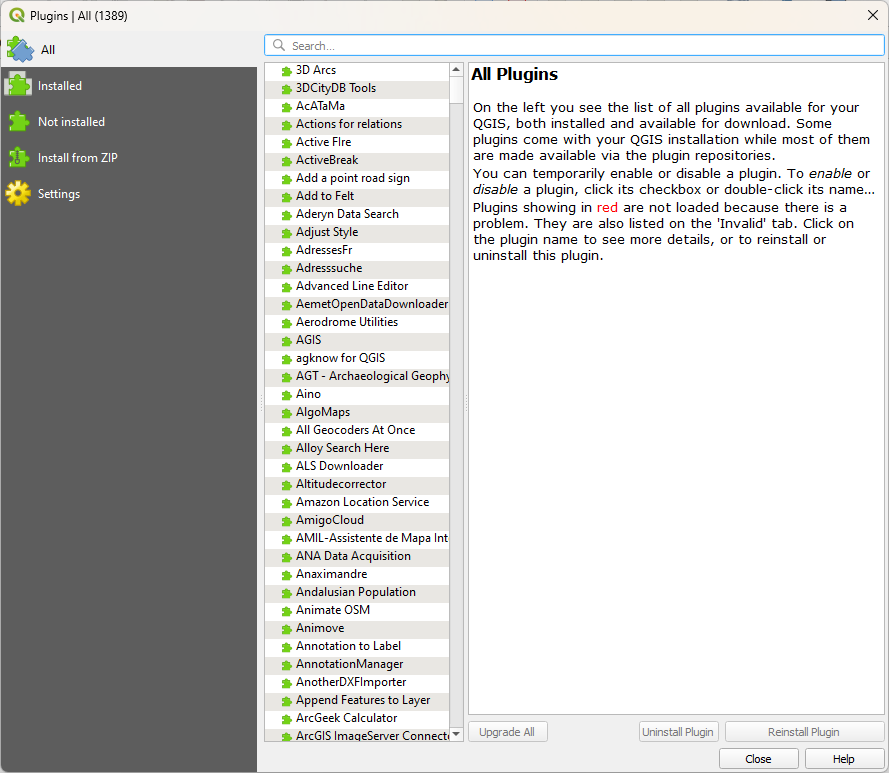
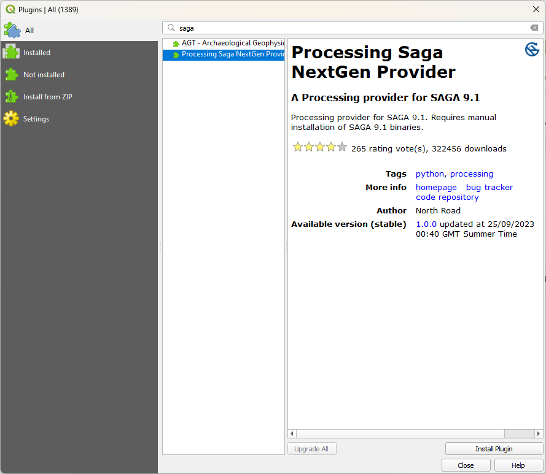
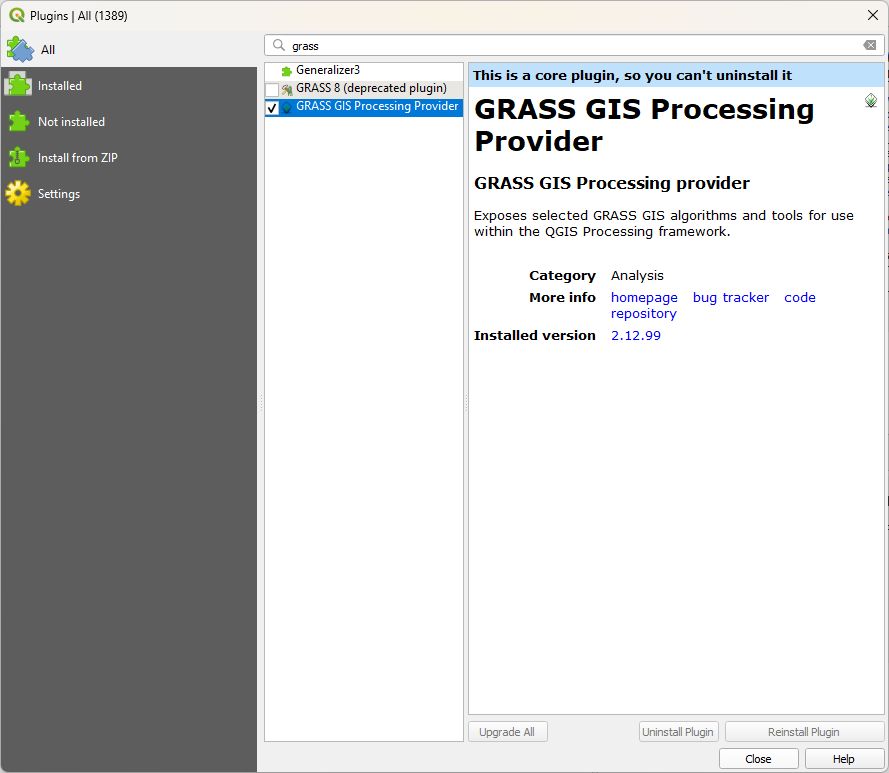
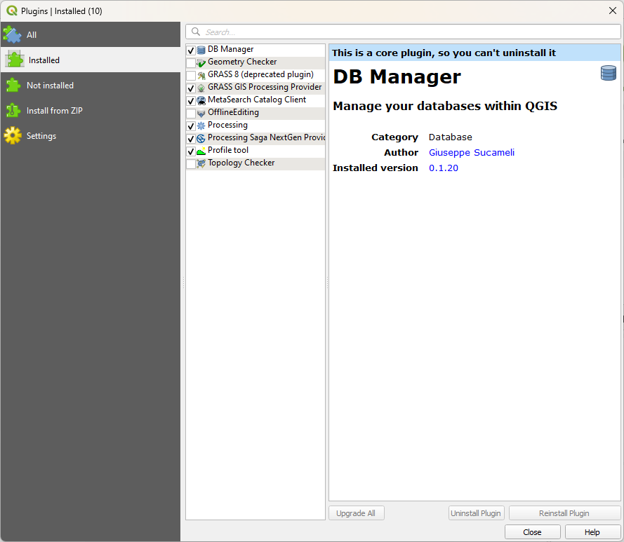
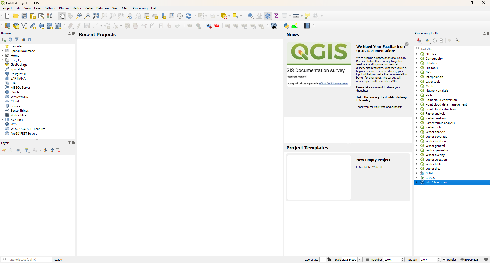

QGIS
=====

.. note::

    The instructions on this page are written primarily for Windows operating systems. If you are using a different
    operating system (e.g., MacOS, Linux), you can still download

.. note::

    On Windows, you will need to have administrator rights to your machine in order to install QGIS.

To install QGIS, all you need to do is visit the `downloads <https://www.qgis.org/download/>`__ page and select the
installer for your operating system.

Once the file downloads, locate it on your computer (most likely, in your ``Downloads`` folder), then double-click on
it to start the installer.

If you install QGIS using the Windows installer, it should automatically include both
`SAGA GIS <https://saga-gis.sourceforge.io/en/index.html>`__ and `GRASS GIS <https://grass.osgeo.org/>`__, two
additional programs that extend the power of QGIS.

To check this, look at the QGIS **Start** menu folder (**Start** > **All Apps** > **QGIS**). You should see these
programs installed as well:

|br| If you see QGIS, SAGA GIS, and GRASS GIS in the **Start** menu folder, you can skip to the :ref:`qgis plugins`
section below.

If you do not see these programs, you can follow the instructions in the next two sections below to install them.

saga gis
---------

To download and install SAGA GIS by itself, visit the
`downloads <https://sourceforge.net/projects/saga-gis/files/SAGA%20-%209/>`__ page for the project. Download the
installer for your operating system (for Windows, this is likely to be ``saga-{version}_x64_setup.exe``,
where ``{version}`` is the software version).

Once the installer downloads, run the installer, following the instructions given.

grass gis
----------

To download and install GRASS GIS, visit the `downloads <https://grass.osgeo.org/download/>`__ page for the project.
Find your operating system, then select the **Standalone installer** for the *current* version of GRASS GIS.

.. warning::

    Make sure to download the *installer* for your operating system, and not the source code! You are welcome to try
    to compile and install the software from source, but it is likely to be much more difficult than using the
    installer!

.. _qgis plugins:

qgis plugins
-------------

Once you have downloaded and installed QGIS, and ensured that both GRASS GIS and SAGA GIS are installed, you can
finish the setup by installing the plugins for both programs\ [1]_.

First, open QGIS. You should see something like the following:

.. image:: img/qgis_blank.png
    :width: 720
    :align: center
    :alt: the blank QGIS window

|br| To install/manage plugins, open the manager from the **Plugins** menu (**Plugins** >
**Manage and Install Plugins**). You should see something like the following:

|br| As you can see, there are a huge number of user-created plugins available in QGIS. We're only going to install
two at the moment, but feel free to have a browse to see if you can find anything useful.

To install the SAGA plugin, type "saga" into the search bar at the top of the window. You should see two options - make
sure to select **Processing Saga NextGen Provider**:

|br| Once you have selected the plugin, click **Install Plugin** to install it. After a moment, you should see the
plugin finish installing:

.. image:: img/qgis_plugins_saga_installed.png
    :width: 500
    :align: center
    :alt: the qgis plugin manager, with the "processing saga nextgen provider" plugin installed

|br| Now, delete "saga" from the search bar, then type in "grass". Again, you should see a few options here - make
sure to select **GRASS GIS Processing Provider**:

|br| It may already be installed; if not, you can install it the same way that you did for SAGA, by clicking
**Install Plugin**. Finally, check what plugins you have installed by clicking on the **Installed** tab in the manager:

|br| QGIS installs some plugins by default, though it doesn't necessarily enable them. You can enable (or disable)
plugins by checking (or unchecking) the box next to each one. We can see here that both SAGA and GRASS processing
are installed and enabled - as long as this is the case, you can close the plugin manager and return to the main
window.

To access the functions provided by SAGA, GRASS (and other) plugins, you can open the **Processing** toolbox
(**Processing** > **Toolbox**), which will open as a panel on the right side of the window:

|br| You should be able to see the built-in QGIS functions, as well as functions provided by GDAL (for working with
rasters), GRASS, and SAGA.

At this point, you can move on to the next step of the setup - installing Orfeo ToolBox.

notes
------

.. [1] Both GRASS GIS and SAGA GIS are standalone GIS programs in their own right (as you will see in this module).
    We can use many of the functions provided by GRASS, SAGA, and other programs provided by other users - you can
    even write your own!
