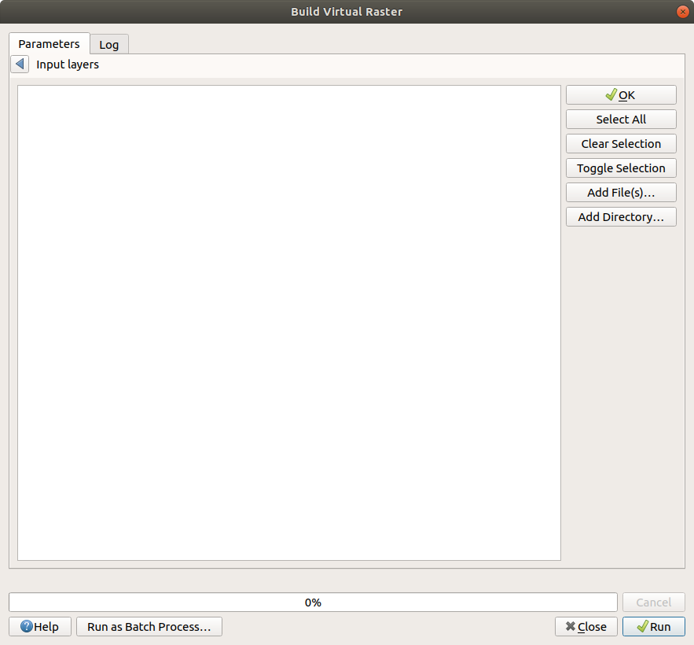
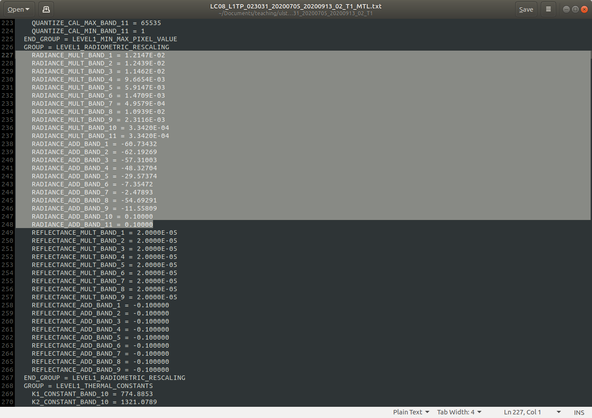
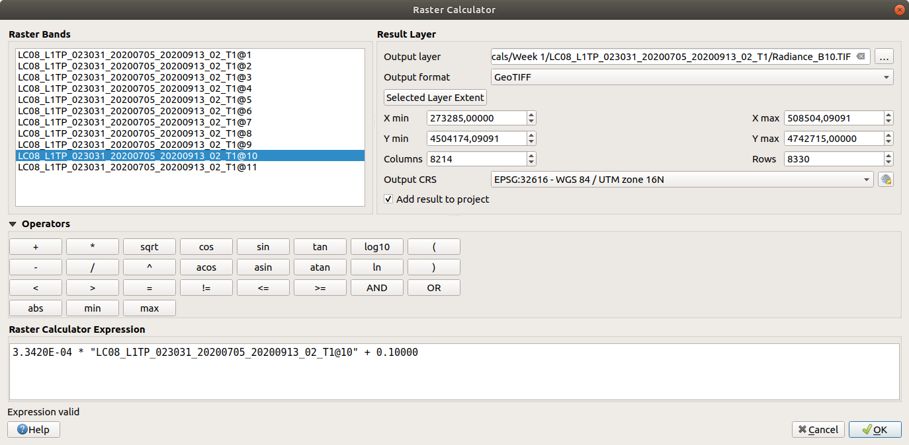
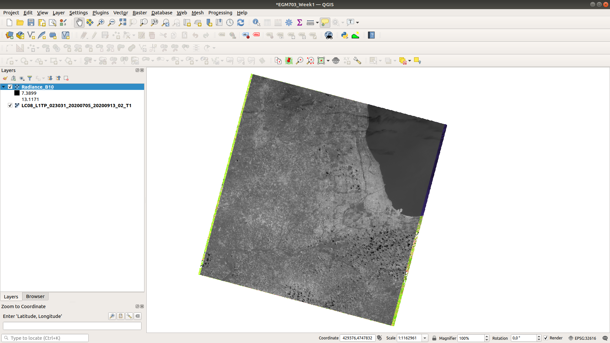
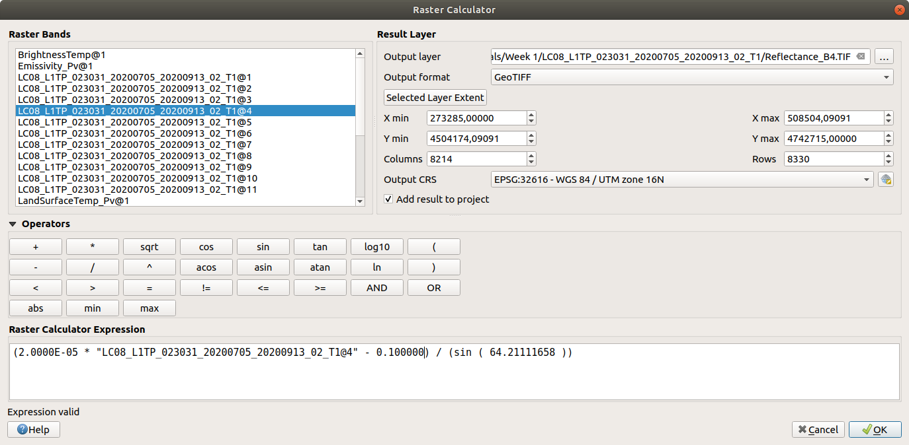
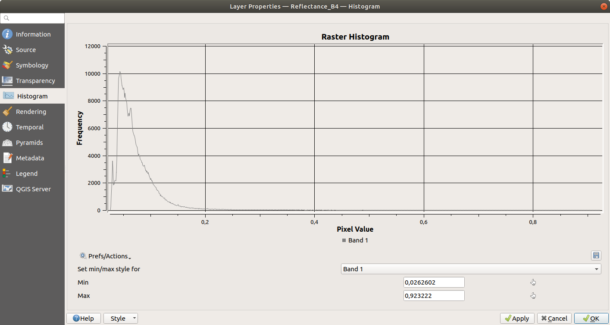
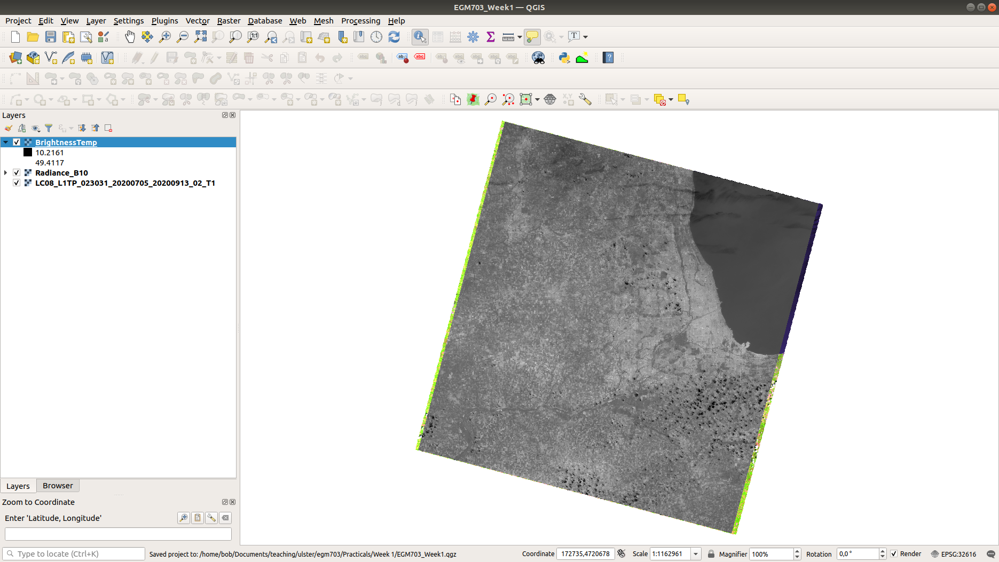

urban heat islands
===========================

For this week's practical, we'll learn the steps of processing a raw Landsat image through to Land Surface Temperature, with the purpose of investigating urban heat islands. In particular, by the end of this practical, you will be able to use QGIS or ArcGIS Pro to:

- convert DN images to radiance
- calculate brightness temperature and land surface temperature
- investigate the relationship between different landcover types and land surface temperature
- see how emissivity values affect estimated land surface temperature

.. note::
    The following instructions were written using QGIS 3.16.3, which is also what the example images show. The instructions should be transferrable to other flavors of QGIS, and even ArcGIS Pro, though there may be some differences in naming/appearance.

getting started
---------------

You can download the data used for this practical from the module page on Blackboard. If you don't have access to the module page on Blackboard, you can still follow along with this practical by downloading the images from `Earth Explorer <https://earthexplorer.usgs.gov>`__. The three Landsat images used for this practical are:

- LC08_L1TP_023031_20200705_20200913_02_T1
- LE07_L1TP_023031_19990704_20200918_02_T1
- LT05_L1TP_023031_19890630_20200916_02_T1

These are, respectively, a Landsat 8 OLI/TIRS scene from 5 July 2020, a Landsat 7 ETM+ scene from 04 July 1999, and a Landsat 5 TM scene from 30 June 1990. 

.. note::
    If you are downloading these images from Earth Explorer, you will need to make sure to set the nodata value for each band (NoData Value = 0), either using GDAL, QGIS, or ArcGIS. 
    If you don't set the nodata value, your end results may look quite a bit different from what is shown here! The images provided over blackboard have also been cropped to make the
    file sizes easier to store/download, but are otherwise the same as the ones provided by USGS.

.. note::
    The Landsat 7 ETM+ image has two different files for Band 6: VCID_1 and VCID_2. This is because there are two different ways that USGS process these images: either high or low gain.
    The main differences between the two are the levels where the image will be saturated, and the dynamic range of the image. For this application, VCID_1 is probably fine,
    though you are welcome to complete the steps for both images to see the differences for yourself. Just make sure that you use the correct rescaling values from the metadata for the image!

Once you have unzipped/untarred your image data, open up your GIS software. We'll start by adding the Landsat 8 image and creating a color composite of (almost) all of the bands for visualization - feel free to repeat this for each of the other two images, though the bands will be different for the TM/ETM+ images.

building a color composite
--------------------------

In QGIS, the tool to use can be found under **Raster** > **Miscellaneous** > **Build Virtual Raster**:

.. image:: ../../../img/egm703/week1/build_virtual_raster.png
    :width: 600
    :align: center
    :alt: the build virtual raster window

In ArcGIS Pro, the tool to use is `Composite Bands (Data Management) <https://pro.arcgis.com/en/pro-app/latest/tool-reference/data-management/composite-bands.htm>`__.

Click the ``...`` button at the top of the window, then click **Add File(s)** from the right-hand panel:

Navigate to the folder where you have the Landsat 8 image, then select each of the individual bands (LC08_L1TP_023031_20200705_20200913_02_T1_B1.TIF, LC08_L1TP_023031_20200705_20200913_02_T1_B2.TIF, ...).

Be sure to check **Place each input file into a separate band**. Under **Virtual**, click the ``...`` button and select **Save to file**. Save the file to LC08_L1TP_023031_20200705_20200913_02_T1.vrt and click **Run**. When the process finishes, you should see the virtual raster loaded into the map:

.. image:: ../../../img/egm703/week1/image_loaded.png
    :width: 600
    :align: center
    :alt: the virtual raster loaded into the map window

You can change the symbology by double-clicking on the layer name to open the **Layer Properties** window, then selecting the **Symbology** tab:

.. image:: ../../../img/egm703/week1/symbology.png
    :width: 600
    :align: center
    :alt: the symbology window

Change the symbology to a false-color composite of bands 6, 5, and 4 (654). You can also stretch the image by right-clicking on the layer name and selecting **Stretch Using Current Extent**, which can help improve the contrast as we look at the scene.

converting raw images to top-of-atmosphere radiance
---------------------------------------------------

Now that you have the image bands loaded, we can work on the first step of calculating land surface temperature: converting the raw images to top-of-atmosphere (TOA) spectral radiance. The equation for converting the raw image values (DNs) to radiance :math:`L_\lambda` is given by: 

.. math::

    L_\lambda = M_L Q_{\rm cal} + A_L

where :math:`M_L` is a multiplicative rescaling factor, :math:`Q_{\rm cal}` is the DN value, and :math:`A_L` is an additive rescaling factor. Both :math:`M_L` and :math:`A_L` can be found in the metadata (**MTL.txt**) file distributed with the Landsat scene, where they are called ``RADIANCE_MULT_BAND_X`` and ``RADIANCE_ADD_BAND_X``, respectively. 

If you open **LC08_L1TP_023031_20200705_20200913_02_T1_MTL.txt** and scroll to about line 227, you should see the following:

These are the values we'll need to use to convert the raw images to top-of-atmosphere (spectral) radiance. Open the **Raster Calculator** and enter the following formula for TIRS Band 10:

::

    3.3420E-04 * "LC08_L1TP_023031_20200705_20200913_02_T1@10" + 0.1000

Save the image to your workspace as **Radiance_B10.tif** (or something similar), then press **OK**. Once the tool is finished, load the radiance raster to your map (if it doesn't load automatically). It should look something like this:

Note that the units for this raster are the units of radiance, Watts per square meter per steradian per micrometer (:math:`\rm W\ m^{-2}\ srad^{-1}\ {\mu}m^{-1}`). Because this is just a rescaling of the raw image, it should look very similar to the original image.

converting raw images to top-of-atmosphere reflectance
------------------------------------------------------

Next, we'll convert the raw bands to top-of-atmosphere reflectance (:math:`\rho_\lambda`) using the metadata. Similarly for the radiance, the formula is:

.. math::

    \rho_\lambda = \frac{M_\rho Q_{\rm cal} + A_\rho}{\sin\theta_{\rm SE}}

where :math:`M_\rho` is a multiplicative rescaling factor, :math:`Q_{\rm cal}` is the DN value, :math:`M_\rho` is an additive rescaling factor, and :math:`\theta_{\rm SE}` is the solar elevation angle. As with :math:`M_L` and :math:`A_L`, :math:`M_\rho`, :math:`A_\rho`, and :math:`\theta_{\rm SE}` can be found in the **MTL.txt** file, where they are called ``REFLECTANCE_MULT_BAND_X``, ``REFLECTANCE_ADD_BAND_X``, and ``SUN_ELEVATION``, respectively.\ [1]_

Open the **Raster Calculator** and enter the following formula for OLI Band 4:
::

    (2.0000E-05 * "LC08_L1TP_023031_20200705_20200913_02_T1@4" - 0.100000) / (sin(64.21111658))

Save the image to your workspace as **Reflectance_B4.TIF**. When the tool is finished, you should see something like this:

.. image:: ../../../img/egm703/week1/reflectance_map.png
    :width: 600
    :align: center
    :alt: reflectance raster map window

You don't need to repeat this step for all of the bands, but you should at least do this for OLI Band 5. When you are finished, you can either attempt to (optionally) atmospherically correct the images by following the instructions in the box below, or you can move ahead to `calculating brightness temperature`_.

.. note::

    Be sure to double-check the rescaling factors for your particular image/sensor - for OLI/TIRS, they are the same for all bands, but this is not the case for ETM+/TM.

atmospheric correction (optional)
---------------------------------

When calculating the NDVI, correcting for atmospheric effects is not strictly necessary, as the differences between top-of-atmosphere NDVI and surface NDVI are generally small\ [2]_. But, you might be interested in learning how to do (one kind of) atmospheric correction for yourself.

We'll use OLI Band 4 (visible red) for this example; the procedure is basically the same for any band. The method is based on Chavez (1988)\ [3]_ and Chavez (1996)\ [4]_; however, because we have already converted the images to TOA reflectance, we only need to subtract the dark-object reflectance from our raster, rather than converting from raw images to radiance to reflectance.

.. note::

    This does not apply for the TIRS bands, which are primarily measuring emitted, rather than reflected, energy.

Once you have converted Band 4 to TOA reflectance following the steps above, we need to find a **dark object**. This means an object (or surface) that appears very dark in the image, either because it is in complete shadow, or because it has very low (<1%) reflectance. The assumption behind these methods is that for such an object, any radiance measured by the sensor is due to atmospheric scattering.

Generally speaking, deep, dark, clear water makes for a good dark object. If you can find areas of deep shadow (typically much easier to do in mountainous regions), these will work, too. For the sake of this tutorial, we'll use values from Lake Michigan (which is generally deep, dark, and clear), making sure to select pixels far offshore.

Looking at a true-color (Bands 4, 3, 2) composite, you should see that there's a thin layer of fog/clouds over a good portion of the lake - we want to try to avoid these areas, as they won't give us an accurate dark radiance value:

.. image:: ../../../img/egm703/week1/true_color.png
    :width: 600
    :align: center
    :alt: true color composite showing thin clouds/fog

With your **Reflectance_B4** layer loaded, use the **Identify Features** tool to find the values of some of the pixels in the darker areas of the lake:

.. image:: ../../../img/egm703/week1/red_reflectance_map.png
    :width: 600
    :align: center
    :alt: visible red reflectance values identified

Here, we find values around 0.028 - 0.029.

Another method for selecting the dark-object radiance is to use the lowest pixel value with more than 1000 pixels. From the **Histogram** tab in the **Layer Properties** window, we can see that for this image, this would be around 0.02845 - we'll use this value for Band 4:

Now, we want to subtract this value from **Reflectance_B4** (while also making sure that we don't have any negative reflectance values). To do this, you can enter the following formula in the **Raster Calculator**:
::

    (("Reflectance_B4@1" > 0.02845) * ("Reflectance_B4@1" - 0.02845)) + (("Reflectance_B4@1" <= 0.02845) * 0)

.. image:: ../../../img/egm703/week1/reflectance_corr_rastercalc.png
    :width: 600
    :align: center
    :alt: reflectance subtraction raster calculator formula

This will make sure that any pixel with a value greater than ``0.02845`` has that value subtracted, while any value less than ``0.02845`` will be set to 0. Save the output to your workspace as **Reflectance_B4_corr.TIF**. Repeat this step with as many bands as you like, but you should at least do it for OLI Band 5.

.. note::

    If you have taken EGM722, this might be a great place to practice your programming skills and write a script that will save you from having to do this for each of the other bands.

calculating brightness temperature
----------------------------------

Next, we can calculate the **brightness temperature** using the method discussed in this week's lecture. The formula to use will be:

.. math::

    T_{\rm brightness} = \frac{K_2}{ln\left(\frac{K_1}{L_\lambda} + 1\right)}

where :math:`K_1`, :math:`K_2` are constants provided in the metadata. For TIRS, the values are:

- :math:`K_1`: 774.8853
- :math:`K_2`: 1321.0789

.. note::

    The formula to use here is the same for all Landsat sensors, but the values of :math:`K_1`, :math:`K_2` will be different for each sensor (e.g., TM, ETM+, TIRS). **Be sure to use the right values!** When in doubt, you can check the **MTL.txt** file provided with your Landsat scene.

This will return a temperature in Kelvin - to convert to ºC, subtract 273.15:

.. math::

    T_{\rm b} = \frac{K_2}{ln\left(\frac{K_1}{L_\lambda} + 1\right)} - 273.15

To apply this formula, open the **Raster Calculator** again and enter the following:
::

    (1321.0789 / (ln((774.8853 / "Radiance_B10@1") + 1))) - 273.15

.. image:: ../../../img/egm703/week1/brightnesstemp_rastercalc.png
    :width: 600
    :align: center
    :alt: raster calculator formula for brightness temperature

Save the output to your workspace as **BrightnessTemp.tif**. Once the tool is finished, load the radiance raster to your map (if it doesn't load automatically). It should look something like this:

Have a look around the map - you might want to flip back and forth between the composite image and the brightness temperature to investigate different features. What are the darkest objects that you can see in the image? What about the brightest objects?

calculating/assigning emissivity values
---------------------------------------

The next thing we'll need to do is estimate the emissivity, :math:`\varepsilon`, of each pixel in order to convert brightness temperature to land surface temperature. As discussed in this week's lectures and `reading <https://www.zotero.org/groups/4390042/egm703/collections/6WN2LFUQ>`__, there are a number of different ways to do this; we'll look at two examples in this practical.

estimating emissivity using partial vegetation
^^^^^^^^^^^^^^^^^^^^^^^^^^^^^^^^^^^^^^^^^^^^^^

The first method we'll use is based on Sobrino et al. (2004)\ [4]_ and Avdan and Jovanovska (2016)\ [5]_. It uses the normalized difference vegetation index (NDVI) to assign an emissivity value to each pixel, based on observed relationships between vegetation cover and land surface emissivity. To get started, we'll need to calculate the NDVI using the NIR (band 5) and the Visible Red (band 4) bands.

.. note::

    This is a gentle reminder that for Landsat 7 ETM+ and Landsat 4/5 TM, the band numbers will be different. In these images, NIR is band 4 and Visible Red is band 3.

Enter the following formula into the raster calculator:
::

    ("Reflectance_B5@1" - "Reflectance_B4@1") / ("Reflectance_B5@1" + "Reflectance_B4@1")

.. image:: ../../../img/egm703/week1/ndvi_rastercalc.png
    :width: 600
    :align: center
    :alt: ndvi raster calculator formula

Now that we have the NDVI values, we can calculate the proportion of vegetation (:math:`P_v`), which re-scales the NDVI between values representing bare soil and total vegetation cover. To do this, we'll need to find the maxmimum and minimum values for the NDVI raster. You can find these under the **Information** tab in the **Layer Properties** window (double-click on the layer name, or right-click > **Properties**):

.. image:: ../../../img/egm703/week1/layer_properties.png
    :width: 600
    :align: center
    :alt: layer properties information

For this image, the maximum NDVI value is ``0.86635488271713``, and the minimum value is ``-0.54606562852859``. 

.. note::

    The values for your raster may be different, so be sure to check!

Open the **Raster Calculator** and enter the following formula, making sure to replace the values using the minimum/maximum values from your NDVI raster:
::

    (("NDVI@1" - -0.54606562852859) / (0.86635488271713 - -0.54606562852859))^2

Save the output to your workspace as **PropVeg.TIF**:

.. image:: ../../../img/egm703/week1/propveg_rastercalc.png
    :width: 600
    :align: center
    :alt: proportion of vegetation raster calculator formula

You should see that in general, areas near the city have very low :math:`P_v` values (they appear dark), while areas in the surrounding rural areas tend to have much higher values (they appear bright), reflecting a pattern that built-up areas tend to be less vegetated:

.. image:: ../../../img/egm703/week1/propveg_map.png
    :width: 600
    :align: center
    :alt: proportion of vegetation raster in map window

Following Avdan and Jovanovska (2016)\ [5]_, we're going to assign emissivity values to each pixel using the NDVI and proportion of vegetation. The set of equations looks like this:

.. math::

    \varepsilon_\lambda = \begin{cases} \varepsilon_{s\lambda}, & {\rm NDVI} < {\rm NDVI_s} \\ 
                                        \varepsilon_{v\lambda} P_v + \varepsilon_{s\lambda}(1 - P_v) + C, & {\rm NDVI_s} \leq {\rm NDVI} \leq {\rm NDVI_v} \\
                                        \varepsilon_{v\lambda} + C , & {\rm NDVI_v} < {\rm NDVI}
                          \end{cases}

What this means is:

- where NDVI values are less than the NDVI for bare soil (:math:`\rm NDVI_s = 0.2`), we use the emissivity value for bare soil (:math:`\varepsilon_{s\lambda} = 0.996`).
- where NDVI values are between the NDVI values for bare soil and vegetation (:math:`\rm NDVI_s = 0.5`), we use a linear scaling between the emissivity values for bare soil (:math:`\varepsilon_{s\lambda}`) and vegetation (:math:`\varepsilon_{v\lambda} = 0.973`)
- where NDVI values are greater than the :math:`\rm NDVI_v`, we use :math:`\varepsilon_{v\lambda}`.

Additionally, where NDVI values are less than zero, we will use an emissivity value for water (:math:`\varepsilon_{v\lambda} = 0.991`). To apply this formula, open the **Raster Calculator** and enter the following formula:
::

    (("NDVI@1" < 0) * 0.991) + ((("NDVI@1" >= 0) AND ("NDVI@1" < 0.2)) * 0.996) + ((("NDVI@1" >= 0.2) AND ("NDVI@1" <= 0.5)) * (0.973 * "PropVeg@1" + 0.996 * (1 - "PropVeg@1") + 0.005)) + (("NDVI@1" > 0.5) * 0.973)

.. note::

    The syntax for ArcGIS Pro's Raster Calculator is slightly different to the QGIS Raster Calculator - you'll need to replace 'AND' with '&' to get this to work.

    You may also be thinking to yourself, "this is a really complicated formula", and you would be right. **This is where programming really comes in handy**, and where I insert an advertisement for EGM722 if you haven't already taken it. :)

.. image:: ../../../img/egm703/week1/emissivity_rastercalc.png
    :width: 600
    :align: center
    :alt: raster calculator formula for emissivity

Save the output to your workspace as **Emissivity.TIF**. Once the tool has finished running, you can continue on to the section on `land surface temperature calculation`_ below.

optional: other methods of estimating emissivity
------------------------------------------------

The method outlined above is one way of estimating emissivity values in order to calculate land surface temperature from brightness temperature. You can click on the tabs below to display other methods of estimating emissivity data:

assigning emissivity from classified images
^^^^^^^^^^^^^^^^^^^^^^^^^^^^^^^^^^^^^^^^^^^
Rather than assuming that emissivity values vary between the given values for soil (:math:`\varepsilon_{s\lambda} = 0.996`) and vegetation (:math:`\varepsilon_{v\lambda} = 0.973`), you can perform a classification on the image and assign values based on each class.

For example, you could do a supervised classification for classes like built-up areas, water, bare soil, and different types of vegetation. There are a number of different resources you can use to get emissivity values for different surfaces, including the MODIS (Moderate Resolution Imaging Spectrometer) `UCSB Emissivity Library <https://icess.eri.ucsb.edu/modis/EMIS/html/em.html>`__\ [6]_ and the `ECOSTRESS/ASTER spectral library <https://speclib.jpl.nasa.gov/>`__\ [7]_\ [8]_

These spectral libraries contain measurements of various materials over a range of wavelengths - to apply them to a Landsat image, you should take the average value over the wavelength range covered by your particular band (e.g., for TIRS Band 10, this is 10.6 - 11.19 :math:`\mu`\ m). 

Some examples for different materials/landcover classes are shown in the table below:

+---------------+---------------+
| material      | emissivity    |
+---------------+---------------+
| Water         | 0.993         |
+---------------+---------------+
| Dry Grass     | 0.952         |
+---------------+---------------+
| Oak Leaf      | 0.970         |
+---------------+---------------+
| Pine (New)    | 0.980         |
+---------------+---------------+
| Black Asphalt | 0.970         |
+---------------+---------------+

other sources of emissivity data
^^^^^^^^^^^^^^^^^^^^^^^^^^^^^^^^
Alternatively, sensors such as MODIS or ASTER have been used to estimate global emissivity values at various spatial resolutions. 

The `MODIS Land Surface Temperature and Emissivity dataset (MOD11) <https://modis.gsfc.nasa.gov/data/dataprod/mod11.php>`__ provides daily gridded values of both emissivity and land surface temperature, at either 1 km or 6 km pixel size.

The `ASTER Global Emissivity Dataset <https://lpdaac.usgs.gov/products/ag100v003/>`__, or the `ASTER Level-2 Surface Emissivity <https://lpdaac.usgs.gov/products/ast_05v003/>`__ products are produced using the five ASTER thermal bands. The global dataset is a composite of all clear-sky ASTER pixels acquired between 2000 and 2008, while the Level-2 products are produced for each individual ASTER scene - especially useful for studies in regions where the ground cover can change dramatically throughout the year (for example, because it snows).

land surface temperature calculation
------------------------------------

Once you have an emissivity value for each pixel, you can use the following equation to calculate the land surface temperature, :math:`T_s` using the brightness temperature and the emissivity:

.. math::

    T_{\rm s} = \frac{T_{\rm b}}{1 + \left(\frac{\lambda T_{\rm b}}{\rho}\ln\varepsilon\right)}

where :math:`\lambda` is the wavelength (in meters) of emittance (here, taken as the central wavelength of TIRS Band 10, 10.895 :math:`\mu`\ m :math:`= 1.0895\times 10^{-5}` m). The constant :math:`\rho = hc/\sigma = 1.438\times 10^{-2}` m K, where :math:`h` is Planck's constant, :math:`c` is the speed of light in a vacuum, and :math:`\sigma` is the Boltzmann constant.

.. note::

    Remember that the wavelength :math:`\lambda` will depend on the sensor **and** the band - it will not be the same for TIRS Band 11, nor will it be the same for TM or ETM+ Band 6.

Open up the **Raster Calculator** and input the following equation:
::

    "BrightnessTemp@1" / (1 + ((1.0895e-5 * "BrightnessTemp@1" / 1.438e-2) * ln("Emissivity_Pv@1")))

.. image:: ../../../img/egm703/week1/lst_rastercalc.png
    :width: 600
    :align: center
    :alt: land surface temperature raster calculator formula

Save the output to your workspace as **LandSurfaceTemp.TIF**. Once the tool finishes running, you should see something like this:

.. image:: ../../../img/egm703/week1/lst_map.png
    :width: 600
    :align: center
    :alt: land surface temperature map window

To make this somewhat easier to interpret, we can change the symbology to **Singleband pseudocolor**, ranging from 20ºC to 40ºC. Pick an appropriate colormap, then have a look around the map:

.. image:: ../../../img/egm703/week1/lst_colormap.png
    :width: 600
    :align: center
    :alt: land surface temperature colorized

You should see, for example, the bands of clouds scattered throughout the scene showing up as cold features. You can also see the surface temperature of Lake Michigan is around 22ºC - remember that this is **not** necessarily the water temperature, but rather the `skin temperature <https://podaac.jpl.nasa.gov/forum/viewtopic.php?f=7&t=298>`__ of the water - depending on the water conditions, this can vary considerably from the temperature at depth.

You should also see that closer to the lake, temperatures in the city are cooler than they are even a few hundred meters inland. The same is true for areas around some of the various green belts and parks scattered throughout the city:

.. image:: ../../../img/egm703/week1/lst_map_markup.png
    :width: 600
    :align: center
    :alt: labeled chicago land surface temperatures

optional: profiling using the QGIS profile tool
^^^^^^^^^^^^^^^^^^^^^^^^^^^^^^^^^^^^^^^^^^^^^^^
To create a profile of a raster in QGIS, you can install the **Profile tool** plugin. Go to **Plugins** > **Manage and Install Plugins**. Under the **All** tab, search for "profile tool":

.. image:: ../../../img/egm703/week1/plugin_window.png
    :width: 600
    :align: center
    :alt: profile tool plugin window

Click **Install Plugin** (if you haven't already installed it), and the icon should show up in your toolbar. Click the icon to open the tool.

To draw a straight-line profile, click on the map window, then double-click at another point to create the line. Add your **LandSurfaceTemp** raster by selecting the layer in the **Layers** panel, then clicking **Add Layer** in the **Profile Tool** - you should then see a profile of the values based on the line you've drawn:

.. image:: ../../../img/egm703/week1/qgis_profile.png
    :width: 600
    :align: center
    :alt: an example of a profile drawn in the QGIS map window

To draw lines with multiple nodes, you can simply start a profile with a single click, then continue clicking to add nodes. When you have finished adding nodes, double-click to stop drawing.

To add additional layers, simply highlight them in the layer menu, then click **Add Layer**. Note that it can be difficult to compare layers using the profile tool if they have vastly different values (e.g., it's hard to draw a profile of both emissivity values and land surface temperature). You can, however, export the profile values by selecting the **Table** tab in the profile tool panel, then copying and pasting the values into a spreadsheet or CSV file.

optional: profiling using ArcGIS Pro
^^^^^^^^^^^^^^^^^^^^^^^^^^^^^^^^^^^^

If you are using ArcGIS Pro, you can use **Line Map Notes** or create a **Profile Graph** by following the detailed instructions `here <https://pro.arcgis.com/en/pro-app/latest/help/analysis/3d-analyst/interactively-create-a-profile-graph-with-digitized-lines-on-a-surface.htm#ESRI_SECTION1_2EA3A0418D2C4A16AC9F53A1A42C3874>`__.

further investigation
---------------------

Now that we have a map of land surface temperature, we can conduct additional investigations. For example, repeating the above methods for the 1990 and 1999 images provided, you can look at how these patterns have changed over time, keeping in mind that these images represent snapshots of a single day.

By comparing US Census data with land surface temperatures, Huang et al. (2011)\ [9]_ found that land surface temperature in Baltimore, MD, USA was "statistically higher in block groups that are characterized by low income, high poverty, less education, more ethnic minorities, more elderly people and greater risk of crime." In a study of over 1,000 US counties, Benz and Burney (2021)\ [10]_ found that the poorest census tracts within a county were significantly hotter than the richest areas in 76% of US counties surveyed. The reasons for these differences are primarily physical: wealthier neighborhoods tend to have more green space and trees, while poorer neighborhoods tend to have more pavement and other heat-trapping surfaces.

One option for your project in this class is to investigate the relationship between land surface temperature and other datasets. As part of the data supplied for this practical, you will find a shapefile of census block groups with income and demographic data from the 2019 American Community Survey 5-year data (2015-2019), provided by the National Historical Geographic Information System (NHGIS) at the University of Minnesota (USA)\ [11]_.

Using the **RasterStats** plugin in QGIS (or the `Zonal Statistics <https://pro.arcgis.com/en/pro-app/latest/tool-reference/spatial-analyst/zonal-statistics.htm>`__ tool in ArcGIS Pro), you can extract the land surface temperature values for each of the block groups. You should be able to use this to investigate how the average land surface temperature for each census block relates to the different demographic data.

.. note::

    If you have already taken EGM722, you should be able to write a script to extract the temperature data *and* make scatterplots of the land surface temperature vs. the different socioeconomic data. Check the `Week 5 Practical <https://github.com/iamdonovan/egm722/blob/main/Week5/Practical5.ipynb>`__ tutorial for a refresher.

Throughout the Landsat scene, you can see a number of extremely bright, hot (:math:`T_s` > 45&deg;C) objects. Can you identify these objects? What is it about these particular objects that makes them so incredibly bright in the thermal infrared?

notes
-----
.. [1] this is actually the scene center solar elevation angle. To be completely thorough, we would first calculate the per-pixel solar elevation angle. We're not going to do this for this tutorial, but you can find more information about how to do this `here <https://www.usgs.gov/land-resources/nli/landsat/solar-illumination-and-sensor-viewing-angle-coefficient-files>`__.

.. [2] Chavez, P. S. (1988). An improved dark-object subtraction technique for atmospheric scattering correction of multispectral data. *Remote Sensing of Environment* 24(**3**), 459-479. doi: `10.1016/0034-4257(88)90019-3 <https://doi.org/10.1016/0034-4257(88)90019-3>`__

.. [3] Chavez, P. S. (1996). Image-based atmospheric corrections - revisited and improved. *Photogrammetric engineering and remote sensing* 62(**9**), 1025-1035. [`PDF <https://www.asprs.org/wp-content/uploads/pers/1996journal/sep/1996_sep_1025-1036.pdf>`__]

.. [4] Sobrino, J. A., J. C. Jiménez-Muñoz and L. Paolini (2004). Land surface temperature retrieval from Landsat TM 5. *Remote Sensing of Environment* 90(**4**), 434-440. doi: `10.1016/j.rse.2004.02.003 <https://doi.org/10.1016/j.rse.2004.02.003>`__

.. [5] Avdan, U. and G. Jovanovska (2016). Algorithm for Automated Mapping of Land Surface Temperature Using Landsat 8 Satellite Data. *Journal of Sensors* 2016. doi: `10.1155/2016/1480307 <https://doi.org/10.1155/2016/1480307>`__

.. [6] Snyder, W., Z. Wan, Y. Zhang, and Y.-Z. Feng (1997). Thermal Infrared (3–14 μm) bidirectional reflectance measurements of sands and soils. *Remote Sensing of Environment* 60(**1**), 101-109. doi: `10.1016/S0034-4257(96)00166-6 <https://doi.org/10.1016/S0034-4257(96)00166-6>`__

.. [7] Meerdink, S. K., S. J. Hook, D. A. Roberts, and E. A. Abbott (2019). The ECOSTRESS spectral library version 1.0. *Remote Sensing of Environment* 230(**1**), 111196. doi: `10.1016/j.rse.2019.05.015 <https://doi.org/10.1016/j.rse.2019.05.015>`__
 
.. [8] Baldridge, A. M., S. J. Hook, C. I. Grove, and G. Rivera (2009). The ASTER Spectral Library Version 2.0. *Remote Sensing of Environment* 113(**4**), 711-715. doi: `10.1016/j.rse.2008.11.007 <https://doi.org/10.1016/j.rse.2008.11.007>`__

.. [9] Huang, G., W. Zhou, and M. L. Cadenasso (2011). Is everyone hot in the city? Spatial pattern of land surface temperatures, land cover and neighborhood socioeconomic characteristics in Baltimore, MD. *Journal of Environmental Management* 92(**7**), 1753-1759. doi: `10.1016/j.jenvman.2011.02.006 <https://doi.org/10.1016/j.jenvman.2011.02.006>`__

.. [10] Benz, S. A. and J. A. Burney (2021). Widespread race and class disparities in surface urban heat extremes across the United States. *Earth's Future* 9(**7**), e2021EF002016. doi: `10.1029/2021EF002016 <https://doi.org/10.1029/2021EF002016>`__

.. [11] Manson, S., J. Schroeder, D. Van Riper, T. Kugler, and S. Ruggles. IPUMS National Historical Geographic Information System: Version 16.0. Minneapolis, MN: IPUMS. 2021. doi: `10.18128/D050.V16.0 <http://doi.org/10.18128/D050.V16.0>`__)

