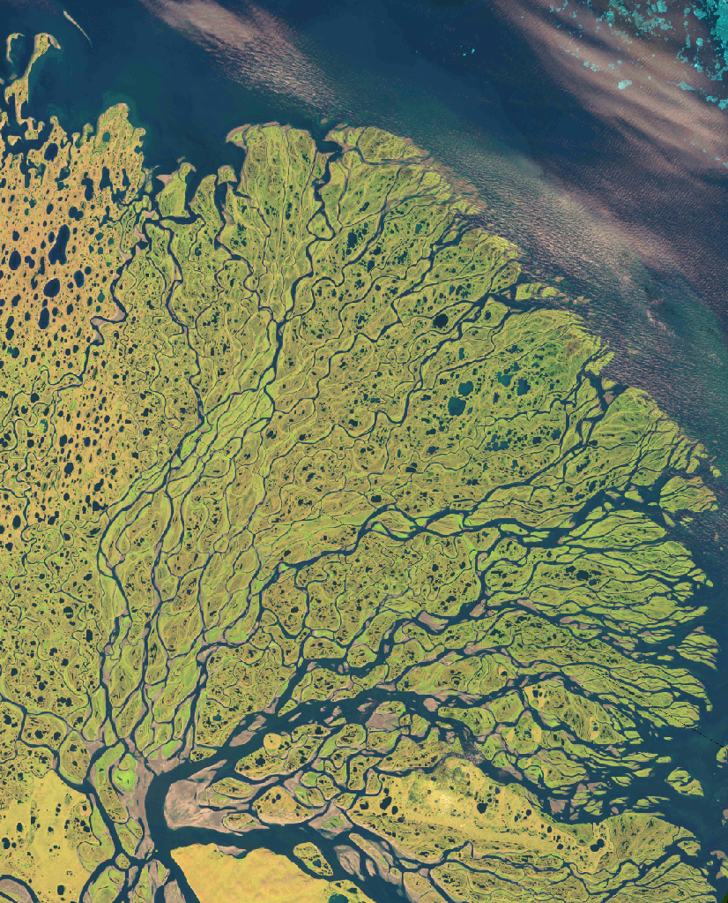
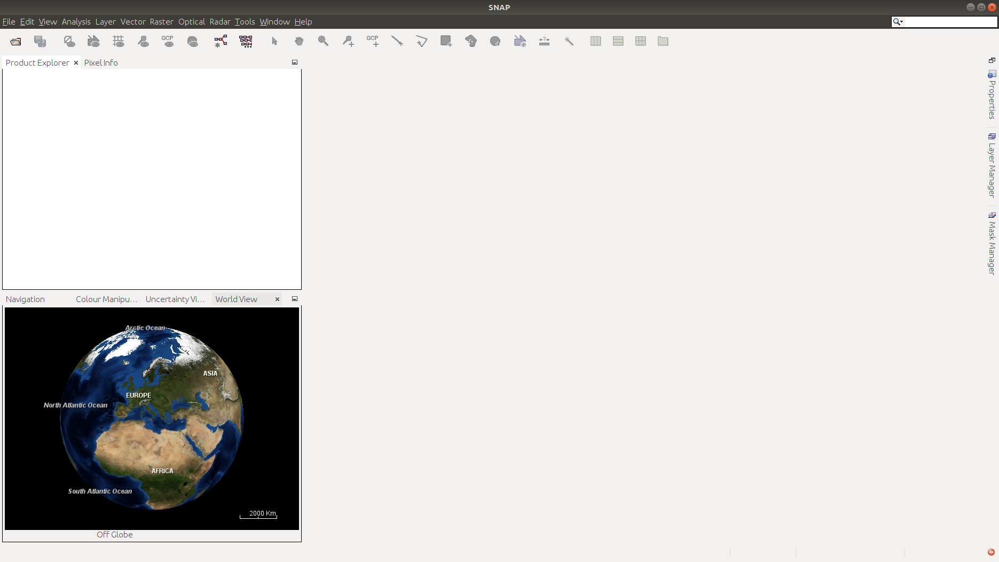
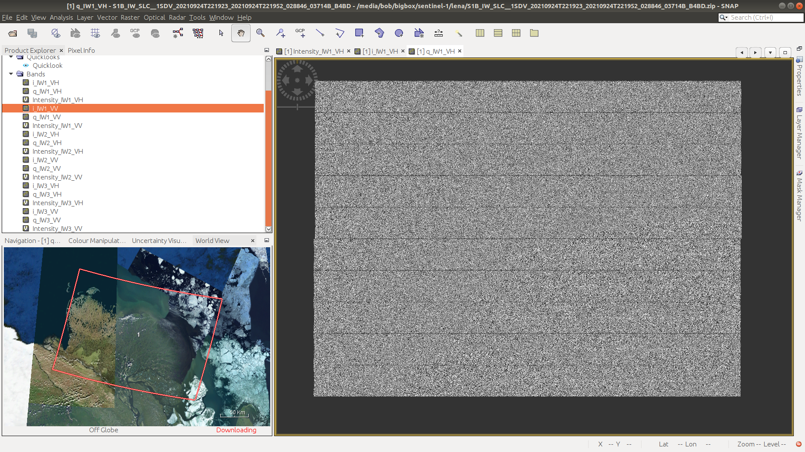
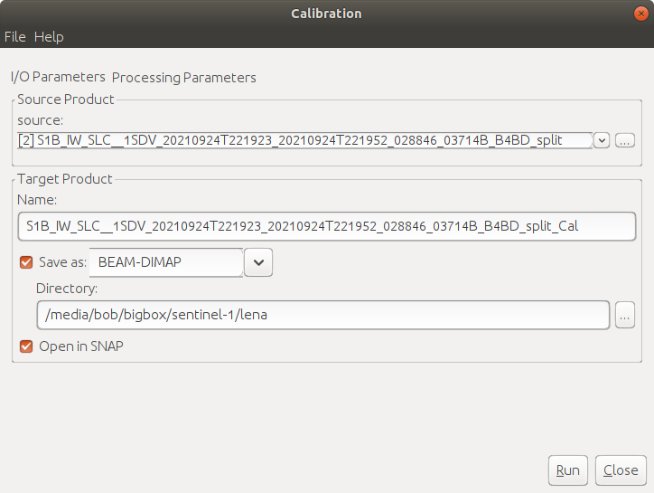
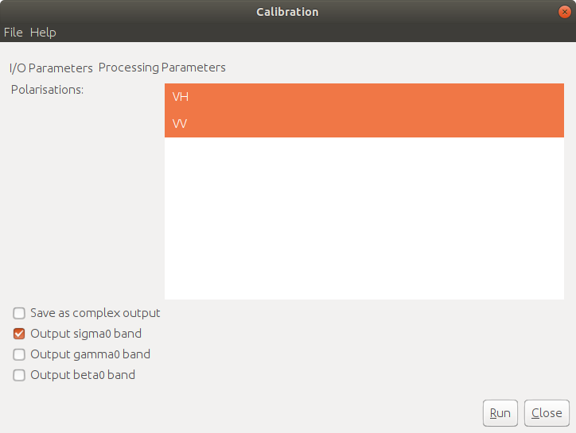
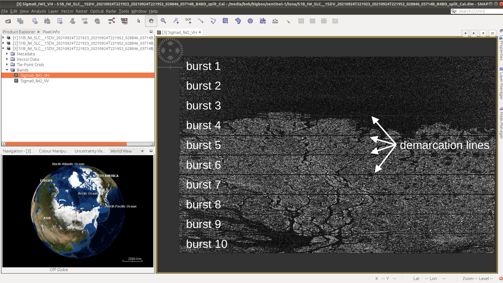
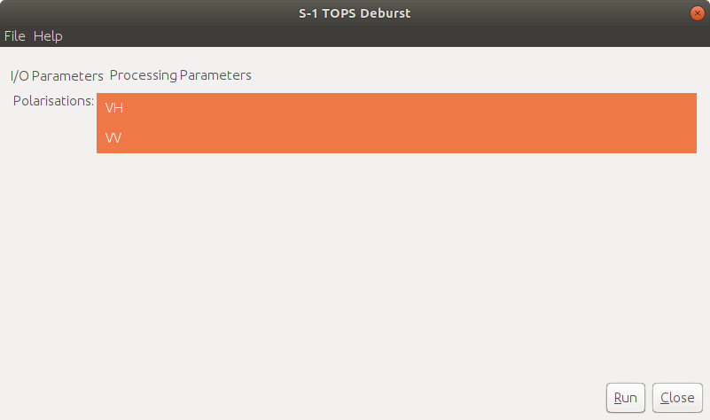
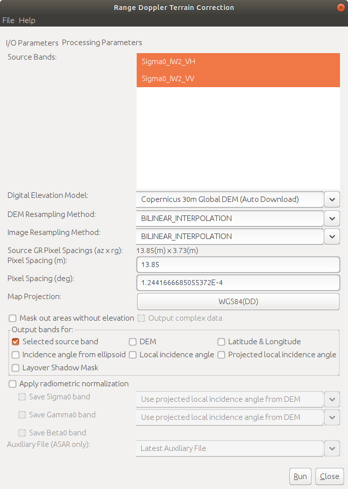
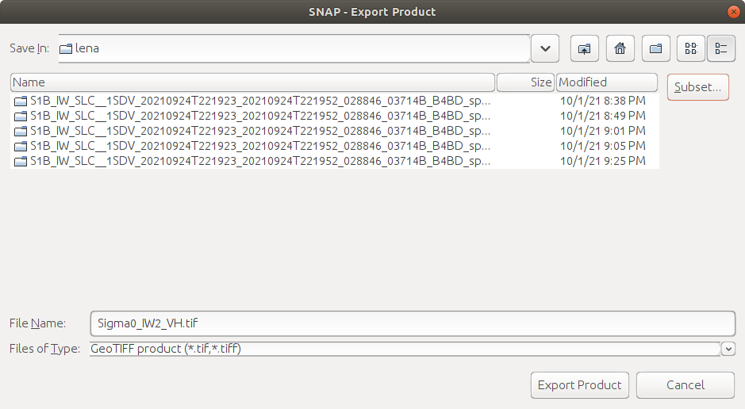

SAR image processing
=============================

For this week's practical, we'll learn the steps of processing a SAR image from a focused, Level-1 SLC (single-look
complex) image, through to a calibrated, terrain-corrected image. In particular, by the end of this practical, you will
be able to use SNAP to:

- Calibrate the image to more easily compare to images acquired with different incidence angles or brightness levels
- Apply speckle filtering to reduce the speckle in an image
- Apply geometric terrain correction to correct for SAR image distortion
- Convert the &sigma;0 values to decibels (dB) 

The image we'll be using is a Sentinel-1B interferometric wide swath (IW) scene, acquired 24 September 2021 showing the
Lena River Delta, Russia (seen here in 27 July 2000 Landsat-7 ETM+ image):

|br| Before opening SNAP, download the zipped image file from Blackboard, then unzip the image file. Because of the
image size, this might take some time. Alternatively, you can go to
`Copernicus Open Access Hub <https://scihub.copernicus.eu/>`__ to search for and download your own image.
The granule being used in this example is:

`S1B_IW_SLC__1SDV_20210924T221923_20210924T221952_028846_03714B_B4BD <https://scihub.copernicus.eu/dhus/odata/v1/Products('9729b3f9-b191-4f6f-a9bd-c2e159ca268c')/$value>`__ (Open Access Hub login required),

but you are welcome to download and use an image of your choosing. If you do so, make sure to choose an interferometric
wide swath (IW) scene, and download the single-look complex (SLC) format.

.. note::

    For this practical, we're not actually going to make use of the phase information. In the future, if you are
    interested in applications of SAR data that don't require phase information, you can instead download the GRD
    (ground range detected) product, which has been multi-looked and reprojected to ground range (instead of slant
    range).

    Because we'll need to work with SLC images for interferometry, I thought it would be best to use the SLC images
    here, which require some additional processing steps.

getting started
---------------

.. note::

    The following instructions were written using SNAP 8.0.7, which is what the example images show. If you have a
    different version of SNAP, there may be some slight differences.

.. warning::

    If you have downloaded the data from Blackboard, skip the `splitting the data`_ section below - the data uploaded
    to Blackboard have already been split, to cut down the file size (from 4.4GB to 1.6GB).

To get started, you should first open SNAP - the window should look something like this:

|br| To open the dataset, use the folder icon in the upper left-hand corner, or the drop-down menu
(**File** > **Open Product**).

.. note::

    **Open Access Hub**: Navigate to the **zipped** folder, select it, and click **OK**.

.. note::

    **Blackboard**: Navigate to the folder where you have extracted the data, then select
    ``S1B_IW_SLC__1SDV_20210924T221923_20210924T221952_028846_03714B_B4BD_split.dim``. Click **OK**.

You should see the image loaded in the panel on the upper left. On the bottom left, you might also see a glob with an
outline showing the location of the scene. If you don't, you can select the **World View** tab. Other tabs in this
panel include **Navigation** for navigating the image once we've loaded it; **Colour Manipulation** for changing how
the image is displayed in the main window, and **Uncertainty Visualisation**, for showing the uncertainty information
associated with a given band or image.

We can also open a **Quicklook** image by clicking the arrow next to our scene name, followed by the arrow next to the
**Quicklooks** folder, then double-clicking on **Quicklook**:

.. image:: ../../../img/egm703/week3/quicklook.png
    :width: 600
    :align: center
    :alt: the image quicklook view

|br| To visualize one of our bands, we can open the **Bands** folder, then selecting the band we want to see. The
`Interferometric Wide Swath <https://sentinels.copernicus.eu/web/sentinel/user-guides/sentinel-1-sar/acquisition-modes/interferometric-wide-swath>`__
mode captures three sub-swaths using a technique that helps reduce some of the issues related to previous designs.
The SLC data (single-look complex) data have 18 total bands to choose from: real, imaginary, and intensity images for
two different polarimetry modes (VV and VH) for each sub-swath (3 bands * 2 modes * 3 sub-swaths = 18). The GRD
(ground-range detected) images have had the different *bursts* and *sub-swaths* merged, so that there are only 4 bands
(amplitude and intensity for each of VV and VH images).

To start with, we'll look at the VH Intensity image for sub-swath 1 (**Intensity_IW1_VH**). To load the image,
double-click it. It will take a minute to load, but you should eventually see something like this:

.. image:: ../../../img/egm703/week3/intensity_iw1_vh.png
    :width: 600
    :align: center
    :alt: subswath 1 VH intensity

|br| There are a number of things that we can see here. First is that the image is not geocoded - the pixels
correspond to the range and azimuth direction of the sensor, rather than ground coordinates. The next thing we can see
is that there's quite a bit of speckle in the image - it appears noisy, or with a salt-and-pepper pattern.

.. image:: ../../../img/egm703/week3/speckle.png
    :width: 600
    :align: center
    :alt: zoomed-in intensity image highlighting speckle

|br| As we work our way through the workflow here, we'll take care of each of these different issues in turn. Have a
look at the ``i`` and ``q`` bands, as well. These are the real (*i*) and complex (*q*) components of the measured
signal. We will work with these a bit more next week - for now, you can go ahead and close them.

.. image:: ../../../img/egm703/week3/i_iw1_VH.png
    :width: 600
    :align: center
    :alt: subswath 1 VH i band

|br|

splitting the data
------------------

We'll start by splitting the data, to only work with a single sub-swath. Under **Radar**, select **Sentinel-1 TOPS**
> **S1 TOPS Split**:

.. image:: ../../../img/egm703/week3/tops_split1.png
    :width: 400
    :align: center
    :alt: the first TOPS Split window, showing I/O Parameters

|br| Under **I/O Parameters**, save the file to
``S1B_IW_SLC__1SDV_20210924T221923_20210924T221952_028846_03714B_B4BD_IW2_split`` (this is most likely already
filled in), then click **Processing Parameters**:

.. image:: ../../../img/egm703/week3/tops_split2.png
    :width: 400
    :align: center
    :alt: the second TOPS Split window, showing Processing Parameters

|br| Select ``IW2`` as the **Subswath**, and select both the **VH** and **VV** polarizations. Click **Run**.

You should see two products in the **Product Explorer** panel: the original image, and the split IW2 image. Open the
**Intensity_IW2_VH** band for the split image - it should look something like this:

.. image:: ../../../img/egm703/week3/split_intensity.png
    :width: 600
    :align: center
    :alt: subswath 2 VH intensity

|br|

calibrating the data
--------------------

Next, we'll calibrate the data, so that we can eventually compare the image to other scenes. Under **Radar**,
select **Radiometric** > **Calibrate**:

|br| Be sure that the split image is selected - if it is, you can leave the Target Name/Directory as-is. Under
**Processing Parameters**, make sure to select both polarisations, then click **Run**:

|br| You should see that there are now only two bands in the calibrated image - ``Sigma0_IW2_VH`` and ``Sigma0_IW2_VV``.
These are the calibrated, normalized radar cross-section values - in effect, the amount of energy reflected back to the
sensor by the ground. Without this step, comparing images acquired at different times or incidence angles becomes more
difficult - it's similar to comparing optical images that haven't been atmospherically corrected.

debursting the data
-------------------

Next, we need to combine the bursts, to get rid of the demarcation lines that we can see in the image:

|br| Under **Radar**, you can again select **Sentinel-1 TOPS** > **S-1 TOPS Deburst**. Be sure that the split image is
selected - if it is, you can leave the Target Name/Directory as-is. Under **Processing Parameters**, make sure to
select both polarisations, then click **Run**:

|br| When the process has finished running, you should be able to see that the shape has changed somewhat, because the
overlapping areas have been merged. The demarcation lines are also gone, and we have a single image:

.. image:: ../../../img/egm703/week3/deburst_image.png
    :width: 600
    :align: center
    :alt: the deburst image with VH polarization

|br|

speckle reduction
-----------------

Now that we've combined each of the bursts, we can move on to speckle filtering and geometric correction. Speckle
filtering is an optional step - we don't necessarily have to do it (and for some applications we don't want to do it),
but for visualizing and interpreting an image, it can help to reduce the noise.

|br| Under **Radar**, select **Speckle Filtering** > **Single Product Speckle Filter**. We'll use *Lee Sigma* in this
example, but there are a number of different algorithms available -
`this <https://earth.esa.int/documents/653194/656796/Speckle_Filtering.pdf>`__ document provides a good overview with
references for some of the different algorithms implemented. Under **Processing Parameters**, make sure to select both
source bands - for now, leave the other parameters as-is, but feel free to experiment with different combinations after
you've made it through the remaining steps.

.. image:: ../../../img/egm703/week3/speckle2.png
    :width: 400
    :align: center
    :alt: the second speckle filter dialogue window, showing Processing Parameters

|br| Once the tool finishes running, open the ``Sigma0_IW2_VH`` band:

.. image:: ../../../img/egm703/week3/filtered.png
    :width: 600
    :align: center
    :alt: the speckle filtered image

|br| Notice the difference in the apparent noise level, compared to the original image. At the zoomed-out level, we can
see quite a bit more detail in the filtered image. If we zoom in, we should see that this is true on smaller scales, as
well. Note that this process isn't perfect - there's still some texture in the image, for example.

geocoding
---------

Next, we need to geocode (terrain-correct) the image, in order to be able to use it in a GIS software or other
satellite images. Under **Radar**, select **Geometric** > **Terrain Correction** > **Range-Doppler Terrain Correction**.
Under **Processing Parameters**, be sure to select both source bands:

|br| We also need to be sure to select a DEM that will actually cover our study area. The default choice, the
`SRTM DEM <https://www.usgs.gov/centers/eros/science/usgs-eros-archive-digital-elevation-shuttle-radar-topography-mission-srtm-1-arc>`__,
only covers the area between 60ºN and 54ºS, while our study area is at ~72ºN. We'll use the
`Copernicus 30m Global DEM <https://spacedata.copernicus.eu/web/cscda/dataset-details?articleId=394198>`__,
which should provide good coverage globally.

.. note::

    If you don't see the Copernicus 30m Global DEM as an option, try closing and re-starting SNAP.

Make sure to also turn off the ``Mask out areas without elevation`` option, as we still want to be able to see parts of
the image that are at sea level, even though they're masked out in the DEM.

When the process has finished (this will probably take some time!), open the terrain-corrected VH :math:`\sigma^0` -
it should look quite a bit different than what we've been seeing:

.. image:: ../../../img/egm703/week3/geocoded.png
    :width: 600
    :align: center
    :alt: the geocoded image

|br|

convert to dB
-------------

Finally, we'll convert the values from linear to log (decibel) values - this will help to increase the contrast in
darker regions, helping interpretation. Right-click on the first image band, then select **Linear to/from dB**. This
will create a virtual image with the values scaled using the expression :math:`10\log_{10}({\rm \sigma_{\rm VH}})`:

.. image:: ../../../img/egm703/week3/geocoded_db.png
    :width: 600
    :align: center
    :alt: the geocoded image, converted to decibels

|br| Once you've done this for the ``Sigma_VV`` band, we'll need to convert the virtual bands to real bands by
right-clicking on the virtual band and selecting **Convert Band**. Now, we can export the image to a different file
format (for example, GeoTIFF). To do this, select **File** > **Export** > **GeoTIFF** (or another format of your choice).
This will bring up the export dialogue:

|br| Click on **Subset**, then **Band Subset**:

.. image:: ../../../img/egm703/week3/export2.png
    :width: 400
    :align: center
    :alt: the subset export dialogue

|br| Here, I'm choosing to export the dB images separately - first the VH band and then the VV band - in part because
of how large the images are (~2 GB per band!). If space is a concern, you can also select a spatial subset.

At this point, we're done with SNAP. There are a number of other tools/features in the software, including for
processing other SAR datasets such as ERS, ENVISAT, or ALOS-PALSAR. The software also supports processing and analysis
of other Sentinel datasets, including Sentinel-2 and Sentinel-3. Next week, we'll see how we can use the SNAP for
interferometric SAR (InSAR) applications.

questions
---------

Now that you've procssed and exported both images, you can load them into a GIS software of your choice. I would
recommend adding a basemap (for example, the ESRI Basemap) or an optical image (e.g., Sentinel-2, Landsat), to help
with some of the interpretation. Think about the following questions - if you need help or want to discuss, be sure to
post it on Blackboard:

1. What are the different dark areas scattered throughout the scene? can you explain what's going on here? What is it
   about these different surfaces that causes them to appear bright or dark?
2. Along the riverbanks, there are a number of significantly bright patches - can you think of a mechanism that we've
   discussed that would cause these areas to be brighter than other areas?
3. What differences do you notice between the VH and VV polarization? Can you explain why, for example, you might
   expect more scattering in VV polarization than in VH polarization for water?

