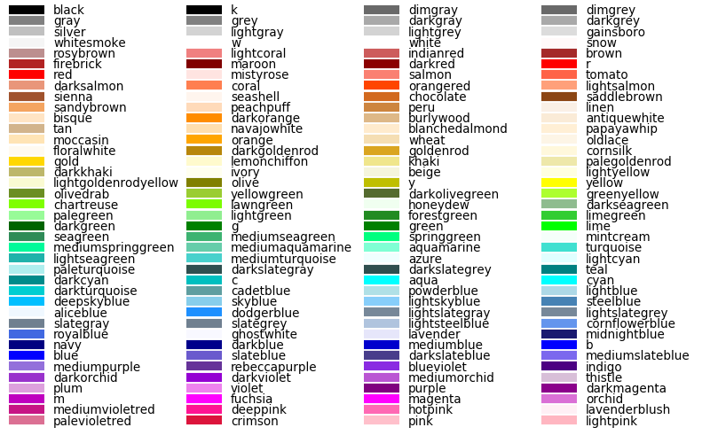

mapping with cartopy
==================================

In this practical, we'll create a map using similar data to what you used in the first practical of EGM711. This time,
rather than using ArcGIS Pro, we'll use ``cartopy``, ``matplotlib``, and ``geopandas``, python packages used for making
maps, plotting data, and working with vector data, respectively.

The practical this week is provided as a Jupyter Notebook, where you can interactively work through the different steps
of plotting the data. There is a second file, **practical2_script.py**, which will create the same map over again. Once
you have worked through the Jupyter Notebook, you can modify the script to complete the second part of the exercise,
and experiment with the different parameters used to make the map.

getting started
---------------

To get started with this week's practical, first head to the your GitHub repository (:samp:`https://github.com/<{your_username}>/egm722`).
You should notice that this repository has 7 branches – you can click on the **branch** button to see all of the branches
available for a particular repository:

.. image:: ../../../img/egm722/week2/github.png
    :width: 720
    :align: center
    :alt: the github repository

|br| You should be able to see that the available branches are ``main``, the default **branch** that we used in last
week's practical, branches for weeks 2 through 5, and a ``recipe`` and ``conflict-recipe`` branch (more on these later).

In **Windows Explorer** (or **Finder**), open up the folder where you've **cloned** your repository. You should
currently see just the **Week1** folder - no **Week2**, **Week3**, and so on:

.. image:: ../../../img/egm722/week2/week1_folder.png
    :width: 600
    :align: center
    :alt: the repository folder showing only Week 1 materials

|br| We want to be able to work with each of the weeks at the same time, without having to switch branches each time.
To do this, we'll need to add each week's folder to the main branch.

Each week, we'll see how we can **merge**, or integrate, that week's branch into the ``main`` branch. This week, we'll
use **GitHub Desktop** to do this. In the coming weeks, we'll also introduce other options such as the command-line
interface or
`Pull Requests <https://docs.github.com/en/pull-requests/collaborating-with-pull-requests/proposing-changes-to-your-work-with-pull-requests/about-pull-requests>`_.

synching forks
--------------

Before we merge the ``week2`` branch, however, let's first check that there aren't any recent changes to the original
repository that we need to include in our fork.

Back on GitHub, switch to the ``week2`` branch by clicking the drop-down menu that currently says ``main``:

.. image:: ../../../img/egm722/week2/branch_menu.png
    :width: 720
    :align: center
    :alt: the github repository, with the branch menu highlighted in red

|br| and selecting the ``week2`` branch. You should see the page now looks like this:

|br| If you see the message "This branch is **X** commits behind ``iamdonovan/egm722:week2``.", you will need to sync
the fork so that you incorporate the recent changes to the original repository (``iamdonovan/egm722``).

.. tip::

    If you see the message "This branch is up to date with ``iamdonovan/egm722``.", you should still read through the
    instructions below, just in case you encounter this in the future.

To sync the fork, first click on **Sync fork**:

|br| Then click on **Update branch**.

After a moment, you should see that the message changes:

|br| In the coming weeks, we will see other ways that we can check whether there are changes from the upstream
repository that need to be synced. For now, we can continue on to merging these changes into our ``main`` branch.

merging branches
----------------

For now, open up **GitHub Desktop**. You should see something like this:

.. image:: ../../../img/egm722/week2/desktop1.png
    :width: 600
    :align: center
    :alt: the github desktop window

|br| Before moving on, let's first make sure to **fetch** any changes from our remote repository. To do this, click on
the **Fetch origin** button:

.. image:: ../../../img/egm722/week2/fetch_origin.png
    :width: 600
    :align: center
    :alt: the github desktop window, with the fetch origin button highlighted

|br| After a few moments, you should see that the wheel icon stops spinning, indicating that your remote changes have
been fetched.

Now, click the button that shows the current branch (**main**) – you should see the following:

.. _desktop branches:

.. image:: ../../../img/egm722/week2/desktop_branches.png
    :width: 600
    :align: center
    :alt: the github desktop window

|br| In addition to your **local** ``main`` branch, you should also see **upstream** versions of each of the branches
(``main``, ``week2``--``week5``), as well as **origin** versions.

These are different things, and it's important to keep track of the differences:

- The **local** branches are the versions that are stored on *your* computer, *local*\ ly. 
- The **origin** branches are the versions stored on *your* GitHub repository
- The **upstream** branches are the versions that are stored in the repository that you forked from (https://github.com/iamdonovan/egm722)

Right now, you should only have the ``main`` branch on your machine. To work with (**checkout**) the ``week2`` branch,
we need to download it. Select the **origin** ``week2`` (``origin/week2``) branch, and **GitHub Desktop** will download
the files on the ``week2`` branch to your computer, and switch (**checkout**) the ``week2`` branch.

You should see that the "Current branch" has changed:

|br| And, you can see that the contents of your repository folder have changed:

.. image:: ../../../img/egm722/week2/week2_folder.png
    :width: 600
    :align: center
    :alt: the repository folder showing only Week 2 materials

|br| Remember - **the files are not gone**. When you switch from one branch to another, **git** changes the files in
the folder to reflect the state of the branch you're working on. Because there is no **Week1** folder on the ``week2``
branch, it's been temporarily removed. You can verify this by switching branches in **GitHub Desktop** and seeing how
the folder contents change.

.. warning::

    **Make sure that you're on the** ``main`` **branch before continuing**.

    As good practice, you should also click the "**Fetch origin**" button before continuing. 

    There shouldn't be many changes on the remote repository that aren't on your local computer, so this won't make
    much of a difference right now. If you're working collaboratively with others, though, it's good to make sure that
    you're not missing important changes before merging different branches.

To **merge** the two branches, click on the **Branch** menu, then select **Merge into current branch...**. In the menu
that opens, select the **local** ``week2`` branch:

.. image:: ../../../img/egm722/week2/merge_week2.png
    :width: 600
    :align: center
    :alt: merging the week2 branch into main using github desktop

|br| You should see that a green checkmark appears, indicating that there aren't any **conflicts** (files that have
been changed on both branches). The message:

    This will merge **2 commits** from **week2** into **main**

Tells us the number of commits that will be merged into ``main``. Note that you may see a different number of commits
here - as long as you have no conflicts, this isn't a problem.

Select **Create a merge commit** - this will create a new commit that merges the two branches together. For now, don't
worry about the other options for merging branches together.

Once you've created the merge commit, you should see that **Fetch origin** has changed to **Push origin** - this will
**push** (upload) the changes you've made locally to your **GitHub** repository:

.. image:: ../../../img/egm722/week2/desktop_push.png
    :width: 600
    :align: center
    :alt: pushing changes from the github desktop window

|br| Once the changes have been pushed, go back to your **GitHub** repository (:samp:`https://github.com/<{your_username}>/egm722`).
You should now see that your ``main`` branch has both the **Week1** and **Week2** folders:

.. image:: ../../../img/egm722/week2/github_merged.png
    :width: 720
    :align: center
    :alt: the github repository showing the merged files

|br| You can also confirm the changes in your **local** folder:

|br| As a final step, you can "prune" this branch by deleting it. From the **branch** menu, right-click on ``week2``
and select **Delete**. You should see a message like the following:

.. image:: ../../../img/egm722/week2/delete_branch.png
    :width: 400
    :align: center
    :alt: a message asking you to confirm deleting the selected branch

|br| Check the box next to **Yes, delete this branch on the remote**, then click **Delete** to remove the branch. You
should see that the branch is no longer present in the **branch** menu.

You can also confirm that the branch has been removed from your remote repository by visiting
``https://github.com/{username}/egm722/branches/all``.

At this point, you should be ready to open jupyter and work your way through the Week 2 Notebook, following the
same initial steps as last week.

running the script
-------------------

To edit the script (**practical2_script.py**), open it in your IDE. If your IDE has a built-in terminal/python
interpreter, you can also run the script directly from the IDE:

.. image:: ../../../img/egm722/week2/pycharm.png
    :width: 720
    :align: center
    :alt: the script open in the pycharm IDE

|br|

.. note::

    The setup for this using pycharm will be the same as you did for the :doc:`debugging <debugging>` exercise in
    week 1.

Otherwise, you can use the **command prompt**; the procedure will be effectively the same.

Launch the command prompt from **Anaconda Navigator**, taking care to ensure that your ``egm722`` environment is
selected (rather than the ``base`` environment). When it launches, you should see the following window:

.. image:: ../../../img/egm722/week2/prompt3.png
    :width: 600
    :align: center
    :alt: the conda prompt

|br|

.. note::

    If, instead of ``(egm722)``, you see ``(base)`` next to the command prompt, you will need to *activate* the correct
    environment by typing:

    .. code-block:: sh
    
        conda activate egm722 

    and pressing **ENTER**.

Navigate to the week 2 folder using the ``cd`` command. You should see the jupyter-notebook file, as well as the script:

.. image:: ../../../img/egm722/week2/week2_dir.png
    :width: 600
    :align: center
    :alt: the contents of the week 2 directory in the command prompt

|br| Remember that we can use python in two ways, either interactive or script mode. We also have a choice of two
different interpreters - either ``python`` (the standard python interpreter) or ``ipython`` (an enhanced interactive
interpreter).

I recommend using IPython instead of the standard interpreter when using interactive mode – the interpreter highlights
syntax, it keeps track of your sessions and enables you to easily look back over your command history, enables you to
use some shell commands from within the interpreter, and also enables tab completion for commands, variable names,
and filenames.

You can run any script from start to finish using either interpreter by typing ``python script.py`` (or
``ipython script.py``, although the benefits of using IPython come from running python in interactive mode rather than
script mode).

.. image:: ../../../img/egm722/week2/script_run.png
    :width: 600
    :align: center
    :alt: the result of running the script from the command prompt

|br| If you want to be able to troubleshoot the script, or run additional commands after the script has finished running,
you can also start the interpreter in interactive mode by typing ``ipython -i script.py``:

.. image:: ../../../img/egm722/week2/ipython_script.png
    :width: 600
    :align: center
    :alt: the result of running the script from the command prompt using ipython -i

|br| To show the plot, use ``plt.show()``:

.. image:: ../../../img/egm722/week2/plot.png
    :width: 600
    :align: center
    :alt: the plot window open from ipython

|br| You can also turn on interactive plotting using ``plt.ion()``, which will update the plot each time you run a
plotting command – similar to how it worked in the Jupyter Notebook.

Once you have finished the exercise, you can try adding other features to your map, work on re-creating some of the maps
that you created in EGM711, or try some of the examples shown on the
`cartopy website <https://scitools.org.uk/cartopy/docs/v0.13/matplotlib/intro.html>`_.
Can you work out how to include a basemap to your image, based on some of the examples provided?

.. note::
    
    Below this point is the **non-interactive** text of the notebook. To actually run the notebook, you'll need to
    follow the instructions above to open the notebook and run it on your own computer!

....

Ryan Gosling
------------------

In the first practical for EGM711, you learned how to use ArcGIS Pro to
make maps, given shapefiles of different features of interest in
Northern Ireland. In this practical, you will repeat the exercise, this
time using ``cartopy``, ``geopandas``, and ``matplotlib``, three python
packages used for making maps, working with vector data, and making
plots, respectively.

objectives
^^^^^^^^^^^

- become familiar with ``geopandas``, ``cartopy``, and ``matplotlib``, including
  reading the provided documentation
- use *list comprehension* to simplify some ``for`` loops

getting started
^^^^^^^^^^^^^^^^

First, run the cell below to load the python modules we’ll be using in
the practical:

.. code:: ipython3

    # this lets us use the figures interactively
    %matplotlib widget

    import os
    import geopandas as gpd
    import matplotlib.pyplot as plt
    from cartopy.feature import ShapelyFeature
    import cartopy.crs as ccrs
    import matplotlib.patches as mpatches
    import matplotlib.lines as mlines

    plt.ion() # make the plotting interactive

Let’s also define a few helper functions that we’ll use later on. For
now, don’t worry too much about what each individual line of code does -
we’ll go over these in a bit more depth as we go.

.. code:: ipython3

    def generate_handles(labels, colors, edge='k', alpha=1):
        """
        Generate matplotlib patch handles to create a legend of each of the features in the map.

        Parameters
        ----------

        labels : list(str)
            the text labels of the features to add to the legend

        colors : list(matplotlib color)
            the colors used for each of the features included in the map.

        edge : matplotlib color (default: 'k')
            the color to use for the edge of the legend patches.

        alpha : float (default: 1.0)
            the alpha value to use for the legend patches.

        Returns
        -------

        handles : list(matplotlib.patches.Rectangle)
            the list of legend patches to pass to ax.legend()
        """
        lc = len(colors)  # get the length of the color list
        handles = [] # create an empty list
        for ii in range(len(labels)): # for each label and color pair that we're given, make an empty box to pass to our legend
            handles.append(mpatches.Rectangle((0, 0), 1, 1, facecolor=colors[ii % lc], edgecolor=edge, alpha=alpha))
        return handles

    # adapted this question: https://stackoverflow.com/q/32333870
    # answered by SO user Siyh: https://stackoverflow.com/a/35705477
    def scale_bar(ax, length=20, location=(0.92, 0.95)):
        """
        Create a scale bar in a cartopy GeoAxes.

        Parameters
        ----------

        ax : cartopy.mpl.geoaxes.GeoAxes
            the cartopy GeoAxes to add the scalebar to.

        length : int, float (default 20)
            the length of the scalebar, in km

        location : tuple(float, float) (default (0.92, 0.95))
            the location of the center right corner of the scalebar, in fractions of the axis.

        Returns
        -------
        ax : cartopy.mpl.geoaxes.GeoAxes
            the cartopy GeoAxes object

        """
        x0, x1, y0, y1 = ax.get_extent() # get the current extent of the axis
        sbx = x0 + (x1 - x0) * location[0] # get the right x coordinate of the scale bar
        sby = y0 + (y1 - y0) * location[1] # get the right y coordinate of the scale bar

        ax.plot([sbx, sbx-length*1000], [sby, sby], color='k', linewidth=4, transform=ax.projection) # plot a thick black line
        ax.plot([sbx-(length/2)*1000, sbx-length*1000], [sby, sby], color='w', linewidth=2, transform=ax.projection) # plot a white line from 0 to halfway

        ax.text(sbx, sby-(length/4)*1000, f"{length} km", ha='center', transform=ax.projection, fontsize=6) # add a label at the right side
        ax.text(sbx-(length/2)*1000, sby-(length/4)*1000, f"{int(length/2)} km", ha='center', transform=ax.projection, fontsize=6) # add a label in the center
        ax.text(sbx-length*1000, sby-(length/4)*1000, '0 km', ha='center', transform=ax.projection, fontsize=6) # add a label at the left side

        return ax

Have a look at the *docstring* attached to each function, which explains
what the function does, and how to use it. Remember that this is the
same information that you would see if you used ``help()`` on a function
- try it below:

.. code:: ipython3

    help(generate_handles) # show the docstring for the generate_handles function

Remember that as you work your way through this (and other) practical
exercises, there are a number of ways that you can use to find help if
you get stuck:

1. the built-in help (i.e., ``help(plt.text)``)
2. using ipython’s (the python interpreter used by jupyter-notebooks)
   help shortcut (i.e., ``plt.text?``)
3. finding the online documentation for the module (usually achieved via
   option 4)
4. searching google (or your search engine of choice)
5. consulting your favorite medicine man/shaman/spiritual guide
6. asking the instructor, who will in all likelihood resort to one of
   the other options (usually 5 or 4).

loading the data
^^^^^^^^^^^^^^^^^

Now that we’ve imported most of the modules we’ll be needing, and
defined a few helper functions, we can actually load our data. To load
the shapefile data, we will use `GeoPandas <http://geopandas.org/>`__,
an open-source package designed to make working with geospatial data in
python easier.

GeoPandas is built off of Pandas, a powerful data analysis tool. We will
be working with both of these packages more in the weeks to come.

To open a shapefile, we use the ``gpd.read_file()``
(`documentation <https://geopandas.org/en/stable/docs/reference/api/geopandas.read_file.html>`__)
method:

.. code:: ipython3

    outline = gpd.read_file(os.path.abspath('data_files/NI_outline.shp'))
    towns = gpd.read_file(os.path.abspath('data_files/Towns.shp'))
    water = gpd.read_file(os.path.abspath('data_files/Water.shp'))
    rivers = gpd.read_file(os.path.abspath('data_files/Rivers.shp'))
    counties = gpd.read_file(os.path.abspath('data_files/Counties.shp'))

GeoPandas loads the data associated with a shapefile into a
GeoDataFrame, a tabular data structure that always has a column
describing a feature’s geometry. As we saw in last week’s exercise, each
line in the table corresponds to a feature in the shapefile, just like
the attribute table you are familiar with from ArcGIS/QGIS.

To see a subset of a GeoDataFrame, we can use the ``head()``
(`documentation <https://pandas.pydata.org/docs/reference/api/pandas.DataFrame.head.html>`__)
method:

.. code:: ipython3

    water.head(10)

To select rows in the dataframe using an index, we can use ``.loc``
(`documentation <https://pandas.pydata.org/docs/reference/api/pandas.DataFrame.loc.html>`__):

.. code:: ipython3

    water.loc[0] # should show the row for Lough Neagh

Note that ``.loc`` is not a method, since we use square brackets:``[``
and ``]``, instead of round brackets/parentheses. Instead, it’s an
attribute that provides a way to index or slice a GeoDataFrame.

We can also use ``.loc`` with **conditional statements**. For example,
if we wanted to select all bodies of water that are smaller than 1
square kilometer, we could use something like this:

.. code:: ipython3

    water.loc[water['Area_km2'] < 1]

Note that with only a single value, ``.loc`` returns all columns of the
GeoDataFrame where the rows match the given index/conditional statement.

To select a specific column or group of columns, we can use a comma to
separate the different indexers. For example, if we want to select only
the name of the lakes that are smaller than 1 square kilometer, we can
use the following:

.. code:: ipython3

    water.loc[water['Area_km2'] < 1, 'namespace']

Each “column” of the GeoDataFrame is an object of type **Series**
(`documentation <https://pandas.pydata.org/docs/reference/api/pandas.Series.html>`__).

If a **Series** is filled with numeric data, we can use different
methods such as ``.sum()``
(`documentation <https://pandas.pydata.org/docs/reference/api/pandas.Series.sum.html>`__)
or ``.mean()``
(`documentation <https://pandas.pydata.org/docs/reference/api/pandas.Series.mean.html>`__),
to get the sum and mean of the values in the **Series**, respectively.
So, the total area (in square kilometers) of all of the lakes in the
dataset would be given by the following statement:

.. code:: ipython3

    water['Area_km2'].sum()

We’ll work with GeoDataFrames more in next week’s practical, but for now
see if you can put these different pieces together and figure out the
total area of lakes in the ``Water`` dataset that are smaller than 10
square kilometers. I’ll provide a few reminder hints to get you started:

1. **GeoDataFrame**\ s can be subset using both a conditional and a
   column in the **GeoDataFrame**, like we saw above.
2. With only a single value, ``.loc`` returns all columns of the
   GeoDataFrame where the rows match the given index/slice/conditional
   statement. To select a specific column or group of columns, we can
   use a comma to separate the different indexers.
3. The numerical columns of a GeoDataFrame (also called Series or
   GeoSeries) have built-in operators such as **max**, **min**,
   **mean**, and so on.

That should be enough to get you started - if you get stuck, be sure to
ask for help.

.. code:: ipython3

    # write a statement (or series of statments) to calculate the total area of lakes < 10 km2 in the water dataset.

working with coordinate reference systems
^^^^^^^^^^^^^^^^^^^^^^^^^^^^^^^^^^^^^^^^^^

Now that we’re more familiar with the dataset, we can start building our
map. For this portion of the practical, we’ll be mostly using
`matplotlib <https://matplotlib.org/>`__, a python package designed for
making plots and graphs, and
`cartopy <https://scitools.org.uk/cartopy/docs/latest/>`__, a package
designed for making maps and representing geopatial data.

First, let’s look at the coordinate reference system (CRS) for
``outline``, the outline of Northern Ireland:

.. code:: ipython3

    outline.crs # show the CRS of the outline dataset

Here, we can see that the outline is in UTM coordinates (WGS84 UTM Zone
29N, to be exact). Now, let’s look at the CRS for ``water``,
corresponding to the lake outlines:

.. code:: ipython3

    water.crs # show the CRS of the water dataset

Here, we can see the CRS is different - the coordinates of ``water`` are
in Irish Transverse Mercator, which are similar to, but not quite the
same as, WGS84 UTM Zone 29N easting/northing coordinates.

To correctly plot our geospatial data, then, we need to have some way
for ``cartopy`` and ``matplotlib`` to “translate” and plot the
coordinates stored within the shapefile data - this way, even if our
data are represented in different coordinates (e.g., WGS84 UTM Zone 29N
or Irish Transverse Mecractor), they will show up in the correct places
on the map.

To do this, we need to create a ``cartopy`` **CRS**, a representation of
the spatial reference system that we will use to plot our data inside of
our map. Here, we’re using ``ccrs.UTM()``
(`documentation <https://scitools.org.uk/cartopy/docs/latest/reference/projections.html#utm>`__)
to create a CRS corresponding to the Universal Transverse Mercator (UTM)
Zone that Northern Ireland is part of. In order for this line to work,
you will need to replace ``XX`` with the correct number for the UTM Zone
that Northern Ireland is part of - if you’re not sure, `this
website <https://mangomap.com/robertyoung/maps/69585/what-utm-zone-am-i-in-#>`__
provides an interactive way for you to find the “best” UTM Zone for any
given location.

.. code:: ipython3

    ni_utm = ccrs.UTM(XX)  # create a Universal Transverse Mercator reference system to transform our data.
    # be sure to fill in XX above with the correct number for the UTM Zone that Northern Ireland is part of.

We can also use ``ccrs.CRS()``
(`documentation <https://scitools.org.uk/cartopy/docs/latest/reference/generated/cartopy.crs.CRS.html>`__),
along with the ``.crs`` attribute of a **GeoDataFrame**, in order to
create a ``cartopy`` **CRS** that can be used with other ``cartopy``
functions and objects:

.. code:: ipython3

    ccrs.CRS(outline.crs) # create a cartopy CRS representation of the CRS associated with the outline dataset

We’ll use this, along with the ``.crs`` attributes of our datasets, in
order to plot everything in the correct location as we add items to our
map.

To create the map, we start by using ``plt.figure()``
(`documentation <https://matplotlib.org/stable/api/_as_gen/matplotlib.pyplot.figure.html>`__),
along with the ``figsize`` argument, to create a new **Figure** object.
The **Figure** is the container that we use to create different plots,
such as our map.

While the **Figure** is the container that we use to create different
plots, these plots are actually displayed by an object called an
**Axes** - the “artist” that will actually draw the plot. Here, we’re
using ``plt.axes()``
(`documentation <https://matplotlib.org/stable/api/_as_gen/matplotlib.pyplot.axes.html>`__)
to create an empty **Axes** on the current **Figure**.

We use the ``projection`` keyword argument along with our **CRS** object
to set the **Axes**\ ’ projection to be our UTM Zone - this way, we can
be sure that the data that we pass to the **Axes** in order to plot are
shown in the correct location:

.. code:: ipython3

    fig = plt.figure(figsize=(8, 8))  # create a figure of size 8x8 (representing the page size in inches)
    ax = plt.axes(projection=ni_utm)  # create an axes object in the figure, using a UTM projection,
    # where we can actually plot our data.

As you can see, the **Axes** starts off blank - we haven’t added
anything to it yet.

Because we are using the **widget** option for ``matplotlib`` (cf. the
first cell you ran up above):

.. code:: python

       %matplotlib widget

you can see how the original **Figure** object updates as we continue
through the rest of the steps of the practical by scrolling back up to
this point after adding new objects/features to the map.

However, I have also added ``fig`` statements in most of the cells where
we add something to the map, so that you can see the updates as they are
made without having to scroll all the way back up the page.

adding data to the map
^^^^^^^^^^^^^^^^^^^^^^^

Now that we’ve created a figure and axes, we can start adding data to
the map. To start, we’ll add the municipal borders.

In order to add these to the map, we first have to create features that
we can add to the axes using the ``ShapelyFeature`` class
(`documenation <https://scitools.org.uk/cartopy/docs/latest/reference/generated/cartopy.feature.ShapelyFeature.html#cartopy.feature.ShapelyFeature>`__)
from ``cartopy.feature``
(`documentation <https://scitools.org.uk/cartopy/docs/latest/reference/feature.html>`__).

The initialization method for this class takes a minimum of two
arguments: an **iterable** containing the geometries that we’re using,
and a CRS representation corresponding to the coordinate reference
system of those geometries.

To add the County borders, then, we can use ``counties['geometry']``,
the **GeoSeries** of the feature geometries in our outline shapefile,
and ``outline.crs``, the CRS attribute of that shapefile:

.. code:: ipython3

    # first, we just add the outline of Northern Ireland using cartopy's ShapelyFeature
    outline_feature = ShapelyFeature(outline['geometry'], ni_utm, edgecolor='k', facecolor='w')
    ax.add_feature(outline_feature) # add the features we've created to the map.

The other arguments that we pass to ``ShapelyFeature`` tell
``matplotlib`` how to draw the features - in this case, with an edge
color (``edgecolor``) of black (``'k'``) and a face color
(``facecolor``) of white (``'w'``). Once we’ve created the features, we
add them to the axes using the ``add_feature`` method.

As you can see from the output above, we have added the outline to the
map, but it’s very zoomed out (by default, it displays the *entire* UTM
Zone, stretching from the Equator to the North Pole). We can zoom the
map into our area of interest by using the boundary of the shapefile
features along with ``.set_extent()``
(`documentation <https://scitools.org.uk/cartopy/docs/latest/reference/generated/cartopy.mpl.geoaxes.GeoAxes.html#cartopy.mpl.geoaxes.GeoAxes.set_extent>`__).

First, we get the boundary of the shapefile features using
``.total_bounds``
(`documentation <https://geopandas.org/en/stable/docs/reference/api/geopandas.GeoSeries.total_bounds.html>`__),
then use these values when we call ``.set_extent()``. In the example
below, we’re setting the extent with a 5 km buffer around each edge:

.. code:: ipython3

    xmin, ymin, xmax, ymax = outline.total_bounds # using the boundary of the shapefile features, zoom the map to our area of interest
    ax.set_extent([xmin-5000, xmax+5000, ymin-5000, ymax+5000], crs=ni_utm) # because total_bounds gives output as xmin, ymin, xmax, ymax,
    # but set_extent takes xmin, xmax, ymin, ymax, we re-order the coordinates here.

    fig ## re-draw the figure so you don't have to scroll back up

This is a fine start to our map, but a bit boring. For one thing, we
might want to set different colors for the different county outlines,
rather than having them all be the same color. To do this, we’ll first
have to count the number of **unique** counties in our dataset, then
select colors to represent each of them.

Question: Why might we do this, rather than just use the number of
features in the dataset?

Run the cell below to count the number of unique municipalities in the
dataset, using the ``unique`` method on the **CountyName** GeoSeries.

Note that in addition to the standard indexing (i.e.,
``counties['CountyName']``), we are accessing **CountyName** directly as
an attribute of ``counties`` (i.e., ``counties.CountyName``). Provided
that the column name follows particular rules (`more on this
here <http://pandas.pydata.org/pandas-docs/stable/indexing.html#attribute-access>`__),
there is no difference between these two methods - they give the same
results.

.. code:: ipython3

    # get the number of unique municipalities we have in the dataset
    num_counties = len(counties.CountyName.unique())
    print(f'Number of unique features: {num_counties}') # note how we're using an f-string with {} here!

Now that you’ve found the number of colors you need to choose, you can
use the image below to make a list of the colors. There are other ways
to select colors using matplotlib, including using RGB values or Hex
codes, but that’s for another day. If you’re interested in learning
more, you can check out the documentation
`here <https://matplotlib.org/stable/api/colors_api.html>`__.

`source <https://matplotlib.org/stable/gallery/color/named_colors.html>`__

You can also go to to `ColorBrewer <https://colorbrewer2.org>`__, which
will help you make sure that your color palette is colorblind-friendly,
print-friendly, and photocopy-friendly. Other helpful websites for
checking color accessibility or generating color palettes include
`Coblis <https://www.color-blindness.com/coblis-color-blindness-simulator/>`__,
`Learn UI
Design <https://www.learnui.design/tools/data-color-picker.html>`__, or
`Coloring for
Colorblindness <https://davidmathlogic.com/colorblind/>`__.

.. code:: ipython3

    # pick colors for the individual county boundaries - make sure to add enough for each of the counties
    # to add a color, enclose the name above (e.g., violet) with single (or double) quotes: 'violet'
    # remember that each colors should be separated by a comma
    county_colors = []

    # get a list of unique names for the county boundaries
    county_names = list(counties.CountyName.unique())
    county_names.sort() # sort the counties alphabetically by name

    # next, add the municipal outlines to the map using the colors that we've picked.
    # here, we're iterating over the unique values in the 'CountyName' field.
    # we're also setting the edge color to be black, with a line width of 0.5 pt.
    # Feel free to experiment with different colors and line widths.
    for ii, name in enumerate(county_names):
        feat = ShapelyFeature(counties.loc[counties['CountyName'] == name, 'geometry'], # first argument is the geometry
                              ccrs.CRS(counties.crs), # second argument is the CRS
                              edgecolor='k', # outline the feature in black
                              facecolor=county_colors[ii], # set the face color to the corresponding color from the list
                              linewidth=1, # set the outline width to be 1 pt
                              alpha=0.25) # set the alpha (transparency) to be 0.25 (out of 1)
        ax.add_feature(feat) # once we have created the feature, we have to add it to the map using ax.add_feature()

    fig # to show the updated figure

In the code above, note this line:

.. code:: python

   ccrs.CRS(counties.crs) # second argument is the CRS

As we saw above, this creates a new cartopy **CRS** object using the
``.crs`` attribute of the **GeoDataFrame**. If we’re not sure that all
of our datasets use the same CRS, or we haven’t re-projected them all to
a single CRS, we can use this to make sure that cartopy uses the correct
CRS when displaying each dataset on the map.

Now that we’ve done this for the county boundaries, we can also do this
for the water datasets. Because we want each of the water bodies to use
the same symbology, we add them with a single use of **ShapelyFeature**:

.. code:: ipython3

    # here, we're setting the edge color to be the same as the face color. Feel free to change this around,
    # and experiment with different line widths.
    water_feat = ShapelyFeature(water['geometry'], # first argument is the geometry
                                ccrs.CRS(water.crs), # second argument is the CRS
                                edgecolor='mediumblue', # set the edgecolor to be mediumblue
                                facecolor='mediumblue', # set the facecolor to be mediumblue
                                linewidth=1) # set the outline width to be 1 pt
    ax.add_feature(water_feat) # add the collection of features to the map

    fig # to show the updated figure

To add the rivers dataset to the map, we can again use
``ShapelyFeature()``, with ``ccrs.CRS(rivers.crs)`` as the CRS argument.
Note that because these are **LineString** objects, not **Polygon**\ s,
we don’t set the ``facecolor`` property.

.. code:: ipython3

    river_feat = ShapelyFeature(rivers['geometry'], # first argument is the geometry
                                ccrs.CRS(rivers.crs), # second argument is the CRS
                                edgecolor='royalblue', # set the edgecolor to be royalblue
                                linewidth=0.2) # set the linewidth to be 0.2 pt
    ax.add_feature(river_feat) # add the collection of features to the map

    fig # to show the updated figure

Before we add the ``towns`` data to the map, let’s take a look at the
CRS attribute for this dataset:

.. code:: ipython3

    towns.crs

Here, we have *geographic* coordinates (WGS84 latitude/longitude),
rather than *projected* coordinates (e.g., UTM or Irish Transverse
Mercator). Because our map is currently set to a projected coordinate
system, we can’t simply use ``ccrs.CRS()`` with the CRS for ``towns``,
as we have done for the previous few datasets.

Instead, we can use ``ccrs.PlateCarree()``
(`documentation <https://scitools.org.uk/cartopy/docs/latest/reference/projections.html#platecarree>`__),
or `plate
carrée <https://proj.org/en/9.3/operations/projections/eqc.html>`__,
which is an *equirectangular projection* that uses latitude/longitude
values as the projected x/y values. This way, we are able to plot the
geographic coordinates in our projected system.

Because these are **Point** data, we can use ``ax.plot()``
(`documentation <https://matplotlib.org/stable/api/_as_gen/matplotlib.axes.Axes.plot.html>`__)
directly, rather than **ShapelyFeature**.

The code below will add a gray (``color='0.5'``) square (``'s'``) marker
of size 6 (``ms=6``) at each x, y location:

.. code:: ipython3

    # ShapelyFeature creates a polygon, so for point data we can just use ax.plot()
    town_handle = ax.plot(towns.geometry.x, towns.geometry.y, 's', color='0.5', ms=6, transform=ccrs.PlateCarree()) # towns is in UTM Zone 29N, so we can use ni_utm

    fig # to show the updated figure

adding labels and legends
^^^^^^^^^^^^^^^^^^^^^^^^^^

Now that we have different colors for each of the county boundaries and
we’ve displayed lakes, rivers, and towns, it might be good to have a
legend to keep everything straight.

To do this, we get handles for each of the county boundaries, using the
colors we defined earlier. Here, we’re using our helper function
``generate_handles()``, defined at the beginning of the exercise.

The function as defined above has a *docstring* that can be used to view
information about how to use the function through our normal “help”
routines (for example, the ``?`` operator in jupyter/ipython):

.. code:: ipython3

    help(generate_handles) # show the help for our generate_handles function

This function returns a **list** of ``matplotlib`` handles (i.e., the
identifier that ``matplotlib`` uses for the different objects in the
figure) given a **list** of labels and colors, which we can then pass to
``ax.legend()``
(`documentation <https://matplotlib.org/stable/api/_as_gen/matplotlib.axes.Axes.legend.html#>`__)
in order to generate a legend for our map, which explains what the
different symbols and colors mean. We also have optional arguments to
change the edge color and the transparency of the patches, if we want.

The cell below will generate **list**\ s of handles for the counties,
water bodies, and rivers:

.. code:: ipython3

    # generate a list of handles for the county datasets
    # first, we add the list of names, then the list of colors, and finally we set the transparency
    # (since we set it in the map)
    county_handles = generate_handles(counties.CountyName.unique(), county_colors, alpha=0.25)

    # note: if you change the color you use to display lakes, you'll want to change it here, too
    water_handle = generate_handles(['Lakes'], ['mediumblue'])

    # note: if you change the color you use to display rivers, you'll want to change it here, too
    river_handle = [mlines.Line2D([], [], color='royalblue')]

Note that the names in our county dataset are all uppercase - that’s not
necessarily how we want to display them on the map. To change this, we
can use a string method, ``.title()``
(`documentation <https://docs.python.org/3/library/stdtypes.html#str.title>`__),
which capitalizes the first letter of each word in the string.

We will need to do this for each of the items in our list of names. Now,
we *could* write this as a ``for`` loop, like this:

.. code:: python

   nice_names = []  # initalize an empty list
   for name in county_names:
       nice_names.append(name.title())

But, python offers another, cleaner option, called a `list
comprehension <https://docs.python.org/3/tutorial/datastructures.html#list-comprehensions>`__.
A **list comprehension** allows us to generate a new list from an
existing iterable (for example, a **Series**).

To write the same ``for`` loop shown above as a list comprehension takes
a single line:

.. code:: ipython3

    # update county_names to take it out of uppercase text
    nice_names = [name.title() for name in county_names]

That’s it. This creates a new list by iterating over each of the items
in county_names, applying ``.title()`` to each item. We’ll work more
with list comprehensions throughout the module, as they provide a way to
simplify some pretty complicated loops.

Finally, we’re ready to add our legend using ``ax.legend()``
(`documentation <https://matplotlib.org/stable/api/_as_gen/matplotlib.axes.Axes.legend.html#>`__).

As you can see from the call signature in the documentation above, we
can pass each of our lists of handles and labels to ``ax.legend()``, and
``matplotlib`` will construct the legend based on these inputs. Feel
free to modify the legend by changing the placement (for example, by
changing the ``loc`` keyword argument), or the font size, the title font
size, or other parameters:

.. code:: ipython3

    # ax.legend() takes a list of handles and a list of labels corresponding to the objects
    # you want to add to the legend
    handles = county_handles + water_handle + river_handle + town_handle # use '+' to concatenate (combine) lists
    labels = nice_names + ['Lakes', 'Rivers', 'Towns']

    leg = ax.legend(handles, labels, title='Legend', title_fontsize=12,
                     fontsize=10, loc='upper left', frameon=True, framealpha=1)

    fig # to show the updated figure

Now that we have a legend, let’s go ahead and add grid lines to our plot
using ``ax.gridlines()``
(`documentation <https://scitools.org.uk/cartopy/docs/latest/reference/generated/cartopy.mpl.geoaxes.GeoAxes.html#cartopy.mpl.geoaxes.GeoAxes.gridlines>`__).
Without any arguments, this method will automatically determine the
“best” gridlines to use for our map, given the extent, the CRS, and so
on. We can also specify where to draw lines using the ``xlocs`` and
``ylocs`` keyword arguments, which take an **iterable** of locations to
draw along the x and y axis, respectively.

What happens if you delete the first and/or last value from xlocs and
ylocs? Try it and see!

Can you change the labels to show *only* on the bottom and left side of
the map? To see, try looking at this
`example <https://scitools.org.uk/cartopy/docs/latest/gallery/gridlines_and_labels/gridliner.html>`__,
or at the documentation linked above.

.. code:: ipython3

    gridlines = ax.gridlines(draw_labels=True, # draw  labels for the grid lines
                             xlocs=[-8, -7.5, -7, -6.5, -6, -5.5], # add longitude lines at 0.5 deg intervals
                             ylocs=[54, 54.5, 55, 55.5]) # add latitude lines at 0.5 deg intervals
    gridlines.left_labels = False # turn off the left-side labels
    gridlines.bottom_labels = False # turn off the bottom labels

    fig # to show the updated figure

Now, let’s add text labels for each of our individual towns. For each of
the points representing our towns/cities, we can place a text label
using ``ax.text()``
(`documentation <https://matplotlib.org/stable/api/_as_gen/matplotlib.axes.Axes.text.html>`__).

Look over the cell below, and make sure you understand what each line is
doing. If you’re not sure you understand, remember that you can post
your questions on Blackboard.

.. code:: ipython3

    for ind, row in towns.iterrows(): # towns.iterrows() returns the index and row
        x, y = row.geometry.x, row.geometry.y # get the x,y location for each town
        ax.text(x, y, row['TOWN_NAME'].title(), fontsize=7, transform=ccrs.PlateCarree()) # use plt.text to place a label at x,y

    fig # to show the updated figure

Last but not least, let’s add a scale bar to the plot. The
``scale_bar()`` function we’ve defined above will produce a scale bar
with divisions at 10 and 20 km, with a location in the upper right
corner as default:

.. code:: ipython3

    scale_bar(ax) # place a scale bar in the upper right corner of the map window

    fig # to show the updated figure

Finally, we’ll save our figure using ``.savefig()``
(`documentation <https://matplotlib.org/stable/api/figure_api.html#matplotlib.figure.Figure.savefig>`__).

The code written below will save the figure to the current folder in a
file called ``map.png``, with no border around the outside of the map,
and with a resolution of 300 dots per inch. As always, feel free to
experiment with or change these parameters.

.. code:: ipython3

    fig.savefig('map.png', bbox_inches='tight', dpi=300)

further exercises and next steps
^^^^^^^^^^^^^^^^^^^^^^^^^^^^^^^^^

In this directory, you should also have a python script,
**practical2_script.py**, which will create the same map that we’ve made
here (though perhaps with different colors). For some additional
practice, try at least one of the following:

- The ``towns`` dataset has an attribute, **STATUS**, that describes
  whether the feature represents a “Town” (e.g., Coleraine), or a “City”
  (e.g., Belfast). Modify the script to plot all of the **Towns** with
  one marker (e.g., the gray square used above), and plot all of the
  **Cities** with a different marker, then add each of these to the
  legend. For more information on the available markers and colors for
  matplotlib, see the
  `documentation <https://matplotlib.org/stable/api/_as_gen/matplotlib.axes.Axes.plot.html>`__.
- Try to modify the ``scale_bar()`` function to have divisions at 1, 5,
  and 10 km, instead of at 10 km.
