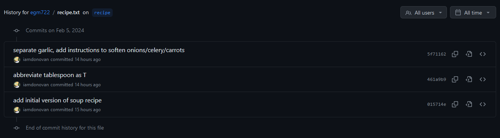
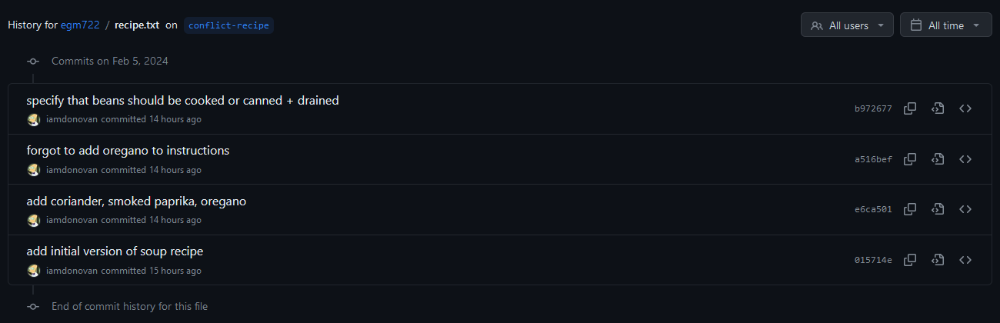
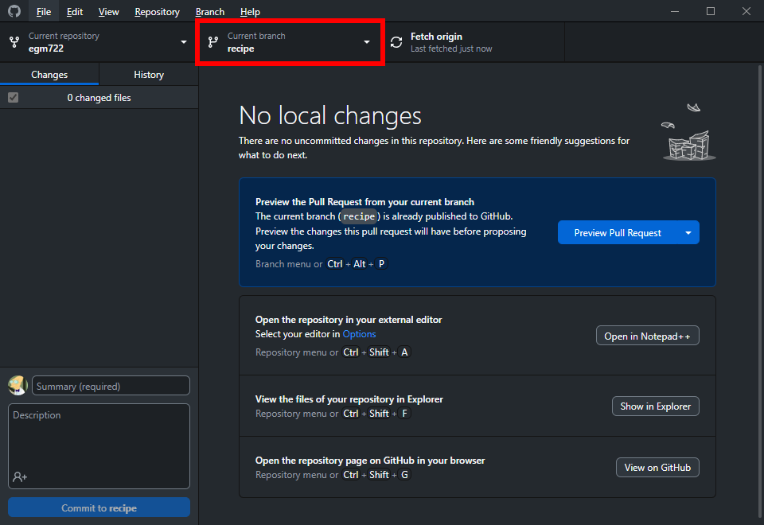
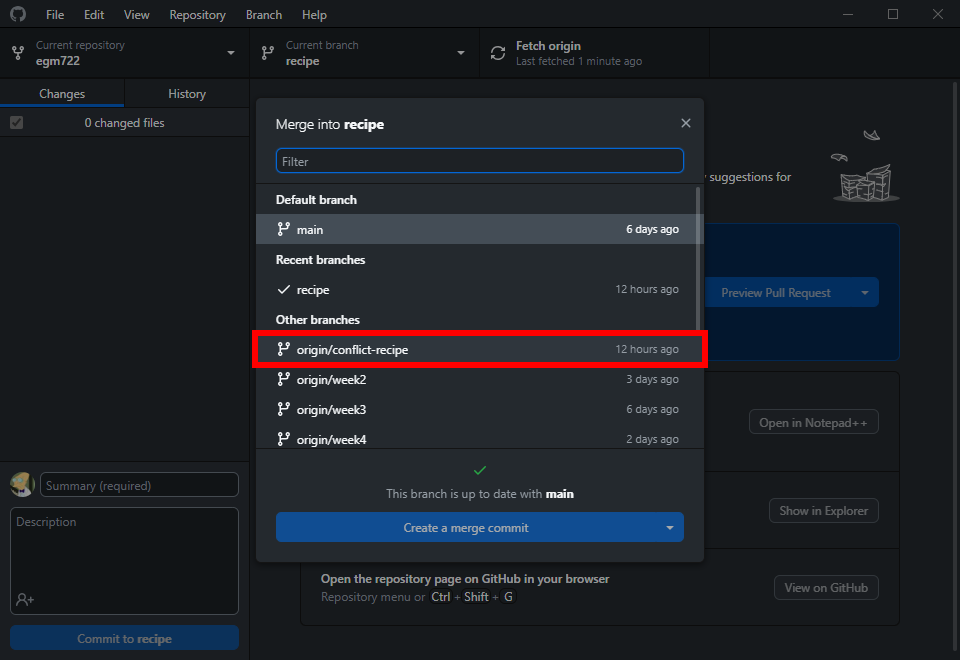
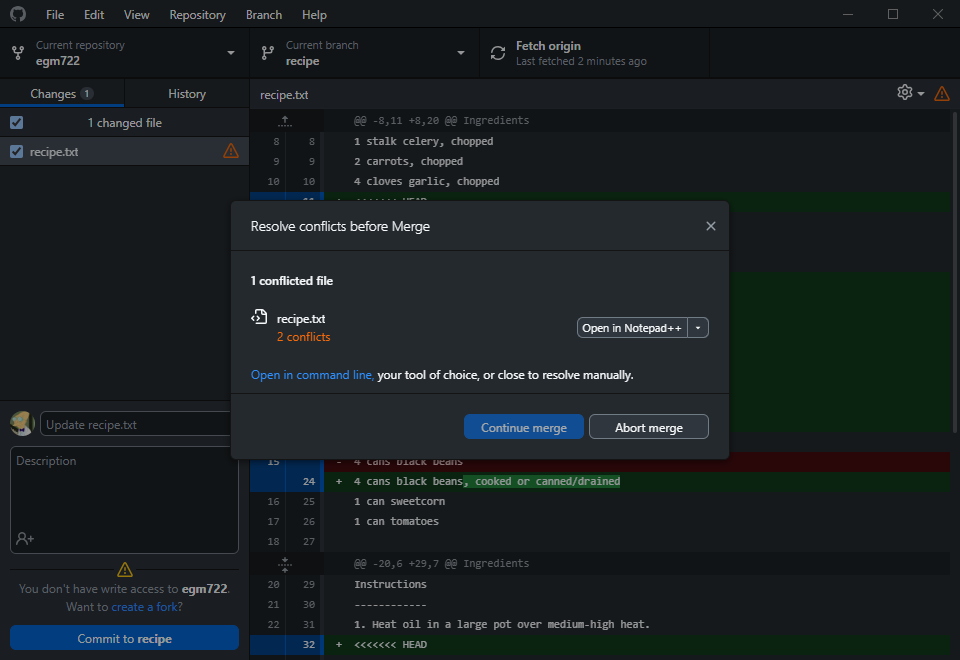
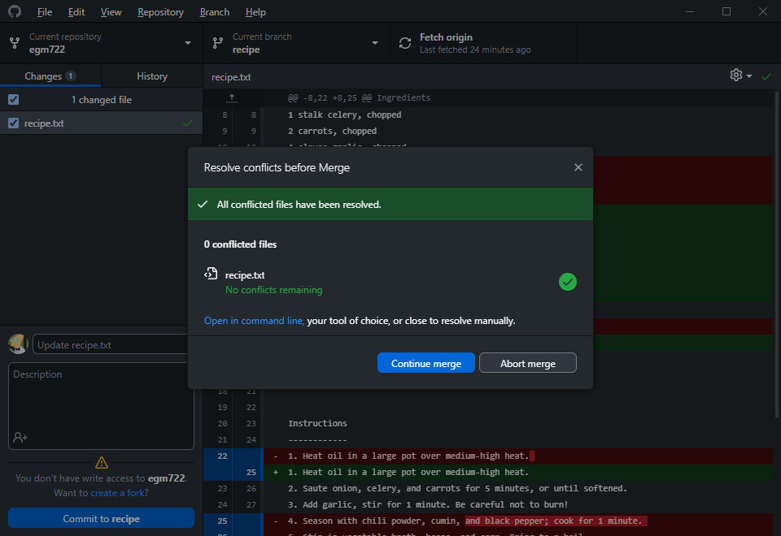

conflict resolution (using git)
================================

Sometimes, despite our best efforts, we run into conflicts in life.

The same is true for programming - when working with other people (or even ourselves, sometimes), we may wind up with
different versions of a file (or files) that have *conflicting* changes - that is, a file (or files) has been edited on
multiple branches of a project, and **git** isn't able to determine which of these is the "correct" one.

When this happens, you will need to tell ``git`` what version of the file you want to keep by **resolving** the merge
conflict.

getting started
----------------

To get started, open up **GitHub Desktop** to your EGM722 repository. When you click on the **Current branch** button,
you should see that in addition to the ``week*`` branches (``week2``, ``week3``, ``week4``, ``week5``), there are two
additional branches: ``recipe`` and ``conflict-recipe``.

The ``recipe`` branch is a **feature branch** that we are using to develop a recipe for spicy black bean soup,
contained in **recipe.txt** (`change history <https://github.com/iamdonovan/egm722/commits/recipe/recipe.txt>`__):

|br| And on the second branch, ``conflict-recipe``, we have the same file
(`change history <https://github.com/iamdonovan/egm722/commits/conflict-recipe/recipe.txt>`__), but with some changes
that have been added by one of our collaborators, Bob\ [1]_:

|br| When we go to merge ``conflict-recipe`` into ``recipe``, we won't be able to do so automatically - the two files
have different changes to the same lines, which means that the two branches have a conflict that we will need to try
to resolve.

creating the conflict
----------------------

Right now, we only have the "recipe" for a conflict\ [2]_ - in order to actually create the conflict, we have to
**merge** the conflicting branches.

You can do this in the exact same way that you merged the ``week2`` branch into ``main`` using **GitHub Desktop**.

First, make sure that you are currently on the ``recipe`` branch:

|br| Next, click on the **Branch** menu, then select **Merge into current branch...**.

In the menu that opens, select the ``origin/conflict-recipe`` branch:

|br| This time, instead of a green checkmark indicating that there aren't any conflicts, you should see a warning icon,
with the message "**There will be 1 conflicted file when merging origin/conflict-recipe onto recipe**":

.. image:: ../../../img/egm722/week2/recipe_conflict.png
    :width: 600
    :align: center
    :alt: the github desktop dialog, showing that there will be 1 conflicted file when merging conflict-recipe into recipe

|br| Click on **Create a merge commit** to generate the conflict that we will resolve.

resolving the conflict
-----------------------

Once you have started the **merge conflict**, **GitHub Desktop** will warn you that you need to resolve the conflicts
before you can finish the **merge**:

|br| It will give you the opportunity to open the file in your default **text editor** - for me, this is **Notepad++**,
but you might have something else installed - you can even use **PyCharm** or **VS Code** for this next step.

.. note::

    As long as you are using a **text editor** (**NOT MICROSOFT WORD**), you should be able to resolve the conflict and
    finish merging the changes.

If you click the arrow next to **Open in Notepad++**, you should also see the following menu options:

- Open with default program (usually **Notepad** on Windows computers)
- Show in explorer
- Use the modified file from ``recipe``
- Use the modified file from ``conflict-recipe``

Here, because there are changes that we want to keep in **both** versions, click on **Open in Notepad++**
(or **Notepad**) to view the conflicted file.

We're looking for blocks of text like the following - this is how ``git`` indicates that there is a conflict between
two versions of a file:

.. code-block:: text

    <<<<<<< HEAD

    <some stuff>

    =======

    <some other stuff>

    >>>>>>> (other commit or branch name)

In order to resolve the conflict, we have to decide whether we want to:

1. keep only ``<some stuff>`` (the version on our currently active branch, ``recipe``);
2. keep only ``<some other stuff>`` (the version on the branch we're merging, ``conflict-recipe``);
3. keep some combination of ``<some stuff>`` and ``<some other stuff>``.

Most of the time, you will end up deciding to use a combination of ``<some stuff>`` and ``<some other stuff>`` - in this
case, because the two versions of the file both contain changes that we're interested in keeping.

The first conflict block in the file looks like this (on lines 11--22):

.. code-block:: text

    <<<<<<< HEAD
    2 T chili powder
    1 T ground cumin
    1 T black pepper
    =======
    2 tablespoons chili powder
    1 tablespoon ground cumin
    2 teaspoons ground coriander
    2 teaspoons smoked paprika
    1 pinch black pepper
    1 teaspoon oregano
    >>>>>>> origin/conflict-recipe

Here, the change to abbreviate "tablespoons" as "T" has caused a conflict with the addition of "2 teaspoons ground
coriander" and "2 teaspoons smoked paprika" - additionally, we have somehow added a whole tablespoon (T) of black
pepper instead of just a pinch.

So, here is where you need to decide what ingredients list to keep for your updated recipe. If you are happy with
writing out "tablespoons" instead of "T", you can remove the first few lines:

.. code-block:: text

    <<<<<<< HEAD
    2 T chili powder
    1 T ground cumin
    1 T black pepper
    =======

along with the end of the first conflict block:

.. code-block::

    >>>>>>> origin/conflict-recipe

Alternatively, you could decide to keep the abbreviated forms ("T" for tablespoon, "t" for teaspoon), but perhaps you'd
rather only use a pinch of black pepper, rather than an entire tablespoon.

Or, you might decide that you don't like smoked paprika, or you dislike the taste of ground coriander, or...

.. note::

    I can't make these choices for you - you will need to decide for yourself how you like your recipes to be written,
    and what ingredients to keep.

Once you have finished editing the ingredients to your taste/preferences, let's move on to the Instructions, where we
can see another conflict (on lines 32--47):

.. code-block:: text

    <<<<<<< HEAD
    2. Saute onion, celery, and carrots for 5 minutes, or until softened.
    3. Add garlic, stir for 1 minute. Be careful not to burn!
    4. Season with chili powder, cumin, and black pepper; cook for 1 minute.
    5. Stir in vegetable broth, beans, and corn. Bring to a boil.
    6. Meanwhile, in a food processor or blender, process remaining 2 cans beans and tomatoes until smooth.
    7. Stir into boiling soup mixture, reduce heat to medium, and simmer for 15 minutes.
    8. Season to taste. Enjoy!
    =======
    2. Saute onion, celery, carrots and garlic for 5 minutes.
    3. Season with chili powder, cumin, coriander, smoked paprika, and black pepper; cook for 1 minute.
    4. Stir in vegetable broth, beans, and corn. Bring to a boil.
    5. Meanwhile, in a food processor or blender, process remaining 2 cans beans and tomatoes until smooth.
    6. Stir into boiling soup mixture, add oregano, reduce heat to medium, and simmer for 15 minutes.
    7. Season to taste. Enjoy!
    >>>>>>> origin/conflict-recipe

Here, the addition of a separate instruction to add the garlic (in the ``HEAD`` version on ``recipe``), along with the
addition of instructions for adding the new ingredients (on the ``conflict-recipe`` branch) has caused a conflict.

Once again, you will need to decide which set of instructions (or modified set of instructions) you wish to keep. I
think it makes sense to keep the garlic separate, so that it doesn't burn - in this case, I would keep the 8
instructions from the ``recipe`` branch.

But, I want to remember where to add the different spices - this means I want to update the instructions with some of
the changes on the ``conflict-recipe`` branch.

In the end, this is the version of the instructions that I have chosen - your decision may be different:

.. code-block:: text

    1. Heat oil in a large pot over medium-high heat.
    2. Saute onion, celery, and carrots for 5 minutes, or until softened.
    3. Add garlic, stir for 1 minute. Be careful not to burn!
    4. Season with chili powder, cumin, coriander, smoked paprika, and black pepper; cook for 1 minute.
    5. Stir in vegetable broth, half of beans, and corn. Bring to a boil.
    6. Meanwhile, in a food processor or blender, process remaining half of beans until smooth.
    7. Stir into boiling soup mixture, add oregano, reduce heat to medium, and simmer for 15 minutes.
    8. Season to taste. Enjoy!

Once you have finished editing the file **and there are no remaining conflict blocks**, you will be able to continue
with the **merge** commit.

merging the resolution
-----------------------

Now that we have edited the file so that the current version reflects how we want it to be, we're not quite done,
because need to finish the **merge**:

|br| Click **Continue merge** to finish the commit.

You should now see the message that you have successfully merged ``origin/conflict-recipe`` (or ``conflict-recipe``)
into ``recipe``:

.. image:: ../../../img/egm722/week2/merge_success.png
    :width: 600
    :align: center
    :alt: the github desktop window, showing that we have successfully merged origin/conflict-recipe into the recipe branch

|br| And that's it - we have now successfully resolved the conflict between ``recipe`` and ``conflict-recipe``, and
finished developing a recipe for spicy black bean soup in the process.

The final step is to click **Push origin** to **push** your local changes to your GitHub repository (the **remote**).

other tools
------------

In addition to using text editors such as **Notepad++** or **Notepad**, there are a number of available tools that are
built to handle conflicts, including IDEs such as PyCharm and VSCode:

- `PyCharm <https://www.jetbrains.com/help/pycharm/resolving-conflicts.html#distributed-version-control-systems>`__ -
  see this page for an example of how to use PyCharm's built-in functionality to resolve conflicts between branches.
- `VSCode <https://learn.microsoft.com/en-us/visualstudio/version-control/git-resolve-conflicts?view=vs-2022>`__ -
  see this page for an example of how to use VSCode's built-in functionality to resolve conflicts between branches.
- `Meld <https://meldmerge.org/>`__, an open source graphical interface for comparing different files. Works on Linux,
  Windows, and MacOS.

next steps
-----------

Now that you have fully resolved the conflict by finishing the merge commit, you can go one further by merging
``recipe`` into ``main``.

Hopefully, there won't be any changes on ``recipe`` that conflict with ``main`` - this should be completely
straightforward, because the only file that has been changed is **recipe.txt**, which doesn't yet exist on ``main``.

To do this, you can merge ``recipe`` into ``main`` following the same procedure that you did at the beginning of the
:doc:`cartopy <cartopy>` exercise (remembering to use ``recipe`` instead of ``week2``).

notes
-------

.. [1] https://en.wikipedia.org/wiki/Alice_and_Bob

.. [2] yes, this was intentional. No, I am not sorry.