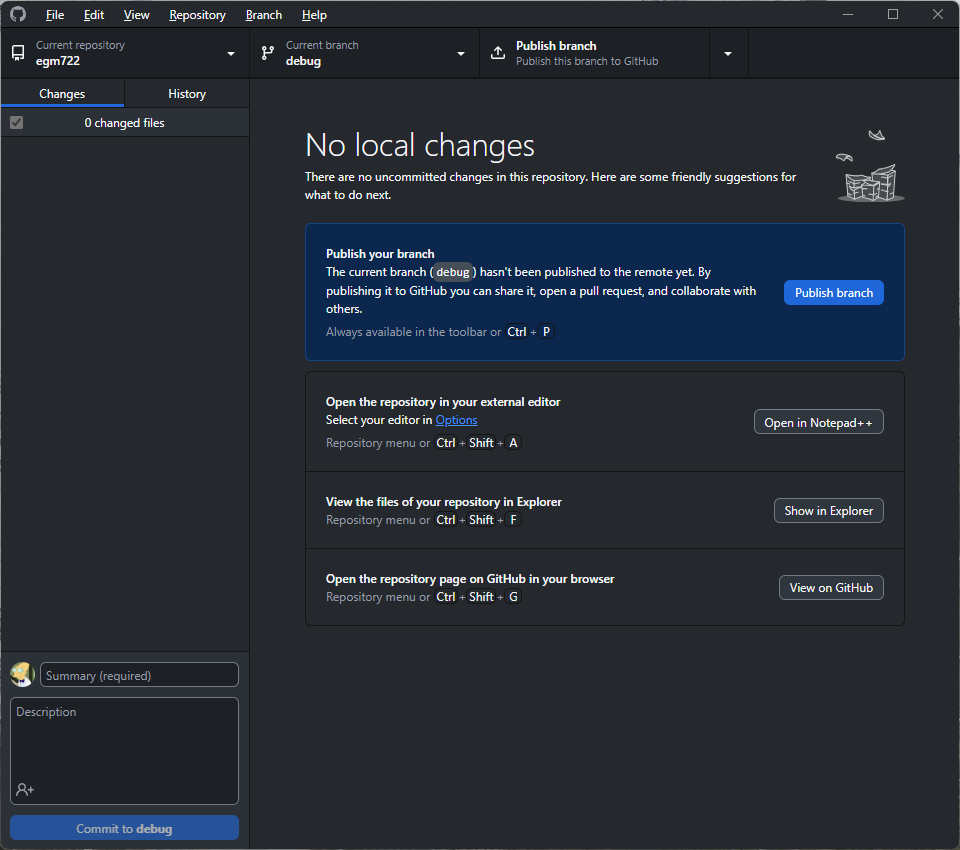
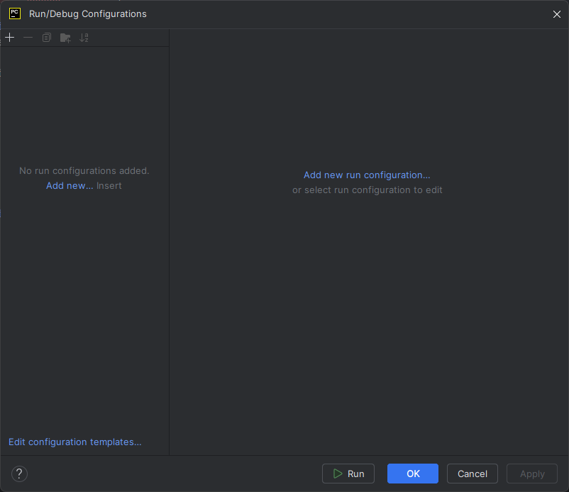
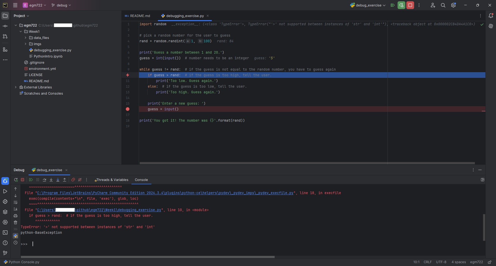

debugging exercise
===================

.. warning::

    Before proceeding, you should have completed all of the :doc:`../setup/index` steps, including installing an IDE
    such as PyCharm.

    **If you have not completed all of the steps above, stop now and go back to finish them!**

.. note::

    The example and instructions shown here are for PyCharm Community Edition 2021.3.3 -- if you are using a
    different IDE, such as VS Code or Spyder, the steps will be similar, broadly speaking, but they are different
    software packages with a different appearance and menu options.

    I will do my best to provide help with other options, but I can't promise a completely painless experience.

the script
-----------

The goal with the ``debugging_exercise.py`` script is to have a short guessing game program. The script should
generate a random integer between 1 and 20, and at the start, the user should enter a guess by typing it into the
command prompt.

Based on the user's input, the program should say whether the guess is higher or lower than the random number,
and prompt the user to enter a new guess. This process should repeat, until the user has correctly guessed the number.

Unfortunately, as you will see, the script provided has a number of *bugs*, or errors, in it, that prevent it from
running as expected. Our task in this exercise is to use PyCharm's debugging tools to correct (*debug*) these error,
so that the script functions as intended.

creating a new branch
---------------------

.. note::

    The instructions below show you how to create a new branch using **GitHub Desktop**, but you can also do this
    using IDEs such as **PyCharm** or **VSCode**, or using the git command-line interface.

Before we get started editing the script, let's first create a new branch to work on. Remember that this enables us
to make changes to our code (i.e., create new features or fix existing code) without affecting the code that is
currently being used by others.

To do this, open **GitHub Desktop**. If you haven't already, add your egm722 repository from the **File** menu
(**File** > **Add Local Repository**):

|br| Click **Choose** to navigate to where you have cloned your repository. Once you have selected the folder,
click **Add repository** to finish adding the repository. You should see something like this:

|br| You should be on the ``main`` branch, visible in the upper center of the screen. You can click on
**Current branch** to switch branches:

|br| Click on **New branch** to add a new branch to your repository:

|br| Call the new branch ``debug``, then click **Create branch** to create the new branch. You should now see that
in addition to creating the branch, **GitHub Desktop** has automatically switched you to the new branch:

|br| Now, as we work on debugging the script during the exercise, we won't affect the code on the ``main`` branch
until we are satisified that things are working as they should be.

pycharm setup
-------------

There's one final bit of setup needed. PyCharm provides a number of options for running scripts - the instructions
below will show you how you can do this using the **Run** tool.

.. note::

    Again, this assumes that you have set up PyCharm according to the :doc:`instructions<../setup/pycharm>`, including
    creating a new project for your EGM722 practicals.

To be able to run a script using the **Run** button, or to use the debugging tools, you'll need to make sure that
you've configured a python interpreter already, following the instructions in :ref:`create project`
or :ref:`adding interpreter`.

In the upper right-hand corner of the PyCharm window, you should see this:

.. image:: ../../../img/egm722/debug/buttons.png
    :width: 300
    :align: center
    :alt: the run script and debugging tool buttons

|br| Click **Current File**, then select **Edit Configurations...** from the drop-down menu. This will open the
**Run/Debug Configurations** window:

|br| Click the **+** icon in the upper left to add a new configuration, and select **Python**:

.. image:: ../../../img/egm722/debug/empty_configuration.png
    :width: 720
    :align: center
    :alt: a new python configuration

|br| Call this new configuration ``debug_exercise``, and set the **Script path** to be the path to
**debugging_exercise.py** in the **Week1** folder of your EGM722 repository.

Finally, make sure that the **Python interpreter** is set to your ``egm722`` environment, then click **OK** to finish
the configuration:

|br| You should see that the buttons in the upper right of the window have changed:

.. image:: ../../../img/egm722/debug/new_buttons.png
    :width: 300
    :align: center
    :alt: the run script and debugging tool buttons with a configuration selected

running a script
-----------------

Once you have the script configured, you can press the green **Run** button (the triangle). When you do this,
you should see that the **Run Panel** opens at the bottom of the window:

|br| This is where anything printed to the screen by your script will show, including all error messages. In fact, you
should see an error message already:

.. code-block:: sh

    Traceback (most recent call last):
      File ("C:/Users/{username}/github/egm722/Week1/debugging_exercise.py", line 4, in <module>
        rand = random.randint(1, 100)
    NameError: name 'random' is not defined

    Process finished with exit code 1

Note that, if the script had run successfully, you would see the following at the end:

.. code-block:: sh

    Process finished with exit code 0

If the exit code is any other value, it means that something hasn't gone according to plan. For more information about
python exit codes, have a look at the documentation for ``sys.exit()``
`here <https://docs.python.org/3.8/library/sys.html#sys.exit>`__.

Here, we can see that the process finished with exit code 1, which indicates that the interpreter raised an
**Exception** (an error). Now that we have confirmed that the script that's supposed to have errors in it indeed
has errors, we'll use the debugging tools in order to fix those errors.

the error message
------------------

First, though, let's have another look at the error message:

.. code-block:: sh

    Traceback (most recent call last):
      File ("C:/Users/{username}/github/egm722/Week1/debugging_exercise.py", line 4, in <module>
        rand = random.randint(1, 100)
    NameError: name 'random' is not defined

    Process finished with exit code 1

The **Traceback** tells us exactly where something went wrong - in this case, it happened in the
``debugging_exercise.py`` script at line 4. The line:

.. code-block:: python

    rand = random.randint(1, 100)

Caused a **NameError**, because the interpreter tried to do something with an object called ``random``, and no
such object had been defined.

Let's open up the script and see if we can find where something went wrong:

.. image:: ../../../img/egm722/debug/syntax_highlighting.png
    :width: 720
    :align: center
    :alt: the pycharm window with the run panel opened

|br| One of the features of PyCharm and other IDEs is that they highlight *syntax*, which helps identify potential
issues. Here, we can see that at the same spot where the script failed, ``random`` is underlined in red. If you hover
over this with your mouse, you can see the following message:

.. image:: ../../../img/egm722/debug/pycharm_error.png
    :width: 400
    :align: center
    :alt: an error message from pycharm

|br| This tells us essentially the same thing as the **NameError** - the object called ``random`` has been used before
it was defined. The issue, in this case, is clear if we look at line 1:

.. code-block:: python

    # import random

The last person who worked on this script commented out the **import** statement, meaning that we never actually
imported the ``random`` module. Thanks a lot, bob.

If you delete the ``#`` and the space following it:

.. code-block:: python

    import random

You should see that the red underline at line 4 goes away - we should no longer see a **NameError** caused by
the issue at line 4. Save the script (**CTRL + S**) before moving on.

commiting changes
------------------

Before we run the script again, notice that the name of the script in the tab has turned blue:

.. image:: ../../../img/egm722/debug/blue_tab.png
    :width: 200
    :align: center
    :alt: the script tab showing that changes have been made, but not committed

|br| This indicates that we have changed the file, but not yet commited it using **git**. To do this, there are a number
of tools at our disposal; we'll focus on using **GitHub Desktop** for right now.

With **GitHub Desktop** open, you should see the following:

|br| On the left, we see that there's 1 file that has changed (``Week1\debugging_exercise.py``), and in the main panel
we see what that change is: we've deleted the ``#`` from line 1.

In the lower left, you can see a place to enter a new **commit** message, including a longer **description**. This is
where you identify what change(s) you've made to your file(s), and (optionally) explain why in a longer message.

For the commit message, enter **"fixed import statement"**, and leave the description blank for now. Press the blue
**Commit to debug** button to **commit** (save) the changes to the file, then go back to PyCharm.

You should see that the script tab has changed from blue to white, indicating that there are no un-committed changes
to the file:

.. image:: ../../../img/egm722/debug/white_tab.png
    :width: 200
    :align: center
    :alt: the script tab showing there are no un-committed changes

the debugging tools
--------------------

Once you've committed this fix, run the script again. You should see that there's now an error in a different spot:

.. image:: ../../../img/egm722/debug/new_error.png
    :width: 720
    :align: center
    :alt: a new error appears! progress!

.. code-block:: python

    Traceback (most recent call last):
      File ("C:/Users/{username}/github/egm722/Week1/debugging_exercise.py", line 10, in <module>
        if guess > rand:  # if the guess is too high, tell the user.
    TypeError: '>' not supported between instances of 'str' and 'int'

    Process finished with exit code 1

This time, the line appears at line 10 of the code, inside of the ``while`` loop. But, it made it through at least one
iteration of the ``while`` loop, because we were able to enter a second guess, which happens at line 16.

So, let's tell PyCharm to stop the script at that location. To do this,
click on the left-hand side of the code panel, just to the right of the "16" at line 16.
You should see a red dot appear:

.. image:: ../../../img/egm722/debug/breakpoint.png
    :width: 720
    :align: center
    :alt: a breakpoint added to the script at line 16.

|br| This is a **breakpoint** - a spot for the interpreter to pause while we inspect what's going on in the script. Run
the script again, but this time press the green **debugging** button (it looks like a small bug).

This time, instead of the **Run** panel, you should see that PyCharm has opened the **Debug Panel**. After entering
your guess in the console, you should see the **Debugger** showing in the lower half of the window:

.. image:: ../../../img/egm722/debug/debugger.png
    :width: 720
    :align: center
    :alt: the debugger panel at the bottom of the pycharm window

|br| At the moment, the script has stopped running - it's waiting for us to tell it to do something. Have a look at this
part of the **Debugging Panel**:

.. image:: ../../../img/egm722/debug/debug_buttons.png
    :width: 300
    :align: center
    :alt: the debugging buttons

|br| From left to right, the buttons here are:

- **Rerun {name}** - re-run the debug configuration that is currently running
- **Stop {name}** - stop the debug configuration that is currently running
- **Resume Program** - continue running the debug configuration
- **Pause Program** - pause the debug configuration that is currently running
- **Step Over** - this runs the current line without stepping into any method or function calls, moving right to the
  next line in the current script
- **Step Into** - this will actually step into any method or function calls, allowing you to examine what's happening
  inside of those functions
- **Step Into My Code** - this works the same as **Step Into**, but it won't step into methods/functions that have been
  imported
- **Step Out** - steps out of the current method/function and back to where the method/function was called.
- **View Breakpoints** - opens a dialog where you can view the current breakpoints and tell the debugger what to do
  with each of them.
- **Mute Breakpoints** - ignores breakpoints while running the script

And, under the **More** menu (three vertical dots):

- **Force Step Over** - steps over the current line of code even if there are method calls in this line
- **Smart Step Into** - enables you to select which of the different method calls in a single line you want to use
- **Run to Cursor** - will run the program until it reaches where the cursor is currently placed
- **Force Run to Cursor** - continues running the program until it reaches the current cursor position, ignoring
  breakpoints
- **Show Execution Point** - this highlights where in the code you currently are
- **Evaluate Expression** - you can use this to calculate values of expressions or code fragments, using the variables
  and methods that have currently been declared.

We won't get into using all of these during this exercise, but if you're interested in learning more about these tools
and how to use them, check out the PyCharm online manual: https://www.jetbrains.com/help/pycharm/debugging-code.html.

Press the **Step Over** button, then switch back to the **Console** view. You should see a prompt to enter a new guess:

.. image:: ../../../img/egm722/debug/debug_console.png
    :width: 720
    :align: center
    :alt: the debug console with the new guess

|br| When you enter a new guess this time, you should see the **Error** message again, and the line where the **Error**
occurred should be highlighted:

|br| Now, switch back to the **Debugger**:

.. image:: ../../../img/egm722/debug/debugger_types.png
    :width: 720
    :align: center
    :alt: the debugger window showing the types of the available variables in the script

|br| Note that our list of variables down below, ``guess`` has a **type** of ``str``, while ``rand`` has a **type** of
``int``. This, combined with the **Error** message:

.. code-block:: python

    TypeError: '>' not supported between instances of 'str' and 'int'

tells us what the problem is. The output of ``input()``
(`documentation <https://docs.python.org/3/library/functions.html#input>`__) is a ``str``, which means that if we
want to treat it like a number, we need to tell python to do so.

To fix this error, we can use ``int()`` to try to convert what the user types from a ``str`` to an ``int``:

.. code-block::

    guess = int(input())

.. note::

    Remember: this will still raise an error if the user types anything other than a number, because ``int()``
    expects that the argument provided to it is numeric.

Once you've fixed this error, save the script (**CTRL + S**), and press the red **Stop** button to stop the debugger.

In **GitHub Desktop**, make sure to **add** and **commit** this change with an appropriate commit message before you
continue to the next section.

semantic errors
----------------

The errors that we've seen so far (**NameError**, **TypeError**) are examples of **Runtime Errors** - errors that,
when the python interpreter finds them, cause it to raise an **Exception** that stops the program.

The other errors in the script are **semantic** errors - that is, the code is *technically* correct, but
something is not quite right. These are usually the hardest errors to find and fix, because what is wrong isn't
immediately obvious.

By using the debugging tools available in an IDE like PyCharm, we can stop the code and have a closer look, which
should help us narrow down what's wrong.

Run the debugger again, and pay attention to the value of the number you're meant to guess (``rand``), as well as the
response when you enter your guess:

|br| In the window above, you can see that I've entered a guess of 10, and the response from the program
is ``'Too high. Guess again.'``.

Now, this should mean that ``guess > rand``, but have a look at the values displayed in the **debugger**:

.. image:: ../../../img/egm722/debug/debug_values.png
    :width: 720
    :align: center
    :alt: the values of the variables used in the guessing game program

|br| Here, we see that ``guess`` has a value of 10, as expected, but ``rand`` has a value of 53. So, there are two
problems here.

First, the instructions to the user were to guess a number between 1 and 20, and 53 is decidedly outside of that
range. Looking at line 4:

.. code-block:: python

    rand = random.randint(1, 100)

We can see that we're getting a random integer in the range 1 to 100, rather than the expected 1 to 20. Fortunately,
that's easy enough to fix.

Second, 10 < 53, but the program has told us the opposite:

.. code-block:: python

    if guess > rand:  # if the guess is too high, tell the user
        print('Too low. Guess again.')
    else:  # if the guess is too low, tell the user
        print('Too high. Guess again.')

Based on the comments, and the actual code (``if guess > rand:``), these print messages need to be reversed:

.. code-block:: python

    if guess > rand:  # if the guess is too high, tell the user
        print('Too high. Guess again.')
    else:  # if the guess is too low, tell the user
        print('Too low. Guess again.')

Fix these errors in the script, save it (**CTRL + S**), then try to **Run** the script again. Does it run as expected,
with no further bugs?

finishing up
-------------

Once you've identified and fixed the bugs, head back to **GitHub Desktop**. You should see the changes you've made have
been tracked:

.. image:: ../../../img/egm722/debug/final_changes.png
    :width: 600
    :align: center
    :alt: the final changes tracked in github desktop

|br| This time, because we've made a number of changes, we'll write a longer commit description, at least for practice.
Add a brief commit message, such as "fix guessing game script", then add a longer description of the changes:

|br| Finally, press the **Commit to debug** button to **commit** the changes.

merging and pruning
-------------------

Finally, we are ready to **merge** our changes into the ``main`` branch. In **GitHub Desktop**, let's first check over
what changes we have made by clicking on the **History** tab in the upper left corner of the window:

|br| Along the side of the window, you can see all of the different changes that make up the history of the ``debug``
branch - you should see that the most recent few changes have been made by you over the course of this exercise.

From here, you can see details about what changes have been made to what files, just like you have been able to see as
you have been making changes to the script during the exercise.

To **merge** these changes into the ``main`` branch, we first need to switch back to the ``main`` branch. To do this,
click on the **Current branch** button in the upper center of the window, and select ``main``. You should now see that
your current branch has changed, as has the history:

|br| Click this button again to bring up the list of available branches, and select
**Choose a branch to merge into main** at the bottom of the screen.

This will bring up the **merge** dialog:

|br| Select your ``debug`` branch:

|br| You can click directly on **Create a merge commit** to merge the changes; for more complicated merging, you can
also click the arrow to select the following options:

- **create a merge commit** - this will merge all of the changes from ``debug`` into ``main`` by placing them onto the
  end of the current history;
- **squash and merge** - turn all of the changes from ``debug`` into a single commit;
- **rebase** - modifies the history of commits into something more linear.

For now, we will stick with creating a merge commit (the default option). Once you have clicked on this option, you
should see that your changes have been merged, and you are ready to **push** your changes to the remote repository
(i.e., your repository on GitHub):

|br| Once you have pushed the changes to the origin repository, you are finished with the exercise, and you can
"prune" the ``debug`` branch. To do this, open the list of branches again, then right-click on the ``debug`` branch
and select **Delete**.

next steps
-----------

As some additional practice, see if you can add a new feature to the program that keeps track of the number
of guesses the user has made, and prints out the total number of guesses once the user has correctly guessed the number.

Make sure that while you are doing this, you are working on a *new* branch - call this branch ``tracker``.

Once you have implemented the changes and are satisfied that they're working properly, remember to do the following:

- use **GitHub Desktop** to **commit** the changes
- **merge** the changes into your ``main`` branch
- **push** the changes to your remote repository
- "prune" the ``tracker`` branch by deleting it.

