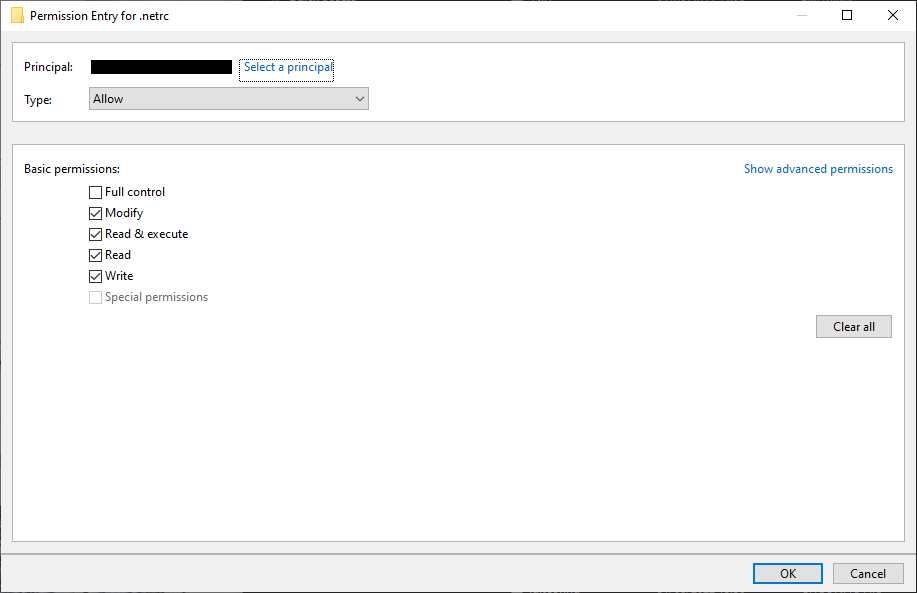

searching + downloading satellite data using earthaccess
========================================================

getting started
-----------------

The other thing you'll need to do before starting this week's practical is install a new python package,
**earthaccess**, into our **conda** environment.

First, open up **Anaconda Navigator**. Make sure to switch to your ``egm722`` environment, then click on the
**Environments** tab:

.. image:: ../../../img/egm722/week4/environments.png
    :width: 720
    :align: center
    :alt: the "environments" tab in Anaconda Navigator, opened on the egm722 environment

|br| Change the list from **Installed** to **Not installed**, then type ``earthaccess`` into the **Search** bar in the
upper right-hand corner:

.. image:: ../../../img/egm722/week4/package_search.png
    :width: 720
    :align: center
    :alt: the "environments" tab in Anaconda Navigator, showing all packages that match 'earthaccess'

.. note::

    If nothing shows up here, don't panic:

    .. image:: ../../../img/egm722/week4/blank_search.png
        :width: 600
        :align: center
        :alt: the "environments" tab in Anaconda Navigator, showing all packages that match 'earthaccess'

    It just means we need to add the ``conda-forge`` channel to the list of **Channels**.

    To do this, first click the **Channels** button, then type ``conda-forge``:

    .. image:: ../../../img/egm722/week4/add_channel.png
        :width: 300
        :align: center
        :alt: adding a new channel called "conda-forge" to the list of channels

    Press **Enter**, and you should see the new channel added to the list:

    .. image:: ../../../img/egm722/week4/channels_added.png
        :width: 300
        :align: center
        :alt: the new channel added to the list of channels

    Click **Update channels**. Once the channel list finishes refreshing, you should see the ``earthaccess`` package
    in the list of available packages.

Click the box next to ``earthaccess`` to select it, then click **Apply** in the lower right-hand corner:

.. image:: ../../../img/egm722/week4/package_select.png
    :width: 720
    :align: center
    :alt: the "environments" tab in Anaconda Navigator, with the 'earthaccess' package selected

|br| You should see the following window open (note that this may take some time):

.. image:: ../../../img/egm722/week4/package_install.png
    :width: 300
    :align: center
    :alt: the list of new packages to add to the environment

|br| Click **Apply**, and the packages will be downloaded/installed in the environment. While you wait for **Anaconda**
to finish working, you will be able to move on to the next steps.

Alternatively, go and grab a coffee or tea, and move on to the next steps.

the .netrc file
-----------------

In order to search for and download data using the ``earthaccess`` API, we will need to authenticate (log in) using your
NASA EarthData username/password.

.. hint::

    If you don't already have a NASA EarthData account, don't worry. You can go to https://urs.earthdata.nasa.gov/ and
    click **Register** (or **Register for a profile**). Follow the steps on the screen, making sure to save your password
    using your favorite password manager of choice - you will need it to set up the ``.netrc`` file.

The ``earthdata.login()`` method (`documentation <https://earthaccess.readthedocs.io/en/latest/user-reference/api/api/#earthaccess.api.login>`__)
uses a few different options for authentication (that is, confirming that you are an authorized user):

- "**interactive**": enter your username and password in the interpreter
- "**netrc**": retrieve your username and password from a ``.netrc`` file.
- "**environment**": retrieve username and password from *environment variables* ``$EARTHDATA_USERNAME`` and ``$EARTHDATA_PASSWORD``

This way of authenticating helps avoid typing your username/password into a script or notebook, which is **always**,
**ALWAYS**, a bad idea.

.. danger::

    No, seriously. **NEVER**, **EVER** type your password in plaintext in a script or a jupyter notebook.

For this exercise, we'll set up something called a netrc or ``.netrc`` file\ [1]_, which ``earthaccess`` can read to
authenticate you with NASA EarthData.

A `netrc file <https://www.gnu.org/software/inetutils/manual/html_node/The-_002enetrc-file.html>`__ can be used by a
number of websites and programs for authentication, making it so that you don't type your password as plaintext in a
script or command prompt.

The ``.netrc`` file is a text file with a simple structure, where each line corresponds to a "machine" or website:

.. code-block:: text

    machine <website> login <username> password <password>

To create the file, open **notepad++** (or **notepad**, or your text editor of choice), and enter the following line:

.. code-block:: text

    machine urs.earthdata.nasa.gov login <username> password <password>

remembering to replace :samp:`<username>` with your NASA EarthData username, and :samp:`<password>` with
your NASA EarthData password.

Save the file as ``.netrc`` to your **Home** directory (on Windows, this should be ``C:\Users\<your_username>``).
Be sure to select **All Files** for **Save as type**:

.. image:: ../../../img/egm722/week4/saveas_notepad.png
    :width: 600
    :align: center
    :alt: the "save as" window for notepad

|br| From **notepad++**, you should also uncheck **Append extension**:

.. image:: ../../../img/egm722/week4/saveas_notepadpp.png
    :width: 600
    :align: center
    :alt: the "save as" window for notepad++

|br| We're not quite done - there's one last thing we'll need to do before moving on.

changing permissions
^^^^^^^^^^^^^^^^^^^^^^

.. note::

    On MacOS or linux-based systems, enter the following command in a terminal window:

    .. code-block::

        chmod 600 ~/.netrc

    This uses the ``chmod`` command to change the permissions on the file so that only the *owner* of the file has
    read/write access to the file (for more about ``chmod`` permissions, see this
    `wikipedia entry <https://en.wikipedia.org/wiki/Chmod>`__).

The last step we want to do in setting up the netrc file is to change the *permissions* so that other users can't
access the file. To change the permissions of the file in Windows, first open **Windows Explorer**.

From **Windows Explorer**, right-click on the file and select **Properties**:

.. image:: ../../../img/egm722/week4/properties.png
    :width: 300
    :align: center
    :alt: file properties for the new .netrc file

|br| Click on the **Security** tab:

.. image:: ../../../img/egm722/week4/security_orig.png
    :width: 300
    :align: center
    :alt: security properties for the new .netrc file

|br| then click **Advanced**:

|br| Click **Disable inheritance**, then click **Convert inherited permissions into explicit permissions on this object**
in the window that pops up:

.. image:: ../../../img/egm722/week4/block_inheritance.png
    :width: 400
    :align: center
    :alt: a dialogue asking what to do with the current inherited permissions for the .netrc file

|br| Now click **Apply**. Next, remove all of the rows from the table that aren't your user name (this should be
**SYSTEM** and **Administrators**):

|br| Click **Apply**, then highlight your username and click **Edit**. In the window that opens up, uncheck
**Full control**, but make sure that the other 4 available boxes are checked:

|br| Click **OK**, then **OK** again to close the advanced security settings. You should see the permissions for the
file have changed:

.. image:: ../../../img/egm722/week4/security_final.png
    :width: 300
    :align: center
    :alt: file properties for the new .netrc file, updated so that only the file owner has access

|br| That's it - you should now be able to work through the notebook (assuming that you have correctly entered your
credentials in the ``.netrc`` file, that is).

At this point, you can launch Jupyter Notebooks from the command prompt, or from Anaconda Navigator, and begin to work
through the exercise.

.. note::

    Below this point is the **non-interactive** text of the notebook. To actually run the notebook, you'll need to
    follow the instructions above to open the notebook and run it on your own computer!

Gena Rowlands
---------------

overview
^^^^^^^^^

Up to now, you have gained some experience working with basic features
of python, used cartopy and matplotlib to create a map, explored using
shapely and geopandas to work with vector data, and explored using
rasterio and numpy to work with raster data.

In this exercise, we’ll see how we can use an application programming
interface (API) to query and download satellite data from `NASA
EarthData <https://www.earthdata.nasa.gov/>`__, using the
`earthaccess <https://earthaccess.readthedocs.io/>`__ API. As part of
this, we’ll also introduce a few more geometric operations using
``shapely`` that you may find useful.

objectives
^^^^^^^^^^^

In this example, you will:

- Use ``shapely`` to get the *unary union* of a collection of shapes
- Use ``shapely`` to find the minimum rotated bounding rectangle of a
  geometry
- Use the ``earthaccess`` API to search for satellite images
- Use the ``earthaccess`` API to download images
- Use ``rasterio`` to mosaic images together into a single dataset

data provided
^^^^^^^^^^^^^^

In this example, we will be using the ``Counties`` shapefile that we
used in Week 2.

getting started
^^^^^^^^^^^^^^^^

To get started, run the following cell to import the packages that we’ll
use in the practical.

.. code:: ipython3

    import os
    import earthaccess
    import geopandas as gpd
    import rasterio as rio
    import rasterio.merge
    import shapely

preparing a search area
^^^^^^^^^^^^^^^^^^^^^^^^

Before we get to using the API to search for images, we’ll see how we
can use existing data, like the ``Counties`` shapefile we used in Week
2, to help us search for images.

We won’t be able to use particularly complicated shapes, but we can use
a combination of GIS/geometric operations to get a simple outline of our
data, which can be used for the search, and to help filter and refine
our search results.

First, we’ll load the data using ``geopandas``, making sure to transform
from the original CRS to WGS84 latitude/longitude (``epsg=4326``):

.. code:: ipython3

    counties = gpd.read_file('../Week2/data_files/Counties.shp').to_crs(epsg=4326)

Next, we’ll use ``.union_all()`` attribute
(`documentation <https://geopandas.org/en/latest/docs/reference/api/geopandas.GeoSeries.union_all.html>`__)
to get a combination of all of the County outlines in a single geometry
feature:

.. code:: ipython3

    # gets a single polygon (or multipolygon) composed of the individual geometries in the dataset
    outline = counties['geometry'].union_all()

    outline # note that in a jupyter notebook, this actually displays the polygon.

In the output of the cell above, we can see that the ``outline`` shape
is indeed the combination of all of the individual county outlines - it
looks like the outline of Northern Ireland that we also used in the Week
2 practical. We can’t use this directly in our NASA EarthData query -
for one thing, this polygon is far too complicated for the kind of query
that we perform using the API.

If we look at the documentation for ``earthaccess.search_data``, we see
that we can pass a *bounding box* argument, in the form of a **tuple**
corresponding to the lower left longitude (minimum x), lower left
latitude (minimum y), upper right longitude (maximum x), and upper right
latitude (maximum y) values:

.. code:: ipython3

    help(earthaccess.search_data)

To get these values from our outlines, we can use the ``.bounds``
attribute of our **Polygon**:

.. code:: ipython3

    outline.bounds # get the min x, min y, max x, max y values of the polygon

However, we can also pass a ``polygon`` argument. Rather than pass the
outline (a very complicated geometric object), though, we’ll look at one
additional attribute of a ``shapely`` **Polygon** that we can use to get
a bounding box of the geometry - the ``minimum_rotated_rectangle``
(`documentation <https://shapely.readthedocs.io/en/stable/reference/shapely.minimum_rotated_rectangle.html>`__):

.. code:: ipython3

    # gets the minimum rotated rectangle that covers the outline
    search_area = outline.minimum_rotated_rectangle

    search_area # again, in a jupyter notebook, this displays the polygon

You can see above that this gives a boundary box of the polygon, but
rather than being a simple rectangle made of the maximum/minimum
coordinates, it’s rotated to be as small as possible while still
covering the entire geometry. This way, we minimize the area outside of
the area of interest (Northern Ireland) within our search area, while
still making sure to cover the entire area of interest.

The API that ``earthaccess`` uses requires that the **Polygon** be
oriented counter-clockwise. To do this, we can use
``shapely.geometry.polygon.orient()``
(`documentation <https://shapely.readthedocs.io/en/stable/manual.html#shapely.geometry.polygon.orient>`__):

.. code:: ipython3

    search_area = shapely.geometry.polygon.orient(search_area, sign=1) # a sign of 1 means oriented counter-clockwise

    search_area # this doesn't actually change the geometry, just the order of the vertices

That’s all we need to be able to search for images that intersect with a
given geometry. Once we have this, we can connect to the API and start
the search.

searching the archive for images
^^^^^^^^^^^^^^^^^^^^^^^^^^^^^^^^^

connecting to the api
~~~~~~~~~~~~~~~~~~~~~

To connect to the API, we first call ``earthaccess.login()``
(`documentation <https://earthaccess.readthedocs.io/en/latest/user-reference/api/api/#earthaccess.api.login>`__):

.. code:: ipython3

    earthaccess.login(strategy='netrc')

From the API reference for ``earthaccess`` linked above, we can see that
we have a few ways of connecting. By default, it tries all of them
(``strategy='all'``):

- ``'all'`` - try all methods until one works
- ``'interactive'`` - enter username and password
- ``'netrc'`` - retrieve username and password from ``~/.netrc``
- ``'environment'`` - retrieve username and password from
  ``$EARTHDATA_USERNAME`` and ``$EARTHDATA_PASSWORD``

Because we have already set up a ``~/.netrc`` file with our EarthData
username and password, we can just specify ``strategy='netrc'``, though
leaving this with the default ``'all'`` should also work.

If there are no error messages or warnings, the connection was
successfully created, and we can move on to searching for datasets.

searching for datasets
~~~~~~~~~~~~~~~~~~~~~~

Next, we’ll see how we can use ``earthaccess.search_datasets()``
(`documentation <https://earthaccess.readthedocs.io/en/latest/user-reference/api/api/#earthaccess.api.search_datasets>`__)
to see what datasets are available that match our search. For example,
let’s say that we wanted to search for data that intersect with Northern
Ireland and have to do with elevation - we can use ``'elevation'`` as a
``keyword``, then pass ``search_area.exterior.coords`` (the list of
coordinates that describe the exterior of the polygon) as the
``polygon`` argument:

.. code:: ipython3

    datasets = earthaccess.search_datasets(
        keyword='elevation', # search for datasets that match the keyword 'elevation'
        polygon=search_area.exterior.coords # search for datasets that intersect Northern Ireland
    )

Hopefully, you can see that there are 501 (!) datasets that fit the
“elevation” keyword that we used to search from. Note that we are not
limited to a single keyword - for example, we could also specify that we
want elevation datasets derived from ASTER:

.. code:: ipython3

    datasets = earthaccess.search_datasets(
        keyword='aster elevation', # search for datasets that match the keyword 'aster elevation'
        polygon=search_area.exterior.coords # search for datasets that intersect Northern Ireland
    )

Each of the datasets included in the ``datasets`` **list** returned by
``earthaccess.search_datasets()`` is a **DataCollection**
(`documentation <https://earthaccess.readthedocs.io/en/latest/user-reference/collections/collections/#earthaccess.results.DataCollection>`__),
a **dict**-like object that contains information about the dataset,
including metadata specified by the unified metadata model (UMM).

To get a particular metadata field, we can use
``DataCollection.get_umm()``
(`documentation <https://earthaccess.readthedocs.io/en/latest/user-reference/collections/collections/#earthaccess.results.DataCollection.get_umm>`__).
For example, to get the full name of the dataset (the “`entry
title <https://cmr.earthdata.nasa.gov/search/site/docs/search/api.html#c-entry-title>`__”):

.. code:: ipython3

    dataset = datasets[0] # get the first result
    dataset.get_umm('EntryTitle') # fill this in with the metadata field that you want

As you can see above, the first entry returned by our dataset query is
the `ASTER Global Digital Elevation Model, version
3 <https://doi.org/10.5067/ASTER/ASTGTM.003>`__, or ASTER GDEM v3.

If we want to search for the granules associated with this dataset, it
helps to know at least one of the following: - the “short name” of the
dataset (``'ShortName'``) - the direct object identifier of the dataset
(``'DOI'``) - the full name of the dataset (``'EntryTitle'``)

If we don’t include at least one of these in our granule search, we will
likely receive an error - NASA CMR does not permit searches across all
collections (datasets) in order to provide fast responses. In the cell
below, add the correct argument to ``.get_umm()`` to get the short name
of the dataset to use in the next section:

.. code:: ipython3

    ds_name = dataset.get_umm() # fill in the following with the correct field name to return the short name of the dataset

    print(f"Dataset short name: {ds_name}")

searching for granules
~~~~~~~~~~~~~~~~~~~~~~

As we saw earlier, the method we’ll use is ``earthaccess.search_data()``
(`documentation <https://earthaccess.readthedocs.io/en/latest/user-reference/api/api/#earthaccess.api.search_data>`__),
to search datasets using `NASA’s CMR (“Common Metadata Repository”)
API <https://cmr.earthdata.nasa.gov/search/site/docs/search/api.html>`__.

For this example, we’ll use the following arguments for the search:

- ``short_name``: the dataset short name. For a full list of available
  datasets, check the LPDAAC `Data
  Catalog <https://lpdaac.usgs.gov/product_search/>`__
- ``polygon``: a list of (lon, lat) tuples to use for spatial filtering
- ``count``: the maximum number of search results to return

To see what additional arguments are available, you can check the
`GranuleQuery <https://earthaccess.readthedocs.io/en/latest/user-reference/granules/granules-query/>`__
API reference for additional keywords to use, based on the listed
methods for the **GranuleQuery** class.

.. code:: ipython3

    results = earthaccess.search_data(
        short_name=ds_name, # search for ASTER GDEM v3 granules
        polygon=search_area.exterior.coords, # search for images that intersect our search_area
        count=10 # only show the first 10 results
    )

The output of ``earthaccess.search_data()`` is a **list** of
**DataGranule** objects that describe each of the images that match our
criteria. You should see that ``.search_data()`` tells us the total
number of Granules found (8). To see how many granules we have in
``results``, remember that we can also use ``len()``:

.. code:: ipython3

    len(results) # show the length of the results list

You should hopefully see that the search has returned 8 results.

To look at the first one returned, we can use the built-ins ``next()``
(`documentation <https://docs.python.org/3/library/functions.html#next>`__)
and ``iter()``
(`documentation <https://docs.python.org/3/library/functions.html#iter>`__),
which returns the first item that was entered into the **list** (we can
also just use the index, as we have seen previously):

.. code:: ipython3

    granule = next(iter(results)) # get the "first" item from the list
    granule # show the first item

Here, we can see that just like how ``shapely`` geometry objects are
displayed as shapes inside the notebook, **DataGranule** objects show
some information about the granule: the available data bands (if the
data is cloud-hosted), the size of the dataset, and even the browse
image (if available). If you click on the image in the output above, it
will open the full-size browse image in a new tab in your browser, so
you can see the image. You can also click on any of the links to the
individual bands, and (after signing in), you can download them directly
from the link.

downloading granules
^^^^^^^^^^^^^^^^^^^^^^

Rather than having to click on each link, however, we can use
``earthaccess.download()``
(`documentation <https://earthaccess.readthedocs.io/en/latest/user-reference/api/api/#earthaccess.api.download>`__)
to download everything for us in an automated way.

First, though, we’ll create a directory to save the files to.
``earthaccess.download()`` creates the directory if it doesn’t already
exist; however, we’ll create a directory using ``os.makedirs()``
(`documentation <https://docs.python.org/3/library/os.html#os.makedirs>`__)
anyway as a reminder of how to do it.

To avoid a ``FileExistsError`` from being raised if the directory
already exists, we use the ``exist_ok=True`` argument:

.. code:: ipython3

    os.makedirs(ds_name, exist_ok=True) # create a new folder to download the granules to

Now that we have created a folder to save our data to, we can use
``earthaccess.download()`` . To help speed things up, ``.download()``
downloads files in parallel, with the number set using the ``threads``
argument (by default, ``threads=8``).

When you run the cell below, you should see two progress bars - one
telling us how many tasks are queued (should be 16, one for each
granule), and a second telling us the progress (this will change as
files are downloaded). Once the files are finished downloading, you
should see a third progress bar telling you the progress of collecting
the downloaded results.

``earthaccess.download()`` returns a **list** of the filenames that were
downloaded - we’ll use this in the next section to mosaic the DEM tiles
together into a single file.

.. code:: ipython3

    downloaded_files = earthaccess.download(results, ds_name) # download each of the granules to the aster_gdem directory

Note that if the files have already been downloaded,
``earthaccess.download()`` will not try to download them again.

Finally, each ASTER GDEM granule comes with two files:
``{tile}_num.tif`` (telling us the number of scenes that were used to
create the tile) and ``{tile}_dem.tif`` (the actual elevation data). We
are only interested in the DEM files, so we can use list comprehension
to filter our list of filenames to return only the files that match
``*dem.tif``:

.. code:: ipython3

    dem_files = [fn for fn in downloaded_files if 'dem.tif' in fn] # use list comprehension to select only filenames that match '*dem.tif'

    print(dem_files) # confirm that this has worked

using rasterio to mosaic tiles
^^^^^^^^^^^^^^^^^^^^^^^^^^^^^^^

Now that we have our files downloaded, and we have a list of the
individual DEM granules, we can use ``rasterio.merge.merge()``
(`documentation <https://rasterio.readthedocs.io/en/latest/api/rasterio.merge.html#rasterio.merge.merge>`__)
to mosaic the individual granules into a single raster that covers the
whole of Northern Ireland, and visualize the results.

.. code:: ipython3

    rio.merge.merge(dem_files, dst_path='ASTDTM_Mosaic.tif')

Now, let’s use ``cartopy`` to plot the mosaicked DEM on a map. First,
we’ll import ``cartopy.crs`` and ``matplotlib.pyplot``, then use
``rio.open()`` to load the DEM:

.. code:: ipython3

    import cartopy.crs as ccrs
    import matplotlib.pyplot as plt

    with rio.open('ASTDTM_Mosaic.tif') as dataset:
        dem = dataset.read()
        crs = dataset.crs
        xmin, ymin, xmax, ymax = dataset.bounds

The cell below should be mostly familiar - we first use
``plt.subplots()`` to create a new **Figure** object with a single
**Axes**, using the Irish Transverse Mercator projection (EPSG:2157).

Next, we use ``ax.imshow()`` to display the image, using
``ccrs.PlateCarree()``
(`documentation <https://scitools.org.uk/cartopy/docs/latest/reference/projections.html#platecarree>`__)
as the transform (this corresponds to a projected coordinate system
whose easting and northing coordinates correspond to
latitude/longitude).

To confirm that our DEM is displayed in the correct location, we can
also use ``ax.coastlines()``
(`documentation <https://scitools.org.uk/cartopy/docs/latest/reference/generated/cartopy.mpl.geoaxes.GeoAxes.html#cartopy.mpl.geoaxes.GeoAxes.coastlines>`__)
to add a high-resolution (global) coastline in red.

Finally, we set the map extent to the boundaries of our image
(remembering to include the corresponding CRS). We should see a black
and white elevation map of Northern Ireland (as well as adjacent areas
of the Republic of Ireland and Scotland), with coastlines plotted
overtop the DEM in red:

.. code:: ipython3

    fig, ax = plt.subplots(1, 1, subplot_kw=dict(projection=ccrs.epsg(2157)))
    ax.imshow(dem[0], cmap='gray', vmin=0, vmax=400, transform=ccrs.PlateCarree(), extent=[xmin, xmax, ymin, ymax]) # display band 0 as a grayscale image, stretched between 0 and 400
    ax.coastlines(color='r') # plot coastlines on the map

    ax.set_extent([xmin, xmax, ymin, ymax], crs=ccrs.PlateCarree()) # set the extent to the image extent

And that’s it. You can also confirm that this worked by opening
**ASTDEM_Mosaic.tif** in QGIS or ArcGIS (or by using the techniques we
introduced in the previous exercise…). NASA EarthData is an incredible
resource for earth observation data, with hundreds of freely available
datasets. Using ``earthaccess``, you can programmatically search for and
download those data, ensuring that your searches are reproducible and
freeing you up to spend more time analyzing the data.

In combination with tools such as ``xarray``
(`documentation <https://docs.xarray.dev/en/stable/>`__), you can even
use ``earthaccess`` to “stream” datasets without even needing to
download them locally. For examples of this, check out some of the
tutorials provided with ``earthaccess``, such as `this
one <https://earthaccess.readthedocs.io/en/latest/tutorials/SSL/>`__
that shows how to access sea level rise data in the cloud.

exercises and next steps
^^^^^^^^^^^^^^^^^^^^^^^^^

That’s all for this week’s exercises. For some additional practice:

- using the documentation for ``rasterio.merge.merge()``, along with
  your previous work in the module, re-project the mosaicked DEM to
  Irish Transverse Mercator with 30 m grid spacing, using bilinear
  resampling instead of the default nearest neighbor resampling.
- after mosaicking and reprojecting the DEM, clip the mosaick to the
  outline of Northern Ireland, so that elevations outside of the
  boundary are set to ``NoData``.
- as you have seen, the ASTER GDEM isn’t the only elevation dataset
  available from NASA EarthData. Using what you have learned so far, try
  downloading a different dataset, such as the SRTM 30m (1 arcsecond)
  DEM, or the NASADEM 30m (1 arcsecond) DEM. After downloading and
  mosaicking individual granules, try comparing the SRTM and ASTER GDEM
  to each other by differencing the two rasters (note that you may first
  need to crop the two DEMs so that they have the same extent and pixel
  spacing; see one potential
  `solution <https://gis.stackexchange.com/questions/367832/using-rasterio-to-crop-image-using-pixel-coordinates-instead-of-geographic-coord>`__
  here).

notes and references
-----------------------

.. [1] on Windows, some programs may look for a ``_netrc`` file in your **Home** directory, rather than ``.netrc``.