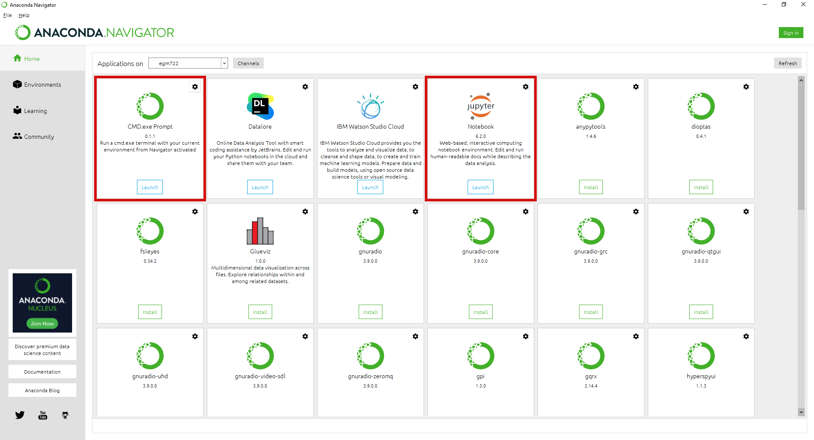
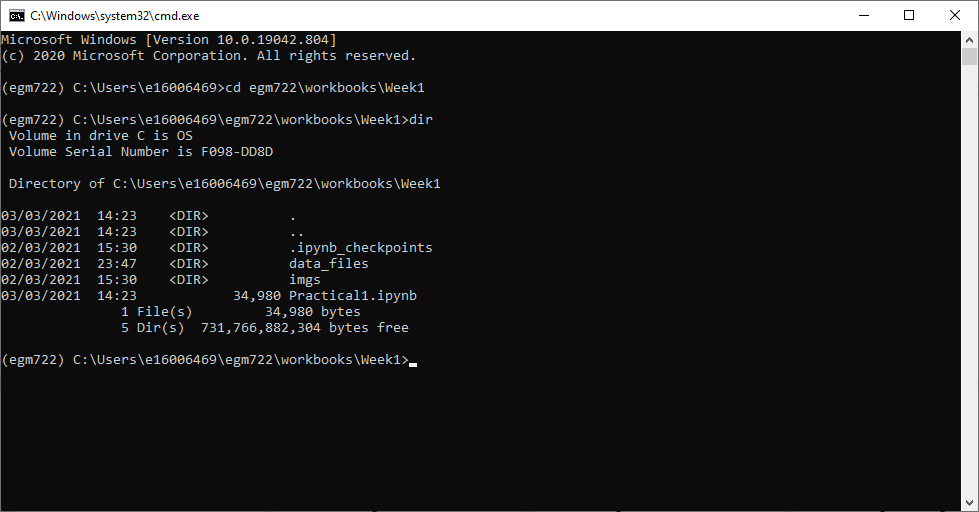
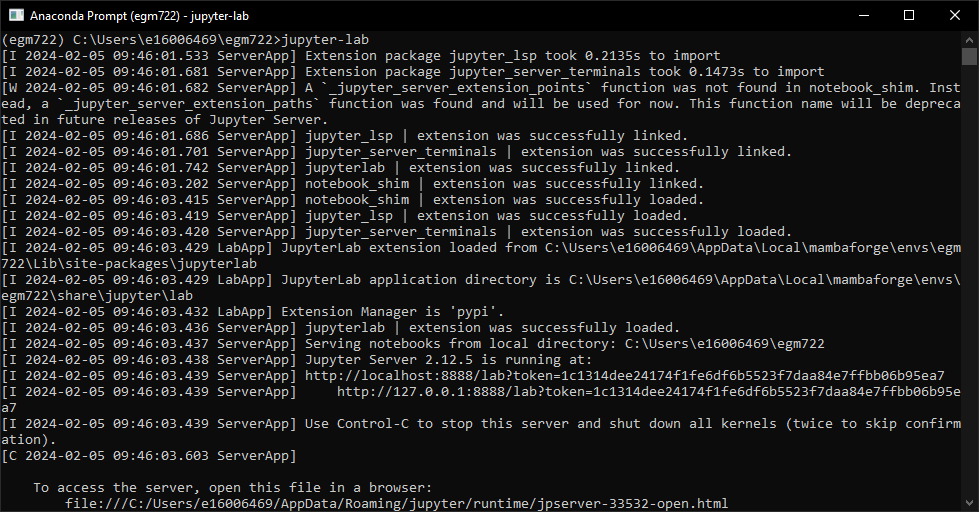
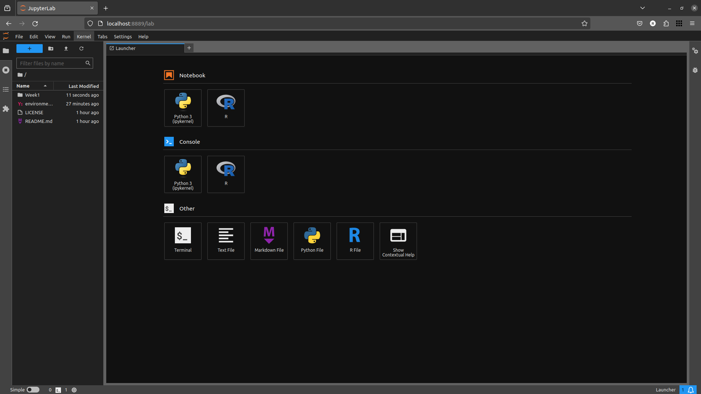
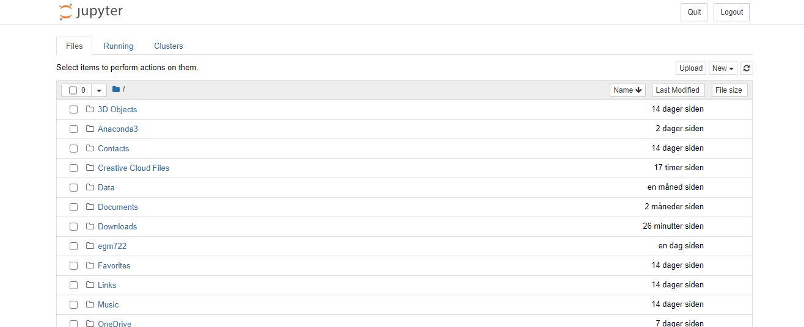
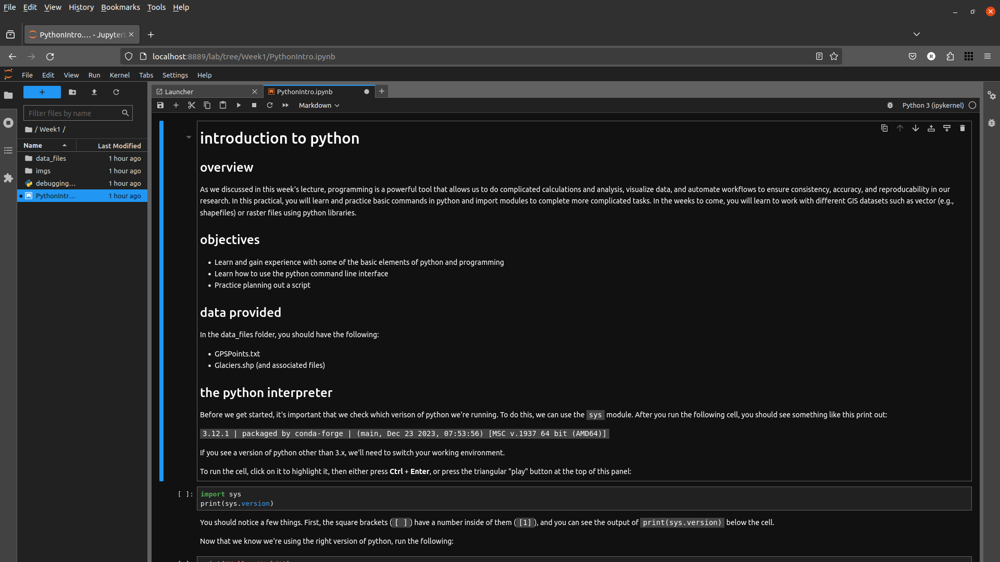
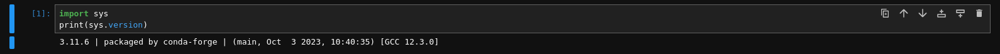
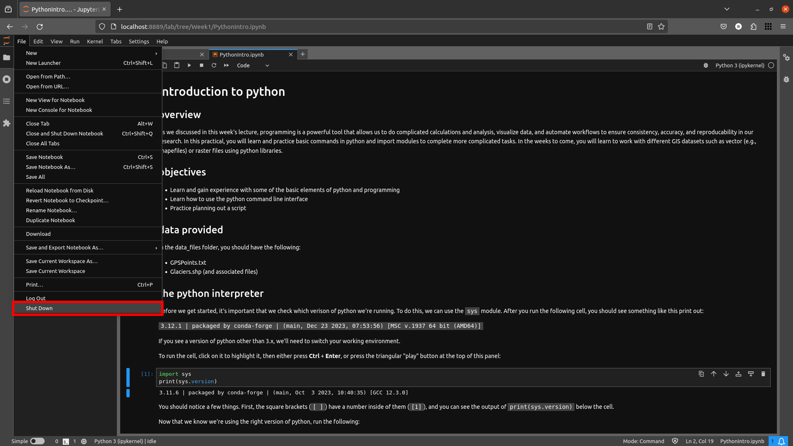
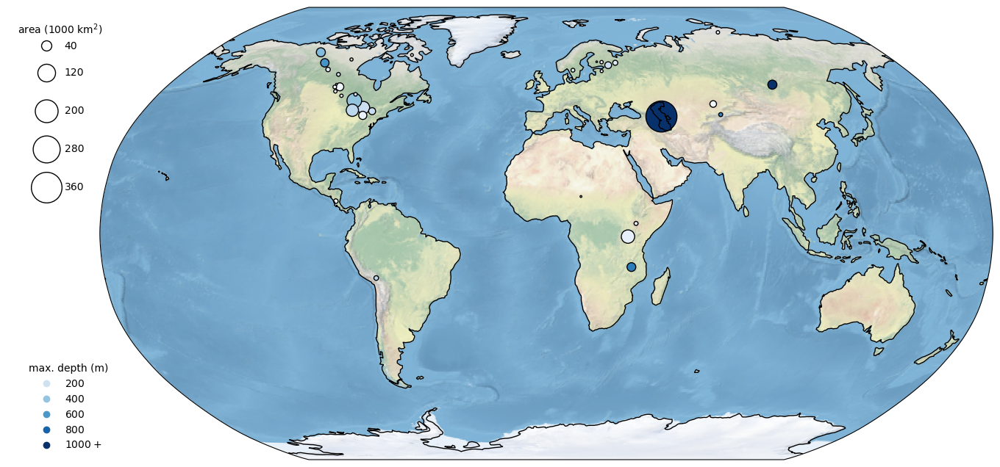

intro to python
================

To get started in the world of programming using python, we will use `Jupyter Notebooks <https://jupyter.org/>`__ within
a Jupyter Lab environment, which provide a way for creating and sharing documents that have interactive code snippets
alongside narrative text, images, and more.

Getting Started
----------------

.. warning::

    Make sure that you have installed **all** of the preliminary steps before continuing - you should already have
    installed **Anaconda** and **git**.

    You should also have forked the course repository and cloned it to your computer. If **any** of these steps sound
    unfamiliar, stop now and go back over the :doc:`setup instructions<../setup/index>`.

To start, open **Anaconda Navigator** and ensure that your environment is set to the ``egm722`` environment created
during the preliminary setup (you should see "Applications on **egm722**" at the top of the window).

To open Jupyter Lab, we can **either** launch the **CMD.exe Prompt**, or launch Jupyter Lab directly from Anaconda
Navigator:

|br| I will provide instructions below for both methods; **you will only need to do one of them**.

Method 1: Command Prompt
^^^^^^^^^^^^^^^^^^^^^^^^^

When you launch the command prompt, it will start in the directory where you have installed Anaconda (most likely
``C:\Users\YourUserName``). Navigate to the directory where you have cloned the EGM722 repository.

Remember that from the command prompt, you can change directories using the **cd** command. For example, if I have cloned
the directory to ``C:\Users\bob\egm722\``, to get to that folder I would type:

.. code-block:: text

    cd C:\Users\bob\egm722

You can also see the contents of the current director using the **dir** command – you should see a file called **PythonIntro.ipynb** as
well as two folders, **data_files** and **imgs**:

|br| From this folder, type ``jupyter-lab`` at the prompt and press **Enter**. You should see the jupyter-lab app
begin running:

|br| Followed by a browser window opening up:

|br| At this point, skip to the next section (:ref:`Opening the Notebook`).

Method 2: Launch Jupyter Lab directly
^^^^^^^^^^^^^^^^^^^^^^^^^^^^^^^^^^^^^^^^^^^^

When you launch Jupyter Notebooks directly from **Anaconda Navigator**, a browser window will open:

|br| The file browser will begin in the directory where you have installed Anaconda (most likely
``C:\Users\YourUserName``). You will need to navigate to the folder where you have cloned the EGM722 repository by
following the links. Navigate to the Week1 folder. Once there, you should see the following:

.. _opening the notebook:

Opening the Notebook
--------------------

Open the Practical 1 notebook by double-clicking on the **Week1** folder, then double-clicking **PythonIntro.ipynb**. This
will open the following browser tab (or window):

|br| You can now work through the notebook, reading the text and running the individual code cells. To run a cell, you
can click on it to highlight it, then press **CTRL + Enter**, or by clicking the triangular **Run** button at the top
of the window.

When the cell has finished running, you should see a number inside the square brackets on the left-hand side. You may
also see the output text produced by the commands (assuming that they have produced anything):

|br|

.. warning::

    Be sure to read the text and any comments **carefully**: not every cell is ready to run automatically, and you may
    need to type in your own code before the cell is ready to run.

    Make sure to work through the notebook **sequentially**, as well – some of the cells require that a previous cell
    has been run; if it hasn’t, it will most likely throw an ``Error`` or an ``Exception``.

Clearing the Outputs
--------------------

If you would like to start over, you can clear the outputs of individual cells from the menus at the top of the page:
**Cell** > **Current Outputs** > **Clear**. You can also do this for all of the outputs at one time.

To completely restart the session, you can restart the python *kernel* – the python interpreter program that Jupyter
Notebooks is running "under the hood (or bonnet)" to provide the interactive code. To do this, from the **Kernel** menu,
you can select **Restart**, or **Restart & Clear Output**.

Closing the Notebook
--------------------

Once you have worked your way through the notebook and are confident that you understand what is being asked, you can
close the notebook. Note that closing the browser tab will not actually stop the notebook from running – to do this,
you have to select **Shutdown** from the **File** menu in the upper left-hand corner of the window:

|br| Close the browser window, and (if you launched Jupyter Lab from the **Command Prompt**), close the
**Command Prompt** window.

Next steps: Introduction to git
--------------------------------

We’ll be sprinkling uses of git throughout the work in this module, but you might also find it useful to work through
some examples to get more familiar with it. I highly recommend the tutorial provided by (Learn Git Branching
`<https://learngitbranching.js.org/>`__), which is a free online resource to help you get started with some of the
basics of using git for version control.

You don’t have to do this all at once – the website should "remember" and keep track of your progress – but if you have
some extra time in the first week, the first 4 lessons under **Introduction to Git Commits** should provide you with a
good footing for the next weeks.

.. note::
    
    Below this point is the **non-interactive** text of the notebook. To actually run the notebook, you'll need to follow the instructions
    above to open the notebook and run it on your own computer!

....

Nicholas Sparks
------------------

overview
^^^^^^^^^

As we discussed in this week’s lecture, programming is a powerful tool
that allows us to do complicated calculations and analysis, visualize
data, and automate workflows to ensure consistency, accuracy, and
reproducability in our research. In this practical, you will learn and
practice basic commands in python and import modules to complete more
complicated tasks. In the weeks to come, you will learn to work with
different GIS datasets such as vector (e.g., shapefiles) or raster files
using python libraries.

objectives
^^^^^^^^^^^

-  Learn and gain experience with some of the basic elements of python
   and programming
-  Learn how to use the python command line interface
-  Practice planning out a script

data provided
^^^^^^^^^^^^^^

In the data_files folder, you should have the following:

- GPSPoints.txt
- Glaciers.shp (and associated files)

the python interpreter
^^^^^^^^^^^^^^^^^^^^^^^

Before we get started, it’s important that we check which verison of
python we’re running. To do this, we can use the ``sys`` module. After
you run the following cell, you should see something like this print
out:

``3.12.1 | packaged by conda-forge | (main, Dec 23 2023, 07:53:56) [MSC v.1937 64 bit (AMD64)]``

If you see a version of python other than 3.x, we’ll need to switch your
working environment.

To run the cell, click on it to highlight it, then either press **Ctrl**
+ **Enter**, or press the triangular “play” button at the top of this
panel:

.. code:: ipython3

    import sys
    print(sys.version)

You should notice a few things. First, the square brackets (``[ ]``)
have a number inside of them (``[1]``), and you can see the output of
``print(sys.version)`` below the cell.

Now that we know we’re using the right version of python, run the
following:

.. code:: ipython3

    print("Hello, World!")

The ``print()`` **function**
(`documentation <https://docs.python.org/3/library/functions.html#print>`__)
allows us to print messages and information to the screen, or to a file
(more on this later), but it doesn’t allow us to save the messages that
we display. To do this, we first have to create an **object** using the
**assignment operator**, ``=``:

.. code:: python

   foo = 'a message'

This will assign the value ``'a message'`` to a new object, ``foo``.

In the cell below, type a line of code that will define a new
**object**, ``foo``, that stores the message ``Hello, World!``. Then,
print the message to the screen using the **variable** name you’ve just
defined:

.. code:: ipython3

    # assign an object/variable using =
    print() # print the value of the object to the screen using print

Often, you will want to know how to use a particular function. To get
help, we can use the built-in ``help()`` function
(`documentation <https://docs.python.org/3/library/functions.html#help>`__).

For example, to get more information on how to use the ``print()``
function:

.. code:: ipython3

    help(print)

This tells you the different *positional arguments* to ``print()`` (such
as ``value``), the *optional keyword arguments* (such as ``file`` or
``sep``), as well as what ``print()`` does (“Prints the values to a
stream, or to sys.stdout by default”).

In jupyter/ipython, you can also use the ``?`` operator:

.. code:: ipython3

    print?

This is a lot of information for now, but if you want to know how to use
a particular function, method, or class, you can find that help here.

A warning, however: some python packages are better-documented than
others (which is why we should always provide thorough documentation
when writing our own code, right?)

objects and variables
^^^^^^^^^^^^^^^^^^^^^^

We have already seen one example of an **object**, ``foo`` (the
**variable** name), above. Objects store temporary information that can
be manipulated or changed as we type commands or run scripts.

One important thing to remember is that the *name* of an **object** is
*case-sensitive* (meaning that ``foo`` is different from ``Foo``):

.. code:: ipython3

    print(Foo) # this won't work, because we haven't created an object called Foo yet

We’ll see more examples of error messages later (and how to interpret
them), but hopefully the message:

.. code:: pytb

       NameError: name 'Foo' is not defined

is clear enough. Because we were expecting this error message, we can
ignore it and move on for now.

As we covered in this week’s lecture, in python, variable names can
consist of letters, digits, or underscores, but they **cannot** begin
with a digit. If you try to name a **variable** using an illegal name,
you will get a ``SyntaxError``:

.. code:: ipython3

    3var = "this won't work"

Here, we see a ``SyntaxError`` raised - this means that the code we have
written violates the *syntax* (grammar) of the language. We’ll look more
at different error types in the debugging exercise later on.

numeric operations
^^^^^^^^^^^^^^^^^^^

A large part of what we will use python for is the manipulation of
numeric data. Thus, it is a good idea for us to understand how python
treats numeric data. In the cell below, we first define two objects,
``x`` and ``y``, and assign then values of 2 and 3, respectively.

Before you run the cell, look at the print statements - these will show
which operators are being used (``+``, ``-``, ``*``, etc.), along with
the output of the operation using the variables ``x`` and ``y``. Think
about what you exect the results to be - when you run the cell, do the
outputs match your expectation? Why or why not?

.. code:: ipython3

    x = 2
    y = 3

    print(f"x + y = {(x+y)}") # print the value of x + y (addition)
    print(f"x - y = {(x-y)}") # print the value of x - y (subtraction)
    print(f"x * y = {(x*y)}") # print the value of x * y (multiplication)
    print(f"x / y = {(x/y)}") # print the value of x / y (division)
    print(f"x // y = {(x//y)}") # print the value of x // y (floor division)
    print(f"x ** y = {(x**y)}") # print the value of x ** y (exponentiation)
    print(f"x % y = {(x%y)}") # print the value of x % y (modular division)
    print(f"x ^ y = {(x^y)}") # print the value of x ^ y (bitwise XOR)

Most of these should be fairly straightforward, except perhaps for the
last two (``%`` and ``^``). The ``%`` (“modular” operator) returns the
remainder of dividing two numbers. The ``^`` (“bitwise XOR” or “bitwise
exclusive or”) does something a little more involved - for more
information about bitwise operators in general, see this `Wikipedia
article <https://en.wikipedia.org/wiki/Bitwise_operation#Bitwise_operators>`__.

Note also how we’re using ``print()`` here, with a “`formatted string
literal <https://docs.python.org/3/tutorial/inputoutput.html#tut-f-strings>`__”
(or “**f-String**”, ``f"{}"``). By prefixing the string with the letter
``f``, we can include the value of an expression inside the string,
using the ``{ }`` operators. We’ll look at more examples of how to use
these later on, including how we can format numbers inside of strings.

string objects and operations
^^^^^^^^^^^^^^^^^^^^^^^^^^^^^^^

We have already worked with one example of a **str**\ ing object,
``foo``. As noted in the lecture, we can easily access parts of a string
by using the desired index inside square brackets ``[ ]``. Remember that
the index starts from 0, and it has to be an **int**\ eger value:

.. code:: ipython3

    foo[0]

If we use a **float**\ ing point value, it raises a ``TypeError``:

.. code:: ipython3

    foo[0.0] # slice indices have to be integers, not floats!

As an additional example, to get the 3rd character in ``foo``, we would
type ``foo[2]`` at the prompt and press ENTER:

.. code:: ipython3

    foo[2] # get the 3rd character in foo

Why does this give us the third character from ``foo``? Well, remember
that the first element of a **str** (or any sequence; more on that
later) has an index of 0 - so, the third element has an index of 2.

To access the last element of a **str** (or a sequence), we could count
up all of the elements of the **str** and subtract one (remember that we
start counting at 0, not 1), but python gives us an easier way:
**negative indexing**. Negative indexing starts from the end of the
string (after all of the

Thus, to get the last element of ``foo``, we can type ``foo[-1]``. To
get the second-to-last element, we could type ``foo[-2]``, and so on:

.. code:: ipython3

    foo[-1] # get the last character in myString

If we want to access more than one element of the string, we can use
multiple indices, with the basic form of:

.. code:: python

   sliced = myString[first:last]

This will select the letters of the string starting at index ``first``
up to, **but not including**, ``last``.

This is also called **slicing**. Before running the cell below, think
about what the result should be. Does it match your expectation?

.. code:: ipython3

    foo[1:5]

If we want to find an element in a string, we can use the
helpfully-named built-in function (or method) ``find()``. For example,
typing ``foo.find('W')`` will return the index of the letter ``W``:

.. code:: ipython3

    foo.find('W') # find the index of the character W in myString

Note that if a given letter (or pattern) occurs more than once,
``.find()`` will only tell us the index of the *first* occurrence:

.. code:: ipython3

    foo.find('l') # will tell us the index of the first

Have a look at the
`documentation <https://docs.python.org/3/library/stdtypes.html#string-methods>`__
for ``str`` to see if you can find a method that will give you the index
of the *last* occurrence of a pattern in a string, then use that in the
cell below to find the index of the last ``l``:

.. code:: ipython3

    # insert your code to find the index of the last l here

If the pattern isn’t found in the string, ``find()`` returns a value of
``-1``:

.. code:: ipython3

    foo.find('a') # what will this return?

As you can see from the documentation linked above, **str** objects have
a wide range of methods available. We won’t go through these in detail,
but we will make use of more of them over the remainder of this class.

Finally, we’ll look at some of the operators that we can use with
**str** objects. Although we can’t subtract or divide strings, we do
have two operators at our disposal: ``+`` (concatenation) and ``*``
(repeated concatenation).

Before running the cell below, what do you expect will be stored in each
variable below? Does the result match what you expected?

-  ``newString = "Hello" + "World!"``
-  ``repString = "Hello" * 5``

.. code:: ipython3

    newString = "Hello" + "World!"
    repString = "Hello" * 5

    print(f'newString is: {new_string}')
    print(f'repString is: {rep_string}')

lists
^^^^^^

**list**\ s are an incredibly powerful and versatile data type we can
use in python to store a sequence of values.

Any other data type can be inserted into a **list**, including other
**list**\ s. Run the following cell to see how we can create a new
**list** object:

.. code:: ipython3

    fruits = ["Apple", "Banana", "Melon", "Grapes", "Raspberries"]
    print(fruits)

Like with **str** objects, we can access and manipulate **list** objects
using indexing and slicing techniques, in much the same way.

Can you write a command below to ``print()`` ‘Grapes’ by using the
corresponding index from ``fruits``?

.. code:: ipython3

    print() #insert the correct command inside the ()

If we want to access more than one element of a list, we can slice the
list, using the same syntax as with the ``myString`` examples above.

What do you think will print when you run the cell below?

.. code:: ipython3

    fruits[2:-1] # think about what this output will look like

What about this cell?

.. code:: ipython3

    fruits[2:-1][0] # what will this show?

and finally, what about this?

.. code:: ipython3

    fruits[2:-1][0][-1]

As you can see from the examples above, while indexing a **list**
returns the value of a single element, a **list** slice is itself a
**list**. This difference is subtle, but important to remember.

classes, functions and methods
^^^^^^^^^^^^^^^^^^^^^^^^^^^^^^^

In programming, a **function** is essentially a short program that we
can use to perform a specific action.

Functions take in **parameters** in the form of **arguments**, and
(often, but not always) return a result, or otherwise perform an action.

Parameters can be **positional** (in other words, the order they are
given matters), or they can be **keyword** (i.e., you specify the
argument with the parameter name, in the form ``parameter=value``).

Python has a number of built-in functions for us to - we have already
seen a few examples such as ``print()`` and ``help()``. As another
example, instead of typing ``2 ** 8`` earlier, we could instead have
typed ``pow(2,8)``:

.. code:: ipython3

    print('using the ** operator: {}'.format(2**8))
    print('using the pow() function: {}'.format(pow(2, 8)))

Here, we are calling the function ``pow()`` and supplying the
**positional** arguments ``2`` and ``8``. The result returned is the
same, ``256`` (or 28), but the approach used is different.

If you want to see a list of **built-in** functions and classes in
python, have a look at the python
`documentation <https://docs.python.org/3/library/functions.html>`__.

Alternatively, you can type ``print(dir(__builtins__))`` (note the two
underscores on either side of **builtins**):

.. code:: ipython3

    print(dir(__builtins__)) # show a list of all of the builtin functions

While it may not be completely clear at first what each of these things
are, remember that we can use the ``help()`` **function** to get more
information.

For example, one very useful built-in **class** is ``range``
(`documentation <https://docs.python.org/3/library/stdtypes.html#range>`__).

To create a new **range** object, we call it like we would a function:

.. code:: python

   range(stop)
   range([start,] stop [,step])

“Under the hood”, so to speak, this is actually calling the
**\__init\_\_()** method of the **class**, which is the **function**
that python uses to *initialize*, or create, a new object.

Note that ``range()`` takes between one and three arguments:

-  ``range(stop)`` creates a **range** object that will “count” from 0
   up to (**but not including**) ``stop``, incrementing by 1.
-  ``range(start, stop)`` creates a **range** object that will “count”
   from ``start`` up to (**but not including**) ``stop``, incrementing
   by 1.
-  ``range(start, stop, step)`` creates a **range** object that will
   “count” from ``start`` to (**but not including**) ``stop``,
   incrementing by ``step``.

To pass multiple parameters to a function, we separate each parameter by
a comma.

In the cell below, write a statement that returns a list of numbers
counting from a ``start`` of 10 to 0 (inclusive).

.. code:: ipython3

    for ii in range(start, stop, step): # modify this to print out a list of numbers 10, 9, 8, ... 0.
        print(ii)

A **method** is a type of **function** that acts directly on an object -
we have seen examples of this already with ``str.find()``. In general,
methods are called just like functions - the general syntax is
``object.method(arguments)``.

For example, **str** objects have a **method**, ``.count()``
`documentation <https://docs.python.org/3/library/stdtypes.html#str.split>`__,
which counts the number of times a character (or substring) occurs in
the **str**.

If you type ``topic = "Geographic Information Systems"`` into the
interpreter, what would you expect the result of ``topic.count("i")`` to
be? What about ``topic.count("s")``?

.. code:: ipython3

    topic = "Geographic Information Systems"
    print(topic.count("i"))
    print(topic.count("s"))

Another powerful **str** method is ``str.split()``, which returns a
**list** of the given **str**, split into substrings based on the
delimeter provided as an argument:

.. code:: ipython3

    help(topic.split)

From this, we can see that if we call ``topic.split()`` without any
arguments at all, it will split ``topic`` based on any whitespace and
discard any *empty* strings.

That is, if we have multiple spaces in our string, it will treat those
as a single space:

.. code:: ipython3

    singlespace = 'Geographic Information Systems'
    multispace = 'Geographic   Information  Systems'

    print(singlespace.split())
    print(multispace.split())

If we want to specify a single space character (``' '``), though, the
result will change:

.. code:: ipython3

    print(singlespace.split(' ')) # split on a single space
    print(multispace.split(' ')) # split on a single space

Using ``str.split()`` and an additional method to change all of the
letters in the **str** to *lower* -case, can you get the following
result in the cell below?

.. code:: python

   ['remote ', 'en', 'ing and geographic information ', 'y', 'tem', '']

.. code:: ipython3

    topic = 'Remote Sensing and Geographic Information Systems'
    print(topic.split('s')) # edit this line to get the result shown above

defining our own functions
^^^^^^^^^^^^^^^^^^^^^^^^^^^

Often, we will want to define our own **function**\ s. Using functions
has many benefits, including: \* improving readability, \* eliminating
repetitive code, \* allowing for easier debugging of a program, \* and
even allowing us to re-use code in other scripts/programs.

Defining a **function** in python is quite easy.

We begin the definition with a ``def`` **statement** that includes the
function name and all parameters (this first line is called the
**header**). The header must end with a colon (``:``):

.. code:: python

   def cat_twice(str1, str2):

The **body** of the function (i.e., the set of instructions that make up
the function) are *indented* - like other forms of flow control in
python, once the interpreter sees a non-indented line, it marks the end
of the function:

.. code:: python

   def cat_twice(str1, str2):
      cat = str1 + str2
      print(cat) # this is part of the function
      print(cat) # this is part of the function

   # this is no longer part of the function

To help illustrate this, let’s define a function for calculating the
area of a circle. Mathematically, this is a function of the radius of
the circle - equal to the constant pi multiplied by the radius squared.
Run the cell below to create the new function, and then test it:

.. code:: ipython3

    from math import pi # import the constant pi from the math module

    def circle_area(radius):
        area = pi * radius ** 2 # calculate the area of the circle using the radius argument
        return area # use return to get a value back from the function

    circle_area(10) # get the area of a circle with radius 10 (should be 314.15926 ...)

Remember that if we want to return something from a function, we use a
``return`` **statement**, followed by the variable(s) that we want to
return:

.. code:: python

   def cat_twice_return(str1, str2):
       cat = str1 + str2
       print(cat)
       print(cat)
       return cat

In the cell below, I’ve started two more functions for calculating the
surface area and volume of a sphere. For each function, fill in the code
that will return the correct result, then confirm that your function
output matches the values shown in the comment on each line.

.. code:: ipython3

    def sphere_area(radius):
        # your code goes here!

    def sphere_volume(radius)
        # your code goes here!

    print(sphere_area(10)) # get the surface area of a sphere with radius 10 (should be 1256.637)
    print(sphere_volume(10)) # get the volume of a sphere with radius 10 (should be 4188.79)

controlling flow
^^^^^^^^^^^^^^^^^

Some of the most important uses that we’ll have for programming are
repeating tasks and executing different code based on some condition.
For example, we might want to loop through a list of files and run a
series of commands on each file, or apply an analysis only if the right
conditions are met.

In python, we can use the ``while``, ``for``, and ``if`` operators to
control the flow of our programs.

For example, given a number, we might want to check whether the value is
positive, negative, or zero, and perform a different action based on
which condition is ``True``:

.. code:: ipython3

    def pos_neg_zero(x): # a function to tell us whether a number is positive, negative, or 0
        if x > 0: # if x > 0, print that it is positive
            print(f'{x} is a positive number')
        elif x < 0: # if x < 0, print that it is negative
            print(f'{x} is a negative number')
        else: # if
            print(f'{x} is zero')

Here, we take in a number, ``x``, and execute code based on whether
``x`` is positive, negative, or zero.

Like the header of a function, an ``if`` **statement** has to be
terminated with a colon (``:``).

If we have multiple options, we can use an ``elif`` **statement**. There
isn’t a limit to the number of ``elif`` statements we can use, but note
that the order matters - once a condition is evaluated as ``True``, the
indented code is executed and the whole block is exited.

For this reason, an ``else`` **statement** is optional, but it must
always be last (since it automatically evaluates as ``True``).

Run the cell below to see how the output of the function changes based
on the input:

.. code:: ipython3

    pos_neg_zero(-1) # a negative number
    pos_neg_zero(1) # a positive number
    pos_neg_zero(False) # a weird one

Note that in the example above, ``False`` has evaluated as being equal
to zero. This is because in python, **bool** (“Boolean”) objects
(``True`` and ``False``) are subclasses of **int**, and ``False`` has a
value of ``0``, while ``True`` has a value of ``1``. For more on how
python tests for truth values, see the
`documentation <https://docs.python.org/3/library/stdtypes.html#truth-value-testing>`__.

Now, in the cell below, write your own function that takes in two
arguments ``x`` and ``y``, and prints different output depending on
which of the two numbers is larger:

.. code:: ipython3

    def which_is_greater(x, y):
        pass # replace this line with your code

Next, test your function by running the cell below - you should see “2
is greater than 1” printed in the first line, and “10 is less than 100”
in the second:

.. code:: ipython3

    which_is_greater(2, 1) # say which is greater, 2 or 1
    which_is_greater(10, 100) # say which is greater, 10 or 100

In addition to conditional flow, we might also want to repeat actions.
For example, we can write a simple function that counts down to some
event, then announces the arrival of that event.

We could define this function using a ``while`` loop, making sure to
update a variable in each step:

.. code:: ipython3

    def countdown(n):
        while n > 0:
            print(n)
            n -= 1 # note that this is the same as n = n - 1
        print("Blastoff!")

    countdown(5)

Note the importance of updating the variable that we are testing in the
loop. If we remove the ``n -= 1`` line, our function will never stop
running (an **infinite loop**).

``while`` loops are useful for actions without a pre-defined number of
repetitions. We could just as easily re-define ``countdown()`` using a
``for`` loop, using something else we’ve seen before:

.. code:: ipython3

    def countdown_for(n):
        for ii in range(n, 0, -1):
            print(ii)
        print("Blastoff!")

    countdown_for(5) # run the function to count down from 5

This version uses ``range`` to iterate from ``n`` to 1 in increments of
-1, printing the value of ``i`` each time - that is, we leave ``n``
unchanged.

We can also use the ``break`` statement to **break** out of a loop:

.. code:: ipython3

    def break_example(n):
        # prints values from n to 1, then Blastoff!
        while True:  # here, the loop will always run
        # unless we reach a condition
        # that breaks out of it:
            if n <= 0:
                break
            print(n)
            n -= 1
        print("Blastoff!")

    break_example(5) # run the function to count down from 5

or the ``continue`` statement to continue to the next step of a loop:

.. code:: ipython3

    def continue_example(n):
        # given an integer, n, prints the values from 0 to n that are even.
        for x in range(n):
            if x % 2 == 1:
                continue
            print('{} is even'.format(x))

    continue_example(10) # print the even integers from 0 to 9 (remember that range(n) is not inclusive!)

Using the information above, write a function that will print the values
from 1 to an integer ``n`` that are even, unless those values are also
divisible by 3 **or** 4:

.. code:: ipython3

    def evenNoThreesorFours(n):
        # given an integer n, prints values from 1 to n that are even, unless they are divisible by 3 or 4.
        for x in range(1, n):
            pass # your code goes here

(*Hint: remember that you can use the ``%`` operator to determine
whether one number is divisble by another*).

importing modules
^^^^^^^^^^^^^^^^^^

Modules provide a convenient way to package functions and object
classes, and load these items when needed. This also means that we only
end up loading the functionality that we need, which helps save on
memory and other resources.

We have already imported one such module, the ``sys`` module, and above
where we imported ``pi`` from the ``math`` module. Note that when we
used ``from``, we *only* imported the attribute ``pi`` - this means that
we don’t have access to any of the other functions, classes, or
attributes within the ``math`` module - only ``pi``.

When we import the entire module, we can access the attributes, classes,
functions, etc. using a ``.``:

.. code:: ipython3

    import math # import the entire math module

    print(math.pi) # print the value of math.pi

When we specifically name the things we want to import, we only have
access to those things - importing ``pi`` from ``math`` does not also
import ``floor`` - hence, the error message when you run the cell below:

.. code:: ipython3

    print(f'math.floor(10.19) is equal to: {math.floor(10.19)}') # print the output of math.floor(10.19)
    print(f'floor(10.19) is equal to:      {floor(10.19)}') # print the output of floor(10.19)

To import multiple things from a single module, you can separate them by
commas:

.. code:: ipython3

    from math import pi, floor, sin, cos, tan # import pi, floor, sin, cos, and tan from math

example: working with shapefiles
^^^^^^^^^^^^^^^^^^^^^^^^^^^^^^^^^

When using vector data in this course, we will primarily work with
``geopandas`` (`documentation <http://geopandas.org/>`__), “an open
source project to make working with geospatial data in python easier.”

To work with the provided shapefile (``data_files/Glaciers.shp``), we
first have to **import** ``geopandas`` and load the data using
``geopandas.read_file()``:

.. code:: ipython3

    import geopandas as gpd
    glacier_data = gpd.read_file('data_files/Glaciers.shp')

Note that in the cell above, we’re using an *alias* when we **import**
``geopandas``:

.. code:: python

   import geopandas as gpd

This means that instead of having to write ``geopandas`` every time we
want to use a **method** or **class** from the ``geopandas`` package, we
instead type ``gpd``. You will most likely see this syntax a lot - it’s
mostly used to make the code easier to read (or out of laziness).

a note on filepaths
~~~~~~~~~~~~~~~~~~~

On Windows computers, filepaths are separated using ``\``. For example,
on my Windows machine, this notebook file has the following path:

::

   C:\Users\bob\egm722\Week1\Practical1.ipynb

This is a problem in python, because ``\`` is a protected character –
specifically, it’s either used as a line continuation to split a string
over multiple lines:

.. code:: python

   >>> mystring = 'this is a string that is split ' + \
   ...            'over multiple lines'
   >>> print(mystring)
   this is a string that is split over multiple lines

Inside of a string, ``\`` *escapes* the next character - effectively, it
makes the interpreter change how it processes it:

.. code:: python

   >>> not_escaped = 'this isn't going to work'
     File "<stdin>", line 1
       not_escaped = 'this isn't going to work'
                               ^
   SyntaxError: invalid syntax

In the example above, the single quote in “isn’t” actually ends the
**str** - because mashing a string (``'this isn'``) and something else
(``t going to work'``) doesn’t work, python raises a ``SyntaxError``.

But, we can use ``\`` to make python see that the single quote in the
middle of the **str** should be treated as part of the **str**:

.. code:: python

   >>> escaped = 'this isn\'t going to cause a problem.'
   >>> print(escaped)
   this isn't going to cause a problem.

What this means is that when we’re working with Windows paths in python,
we have to do something competely different. When writing paths as
**str** objects, there are three main options:

1. replace ``\`` with ``/``:
   ``C:/Users/bob/egm722/Week1/Practical1.ipynb``
2. *escape* the ``\`` chracter:
   ``C:\\Users\\bob\\egm722\\Week1\\Practical1.ipynb``
3. use a **raw string literal** by appending ``r`` before the start of
   the **str**: ``r'C:\Users\bob\egm722\Week1\Practical1.ipynb'``

Option 1. has the advantage of working on multiple platforms. As an
example, the *relative* path:

.. code:: python

   'data_files/Glaciers.shp'

will work on Windows, MacOS, and linux systems. Later in this module, we
will see how we can use both the ``os``
(`documentation <https://docs.python.org/3/library/os.html>`__) and
``pathlib``
(`documentation <https://docs.python.org/3/library/pathlib.html>`__)
modules to work with filepaths; if we’re using python 3.4 or newer, the
module provides an even nicer way of working with filepaths.

working with GeoDataFrames
~~~~~~~~~~~~~~~~~~~~~~~~~~

Back to working with shapefile data. First, let’s use ``.head()`` to
have a look at the first few rows of data in our shapefile:

.. code:: ipython3

    glacier_data.head() # show the first 5 rows of the table

Note that the data are stored in a table (a **GeoDataFrame**), much like
the attribute table in ArcMap. One small difference is the additional
column, ``geometry``, which stores the geometry for each feature (in
this case, a ``polygon``).

One thing that we might be interested in, is the number of features
stored in our dataset. Within a script, the best way to do this is by
using the ``shape`` of the **GeoDataFrame**, which prints out the size
of the **GeoDataFrame** in (rows, columns):

.. code:: ipython3

    rows, cols = glacier_data.shape # get the number of rows, columns in the table
    print('Number of features: {}'.format(rows))

We can also use the ``len()`` built-in to print out the number of rows:

.. code:: ipython3

    print('Number of features: {}'.format(len(glacier_data))) # should give us the same as before

We can also perform calculations on the data, get statistics, etc. Many
of these are built-in methods that can be called on an individual
column.

We can access individual columns in two ways. We’ll stick with the
“normal” way for now, but we’ll revisit the other method later on in
another lab. The normal way is by indexing with the column name (i.e.,
``dataframe['column_name']``).

If we want to see what columns are available in the data table, we can
look at the ``columns`` **attribute** of the table:

.. code:: ipython3

    glacier_data.columns # see the names of the columns in our table

There are quite a few columns here, and most of them aren’t so important
for now. We might be interested in working with the **AREA** column,
though, to find out more about the size of glaciers in our study region.
For example, to find the average glacier area in our dataset, we could
type the following:

.. code:: ipython3

    glacier_data['AREA'].mean() # get the mean value of the AREA column

This gives us the average area in square kilometers (the units of the
column). What if, for some unfathomable reason, we wanted the glacier
areas to be stored in square feet? We could do this by updating the
column directly:

.. code:: ipython3

    glacier_data['AREA'] = glacier_data['AREA'] * 1e6 * 3.2808399 * 3.2808399 # km2 x m2/km2 X ft/m x ft/m
    glacier_data['AREA'].mean()

But, just in case we didn’t want to lose the sensible units, we could
also have created a new column:

.. code:: ipython3

    glacier_data['AREA_SQKM'] = glacier_data['AREA'] / 1e6 / 3.2808399 / 3.2808399  # the reverse of the above
    glacier_data['AREA_SQKM'].mean()

example: converting text data into shapefiles
^^^^^^^^^^^^^^^^^^^^^^^^^^^^^^^^^^^^^^^^^^^^^^

Another useful package we’ll make use of is ``pandas``
(`documentation <https://pandas.pydata.org/>`__), a powerful data
analysis package that provides the basis for ``geopandas`` (as you
perhaps guessed by the name). In this example, we’ll take a Comma
Separated Value (**CSV**) file representing data about lakes from around
the world, and convert this into a shapefile that we can load into
ArcGIS, QGIS, or other GIS software.

First, let’s import the necessary modules and load the data:

.. code:: ipython3

    import pandas as pd
    import geopandas as gpd
    from shapely.geometry import Point

    df = pd.read_csv('data_files/GPSPoints.txt')

Like we did with the ``geopandas`` data above, let’s have a look at the
``DataFrame`` we’ve just loaded:

.. code:: ipython3

    df.head()

Here, we see a number of lake names, with accompanying data such as the
lake area (presumably in square kilometers?), the maximum depth (missing
for some lakes), Lat/Lon information, and so on.

A ``GeoDataFrame`` can hold lots of different data, but it absolutely
must have a column that specifies the geometry of the features in the
table. Given that we only have point information (a single Lat/Lon
coordinate) for each lake, it makes sense to create a ``Point`` object
for each feature using that point.

One way that we can do this by first using the python built-in **zip**,
then the **apply** method of the ``DataFrame`` to create a point object
from the list of coordinates.

.. code:: ipython3

    df['geometry'] = list(zip(df['lon'], df['lat'])) # zip is an iterator, so we use list to create
                                                     # something that pandas can use.
    df['geometry'] = df['geometry'].apply(Point) # using the 'apply' method of the dataframe,
                                                 # turn the coordinates column
                                                 # into points (instead of a tuple of lat, lon coordinates).
                                                 # NB: Point takes (x, y) coordinates

Let’s look at the ``DataFrame`` again. We should have a ``geometry``
column, with the lat/lon coordinates for each feature:

.. code:: ipython3

    df

We could simply create a ``GeoDataFrame`` from this ``DataFrame``, but
let’s first remove a few extra columns from the table:

.. code:: ipython3

    del df['lat'], df['lon'] # we don't really need these, since they're in the 'geometry' column now

Next, let’s change the units of the ``area`` column to be in square
meters (assuming that they are currently in square kilometers):

.. code:: ipython3

    df['area'] # modify this cell to convert the area column to square meters here

Now we can create a new ``GeoDataFrame`` from the ``DataFrame``:

.. code:: ipython3

    gdf = gpd.GeoDataFrame(df)

We also want to remember to set the spatial reference information, so
that our GIS software knows what reference frame our data use. For this,
we’ll use the EPSG code representing WGS84 Lat/Lon, 4326. EPSG codes are
a concise way to refer to a given reference system - more information
about them (and a comprehensive list of codes) can be found
`here <http://spatialreference.org/>`__.

.. code:: ipython3

    gdf = gdf.set_crs("EPSG:4326") # this sets the coordinate reference system to epsg:4326, wgs84 lat/lon

Let’s take another look at the ``GeoDataFrame``:

.. code:: ipython3

    gdf

Finally, let’s save the ``GeoDataFrame`` as a shapefile, which you can
open in your GIS software of choice:

.. code:: ipython3

    gdf.to_file('lake_points.shp')

Load your shapefile into a GIS software package such as ArcGIS Pro or
QGIS - does everything look right? If not, go back through the steps and
see if you can find where you went wrong.

Can you make a map that looks like this one below in your GIS software
of choice? Give it a try!

By the end of the module, you should be able to put together a map like
this using python.

|br| Obviously, this is only a beginning, but hopefully you’ve gotten a taste
for what we can do with python. Feel free to explore more, read through
some documentation, and ask questions.
