raster data using rasterio
===========================

In this practical, you’ll gain some more experience working with raster data in python using rasterio and numpy. We
will also learn about opening and closing files using python, as well as using ``*args`` and ``**kwargs`` to add more
flexibility to our function definitions.

The practical this week is provided as a Jupyter Notebook, which you can use to interactively work through the
different steps of the practical. An exercise, introduced at the end of the Notebook file, can be completed using the
file **assignment_script.py**.

Getting Started
---------------

:doc:`Last week<vector>`, we saw how we can use the command-line interface (CLI) of **git** to merge two branches (in this case,
``week3`` into ``main``). This week, we're going to see how to do this on GitHub, using a **Pull Request**.

First, head over to your EGM722 GitHub repository (:samp:`https://github.com/<{your_username}>/egm722`).

By now, you should have merged the ``week2`` and ``week3`` branches, so your ``main`` branch should look like this:

.. image:: ../../../img/egm722/week3/week3_remote.png
    :width: 720
    :align: center
    :alt: the main branch of the github repository, with the merged changes for weeks 1-3

|br| Like we saw last week, we can confirm that there aren't any changes in to the **upstream** ``week4`` branch
by switching to the ``week4`` branch:

.. note::

    If you don't see "This branch is up to date with iamdonovan:week4", you can **fetch** the upstream changes by
    clicking the dropdown menu:

    .. image:: ../../../img/egm722/week4/fetch_upstream.png
        :width: 600
        :align: center
        :alt: the fetch upstream button highlighted

There are a number of different ways to actually open a **Pull Request**. From the ``branches`` page
(:samp:`https://github.com/<{your_username}>/egm722/branches`), you can open a **Pull Request** for a
specific branch by clicking the button next to that branch:

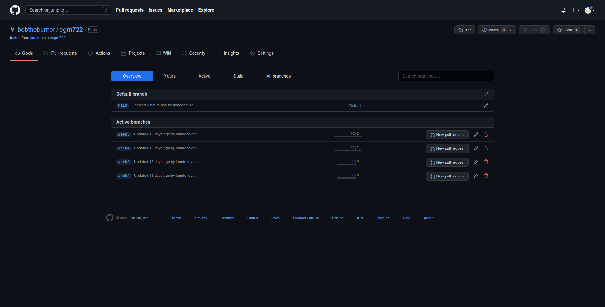

|br| Otherwise, you can click on the **Pull Requests** tab:

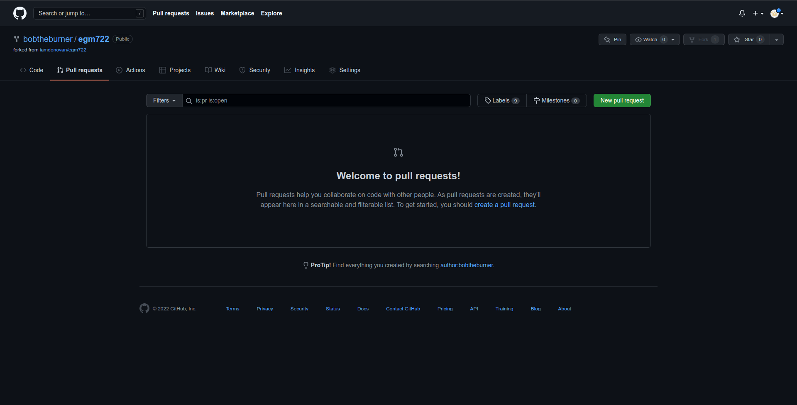

|br| and click on the green **New pull request** button to start a new pull request:

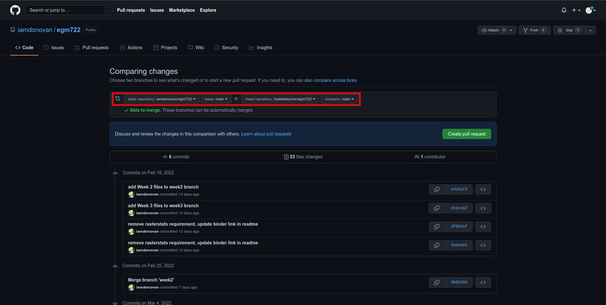

|br| Note that the default behavior may be to try to **merge** from your fork into the **upstream** repository,
so make sure that you're attempting to merge the correct branches. You'll need to change the branch that you're
merging into to :samp:`<{your_username}>/egm722:main`, and the branch that you're merging from to
:samp:`<{your_username}>/egm722:week4`. It should look like this:

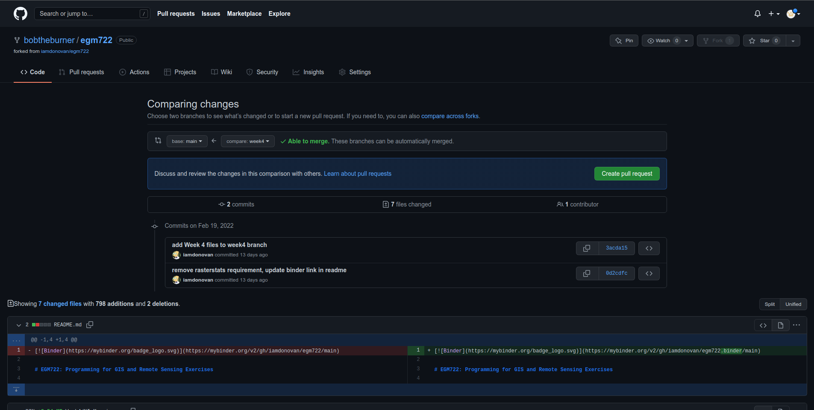

|br| Once you've done this, scroll down to see the comparison showing which files have changed:

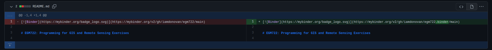

|br| Here, deletions are shown on the left, while additions are shown on the right. For each file that has changed
(either because it's being added, or because it has been modified), you can see the summary of the changes in 
the upper left of each entry.

For this file, **README.md**, there have been 2 changes: 1 deletion and 1 addition (note that the current version may
be slightly different).

Most of the changes that you see should be additions, since most of the files are only present on the ``week4`` branch.

Once you've had a look at the comparison for the different files, you can click on the green **Create pull request** 
button, which will take you to the following page:

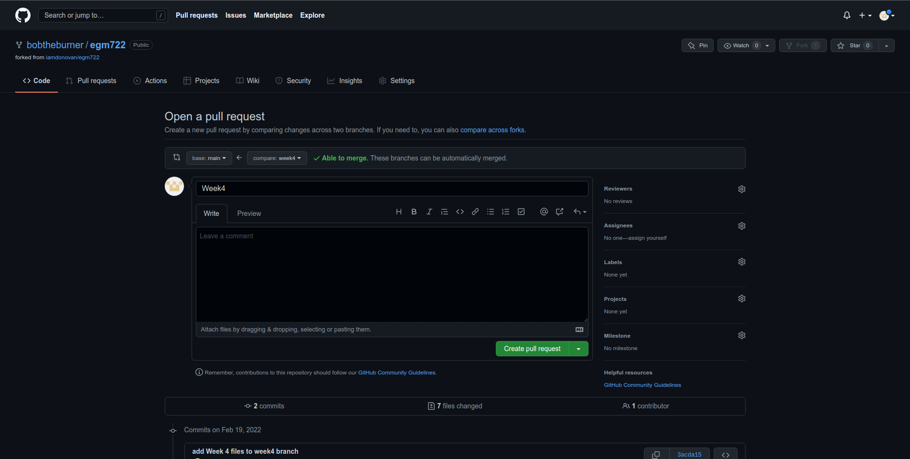

|br| Depending on the project and repository settings, the pull request might need to be reviewed by others before
it can be approved. The **Message** field above allows you to explain what the proposed changes are and why they
should be approved. 

Since you're only making a change on your repository, you can leave this blank (though it's
good practice to explain what you're doing in case you ever have to review what you've done -- future you will
thank you...). 

Once you've written the message, you can press the **Create pull request** button. As long as there aren't 
**conflicting** changes (lines that have been changed in both branches), you should be able
to **merge** the pull request by clicking the **Merge pull request** button:

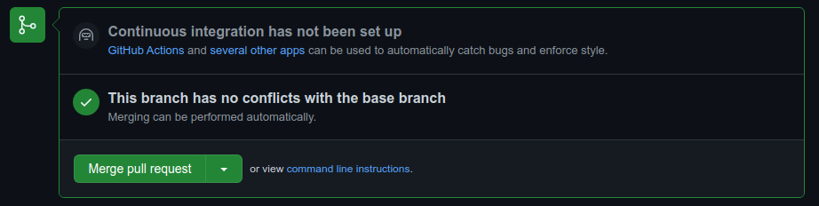

|br| You should then see the following screen, indicating that the two branches have been successfully merged:

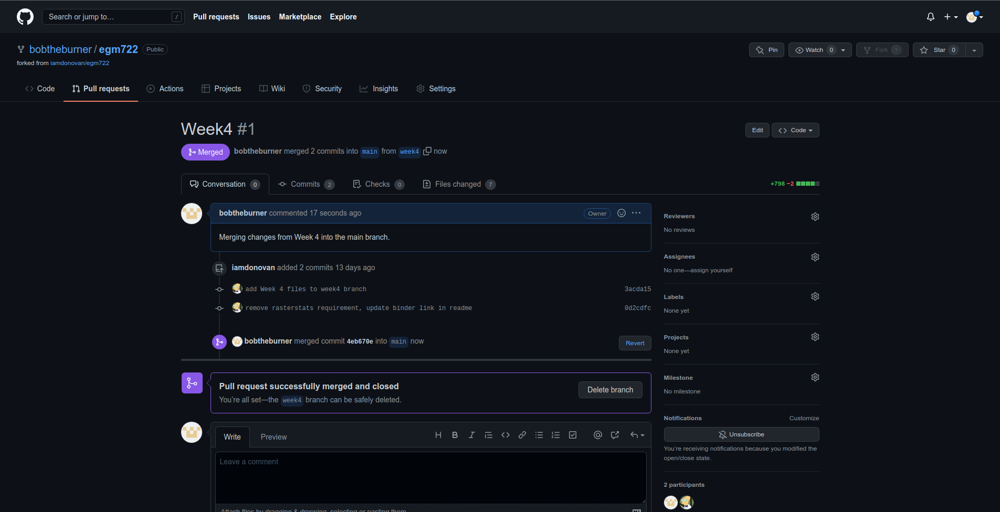

|br| If you head back to the main repository page, you should see that the changes have been merged:

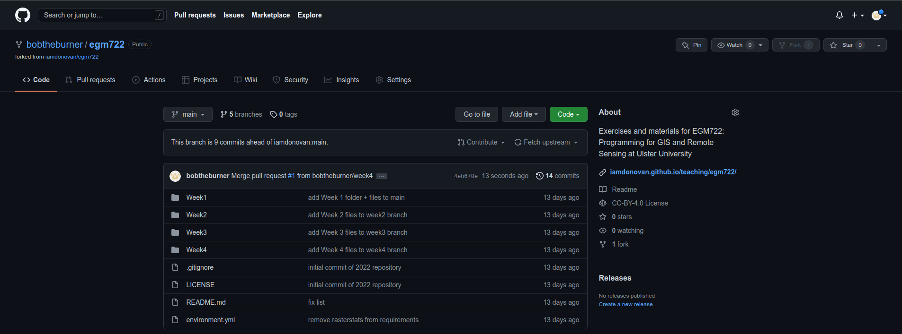

|br| Now, on your computer, you can **pull** the changes to your machine using either **GitHub Desktop** or the
command line:

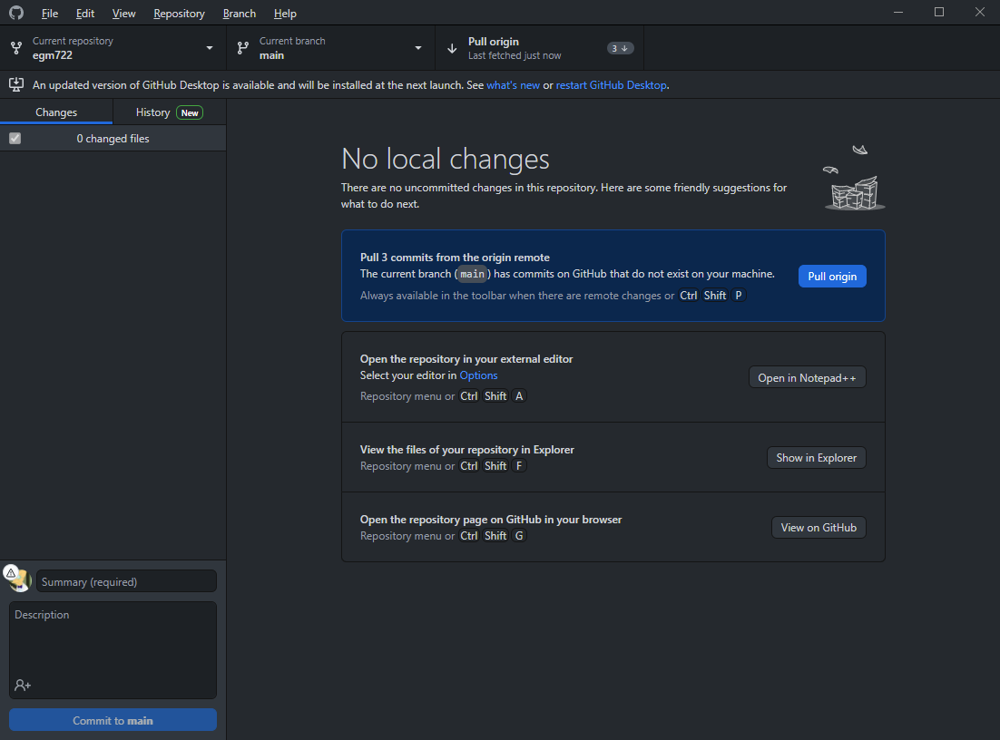

|br| At this point, you can launch Jupyter Notebooks as you have in the previous weeks, and begin to work through
the practical exercise.

.. note::
    
    Below this point is the **non-interactive** text of the notebook. To actually run the notebook, you'll need to
    follow the instructions above to open the notebook and run it on your own computer!

....

James Garner
--------------

overview
^^^^^^^^^

Up to now, you have gained some experience working with basic features
of python, used cartopy and matplotlib to create a map, and explored
using shapely and geopandas to work with vector data. In this week’s
practical, we’ll be looking at working with raster data using rasterio
and numpy.

objectives
^^^^^^^^^^^

-  Learn about opening and viewing raster data using rasterio and
   cartopy
-  Become familiar with opening files using a ``with`` statement
-  Use ``*`` and ``**`` to unpack arguments in a function
-  Use rasterio to reproject raster data

data provided
^^^^^^^^^^^^^^

In the **data_files** folder, you should have the following files: -
NI_mosaic.tif

getting started
^^^^^^^^^^^^^^^^

In this practical, we’ll be working with **raster data**. As a quick
refresher, raster data are gridded datasets that contain anything from
aerial and satellite images to elevation, temperature, or classisfied
land cover. A raster is made up of pixels (or cells), where each pixel
value represents the dataset’s value at a given location.

To get started, run the following cell to import rasterio and
matplotlib.

.. code:: ipython3

    %matplotlib inline

    import numpy as np
    import rasterio as rio
    import cartopy.crs as ccrs
    import matplotlib.pyplot as plt

In the box below, we load the dataset using ``rio.open()``
(`documentation <https://rasterio.readthedocs.io/en/latest/api/rasterio.html#rasterio.open>`__),
then view some of the attributes of the dataset.

``rio.open()`` creates a **DatasetReader** object
(`documentation <https://rasterio.readthedocs.io/en/latest/api/rasterio.io.html#rasterio.io.DatasetReader>`__)
that we use to read the dataset and its attributes. When we do this, we
don’t actually load the full raster into memory - we just open the file
and read the metadata and other attributes. Later on, we’ll load the
raster into memory; for now, we’ll look at the different attributes of
the **DatasetReader** object.

For starters, the ``.name`` attribute is the filename for the dataset,
and the ``.mode`` refers to how the dataset has been opened (``r`` for
read, ``w`` for write, ``r+`` for read/write). We can also check how
many *layers*, or *bands*, the datset has using ``.count``, and check
the size of the image using ``.width`` and ``.height``. Finally, we can
see the different types of data (e.g., integer, floating point, etc.)
that each band has using ``.dtypes``:

.. code:: ipython3

    dataset = rio.open('data_files/NI_Mosaic.tif')

    print('{} opened in {} mode'.format(dataset.name,dataset.mode))
    print('image has {} band(s)'.format(dataset.count))
    print('image size (width, height): {} x {}'.format(dataset.width, dataset.height))
    print('band 1 dataype is {}'.format(dataset.dtypes[0])) # note that the band name (Band 1) differs from the list index [0]

We can also look at the georeferencing information for the dataset. The
``.bounds`` attribute gives locations for the left, bottom, right, and
top sides of the image:

.. code:: ipython3

    print(dataset.bounds)

Note that these values are in the coordinate reference system (CRS) of
the dataset, which we can view using the ``.crs`` attribute - just like
we have seen already with **GeoDataFrame** objects:

.. code:: ipython3

    print(dataset.crs)

You should hopefully see that this dataset has a CRS of **EPSG:32629**,
which corresponds to WGS84 UTM Zone 29N.

Finally, the ``.transform`` of a dataset is a 3x3 affine transformation
matrix:

.. code:: ipython3

    print(dataset.transform)

The maps pixel locations to real-world coordinates. The matrix has the
following form:

::

   | a b c |
   | d e f |
   | g h i |

where:

-  *a* corresponds to the pixel width;
-  *b* is the row rotation (normally 0);
-  *c* is the x coordinate of the upper-left corner of the image;
-  *d* is the column rotation (normally 0);
-  *e* is the pixel height;
-  *f* is the y coordinate of the upper-left corner of the image;
-  *g*
-  *h*
-  *i*

loading the data
^^^^^^^^^^^^^^^^^

To load the data, we use the ``.read()`` method
(`documentation <https://rasterio.readthedocs.io/en/latest/api/rasterio.io.html#rasterio.io.DatasetReader.read>`__)
of the **DatasetReader** object. This returns a
`numpy <https://numpy.org/doc/stable/>`__ **array**
(`documentation <https://numpy.org/doc/stable/reference/arrays.html>`__):

.. code:: ipython3

    img = dataset.read()

By default, ``.read()`` will load all of the bands associated with the
dataset. To load specific bands, we can pass individual indices, or a
list of indices, that we want to load (e.g., ``dataset.read(1)`` to load
the first band or ``dataset.read([1, 2])`` to load the first 2 bands).

Note that when we pass indices to the ``.read()`` method, we start
indexing from 1, rather than 0. This is not the case for the array that
is returned, however - here, the indices start from 0 (because
``python``).

This can be confusing, so it’s important to pay attention to what kind
of object you are working with when you start indexing.

.. code:: ipython3

    print(img.shape) # returns a tuple with the number of image bands bands, image height, and image width.
    print(img[7]) # will return an IndexError, because while there are 7 bands, the indices range from 0 to 6.

If we want to get a specific pixel value from the raster, we can index
the array just like we would a **list** or **tuple**.

For example, to get the value of the center pixel in Band 1, we can do
the following. For the arrays that we are using, the first index
corresponds to the band (if there’s more than one band), the second
index (first index if there’s only one band) corresponds to the row (y)
location, and the third (second) index corresponds to the column (x)
location:

.. code:: ipython3

    print(img[0, dataset.height // 2, dataset.width // 2]) # note that // performs floor division, as indices have to be integers

Using the **DatasetReader** object, we can also find the pixel indices
corresponding to spatial locations, and vice-versa, using both the
``.index()`` method
(`documentation <https://rasterio.readthedocs.io/en/latest/api/rasterio.io.html#rasterio.io.DatasetReader.index>`__)
and the ``.transform`` attribute.

Note that the spatial locations should be in the same CRS as the image
transform - if they are not, the image indices returned might not make
sense:

.. code:: ipython3

    centeri, centerj = dataset.height // 2, dataset.width // 2 # note that centeri corresponds to the row, and centerj the column
    centerx, centery = dataset.transform * (centerj, centeri) # note the reversal here, from i,j to j,i
    print(dataset.index(centerx, centery)) # show the indices that correspond to our x,y values
    print((centeri, centerj) == dataset.index(centerx, centery)) # check that these are the same

If we don’t want to load the whole image at once, we can also choose a
``window`` using ``.read()``. The format for this is a **tuple** of
**tuples** corresponding to the top/bottom indices and left/right
indices of the window. We can combine this with ``.index()`` to load a
subset of the image based on spatial location (for example, using a
vector dataset).

Here, we can select a 1 km window around the center pixel:

.. code:: ipython3

    top, lft = dataset.index(centerx-500, centery+500)
    bot, rgt = dataset.index(centerx+500, centery-500)

    subset = dataset.read(window=((top, bot), (lft, rgt))) # format is (top, bottom), (left, right)

the with statement
^^^^^^^^^^^^^^^^^^^

Run the cell below to show the current status of our **DatasetReader**
object:

.. code:: ipython3

    dataset # show the current status of the dataset object

Here, we can see that the file is ``open``, with a mode ``r`` indicating
that we’re able to read the contents of the file on the disk.

Once we are done with the file (either reading, writing, appending, or
whatever it happens to be), we have to remember to *close* the file
using the ``.close()`` method:

.. code:: ipython3

    dataset.close() # remember to close the dataset once we've read in what we need

Now, when we look at the current status of the **DatasetReader** object,
we should see a change:

.. code:: ipython3

    dataset # show the current status of the dataset object

Now, the file is ``closed``, and if we try to read any additional
attributes from it, we can’t:

.. code:: ipython3

    dataset.read() # will return a RasterioIOError, because the dataset is closed

In python, we use the built-in ``open()`` function
(`documentation <https://docs.python.org/3/library/functions.html#open>`__)
to open files on the disk, in almost exactly the same way that
``rasterio.open()`` works. This allows us to work with the contents of
the file - but, we always have to remember to close the file (using the
``.close()`` method) when we are done with it - otherwise, we may `run
into trouble later on <https://stackoverflow.com/a/25070939>`__.

.. code:: python

   f = open('my_file.txt', 'w')
   ...
   f.close()

However, sometimes things happen. For example, an exception might be
raised, or the interpreter might crash, and the file might `stay
open <https://askubuntu.com/a/701536>`__.

One way that we can handle opening/closing files without having to
remember to explicitly close them is using a ``with`` statement:

.. code:: python

   with open('my_file.txt', 'w') as f:
       ...

This works exactly the same as what’s written above - within the
``with`` statement, we can use the variable ``f`` exactly as we would in
the other example. As soon as the python interpreter reaches the end of
the ``with`` block, it closes the file so that we don’t have to remember
to do this.

In the cell below, we can re-open the dataset, extract the different
attributes that we will need for the next few exercises, and then close
the file:

.. code:: ipython3

    with rio.open('data_files/NI_Mosaic.tif') as dataset:
        img = dataset.read()
        xmin, ymin, xmax, ymax = dataset.bounds

You should see that ``dataset`` is once again a ``closed``
**DatasetReader** object, even though we didn’t explicitly close it
after opening it this time:

.. code:: ipython3

    dataset # show the current status of the dataset object

displaying raster data using matplotlib and cartopy
^^^^^^^^^^^^^^^^^^^^^^^^^^^^^^^^^^^^^^^^^^^^^^^^^^^^

Now that we’ve loaded our image, we can use ``cartopy`` and
``matplotlib`` to display it, just like we did for mapping vector data
in Weeks 2 and 3.

To start, we’ll create a new cartopy **CRS** object
(`documentation <https://scitools.org.uk/cartopy/docs/latest//reference/generated/cartopy.crs.CRS.html>`__),
and use this to create a ``matplotlib`` **Figure** and **Axes** objects
using ``matplotlib.pyplot.subplots()``
(`documentation <https://matplotlib.org/stable/api/_as_gen/matplotlib.pyplot.subplots.html>`__):

.. code:: ipython3

    ni_utm = ccrs.UTM(29) # note that this matches with the CRS of our image
    fig, ax = plt.subplots(1, 1, figsize=(10, 10), subplot_kw=dict(projection=ni_utm))

Now, we will use ``ax.imshow()``
(`documentation <https://matplotlib.org/stable/api/_as_gen/matplotlib.axes.Axes.imshow.html>`__)
to display a single band from our image.

We’ll use the
`Landsat <https://www.usgs.gov/faqs/what-are-band-designations-landsat-satellites?qt-news_science_products=0#qt-news_science_products>`__
Near Infrared band - for our image, which is based on Landsat 5 TM
images, this is Band 4 (which means that this corresponds to index 3 of
our ``bands`` **array**):

.. code:: ipython3

    ax.imshow(img[3], cmap='gray', vmin=200, vmax=5000) # display band 4 as a grayscale image, stretched between 200 and 5000
    ax.set_extent([xmin, xmax, ymin, ymax], crs=ni_utm) # set the extent to the image boundary

    fig # show the figure

As you can see from the link above, ``imshow()`` has a number of
arguments that we can use to display our image. As we are using only a
single band, we can set the minimum (``vmin``) and maximum (``vmax``)
values of the image to stretch the display to, as well as what colormap
to use (``cmap``). For more information about colormaps, you can check
out `this
tutorial <https://matplotlib.org/stable/tutorials/colors/colormaps.html>`__,
as well as a recent
`paper <https://www.nature.com/articles/s41467-020-19160-7>`__ on the
(mis)use of color in science.

But, notice what happens when we use ``ax.set_extent()``
(`documentation <https://scitools.org.uk/cartopy/docs/latest//reference/generated/cartopy.mpl.geoaxes.GeoAxes.html#cartopy.mpl.geoaxes.GeoAxes.set_extent>`__)
to set the image extent - our image is nowhere to be seen!

By default, ``ax.imshow()`` uses the row/column indices of the image,
rather than the geographic or projected coordinates of the raster. This
means that we have to tell ``ax.imshow()`` both the ``tranform`` (CRS)
to use, as well as the ``extent`` of the image, in order for it to
display correctly.

Run the cell below - this time, you should see the image displayed in
the correct location on the map after we set the **Axes** extents.

.. code:: ipython3

    ax.imshow(img[3], cmap='gray', vmin=200, vmax=5000, transform=ni_utm, extent=[xmin, xmax, ymin, ymax])
    ax.set_extent([xmin, xmax, ymin, ymax], crs=ni_utm) # set the extent to the image boundary

    fig

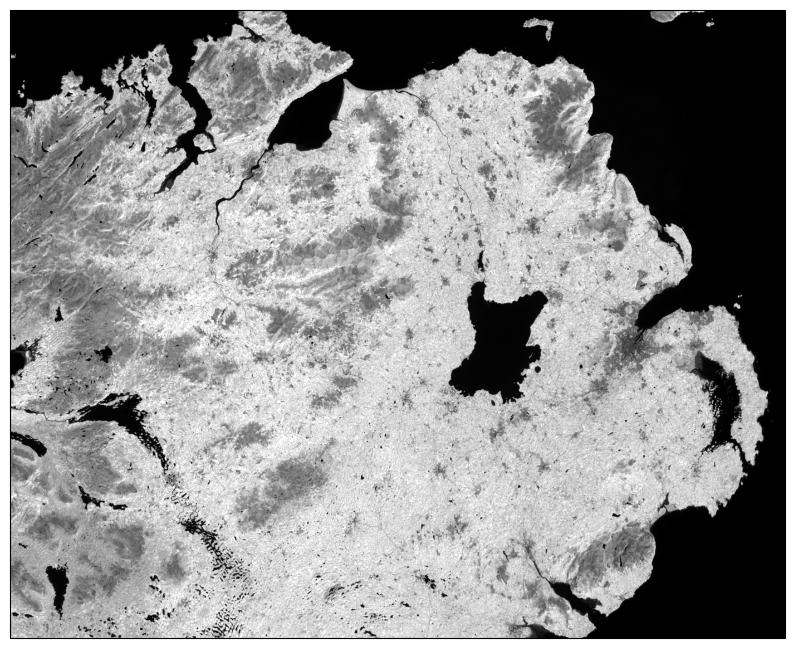

This is not the only way that we can display images, however. We can
also display them as RGB color composites. Try the following code, which
*should* display the first three bands of the image:

.. code:: ipython3

    ax.imshow(img[0:3], transform=ni_utm, extent=[xmin, xmax, ymin, ymax])

    fig

So that didn’t work - we get a **TypeError** with the following message:

::

   TypeError: Invalid shape (3, 1500, 1850) for image data

Remember that ``dataset.read()`` loaded the raster as a raster with
three dimensions:

-  dimension 1: the bands
-  dimension 2: the rows
-  dimension 3: the columns

But, ``ax.imshow()`` expects that the image indices are in the order
(rows, columns, bands). From the documentation, we also see that:

::

   X: array-like or PIL image
       The image data. Supported array shapes are:

       (M, N): an image with scalar data. The values are mapped to colors using normalization and a colormap.
           See parameters norm, cmap, vmin, vmax.
       (M, N, 3): an image with RGB values (0-1 float or 0-255 int).
       (M, N, 4): an image with RGBA values (0-1 float or 0-255 int), i.e. including transparency.
       The first two dimensions (M, N) define the rows and columns of the image.

       Out-of-range RGB(A) values are clipped.

So, to show an RGB image, we also need to scale our image to have values
between 0-1 (or 0-255).

Now, we could try do this each and every time that we want to display an
image, but this makes for unreadable code and also increases the
likelihood that we will make a mistake writing our code.

In other words, this is a perfect place to write a function:

.. code:: ipython3

    def img_display(image, ax, bands, transform, extent):
        '''
        This is where you should write a docstring.
        '''
        # first, we transpose the image to re-order the indices
        dispimg = image.transpose([1, 2, 0])

        # next, we have to scale the image.
        dispimg = dispimg / dispimg.max()

        # finally, we display the image
        handle = ax.imshow(dispimg[:, :, bands], transform=transform, extent=extent)

        return handle, ax

In this example, we first use the ``.transpose()``
(`documentation <https://numpy.org/doc/stable/reference/generated/numpy.transpose.html#numpy.transpose>`__)
method on our image **array** to re-order the indices. The order of the
indices in the argument here means that instead of the index order being
(``band``, ``row``, ``column``), the order will now be (``row``,
``column``, ``band``), which is what ``ax.imshow()`` is expecting.

Next, we scale the image using ``.max()``
(`documentation <https://numpy.org/doc/stable/reference/generated/numpy.max.html#numpy.max>`__)
so that the new values of ``dispimage`` range from 0 to 1.

Finally, we use ``ax.imshow()`` to display the image, using the
transform and extent passed to the function, before returning the values
of ``handle`` and ``ax``.

Run the cell below to apply this function - you should see an RGB image
of Landsat TM bands 3, 2, 1 (index 2, 1, 0), corresponding to “true
color”:

.. code:: ipython3

    h, ax = img_display(img, ax, [2, 1, 0], ni_utm, [xmin, xmax, ymin, ymax])
    fig # just to save you from scrolling back up to see

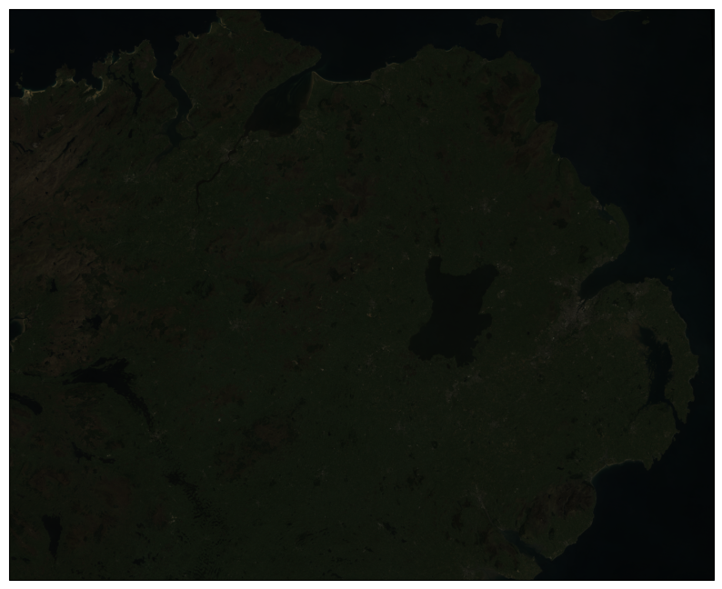

So that worked, but the image is very dark - this is because of the way
that we “normalized” the values to fall between 0 and 1, using the
maximum of all of the bands:

.. code:: ipython3

    maxvals = [img[ind].max() for ind in range(dataset.count)]
    print(maxvals)

From the code below, we see that not all of the bands have the same
range of values. Bands 1-3 have fairly low maximum values (2500-4100),
while Band 5 has the highest values of all, over twice as high as in
bands 1-3.

Rather than normalizing using the maximum value of all of the bands, we
might want to instead normalize based on the maximum value of a given
band. However, that might still result in dark or washed-out images,
depending on whether we have a few very bright pixels.

Let’s instead try a `percentile
stretch <https://theailearner.com/2019/01/30/contrast-stretching/>`__,
which should give a bit nicer results:

.. code:: ipython3

    def percentile_stretch(image, pmin=0., pmax=100.):
        '''
        This is where you should write a docstring.
        '''
        # here, we make sure that pmin < pmax, and that they are between 0, 100
        if not 0 <= pmin < pmax <= 100:
            raise ValueError('0 <= pmin < pmax <= 100')
        # here, we make sure that the image is only 2-dimensional
        if not image.ndim == 2:
            raise ValueError('Image can only have two dimensions (row, column)')

        minval = np.percentile(image, pmin)
        maxval = np.percentile(image, pmax)

        stretched = (image - minval) / (maxval - minval) # stretch the image to 0, 1
        stretched[image < minval] = 0 # set anything less than minval to the new minimum, 0.
        stretched[image > maxval] = 1 # set anything greater than maxval to the new maximum, 1.

        return stretched

Here, we have a few new things happening. In the function header, we
have two parameters, ``pmin`` and ``pmax``, that we provide default
values of 0 and 100, respectively:

.. code:: python

   def percentile_stretch(image, pmin=0, pmax=100):
       ...

We’ve seen this before, but it’s worth re-stating here that if we call
the function like this:

.. code:: python

       stretched = percentile_stretch(img)

It will use the default values for ``pmin`` and ``pmax``. Using default
values like this provides us a way to make sure that necessary
parameters are always set, without us always having to remember to set
them when we call a function.

Next, note the **conditional statement** at the beginning of the
function:

.. code:: python

       # here, we make sure that pmin < pmax, and that they are between 0, 100
       if not 0 <= pmin < pmax <= 100:
           raise ValueError('0 <= pmin < pmax <= 100')

This single statement checks the following things:

-  that ``pmin >= 0`` (because it’s a percentage),
-  that ``pmin < pmax`` (because min < max),
-  that ``pmax <= 100`` (again, because it’s a percentage).

If any of these things are not true, we ``raise``
(`documentation <https://docs.python.org/3/reference/simple_stmts.html#raise>`__)
a **ValueError**, with a message indicating what caused the error.

Next, we have another conditional statement to check that our image only
has two dimensions (i.e., that we are operating on a single band). To do
this, we check that the number of dimensions (``ndim``) is equal to 2 -
if it is not, we again ``raise`` a **ValueError**:

.. code:: python

       # here, we make sure that the image is only 2-dimensional
       if not image.ndim == 2:
           raise ValueError('Image can only have two dimensions (row, column)')

After that, we use ``np.percentile()``
(`documentation <https://numpy.org/doc/stable/reference/generated/numpy.percentile.html>`__)
to calculate the percentile value of the image for the values of
``pmin`` and ``pmax``:

.. code:: python

       minval = np.percentile(image, pmin)
       maxval = np.percentile(image, pmax)

Then, we stretch the image to values between 0 and 1:

.. code:: python

       stretched = (image - minval) / (maxval - minval) # stretch the image to 0, 1

and make sure to set any values below our minimum/maximum values to be
equal to 0 or 1, respectively:

.. code:: python

       stretched[image < minval] = 0 # set anything less than minval to the new minimum, 0.
       stretched[image > maxval] = 1 # set anything greater than maxval to the new maximum, 1.

Now, we should remember to update ``img_display()`` to use
``percentile_stretch()``, so that the when we run ``img_display()``
again it applies our percentile stretch:

.. code:: ipython3

    def img_display(image, ax, bands, transform, extent, pmin=0, pmax=100):
        '''
        This is where you should write a docstring.
        '''
        dispimg = image.copy().astype(np.float32) # make a copy of the original image,
        # but be sure to cast it as a floating-point image, rather than an integer

        for b in range(image.shape[0]): # loop over each band, stretching using percentile_stretch()
            dispimg[b] = percentile_stretch(image[b], pmin=pmin, pmax=pmax)

        # next, we transpose the image to re-order the indices
        dispimg = dispimg.transpose([1, 2, 0])

        # finally, we display the image
        handle = ax.imshow(dispimg[:, :, bands], transform=transform, extent=extent)

        return handle, ax

Now, run the new function, using a value of 0.1 for ``pmin`` and 99.9
for ``max`` (giving us a 99.8% stretch):

.. code:: ipython3

    h, ax = img_display(img, ax, [2, 1, 0], ni_utm, [xmin, xmax, ymin, ymax], pmin=0.1, pmax=99.9)
    fig # just to save you from scrolling back up to see

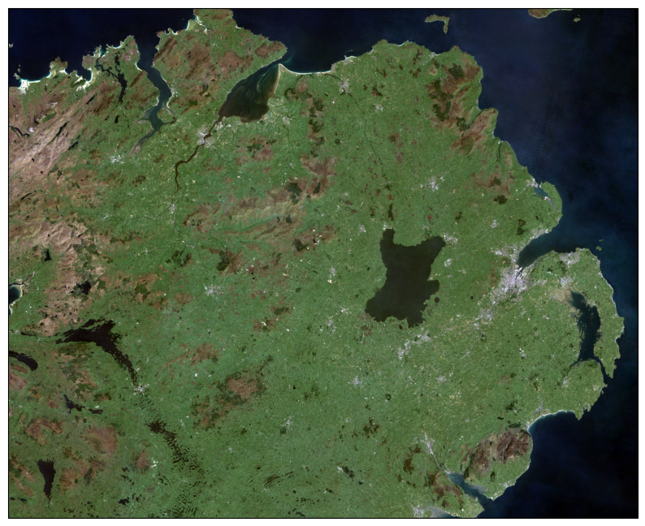

That looks much better - we can now see the image, it has good contrast,
and the image is displayed in the correct location on the map.

functions with \*args and \**kwargs
^^^^^^^^^^^^^^^^^^^^^^^^^^^^^^^^^^^^

At the moment, however, our function has a lot of extra
parameters/arguments:

.. code:: python

   def img_display(image, ax, bands, transform, extent, pmin=0, pmax=100):
       ...

Rather than explicitly specifying the transform and extent each time,
for example, we can change this to use the `unpacking
operators <https://realpython.com/python-kwargs-and-args/>`__, ``*`` and
``**``:

-  ``*`` is used to unpack iterables - for example, a **list** or
   **tuple**
-  ``**`` is used to unpack keyword arguments - for example, using a
   **dict**

Let’s re-write our ``img_display()`` function to make use of these -
first, by passing a **list** of percentile values to
``percentile_stretch()`` using ``*``, and then by passing a **dict** of
keyword arguments to pass to ``ax.imshow()`` using ``**``:

.. code:: ipython3

    def new_img_display(image, ax, bands, stretch_args=[0, 100], **imshow_args):
        '''
        This is where you should write a docstring.
        '''
        dispimg = image.copy().astype(np.float32) # make a copy of the original image,
        # but be sure to cast it as a floating-point image, rather than an integer

        for b in range(image.shape[0]): # loop over each band, stretching using percentile_stretch()
            dispimg[b] = percentile_stretch(image[b], *stretch_args) # pass the iterable stretch_args, but unpack them when calling percentile_stretch

        # next, we transpose the image to re-order the indices
        dispimg = dispimg.transpose([1, 2, 0])

        # finally, we display the image
        handle = ax.imshow(dispimg[:, :, bands], **imshow_args)

        return handle, ax

Now, create a **dict** called ``disp_kwargs`` with keys ``extent`` and
``transform``, using the values we passed to ``ax.imshow()`` previously.
We can also define ``stretch``, a **list** of percentile values to pass
to ``new_img_display()``:

.. code:: ipython3

    disp_kwargs = {'extent': [xmin, xmax, ymin, ymax],
                   'transform': ni_utm}

    stretch = [0.1, 99.9] # a list of percentile values

    h, ax = new_img_display(img, ax, [2, 1, 0], stretch_args=stretch, **disp_kwargs)
    fig

You should see that this is the same image as before - the only thing
that’s changed is how we call the function.

Feel free to try different stretch values, to see how it changes the
image. If you’re interested in learning more about Landsat `band
combinations <https://youtu.be/jc8NVHwjhlQ>`__ and `image
enhancement <https://youtu.be/LYVi7F4U8Eg>`__ in general, you are
welcome to watch the lecture videos provided by these links.

In the cell below, write some additional code to include gridlines for
the map - if you don’t remember how, check back to the Week 2 Cartopy
exercise to refresh your memory

.. code:: ipython3

    # write your code here!

reprojecting rasters using rasterio
^^^^^^^^^^^^^^^^^^^^^^^^^^^^^^^^^^^^

Fortunately, our image was provided in a geographic format that matches
what we’ve been working with (WGS84 UTM Zone 29N). But, what if we need
to have our image in a different format? In that case, we can use the
``rasterio.warp`` sub-module to reproject the image. The example below
comes directly from an example provided in the `rasterio
documentation <https://rasterio.readthedocs.io/en/latest/topics/reproject.html#reprojecting-a-geotiff-dataset>`__,
and it makes use of two concepts that we’ve introduced in this
practical: the ``with`` statement, ``*args``, and ``**kwargs``.

For more details about the different functions, such as
``rasterio.warp.calculate_default_transform()`` or
``rasterio.warp.reproject``, check out the
`documentation <https://rasterio.readthedocs.io/en/latest/api/rasterio.warp.html>`__.

The first part of this example:

.. code:: python

   with rio.open('data_files/NI_Mosaic.tif') as src:
       transform, width, height = rio.warp.calculate_default_transform(
               src.crs, dst_crs, src.width, src.height, *src.bounds)

opens the ``NI_Mosaic.tif`` file, and finds the new ``transform``,
``width``, and ``height`` attribute values for the reprojected (output)
raster.

Next, we copy the ``meta`` attribute, a ``dict`` object, from the source
dataset:

.. code:: python

       kwargs = src.meta.copy()

In order to match the output dataset, we use the ``.update()`` method
(`documentation <https://docs.python.org/3/library/stdtypes.html#dict.update>`__)
to change some of the attributes of the **dict** object before passing
it to ``rio.open()``:

.. code:: python

       kwargs.update({
           'crs': dst_crs,
           'transform': transform,
           'width': width,
           'height': height
       })

Finally, we open the new (reprojected) dataset, and reproject each band
from the source dataset to the output dataset, using a nearest-neighbor
resampling (``Resampling.nearest``):

.. code:: python

       with rio.open('data_files/NI_Mosaic_ITM.tif', 'w', **kwargs) as dst:
           for ind in range(1, src.count + 1): # ranging from 1 to the number of bands + 1
               rio.warp.reproject(
                   source=rio.band(src, ind),
                   destination=rio.band(dst, ind),
                   src_transform=src.transform,
                   src_crs=src.crs,
                   dst_transform=transform,
                   dst_crs=dst_crs,
                   resampling=rio.warp.Resampling.nearest)

Note that this example only reprojects the raster from one CRS to
another. If we wanted to, say, reproject the raster while also changing
the pixel size or cropping to a particular data frame, we would need to
calculate the new ``transform``, ``width``, and ``height`` values
accordingly.

.. code:: ipython3

    import rasterio.warp # note: we will be able to use rio.warp here, since we've previously imported rasterio as rio.
    dst_crs = 'epsg:2157' # irish transverse mercator EPSG code

    with rio.open('data_files/NI_Mosaic.tif') as src:
        transform, width, height = rio.warp.calculate_default_transform(
                src.crs, dst_crs, src.width, src.height, *src.bounds)
        kwargs = src.meta.copy() # this copies the meta dict object
        kwargs.update({
            'crs': dst_crs, # set the output crs
            'transform': transform, # set the output transform
            'width': width, # set the output width
            'height': height # set the output height
        }) # note: to change the values in a dictionary, we use the update() method

        with rio.open('data_files/NI_Mosaic_ITM.tif', 'w', **kwargs) as dst:
            for ind in range(1, src.count + 1): # ranging from 1 to the number of bands + 1
                rio.warp.reproject(
                    source=rio.band(src, ind),
                    destination=rio.band(dst, ind),
                    src_transform=src.transform,
                    src_crs=src.crs,
                    dst_transform=transform,
                    dst_crs=dst_crs,
                    resampling=rio.warp.Resampling.nearest)

next steps
^^^^^^^^^^^

For some additional practice with the concepts covered in this
practical, use the ``assignment_script.py`` file in the Week4 folder to
work on a script that combines the concepts we’ve used this week, as
well as some of the material from previous weeks, to produce a map that
overlays the county borders and town/city locations on the satellite
image provided.

For an additional challenge, try this: In the image below, notice how
the area outside of the county borders has been covered by a
semi-transparent overlay. Can you work out a way to do this? Check over
the ``import`` statements in ``assignment_script.py`` **carefully** -
there’s at least one import that we haven’t discussed yet, but it should
help point you in the right direction.

I’ll provide my example next week, but try to think about the different
steps involved and how you might solve this, using some of the examples
provided in previous weeks. Good luck!

.. figure:: ../../../img/egm722/week4/example_map.png
    :width: 720
    :align: center
    :alt: Example map for Week 4 assignment
