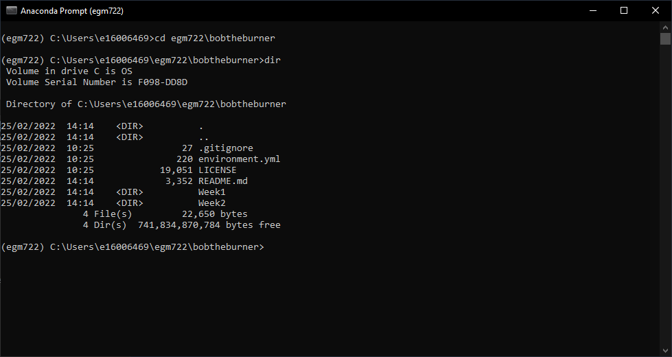
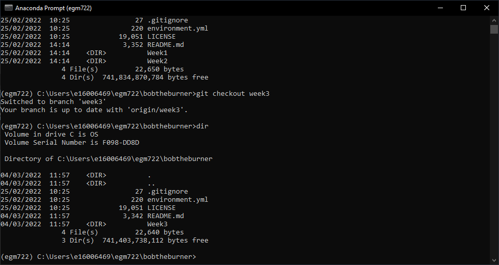
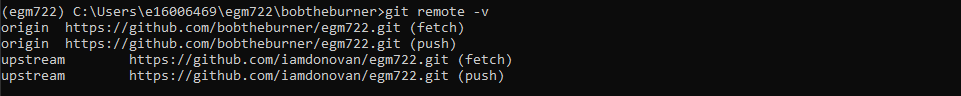
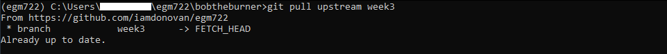
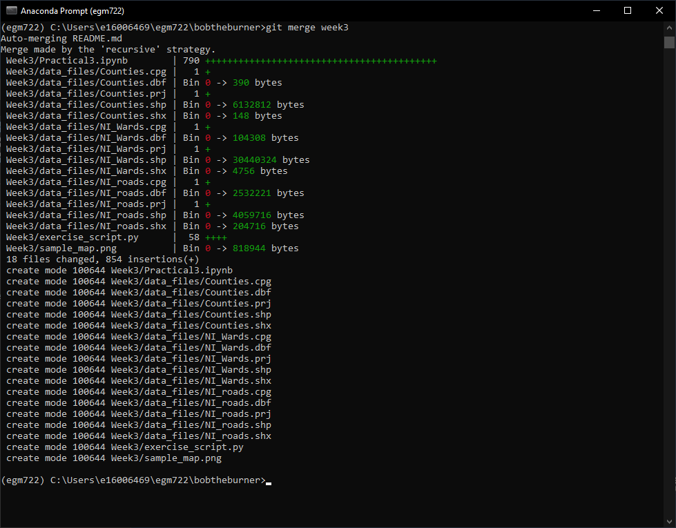
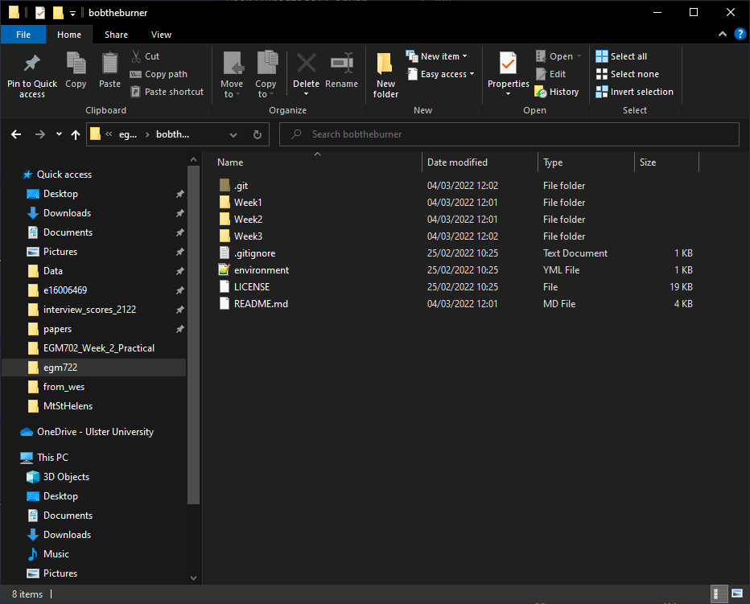
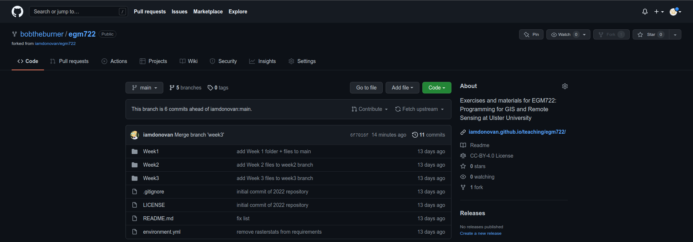
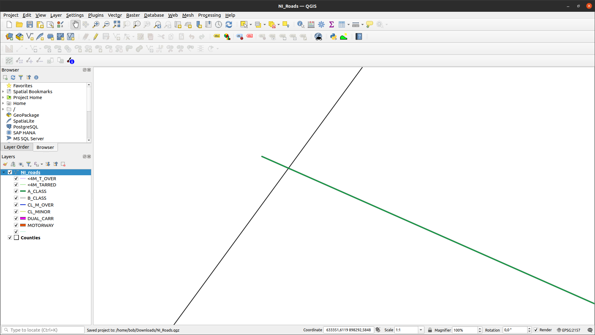

vector data using shapely and geopandas
=========================================

In this practical, you’ll gain some more experience working with vector data in python. You will learn about the different vector
data types available in the shapely package, and how we can use the geopandas package to perform different vector data
operations and analyses.

The practical this week is provided as a Jupyter Notebook, where you can interactively work through the different steps of
plotting the data. There is a second file, **exercise_script.py**, which you can modify to perform additional analyses, based on what
you’ve learned in the Jupyter Notebook and the mapping exercise in Practical 2.

.. note::

    In the main folder, you should also see an example script, **week3_example.py**. Be sure to try out the exercise, and see
    if you can't figure out a solution on your own, before having a look at the (one of many possible) solution offered there.

Getting Started
---------------

:doc:`Last week<cartopy>`, we saw how we can use **GitHub Desktop** to merge two branches (in this case, ``week2`` into ``main``).
This week, we're going to see how to do this using the command line.

To get started with this week’s practical, open Anaconda Navigator, then launch the **Command Prompt** - either from 
**Anaconda Navigator** (make sure that your egm722 environment is selected), or from the **Start Menu**.

When the **Command Prompt** opens, navigate to your repository folder using ``cd``, then type ``dir`` and press **Enter**. 
You should see something similar to the following:

|br| Switch to the ``week3`` branch by typing:

.. code-block:: text

     git checkout week3

and pressing **Enter**. 

.. note::

    If you see some version of the following:
    
    .. code-block:: text

        hint: If you meant to check out a remote tracking branch on, e.g., 'origin',
        hint: you can do so by fully qualifying the name with the --track option:
        hint:
        hint:     git checkout --track origin/<name>
        hint:
        hint: If you'd like to always have checkouts of an ambiguous <name> prefer
        hint: one remote, e.g. the 'origin' remote, consider setting
        hint: checkout.defaultRemote=origin in your config

    What this is telling you is that you *either* have to explicitly specify **which** remote branch
    you want to check out (e.g., ``origin`` or ``upstream``), **or** you should set your 
    ``defaultRemote`` option using ``git config``:

    .. code-block:: text

        git config --global checkout.defaultRemote origin

Next, type ``dir`` and press **Enter** again. You should now see this:

|br| To merge the ``week3`` branch of our repository into ``main``, we'll use **git** from the command line.

Remember that at the :ref:`start<desktop branches>` of last week's practical, we discussed the difference between
**local**, **origin**, and **upstream** branches: 

- **local** branches are the ones stored *local*\ ly on your computer,
- **origin** branches are the branches of your repository stored on GitHub,
- **upstream** branches are the branches of the repository that you forked the egm722 repository from
  (https://github.com/iamdonovan/egm722).

Sometimes, there may be changes to the **upstream** repository that we want to integrate into our local version of a
repository. For example, for this module I may have added an additional exercise to the practical in one week, and you
want to make sure that you have this before you **merge** that week's branch into the ``main`` branch.

To be able to keep track of the **upstream** changes, we need to make sure that our local repository knows where the
**upstream** repository is. First, double-check what **remote** (not **local**) repositories git is keeping track of
by typing the following at the command line:

.. code-block:: text

    git remote -v

This will list the **remote** repositories, and their nicknames. You should see an output like this:

|br|

.. note::

    If you only see **origin**, then we need to add the **upstream** remote location using ``git remote add``:

    .. code-block:: text

        git remote add upstream https://github.com/iamdonovan/egm722.git

    This adds the URL for the **upstream** repository (https://github.com/iamdonovan/egm722.git) to our local
    configuration. You can check that this worked by typing ``git remote -v`` again - you should now see two lines
    for the **upstream** repository, as above.

Now, we can tell **git** to specifically **pull** the **upstream** version of a particular branch:

.. code-block:: text

    git pull upstream <branch>

This will **pull** (**fetch** and **merge**) the **upstream** version of <**branch**> (if it exists) into the **local**
version of the current branch.

For example, ``git pull upstream week3`` would merge the **upstream** ``week3`` branch into our current branch (``week3``).
Go ahead and enter this command now:

.. code-block:: text

    git pull upstream week3

You should see the following output:

|br| This indicates that there's been no change to the **upstream** branch that isn't already in our **origin** branch,
so we can safely merge the **local** ``main`` and ``week3`` branches.

Now, switch back to the ``main`` branch:

.. code-block:: text

    git checkout main

And enter the following command:

.. code-block:: text

    git merge week3

You should now see the following output in the window:

|br| This tells us what files have been changed (``18 files``) and how (``854 insertions(+)``). Because none the files
in the **Week3** folder were present in the ``main`` branch, we'll only see additions/insertions. As you work on your
project and commit changes to existing files, you'll also see deletions (lines that are deleted or changed).

You should also see Weeks 1--3 in your repository folder:

|br| The last thing to do now is to **push** these changes to your GitHub repository:

.. code-block:: text

    git push

You can confirm that the changes are now on your remote repository by heading over to GitHub:

|br| At this point, you can launch Jupyter Notebooks as you have in the previous weeks, and begin to work through the
practical exercise.

Next steps
----------

Once you have finished the notebook and the exercise, make sure to send me an e-mail with some ideas for your coding
project. They do not have to be completely fleshed out, but you should try to have a general idea of what you would
like to work on for the final project – ideally, this will be something related to your work, or a potential MSc thesis
topic.

.. note::
    
    Below this point is the **non-interactive** text of the notebook. To actually run the notebook, you'll need to
    follow the instructions above to open the notebook and run it on your own computer!

....

Rachel McAdams
----------------

overview
^^^^^^^^^

Up to now, you have gained some experience working with basic features
of python, and used cartopy and matplotlib to create a map. In each of
these practicals, you have loaded different vector datasets using a
module called geopandas. In this week’s practical, we’ll be looking at
working vector data in a bit more depth, including the different
geometry types available using shapely, analyses like spatial joins and
summarizing based on attributes, and how to reproject vector data from
one coordinate reference system to another.

objectives
^^^^^^^^^^^

-  Gain experience working with different vector data types using
   shapely
-  Use geopandas to re-project vector datasets from one coordinate
   reference system to another
-  Summarize features using the groupby method of a GeoDataFrame
-  Learn how to perform different vector data operations using geopandas
   and shapely

data provided
^^^^^^^^^^^^^^

In the data_files folder, you should have the following: -
**NI_roads.shp**, a shapefile of roads in Northern Ireland -
**Counties.shp**, a shapefile of county outlines for Northern Ireland -
**NI_Wards.shp**, a shapefile of electoral wards for Northern Ireland

getting started
^^^^^^^^^^^^^^^^

In this practical, we’ll be working with vector data. As a quick
refresher, the three main types of vector data that we will work with
are:

-  **Point**: point data represent a single point in space. For our
   purposes, points are either two-dimensional (x, y) or
   three-dimensional (x, y, z). In ``shapely``, the corresponding
   **class** of data is a **Point**.
-  **Line**: lines are a sequence of at least two points that are joined
   together. In ``shapely``, the corresponding **class** of data is
   known as a **LineString**.
-  **Polygon**: polygons are a sequence of at least three points that
   are connected to form a **ring**, as well as any additional rings
   that represent holes in the polygon. In ``shapely``, the
   corresponding **class** of data is a **Polygon**.

We can also have **Collections** of vector data, where each feature
represents a collection of **Point**, **Line**, or **Polygon** objects.
In ``shapely``, these are represented as **MultiPoint**,
**MultiLineString**, or **MultiPolygon** objects.

To get started, run the following cell to import ``geopandas`` and
``shapely``.

.. code:: ipython3

    # this lets us use the figures interactively
    %matplotlib inline

    import pandas as pd
    import geopandas as gpd
    from shapely.geometry import Point, LineString, Polygon

shapely geometry types
^^^^^^^^^^^^^^^^^^^^^^^

Points
~~~~~~

As we saw in Week 1, to create a **Point**, we pass x, y (and
optionally, z) coordinates to the **Point** class constructor
(`documentation <https://shapely.readthedocs.io/en/stable/reference/shapely.Point.html>`__):

.. code:: ipython3

    pt = Point(-6.677, 55.150) # creates a 2d point with coordinates -6.677, 55.150
    pt2 = Point(-6.658, 55.213) # creates a 2d point with coordinates -6.658, 55.213

    pt3d = Point(86.925278, 27.988056, 8848.86) # creates a 3d point

    print(pt) # print a well-known text (WKT) representation of the Point object

The last line, ``print(pt)``, prints a
`well-known-text <https://en.wikipedia.org/wiki/Well-known_text_representation_of_geometry>`__
(WKT) representation of the **Point** object. WKT is a standard
representation of vector geometry objects - most ``python`` libraries
and GIS softwares are able to read and/or translate WKT into other
formats, such as ESRI Shapefiles, GeoJSON, etc.

Remember that in python, we can find the attributes and methods for an
object by looking up the documentation (for shapely, this can be found
`here <https://shapely.readthedocs.io/en/stable/manual.html>`__), or
using the built-in function ``dir()``. To find out more about a
particular function, we can use the built-in function ``help()`` (or, in
jupyter notebooks/ipython, the ``?`` operator).

As an example, let’s use the built-in function ``dir()`` to look at the
methods and attributes associated with the **Point** class:

.. code:: ipython3

    dir(pt) # show the attributes and methods associated with the pt object

Here, in addition to the **speciall** or **magic** methods (denoted with
two underscores, \_\_, at the beginning and end of the method name),
there are a number of methods that we might find useful, including
``.distance()``.

To see what this method does, we can use ``help(Point.distance)``:

.. code:: ipython3

    help(pt.distance)

So, ``.distance()`` provides the distance from the **Point** object to
some other geometry. Because ``shapely`` does not directly deal with
coordinate systems, this distance is **unitless**. This means that **we
have to make sure that the two objects have the same reference system -
if we do not, the distance returned will not make sense.** Don’t worry,
we will cover working with coordinate reference systems later on in this
exercise.

Use the cell below, along with the output of dir(pt) above, to work out
how we can access the x, y coordinates of a Point object. Can you see
more than one way to do this? If so, are there differences between them?

.. code:: ipython3

    # write your method to access the x,y coordinates of pt here

One of the common operations we might want to do with a **Point** object
is to create a **buffer** around the point. In the list of associated
methods and attributes of Point objects above, you should see there is a
method called ``.buffer()``.

A look at the help for this method:

.. code:: ipython3

    help(pt.buffer) # show the help for pt.buffer

shows that ``buffer`` takes a **positional parameter** of *distance*, as
well as a number of **keyword parameters** that determine how the buffer
operation is done. Remember that the buffer distance will be in the same
coordinate system as our point - ``shapely`` does not, by itself, do any
conversion between coordinate systems or units.

Note that the object returned by buffer is a **Polygon**, rather than a
point - this makes sense, as the buffer is a two-dimensional surface
around the point location:

.. code:: ipython3

    pt_buffer = pt.buffer(0.001) # buffer the point by 0.001 in the same coordinates
    print(type(pt_buffer)) # show the type of the buffer

LineStrings
~~~~~~~~~~~

Instead of using a single x, y coordinate pair, a **LineString** object
(`documentation <https://shapely.readthedocs.io/en/stable/reference/shapely.LineString.html>`__)
takes either a list of **Point** objects, or a list of coordinate
**tuples**:

.. code:: ipython3

    line1 = LineString([pt, pt2]) # method one of creating a LineString, using a list of Point objects
    line2 = LineString([(-6.677, 55.150), (-6.658, 55.213)]) # method two, using a list of coordinate tuples

    print(line1) # show the first line
    print(line2) # show the second line

As we can see from the output above, these two **LineString**\ s have
the same coordinates. We can also use the ``.equals()`` method to check
that the two objects are the same geometry:

.. code:: ipython3

    line1.equals(line2) # check to see if these are the same geometry

The coordinates of a **LineString** are stored as a **tuple** in an
attribute called **xy**. The **tuple** has two items representing the X
and Y coordinate values. If we want the x and y coordinates as separate
variables, we can access them using their respective indices:

.. code:: python

   In [4]: x = line1.xy[0]
   In [5]: y = line1.xy[1]

We can also combine this using **tuple assignment**, or **unpacking**,
which assigns values from a **tuple** on the right-hand side of the
assignment to a comma-separated grouping of variables on the left-hand
side:

.. code:: ipython3

    x, y = line1.xy

    print(x)
    print(y)

**LineString** objects have a number of the same methods that **Point**
objects do, including ``.buffer()`` and ``.distance()``.

**LineString** objects also have a ``.length`` attribute (just like with
``.distance()``, it is **unitless**):

.. code:: ipython3

    print(line1.length)

**LineString** objects have a ``.centroid`` attribute, corresponding to
the midpoint of the **LineString**:

.. code:: ipython3

    center = line1.centroid # get the midpoint of the line
    print(center)

The last two methods of **LineString** objects that we will explore for
now are ``.project()`` and ``.interpolate()``:

.. code:: ipython3

    help(line1.project)

So ``.project()`` returns the distance along the **LineString** that
comes closest to the **Point** (or other geometry object).

``.interpolate()``, on the other hand, does something a bit different:

.. code:: ipython3

    help(line1.interpolate)

it returns the point along the line at a specified distance; the
distance can be in the units of the **LineString**\ ’s coordinates
(``normalized=False``), or it can be as a fraction of the total length
of the **LineString** (``normalized=True``).

.. code:: ipython3

    line1.project(center) / line1.length # check to see how far along the line our centerpoint is

    print(center) # print the WKT representation of the center point
    print(line1.interpolate(0.5, normalized=True)) # print the WKT representation of the point 50% along the line

Polygons
~~~~~~~~

The last basic geometry type we will look at in this practical are
**Polygon** objects. Similar to **LineString** objects, we can construct
a **Polygon** object
(`documentation <https://shapely.readthedocs.io/en/stable/reference/shapely.Polygon.html>`__)
using a list of coordinate pairs, or a list of **Point** objects:

.. code:: ipython3

    poly1 = Polygon([(-6.677, 55.150), (-6.658, 55.213), (-6.722, 55.189)])
    poly2 = Polygon([pt, pt2, Point(-6.722, 55.189)])

    print(poly1) # print a wkt representation of the polygon
    print(poly2)

and, just like we saw with **LineString** objects, we can use
``.equals()`` to check that these two geometries are the same:

.. code:: ipython3

    poly1.equals(poly2)

Note that even though we only passed three **Point** objects (or
coordinate pairs) to the **Polygon** constructor, the **Polygon** has
four vertices, with the first and last vertex being the same - this is
because the **Polygon** exterior is *closed*.

Note also the double parentheses - this is because a **Polygon**
potentially has two sets of coordinates - the *Shell*, or *exterior*,
and *holes*, or *interiors*. To create a **Polygon** with a hole in it,
we can pass a list of coordinates that describe the ``shell``, and a
second that describes the ``holes``:

.. code:: ipython3

    polygon_with_hole = Polygon(shell=[(-6.677, 55.150), (-6.658, 55.213), (-6.722, 55.189)],
                                holes=[[(-6.684, 55.168), (-6.704, 55.187), (-6.672, 55.196)]]) # note the double brackets

    print(polygon_with_hole)

Note the double brackets in the ``holes`` keyword argument:

.. code:: python

   holes=[[(-6.684, 55.168), (-6.704, 55.187), (-6.672, 55.196)]]

This is necessary, because ``holes`` is expecting a sequence of
coordinate sequences - effectively, a list of **Polygon** shells.

Accessing the coordinates of a **Polygon** object is a little more
complicated than it is for **Point** and **LineString** objects - this
is because **Polygon** objects have two sets of coordinates, the
``.exterior`` (*shell*) and ``.interiors`` (*holes*).

But, the ``.exterior`` attribute of the **Polygon** is just a
**LinearRing** (a special case of **LineString** where the first and
last coordinates are the same), and the ``.interiors`` attribute is an
**InteriorRingSequence** (basically, a collection of **LinearRing**\ s
that have to obey `additional
rules <https://shapely.readthedocs.io/en/stable/manual.html#polygons>`__):

.. code:: ipython3

    print(polygon_with_hole.exterior) # this is a single LinearRing
    for lr in polygon_with_hole.interiors: # this is potentially multiple LinearRing objects
        print(lr)

**Polygon** objects have nonzero ``.area`` and non-zero ``.length``
(perimeter) attributes - as with the equivalent attributes for **Point**
and **LineString** objects, these are *unitless*.

**Polygon** objects also have a ``.centroid`` (center), and we can bound
the geometry using *either* the minimum bounding box parallel to the
coordinate axes (the ``.envelope`` attribute), or a rotated minimum
bounding box (the ``.minimum_rotated_rectangle`` attribute):

.. code:: ipython3

    print('perimeter: ', poly1.length) # print the perimeter
    print('area: ', poly1.area) # print the area
    print('centroid: ', poly1.centroid) # get the centerpoint of the rectangle
    print('bounding coordinates: ', poly1.bounds) # get the minimum x, minimum y, maximum x, maximum y coordinates
    print('bounding box: ', poly1.envelope) # get the minimum bounding rectangle of the polygon, parallel to the coordinate axes
    print('rotated bounding box: ', poly1.minimum_rotated_rectangle) # get the smallest possible rectangle that covers the polygon

There are a number of additional methods that we will cover more as we
continue through the practicals - for now, this should be enough to give
an idea for how these geometry objects work.

interactions between geometry objects
^^^^^^^^^^^^^^^^^^^^^^^^^^^^^^^^^^^^^^

``shapely`` also provides a number of methods that we can use to check
the spatial relationship between different objects. For example, the
following code shows how we can use the ``.contains()`` method
(`documentation <https://shapely.readthedocs.io/en/stable/manual.html#object.contains>`__)
of a shapely geometry object to see whether another geometry object is
located fully within the object:

.. code:: ipython3

    poly = Polygon([(0, 0), (2, 0), (2, 3), (0, 3)])
    pt1 = Point(0, -0.1)
    pt2 = Point(1, 1)

    print(poly.contains(pt1)) # should return False, because pt1 is not within the polygon
    print(poly.contains(pt2)) # should return True, because pt2 is within the polygon

We can also check to see whether two geometry objects intersect each
other using the ``.intersects()`` method
(`documentation <https://shapely.readthedocs.io/en/stable/manual.html#object.intersects>`__):

.. code:: ipython3

    line1 = LineString([(0, 0), (1, 1)])
    line2 = LineString([(0, 1), (1, 0)])

    print(line1.intersects(line2)) # intersects() returns True if the geometries touch/intersect/overlap, False otherwise

To actually get the intersection of the two geometries, we use the
``.intersection()`` method, which returns the geometry of the
intersection (whether this is a **Point**, a **LineString**, a
**Polygon**, or a mixed collection of geometries depends on the
geometries and how they intersect):

.. code:: ipython3

    line1 = LineString([(0, 0), (1, 1)])
    line2 = LineString([(0, 1), (1, 0)])
    poly = Polygon([(0, 0), (2, 0), (2, 3), (0, 3)])

    print(line1.intersection(line2)) # if the lines intersect, this will be the Point(s) of intersection
    print(line1.intersection(poly)) # if the line intersects a polygon, the result may be a line or a point

There are a number of other methods provided by ``shapely`` that we can
use to determine the relationship between geometry objects, including
``touches``, ``within``, and ``overlaps``. Be sure to have a look at the
full list from the `shapely user
manual <https://shapely.readthedocs.io/en/stable/manual.html>`__ to see
the rest.

geopandas GeoDataFrames
^^^^^^^^^^^^^^^^^^^^^^^^

We have used ``geopandas`` in the previous two practicals to read
provided shapefiles and work with the data they contain - in Practical
1, we translated a comma-separated variable (CSV) file into a shapefile,
and in Practical 2, we read shapefile data and plotted it on a map using
``cartopy``.

This week, we will extend this introduction to look at how we can use
``geopandas`` to do various GIS analyses, such as spatial joins and
clipping operations, as well as projecting from one coordinate reference
system to another.

To begin, we’ll load the **NI_roads** dataset from the data_files folder
and use ``.head()``
(`documentation <https://pandas.pydata.org/pandas-docs/stable/reference/api/pandas.DataFrame.head.html>`__)
to show the first 5 rows of the **GeoDataFrame**:

.. code:: ipython3

    roads = gpd.read_file('data_files/NI_roads.shp')

    roads.head() # show the first five rows of the table

So this dataset has three columns: **SURVEY**, **Road_class**, and
**geometry**.

Note that each of the geometries is a **LineString** object, which means
that we are working with line geometries. Hopefully, given that the data
are supposed to represent roads, this makes sense.

coordinate reference systems using PROJ
~~~~~~~~~~~~~~~~~~~~~~~~~~~~~~~~~~~~~~~

To start with, let’s see if we can figure out how many kilometers of
motorway are represented in the dataset - i.e., the sum of the length of
all of the **LineString** objects that have the attribute ``MOTORWAY``.

First, though, let’s check what the coordinate reference system (CRS) of
our **GeoDataFrame** is, using the ``crs`` attribute:

.. code:: ipython3

    roads.crs

So this dataset has a *Geographic* coordinate reference system,
**EPSG:4326**. EPSG codes (originally organized by the European
Petroleum Survey Group) are a common way of working with coordinate
reference systems. Each CRS in the `EPSG
registry <https://epsg.org/home.html>`__ has a unique code and standard
well-known text representation.

The ``crs`` attribute of the **GeoDataFrame** is actually a
**pyproj.CRS** object
(`documentation <https://pyproj4.github.io/pyproj/stable/api/crs/crs.html>`__).
`pyproj <https://pyproj4.github.io/pyproj/stable/>`__ is a python
interface to the `PROJ <https://proj.org/>`__ library, which is a
software for transforming geospatial coordinates from one CRS to
another.

Each **pyproj.CRS** object provides a number of methods for converting
to different formats, including well-known text, EPSG codes, JavaScript
Object Notation (JSON), and PROJ string (i.e.,
``'+proj=longlat +datum=WGS84 +no_defs +type=crs'``).

For example, to see the JSON representation of the CRS, we would use the
``.to_json()`` method
(`documentation <https://pyproj4.github.io/pyproj/stable/api/crs/crs.html#pyproj.crs.CRS.to_json>`__):

.. code:: ipython3

    roads.crs.to_json() # show the representation of the CRS in JSON format

Because this is a *Geographic* CRS, the length information provided by
``.length`` will also be in geographic units, which doesn’t really make
sense for us. This means that we first have to convert the
**GeoDataFrame** to a *projected* CRS.

To do this, we can use the method ``to_crs()``
(`documentation <https://geopandas.org/en/stable/docs/reference/api/geopandas.GeoDataFrame.to_crs.html>`__):

.. code:: ipython3

    help(roads.to_crs) # show the help for the .to_crs() method

So, to transform the **GeoDataFrame** to a different CRS, we have to
provide either a CRS object or an EPSG code. We can also choose to do
this *in place* (``inplace=True``), or assign the output to a new
**GeoDataFrame** object (``inplace=False``, the default). Let’s
transform the **GeoDataFrame** to the Irish Transverse Mercator CRS, and
assign the output to a new object called **roads_itm**.

Rather than trying to find the correct JSON or PROJ representation of
this CRS, we can instead use the EPSG code, which can be easier to work
with.

Using the search function on the \ `EPSG
registry <https://epsg.org/search/by-name>`__\ , or using an internet
search, look up the EPSG code for the Irish Transverse Mercator CRS and
enter it in the method call below:

.. code:: ipython3

    roads_itm = roads.to_crs(epsg=XX) # replace XX with the correct EPSG code for Irish Transverse Mercator

    roads_itm.head()

Note that only the **geometry** column has changed - instead of
geographic coordinates (e.g., (-6.21243, 54.48706)), the points in each
**LineString** should be in a projected CRS (e.g., (715821.764,
861315.722)). Now, when we access the ``.length`` attributes of each
**LineString** object, the units will be in the same units as our CRS
(meters).

summarizing data using geopandas
~~~~~~~~~~~~~~~~~~~~~~~~~~~~~~~~

So that’s the first part of our problem solved - our coordinates are in
meters, and the lengths will be as well. The next step is to select all
of the features that correspond to Motorways and sum the lengths. We saw
an example of this in Practical 1 - we can slice the **GeoDataFrame**
with a conditional statement (``'Road_class' == 'MOTORWAY'``) to select
only those rows where the road type is ``MOTORWAY``:

.. code:: ipython3

    roads_itm[roads_itm['Road_class'] == 'MOTORWAY']

But first, we might want to add a column to our **GeoDataFrame** that
contains the ``.length`` of each of the features. One way to do this
would be to *iterate* over the rows of the **GeoDataFrame** using the
``.iterrows()``
(`documentation <https://pandas.pydata.org/pandas-docs/stable/reference/api/pandas.DataFrame.iterrows.html>`__):

.. code:: ipython3

    help(roads_itm.iterrows)

Because ``.iterrows()`` returns an **iterator** of (**index**,
**Series**) pairs, we can use **tuple assignment** in our ``for`` loop
definition:

.. code:: python

   for ind, row in roads_itm.iterrows():

This gives us two variables, ``ind`` and ``row``, which we can use
inside the body of the ``for`` loop: - ``ind`` corresponds to the
**index** of the ``row`` - ``row`` corresponds to the **Series**, the
actual data contained in the ``row``

We can access the value stored in each “column” of the row in the same
way that we do for the full **GeoDataFrame** - either ``row[column]`` or
``row.column``.

Finally, we can assign a new column in the original **GeoDataFrame**
using the ``.loc``
`property <https://pandas.pydata.org/pandas-docs/stable/reference/api/pandas.DataFrame.loc.html>`__,
which uses either a *label* (for example, ``ind``), or a **Boolean
array** to index the **GeoDataFrame**.

So the line below,

.. code:: python

   roads_itm.loc[ind, 'Length'] = row['geometry'].length

assigns the ``length`` property of the row’s geometry to a new column,
``Length``, at the index. Putting it all together, our loop looks like
this:

.. code:: ipython3

    for ind, row in roads_itm.iterrows(): # iterate over each row in the GeoDataFrame
        roads_itm.loc[ind, 'Length'] = row['geometry'].length # assign the row's geometry length to a new column, Length

    roads_itm.head() # show the updated GeoDataFrame to see the changes

Finally, we can subset our **GeoDataFrame** to select only ``MOTORWAY``
features, and sum their length using the ``.sum()`` method
(`documentation <https://pandas.pydata.org/pandas-docs/stable/reference/api/pandas.Series.sum.html>`__):

.. code:: ipython3

    sum_roads = roads_itm['Length'].sum()
    sum_motorway = roads_itm[roads_itm['Road_class'] == 'MOTORWAY']['Length'].sum()
    print(f'{sum_roads:.2f} total m of roads')
    print(f'{sum_motorway:.2f} total m of motorway')

In the cell above, look at the ``print`` function argument:

.. code:: python

   print(f'{sum_motorway:.2f} total m of motorway')

Here, we are using a “`formatted string
literal <https://docs.python.org/3/tutorial/inputoutput.html#tut-f-strings>`__”
(**f-String**) to insert the value of an object, ``sum_motorway``, into
our ``print()`` statement. We saw this in the very first exercise in
Week 1, but there’s something added here: the *format specification*,
``:.2f``. Rather than printing the string in an unformatted way (which
would contain a lot of extra decimal places), we can tell the ``format``
method to clean up the output using ``:`` and a `format
specification <https://docs.python.org/3.8/library/string.html#formatspec>`__.
In this case, ``.2f`` tells python to format as a **float** (``f``),
with 2 places after the decimal.

Let’s say now that we want to find the sum of all of the different road
classes in our dataset. We could, of course, repeat the exercise above
for each of the different values of **Road_class**. But, ``pandas`` (and
by extension, ``geopandas``) provides a nicer way to summarize data
based on certain properties: the ``.groupby()`` method
(`documentation <https://pandas.pydata.org/pandas-docs/stable/reference/api/pandas.DataFrame.groupby.html>`__).

``.groupby()`` returns an object (a **DataFrameGroupBy** object) that is
similar to a **DataFrame**, but that contains information about how the
data in the table is grouped; to see different properties of those
groups, we can use methods like ``.mean()``, ``.median()``, ``.sum()``,
etc., exactly like we can on a **DataFrame**, **GeoDataFrame**, or
**Series** object.

If we want to summarize our dataset by ``Road_class`` and use ``.sum()``
to find the total length of each type of roadway, then, it would like
this:

.. code:: ipython3

    roads_itm.groupby(['Road_class'])['Length'].sum() / 1000 # convert to km

``.groupby()`` returns a **GeoDataFrame**, which we can then index to
return a single column, ``Length``. As this is a numeric column, we can
also use arithmetic on it to divide by a conversion factor, to convert
the length from meters to kilometers. The ``.groupby()`` method is a
very useful way to quickly summarize a **DataFrame** (or a
**GeoDataFrame** - remember that this is a **child class** of
**DataFrame**).

spatial data operations using geopandas and shapely
^^^^^^^^^^^^^^^^^^^^^^^^^^^^^^^^^^^^^^^^^^^^^^^^^^^^

Oftentimes in GIS analysis, we want to summarize our data spatially, as
well as thematically. In this section, we will be looking at two
examples of this kind of analysis: first, using a `spatial
join <https://gisgeography.com/spatial-join/>`__, and second, using a
clipping operation.

Remember that the ``shapely`` geometry objects in the **GeoDataFrame**
don’t have any inherent information about the CRS of the object. This
means that in order to perform operations like a spatial join, we have
to first ensure that the two **GeoDataFrame** objects have the same CRS.
The cell below will load the Counties shapefile in the **data_files**
folder, and test whether the CRS of the ``counties`` **GeoDataFrame** is
the same as the CRS of the ``roads_itm`` **GeoDataFrame**.

If, when you first load the shapefile, the test below returns False,
write a line of code that will ensure that the test returns True.

.. code:: ipython3

    counties = gpd.read_file('data_files/Counties.shp') # load the Counties shapefile
    # your line of code might go here.
    print(counties.crs == roads_itm.crs) # test if the crs is the same for roads_itm and counties.

Now that the two **GeoDataFrame** objects have the same CRS, we can
proceed with the spatial join using ``gpd.sjoin()``
(`documentation <https://geopandas.org/en/stable/docs/reference/api/geopandas.sjoin.html>`__):

.. code:: ipython3

    join = gpd.sjoin(counties, roads_itm, how='inner', lsuffix='left', rsuffix='right') # perform the spatial join
    join # show the joined table

Now, we can see that our table has additional columns - we have the
unnamed ``index``, ``COUNTY_ID``, ``CountyName``, ``Area_SqKM``,
``OBJECTID``, and ``geometry`` from the ``counties`` **GeoDataFrame**,
and ``index_right`` (because the original column in ``roads_itm`` has
the same name as ``index`` in ``counties``), ``SURVEY``, ``Road_class``,
and ``Length`` from the ``roads_itm`` **GeoDataFrame**.

Like we did with ``roads_itm``, we can again summarize our new
**GeoDataFrame** using ``.groupby()``; this time, we’ll use both the
``CountyName`` and ``Road_class`` properties to see the total length of
roads by each county, and by the type of road:

.. code:: ipython3

    group_county_road = join.groupby(['CountyName', 'Road_class']) # group by county name, then road class

    group_county_road['Length'].sum() / 1000 # show the total number of km for each category

From this, we can quickly see that County Antrim has the most motorway
of any county in Northern Ireland (93.44 km), while County Tyrone has
the most “< 4M Tarred” road surfaces by a factor of two (2809.43 km
vs. 1453.77 km for County Armagh).

One thing to keep in mind is that with a spatial join, any feature in
the “right” table that overlaps multiple features in the “left” table
will be, in effect, double-counted. We can confirm this by calculating
the total length of roads in the joined table and comparing it to the
total length of roads in the original dataset:

.. code:: ipython3

    join_total = join['Length'].sum() # find the total length of roads in the join GeoDataFrame

    # check that the total length of roads is the same between both GeoDataFrames
    print(f'Total length of roads from original file: {sum_roads:.2f}')
    print(f'Total length of roads from spatial join: {join_total:.2f}')
    print(f'Absolute difference in road length: {abs(sum_roads - join_total) / 1000:0.2f} km') # calculate the absolute difference as a percentage
    print(f'Absolute difference in road length: {(100 * abs(sum_roads - join_total) / sum_roads):0.2f}%') # calculate the absolute difference as a percentage

And indeed, we can see that the total length of roads in the spatial
join is ~300 km longer (1.42%) than the total length of roads in the
original dataset.

We can also see that we have double-counted features by comparing the
total number of road features in the ``join`` **GeoDataFrame** with the
number of unique road features, which we can find using a combination of
``len()``
(`documentation <https://docs.python.org/3/library/functions.html#len>`__)
and ``.unique()``
(`documentation <https://pandas.pydata.org/pandas-docs/stable/reference/api/pandas.Series.unique.html>`__):

.. code:: ipython3

    not_unique = len(join.index) - len(join.index_right.unique()) # get the difference between the number of objects in the table and the unique objects in the table

    print(f'There are {not_unique} duplicated objects in the joined table.')

Obviously, we don’t want to double-count roads - to get around this, we
can use the ``gpd.clip()`` function
(`documentation <https://geopandas.org/en/stable/docs/reference/api/geopandas.clip.html>`__)
to clip the features of ``roads_itm`` to each of the county boundaries
in the ``counties`` **GeoDataFrame**:

.. code:: ipython3

    help(gpd.clip)

Note that we have to do this for each of county, because -
``gpd.clip()`` will take the total boundary for the **GeoDataFrame** if
there are multiple **Polygon** objects.

Using a ``for`` loop to loop over the ``counties`` **GeoDataFrame**,
then, we can clip ``roads_itm`` to each county, and combine the results
in another **GeoDataFrame**:

.. code:: ipython3

    clipped = [] # initialize an empty list
    for county in counties['CountyName'].unique(): # iterate over unique values of county
        tmp_clip = gpd.clip(roads_itm, counties[counties['CountyName'] == county]) # clip the roads by county border
        for ind, row in tmp_clip.iterrows():
            tmp_clip.loc[ind, 'Length'] = row['geometry'].length # remember to update the length for any clipped roads
            tmp_clip.loc[ind, 'CountyName'] = county # set the county name for each road feature
        clipped.append(tmp_clip) # add the clipped GeoDataFrame to the list

Note that this step will likely take some time, as we are iterating over
a large number of features.

This creates a **list** of **GeoDataFrame** objects - one for each
unique value of ``CountyName``. Now, we can use ``pd.concat()``
(`documentation <https://pandas.pydata.org/pandas-docs/stable/reference/api/pandas.concat.html>`__)
to combine these into a single **DataFrame**, then use
``gpd.GeoDataFrame()`` to convert this to a **GeoDataFrame**.

Note the use of ``ignore_index=True`` with ``pd.concat()`` - this means
that ``pandas`` will assign each row in the combined **DataFrame** with
a new index, rather than keeping the original index. Because in this
case our index values only correspond to the row number, we don’t need
to keep track of this in the new table.

.. code:: ipython3

    clipped_gdf = gpd.GeoDataFrame(pd.concat(clipped, ignore_index=True)) # create a geodataframe from the combined county geodataframes

    clipped_gdf # show the new, combined geodataframe

Now, we can compare the total length of the clipped roads with the total
length of roads from the original dataset:

.. code:: ipython3

    # pandas has a function, concat, which will combine (concatenate) a list of DataFrames (or GeoDataFrames)
    # we can then create a GeoDataFrame from the combined DataFrame, as the combined DataFrame will have a geometry column.
    clip_total = clipped_gdf['Length'].sum()

    print(f'Total length of roads from original file: {sum_roads:.2f} m')
    print(f'Total length of roads from clipped join: {clip_total:.2f} m')
    print(f'Absolute difference in road length: {abs(sum_roads - clip_total) / 1000:0.2f} km')
    print(f'Absolute difference in road length: {(100 * abs(sum_roads - clip_total) / sum_roads):0.2f}%')

So we don’t have perfect overlap. This is because there isn’t perfect
overlap between the ``counties`` boundary and the ``roads`` features:
there are a number of places where the roads extend beyond the border of
Northern Ireland. One example of this is shown below:

|br| To fix this, we could first clip ``roads_itm`` to the entire
``counties`` **GeoDataFrame**, which would eliminate these extraneous
stretches of road.

For now, though, agrement to within 0.01% is acceptable for our purposes
- much better than the 1.42% disagreement from the original spatial
join.

To wrap up, write a line or two of code in the cell below that will
summarize the ``clipped_gdf`` GeoDataFrame by county and road type.
Which county has the most Motorways? The most roads in total?

.. code:: ipython3

    # your code goes here!

exercise and next steps
^^^^^^^^^^^^^^^^^^^^^^^^

Now that you’ve gained some experience working with ``shapely`` geometry
objects and ``geopandas`` **GeoDataFrame** objects, have a look at
**exercise_script.py** in this folder.

Using the topics covered in the Week 2 practical and this practical,
modify this script to do the following: 1. Load the counties and ward
data 2. Using a spatial join, summarize the total population by county.
What county has the highest population? What about the lowest? 3. Create
a map like the one below to show population information by census area,
with the county boundaries plotted overtop of the chloropleth map.

.. image:: ../../../img/egm722/week3/sample_map.png
    :width: 600
    :align: center
    :alt: the sample map to be produced in the exercise

additional exercise questions
~~~~~~~~~~~~~~~~~~~~~~~~~~~~~

1. Are there any Wards that are located in more than one county? If so,
   how many, and what is the total population of these Wards?
2. What Ward has the highest population? What about the lowest
   population?
3. Repeat the exercise above using **exercise_script.py**, but this time
   use the population density (in number of residents per square km).
