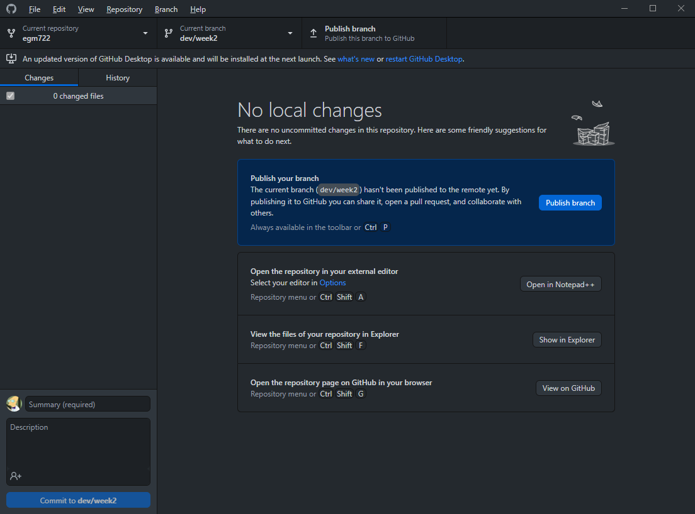
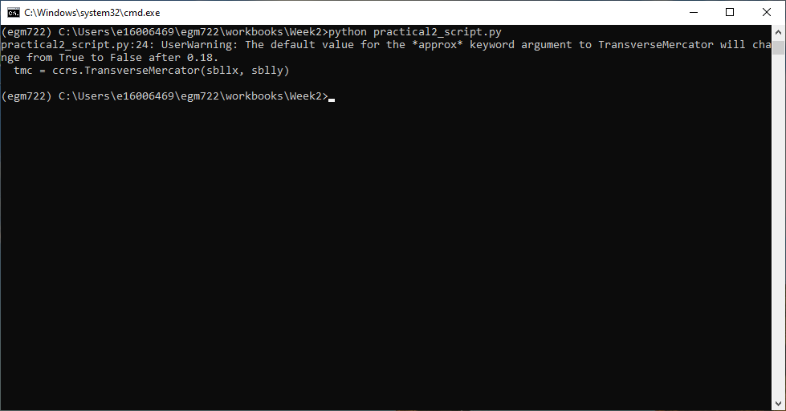
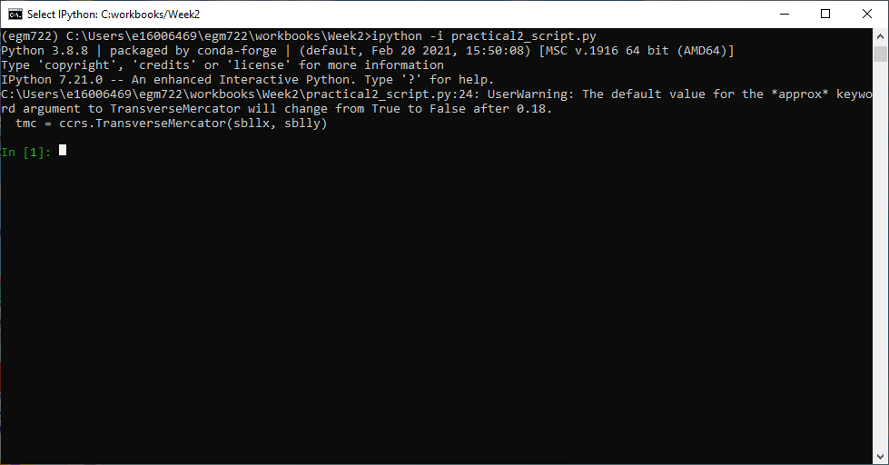

Practical 2 - Mapping with cartopy
==================================

Introduction
------------

In this practical, we'll create a map using similar data to what you used in the first practical of EGM711. This time, rather than
using ArcGIS Pro, we'll use ``cartopy``, ``matplotlib``, and ``geopandas``, python packages used for making maps, plotting data, and
working with vector data, respectively.

The practical this week is provided as a Jupyter Notebook, where you can interactively work through the different steps of
plotting the data. There is a second file, **practical2_script.py**, which will create the same map over again. Once you have worked
through the Jupyter Notebook, you can modify the script to complete the second part of the exercise, and experiment with the
different parameters used to make the map.

Getting started
---------------

To get started with this week's practical, first head to the your GitHub repository (:samp:`https://github.com/<{your_username}>/egm722`).
You should notice that this repository has 5 branches – you can click on the **branch** button to see all of the branches
available for a particular repository:

.. image:: ../../../img/egm722/week2/github.png
    :width: 600
    :align: center
    :alt: the github repository

As you can see above, the available branches are ``main``, the default **branch** that we used in last week's practical, and branches for weeks 2 through 5.

Each week, we'll see how we can **merge**, or integrate, that week's branch into the ``main`` branch. This week, we'll use **GitHub Desktop** to do this.
In the coming weeks, we'll also introduce other options such as the command-line interface or
`Pull Requests <https://docs.github.com/en/pull-requests/collaborating-with-pull-requests/proposing-changes-to-your-work-with-pull-requests/about-pull-requests>`_.

For now, open up **GitHub Desktop**. You should see something like this:

This is because the original course repository is **upstream** of your fork – it contains changes that you have not integrated into
your repository (yet!). The following sections will walk you through the steps to integrate these changes into your repository, so
that you can get the Week 2 material in your repository and on your local computer.

The first section provides the instructions using :ref:`GitHub Desktop<desktop integration>`; the second will provide you 
with the same steps using the :ref:`command-line interface<command-line integration>`.

.. note::

    You will only need to follow the instructions for **one** of the two methods, either the command line or GitHub Desktop.

.. _desktop integration:

Integrating upstream changes (GitHub Desktop)
^^^^^^^^^^^^^^^^^^^^^^^^^^^^^^^^^^^^^^^^^^^^^^

Open **GitHub Desktop**. You should see something like the following:

.. image:: ../../../img/egm722/week2/desktop1.png
    :width: 600
    :align: center
    :alt: the github desktop window

Click the button that shows the current branch (**main**) – you should see the following:

In addition to your **main** branch, you should also see **upstream/main** and **upstream/dev/week2**, which is the branch we want to
incorporate into your fork. If you click on **upstream/dev2**, it will create (**checkout**) a new local branch, **dev/week2**, which is a
copy of the upstream branch.

Next, we want to **merge** these changes into our main branch. First, select the **main** branch again by clicking on it:

At the bottom of the menu, you should see a button that says "Choose a branch to merge into **main**" – if you see another
branch here, you'll need to switch branches by clicking on your **main** branch in the menu.

When you click on "Choose a branch to merge into **main**", you will see the following menu:

Select your local **dev/week2** branch – at the bottom of the menu, you should see something that says "This will merge 
**5 commits** from **dev/week2** into **main**" along with a green checkmark that indicates that there are no **conflicts**
(in other words, no files that have been changed in both branches). If there are no conflicts, click on the **Merge** 
button at the bottom of the menu.

The last step is to **push** your changes to the origin (your GitHub repository). Click the **Push origin** button at 
the top of the window:

.. image:: ../../../img/egm722/week2/desktop_push.png
    :width: 600
    :align: center
    :alt: pushing changes from the github desktop window

When you return to your GitHub repository, you should see that your changes have been integrated into the **main** branch:

We still haven't pushed the local **dev/week2** branch to the GitHub repository – to do this, we'll need to set the remote location
for the branch either by using the **config** file, or by using the command line.

Publishing local branches (GitHub Desktop)
^^^^^^^^^^^^^^^^^^^^^^^^^^^^^^^^^^^^^^^^^^

From the **Command Prompt**, navigate to your local repository directory, then type:
::

    git config --local --edit

and press **ENTER**:

This will open your configured text editor. You should see something like this:

Under ``[branch "dev/week2"]``, change **remote** from ``upstream`` to ``origin``:

Save and close the file, and go back to **GitHub Desktop**. You should now see the option to **Publish branch** at the top:

When you press this, it will upload the current branch to your GitHub repository. To check, head to the repository page – you
should now see there are 2 branches instead of 1:

If this is the case, you can switch branches back to **main** from **GitHub Desktop**, then start working on the Jupyter Notebook. If
you do not see this, you can ask for help in the Discussion Forum.

.. _command-line integration:

Integrating upstream changes (command line)
^^^^^^^^^^^^^^^^^^^^^^^^^^^^^^^^^^^^^^^^^^^

To integrate the upstream changes using the command line, first open the **Command Prompt** and navigate to the folder
containing your local repository. This repository is a *fork* of iamdonovan/egm722 – meaning that any changes to
iamdonovan/egm722 are happening **upstream** of this repository.

To bring the upstream changes to the local repository, use the ``git checkout`` command:
::

    git checkout -b dev/week2 upstream/dev/week2

This will **checkout** the upstream branch (**dev/week2**) into a new local branch of the same name. You should see there is a new
directory in the folder, Week2, which contains the files for the Week 2 practical:

Next, switch back to the main branch using ``git checkout``:
::

    git checkout main

You should see that the Week2 folder has disappeared – this is because when we change branches, git updates the files/folders
that it tracks to match the status of whatever branch we're on.

Now, we can merge these changes into the local **main** branch using ``git merge``:
::

    git merge dev/week2

This will merge the changes from **dev/week2** into the local **main** branch. We still haven't pushed the local **dev/week2** branch to
the GitHub repository – to do this, we use ``git push``.

At the moment, the **origin** for the **dev/week2** branch is set to the upstream repository, rather than your fork on GitHub – if you
try to push the changes, you should see an error message. You can either edit the config file following the steps on pages 4-5 of
this handout, or use the ``-u`` flag:
::

    git push -u origin dev/week2

This will set the remote location for dev/week2 to point to origin (an alias for the URL for your GitHub repository), rather than
the upstream repository (`<https://github.com/iamdonovan/egm722>`_). When you open your repository on GitHub, you should see
there are now 2 branches, **main** and **dev/week2**; your main branch should now also include the Week2 folder.

Running the notebook
---------------------

At this point, you should be ready to open jupyter and work your way through the notebook, following the same initial steps as last week.

Running the script
-------------------

To edit the script (**practical2_script.py**), open it in your IDE. If your IDE has a built-in terminal/python interpreter, you can
also run the script directly from the IDE:

.. image:: ../../../img/egm722/week2/pycharm.png
    :width: 600
    :align: center
    :alt: the script open in the pycharm IDE

Otherwise, you can use the **command prompt**; the procedure will be effectively the same.

Launch the command prompt from **Anaconda Navigator**, taking care to ensure that your ``egm722`` environment is selected
(rather than the ``base`` environment). When it launches, you should see the following window:

.. image:: ../../../img/egm722/week2/prompt3.png
    :width: 400
    :align: center
    :alt: the conda prompt

.. note::

    If, instead of ``(egm722)``, you see ``(base)`` next to the command prompt, you will need to *activate* the correct environment by
    typing: 
    ::
    
        conda activate egm722 

    and pressing **ENTER**.

Navigate to the folder where you have the repository for this module. You should see the jupyter-notebook file, as well as the
script:

.. image:: ../../../img/egm722/week2/week2_dir.png
    :width: 400
    :align: center
    :alt: the contents of the week 2 directory in the command prompt

Remember that we can use python in two ways, either interactive or script mode. We also have a choice of two different
interpreters - either ``python`` (the standard python interpreter) or ``ipython`` (an enhanced interactive interpreter). I recommend
using IPython instead of the standard interpreter when using interactive mode – the interpreter highlights syntax, it keeps track
of your sessions and enables you to easily look back over your command history, enables you to use some shell commands from
within the interpreter, and also enables tab completion for commands, variable names, and filenames.

You can run any script from start to finish using either interpreter by typing ``python script.py`` (or ``ipython script.py``, although the
benefits of using IPython come from running python in interactive mode rather than script mode).

If you want to be able to troubleshoot the script, or run additional commands after the script has finished running, you can also
start the interpreter in interactive mode by typing ``ipython -i script.py``:

To show the plot, use ``plt.show()``:

.. image:: ../../../img/egm722/week2/plot.png
    :width: 600
    :align: center
    :alt: the plot window open from ipython

You can also turn on interactive plotting using ``plt.ion()``, which will update the plot each time you run a plotting command –
similar to how it worked in the Jupyter Notebook.

Once you have finished the exercise, you can try adding other features to your map, work on re-creating some of the maps that
you created in EGM711, or try some of the examples shown on the `cartopy website <https://scitools.org.uk/cartopy/docs/v0.13/matplotlib/intro.html>`_. 
Can you work out how to include a basemap to your image, based on some of the examples provided?

.. note::
    
    Below this point is the **non-interactive** text of the notebook. To actually run the notebook, you'll need to follow the instructions
    above to open the notebook and run it on your own computer!

....

In the first practical for EGM711, you learned how to use ArcGIS Pro to
make maps, given shapefiles of different features of interest in
Northern Ireland. In this practical, you will repeat the exercise, this
time using ``cartopy``, ``geopandas``, and ``matplotlib``, three python
packages used for making maps, working with vector data, and making
plots, respectively.

Objectives
----------

-  become familiar with geopandas, cartopy, and matplotlib, including
   reading the provided documentation
-  use list comprehensions to simplify some for loops

1. Getting started
------------------

First, run the cell below. It will load the python modules we'll be
using in todthe practical, as well as define a few helper functions that
we'll use later on. For now, don't worry too much about what each
individual line does - we'll go over these in a bit more depth as we go.
Remember also that if you get stuck, you can get help in a few ways:

1. the built-in help (i.e., ``help(plt.text)``)
2. using ipython's (the python interpreter used by jupyter-notebooks)
   help shortcut (i.e., ``plt.text?``)
3. finding the online documentation for the module (usually achieved via
   option 4)
4. searching google (or your search engine of choice)
5. consulting your favorite medicine man/shaman/spiritual guide
6. asking the instructor, who will in all likelihood resort to one of
   the other options (usually 5 or 4).

.. code:: ipython3

    # this lets us use the figures interactively
    %matplotlib notebook
    
    import geopandas as gpd
    import matplotlib.pyplot as plt
    from cartopy.feature import ShapelyFeature
    import cartopy.crs as ccrs
    import matplotlib.patches as mpatches
    import matplotlib.lines as mlines
    
    plt.ion() # make the plotting interactive
    
    # generate matplotlib handles to create a legend of the features we put in our map.
    def generate_handles(labels, colors, edge='k', alpha=1):
        lc = len(colors)  # get the length of the color list
        handles = []
        for i in range(len(labels)):
            handles.append(mpatches.Rectangle((0, 0), 1, 1, facecolor=colors[i % lc], edgecolor=edge, alpha=alpha))
        return handles
    
    # create a scale bar of length 20 km in the upper right corner of the map
    # adapted this question: https://stackoverflow.com/q/32333870
    # answered by SO user Siyh: https://stackoverflow.com/a/35705477
    def scale_bar(ax, location=(0.92, 0.95)):
        llx0, llx1, lly0, lly1 = ax.get_extent(ccrs.PlateCarree())
        sbllx = (llx1 + llx0) / 2
        sblly = lly0 + (lly1 - lly0) * location[1]
    
        tmc = ccrs.TransverseMercator(sbllx, sblly)
        x0, x1, y0, y1 = ax.get_extent(tmc)
        sbx = x0 + (x1 - x0) * location[0]
        sby = y0 + (y1 - y0) * location[1]
    
        plt.plot([sbx, sbx - 20000], [sby, sby], color='k', linewidth=9, transform=tmc)
        plt.plot([sbx, sbx - 10000], [sby, sby], color='k', linewidth=6, transform=tmc)
        plt.plot([sbx-10000, sbx - 20000], [sby, sby], color='w', linewidth=6, transform=tmc)
    
        plt.text(sbx, sby-4500, '20 km', transform=tmc, fontsize=8)
        plt.text(sbx-12500, sby-4500, '10 km', transform=tmc, fontsize=8)
        plt.text(sbx-24500, sby-4500, '0 km', transform=tmc, fontsize=8)
    
    # load the outline of Northern Ireland for a backdrop
    outline = gpd.read_file('data_files/NI_outline.shp')

2. Loading the data
-------------------

Great. Now that we've imported most of the modules we'll be needing, and
defined a few helper functions, we can actually load our data. To load
the shapefile data, we will use `GeoPandas <http://geopandas.org/>`__,
an open-source package designed to make working with geospatial data in
python easier. GeoPandas is built off of Pandas, a powerful data
analysis tool. We will be working with both of these packages more in
the weeks to come.

.. code:: ipython3

    towns = gpd.read_file('data_files/Towns.shp')
    water = gpd.read_file('data_files/Water.shp')
    rivers = gpd.read_file('data_files/Rivers.shp')
    counties = gpd.read_file('data_files/Counties.shp')

GeoPandas loads the data associated with a shapefile into a
GeoDataFrame, a tabular data structure that always has a column
describing a feature's geometry. Each line in the table corresponds to a
feature in the shapefile, just like the attribute table you are familiar
with from ArcGIS/QGIS.

We'll work with GeoDataFrames more in next week's practical, but for now
see if you can figure out the total area of lakes in the ``Water``
dataset that are smaller than 10 square kilometers. I'll provide two
hints to get you started:

1. GeoDataFrames can be subset using a conditional and a column in the
   GeoDataFrame. For example, to select all water bodies with a surface
   area above 1 square kilometer, you might type something like
   ``water[water['Area_km2'] > 1]``. Note that this would return a
   GeoDataFrame, that you could select columns from.
2. The numerical columns of a GeoDataFrame (also called GeoSeries) have
   built-in operators such as **max**, **min**, **mean**, and so on. To
   get the mean area of *all* of the features in the ``Water`` dataset,
   you could type something like ``water['Area_km2'].mean()``

That should be enough to get you started - if you get stuck, be sure to
ask for help.

.. code:: ipython3

    water # run this to see what the geodataframe looks like.
    # below, write a command (or series of commands) to calculate the total area of lakes < 10 km2 in the water dataset.
    
    # first, write a command that selects lakes with an area smaller than 10 km2 from the 

3. Creating maps with matplotlib and cartopy
--------------------------------------------

Now that we're more familiar with the dataset, we can start building our
map. For this portion of the practical, we'll be mostly using
`matplotlib <https://matplotlib.org/>`__, a python package designed for
making plots and graphs, and
`cartopy <https://scitools.org.uk/cartopy/docs/latest/>`__, a package
designed for making maps and representing geopatial data.

.. code:: ipython3

    myFig = plt.figure(figsize=(10, 10))  # create a figure of size 10x10 (representing the page size in inches)
    
    myCRS = ccrs.UTM(XX)  # create a Universal Transverse Mercator reference system to transform our data.
    # be sure to fill in XX above with the correct number for the area we're working in.
    
    ax = plt.axes(projection=ccrs.Mercator())  # finally, create an axes object in the figure, using a Mercator
    # projection, where we can actually plot our data.

Adding data to the map
^^^^^^^^^^^^^^^^^^^^^^

Now that we've created a figure and axes, we can start adding data to
the map. To start, we'll add the municipal borders.

In order to add these to the map, we first have to create features that
we can add to the axes using the ``ShapelyFeature`` class from
``cartopy.feature``. The initialization method for this class takes a
minimum of two arguments, an **iterable** containing the geometries that
we're using, and a CRS representation. To add the County borders, then,
we would use ``counties['geometry']``, the GeoSeries of the feature
geometries in our Municipalities shapefile, and ``myCRS``, the CRS
object representing the UTM Zone for Northern Ireland.

The other arguments that we pass to ``ShapelyFeature`` tell
``matplotlib`` how to draw the features - in this case, with an edge
color of black and a face color of gray. Once we've created the
features, we add them to the axes using the ``add_feature`` method.

We'll also want to zoom the map into our area of interest using the
boundary of the shapefile features (using ``ax.set_extent``), and
finally re-display the figure below so we don't have to scroll up and
down all the time.

.. code:: ipython3

    # first, we just add the outline of Northern Ireland using cartopy's ShapelyFeature
    outline_feature = ShapelyFeature(outline['geometry'], myCRS, edgecolor='k', facecolor='w')
    xmin, ymin, xmax, ymax = outline.total_bounds
    ax.add_feature(outline_feature) # add the features we've created to the map.
    
    # using the boundary of the shapefile features, zoom the map to our area of interest
    ax.set_extent([xmin, xmax, ymin, ymax], crs=myCRS) # because total_bounds gives output as xmin, ymin, xmax, ymax,
    # but set_extent takes xmin, xmax, ymin, ymax, we re-order the coordinates here.
    
    myFig # re-display the figure here.

This is fine, but a bit boring. For one thing, we might want to set
different colors for the different municipalities, rather than having
them all be the same color. To do this, we'll first have to count the
number of unique municipalities in our dataset, then select colors to
represent each of them.

Question: Why might we do this, rather than just use the number of
features in the dataset?

Run the cell below to count the number of unique municipalities in the
dataset, using the ``unique`` method on the **CountyName** GeoSeries.
Note that in addition to the standard indexing (i.e.,
``counties['CountyName']``), we are accessing **CountyName** directly as
an attribute of ``counties`` (i.e., ``counties.CountyName``). Provided
that the column name follows particular rules (`more on this
here <http://pandas.pydata.org/pandas-docs/stable/indexing.html#attribute-access>`__),
there is no difference between these two methods - they give the same
results.

.. code:: ipython3

    # get the number of unique municipalities we have in the dataset
    num_counties = len(counties.CountyName.unique())
    print('Number of unique features: {}'.format(num_counties)) # note how we're using {} and format here!

Now that you've found the number of colors you need to choose, you can
use the image below to make a list of the colors. There are other ways
to select colors using matplotlib, including using RGB values, but
that's for another day. If you're interested in learning more, you can
check out the documentation
`here <https://matplotlib.org/stable/api/colors_api.html>`__.

|title|
`source <https://matplotlib.org/stable/gallery/color/named_colors.html>`__

.. |title| image:: ../../../img/egm722/week2/named_colors.png
    :alt: the named colors in matplotlib

.. code:: ipython3

    # pick colors for the individual county boundaries - make sure to add enough for each of the counties
    # to add a color, enclose the name above (e.g., violet) with single (or double) quotes: 'violet'
    # remember that each colors should be separated by a comma
    county_colors = []
    
    # get a list of unique names for the county boundaries
    county_names = list(counties.CountyName.unique())
    county_names.sort() # sort the counties alphabetically by name
    
    # next, add the municipal outlines to the map using the colors that we've picked.
    # here, we're iterating over the unique values in the 'CountyName' field.
    # we're also setting the edge color to be black, with a line width of 0.5 pt. 
    # Feel free to experiment with different colors and line widths.
    for i, name in enumerate(county_names):
        feat = ShapelyFeature(counties['geometry'][counties['CountyName'] == name], myCRS, 
                              edgecolor='k',
                              facecolor=county_colors[i],
                              linewidth=1,
                              alpha=0.25)
        ax.add_feature(feat)
    
    myFig # to show the updated figure

Now that we've done this for the municipal boundaries, we can also do
this for the water and river datasets.

.. code:: ipython3

    # here, we're setting the edge color to be the same as the face color. Feel free to change this around,
    # and experiment with different line widths.
    water_feat = ShapelyFeature(water['geometry'], myCRS, 
                                edgecolor='mediumblue', 
                                facecolor='mediumblue',
                                linewidth=1)
    ax.add_feature(water_feat)
    
    river_feat = ShapelyFeature(rivers['geometry'], myCRS,
                                edgecolor='royalblue',
                                linewidth=0.2)
    
    ax.add_feature(river_feat)
    
    # ShapelyFeature creates a polygon, so for point data we can just use ax.plot()
    town_handle = ax.plot(towns.geometry.x, towns.geometry.y, 's', color='0.5', ms=6, transform=myCRS)
    
    myFig # to show the updated figure

Adding labels and legends
^^^^^^^^^^^^^^^^^^^^^^^^^

Now that we have different colors for each of the county boundaries and
we've displayed lakes, rivers, and towns, it might be good to have a
legend to keep everything straight.

To do this, we get handles for each of the county boundaries, using the
colors we defined earlier. Here, we're using our helper function
``generate_handles``, which returns a list of ``matplotlib`` handles,
given a list of labels and colors. We then do the same for the water
bodies and rivers.

Note that the names in our county dataset are all uppercase - that's not
necessarily how we want to display them on the map. To change this, we
can use a string method called **title()**, which will capitalize the
first letter of each word in a string. We also have to do this for each
of the items in our list of names. We *could* write this as a **for**
loop, like this:

::

   nice_names = []  # initalize an empty list
   for name in county_names:
       nice_names.append(name.title())

But, python offers another, cleaner option, called a `list
comprehension <https://docs.python.org/3/tutorial/datastructures.html#list-comprehensions>`__.
A list comprehension allows us to generate a new list from an existing
iterable. To write the same **for** loop above as a list comprehension
takes one line:

::

   nice_names = [name.title() for name in county_names]

That's it. This creates a new list by iterating over each of the items
in county_names, applying a method, **str.title()**, to each item. We'll
work more with list comprehensions throughout the module, as they
provide a way to simplify some pretty complicated loops.

We can pass each of our lists of handles and labels to ``plt.legend``,
to generate a legend for the municipal boundaries data. Feel free to
experiment with the placement (by changing **loc** and/or
**bbox_to_anchor**), or the font size, the title font size, and so on.

.. code:: ipython3

    # generate a list of handles for the county datasets
    county_handles = generate_handles(counties.CountyName.unique(), county_colors, alpha=0.25)
    
    # note: if you change the color you use to display lakes, you'll want to change it here, too
    water_handle = generate_handles(['Lakes'], ['mediumblue'])
    
    # note: if you change the color you use to display rivers, you'll want to change it here, too
    river_handle = [mlines.Line2D([], [], color='royalblue')]
    
    # update county_names to take it out of uppercase text
    nice_names = [name.title() for name in county_names]
    
    # ax.legend() takes a list of handles and a list of labels corresponding to the objects you want to add to the legend
    handles = county_handles + water_handle + river_handle + town_handle
    labels = nice_names + ['Lakes', 'Rivers', 'Towns']
    
    leg = ax.legend(handles, labels, title='Legend', title_fontsize=14, 
                     fontsize=12, loc='upper left', frameon=True, framealpha=1)
    
    myFig # to show the updated figure

Now that we have a legend, let's go ahead and add grid lines to our
plot. I've chosen some default gridlines, but you can feel free to
change this. What happens if you delete the first and/or last value from
xlocs and ylocs? Can you change the labels to show only on the bottom
and left side of the map?

.. code:: ipython3

    gridlines = ax.gridlines(draw_labels=True,
                             xlocs=[-8, -7.5, -7, -6.5, -6, -5.5], 
                             ylocs=[54, 54.5, 55, 55.5])
    gridlines.left_labels = False # turn off the left-side labels
    gridlines.bottom_labels = False # turn off the bottom labels
    ax.set_extent([xmin, xmax, ymin, ymax], crs=myCRS) # set the extent to the boundaries of the NI outline
    myFig # to show the updated figure

Excellent. Now, let's add text labels for each of our individual towns.
For each of the points representing our towns/cities, we can place a
text label. Look over the cell below, and make sure you understand what
each line is doing. If you're not sure you understand, you can post your
questions on Blackboard.

.. code:: ipython3

    for i, row in towns.iterrows():
        x, y = row.geometry.x, row.geometry.y # get the x,y location for each town
        plt.text(x, y, row['TOWN_NAME'].title(), fontsize=8, transform=myCRS) # use plt.text to place a label at x,y

Last but not least, let's add a scale bar to the plot. The scale_bar
function we've defined above will produce a scale bar with divisions at
10 and 20 km, with a location in the upper right corner as default. Try
to experiment with this a bit - can you design a scale bar with
divisions at 1, 5, and 10 km? It's not as straightforward as it is in
ArcGIS, but it might provide an interesting challenge if you're
interested in developing your programming skills a bit.

.. code:: ipython3

    scale_bar(ax)

Finally, we'll save our figure. The command written below will save the
figure to the current folder, in a file called ``map.png``, with no
border around the outside of the map, and with a resolution of 300 dots
per inch. As always, feel free to change these parameters.

.. code:: ipython3

    myFig.savefig('map.png', bbox_inches='tight', dpi=300)

Next steps
----------

In this directory, you should also have a python script,
**practical2_script.py**, which will create the same map that we've made
here (though perhaps with different colors).

Note that the **towns** dataset has an attribute, **STATUS**, that
describes whether the feature represents a **Town** (e.g., Coleraine),
or a **City** (e.g., Belfast). As a further exercise, see if you can
modify the script to plot all of the **Towns** with one marker (e.g.,
the gray square used above), and plot all of the **Cities** plot with a
different marker, then add these to the legend. For more information on
the available markers and colors for matplotlib, see the
`documentation <https://matplotlib.org/stable/api/_as_gen/matplotlib.axes.Axes.plot.html>`__.
