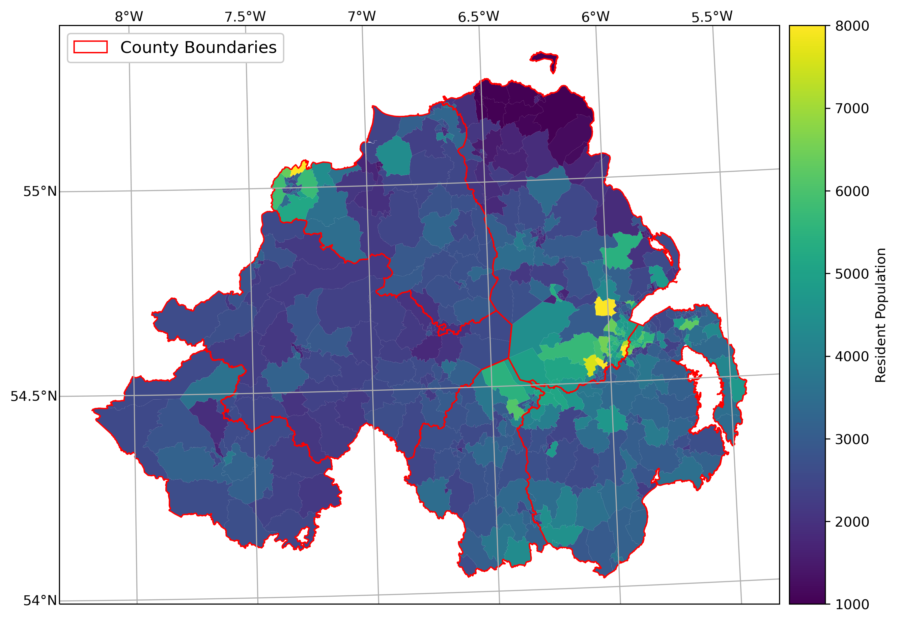

vector data using shapely and geopandas
=========================================

In this practical, you’ll gain some more experience working with vector data in python. You will learn about the different vector
data types available in the shapely package, and how we can use the geopandas package to perform different vector data
operations and analyses.

The practical this week is provided as a Jupyter Notebook, where you can interactively work through the different steps of
plotting the data. There is a second file, **exercise_script.py**, which you can modify to perform additional analyses, based on what
you’ve learned in the Jupyter Notebook and the mapping exercise in Practical 2.

.. note::

    In the main folder, you should also see an example script, **week3_example.py**. Be sure to try out the exercise, and see
    if you can't figure out a solution on your own, before having a look at the (one of many possible) solution offered there.

Getting Started
---------------

:doc:`Last week<week2>`, we saw how we can use **GitHub Desktop** to merge two branches (in this case, ``week2`` into ``main``).
This week, we're going to see how to do this using the command line.

To get started with this week’s practical, open Anaconda Navigator, then launch the **Command Prompt** - either from 
**Anaconda Navigator**(make sure that your egm722 environment is selected), or from the **Start Menu**.

When the **Command Prompt** opens, navigate to your repository folder using ``cd``, then type ``dir`` and press **Enter**. 
You should see something similar to the following:

**week 3 dir**

To merge the ``week3`` branch of our repository into ``main``, we'll use **git** from the command line. 

First, make sure that you’re on the ``week3`` branch by typing:
::

     git checkout week3

This will switch to the ``week3`` branch, if you are not already on it.

Remember that at the :ref:`start<desktop branches>` of last week's practical, we discussed the difference between
**local**, **origin**, and **upstream** branches: 

- **local** branches are the ones stored *local*\ ly on your computer,
- **origin** branches are the branches of your repository stored on GitHub,
- **upstream** branches are the branches of the repository that you forked the egm722 repository from (https://github.com/iamdonovan/egm722).

Sometimes, there may be changes to the **upstream** repository that we want to integrate into our local version of a repository. For
example, for this module I may have added an additional exercise to the practical in one week, and you want to make sure that you have
this before you **merge** that week's branch into the ``main`` branch.

To be able to keep track of the **upstream** changes, we need to make sure that our local repository knows where the **upstream** repository
is. First, double-check what **remote** (not **local**) repositories git is keeping track of by typing the following at the command line:
::

    git remote -v

This will list the **remote** repositories, and their nicknames. You should see an output like this:

**remote output**

If you only see **origin**, then we need to add the **upstream** remote location using ``git remote add``:
::

    git remote add upstream https://github.com/iamdonovan/egm722.git

This adds the URL for the **upstream** repository (https://github.com/iamdonovan/egm722.git) to our local configuration. You can check that this
worked by typing ``git remote -v`` again - you should now see two lines for the **upstream** repository:

**remote upstream added**

Now, we can tell **git** to specifically **pull** the **upstream** version of a particular branch:
::

    git pull upstream

This will **pull** (**fetch** and **merge**) the **upstream** version of the current branch (if it exists) into the **local**
version of the current branch.

We can also specify the branch we want to merge into the current branch:
::

    git pull upstream <branch>

For example, ``git pull upstream week3`` would merge the **upstream** ``week3`` branch into our current branch (``week3``).
Go ahead and enter this command now:
::

    git pull upstream week3

You should see the following output:

**week3 pull upstream**

This indicates that there's been no change to the **upstream** branch that isn't already in our **origin** branch, so we can safely
merge the **local** ``main`` and ``week3`` branches.

Now, switch back to the ``main`` branch:
::

    git checkout main

And enter the following command:
::

    git merge week3

This will open up a text editor:

**merge commit message**

To allow us to write a detailed commit message for our merge commit. For now, it's enough to leave this as-is. In the future,
you might want to make sure that you write out a more detailed message about the changes that are being integrated (and why).

Once you finish the message, you should see the following output:

**week 3 updates**

This tells us what files have been changed (``18 files``) and how (``854 insertions(+)``). Because none the files in the **Week3** 
folder were present in the ``main`` branch, we'll only see additions/insertions. As you work on your project and commit changes 
to existing files, you'll also see deletions (lines that are deleted or changed.

At this point, you can launch Jupyter Notebooks as you have in the previous weeks, and begin to work through the practical exercise.

Next steps
----------

Once you have finished the notebook and the exercise, make sure to send me an e-mail with some
ideas for your coding project. They do not have to be completely fleshed out, but you should try to have a general idea of what
you would like to work on for the final project – ideally, this will be something related to your work, or a potential MSc thesis
topic.

.. note::
    
    Below this point is the **non-interactive** text of the notebook. To actually run the notebook, you'll need to follow the instructions
    above to open the notebook and run it on your own computer!

....

Overview
--------

Up to now, you have gained some experience working with basic features
of python, and used cartopy and matplotlib to create a map. In each of
these practicals, you have loaded different vector datasets using a
module called geopandas. In this week’s practical, we’ll be looking at
working vector data in a bit more depth, including the different
geometry types available using shapely, analyses like spatial joins and
summarizing based on attributes, and how to reproject vector data from
one coordinate reference system to another.

Objectives
----------

-  Gain experience working with different vector data types using
   shapely
-  Use geopandas to re-project vector datasets from one coordinate
   reference system to another
-  Summarize features using the groupby method of a GeoDataFrame
-  Learn how to perform different vector data operations using geopandas
   and shapely

Data provided
-------------

In the data_files folder, you should have the following: - NI_roads.shp,
a shapefile of roads in Northern Ireland - Counties.shp, a shapefile of
county outlines for Northern Ireland - NI_Wards.shp, a shapefile of
electoral wards for Northern Ireland

1. Getting started
------------------

In this practical, we’ll be working with vector data. As a quick
refresher, the three main types of vector data that we will work with
are:

-  **Point**: point data represent a single point in space. For our
   purposes, points are either two-dimensional (x, y) or
   three-dimensional (x, y, z). In shapely, the corresponding **class**
   of data is a **Point**.
-  **Line**: lines are a sequence of at least two points that are joined
   together. In shapely, the corresponding **class** of data is known as
   a **LineString**.
-  **Polygon**: polygons are a sequence of at least three points that
   are connected to form a ring, as well as any additional rings that
   represent holes in the polygon. In shapely, the corresponding
   **class** of data is a **Polygon**.

We can also have **Collections** of vector data, where each feature
represents a collection of **Point**, **Line**, or **Polygon** objects.
In shapely, these are represented as **MultiPoint**,
**MultiLineString**, or **MultiPolygon** objects.

To get started, run the following cell to import geopandas and shapely.

.. code:: ipython3

    # this lets us use the figures interactively
    %matplotlib notebook
    
    import pandas as pd
    import geopandas as gpd
    from shapely.geometry import Point, LineString, Polygon

2. Shapely geometry types
-------------------------

2.1 Points
~~~~~~~~~~

As we saw in Week 1, to create a Point, we pass x, y (and optionally, z)
coordinates to the Point class constructor:

.. code:: ipython3

    pt = Point(-6.677, 55.150) # creates a 2d point with coordinates -6.677, 55.150
    pt2 = Point(-6.658, 55.213)
    
    pt3d = Point(86.925278, 27.988056, 8848.86) # creates a 3d point
    
    print(pt) # print a well-known text (WKT) representation of the Point object

The last line, ``print(pt)``, prints a
`well-known-text <https://en.wikipedia.org/wiki/Well-known_text_representation_of_geometry>`__
(WKT) representation of the **Point** object. WKT is a standard
representation of vector geometry objects - most ``python`` libraries
and GIS softwares are able to read and/or translate WKT into other
formats, such as ESRI Shapefiles, GeoJSON, etc.

Remember that in python, we can find the attributes and methods for an
object by looking up the documentation (for shapely, this can be found
`here <https://shapely.readthedocs.io/en/stable/manual.html>`__), or
using the built-in function ``dir()``. To find out more about a
particular function, we can use the built-in function ``help()`` (or, in
jupyter notebooks/ipython, the ``?`` operator).

As an example, let’s use the built-in function ``dir()`` to look at the
methods and attributes associated with the **Point** class:

.. code:: python

   In [1]: print(dir(pt))
   ['__and__', '__array_interface__', '__bool__', '__class__', '__del__', '__delattr__', '__dict__', '__dir__', '__doc__', '__eq__', '__format__', '__ge__', '__geo_interface__', '__geom__', '__getattribute__', '__gt__', '__hash__', '__init__', '__init_subclass__', '__le__', '__lt__', '__module__', '__ne__', '__new__', '__nonzero__', '__or__', '__p__', '__reduce__', '__reduce_ex__', '__repr__', '__setattr__', '__setstate__', '__sizeof__', '__str__', '__sub__', '__subclasshook__', '__weakref__', '__xor__', '_crs', '_ctypes_data', '_geom', '_get_coords', '_is_empty', '_lgeos', '_ndim', '_other_owned', '_repr_svg_', '_set_coords', 'almost_equals', 'area', 'array_interface', 'array_interface_base', 'boundary', 'bounds', 'buffer', 'centroid', 'contains', 'convex_hull', 'coords', 'covers', 'crosses', 'ctypes', 'difference', 'disjoint', 'distance', 'empty', 'envelope', 'equals', 'equals_exact', 'geom_type', 'geometryType', 'has_z', 'hausdorff_distance', 'impl', 'interpolate', 'intersection', 'intersects', 'is_closed', 'is_empty', 'is_ring', 'is_simple', 'is_valid', 'length', 'minimum_clearance', 'minimum_rotated_rectangle', 'overlaps', 'project', 'relate', 'relate_pattern', 'representative_point', 'simplify', 'svg', 'symmetric_difference', 'to_wkb', 'to_wkt', 'touches', 'type', 'union', 'within', 'wkb', 'wkb_hex', 'wkt', 'x', 'xy', 'y', 'z']

Here, in addition to the **special** or **magic** methods (denoted with
\_\_ at the beginning and end of the method name), there are a number of
methods that we might find useful, including ``Point.distance()``. To
see what this method does, we can use ``help(Point.distance)``:

.. code:: python

   In [2]: help(Point.distance)
   Help on method distance in module shapely.geometry.base:

   distance(other) method of shapely.geometry.point.Point instance
       Unitless distance to other geometry (float)

So, ``Point.distance()`` provides the distance from the point object to
some other geometry. Because shapely does not directly deal with
coordinate systems, this distance is **unitless**. This means that **we
have to make sure that the two objects have the same reference system -
if we do not, the distance returned will not make sense.** We will cover
working with coordinate reference systems later on in the practical.

Use the cell below to work out how we can access the x, y coordinates of
a Point object. Can you see more than one way to do this? If so, are
there differences between them?

One of the common operations we might want to do with a Point object is
to create a **buffer** around the point. In the list of associated
methods and attributes of Point objects above, you should see there is a
method called ``buffer``. A look at the help for this method:

.. code:: python

   In [3]: help(Point.buffer)
   Help on method buffer in module shapely.geometry.base:

   buffer(distance, resolution=16, quadsegs=None, cap_style=1, join_style=1, mitre_limit=5.0, single_sided=False) method of shapely.geometry.point.Point instance
       Get a geometry that represents all points within a distance
       of this geometry.
       
       A positive distance produces a dilation, a negative distance an
       erosion. A very small or zero distance may sometimes be used to
       "tidy" a polygon.
       
       Parameters
       ----------
       distance : float
           The distance to buffer around the object.
       resolution : int, optional
           The resolution of the buffer around each vertex of the
           object.
   ...

shows that ``buffer`` takes a **positional parameter** of *distance*, as
well as a number of **keyword parameters** that determine how the buffer
operation is done. Remember that the buffer distance will be in the same
coordinate system as our point - shapely does not, by itself, do any
conversion between coordinate systems or units.

Note that the object returned by buffer is a Polygon, rather than a
point - this makes sense, as the buffer is a two-dimensional surface
around the point location.

.. code:: ipython3

    pt_buffer = pt.buffer(0.001)
    print(type(pt_buffer))

2.2. LineStrings
~~~~~~~~~~~~~~~~

Instead of using a single x, y coordinate pair, a **LineString** object
takes either a list of **Point** objects, or a list of coordinate
**tuples**:

.. code:: ipython3

    line1 = LineString([pt, pt2]) # method one of creating a LineString, using a list of Point objects
    line2 = LineString([(-6.677, 55.150), (-6.658, 55.213)]) # method two, using a list of coordinate tuples
    
    print(line1)
    print(line2)
    
    line1.equals(line2) # check to see if these are the same geometry

The coordinates of a **LineString** are stored as a **tuple** in an
attribute called **xy**. The **tuple** has two items representing the X
and Y coordinate values. If we want the x and y coordinates as separate
variables, we can access them using their respective indices:

.. code:: python

   In [4]: x = line1.xy[0]
   In [5]: y = line1.xy[1]

We can also combine this using **tuple assignment**, or **unpacking**,
which assigns values from a **tuple** on the right-hand side of the
assignment to a comma-separated grouping of variables on the left-hand
side:

.. code:: ipython3

    x, y = line1.xy
    
    print(x)
    print(y)

**LineString** objects have a number of the same methods that **Point**
objects do, including ``buffer`` and ``distance``. **LineString**
objects also have a ``length`` (just like with distance, it is
**unitless**):

.. code:: ipython3

    print(line1.length)

We can also find the ``centroid`` (center) of the **LineString**:

.. code:: ipython3

    center = line1.centroid # get the centerpoint of the line
    print(line1.centroid)

The last two methods of **LineString** objects that we will explore for
now are ``project`` and ``interpolate``:

.. code:: python

   In [6]: help(LineString.project)
   Help on function project in module shapely.geometry.base:

   project(self, other, normalized=False)
       Returns the distance along this geometry to a point nearest the
       specified point
       
       If the normalized arg is True, return the distance normalized to the
       length of the linear geometry.

So ``project`` returns the distance along the **LineString** that comes
closest to the **Point** (or other object). ``interpolate``, on the
other hand, does something a bit different:

.. code:: python

   In [7]: help(LineString.interpolate)
   Help on function interpolate in module shapely.geometry.base:

   interpolate(self, distance, normalized=False)
       Return a point at the specified distance along a linear geometry
       
       Negative length values are taken as measured in the reverse
       direction from the end of the geometry. Out-of-range index
       values are handled by clamping them to the valid range of values.
       If the normalized arg is True, the distance will be interpreted as a
       fraction of the geometry's length.

it returns the point along the line at a specified distance; the
distance can be in the units of the **LineString**\ ’s coordinates
(``normalized=False``), or it can be as a fraction of the total length
of the **LineString** (``normalized=True``).

.. code:: ipython3

    line1.project(center) / line1.length # check to see how far along the line our centerpoint is
    
    print(center)
    print(line1.interpolate(0.5, normalized=True))

2.3. Polygons
~~~~~~~~~~~~~

The last basic geometry type we will look at in this practical are
**Polygon** objects. Similar to **LineString** objects, we can create a
**Polygon** object using a list of coordinate pairs, or a list of
**Point** objects:

.. code:: ipython3

    poly1 = Polygon([(-6.677, 55.150), (-6.658, 55.213), (-6.722, 55.189)])
    poly2 = Polygon([pt, pt2, Point(-6.722, 55.189)])
    
    print(poly1) # print a well
    print(poly2)
    print(poly1.equals(poly2))

Note that even though we only passed three **Point** objects (or
coordinate pairs) to the **Polygon** constructor, the **Polygon** has
four vertices, with the first and last vertex being the same - this is
because the **Polygon** exterior is *closed*. Note also the double
parentheses - this is because a **Polygon** potentially has two sets of
coordinates - the *Shell*, or *exterior*, and *holes*, or *interiors*.
To create a **Polygon** with a hole in it, we would need to pass a list
of coordinates that describe the *holes*:

.. code:: ipython3

    polygon_with_hole = Polygon(shell=[(-6.677, 55.150), (-6.658, 55.213), (-6.722, 55.189)],
                                holes=[[(-6.684, 55.168), (-6.704, 55.187), (-6.672, 55.196)]]) # note the double brackets
    
    print(polygon_with_hole)

Note the double brackets in the ``holes`` keyword argument - this is
necessary, because ``holes`` is expecting a sequence of coordinate
sequences that describe the *holes* - effectively, a list of **Polygon**
shells.

Accessing the coordinates of a **Polygon** object is a little more
complicated than it is for **Point** and **LineString** objects - this
is because **Polygon** objects have two sets of coordinates, the
exterior (*shell*) and interior (*holes*). But, the ``exterior``
attribute of the **Polygon** is just a **LinearRing** (a special case of
**LineString** where the first and last coordinates are the same), and
the ``interiors`` attribute is an **InteriorRingSequence** (basically, a
collection of **LinearRings** that have to obey `additional
rules <https://shapely.readthedocs.io/en/stable/manual.html#polygons>`__):

.. code:: ipython3

    print(polygon_with_hole.exterior) # this is a single LinearRing
    for lr in polygon_with_hole.interiors: # this is potentially multiple LinearRing objects
        print(lr)

**Polygon** objects have nonzero ``area`` and non-zero ``length``
(perimeter) - as with the equivalent attributes for **Point** and
**LineString** objects, these are **unitless**. **Polygon** objects also
have a ``centroid``, and we can bound the geometry using *either* the
minimum bounding box parallel to the coordinate axes (``envelope``), or
a rotated minimum bounding box (``minimum_rotated_rectangle``):

.. code:: ipython3

    print('perimeter: ', poly1.length) # print the perimeter
    print('area: ', poly1.area) # print the area
    print('centroid: ', poly1.centroid) # get the centerpoint of the rectangle
    print('bounding coordinates: ', poly1.bounds) # get the minimum x, minimum y, maximum x, maximum y coordinates
    print('bounding box: ', poly1.envelope) # get the minimum bounding rectangle of the polygon, parallel to the coordinate axes
    print('rotated bounding box: ', poly1.minimum_rotated_rectangle) # get the smallest possible rectangle that covers the polygon

There are a number of additional methods that we will cover more as we
continue through the practicals - for now, this should be enough to give
an idea for how these geometry objects work.

2.4 Interactions between geometry objects
~~~~~~~~~~~~~~~~~~~~~~~~~~~~~~~~~~~~~~~~~

``shapely`` also provides a number of methods that we can use to check
the spatial relationship between different objects. For example, the
following code shows how we can use the ``contains``
`method <https://shapely.readthedocs.io/en/stable/manual.html#object.contains>`__
of a shapely geometry object to see whether a **Point** (or other
geometry) is located fully within the object:

.. code:: ipython3

    poly = Polygon([(0, 0), (2, 0), (2, 3), (0, 3)])
    pt1 = Point(0, -0.1)
    pt2 = Point(1, 1)
    
    print(poly.contains(pt1))
    print(poly.contains(pt2))

We can also check to see whether two geometry objects
`intersect <https://shapely.readthedocs.io/en/stable/manual.html#object.intersects>`__
using the ``intersects`` method. To actually get the intersection of the
two geometries, we use the ``intersection`` method, which returns the
geometry of the intersection (whether this is a **Point**, a
**LineString**, a **Polygon**, or a mixed collection of geometries
depends on the geometries and how they intersect):

.. code:: ipython3

    line1 = LineString([(0, 0), (1, 1)])
    line2 = LineString([(0, 1), (1, 0)])
    
    print(line1.intersects(line2)) # intersects() returns True if the geometries touch/intersect/overlap, False otherwise
    print(line1.intersects(poly))
    print(line1.intersection(line2)) # if the geometries intersect, this will be the Point(s) of intersection

There are a number of other methods provided by ``shapely`` that we can
use to determine the relationship between geometry objects, including
``touches``, ``within``, and ``overlaps``. Have a look at the full list
from the `shapely user
manual <https://shapely.readthedocs.io/en/stable/manual.html>`__ to see
the rest.

3. geopandas GeoDataFrames
--------------------------

We have used geopandas in the past two practicals to read provided
shapefiles and work with the data they contain - in Practical 1, we
translated a comma-separated variable (CSV) file into a shapefile, and
in Practical 2, we read shapefile data and plotted it on a map using
``cartopy``.

This week, we will extend this introduction to look at how we can use
geopandas to do various GIS analyses, such as spatial joins and clipping
operations, as well as projecting from one coordinate reference system
to another.

To begin, load the **NI_roads** dataset from the **data_files** folder
and print the **header** (first 5 lines of the **GeoDataFrame**):

.. code:: ipython3

    roads = gpd.read_file('data_files/NI_roads.shp')
    print(roads.head())

So this dataset has three columns: **SURVEY**, **Road_class**, and
**geometry**. Note that each of the geometries is a **LineString**
object, which means…

3.1 Coordinate reference systems using PROJ
~~~~~~~~~~~~~~~~~~~~~~~~~~~~~~~~~~~~~~~~~~~

To start with, let’s see if we can figure out how many kilometers of
motorway are represented in the dataset - i.e., the sum of the length of
all of the **LineString** objects that have the attribute *MOTORWAY*.
First, Let’s check what the coordinate reference system (CRS) of our
**GeoDataFrame** is, using the ``crs`` attribute:

.. code:: ipython3

    roads.crs

So this dataset has a *Geographic* coordinate reference system,
**EPSG:4326**. EPSG codes (originally organized by the European
Petroleum Survey Group) are a common way of working with coordinate
reference systems. Each CRS in the `EPSG
registry <https://epsg.org/home.html>`__ has a unique code and standard
well-known text representation.

The ``crs`` attribute of the **GeoDataFrame** is actually a
**pyproj.CRS** object.
`pyproj <https://pyproj4.github.io/pyproj/stable/>`__ is a python
interface to the `PROJ <https://proj.org/>`__ library, which is a
software for transforming geospatial coordinates from one CRS to
another.

Each **pyproj.CRS** object provides a number of methods for converting
to different formats, including well-known text, EPSG codes, JavaScript
Object Notation (JSON), and PROJ string (i.e.,
``'+proj=longlat +datum=WGS84 +no_defs +type=crs'``).

Because this is a *Geographic* CRS, the length information provided by
``LineString.length`` will also be in geographic units, which doesn’t
really make sense for us - we first have to convert the **GeoDataFrame**
to a different CRS. To do this, we can use the method ``to_crs``:
::

   In [8]: help(roads.to_crs)
   Help on method to_crs in module geopandas.geodataframe:

   to_crs(crs=None, epsg=None, inplace=False) method of geopandas.geodataframe.GeoDataFrame instance
       Transform geometries to a new coordinate reference system.
       
       Transform all geometries in an active geometry column to a different coordinate
       reference system.  The ``crs`` attribute on the current GeoSeries must
       be set.  Either ``crs`` or ``epsg`` may be specified for output.
       
       This method will transform all points in all objects. It has no notion
       or projecting entire geometries.  All segments joining points are
       assumed to be lines in the current projection, not geodesics. Objects
       crossing the dateline (or other projection boundary) will have
       undesirable behavior.

So, to transform the **GeoDataFrame** to a different CRS, we have to
provide either a CRS or an EPSG code. We can also choose to do this in
place (``inplace=True``), or assign the output to a new **GeoDataFrame**
object (``inplace=False``). Let’s transform the **GeoDataFrame** to
Irish Transverse Mercator, and assign the output to a new variable,
**roads_itm**.

Using the search function on the\ `EPSG
registry <https://epsg.org/search/by-name>`__\ , or using an internet
search, look up the EPSG code for the Irish Transverse Mercator CRS and
enter it in the method call below:

.. code:: ipython3

    roads_itm = roads.to_crs(epsg=)
    
    print(roads_itm.head())

Note that only the **geometry** column has changed - instead of
geographic coordinates (e.g., (-6.21243, 54.48706)), the points in each
**LineString** should be in a projected CRS (e.g., (715821.764,
861315.722)). Now, when we access the ``length`` attributes of our
**LineString** objects, the units will be in meters (the same units as
our CRS).

3.2 Summarizing data using geopandas
~~~~~~~~~~~~~~~~~~~~~~~~~~~~~~~~~~~~

So that’s the first part of our problem solved - our coordinates are in
meters, and the lengths will be as well. The next step is to select all
of the features that correspond to Motorways and sum the lengths. We saw
an example of this in Practical 1 - we can slice the **GeoDataFrame** by
returning all of the rows where ``'Road_class' == 'MOTORWAY'``:

.. code:: ipython3

    roads_itm[roads_itm['Road_class'] == 'MOTORWAY']

But first, we might want to add a column to our **GeoDataFrame** that
contains the ``length`` of each of the features. To do this, we can
*iterate* over the rows of the **GeoDataFrame** using the ``iterrows``
method:
::

   In [9]: help(roads_itm.iterrows)
   Iterate over DataFrame rows as (index, Series) pairs.

   Yields
   ------
   index : label or tuple of label
       The index of the row. A tuple for a `MultiIndex`.
   data : Series
       The data of the row as a Series.
   ...

Because ``iterrows`` returns an (index, Series) pair at each step, we
use **tuple assignment** in our ``for`` loop. This gives us two
variables, ``i`` and ``row``, which we can use in the ``for`` loop.
``i`` corresponds to the ``index`` of the ``row``, while ``row``
corresponds to the actual data of the ``row``, with each of the columns
that the full **GeoDataFrame** has.

We can access each column in the same way that we do for the full
**GeoDataFrame** - either ``row[column]`` or ``row.column``. We can
assign a new column in the original **GeoDataFrame** using the ``.loc``
`property <https://pandas.pydata.org/pandas-docs/stable/reference/api/pandas.DataFrame.loc.html>`__,
which uses either a *label* or a **Boolean array** to index the
**GeoDataFrame**. So the line below,

.. code:: python

   roads_itm.loc[i, 'Length'] = row['geometry'].length

assigns the ``length`` property of the row’s geometry to a new column,
**Length**, at the corresponding index. Putting it all together, it
looks like this:

.. code:: ipython3

    for i, row in roads_itm.iterrows(): # iterate over each row in the GeoDataFrame
        roads_itm.loc[i, 'Length'] = row['geometry'].length # assign the row's geometry length to a new column, Length
        
    print(roads_itm.head()) # print the updated GeoDataFrame to see the changes

Finally, we can subset our **GeoDataFrame** to select only *MOTORWAY*
features, and sum their length:

.. code:: ipython3

    sum_roads = roads_itm['Length'].sum()
    sum_motorway = roads_itm[roads_itm['Road_class'] == 'MOTORWAY']['Length'].sum()
    print('{:.2f} total m of roads'.format(sum_roads))
    print('{:.2f} total m of motorway'.format(sum_motorway))

In the cell above, look at the ``print`` function argument:

.. code:: python

   print('{:.2f} total m of motorway'.format(sum_motorway))

Here, we use the ``format`` `string
method <https://docs.python.org/3.8/library/string.html#format-string-syntax>`__
and curly braces ({ }) to insert the value of our ``sum_motorway``
variable. Note that within the curly braces, there is a *format
specification* - rather than printing the string in an unformatted way
(which would contain a lot of extra decimal places), we can tell the
``format`` method to clean up the output using ``:`` and a `format
specification <https://docs.python.org/3.8/library/string.html#formatspec>`__.
In this case, ``.2f`` tells the ``format`` method format the number to
have 2 places after the decimal.

Let’s say now that we want to find the sum of all of the different road
classes in our dataset. We could, of course, repeat the exercise above
for each of the different values of *Road_class*. But, **pandas** (and
by extension, **geopandas**) provide a nicer way to summarize data based
on certain properties: the ``groupby``
`method <https://pandas.pydata.org/pandas-docs/stable/reference/api/pandas.DataFrame.groupby.html>`__.
The ``groupby`` method returns an object that contains information about
the groups; to see different properties, we can call methods like
``mean``, ``median``, ``sum``, etc.

If we want to summarize our dataset by *Road_class* and find the ``sum``
of the *Length* of each group, then, it would like this:

.. code:: ipython3

    roads_itm.groupby(['Road_class'])['Length'].sum() / 1000 # convert to km

The ``groupby`` method returns a **GeoDataFrame**, which we can then
index to return a single column, *Length*. As this is a numeric column,
we can also use arithmetic on it to divide by a conversion factor. The
``groupby`` method is a very useful way to quickly summarize a
**DataFrame** (or a **GeoDataFrame** - remember that this is a **child**
class of **DataFrame**).

4. Spatial data operations using geopandas and shapely
------------------------------------------------------

Oftentimes in GIS analysis, we want to summarize our data spatially, as
well as thematically. In this section, we will be looking at two
examples of this kind of analysis: first, using a `spatial
join <https://gisgeography.com/spatial-join/>`__, and second, using a
clipping operation.

The cell below will load the Counties shapefile in **data_files** and
test whether the CRS of the ``counties`` **GeoDataFrame** is the same as
the CRS of the ``roads_itm`` **GeoDataFrame**. Remember that the
**shapely** geometry objects in the **GeoDataFrame** don’t have any
inherent information about the CRS of the object. So, in order to
perform operations like a spatial join, we have to first ensure that the
two **GeoDataFrame** objects have the same CRS.

If, when you first load the shapefile, the test below returns False,
write a line of code that will ensure that the test returns True.

.. code:: ipython3

    counties = gpd.read_file('data_files/Counties.shp') # load the Counties shapefile
    # your line of code might go here.
    print(counties.crs == roads_itm.crs) # test if the crs is the same for roads_itm and counties.

Now that the two **GeoDataFrame** objects have the same CRS, we can
proceed with the spatial join using ``gpd.sjoin``:

.. code:: ipython3

    join = gpd.sjoin(counties, roads_itm, how='inner', lsuffix='left', rsuffix='right') # perform the spatial join
    join # show the joined table

Now, we can see that our table has additional columns - we have the
unnamed *index*, *COUNTY_ID*, *CountyName*, *Area_SqKM*, *OBJECTID*, and
*geometry* from the ``counties`` **GeoDataFrame**, and *index_right*
(because it has the same name as *index* in the left **GeoDataFrame**),
*SURVEY*, *Road_class*, and *Length* from the ``roads_itm``
**GeoDataFrame**.

Like we did with ``roads_itm``, we can again summarize our
**GeoDataFrame** using ``groupby``; this time, we’ll use the
*CountyName* property to see the total length of roads by each county,
and by *Road_class*:

.. code:: ipython3

    join_total = join['Length'].sum() # find the total length of roads in the join GeoDataFrame
    print(join.groupby(['CountyName', 'Road_class'])['Length'].sum() / 1000) # summarize the road lengths by CountyName, Road_class
    
    print(sum_roads / join_total) # check that the total length of roads is the same between both GeoDataFrames; this should be 1.

We can see that the total length of roads is **not** the same in both
**GeoDataFrame** objects - our ``join`` **GeoDataFrame** has somehow
increased the length of roads.

In reality, what has happened here is that we have double-counted any
road feature that is located in multiple counties - you can also see
this by comparing the total number of objects in the ``join``
**GeoDataFrame** and the ``roads_itm`` **GeoDataFrame**. Obviously, we
don’t want to double-count roads - to get around this, we can use the
``gpd.clip`` method to clip ``roads_itm`` to each of the county
boundaries in the ``counties`` **GeoDataFrame**:
::

   In [10]: help(gpd.clip)
   Help on function clip in module geopandas.tools.clip:

   clip(gdf, mask, keep_geom_type=False)
       Clip points, lines, or polygon geometries to the mask extent.
       
       Both layers must be in the same Coordinate Reference System (CRS).
       The `gdf` will be clipped to the full extent of the clip object.
       
       If there are multiple polygons in mask, data from `gdf` will be
       clipped to the total boundary of all polygons in mask.
   ...

But, we have to do this for each of the boundaries - ``gpd.clip`` will
take the total boundary for the **GeoDataFrame** if there are multiple
**Polygon** objects. Using a ``for`` loop to loop over the ``counties``
**GeoDataFrame**, we can clip ``roads_itm`` to each county, and combine
the results in another **GeoDataFrame**:

.. code:: ipython3

    clipped = [] # initialize an empty list
    for county in counties['CountyName'].unique():
        tmp_clip = gpd.clip(roads_itm, counties[counties['CountyName'] == county]) # clip the roads by county border
        for i, row in tmp_clip.iterrows():
            tmp_clip.loc[i, 'Length'] = row['geometry'].length # we have to update the length for any clipped roads
            tmp_clip.loc[i, 'CountyName'] = county # set the county name for each road feature    
        clipped.append(tmp_clip) # add the clipped GeoDataFrame to the 
    
    # pandas has a function, concat, which will combine (concatenate) a list of DataFrames (or GeoDataFrames)
    # we can then create a GeoDataFrame from the combined DataFrame, as the combined DataFrame will have a geometry column.
    clipped_gdf = gpd.GeoDataFrame(pd.concat(clipped))
    clip_total = clipped_gdf['Length'].sum()
    
    sum_roads / clip_total # check that the total length of roads is the same between both GeoDataFrames; this should be close to 1.

So we don’t have perfect overlap, but this has more to do with the fact
that there isn’t perfect overlap between the ``counties`` boundary and
the ``roads`` features - there are a good number of places where the
roads extend beyond the boundary. To fix this, we could first clip
``roads_itm`` to the entire ``counties`` **GeoDataFrame**, which would
eliminate these extraneous stretches of road. For now, though, agrement
to within .01% is acceptable for our purposes - much better than the
1.5% disagreement from the spatial join alone.

To wrap up, write a line or two of code in the cell below that will
summarize the ``clipped_gdf`` GeoDataFrame by county and road type.
Which county has the most Motorways? The most roads in total?

.. code:: ipython3

    # your code goes here!

5. Exercise and next steps
--------------------------

Now that you’ve gained some experience working with ``shapely`` geometry
objects and ``geopandas`` **GeoDataFrame** objects, have a look at
**exercise_script.py** in this folder. Using the topics covered in the
Week 2 practical and this practical, modify this script to do the
following: 1. Load the counties and ward data 2. Using a spatial join,
summarize the total population by county. What county has the highest
population? What about the lowest? 3. Create a map like the one below to
show population information by census area, with the county boundaries
plotted overtop of the chloropleth map.

Additional exercise questions
~~~~~~~~~~~~~~~~~~~~~~~~~~~~~

1. Are there any Wards that are located in more than one county? If so,
   how many, and what is the total population of these Wards?
2. What Ward has the highest population? What about the lowest
   population?
3. Repeat the exercise above using **exercise_script.py**, but this time
   use the population density (in number of residents per square km).
