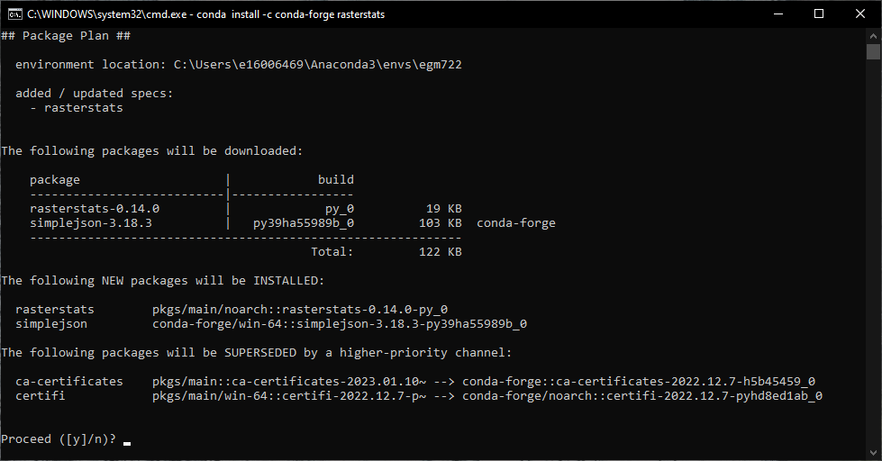
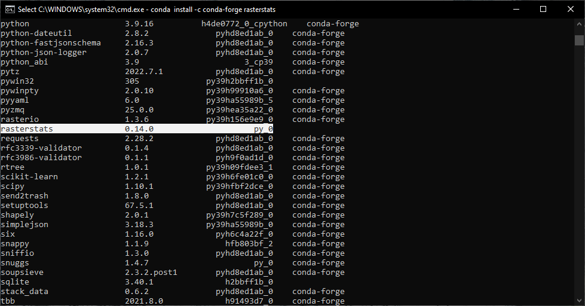

vector and raster operations using python
===========================================

In this practical, we’ll see how we can combine vector and raster data for different analyses, including computing
zonal statistics for a raster, and rasterizing a vector dataset.

The practical this week is provided as a Jupyter Notebook, which you can use to interactively work through the
different steps of the practical.

Getting Started
---------------

To get started with this week’s practical, you'll need to first **merge** the ``week5`` branch into the ``main`` branch,
using **one** of the methods we've seen in previous weeks:

- using **GitHub Desktop** [:doc:`week2<week2>`]
- using the **git** command-line interface [:doc:`week3<week3>`]
- using a **Pull Request** [:doc:`week4<week4>`]

Make sure that you have merged ``week5`` into ``main`` using one of the methods outlined above before starting the
practical.

The other thing you'll need to do before starting this week's practical is install a new python package,
**rasterstats**, using **conda** via the command prompt.

.. note::

    You can also install this package using **Anaconda Navigator**, as we did during the Week 4 SentinelSat exercise,
    but the following instructions are designed to give you some more experience using the **conda** CLI.

To do this, open the ``egm722`` command prompt, then type the following command:

.. code-block:: text

    conda install -c conda-forge rasterstats

Press **Enter**. You should see something like the following (it may take a minute):



Type ``y`` and press **Enter**, and **conda** will install **rasterstats** into your current environment (``egm722``).
Enter the following command:

.. code-block:: text

    conda list

You should see **rasterstats** included in the output of this command (you may need to scroll up to see it):



At this point, you can launch Jupyter Notebooks from the command prompt, or from Anaconda Navigator, and begin to work
through the notebook.

.. note::
    
    Below this point is the **non-interactive** text of the notebook. To actually run the notebook, you'll need to
    follow the instructions above to open the notebook and run it on your own computer!

....

Nick Cassavetes
------------------


Overview
..........

Up to now, we have worked with either vector data or raster data, but we
haven’t really used them together. In this week’s practical, we’ll learn
how we can combine these two data types, and see some examples of
different analyses, such as zonal statistics or sampling raster data,
that we can automate using python.

Objectives
...........

-  learn how to use ``rasterstats`` to perform zonal statistics
-  learn how to handle exceptions using try…except
-  rasterize polygon data using ``rasterio``
-  learn how to mask and select (index) rasters using vector data
-  see additional plotting examples using matplotlib

Data provided
..............

In the data_files folder, you should have the following:

- LCM2015_Aggregate_100m.tif
- NI_DEM.tif

1. Getting started
....................

In this practical, we’ll look at a number of different GIS tasks related
to working with both raster and vector data in python, as well as a few
different python and programming concepts. To get started, run the cell
below.

.. code:: ipython3

    %matplotlib notebook
    
    import numpy as np
    import rasterio as rio
    import geopandas as gpd
    import matplotlib.pyplot as plt
    from rasterstats import zonal_stats
    
    plt.rcParams.update({'font.size': 22}) # update the font size for our plots to be size 22

2. Zonal statistics
.....................

In GIS, `zonal
statistics <https://pro.arcgis.com/en/pro-app/latest/tool-reference/spatial-analyst/how-zonal-statistics-works.htm>`__
is a process whereby you calculate statistics for the pixels of a raster
in different groups, or zones, defined by properties in another dataset.
In this example, we’re going to use the Northern Ireland County border
dataset from Week 2, along with a re-classified version of the Northern
Ireland `Land Cover
Map <https://catalogue.ceh.ac.uk/documents/47f053a0-e34f-4534-a843-76f0a0998a2f>`__
2015\ [1]_.

The Land Cover Map tells, for each pixel, what type of land cover is
associated with a location - that is, whether it’s woodland (and what
kind of woodland), grassland, urban or built-up areas, and so on. For
our re-classified version of the dataset, we’re working with the
aggregate class data, re-sampled to 100m resolution from the original
25m resolution.

The raster data type is *unsigned integer* with a *bitdepth* of 8 bits -
that is, it has a range of possible values from 0 to 255. Even though it
has this range of possible values, we only use 10 (11) of them:

============ ==========================
Raster value Aggregate class name
============ ==========================
0            No Data
1            Broadleaf woodland
2            Coniferous woodland
3            Arable
4            Improved grassland
5            Semi-natural grassland
6            Mountain, heath, bog
7            Saltwater
8            Freshwater
9            Coastal
10           Built-up areas and gardens
============ ==========================

In this part of the practical, we’ll try to work out the percentage of
the entire country that is covered by each of these different
landcovers, as well as each of the different counties. To start, we’ll
load the ``LCM2015_Aggregate_100m.tif`` raster, as well as the counties
shapefile from Week 2:

.. code:: ipython3

    # open the land cover raster and read the data
    with rio.open('data_files/LCM2015_Aggregate_100m.tif') as dataset:
        xmin, ymin, xmax, ymax = dataset.bounds 
        crs = dataset.crs
        landcover = dataset.read(1)
        affine_tfm = dataset.transform
    
    # now, load the county dataset from the week 2 folder
    counties = gpd.read_file('../Week2/data_files/Counties.shp').to_crs(crs)

Next, we’ll define a function that takes an array, and returns a
**dict** object containing the count (number of pixels) for each of the
unique values in the array:

.. code:: python

   def count_unique(array, nodata=0):
       '''
       Count the unique elements of an array.

       :param array: Input array
       :param nodata: nodata value to ignore in the counting
       
       :returns count_dict: a dictionary of unique values and counts
       '''
       count_dict = {}
       for val in np.unique(array):
           if val == nodata:
               continue
           count_dict[str(val)] = np.count_nonzero(array == val)
       return count_dict

Here, we have two input parameters: the first, ``array``, is our array
(or raster data). The next, ``nodata``, is the value of the array that
we should ignore. We then define an empty **dict**
(``count_dict = {}``).

With
```numpy.unique()`` <https://numpy.org/doc/stable/reference/generated/numpy.unique.html>`__,
we get an array containing the unique values of the input array. Note
that this works for data like this raster, where we have a limited
number of pre-defined values. For something like a digital elevation
model, which represents continuous floating-point values, we wouldn’t
want to use this approach to bin the data.

Next, for each of the different unique values ``val``, we find all of
the locations in ``array`` that have that value (``array == val``). Note
that this is actually a boolean array, with values of either ``True``
where ``array == val``, and ``False`` where ``array != val``.
```numpy.count_nonzero()`` <https://numpy.org/doc/stable/reference/generated/numpy.count_nonzero.html>`__
the counts the number of non-zero (in this case, ``True``) values in the
array - that is, this:

.. code:: python

   np.count_nonzero(array == val)

tells us the number of pixels in ``array`` that are equal to ``val``. We
then assign this to our dictionary with a key that is a **str**
representation of the value, before returning our ``count_dict``
variable at the end of the function.

Run the cell below to define the function and run it on our
``landcover`` raster.

.. code:: ipython3

    def count_unique(array, nodata=0):
        '''
        Count the unique elements of an array.
    
        :param array: Input array
        :param nodata: nodata value to ignore in the counting
        
        :returns count_dict: a dictionary of unique values and counts
        '''
        count_dict = {}
        for val in np.unique(array):
            if val == nodata:
                continue
            count_dict[str(val)] = np.count_nonzero(array == val)
        return count_dict
    
    unique_landcover = count_unique(landcover)
    print(unique_landcover)

So this provides us with a **dict** object with keys corresponding to
each of the unique values (1-10).

Can you work out the percentage area of Northern Ireland that is covered
by each of the 10 landcover classes?


In the following cell, we use
```rasterstats.zonal_stats()`` <https://pythonhosted.org/rasterstats/manual.html#zonal-statistics>`__
with our ``counties`` and ``landcover`` datasets to do the same exercise
as above (counting unique pixel values). Rather than counting the pixels
in the entire raster, however, we want to count the number of pixels
with each land cover value that fall within a specific area defined by
the features in the ``counties`` dataset:

.. code:: ipython3

    county_stats = zonal_stats(counties, landcover, affine=affine_tfm, categorical=True, nodata=0)
    
    print(county_stats[0])

3. The zip built-in
.....................

This isn’t a very readable result, though. If we want to interpret the
results for each county, we have to know what land cover name
corresponds to each of the values in the raster. One way that we could
do this is by writing a function that re-names each of the keys in the
**dict**. This example shows one way we could do this: the function
takes the original **dict** object (*dict_in*), as well as a list of the
‘old’ keys (*old_names*), and the corresponding ‘new’ keys
(*new_names*).

.. code:: ipython3

    def rename_dict(dict_in, old_names, new_names):
        '''
        Rename the keys of a dictionary, given a list of old and new keynames
    
        :param dict_in: the dictionary to rename
        :param old_names: a list of old keys
        :param new_names: a list of new key names
        
        :returns dict_out: a dictionary with the keys re-named
        '''
        dict_out = {}
        for new, old in zip(new_names, old_names):
            dict_out[new] = dict_in[old]
    
        return dict_out

For this function, we’re also making use of the built-in function
``zip()``
(`documentation <https://docs.python.org/3.8/library/functions.html#zip>`__).
In Python 3, ``zip()`` returns an **iterator** object that combines
elements from each of the iterable objects passed as arguments. As an
example:

.. code:: ipython3

    x = [1, 2, 3, 4]
    y = ['a', 'b', 'c', 'd']
    
    list(zip(x, y))

So, with ``zip(x, y)``, each of the elements of ``x`` is paired with the
corresponding element from ``y``. If ``x`` and ``y`` are different
lengths, ``zip(x, y)`` will only use up to the shorter of the two:

.. code:: ipython3

    x = [1, 2, 3]
    
    list(zip(x, y))

Let’s see what happens when we run our function ``rename_dict()`` using
the stats for our first county (County Tyrone - remember that the output
from zonal_stats will have correspond to the rows of our input vector
data):

.. code:: ipython3

    old_names = [float(i) for i in range(1, 11)]
    new_names = ['Broadleaf woodland', 'Coniferous woodland', 'Arable', 'Improved grassland',
                 'Semi-natural grassland', 'Mountain, heath, bog', 'Saltwater', 'Freshwater',
                 'Coastal', 'Built-up areas and gardens']
    
    rename_dict(county_stats[0], old_names, new_names)

Have a look at the *keys* for ``county_stats`` - you should notice that
there are no pixels corresponding to landcover class 7 (Saltwater),
which makes sense given that County Tyrone is an inland county:

.. code:: ipython3

    print(county_stats[0].keys())
    print(county_stats[0])

To run this for each of our counties, we could run some checks to make
sure that we only try to access keys that exist in ``dict_in``. For
example, we could add an ``if`` statement to the function:

.. code:: python

   def rename_dict(dict_in, old_names, new_names):
       dict_out = {}
       for new, old in zip(new_names, old_names)
           if old in dict_in.keys():
               dict_out[new] = dict_in[old]
           else:
               continue
       return dict_out

But, this is also an example of an exception that isn’t necessarily
something that requires us to stop executing our program. We don’t
expect each landcover type to be present in each county, so we don’t
want our program to stop as soon as it finds out that one of the
counties doesn’t have a particular landcover type.

4. Handling Exceptions with try … except
..........................................

Python provides a way to handle these kind of exceptions: the
`try…except <https://realpython.com/python-exceptions/#the-try-and-except-block-handling-exceptions>`__
block:

.. code:: python


   try:
       # run some code
   except:
       # run this if the try block causes an exception

In general, it’s `not
recommended <https://www.python.org/dev/peps/pep-0008/#programming-recommendations>`__
to just have a bare ``except:`` clause, as this will make it harder to
interrupt a program. In our specific case, we only want the interpreter
to ignore ``KeyError`` exceptions - if there are other problems, we
still need to know about those:

.. code:: ipython3

    def rename_dict(dict_in, old_names, new_names):
        '''
        Rename the keys of a dictionary, given a list of old and new keynames
    
        :param dict_in: the dictionary to rename
        :param old_names: a list of old keys
        :param new_names: a list of new key names
        
        :returns dict_out: a dictionary with the keys re-named
        '''
        dict_out = {}
        for new, old in zip(new_names, old_names):
            try:
                dict_out[new] = dict_in[old]
            except KeyError:
                continue
        return dict_out

Notice how for each pair of names, we try to assign the value
corresponding to ``old`` in ``dict_in``. If ``old`` is not a valid key
for ``dict_in``, we just move onto the next one. Now, let’s run this new
function on ``county_stats[0]`` again:

.. code:: ipython3

    rename_dict(county_stats[0], old_names, new_names)

We’ll do one last thing before moving on here. Just like with the
**dict** outputs of ``zonal_stats()``, the **list** of **dict** objects
isn’t very readable. Let’s create a new **dict** object that takes the
county names as keys, and returns the re-named **dict** objects for
each:

.. code:: ipython3

    renamed_list = [rename_dict(d, old_names, new_names) for d in county_stats] # create a list of renamed dict objects
    nice_names = [n.title() for n in counties.CountyName]
    stats_dict = dict(zip(nice_names, renamed_list))
    
    print(stats_dict['Tyrone'])
    print(stats_dict['Antrim'])

Depending on how we’re using the data, it might be easier to keep the
output of ``zonal_stats()`` as-is, rather than using these long,
complicated keys. For visualization and readability purposes, though, it
helps to be able to easily and quickly understand what the outputs
actually represent.

What is the total area (in km2) covered by “Mountain, heath, bog” in
County Down?


5. Rasterizing vector data using rasterio
............................................

``rasterstats`` provides a nice tool for quickly and easily extracting
zonal statistics from a raster using vector data. Sometimes, though, we
might want to *rasterize* our vector data - for example, in order to
mask our raster data, or to be able to select pixels. To do this, we can
use the
```rasterio.features`` <https://rasterio.readthedocs.io/en/latest/api/rasterio.features.html>`__
module:

.. code:: ipython3

    import rasterio.features # we have imported rasterio as rio, so this will be rio.features (and rasterio.features)

``rasterio.features``\ has a number of different methods, but the one we
are interested in here is ``rasterize()``:

::

   rio.features.rasterize(
       shapes,
       out_shape=None,
       fill=0,
       out=None,
       transform=Affine(1.0, 0.0, 0.0,
          0.0, 1.0, 0.0),
       all_touched=False,
       merge_alg=<MergeAlg.replace: 'REPLACE'>,
       default_value=1,
       dtype=None,
   )
   Docstring:
   Return an image array with input geometries burned in.

   Warnings will be raised for any invalid or empty geometries, and
   an exception will be raised if there are no valid shapes
   to rasterize.

   Parameters
   ----------
   shapes : iterable of (`geometry`, `value`) pairs or iterable over
       geometries. The `geometry` can either be an object that
       implements the geo interface or GeoJSON-like object. If no
       `value` is provided the `default_value` will be used. If `value`
       is `None` the `fill` value will be used.
   out_shape : tuple or list with 2 integers
       Shape of output numpy ndarray.
   fill : int or float, optional
       Used as fill value for all areas not covered by input
       geometries.
   ...

Here, we pass an **iterable** (**list**, **tuple**, **array**, etc.)
that contains (**geometry**, **value**) pairs. **value** determines the
pixel values in the output raster that the **geometry** overlaps. If we
don’t provide a **value**, it takes the ``default_value`` or the
``fill`` value.

So, to create a rasterized version of our county outlines, we could do
the following:

.. code:: python

   shapes = list(zip(counties['geometry'], counties['COUNTY_ID']))

   county_mask = rio.features.rasterize(shapes=shapes, fill=0, 
                                        out_shape=landcover.shape, transform=affine_tfm)

The first line uses ``zip()`` and ``list()`` to create a list of
(**geometry**, **value**) pairs, and the second line actually creates
the rasterized array, ``county_mask``. Note that in the call to
``rasterio.features.rasterize()``, we have to set the output shape
(``out_shape``) of the raster, as well as the ``transform`` - that is,
how we go from pixel coordinates in the array to real-world coordinates.
Since we want to use this rasterized output with our ``landcover``, we
use the ``shape`` of the ``landcover`` raster, as well as its
``transform`` (``affine_tfm``) - that way, the outputs will line up as
we expect. Run the cell below to see what the output looks like:

.. code:: ipython3

    shapes = list(zip(counties['geometry'], counties['COUNTY_ID']))
    
    county_mask = rio.features.rasterize(shapes=shapes, fill=0,
                                         out_shape=landcover.shape, transform=affine_tfm)
    plt.figure()
    plt.imshow(county_mask) # visualize the rasterized output

As you can see, this provides us with an **array** whose values
correspond to the ``COUNTY_ID`` of the county feature at that location
(check the ``counties`` **GeoDataFrame** again to see which county
corresponds to which ID). In the next section, we’ll see how we can use
arrays like this to investigate our data further.

6. Masking and indexing rasters
.................................

So far, we’ve seen how we can index an array (or a list, a tuple, …)
using simple indexing (e.g., ``myList[0]``) or *slicing* (e.g.,
``myList[2:4]``). ``numpy`` arrays, however, can `actually be
indexed <https://numpy.org/doc/stable/reference/arrays.indexing.html>`__
using other arrays of type ``bool`` (the elements of the array are
boolean (``True``/``False``) values). In this section, we’ll see how we
can use this, along with our rasterized vectors, to select and
investigate values from a raster using boolean indexing.

To start, we’ll open our dem raster - note that this raster has the same
georeferencing information as our landcover raster, so we don’t have to
load all of that information, just the raster band:

.. code:: ipython3

    with rio.open('data_files/NI_DEM.tif') as dataset:
        dem = dataset.read(1)

From the previous section, we have an array with values corresponding
each of the counties of Northern Ireland. Using ``numpy``, we can use
this array to select elements of other rasters by creating a *mask*, or
a boolean array - that is, an array with values of ``True`` and
``False``. For example, we can create a mask corresponding to County
Antrim (``COUNTY_ID=1``) like this:

.. code:: python

   county_antrim = county_mask == 1

Let’s see what this mask looks like:

.. code:: ipython3

    county_antrim = county_mask == 1
    
    plt.figure()
    plt.imshow(county_antrim)

We can also combine expressions using functions like
```np.logical_and()`` <https://numpy.org/doc/stable/reference/generated/numpy.logical_and.html>`__
or
```np.logical_or()`` <https://numpy.org/doc/stable/reference/generated/numpy.logical_or.html>`__.
If we wanted to create a mask corresponding to both County Antrim and
County Down, we could do the following:

.. code:: ipython3

    antrim_and_down = np.logical_or(county_mask == 3, county_mask == 1)
    
    plt.figure()
    plt.imshow(antrim_and_down)

We could then find the mean elevation of these two counties by indexing,
or selecting, pixels from ``dem`` using our mask:

.. code:: ipython3

    ad_elevation = dem[antrim_and_down]
    print('Mean elevation: {:.2f} m'.format(ad_elevation.mean()))

Now let’s say we wanted to investigate the two types of woodland we
have, broadleaf and conifer. One thing we might want to look at is the
area-elevation distribution of each type. To do this, we first have to
select the pixels from the DEM that correspond to the broadleaf
woodlands, and all of the pixels corresponding to conifer woodlands:

.. code:: ipython3

    broad_els = dem[landcover == 1] # get all dem values where landcover = 1
    conif_els = dem[landcover == 2] # get all dem values where landcover = 2

Now, we have two different arrays, ``broad_els`` and ``conif_els``, each
corresponding to the DEM pixel values of each landcover type. We can
plot a histogram of these arrays using
```plt.hist()`` <https://matplotlib.org/stable/api/_as_gen/matplotlib.pyplot.hist.html>`__,
but this will only tell us the number of pixels - for the area-elevation
distribution, we have to convert the pixel counts into areas by
multiplying with the pixel area (100 m x 100 m).

First, though, we can use ``numpy.histogram()``, along with an array
representing our elevation bins, to produce a count of the number of
pixels with an elevation that falls within each bin. Let’s try
elevations ranging from 0 to 600 meters, with a spacing of 5 meters:

.. code:: ipython3

    el_bins = np.arange(0, 600, 5) # create an array of values ranging from 0 to 600, spaced by 5.
    
    broad_count, _ = np.histogram(broad_els, el_bins) # bin the broadleaf elevations using the elevation bins
    conif_count, _ = np.histogram(conif_els, el_bins) # bin the conifer elevations using the elevation bins
    
    broad_area = broad_count * 100 * 100 # convert the pixel counts to an area by multipling by the pixel size in x, y
    conif_area = conif_count * 100 * 100

Finally, we can plot the area-elevation distribution for each land cover
type using
```matplotlib.pyplot.bar()`` <https://matplotlib.org/stable/api/_as_gen/matplotlib.pyplot.bar.html>`__:

.. code:: ipython3

    fig, ax = plt.subplots(1, 1, figsize=(8, 8)) # create a new figure and axes object
    
    # plot the area-elevation distributions using matplotlib.pyplot.bar(), converting from sq m to sq km:
    _ = ax.bar(el_bins[:-1], broad_area / 1e6, align='edge', width=5, alpha=0.8, label='Broadleaf Woodland')
    _ = ax.bar(el_bins[:-1], conif_area / 1e6, align='edge', width=5, alpha=0.8, label='Conifer Woodland')
    
    ax.set_xlim(0, 550) # set the x limits of the plot
    ax.set_ylim(0, 30) # set the y limits of the plot
    
    ax.set_xlabel('Elevation (m)') # add an x label
    ax.set_ylabel('Area (km$^2$)') # add a y label
    ax.legend() # add a legend

From this, we can clearly see that Conifer woodlands tend to be found at
much higher elevations than Broadleaf woodlands, and at a much larger
range of elevations (0-500 m, compared to 0-250 m or so). With these
samples (``broad_els``, ``conif_els``), we can also calculate statistics
for each of these samples using ``numpy`` functions such as
``np.mean()``, ``np.median()``, ``np.std()``, and so on.

Of the 10 different landcover types shown here, which one has the
highest mean elevation? What about the largest spread in elevation
values?


Next steps
............

That’s all for this practical. In lieu of an an additional exercise this
week, spend some time working on your project - are there concepts or
examples from this practical that you can incorporate into your project?

Footnotes
...........

.. [1] Rowland, C.S.; Morton, R.D.; Carrasco, L.; McShane, G.; O’Neil, A.W.; Wood, C.M. (2017). Land Cover Map 2015
    (25m raster, N. Ireland). NERC Environmental Information Data Centre.
    doi: `10.5285/47f053a0-e34f-4534-a843-76f0a0998a2f <https://doi.org/10.5285/47f053a0-e34f-4534-a843-76f0a0998a2f>`__
