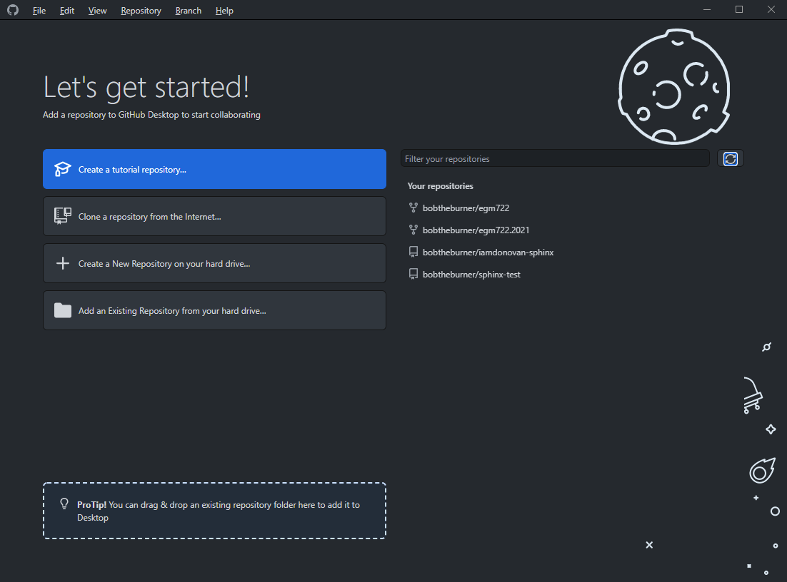
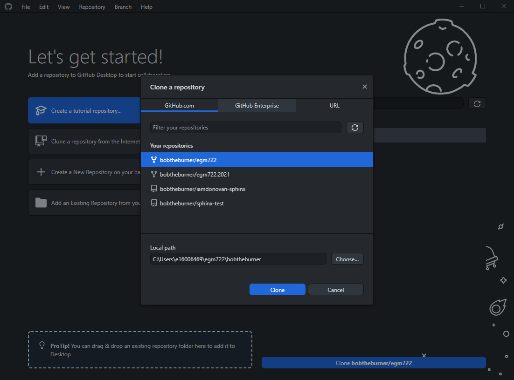
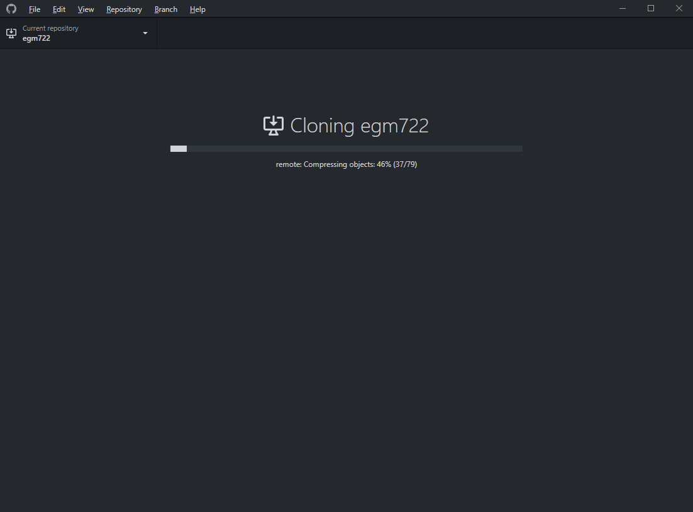

cloning the repository
=======================

Before proceeding, make sure that you read the two boxes below **carefully**.

.. note::

    On this page, there are instructions for two ways to clone the repository: using **GitHub Desktop**, and using the
    **git** command-line interface.

    Choose **ONE** of the two ways to clone the repository - you do not need to clone it twice.

.. warning::

    Windows has something called `controlled folder access <https://learn.microsoft.com/en-us/defender-endpoint/controlled-folders#what-is-controlled-folder-access>`__,
    which protects sensitive folders from being changed by unknown/untrusted programs. This means that if you clone
    your repository to one of these folders (for example, anything on **OneDrive**), you may be unable to run the
    notebooks and scripts for the module.

    For example, you might see an extremely vague error message such as the following:

    .. image:: ../../../img/egm722/setup/clone/onedrive_error.png
        :width: 720
        :align: center
        :alt: a jupyter lab error message that says "File Load Error for PythonIntro.ipynb; Unhandled error"

    |br| This (most likely) means that **jupyter** is unable to write to the repository directory.

    You can still clone your repository to a OneDrive folder, but you will need admin rights to your machine to be able
    to complete the different exercises.

    If you do not have admin rights to your machine, you will need to ask your IT service desk for help, or you will
    need to clone the repository to a directory outside of OneDrive (note that this means outside of folders like
    **~/Documents**, as well!).

    In order to give the specific installation of python from your new **conda** environment permission to write to
    OneDrive folders - this step will need to be completed after you have cloned the repository, and after you have
    :doc:`created your conda environment <environment>`.

    To do this, search for "controlled folder access" in the Windows search bar, then click on "Allow an app through
    Controlled folder access". After entering your admin credentials, click on **Add an allowed app**, followed by
    **Browse all apps**.

    Now, navigate to the folder where your ``egm722`` environment has been created and select **python.exe**.

    Most likely, this is something like:

    .. code-block:: text

        ~/Anaconda3/envs/egm722/python.exe

    where ``~`` is your ``home`` directory (e.g., ``C:\Users\{username}``). Click **Open** to allow this version of
    **python** to write to controlled folders.

    Note that this **only** applies to this version of **python**. If you create another environment, you will need to
    repeat these steps to allow that version of **python** through controlled folder access.

github desktop
---------------

Once you have :doc:`forked<fork>` the repository, you can **clone** (download) your fork to your computer. This will
take a copy of the repository that's saved on **GitHub**, and create a local version on your computer.

To do this, first open **GitHub Desktop** if it isn't open already. You should see something like this (if you haven't,
you may need to login to your **GitHub** account - see :doc:`here<desktop>` for instructions):

|br| You should also see your repository listed under **Your repositories**. Click on
**Clone a repository from the Internet**, and you should see your forked version of the **egm722** repository
(it will be listed as :samp:`<{your_github_username}>/egm722`):

|br| Select a local path to save the repository to, and make a note of the location (you'll need it for all of the
practicals in the module!).

Select **Clone**, and you should see the following:

|br| Finally, you'll see the following:

.. image:: ../../../img/egm722/setup/clone/purposes.png
    :width: 600
    :align: center
    :alt: a dialog asking what you're planning to do with the repository

|br| This is asking you what your purpose is with the repository - whether you want to develop your own version, or if
you plan to contribute to the **upstream** fork. For this module, you won't be contributing to the **upstream** fork
(at least, not regularly), so choose **For my own purposes**, then continue.

Now that you've cloned the repository, you can move on to the next step: :doc:`setting up conda<conda>`

git command-line interface
---------------------------

Open a **Command Prompt**, then navigate to the folder where you want to clone the repository using ``cd``:

.. code-block:: text

    cd c:\Users\bob\projects

Now, enter the following command:

.. code-block:: text

    git clone https://github.com/your_username/egm722.git

.. warning::

    Remember to replace ``your_username`` with your GitHub username!

You should see the following output on the screen:

|br| Now that you've cloned the repository, you can move on to the next step: :doc:`setting up conda<conda>`
