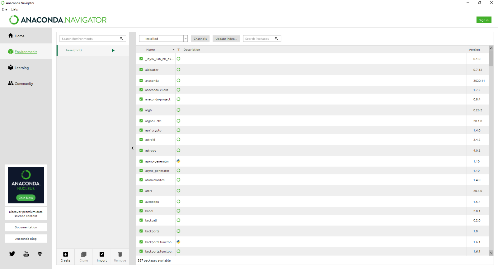
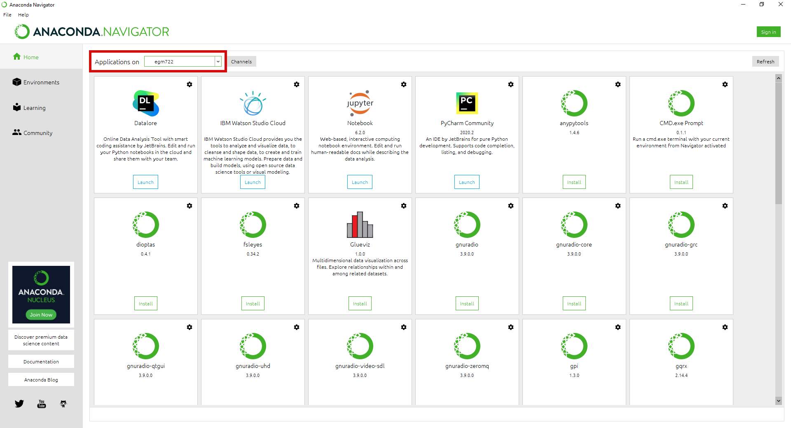

setting up a conda environment
===============================

This page provides instructions for creating a new **conda** environment using **Anaconda Navigator** and the 

.. note::

    You should have already opened a :doc:`GitHub<github>` account, installed :doc:`git<git>` and :doc:`GitHub Desktop<desktop>`, 
    :doc:`forked<fork>` the EGM722 repository, :doc:`cloned<clone>` the repository to your computer, and installed :doc:`Anaconda Navigator<conda>`.

    If you haven’t done all of these steps, please do so now before continuing.

creating a new environment
---------------------------

From the **Start** menu, open **Anaconda Navigator**. When it opens, click on the **Environments** tab on the left-hand side of the
screen. You should see the following:

As mentioned above, conda is a package management system. We can use conda to create different programming environments, which will
enable us to keep track of and manage the specific versions of python packages that we use for this course. It also enables us to easily
share our environment specifications across different computers, so that we be sure that any processing steps that we do are consistent
and reproducible.

We will be creating a new environment using the **environment.yml** file provided in the git repository. A **.yml** file is one of the ways 
that we can easily duplicate environments using **conda** or other package management systems – it provides a list of the packages for the 
package management system to find and install.

Open the **environment.yml** file in a text editor (**NB – this means NotePad, Notepad++ or something similar, NOT MS Word!**). It should look
something like this (the exact list of dependencies may differ somewhat):

Here, you can see the name of the environment (egm722), the ``channels`` to install packages from, listed in order of preference, and the
``dependencies``, or required packages.

From the **Anaconda Navigator** window, click on the **Import** button at the bottom of the **Environments** tab. An import window will open:

.. image:: ../../../img/egm722/setup/environment/import.png
    :width: 400
    :align: center
    :alt: the import window

Click the folder icon to navigate to the **environment.yml** file, select it and click **Open**. The window should now look like this:

.. image:: ../../../img/egm722/setup/environment/import2.png
    :width: 400
    :align: center
    :alt: the import window with the yml file selected

The **Name** field is automatically populated based on the **.yml** file, while the location specified will differ depending on where **Anaconda**
is installed on your computer. Click **Import** to start setting up the environment. Depending on your connection speed and computer’s specifications,
this may take some time. When it finishes, you should see the following screen:

.. image:: ../../../img/egm722/setup/environment/new_environment.png
    :width: 600
    :align: center
    :alt: anaconda navigator with the egm722 environment

Note how many packages were actually installed – 161, from the 5 shown in the original **.yml** file. This is because each of those 5 packages have
additional dependencies which have to be installed as well. Fortunately, almost all of this is done automatically – we don’t have to worry about
tracking down each individual dependency on our own.

installing an IDE
------------------

The next thing to do is to switch to the **Home** tab in **Anaconda Navigator**:

You should see that you have two different environments when you open the dropdown menu next to **Applications on**. Whenever you want to
switch environments in **Anaconda Navigator**, you can select the environment from this menu. You should see that when you change between
the ``base`` and ``egm722`` environments, the list of installed applications changes – this is because we have not installed the same
applications in the different environments.

The next thing to do is to make sure that you have installed an Integrated Development Environment (IDE). This is a program that will help you, 
while programming, to do things like debug code, automatically check for syntax errors, and easily refactor your code.

For example, with a python interpreter set up, it can help you find and autocomplete method or attribute names:

.. image:: ../../../img/egm722/setup/environment/pycharm.png
    :width: 600
    :align: center
    :alt: the pycharm community edition IDE

My personal preference of IDE for python is PyCharm (Community Edition), the free version of the PyCharm Professional IDE. It provides an easy,
automatic interfacing with **conda**, **git**, and **GitHub**. You do not have to install PyCharm, but I strongly recommend that you install
and use an IDE for programming. Other free options include **Spyder** or **Microsoft Visual Studio**, both of which can also interface with **conda**.

**Spyder** can be installed directly from the **Anaconda Navigator**, while you can download PyCharm `here <https://www.jetbrains.com/pycharm/download/>`__
(be sure to download the Community Edition, not the Professional Edition), and Microsoft VS is available from `here <https://visualstudio.microsoft.com/downloads/>`__
(again, be sure to download the Community Edition).

setting up the command prompt
------------------------------

The final step covered in this manual is to install the **CMD.exe Prompt** for this environment:

.. image:: ../../../img/egm722/setup/environment/cmd_prompt.png
    :width: 600
    :align: center
    :alt: anaconda navigator with the CMD.exe button highlighted

While not strictly required, this will enable you to directly launch a Windows Command Prompt with your **egm722** environment loaded. 
If you run the **Anaconda Prompt** from the **Start Menu**, it will automatically load the default (``base``) environment, and you will need 
to switch environments using the ``conda activate`` command when you want to use your **egm722** environment.

Once you have **conda** and an IDE set up, you are ready to move on to the :ref:`lecture<egm722 week1>` and :doc:`practical material<../practicals/week1>` for Week 1.

