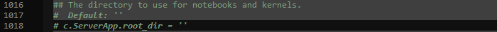
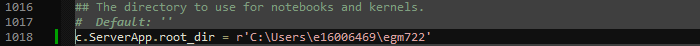

configuring jupyter
====================

By default, **jupyter notebook** will open in your ``home`` directory (on Windows, this is most likely ``C:\Users\<your_username>``.
If you have cloned the repository to a different location (e.g., ``C:\egm722\``, or an external drive such as ``D:\``), 
you may want to set notebook to open to that folder.

To do this, open the **Command Prompt** from **Anaconda Navigator** (make sure that your ``egm722`` environment is active).

At the **Command Prompt**, enter the following command:
::

    jupyter notebook --generate-config

This will create a new folder, ``.jupyter``, in your ``home`` directory, along with a python script in that directory: ``jupyter_notebook_config.py``.

Next, enter the following command:
::

    jupyter --paths

This will show you the path to the version of **jupyter** used by your ``egm722`` environment:

.. image:: ../../../img/egm722/setup/jupyter/jupyter_config.png
    :width: 600
    :align: center
    :alt: the output of jupyter --paths

In the example above, it's:
::

    C:\Users\e16006469\Anaconda3\envs\egm722\etc\jupyter

Now, copy the script ``jupyter_notebook_config.py`` into that folder (you will probably have to create a new folder, ``jupyter``, in
``C:\Users\<your_username>\Anaconda3\envs\etc``).

Open the newly-copied script in your IDE of choice, and search for ``notebook_dir`` - for me, it's at line 385:

Uncomment this line (remove the # and the space from the start), and add the path to your repository here:

Now, save the file, and re-launch **jupyter notebook** from **Anaconda Navigator**, making sure that your ``egm722`` environment is still enabled.
You should see that it opens in your repository folder by default:

.. image:: ../../../img/egm722/setup/jupyter/open.png
    :width: 600
    :align: center
    :alt: jupyter-notebook, open to the newly set default directory

