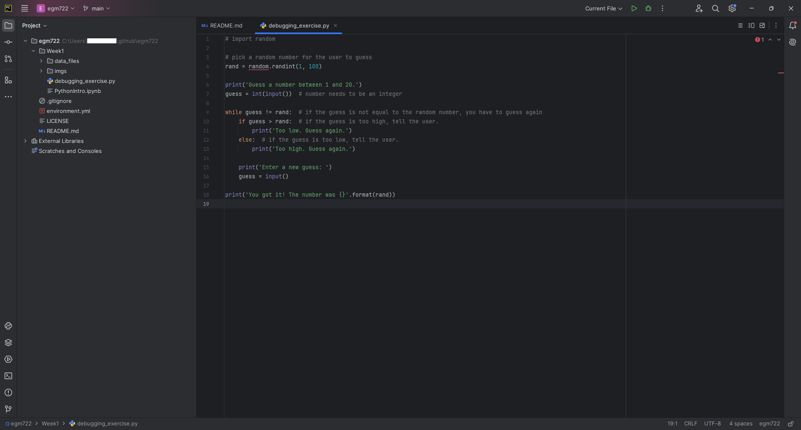

pycharm
========

.. note::

    The instructions here are for setting up PyCharm Community Edition. PyCharm is a powerful Integrated Development
    Environment (IDE) that provides integration with python, conda, and git. In the practicals, you'll see how you
    can use it to write, edit, test, and debug your code.

    You are **not** required to use PyCharm - there are many other good, free, options out there, including VS Code and
    Spyder. Many of the steps for the debugging exercise in Week 1 will be the same, broadly-speaking, for other IDEs.
    If you do use a different IDE, I will do my best to provide help, but just note that it may be some more work to
    get set up.

.. warning::

    Many of the instructions and screenshots shown here are for PyCharm CE 2024.3.4, running on Windows 11, though
    there may be other versions/operating systems shown.

    As such, there may be some slight differences in appearance or menu options between what is shown here
    and the version you download.

downloading and installing
---------------------------

To download PyCharm CE, point your browser to https://www.jetbrains.com/pycharm/download/other.html and select the
version for your current operating system (Windows, MacOS, or linux). Most likely, this will be the one that says
**Windows (exe)**.

.. warning::

    Be sure to download the **Community Edition**, which is free. If you download the professional version, you will
    need to purchase a license once the free trial expires after 30 days.

Once you have downloaded the installer, follow the instructions in the installation wizard. Once the installation has
completed, open PyCharm CE.

.. _create project:

creating a new project
-----------------------

When you first open PyCharm, you should see a screen similar to the following:

.. image:: ../../../img/egm722/setup/pycharm/fresh_open.png
    :width: 500
    :align: center
    :alt: the window that displays when you open pycharm for the first time

|br| Select **Create New Project**, which will open the following window:

.. image:: ../../../img/egm722/setup/pycharm/new_project_blank.png
    :width: 600
    :align: center
    :alt: the new project creation window

|br| For the location, choose the folder where you have cloned the ``egm722`` repository by clicking on the folder icon
and selecting the folder from the tree (in this example, the folder is located in ``C:\Users\{username}\egm722``):

|br| You should also set up a python interpreter for the project - this will enable you to use some of the autocomplete
tools when writing code, run scripts within PyCharm, as well as making use of the debugging tools.

Because you have already set up a conda environment\ [1]_, you can choose this interpreter. Next to
**Interpreter type**, click on **Custom environment**.

Next to **Environment**, click on **Select existing**, and choose **Conda** for **Type**, then select your
newly-created egm722 environment:

|br| You may need to input the path to the **conda** program. On most computers, relative to where you've installed
Anaconda, this will be\ [2]_:

.. code-block:: sh

    ~/Anaconda3/bin/conda

or:

.. code-block:: sh

    ~/Anaconda3/condabin/conda.bat

Once you've set the path to the project, and set up the python interpreter, click **Create**. The following window
should pop up:

.. image:: ../../../img/egm722/setup/pycharm/not_empty.png
    :width: 400
    :align: center
    :alt: a dialog window warning you that the folder is not empty

|br| Select **Create from Existing Sources** to finish creating your new project.

.. note::

    This is the end of the "setup" steps - the rest of the sections of this page provide some more information about
    working in PyCharm, but they aren't required to actually get started on the practicals.

the pycharm interface
----------------------

Once the new project has been created, you should see something like this:

.. image:: ../../../img/egm722/setup/pycharm/pycharm_interface.png
    :width: 720
    :align: center
    :alt: the pycharm interface with the egm722 project opened

|br| The next few sections will provide some additional information about some of the features of PyCharm.

the file browser
..................

On the left side of the **PyCharm** window, you should see a file browser (note that you may need to click on the
**Project** tab to expand the frame).

Here, you can see all of the files and folders included in the project. To open a script or other file, double-click on
it in the file browser. For example, here is ``debugging_exercise.py``:

creating a new script
......................

You can also create a new file by right-clicking in the file browser and selecting **New**, followed by the file
type. To create a new python script, it would be: right-click > **New** > **Python File**.

Type the name of the new script in the box that appears, and press **Enter**.

.. warning::

    Remember to include the extension (``.py``) as part of the filename!

PyCharm interfaces with **git** to help you keep track of your projects, so it asks you if you want to add the file to
**git**. Click **Add** to do this, and you should see the new file appear in the file browser, and in the main panel:

using git
..........

Note that the filename is colored in green, indicating that the file has been *staged* by **git**. Just like with
**GitHub Desktop**, we can use PyCharm along with git to keep track of changes to our files.

Under the **Project** tab, you should see a **Commit** tab - click this to bring up the list of current changes:

|br| In the list of current changes, we can see that one file has been affected: ``new_script.py``.

Before we press **Commit**, we should first write a commit message, which we can do in the lower box of the panel:

|br| Select the file(s) that you want to commit, then press **Commit**. You should see the filename change from green
to white.

Now, when you make changes to the file, the color will change again, this time to blue:

.. image:: ../../../img/egm722/setup/pycharm/changes.png
    :width: 720
    :align: center
    :alt: the pycharm interface showing the file name change from white to green, indicating uncommitted changes

|br| This indicates that we have unstaged and uncommitted changes to the file\ [3]_. We don't need to commit every small
change that we make, but it's a idea to do this regularly, and to **push** the changes to the remote repository
(so that they're backed up). Don't worry about all of this now - we will come back to these ideas over the course of
the module.

terminal interface
....................

Along the bottom of the PyCharm window, you should see a number of tabs, including one that says **Terminal**. Click
this to open a **Terminal** (**Command Prompt**):

.. image:: ../../../img/egm722/setup/pycharm/terminal.png
    :width: 720
    :align: center
    :alt: the pycharm interface with the terminal window open

|br| You can use this in the same way that you would the "normal" **Command Prompt**.

.. note::

    If you instead see a **Powershell** terminal:

    .. image:: ../../../img/egm722/setup/pycharm/powershell.png
        :width: 720
        :align: center
        :alt: the pycharm interface with the terminal window open showing a powershell terminal

    Open up the **Settings** window (**File** > **Settings**), then click on **Tools** > **Terminal**:

    .. image:: ../../../img/egm722/setup/pycharm/terminal_settings.png
        :width: 600
        :align: center
        :alt: the terminal settings window in pycharm

    Replace the current **Shell path** with:

    .. code-block:: text

        cmd.exe /K {conda_prefix}\Scripts\activate.bat {conda_prefix}

    where ``{conda_prefix}`` is the folder where you have installed **conda**.

    If you don't know where this is, you can check by entering the following command in the **Command Prompt**:

    .. code-block:: text

        echo %CONDA_PREFIX_1%

    Once you have done this, close the current terminal by clicking the ``X`` next to **Local**. Next, re-open the
    **Terminal** tab - you should see an **Anaconda Command Prompt**:

    .. image:: ../../../img/egm722/setup/pycharm/terminal.png
        :width: 720
        :align: center
        :alt: the pycharm interface with the terminal window open

If you have configured an interpreter for your project, it may open as an **Anaconda Command Prompt** with that
environment activated. If not, you can run the following:

.. code-block:: sh

    conda activate egm722

To activate the environment. You can then use the **Terminal** to run scripts in that environment:

python console
................

Above the **Terminal** tab, you should also see a **Python Console** tab:

.. image:: ../../../img/egm722/setup/pycharm/python_console.png
    :width: 720
    :align: center
    :alt: the pycharm interface with the python console window open

|br| This opens an **iPython** (**i**\ nteractive **Python**) console, which you can use in the same way that you
would use the cells of a **jupyter** notebook (or a python interpreter):

.. image:: ../../../img/egm722/setup/pycharm/console_output.png
    :width: 720
    :align: center
    :alt: the pycharm interface with the python console window open, and the statement 2 + 2 (output 4)

more resources
................

That ends the "tour" of PyCharm - there are many, many more features available, but this should provide enough to
get you started. If you're interested in learning more of the features, here are a few links to get you going:

- Quick start guide [`JetBrains <https://www.jetbrains.com/help/pycharm/quick-start-guide.html>`__]
- Quick Tour [`JetBrains <https://www.youtube.com/watch?v=BPC-bGdBSM8>`__]
- Pycharm Tutorial #1 [`Tech With Tim <https://www.youtube.com/watch?v=56bPIGf4us0>`__]

.. _adding interpreter:

adding an interpreter
----------------------

If you didn't add an interpreter to your project, don't panic. If you want to add an interpreter to an existing
project, or even change the interpreter for the project, there's a way. In the lower right-hand side of the window,
you should see something that says "Python 3.8" (or something similar). Click on this to open the interpreter menu:

.. image:: ../../../img/egm722/setup/pycharm/interpreter_menu.png
    :width: 300
    :align: center
    :alt: the interpreter menu

|br| Select **Add Python Interpreter**. In the window that opens up, select **Conda Environment**, followed by
**Existing environment** - you should see something like the following:

.. image:: ../../../img/egm722/setup/pycharm/add_interpreter.png
    :width: 600
    :align: center
    :alt: adding an existing conda environment

|br| You'll need to provide the path to the python interpreter that is part of your ``egm722`` conda environment - on
most computers, relative to where you've installed Anaconda, this will be:

.. code-block:: sh

    ~/Anaconda3/envs/egm722/bin/python

(or, if you're on Windows, ``python.exe``). You will also need to supply the path to the ``conda`` executable
(program) that's installed on your computer - again, on most computers, relative to where you've installed
Anaconda, this will be:

.. code-block:: sh

    ~/Anaconda3/bin/conda

(or, if you're on Windows, ``conda.exe``). You can also click the **Make available to all projects** checkbox, which
will help you more easily add this interpreter to other new projects. Click **OK** to return to the previous window.

changing the interpreter
-------------------------

To change which python interpreter your project uses, open the Interpreter menu by clicking on it in the
lower right-hand side of the window:

.. image:: ../../../img/egm722/setup/pycharm/interpreter_menu.png
    :width: 300
    :align: center
    :alt: the interpreter menu

|br| Select **Interpreter Settings**, which will open the Interpreter Settings window:

.. image:: ../../../img/egm722/setup/pycharm/interpreter_settings.png
    :width: 600
    :align: center
    :alt: the interpreter settings window

|br| To change the interpreter, you can select a different one from the drop menu. If you don't see the interpreter you
want, scroll to the bottom of the menu and select **Show all**. This will bring up the following window
(note that your list will not be the same as this one):

.. image:: ../../../img/egm722/setup/pycharm/interpreters_list.png
    :width: 500
    :align: center
    :alt: a list of all of the available interpreters

|br| Select the desired interpreter from this list. If you don't see it there, you can click the **+** button to add
the new interpreter, following the steps outlined :ref:`above <adding interpreter>`.

notes and references
-----------------------

.. [1] Assuming that you have followed the setup steps in order, that is.

.. [2] The ``~`` symbol is used to denote the "home" directory for a user. On Windows, this would be ``C:\Users\user``.
    On MacOS, this is ``/Users/user``, and on linux it is ``/home/user``.

.. [3] Other colors include red, which indicates files that are not tracked by **git**, and yellow/amber, which
    indicates files that are ignored by **git** (i.e., included in the ``.gitignore`` file).
